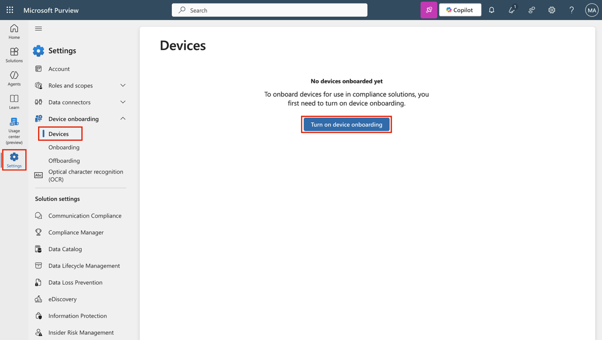
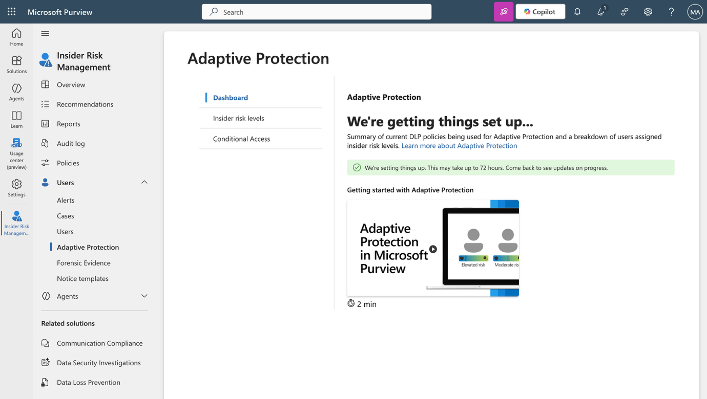

**实验室设置 – 为管理环境做好准备**

在这个实验室中，你将配置并准备环境以应对管理任务。您将启用所需功能，配置权限，并准备核心服务进行管理。

**任务：**

1.  在 Microsoft Purview 门户中启用审计功能

2.  启用设备引导

3.  支持内部风险分析和数据共享

4.  初始化 Microsoft Defender XDR

5.  在 Microsoft Entra 中配置多因素认证

6.  支持自适应保护

**练习 1 - 在 Microsoft Purview 门户中启用审计功能**

在此任务中，您将启用 Microsoft Purview 门户中的审计功能，以监控门户活动。

1.  用你**实验室环境资源标签中提供的管理员账户凭证**登录虚拟机。

2.  在**Microsoft Edge**中，进入 https://purview.microsoft.com 并登录为**MOD管理员**，admin@TenantName（租户名和管理员密码应在实验室环境的资源标签中提供）。

3.  屏幕上将显示关于新 Microsoft Purview 门户的消息。选择**开始**访问新门户。

> 

4.  从左侧边栏选择**解决方案**，然后选择**审计**。

> 

5.  在**搜索**页面，选择**“开始记录用户和管理员活动**”栏以启用审计日志。

> 

6.  选择此选项后，蓝色条应该会从该页面消失。

> 

您已成功启用Microsoft 365中的审计功能。

**练习 2 – 启用设备引导**

在此任务中，您将为组织启用设备入职。

1.  你仍然应该以**管理员**账户登录虚拟机，并在Microsoft Purview中以MOD管理员身份登录。

2.  从 左侧边栏选择设置，然后展开**设备入职**。

3.  在**设备入驻**页面，选择**设备**。

> 

4.  在**设备**页面，选择**“开启设备引导**”，然后选择**确定**确认。

> 

5.  提示时，选择**确定**确认设备监控已被打开。

> 

您现在已启用设备引导，可以开始为设备进行端点DLP策略保护。启用该功能的过程可能需要长达30分钟。

**练习 3 – 支持内部风险分析和数据共享**

在这项任务中，你将启用内部风险管理的分析和数据共享功能。

1.  在 Microsoft Purview 中，导航至**Settings** \> **Insider Risk Management** \> **Analytics**.

> 

2.  将这些设置切换为**开启**：

    - **Show insights at tenant level**

    - **Show insights at user level**

3.  在页面底部**选择**保存。

> 

4.  在左侧导航面板**选择**“数据共享”。

> 

5.  在数据共享部分，切换**“Share user risk details with other security solutions** ”至**“On**。

6.  在页面底部**选择**保存.

> 

您已启用内部风险管理的分析和数据共享功能。

**练习 4 – 初始化 Microsoft Defender XDR**

在这个任务中，你将进入 Microsoft Defender，等待 Microsoft Defender XDR 初始化。

1.  在 **Microsoft Edge** 中，导航到 https://security.microsoft.com/ 以打开 Microsoft Defender。

2.  在导航面板中，选择**Investigation & response** \> **Incidents & alerts** \> **Incidents**.

> 
>
> \[!Note\] **注意：Microsoft Defender XDR 初始化**
>
> Microsoft Defender XDR初始化界面可能会显示，也可能不会，取决于你的实验室租户。

3.  你会看到一条消息，说 Microsoft Defender XDR 正在准备中。该过程自动运行，可能需要几分钟时间。

> 

Microsoft Defender XDR 正在初始化中。你可以在它完成设置时继续做其他任务。

**练习 5 – 在 Microsoft Entra 中配置多因素认证**

在此任务中，您需要为管理员账户配置多因素认证（MFA），以保障对 Microsoft Entra 及其他连接的 Microsoft 365 服务的访问。

1.  在 **Microsoft Edge** 中，导航到 https://entra.microsoft.com/ 打开 Microsoft Entra 并使用管理员凭证登录。在“让我们保护你的账户安全”提示中，选择**下一步**。

> 

2.  在“**开始获取应用**”界面时，从你的设备应用商店安装 **Microsoft 身份验证器**应用，或者如果已经安装了，请打开它。选择**下一步**。

> 

3.  如果你喜欢不同的应用，可以选择**“**select **I want to use a different authenticator app** ”，并按照屏幕上的指示作。

4.  在“**设置您的账户**”界面，按照手机上的指示允许通知，然后选择**“下一步**”。

> 

5.  如果你已经安装并配置了 Microsoft Authenticator 应用，可能看不到这个界面。如果是这样，就继续下一步。

6.  在扫描**二维码**界面，使用设备上的Microsoft身份验证器应用扫描屏幕上显示的二维码，然后选择**“下一步**”。

> 

7.  在手机上，输入浏览器显示的号码，批准登录请求。

8.  批准请求后，将出现**“已批准通知**”界面。选择**下一步**。

9.  关于**成功！** 屏幕，确认你的**默认登录方式**显示**的是 Microsoft 身份验证器**，然后选择**完成**。

10. 当再次被要求登录时，请在手机上批准登录请求以验证身份。

11. 批准完成后，您将被重定向到**Microsoft Entra管理中心**。

你已经成功配置并验证了Microsoft Entra中管理员账户的多因素认证。

**练习 6 – 支持自适应保护**

1.  在Microsoft Edge中，导航到 https://purview.microsoft.com，并以MOD管理员**身份登录透视门户**。

2.  在左侧导航面板中，选择**Solutions** \> **Insider risk management** \> **User** \> **Adaptive Protection**.然后选择**Dashboard**. 选择 **Quick setup**.

> 

3.  它会显示一条消息，说我们正在设置。启用需要72小时。我们将在第八个实验室中使用它，探索自适应保护功能。

> 

4.  选择**“自适应保护设置”**标签，并打开自**适应保护**切换按钮。选择**保存**。

> 

你已经成功启用了Microsoft Purview中的自适应保护。
