**Lab 1 – 分配合規角色和管理 Office 365消息加密**

**介紹:**

Microsoft Purview 門戶支持直接管理在 Microsoft Purview 內執行任務的用戶權限。通過門戶設置中的角色和範圍區域，您可以管理Purview數據安全、數據治理以及風險與合規解決方案中的權限。你可以限制用戶只執行你明確授權的任務。

**目標:**

- 在 Microsoft 365 中為用戶分配經理和合規角色。

- 創建Microsoft 365和安全組以促進團隊協作。

- 啟用Microsoft Purview合規評估的試用。

- 驗證並配置 Azure RMS 用於 Office 365 消息加密。

- 修改默認的OME模板，禁用社交ID訪問。

- 測試無社交登錄的加密郵件投遞。

- 為財務團隊創建並應用定制的OME品牌模板。

- 制定郵件流規則來加密財務部門的郵件

- 在加密消息中添加免責聲明

- 啟用郵件流規則

- 驗證消息加密

**練習 1 - 管理合規崗位**

在本次演練中，我們將激活所有實現Microsoft Purview安全所需的試用許可證。

**任務 1 – 向現有用戶添加管理器角色。**

1.  用實驗室提供的賬戶信息登錄虛擬機。

2.  打開**Microsoft Edge**，進入Microsoft 365管理中心，https://admin.microsoft.com，並**使用管理員憑證**登錄為MOD管理員。

> \[!Note\] **注釋: 跳過 Microsoft 365 管理中心的多重身份驗證**
>
> 在某些租戶中，登錄時你可能會看到門戶多重身份驗證（MFA）執行提示。如果出現這個提示:

- 選擇 ** Skip for now** 以暫時延遲多重身份驗證設置。

- 在 **Let us know why you're skipping MFA** 對話中, 選擇任意對方，然後選擇 **Send and skip**.

> 這推遲了租戶在 Microsoft 365 管理中心的 MFA 執行，允許你繼續實驗室工作。

3.  從左側窗格選擇**Users** \> **Active users**, 點擊第一個用戶 **Adele Vance**.

> 
>
> 在 **Manager**下點擊 **Edit manager**.
>
> 

4.  刪除當前經理，在搜索框中輸入Patti。精選 **Patti Fernandez**. 點擊**Save Changes**.

> 

5.  將管理員更改為 **Patti Fernandez**，適用於以下所有用戶。

    1.  Adele Vance

    2.  Christie Cline

    3.  Megan Bowen

6.  對於 **Patti Fernandez**，請將**MOD Administrator**加入為經理。

**任務 2 – 分配行政職務**

1.  選擇用戶 **Patti Fernandez**，在 **賬戶**下滾動到**角色**，點擊**管理角色**。

> 

2.  **Roles** 面板打開後，點擊**Admin center access** 附近的單選按鈕，並展開**“Show all by category”。**

> 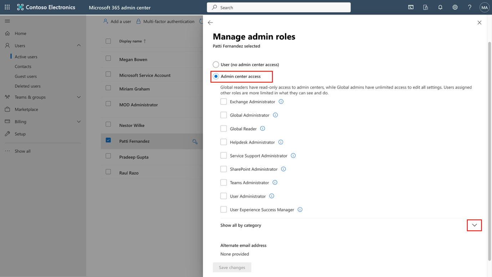

3.  在 **Security & Compliance** 類別, 選擇 的複選框 **Compliance Administrator**, **Security Administrator**, 和 **Application Administrator** 然後,在飛出面板底部選擇 **Save changes** 。 點擊 **Save changes**.

> 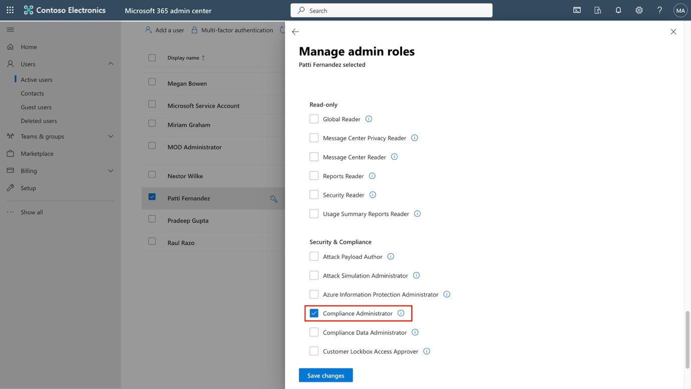

4.  關閉窗格，保持在同一頁面，繼續下一個任務.

**任務 3 – 在 Microsoft 管理中心創建團隊和組**

1.  現在擴展  **團隊與組別**, 選擇 **Active teams & groups ，在** **Teams & Microsoft 365 groups**下點擊 **Add a Microsoft 365 group** 

> 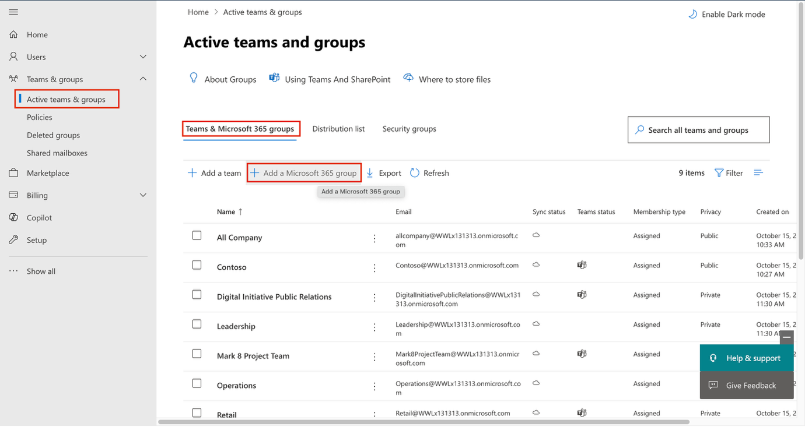

2.  在**Name** 字段, 輸入 Contoso Finance Team, 在 **Description ** 字段中輸入“This team handles finance”。然後點擊**“Next**”。

> 

3.  在**Assign Owners** 頁面, 點擊 **Assign owners**, 在旁邊勾選框 **Adele Vance**, 點擊 **Add（1）** 。點擊**“Next**”。

> 

4.  在“**Add members**”頁面，添加**Adele Vance**和**Christie Cline**為成員，點擊**“Next**”。在**“添加成員**”頁面，選擇 **“Next**”。

5.  用於群組電子郵件地址 contosofinance 然後點擊 **“Next**”。

> 

6.  點擊 **Create group**.

> 

7.  完成後，點擊 **Close**.

> 

8.  在 **Active teams & groups page**, 選擇 **Security groups** 標簽頁. 選擇 **Add a security group.**

> . 

9.  重複這些步驟，用以下信息創建另一個組。

    - 在設置**基礎**信息中，輸入以下內容

> **名稱**字段：EDM_DataUploaders。

- 在**描述**字段中輸入 People who will upload data for EDM.

- 選擇 **Next**.

- 在**設置**頁面，選擇**“下一步**”。

- 在**Review and finish adding group** 頁面，檢查你的設置並選擇 **Create group**.

- 當 **New group created** 頁面顯示後，選擇關閉按鈕。

- 現在選擇新創建的 **EDM_DataUploaders** 名單上的小組。

- 在 **“Members ”**標簽下，選擇 **“View all and manage owners” 和管理所有者**“，並添加 **Patti Fernandez** 和 **Christie Cline**。

- 

- 同樣地，加加法 **Patti Fernandez** 和 **Christie Cline** 作為成員。

> 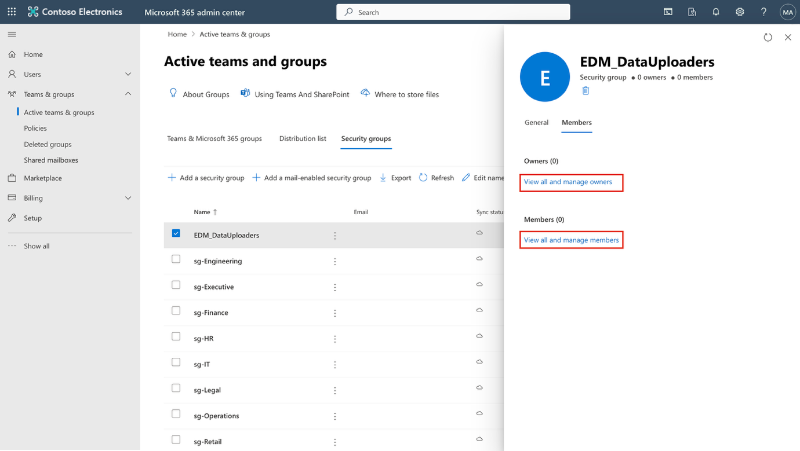

**練習 2 – 管理 Office 365 消息加密**

**任務 1 – 制定郵件流規則來加密財務部門的郵件**

在此任務中，您將使用 Exchange 管理中心創建郵件流規則，將 Microsoft Purview 消息加密應用于財務團隊成員發送的所有郵件。

1.  在 **Microsoft Edge**, 轉到 https://admin.exchange.microsoft.com and sign in as PattiF@TenantName.

2.  在左側導航面板中, 展開 **Mail flow**, 然後選擇 **Rules**.

> 

3.  在 **Rules** 頁面, 選擇 **+ Add a rule** \> **Apply Office 365 Message Encryption and rights protection to messages**.

> 

4.  在 **Set rule conditions** 頁面, 配置:

    - **名字:** Encrypt messages from Finance department

    - 在 **Apply this rule if** 部分, 配置:

      - 下拉選單 1: **The sender**

> 

5.  對於下拉菜單2：**is a member of this group**, 然後選擇**Finance Team** 和 Select 會員**的儲蓄**活動。

> 
>
> 
>
> 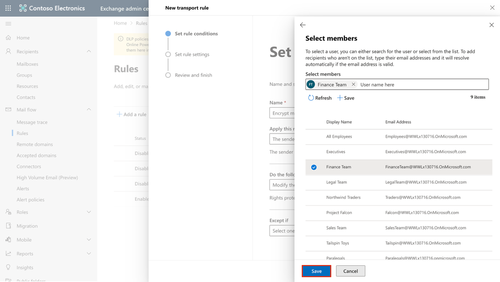

- 在 **Do the following** 部分:

  - 保留默認選項**：modify the message security**，並**選擇  Apply Office 365 Message Encryption and rights protection**

> 

- 在 “**Do the following 部分**下選擇 ** Select one** 鏈接。

> 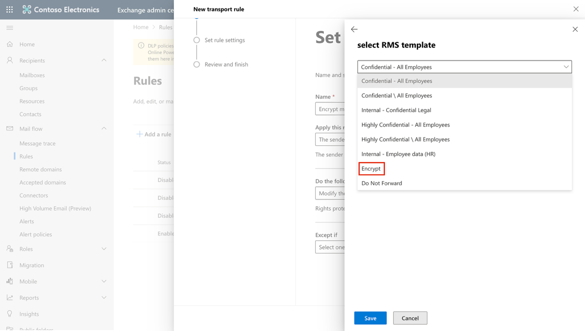

- 在 **Select RMS template** flyout, 選擇 **Encrypt**, 然後選擇 **Save**.

> 

- 選擇 **下一個**返回集合 ** Set rule conditions** 頁面。

> 

5.  在“** Set rule settings**”頁面，保持默認選項為選項，然後選擇**“Next**”。

> 

6.  在 “** Review and finish **”頁面，查看你的郵件流規則，然後選擇 **Finish**。

> 

7.  創建郵件流規則後 **Done ** 完成。

> 

您已成功創建了一個郵件流規則，使用Microsoft Purview消息加密技術加密財務部門發送的郵件。這確保敏感的財務溝通在離開組織前得到保護。

**任務 2 – 在加密消息中添加免責聲明**

接下來，你將修改現有的加密規則，添加免責聲明。該免責聲明作為一種簡單的信息品牌化形式，通知收件人該信息由Contoso Ltd.安全發送。

1.  在 **Rules **頁面，選擇財務部門新創建**的 Encrypt messages from Finance department. **

> 

2.  在“ **Encrypt messages from Finance department**  **”**窗口中，選擇 **Edit rule conditions. **。

> 

3.  選擇**“ Do the following**”部分右側的**+**鍵以添加另一個動作。

> 

4.  在新設立的**“And”部分** :

    - 下拉選單 1: **Apply a disclaimer to the message**

> 

- 下拉選單 2: **append a disclaimer**.

> 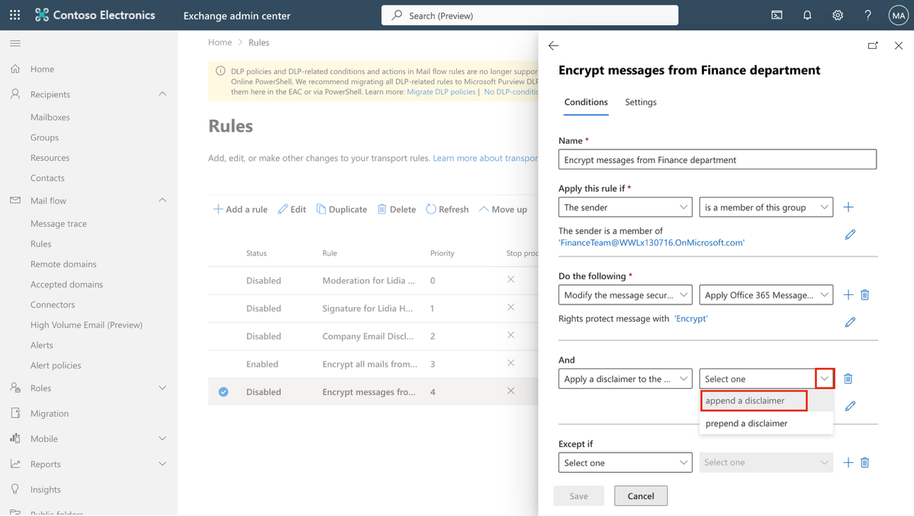

- 在下拉菜單下，選擇 **Enter text**.

> 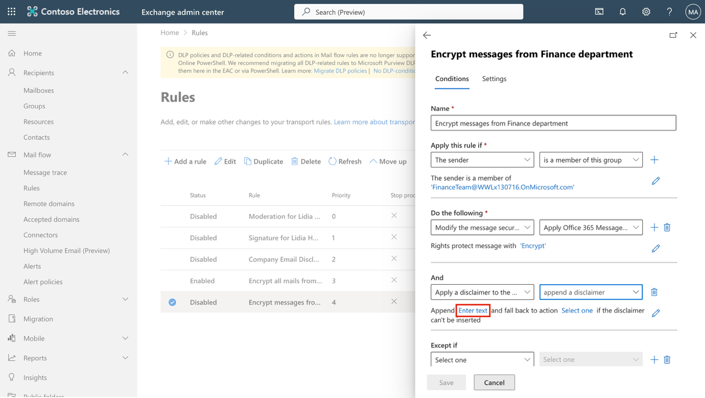

- 那就進去This email has been encrypted and sent securely by Contoso Ltd. 在 **specify disclaimer text** 中。

- 在飛出窗口底部選擇 **Save** 。

> 

- 選擇 “Select one” 鏈接以添加備用作。

- 在  **specify fallback action** 的跳板中，選擇**“Wrap**”，然後在 **跳出頁底部**選擇 **Save** 。

> 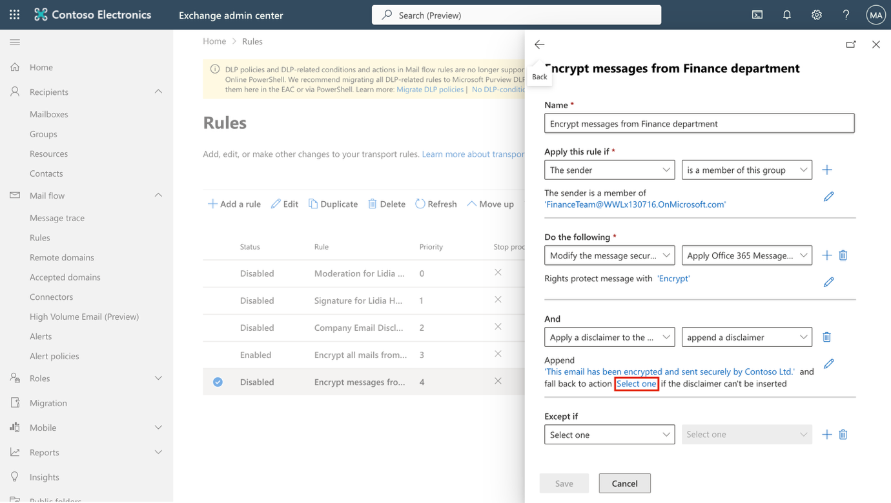

5.  在底部  **Encrypt messages from Finance department** flyout 選擇**“Save **。

> 

6.  規則更改後，你會看到一條消息說 **Transport rule updated successfully. **。

> 

7.  通過選擇 **Done**關閉飛出。

> 

你已經更新了加密規則，在每個受保護消息後附加了免責聲明。這讓收件人清楚知道郵件是加密的，並由Contoso有限公司安全傳輸。

**任務 3 – 啟用郵件流規則**

默認情況下，新的郵件流規則是在禁用狀態下創建的。在這項任務中，你將啟用加密規則，以便開始保護來自財務部門的消息。

1.  在 **Rules **頁面，選擇**“Disabled **”以獲取新創建**的 Encrypt messages from Finance department. **。

> 

2.  **在Encrypt messages from Finance department ，將 Enable or disable rule** 下的開關設置為**啟用**。

> 

3.  郵件流規則會自動啟用。您將看到一條消息，提示更新 **規則狀態，請稍候......**。一旦規則啟用，你會看到一條提示，說**規則狀態已成功更新**。

> 

4.  關閉飛出時，選擇 **右上角**的X。

> 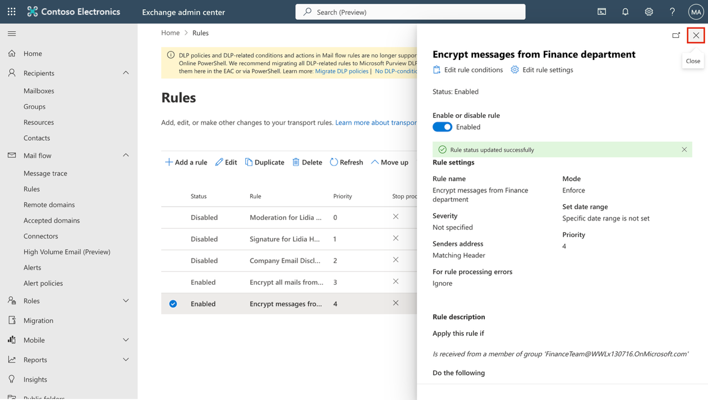

**注釋**: 規則傳播變更可能需要幾分鐘才能應用。如果驗證失敗，等待幾分鐘再發送測試。

加密規則現已生效，並對財務部門發送的消息執行Microsoft Purview消息加密。未來來自Finance用戶的任何消息都將自動加密，並包含Contoso有限公司的免責聲明。

**任務 4 – 驗證消息加密**

在這項任務中，你將發送一封來自財務部門成員的測試郵件，以確認Microsoft Purview消息加密已自動應用，並且收件人是否看到了安全消息通知。

1.  通過任務欄右鍵點擊 Microsoft Edge 並選擇**新的 InPrivate 窗口**，在 InPrivate 窗口中打開 **Microsoft Edge**。

2.  導航至此 https://outlook.office.com 並登錄Outlook網頁版，作為 AdeleV@TenantName.

3.  在**Stay signed in?** 窗口中，選擇“ **Don't show this again“ 的複選框** ，然後選擇**“不**”。

4.  在網頁版的Outlook中，選擇 **New mail**.

> 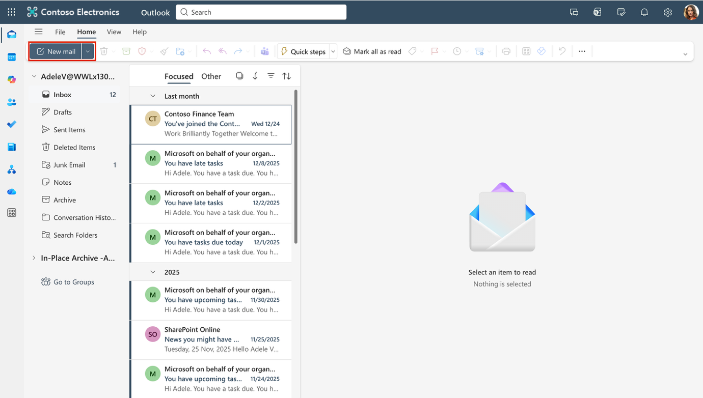

5.  在**“收件人**”欄輸入你個人或其他不在租戶域名中的第三方郵箱地址. 在主題欄輸入“Secret Message ”和“ My super-secret message”。 在郵件正文中。

6.  選擇 **Send** 發送消息。保持Outlook窗口開著。

> 
>
> 在新窗口登錄您的個人郵箱，打開阿黛爾·萬斯的消息。如果你把消息發到Microsoft賬號（比如@outlook.com），郵件可能會自動打開。如果你把郵件發到其他郵箱服務，比如（@gmail.com），你可能需要執行下一步來處理加密並閱讀郵件。

7.  選擇 **Read the message**.

> 

8.  選擇 **Sign in with a One-time passcode** 以接收限時密碼。

9.  進入你的個人郵箱，打開郵件，主題為 **“Your one-time passcode to view the message 。**

10. 複製密碼，粘貼到門戶，然後選擇 **Continue**。

11. 審查加密消息。您應該會看到 “**This email has been encrypted and sent securely by Contoso Ltd。”郵件**底部留言。

您已成功驗證財務部門的消息自動加密，並附帶Contoso免責聲明，確認Microsoft Purview消息加密功能正常運行。

**總結:**

在這個實驗室裡，我們成功複製了一個管理中心的組織，分配了合適的許可證，並學習如何使用 Microsoft 365 內置的 Office 365 消息加密（OME）。
