**實驗室 2 – 管理敏感信息類型​**

**介紹**

Contoso 有限公司此前曾遇到員工在工單支持工單處理時意外發送客戶個人信息的問題。

為了未來教育用戶，需要自定義敏感信息類型來識別電子郵件和文檔中的員工ID，這些文件由三個大寫字符和六個數字組成，使用敏感信息類型。為降低誤報率，將使用關鍵詞“員工”和“ID”。

**目標**

- 使用正則表達式和關鍵詞列表**創建**  **custom sensitive information type**。

- 利用結構化員工數據**配置並定義  EDM-based sensitive info type**。

- 將員工數據哈希並上傳到  **EDM Upload Agent** 進行分類。

- 構建**基於 keyword dictionary-based sensitive info type **，以識別機密的健康相關術語。

- 在應用到政策之前，測試並驗證自定義敏感信息類型的準確性。

**練習 1 – 創建自定義敏感信息類型**

在本練習中，您將使用 **Security & Compliance Center PowerShell** 模塊創建一種新的自定義敏感信息類型，識別“Employee”和“ID”關鍵字附近的員工ID模式。

1.  在你的 Edge 瀏覽器中打開一個 InPrivate 窗口，在地址欄輸入以下 URL，打開 Microssoft Purview 門戶：https://purview.microsoft.com，然後 **用**資源標簽頁上的用戶名 **PattiF@TenantName** **和用**戶密碼登錄為 **Patti Fernandez。**

> 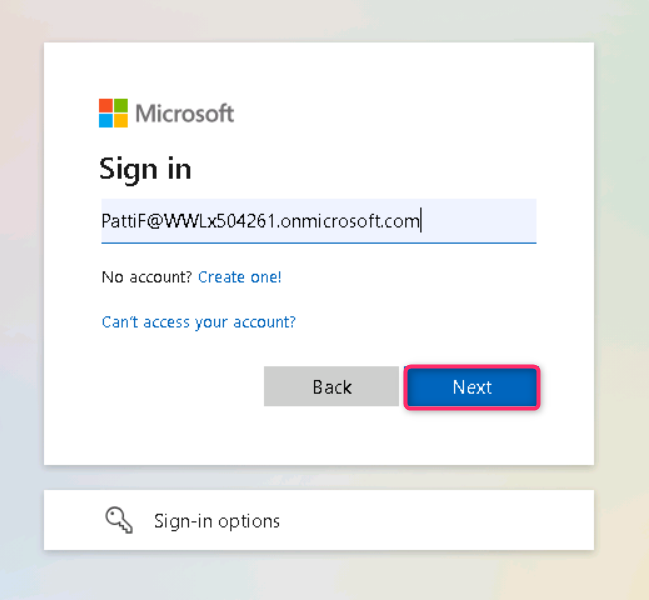
>
> 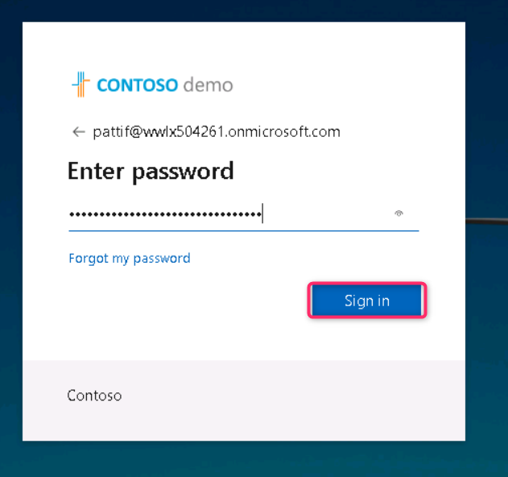

2.  如果  **Welcome to the new Microsoft Purview protal!** 對話框出現, 然後點擊**“開始**使用”按鈕

> 

3.  從左側導航中選擇**Solutions** \> **Data Loss Prevention**.

> 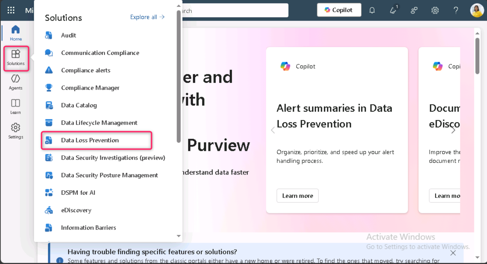
>
> **注釋**: 如果你在解決方案列表中沒有看到 ** Data Loss Prevention**，請等待幾分鐘後重新上傳頁面。如果解決方案列表中仍然沒有看到數據丟失防止，請使用普通（正常）瀏覽窗口登錄。

4.  從左側面板選擇 **Classifiers **。 **在子導航面板中**選擇 **Sensitive info types**。選擇 **+ Create sensitive info type** 以打開新的敏感信息類型嚮導。

> 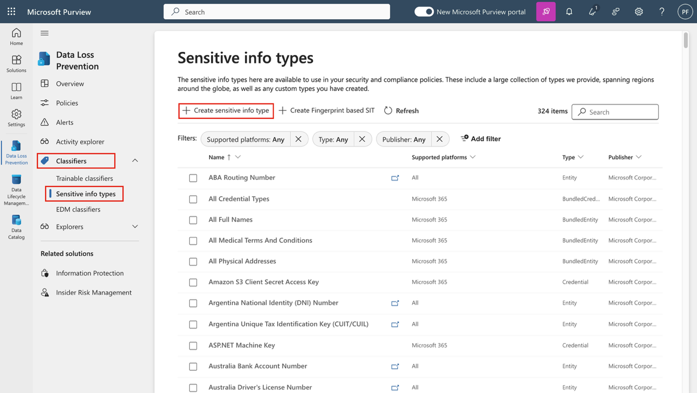

5.  在 **Name your sensitive info type** 頁面, enter the following information:

    - **名字**: Contoso Employee IDs

    - **描述**: Pattern for Contoso employee IDs

6.  選擇 **Next**.

> 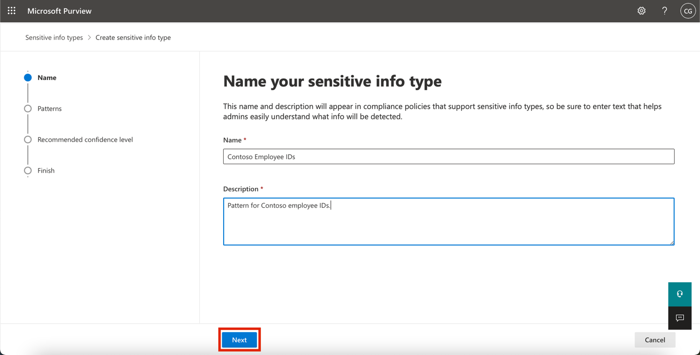

7.  在 **Define patterns for this sensitive info type** 頁面, 選擇 **Create pattern**.

8.  在 **New pattern** 右側的面板，選擇 **Add primary element** 並選擇 **Regular expression**.

9.  在新的右側面板中 **Add a regular expression**, 請加入以下內容：

    - **ID**: Contoso IDs

    - **Regular expression**: \s\\A-Z\\{3}\\0-9\\{6}\s

    - Select **String match**

10. 選擇 **Done**.

11. 在新模式面板中，減少**Character proximity** value to ***100*** characters.

> 
>
> 

12. 導航至 **Supporting elements**  標題, 點擊**+ Add supporting elements or group of elements** 下拉菜單並選擇 **Keyword list**.

> 

13. 在**Add a keyword list** 窗口, 請加入以下內容：

    - **ID**: Employee ID keywords

    - **Case insensitive**:Employee ID

> 

14. 向下滾動，選擇  **Word match** 旁邊的單選按鈕。 然後，點擊**“Done**”按鈕。

> 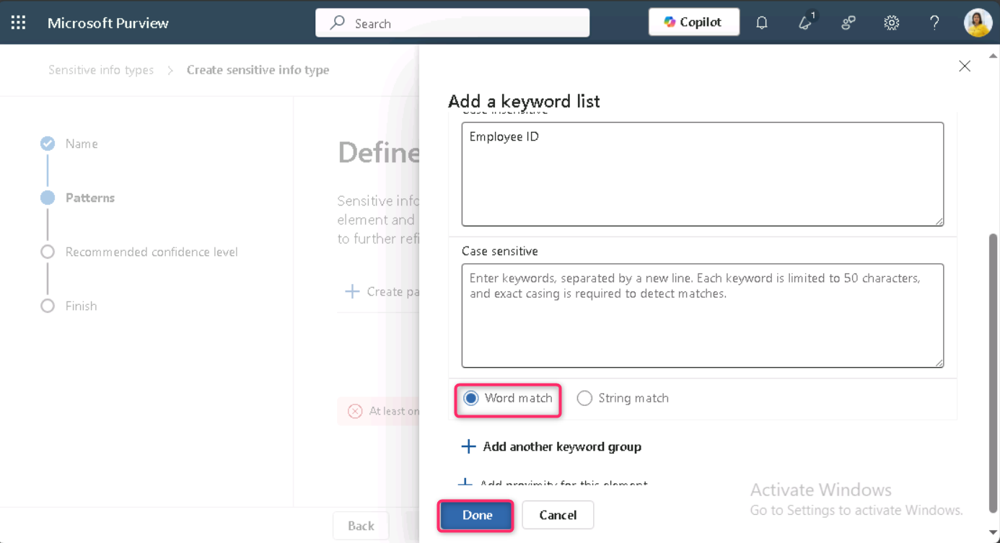

15. 現在，點擊 **“Create **”按鈕。

> 

16. 在 **Define patterns for this sensitive info type** 頁面選擇 **Next**.

> 

17. 在 **Choose the recommended confidence level to show in compliance policies**頁面, 使用默認值，然後選擇**“下一步”按鈕。**

> 

18. 在 **Review settings and finish** 頁面查看設置並選擇**創建**。 成功創建後選擇**完成**。

> 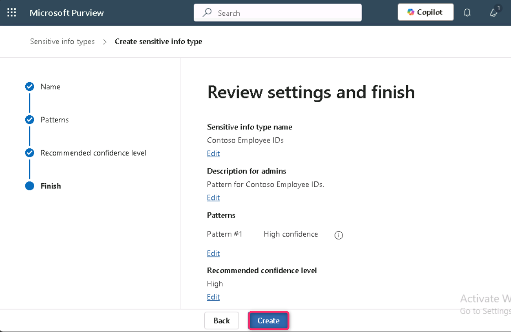
>
> 

19. 保持瀏覽器窗口開啟.

您已成功創建一種新的敏感信息類型，用於識別員工ID，採用三個大寫字符、六個數字以及100字符範圍內的關鍵詞“Employee”或“IDS”。

**練習 2 – 創建基於 EDM 的分類信息類型**

作為額外的搜索模式，你將創建一個基於EDM的分類，並建立一個員工數據的數據庫模式。數據庫源文件將採用以下員工數據字段格式：姓名、出生日期、街道地址和員工ID。

1.  點擊“解決方案”，然後選擇 **Data Loss Prevention**

> 

2.  點擊 **“Classifiers**”，然後選擇**EDM分類器**。在EDM分類器頁面，點擊**新 New EDM experience**即可 **Off**

> 

3.  然後點擊 **Create** **EDM schema**

> 

4.  在 **Name** 字段, 輸入 employeedb.

5.  在 **Description** 字段, 輸入 Employee Database schema.. 取消勾選**Ignore delimiters and punctuation for all schema fields**.

> 
>
> 

6.  在第一個模式字段名稱中輸入名稱，標記 **Field is searchable **框。

> 

7.  點擊下拉菜單 **Choose delimiters and punctuation to ignore** 並 **Hyphen**, **Period**, **Space**, **Open parenthesis** 和 **Close parenthesis**.

> 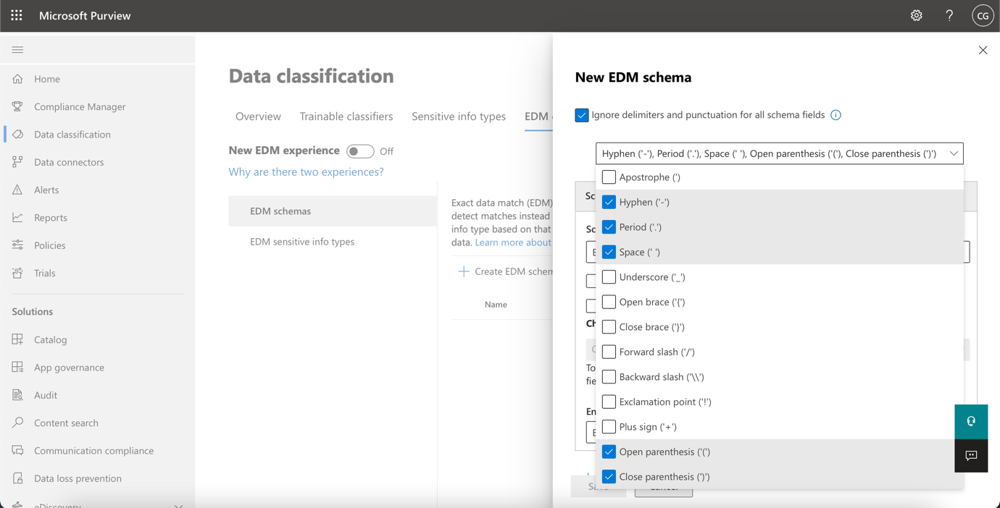

8.  選擇 **+ Add schema data field** 從較低的部分開始。

> 

9.  在 **Schema field name**, **Schema field \#2** 下, 輸入 Birthdate.

10. 選擇 **+ Add schema data field** 又是低價。

11. 在**模式字段名稱中**, **Schema field \#3 下**, 輸入 StreetAddress.

12. 選擇 **+ Add schema data field** 最後一次從低端。

13. 在**Schema field name**, **Schema field \#4 下**, 輸入 EmployeeID.

14. 選擇 **Field is searchable**.

15. 選擇 **Save**.

> 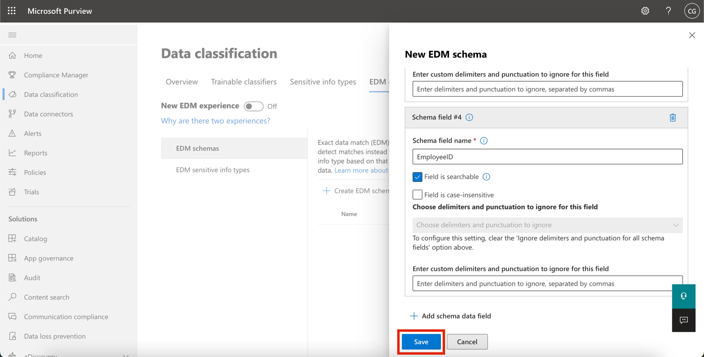

16. 從左側窗格選擇 **EDM sensitive info types**類型，然後選擇**+  Create EDM sensitive info type **以打開**EDM rule package** 嚮導。

> 

17. **在Define data store schema** 頁面, 選擇 **Choose an existing EDM schema**.

> 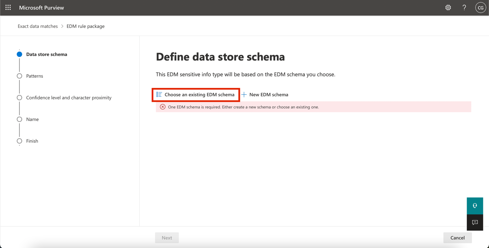

18. 選擇 **employeedb** 並選擇 **Add**.

> 

19. 查看數據存儲模式並選擇**Next**.

> 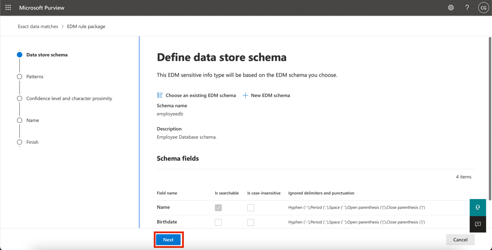

20. 在 **Define patterns for this EDM sensitive info type** 頁面, 選擇 **+ Create pattern**.

> 

21. 在 **New pattern** 右側的玻璃, 在 **Primary element** 字段, 選擇 ***EmployeeID***.

22. 在**Primary element's sensitive info type 下**, 選擇 **Choose sensitive info type**.

> 

23. 在 **搜索**欄, 輸入 Contoso 然後按下回車鍵。

24. 選擇 **Contoso Employee IDs** 並選擇**Done**.

25. 選擇 **Done**.

> 

26. 在**“**定義圖案”界面中選擇下一步，用於此EDM敏感信息類型界面。

> 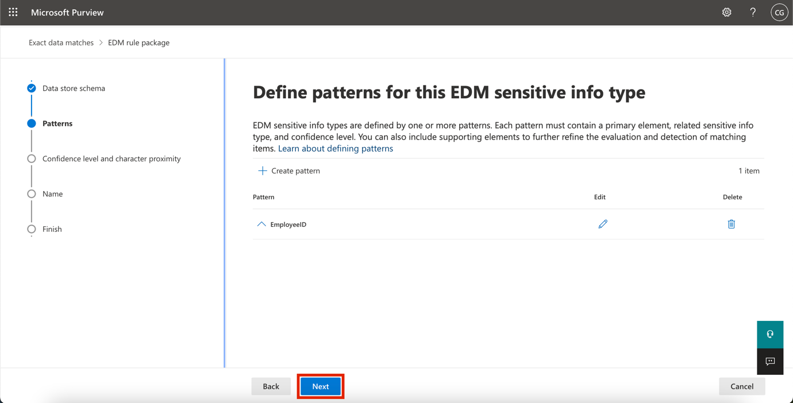

27. 在 **Choose the recommended confidence level and character proximity** 讓默認值保持不變，然後選擇**“下一步**”。

> 

28. 在 **Name and describe your EDM sensitive info type** 頁面, 輸入 Contoso Employee EDM for the name.

29. 在 **Description for admins** 字段, 輸入 EDM-based sensitive information type for employee personal information.選擇 **Next.**

> 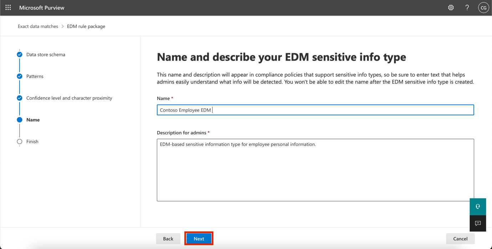

30. 檢查設置並選擇**Submit**.

> 

31. 在 **Your EDM sensitive info type was created** 頁面, 選擇 **Done**.

> 

32. 保持瀏覽器打開，打開Microsoft Purview門戶。

您已成功創建了一種基於EDM的新分類敏感信息類型，用於識別數據庫文件源中的員工數據。

**練習 3 – 創建基於 EDM 的分類數據源**

要將基於EDM的分類與包含敏感數據的數據庫關聯，接下來需要通過EDM上傳代理工具對敏感信息類型的實際數據進行哈希和上傳。

1.  在 **Microsoft Edge** 瀏覽器, 導航到 https://go.microsoft.com/fwlink/?linkid=2088639 以下載EDM下載代理。

2.  點擊 **Open file** 訪問鏈接 **EdmUploadAgent.msi**

> 

3.  在 **Welcome to the Microsoft Exact Data Match Upload Agent Setup Wizard** 對話框，點擊**“下一步**”按鈕。

> 

4.  在 **Microsoft Exact Data Match Upload Agent Setup** 巫師, 選擇 **Next**.

    - 選擇 **I accept the terms in the License Agreement** 並選擇 **Next**.

    - 不要更改默認**的目標文件夾**路徑並選擇**“下一步**”。

    - 選擇**安裝**以執行安裝。

    - 當**用戶賬戶控制**窗口打開時，選擇**“是**”。

    - 如果被要求登錄，請通過**Patti**的賬戶登錄。

    - 安裝完成後，選擇**完成**。

5.  現在，右鍵點擊Windows圖標，導航並點擊**“運行**”。在**“運行**”對話框中，輸入“記事本”，然後點擊**確定**按鈕。

> 
>
> 

6.  在記事本中輸入以下文字：

> Name,Birthdate,StreetAddress,EmployeeID
>
> Patti Fernandez,01.06.1980,1Main Street,CSO123456
>
> Christie Cline,31.01.1985,2Secondary Street,CSO654321
>
> 

7.  選擇文件並另存為：EmployeeData.csv

8.  選擇“**Save as type**”**下的拉菜單** ，然後選擇**“所有文件”（*。*）。**

9.  在**編碼**字段中，確保選擇**了UTF-8**，然後點擊**保存**按鈕。

> 

10. 關閉記事本窗口。

11. 右鍵點擊 任務欄上的 **Windows** 圖標，選擇 **Windows PowerShell（管理員）**以管理員身份運行。

> 

12. 在 **User Account Control** 對話框，點擊**“Yes ”**按鈕。

> 

13. 導航至EDM上傳代理目錄：

> cd "C:\Program Files\Microsoft\EdmUploadAgent"
>
> 

14. 通過運行以下命令，使用您的賬戶授權將數據庫上傳到租戶:

> .\EdmUploadAgent.exe /Authorize
>
> 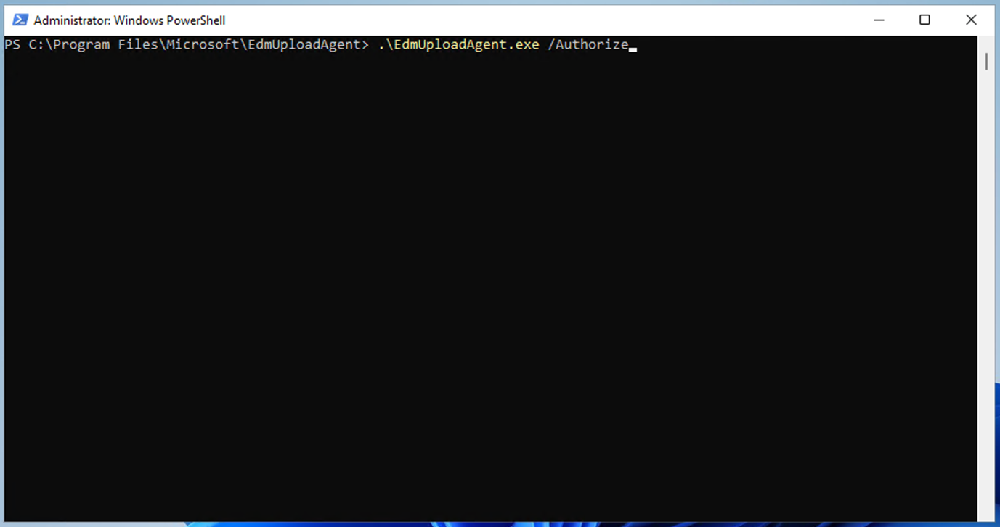

15. 當**顯示“Pick an account**” 窗口時，請 **用用戶**名**PattiF@TenantName和**資源標簽頁上給出的用戶密碼登錄**Patti Fernandez。（或者用你重置的新密碼。）**

> 
>
> 

16. 通過在PowerShell中運行以下腳本，下載基於EDM的分類敏感信息類型的數據庫模式定義：

> .\EdmUploadAgent.exe /SaveSchema /DataStoreName employeedb /OutputDir "C:\Users\Admin\Documents\\
>
> **注釋**: 如果最後一個命令失敗，可能需要更多時間才能應用**EDM_DataUploaders**組成員身份。下載schema文件可能需要長達一小時。如果失敗，繼續下一個任務，稍後再回到這一步。或者檢查虛擬機裡的路徑文件文件夾。
>
> 

17. 通過在PowerShell中運行以下腳本，對數據庫文件進行哈希並上傳到基於EDM的分類敏感信息類型:

.\EdmUploadAgent.exe /UploadData /DataStoreName employeedb /DataFile C:\Users\Admin\Documents\EmployeeData.csv /HashLocation "C:\Users\Admin\Documents\\ /Schema "C:\Users\Admin\Documents\employeedb.xml"

\

\*\*Note:\*\* If you get the following errors

Error Type: System.IO.FileNotFoundException

Error Message: Unable to find the specified file.

\*\*Check the path where you saved the file EmployeeData.csv\*\*

\

19. 檢查上傳進度直到狀態變成完成，然後執行以下PowerShell命令:

> .\EdmUploadAgent.exe /GetSession /DataStoreName employeedb
>
> 

你已經成功哈希並上傳了一個基於EDM的分類敏感信息類型的數據庫文件.

**練習 4 – 創建關鍵詞詞典**

多起個人信息洩露事件發生在同事報告病假後用戶發送郵件。當這種情況發生時，疾病或疾病的原因會被傳達出來。我們不希望這種情況發生。

1.  在 **Microsoft Edge**, 開 **New InPrivate Window**, 導航到 https://purview.microsoft.com 登錄時為 **Patti Fernandez** 使用用戶名 **PattiF@TenantName** 和資源標簽頁上給出的用戶密碼。

2.  從左側導航中選擇**Solutions** \> **Data Loss Prevention**.

> 

3.  從左側面板選擇 **Classifiers **。在子導航面板中 **Sensitive info types**。選擇 **+Create sensitive info type**以打開新的敏感信息類型嚮導。

> 

4.  在**Name your sensitive info type** 頁面, enter the following:

    1.  名字: Contoso Diseases List

    2.  描述: List of possible diseases of employees.

> 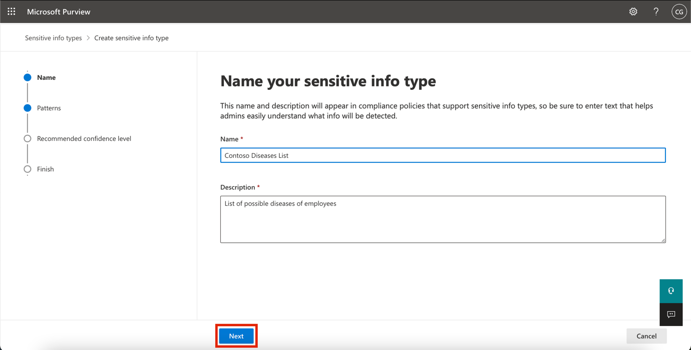

5.  選擇 **Next**.

6.  在 **Define patterns for this sensitive info type** 頁面, 選擇 **+ Create pattern**.

> 

7.  選擇下方下拉字段 **Primary element** 並選擇 **Keyword dictionary**.

> 

8.  在 **Add a keyword dictionary** 頁面，請輸入姓名 Diseases Dictionary\*.

9.  在 **Keywords** 區域將以下關鍵詞輸入，分別在一行中：

> flu
>
> influenza
>
> cold
>
> bronchitis
>
> otitis
>
> 

10. 選擇 **Done**.

11. 在 **“ Supporting elements” 下方**，選擇**“+Add supporting elements or group of elements**，選擇**keyword list **以增加對關鍵詞詞典的額外支持。

> 

12. 在**添加關鍵詞列表**頁面的ID欄輸入**“員工**”。在大小**寫不敏感**的框中，輸入以下關鍵詞，分別在一行中，然後點擊**“完成**”按鈕：

> Employee ID
>
> leave
>
> reason
>
> 

13. 在 **New pattern** 頁面, 查看配置並選擇**創建**。

> 

14. 在 **Define patterns for this sensitive info type** 選擇 **Next**.

> 

15. 在 **Choose the recommended confidence level to show in compliance policies** 讓默認值保持不變並選擇**Next**.

> 

16. 在 **Review settings and finish** 頁面，查看你的設置並選擇**“創建**”。流程完成後選擇**“完成**”。

> 

1.  保持 Microsoft Purview 門戶中的瀏覽器窗口開啟。

你已經成功基於關鍵詞詞典創建了一個新的敏感信息類型，並添加了更多關鍵詞以降低誤報率。繼續下一個任務。

**練習 5 – Working with custom Sensitive Information Types**

自定義敏感信息類型在策略中使用前應始終進行測試，否則由於自定義搜索模式故障，可能導致數據丟失或洩露。

1.  右鍵點擊Windows圖標，導航並點擊**“運行**”。 在**“運行**”對話框中，輸入 +++notepad+++，然後點擊**確定**按鈕。

> 
>
> 

2.  在記事本窗口輸入以下文字：

> Employee Patti Fernandez with Employee ID ABC123456 is on leave because of the flu/influenza

3.  選擇 **File** 以及《拯救AsSickTestData 然後選擇**保存**。

4.  關閉記事本窗口。

5.  在 **Microsoft Edge**, Microsoft Purview 門戶標簽頁應該仍然開著。如果有，選擇它並進入下一步。如果你關閉了它，然後在新標簽頁裡進入 https://purview.microsoft.com。**使用資源標簽頁上的用戶名**PattiF@TenantName**和用**戶密碼登錄為 Patti Fernandez。

6.  在左側導航面板中選擇“ **Solutions** \> **Data Loss Prevention**，然後在**分類器**中**選擇敏感信息類型**。在**搜索**框中，右上角輸入Contoso並按回車。點擊**Contoso員工IDS**打開右側面板。

7.  從右側面板**選擇**測試。

> 

8.  在 **Upload file to test** 頁面, 選擇 **Upload file**.

> 

9.  從左側窗格選擇**“文檔**”，選擇名為 **SickTestData** 的文件，然後選擇**“打開**”。

> 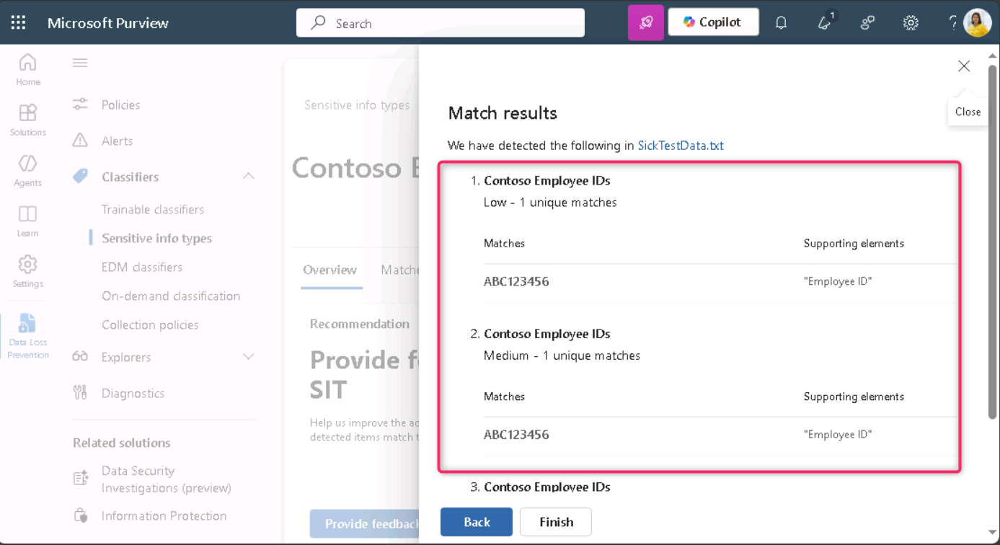

10. 選擇**測試**開始分析。

> 

11. 在**匹配結果**頁面，查看找到的匹配。

> 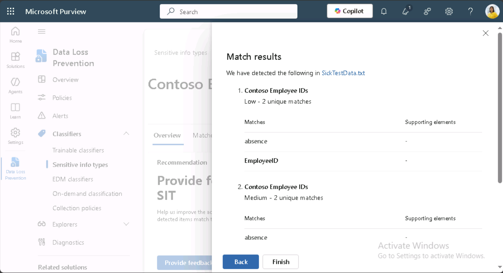

12. 選擇**完成**，然後點擊X鍵關閉測試頁面 。

> 

13. 回到**數據分類**頁面，選擇名為**“Contoso Diseases List”的敏感信息類型**。

14. 在右側面板中，選擇測試。

> 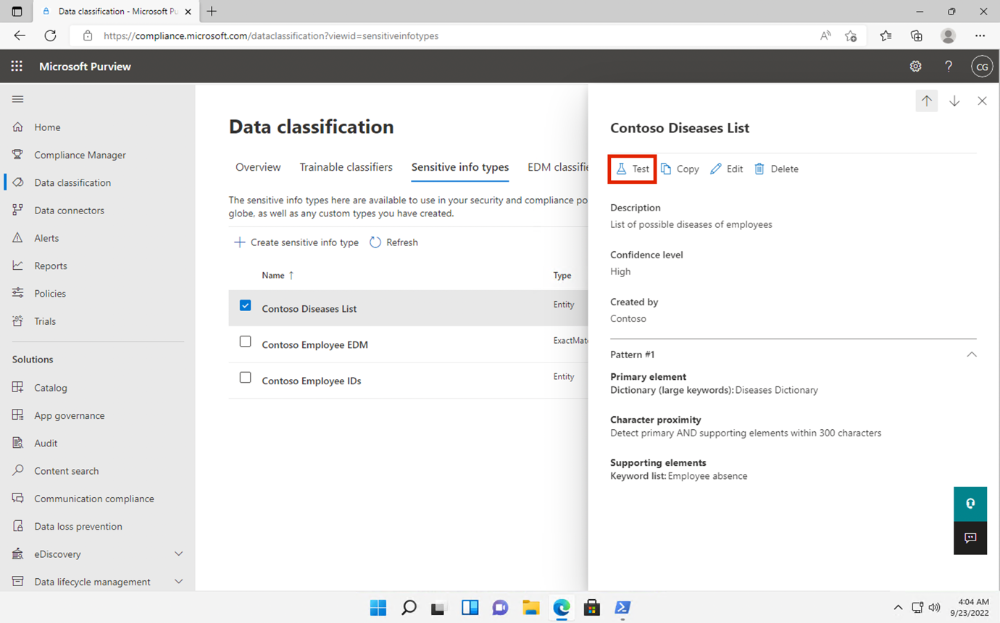

15. 在“**Upload file to test** ”頁面，選擇**“上傳  Upload file**”。

> 
>
> 16． 從左側窗格選擇**“Documents **”，選擇名為 *SickTestData* 的文件，然後選擇**“打開**”。

17. 選擇 **Test **開始分析。

> 

18. 在**匹配結果**頁面，查看找到的匹配。審核完成後，選擇**“結束**”。

> 

**總結:**

在本實驗室中，你學習了如何在Microsoft Purview中創建和測試自定義敏感信息類型（SITE），使用正則表達式、關鍵詞詞典和精確數據匹配（EDM）技術，以增強數據丟失防護能力。
