**Lab 4 – 創建和管理敏感標簽**

**介紹**

Patti Fernandez，Contoso有限公司的信息安全管理員，正在部署現代敏感性標簽框架，以加強組織內的數據保護。Patti創建並發佈敏感標簽組和標簽，用於分類和保護內容，包括加密、自動標注和雙鍵加密（DKE）。Patti還將將Microsoft Purview與Microsoft Defender for Cloud Apps集成，擴展數據保護對存儲在雲端的文件的控制。

**目標:**

1.  啟用敏感標簽支持

2.  創建標簽組

3.  創建兒童標簽

4.  發佈標簽

5.  配置自動標簽

6.  為保密內容創建並發佈DKE標簽

7.  在 Defender for Cloud Apps 中啟用 Microsoft Purview 集成

8.  創建一個文件策略來標記外部共享文件

- 

**練習 1 – 啟用敏感標簽支持**

在此任務中，您將啟用敏感標簽的共作者功能，同時也啟用 SharePoint 和 OneDrive 文件的敏感標簽。

1.  你仍然應該用**管理員**賬戶登錄虛擬機。

2.  打開**Microsoft Edge**，然後導航到 https://purview.microsoft.com，並以Patti Fernandes Microsoft名登錄Purview。

3.  在左側導航中，選擇 **“Settings \> Information Protection.**

> 

1.  在 ** Information Protection settings **頁面，確保你在**“Co-authoring for files with sensitivity labels ”標簽下**。

2.  勾選 “T**urn on co-authoring for files with sensitivity labels**. **”複選框**。

> 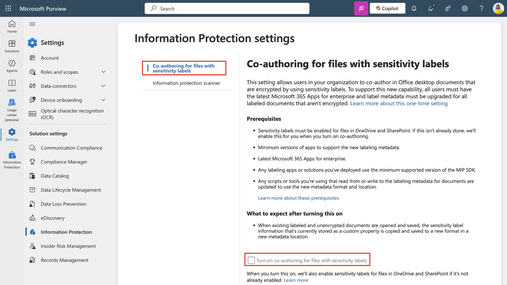

6.  在屏幕底部選擇**“Apply **。

> 

你已經成功啟用了對 SharePoint 和 OneDrive 文件敏感標簽的支持。

**練習 2 - 使用靈敏度標簽**

**任務 1 – 創建標簽組**

在這個任務中，你將創建一個標簽組來組織內部敏感性標簽。標簽組作為相關標簽的容器，如部門或業務單元分類。

1.  在 **Microsoft Edge**, 導航至。 https://purview.microsoft.com.

2.  在 Microsoft Purview 門戶中，從 左側側欄選擇 **Solutions** ，然後選擇 **Information Protection**。

> 

3.  在 ** Microsoft Information Protection ** 頁面的左側欄，選擇 **Sensitivity labels**。

> 

4.  在 **Sensitivity labels** 頁面選擇 **+  Create \> Label group**。

> 

5.  配置將開始。在**“ Provide basic details for this label group” 中**，輸入：

    - **名稱**: Internal

    - **顯示名稱**: Internal

    - **用戶簡介**: Internal sensitivity label.

    - **管理員簡介**: Internal sensitivity label group for Contoso.

6.  選擇 **Next**.

> 

7.  在 **Review your settings and finish** 頁面, 選擇 **Create label group**.

> 

8.  在“ **Your label group was created successfully** **”**頁面，選擇**“Don't create a label yet**”，然後選擇“**Done”**。

> 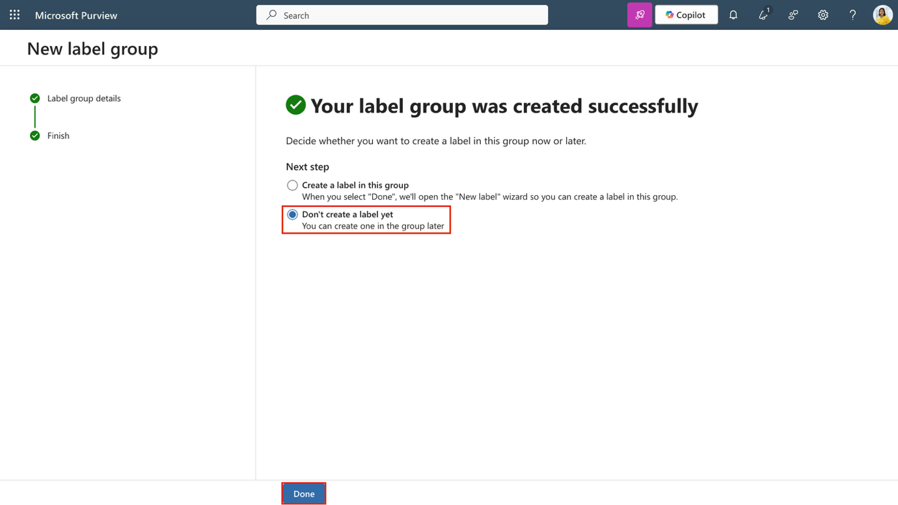

你創建了一個內部使用的標簽組。該組幫助你管理特定部門或數據類別的相關標簽。

**任務 2 – 創建兒童標簽**

現在你已經創建了標簽組，可以添加一個子標簽用於人力資源相關內容。該標簽強制加密和內容標記，以保護人力資源數據免受未經授權的訪問。

1.  在**敏感度標簽**頁面，找到**內部**敏感度標簽組。選擇垂直省略號（**...**然後在下拉菜單**中選擇** + **Create label in group**。

> 

2.  **新的敏感性標簽**嚮導將啟動。在**“提供本標簽基本信息”**頁面輸入：

    - **名稱**: Employee data (HR)

    - **顯示名稱**: Employee data (HR)

    - **用戶簡介**: This HR label is the default label for all specified documents in the HR Department.

    - **管理員簡介**: This label is created in consultation with Ms. Jones (Head of the HR department). Contact her if you need to change the label settings.

3.  選擇 **Next**.

> 

4.  在**定義  Define the scope for this label ** 頁面，選擇**文件**和**電子郵件**。如果選中了**會議**的複選框，請確保它已取消。

5.  選擇 **Next**.

> 

6.  在“ ** Choose protection settings for labeled items** ”頁面，選擇**“ Control access**”和**“Apply content marking**”選項，然後選擇**“Next**”。

> 

7.  在  **Access control** 頁面，選擇 **Configure access control settings. **。

8.  用這些選項配置加密設置:

    - **Assign permissions now or let users decide?**: 立即分配權限

    - **User access to content expires**: 絕不

    - **Allow offline access**: Only for a number of days

    - **Users have offline access to the content for this many days**: 15

> 

- 選擇 **Assign permissions** 鏈接。 在**“ Assign permissions**”面板中，選擇 **+ Add any authenticated users,**，然後選擇**“保存**”以應用此設置。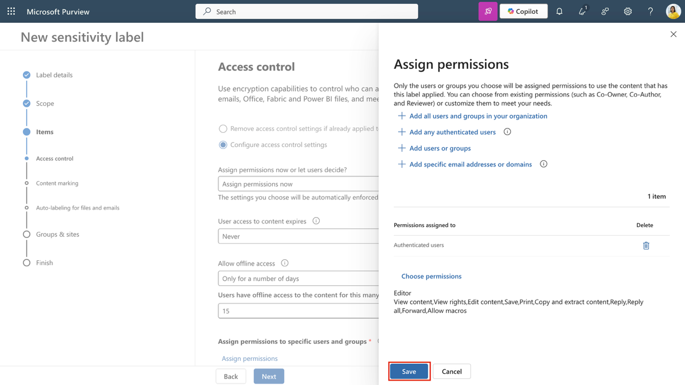

9.  在  **Access control**  頁面，選擇**“Next**”。

> 

10. 在 ** Content marking ** 頁面，選擇開關以啟用 ** Content marking **。

> 

11. 對於以下每種標記類型，選擇複選框，然後選擇編輯圖標輸入文本:

| **標記類型**    | **Text**             |
|-----------------|----------------------|
| Add a watermark | INTERNAL USE ONLY    |
| Add a header    | Internal Document    |
| Add a footer    | Contoso Confidential |

12. 選擇**Next**.

> 

13. 在  **Auto-labeling for files and emails**頁面，選擇**“Next**”。

> 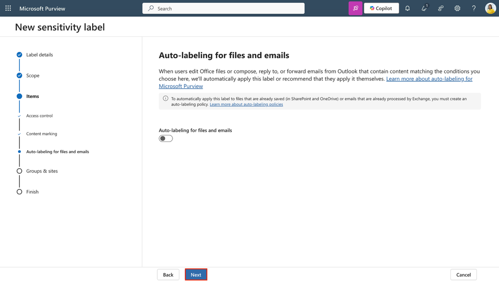

14. **在“ Define protection settings for groups and sites”頁面，選擇“下一步”。**

> 

15. 在 **“Review your settings and finish**” 頁面，選擇**Create label**. 。

> 

16. 在 “ **Review your settings and finish**” 頁面，選擇 **“Don't create a policy yet,**”，然後選擇**“完成**”。

> 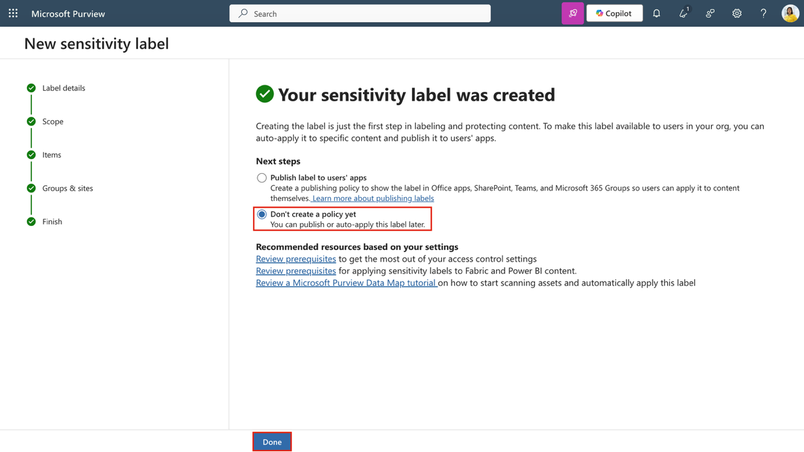

你在內部標簽組內創建了一個子標簽。該標簽對人力資源文件進行加密和內容標記，使敏感數據易於識別並受政策保護。

**任務 3 – 發佈標簽**

接下來，你將從內部標簽組發佈HR標簽，方便HR部門的用戶將其應用到文檔中。

1.  在 **Microsoft Edge** 中，Microsoft Purview 門戶標簽頁應該仍然開著。如果沒有，請訪問 <https://purview.microsoft.com>“  **Solutions** \> **Information Protection** \> **Sensitivity labels**. ”。

2.  在 **Sensitivity labels**頁面選擇 ** Publish labels**。

> 

3.  發佈敏感標簽配置將開始。

4.  在“ **Choose sensitivity labels to publish”頁面**，選擇**“Choose sensitivity labels to publish”**鏈接。

> 

5.  在發佈飛出面板 **Sensitivity labels to publish** 中，選擇  **Internal/Employee data (HR)**複選框，然後在 飛出頁面底部選擇添加。

> 

6.  回到**“Choose sensitivity labels to publish”**頁面，選擇**“下一步**”。

> 

7.  在**“ Assign admin units **”頁面，選擇**“下一步”**

> 

8.  在**“ Publish to users and groups”**頁面，選擇**“Next**”。

> 

9.  在 **Policy settings ** 頁面，選擇**“Next**”。

> 

10. 在 ** Default settings for documents 中**選擇**“下一步**”。

> 

11. 在 ** Default settings for emails**選擇**“下一步**”。

> 

12. 在 **Default settings for meetings and calendar events** 選擇 **Next**.

> 

13. 在 **Default settings for Fabric and Power BI content** 頁面, 選擇**Next**.

> 

14. 在“**命名你的保單**”頁面輸入:

    - **Name**: Internal HR employee data

    - **輸入敏感標簽策略的描述**: This HR label is to be applied to internal HR employee data.

15. 選擇**Next**.

> 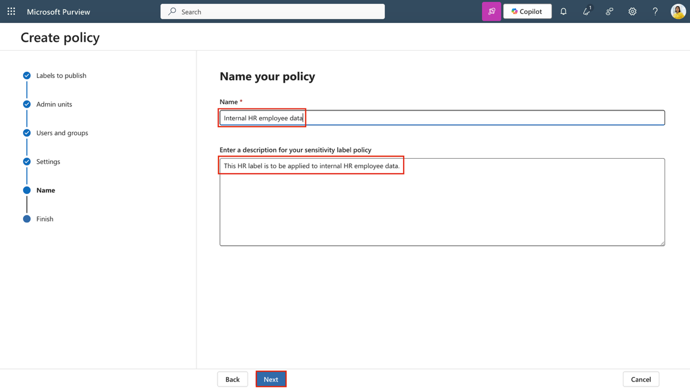

16. 在 **Review and finish**”頁面，選擇**提交**。

> 

17. 在“ **New policy created**”頁面，選擇**完成**以完成發佈你的標簽政策。

> 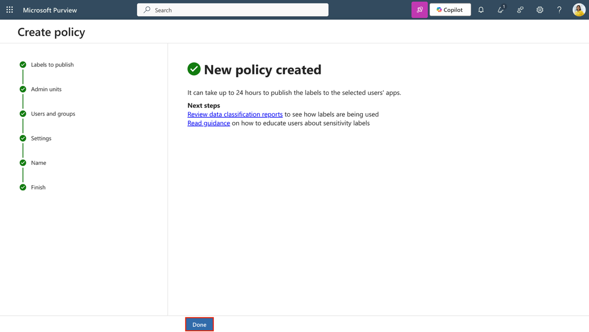

你已經發佈了內部標簽組及其人力資源標簽，方便用戶將它們應用到人力資源文檔上。政策在各服務之間傳播可能需要長達24小時。

**任務 4 – 配置自動標簽**

1.  在Microsoft Purview門戶中，選擇**“Solutions \> Information Protection \> Sensitivity labels. **”。

2.  在**敏感度標簽**頁面，找到**內部**敏感度標簽。選擇垂直省略號（**...**），然後從**下拉菜單中選擇+“ Create label in group”。**

> 

3.  在 **Provide basic details for this label** 頁面, 輸入:

| **Details** | **Text** |
|----|----|
| **名稱** | Financial Data |
| **顯示名稱** | Financial Data |
| **用戶簡介** | This content contains financial data that must be labeled and protected. |
| **管理員簡介** | This label is used for content that includes sensitive financial identifiers. |

4.  選擇 **Next**.

> 

5.  在**定義  Define the scope for this label ** 頁面，選擇**文件**和**電子郵件**。如果選中了**會議**的複選框，請確保它已取消。

6.  選擇**Next**.

> 

7.  在“ ** Choose protection settings for labeled items **”頁面，選擇**“下一步**”。

> 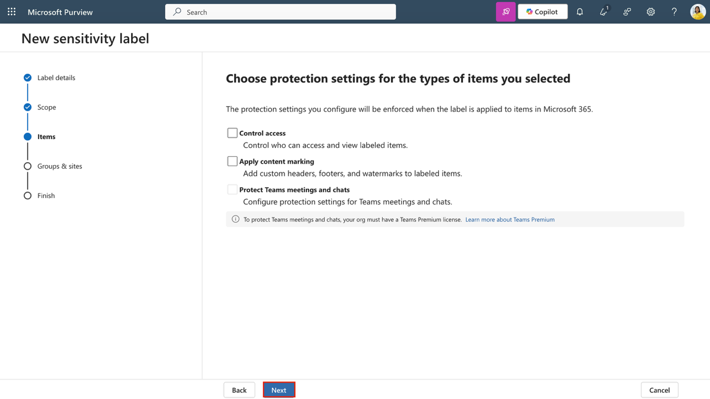

8.  在 “**Auto-labeling for files and emails** ”頁面，將**文件和郵件的自動標簽**設置為啟用。

> 

9.  在**“  Detect content that matches these conditions** ”部分，選擇 **+ Add condition** \> **Content contains**. 

> 

10. 在**“ Content contains**”部分，選擇 ** Add \> Sensitive info types. **。

> 

11. 在**敏感信息類型**飛出頁面，搜索並選擇以下敏感信息類型：

    - Credit Card Number

    - ABA Routing Number

    - SWIFT Code

12. 選擇 **Add**.

> 

13. 回到**“Auto-labeling for files and emails **”頁面，選擇**“下一步**”。

> 

14. 在 “ **Define protection settings for groups and sites**”頁面，選擇**“下一步**”。

> 

15. 在**“ Review your settings and finish**”頁面，選擇 **Create label.**。

> 

16. 在“ **Your sensitivity label was created ”**頁面，選擇**“Automatically apply label to sensitive content,**”，然後選擇**“完成**”。

> 

17. 在 ** Create auto-labeling policy**的跳板頁面，選擇**審查政策**。

> 

18. 在“N**ame your auto-labeling policy**”頁面，保留默認選項，然後選擇**“下一步**”。

> 

19. 在**“ Choose a label to auto-apply **”頁面，檢查是否選擇*了內部/財務數據*標簽，然後選擇**“下一步**”。

> 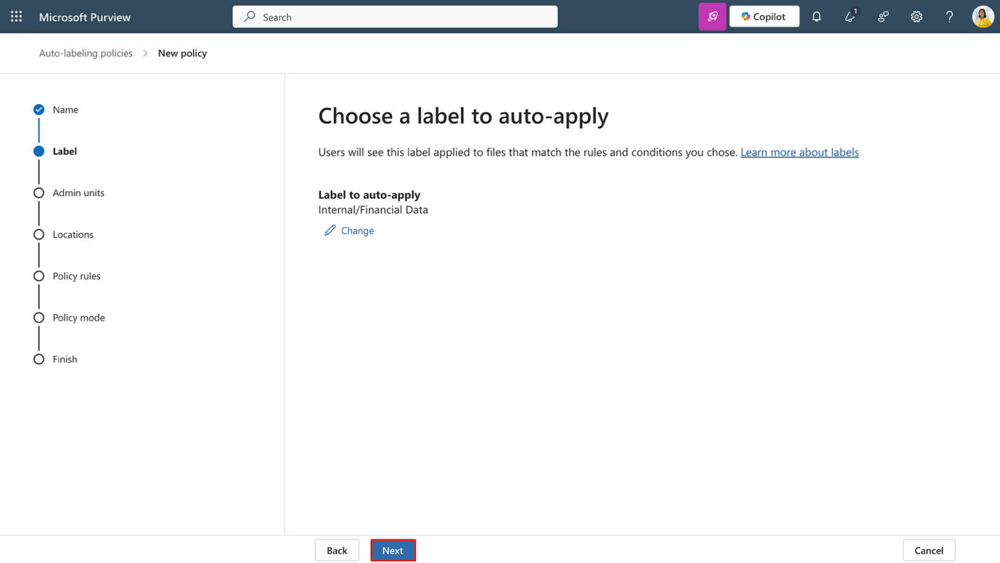

20. 在**“ Assign admin units **”頁面，選擇**“下一步**”。

> 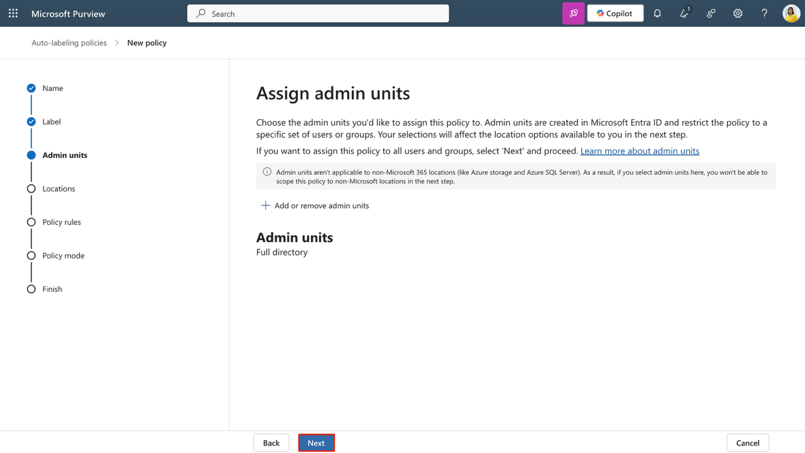

21. 在“ **Choose locations where you want to apply the label** **”**頁面，選擇以下選項:

    - Exchange email

    - SharePoint sites

    - OneDrive accounts

22. 選擇 **Next**.

> 

23. 在 **Set up common or advanced rules** 頁面, 保持默認的**通用規則**為選項，然後選擇**“下一步**”。

> 

24. 在 “ **Choose locations where you want to apply the label** ”頁面，展開“財務*數據規則*”以確保預期規則的定義，然後選擇**“下一步**”。

> 

25. 在“**Additional settings for email**”頁面，選擇**“下一步**”。

> 

26. 在 **“ Decide if you want to test out the policy now or later**” 頁面，選擇**在 Run policy in simulation mode**，並勾選**“ Automatically turn on policy if not modified after 7 days in simulation “。**

> 

27. 選擇 **Next**.

> 

28. 在“ **Review and finish** ”頁面，選擇 ** Create policy**。

> 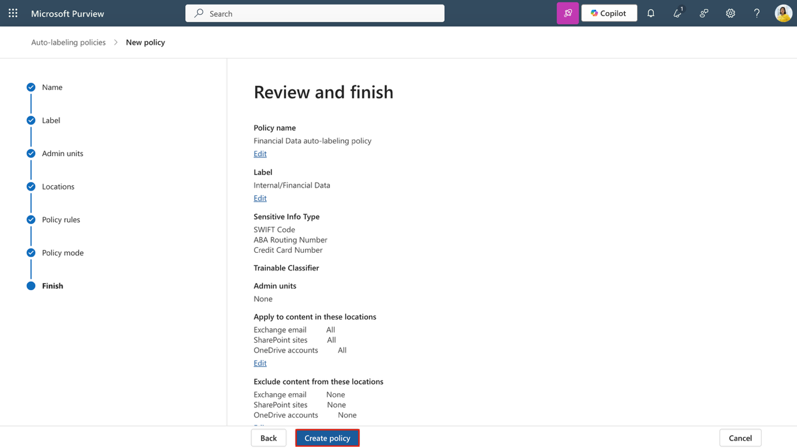

29. 在“ **Your auto-labeling policy was created”頁面**，選擇**“完成**”。

你已經為財務數據創建了子標簽，並配置了一個自動標簽策略，用於檢測和標記包含金融信息的內容。

**任務 5 – 為保密內容創建並發佈DKE標簽**

接下來，你將在內部組創建一個子標簽，使用雙密鑰加密（DKE）和動態水印保護機密法律內容。

1.  在**Microsoft Edge**中，導航到 https://purview.microsoft.com 並以 **Patti Fernandes** 的身份登錄Microsoft Purview門戶 。

2.  在Microsoft Purview門戶中，選擇 **“Solutions \> Information Protection \> Sensitivity labels. **”。

3.  在 ** Sensitivity labels** 頁面，找到**內部**敏感度標簽組。選擇垂直省略號（**...**），然後從下拉菜單**中選擇**+ **Create label in group** 標簽。

> 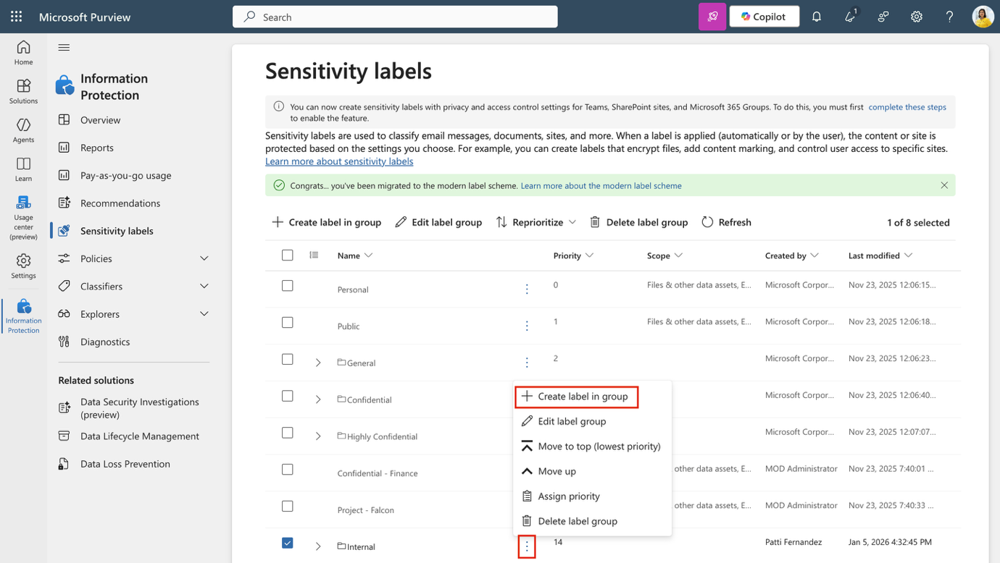

4.  在**“ Provide basic details for this label”**頁面，輸入:

| **Details** | **Text** |
|----|----|
| **Name** | Confidential Legal |
| **Display name** | Confidential Legal |
| **Description for users** | Use this label for highly sensitive legal content that must be encrypted using Double Key Encryption. |
| **Description for admins** | Label configured with DKE and dynamic watermarking for highly sensitive legal content. |

5.  選擇 **Next**.

> 

6.  在 ** Define the scope for this label** 頁面，選擇**文件**和**電子郵件**。如果選中了**會議**的複選框，確保它已取消，然後選擇**“下一步**”。

> 

7.  在“ **Choose protection settings for the types of items you selected**”頁面，選擇 ** Control access**，然後選擇**“下一步**”。

> 

8.  在訪問**控制**頁面，選擇 **Configure access control settings**。

> 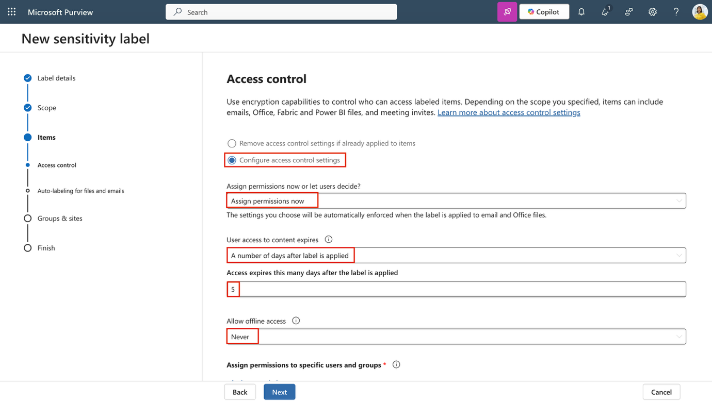

9.  用這些選項配置加密設置:

    1.  **現在就分配權限，或者讓用戶自行決定?**: Assign permissions now

    2.  **用戶對內容的訪問會過期**: A number of days after label is applied

    3.  **標簽貼上後，訪問權限會在這幾天內失效**: 5

    4.  **允許離線訪問**: Never

    5.  選擇**“Assign permissions**”鏈接。在**“ Assign permissions**”面板上，選擇 **+ Add users or groups**。

> 

- 在“ **Add users or groups**” 跳出頁面，搜索並選擇法律團隊和帕蒂·費爾南德斯，然後選擇**添加**。

> 

- 在**“ Assign permissions**”頁面，選擇**保存**。

> 

10. 回到 ** Access control ** 頁面，選擇“ **Use dynamic watermarking”的複選框**，然後選擇**“Customize text (optional)”。**

> 

11. 在**“ Add custom text to watermark (optional)** 頁面，輸入“Confidential”，然後選擇**UPN**和**時間戳**。

12. 在飛出頁面底部**選擇**保存。

> 

13. 回到 **Access control** 頁面，選擇“ **Use Double Key Encryption**,**”的複選框**，並輸入 https://testingdke1.azurewebsites.net/Test 作為雙密鑰加密服務的URL。

14. 選擇 **Next**.

> 

15. 在  **Auto-labeling for files and emails** 頁面，選擇**“下一步**”。

> 

16. 在“ **Define protection settings for groups and sites** ”頁面，選擇**“下一步**”。

> 

17. 在**“ Review your settings and finish**”頁面，選擇 **Create label**。

> 

18. 在 “**Your sensitivity label was created**”頁面，選擇 **Publish label to users' apps**,”，然後選擇**“完成**”。

> 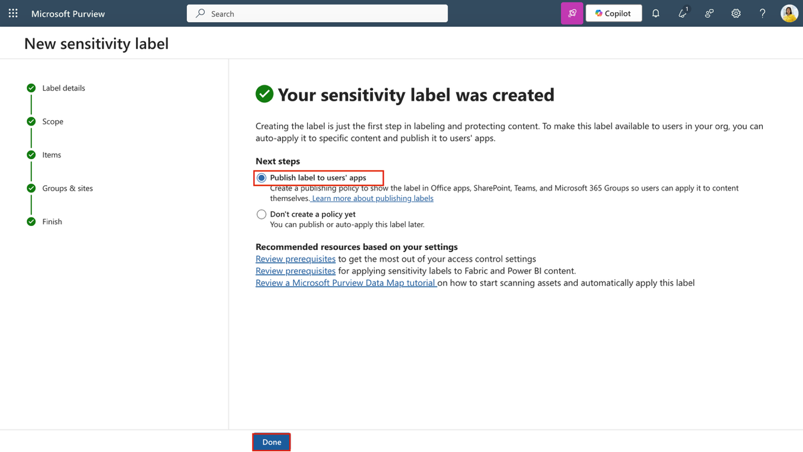

19. 在 ** Publish label ** 跳出頁面，選擇 **Create new label policy**。

> 

20. 在“ ** Choose sensitivity labels to publish”** 頁面，選擇**“ Choose sensitivity labels to publish”**並添加 ** Internal/Confidential Legal 標簽，然後選擇 Add**。

> 

21. 選擇 **Next**.

> 

22. 在**“  Assign admin units**”頁面，選擇**“下一步**”。

> 

23. 在**“Publish to users and groups”**頁面，保持默認選項，然後選擇**“下一步**”。

> 

24. 在 ** Policy settings**頁面，選擇 **“Users must provide a justification to remove a label or lower its classification” 的複選框**，然後選擇**“下一步**”。

> 

25. 在“ **Default settings for documents​** ”頁面，選擇**“下一步**”。

> 

26. 在 ** Default settings for emails**頁面，選擇**“ Next**”。

> 

27. 在 ** Default settings for meetings and calendar events**頁面，選擇**“下一步**”。

> 

28. 在  **Default settings for Fabric and Power BI content​** 頁面，選擇**“下一步**”。

> 

29. 在“ **Name your policy**”頁面輸入:

    1.  **Name**: Confidential Legal

    2.  **Description**: Enables manual use of the DKE label for confidential content accessible by Legal.

30. 選擇 **Next**.

> 

31. 在**“審核與完成**”頁面，選擇 **Submit**。

> 

32. 在“ **New policy created**”頁面，選擇**“完成**”。

> 

你創建並發佈了一個使用雙密鑰加密和動態水印的子標簽。該標簽限制授權用戶訪問，並強制要求降級分類。

**練習 3 - 使用標簽與 Microsoft Purview 的文件策略**

**任務 1 – 在 Defender for Cloud Apps 中啟用 Microsoft Purview集成**

在創建並發佈敏感標簽後，你現在將將 Microsoft Purview 與 Microsoft Defender for Cloud Apps 集成。該集成使 Defender 能夠掃描文件中的敏感標簽並實施文件監控。

1.  打開**Microsoft Edge**，然後**通過導航到** https://security.microsoft.com 進入Microsoft Defender。

2.  在左側導航中，選擇**設置**，然後選擇**雲應用**。

> 

3.  在左側面 **Information Protection**部分，選擇**Microsoft Information Protection**。

> 

4.  在  **Microsoft Information Protection** 頁面上，選擇該頁面提供的兩個複選框。

    - **自動掃描新文件，以檢測Microsoft信息保護敏感標簽和內容檢查警告**

> 使Defender for Cloud Apps能夠自動掃描新建或修改文件，以檢測敏感性標簽和內容檢查警告，這些文件來自Microsoft Purview。

- **僅掃描該租戶文件中的Microsoft信息保護敏感標簽和內容檢查警告**

> 掃描限制在你自己組織內創建的標簽和警告。外部租戶貼上的標簽將被忽略。

5.  選擇**保存**以應用設置。

> 

6.  在左側面板的 **Information Protection**部分，選擇**文件**。

> 

7.  在文件 頁面，選擇 ** Enable file monitoring**。

> 

8.  選擇**保存**以應用設置。

> 

你已在 Defender for Cloud Apps 中啟用了 Microsoft Purview 集成。Defender 現在可以檢測敏感標簽，並監控文件以進行策略評估和治理作。

**任務 2 – 創建一個文件策略來標記外部共享文件**

最後，你會創建一個文件策略，自動對外部共享的文件應用敏感性標簽。這確保了敏感內容即使在組織外共享也能受到保護。

1.  在 **Microsoft Defender** 中，導航到  **Cloud apps** \> **Policies** \> **Policy management**. 。

> 

2.  選擇**“ Information protection**”標簽，然後選擇 **Create policy \> File policy. **。

> 

1.  在**創建文件策略**頁面，配置:

    - **Policy name**: Auto-label externally shared files

    - **Policy severity**: **High**

    - **Category**: **DLP**

    <!-- -->

    - 在**符合以下所有部分的檔案中**：

      - 對於第一個過濾器，將下拉菜單配置為：**Access level equals external **

      - 第二個篩選器，將下拉菜單設置為：**Last modified after (date) ，**並使用今天日期

> 

- 在**治理作中**，擴展 **Microsoft OneDrive for Business**：

  - 選擇“ **Apply sensitivity label”的複選框**

  - 在下拉菜單中選擇 ** Highly Confidential-Specified People**

> 

- 對 **Microsoft SharePoint Online**  **重複同樣的流程**

  - 選擇“ **Apply sensitivity label** **”的複選框**

  - 從下拉菜單**中選擇**  **Apply sensitivity label** 

> 

2.  選擇**創建**以完成文件策略的創建。

> 

你創建了一個文件策略，對外部共享的文件應用敏感標簽。該政策將您的信息保護策略擴展到雲存儲內容。

**總結**

在這個實驗室中，你扮演了Contoso有限公司的系統管理員Patti Fernandez，並利用Microsoft Purview敏感性標簽實現了信息保護。你在 SharePoint 和 Teams 中啟用了使用 PowerShell 的敏感標簽支持，創建並發佈了一個內部標簽和一個針對人力資源的子標簽，並在 Word 文檔和 Outlook 郵件中應用了這些標簽。你還為德國特有的GDPR相關內容創建並發佈了自動標記敏感標簽。這些步驟確保人力資源和監管文件在組織內部得到妥善分類和保護。
