**實驗室7 – 配置內部風險管理**

**介紹**

在本實驗室中，我們將學習如何使用內部風險管理策略來配置內部風險管理。我們將利用實驗室1創建的敏感信息類型和實驗室4創建的DLP策略，制定策略，保護組織免受高風險瀏覽器使用或數據盜竊或洩露。

為此，我們將在Azure中建立一個基礎設施，代表組織中的設備。我們將學習如何在Azure AD和Intune中接入這些設備，並在它們上安裝MDM代理，以便它們能夠從這些機器獲取警報。

**目標**

- 同步虛擬機時鐘，確保策略測試時間設置準確。

- 將用戶分配到Microsoft Purview中的內部風險管理角色組。

- 啟用分析洞察，用於租戶和用戶層面的內部風險檢測。

- 將Windows 10設備安裝到Microsoft Defender for Endpoint，用於內部風險監控。

- 創建並配置內部風險管理策略:

  - 風險瀏覽器使用問題

  - 離職用戶的數據盜竊

  - 用戶數據洩露

<!-- -->

- 對每個策略進行評分，以模擬國防部管理員賬戶的內部風險檢測場景.

**練習1 ——營造環境**

**任務0 – 同步虛擬機時鐘**

1.  關閉虛擬機上打開的所有 Microsoft Edge 瀏覽器標簽頁。點擊**Windows**圖標，然後點擊**設置**，如下圖所示。

> 

2.  在**Windows設置**搜索欄中，輸入日期和時間設置，然後從列表中選擇**日期和時間設置**。

> 

3.  在**日期和時間**頁面中，點擊“**立即同步**”按鈕。

> 

**練習2 ——制定 Insider Risk Management 政策。**

**前提條件**

**步驟1——將用戶添加到內部風險管理角色組**

1.  打開Microsoft Purvie門戶：https://purview.microsoft.com 並用**國防部管理員**憑證登錄。

2.  在左側導航菜單中，點擊**設置。**

> 

3.  在**設置**面板中，點擊角色**和範圍**。點擊**角色組**，然後選擇“ **Insider Risk Management”旁的複選框** ，點擊鉛筆圖標進行編輯。

> 
>
> 

4.  在**編輯角色組**成員頁面，點擊**選擇用戶**。

> 

5.  選擇Alex Wilber**附近的複選框**。然後，點擊**選擇**按鈕。如果亞曆克斯·威爾伯已經被選中，則忽略這一步。

> **注意**：如果你在編輯成員名中沒有看到Megan Bowen和MOD管理員的名字，那麼除了Alex名外，還要選擇Megan Bowen和MOD管理員名。
>
> 

6.  確保顯示MOD管理員Megan Bowen和Alex Wilber的名字，然後點擊**“下一**頁”按鈕.

> 

7.  選擇**“保存**”以將用戶添加到角色組。

> 

8.  選擇**完成**以完成步驟。

> 

**步驟2——啟用內部風險分析洞察**

1.  在Microsoft Purview門戶中，進入**設置**，然後向下滾動，點擊 “**Insider Risk Management**”。在 **Insider Risk Management 設置**——**分析**頁面，開啟“**租戶級顯示洞察**”和**用戶級顯示洞察**“的開關。然後，點擊**保存**按鈕。

> 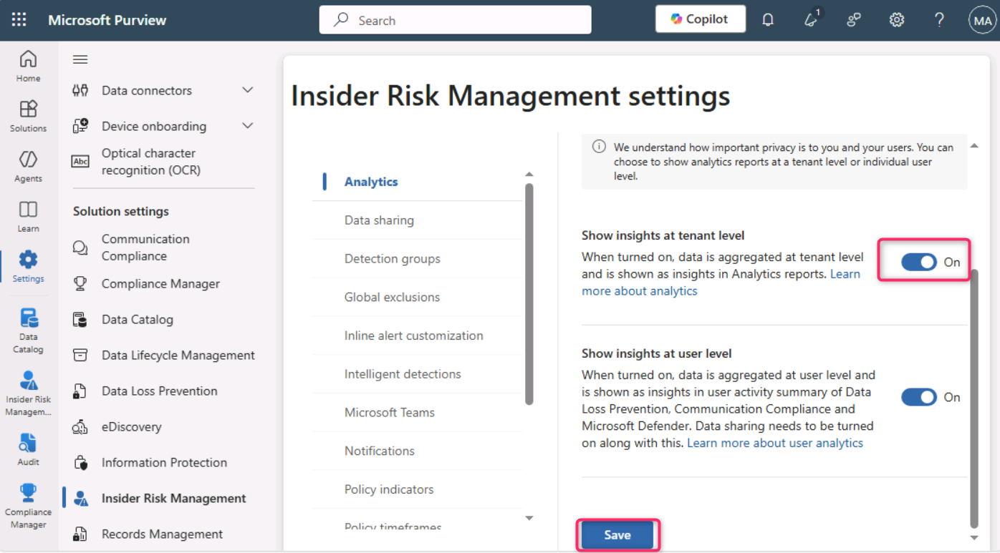

**步驟3 – 設備上線**

在這個部署場景中，你會接入尚未上線的設備，你只是想檢測Windows 10設備上的內部風險活動。

我們需要在Microsoft Entra ID中註冊設備/虛擬機，作為創建任何內部風險策略的前提條件。

1.  點擊Windows圖標，然後選擇 **如下圖所示**的設置。

> 
>
> 2\. 轉到 **賬戶**\>**訪問工作或學校**。在“**工作或學校訪問**”頁面，點擊**連接**。
>
> 
>
> 
>
> 3． 在“**設置工作或學校賬戶**”提示中，點擊**“加入此設備以訪問Microsoft Entra ID**”。
>
> 

4.  在登錄提示中，使用**實驗室環境資源標簽中提供的**國防部管理員憑證登錄。

> 
>
> 

5.  在**“確認這是你的組織對話框”中**，點擊**加入**按鈕。

> 

6.  完成後你會看到確認窗口**，一切就緒！**。點擊**完成**。

> 

7.  同樣，在“**工作或學校訪問**”頁面，點擊**連接**。

> 

8.  在“**設置工作或學校賬戶**”提示中，使用MOD管理員憑證登錄。

> 
>
> 

9.  登錄時保持**登錄？**對話框，點擊**“是”**按鈕。

> 

10. 如果**彈出“設置您的設備**”對話框，請選擇**“明白**”。

> 

11. 現在進入**Windows設置**\>**賬戶**\>**訪問工作或學校**\>**連接到Contoso的MDM**\>**信息**\>**同步**.

> 
>
> 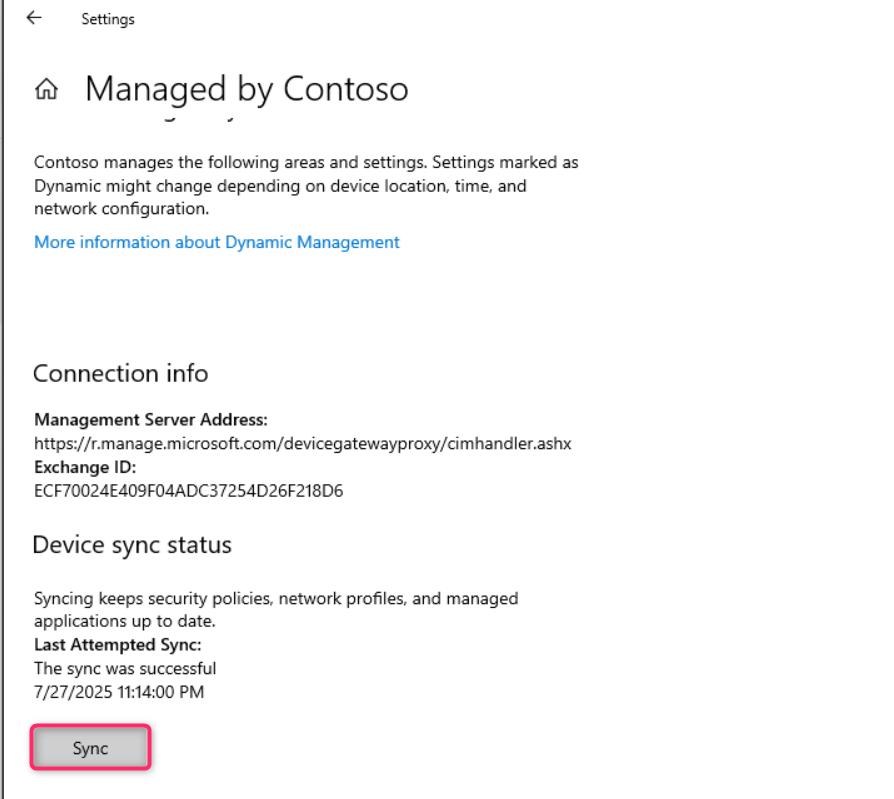

12. 點擊虛擬機上的Windows圖標。選擇用戶**管理員**並選擇**退出**。

> 

13. 在用戶界面選擇**“其他用戶**”。

> 

14. 輸入你在實驗室環境主頁提供的O365憑證，並以**MOD管理員身份登錄虛擬機**。

> 

15. 在你的實驗室虛擬機上使用MOD管理員賬戶**登錄以 https://purview.microsoft.com**。

16. 在Microsoft Purview 門戶中，導航並選擇 **“ Settings \> Device onboarding \> Devices. Click on Turn on Device onboarding. **”。

17. 在**“啟用設備入職**”對話框中，點擊**確定**按鈕。

> 

18. 在設備**監控中，對話框已開啟**，點擊**確定**按鈕。

> 

19. 等幾分鐘，然後刷新頁面。

> 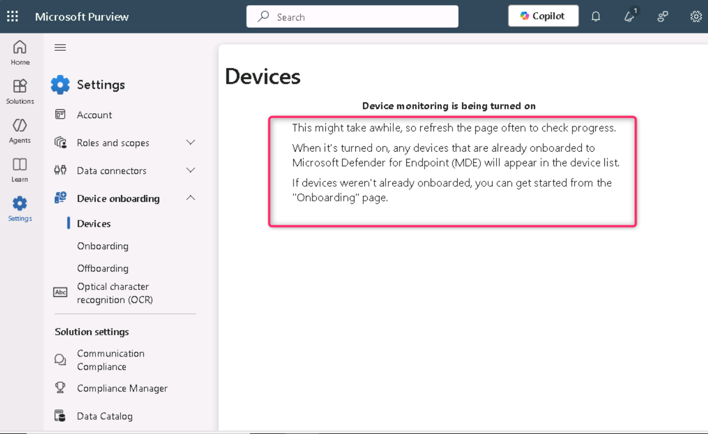
>
> 

20. 在** settings \> Device onboarding \> Onboarding** 中。點擊下載**包**。

> 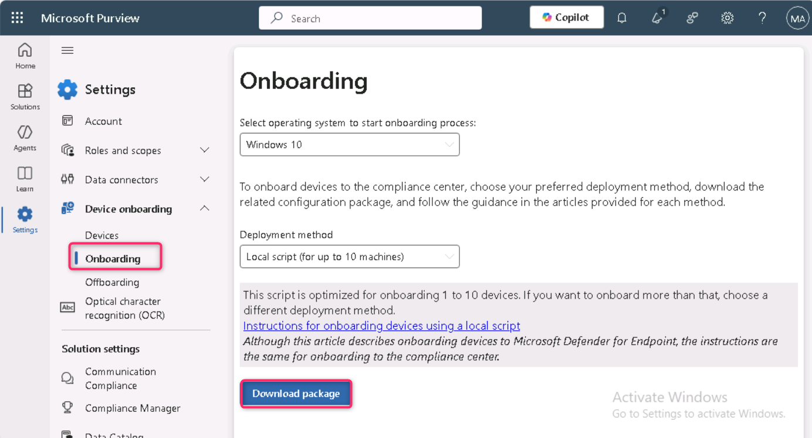

21. 下載完成後，將文件複製到桌面。右鍵點擊文件，全部**解壓......**然後點擊**提取**按鈕

> 
>
> 
>
> 

22. 完成後，打開文件夾並用管理員權限運行該文件 。

> 

23. 如果在**商店裡搜索應用？** 對話框出現，點擊**“是”**按鈕，否則忽略。

24. 出版**商無法被核實。你確定要運行這個軟件嗎？對話框**，點擊**“運行**”按鈕。

> 

25. 如果**出現“用戶賬戶控制”**對話框，請點擊**“是**”按鈕。

> 

26. 在命令提示符中，按**Y**並按回車確認。你會收到設備已上線的消息。在命令提示符中，一旦收到消息，**按任意鍵即可繼續......**，按任意鍵。

> 

27. 命令提示符關閉後，在Windows搜索欄輸入cmd，以管理員模式打開命令提示符 ，然後右鍵點擊**命令提示符**，選擇**以管理員身份運行**。

> 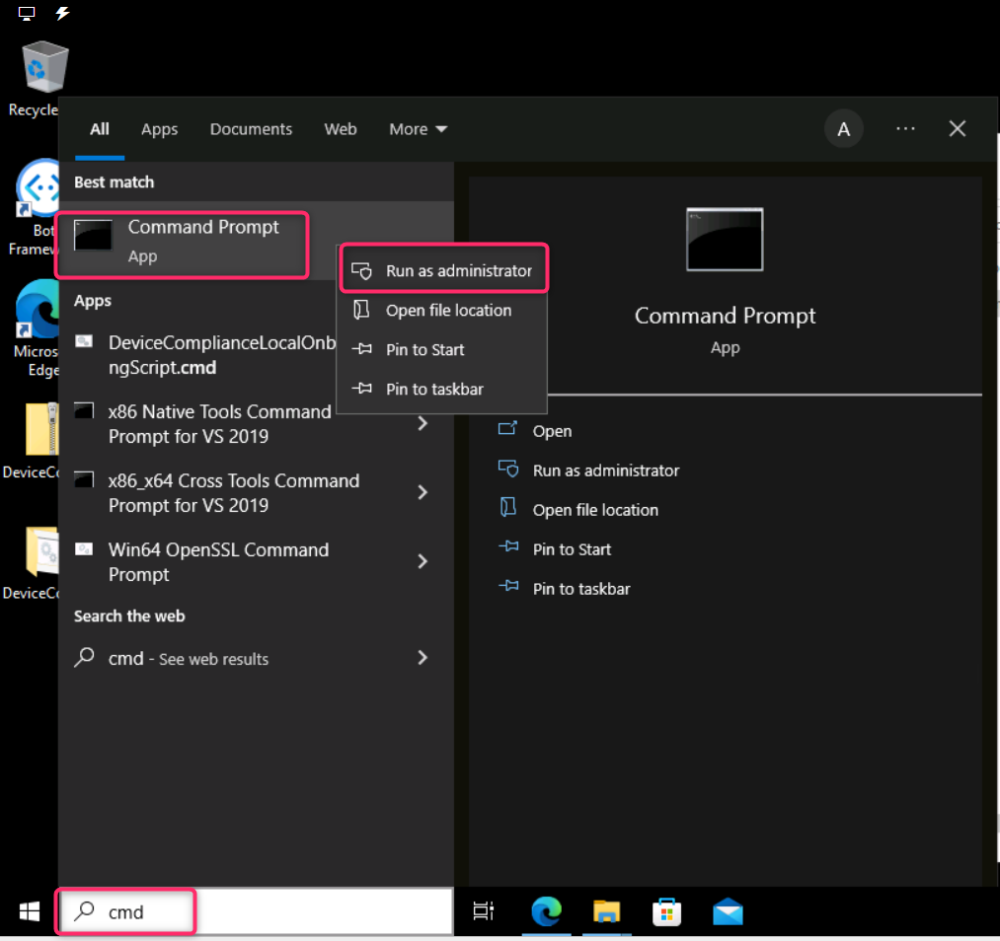

28. 在**用戶賬戶控制**對話框中，點擊“是”按鈕。

> 

29. 通過執行以下命令進行檢測測試。命令提示符窗口會自動關閉。

> powershell.exe -NoExit -ExecutionPolicy Bypass -WindowStyle Hidden \$ErrorActionPreference= 'silentlycontinue';(New-ObjectSystem.Net.WebClient).DownloadFile('http://127.0.0.1/1.exe','C:\test-WDATP-test\invoice.exe');Start-Process 'C:\test-WDATP-test\invoice.exe'
>
> 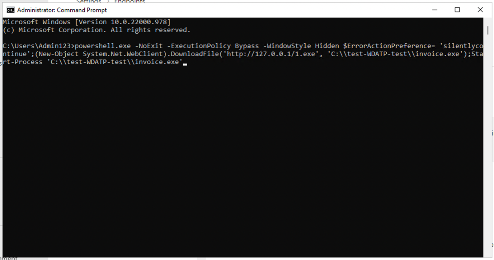

30. 關閉虛擬機連接。

31. 點擊導航中的設置，選擇“ **Devices Onboarding** \> **Devices**.” 打開設置。

> **注釋:** 雖然通常設備上線需要大約60秒才能啟用，但請允許最多30分鐘。

32. 你可以查看**設備**列表。在你接入設備之前，列表會是空的，一旦完成，你就能看到你的虛擬機被列為已接入的設備。

**任務 1 – 制定全組織範圍的政策，以檢測並評分高風險瀏覽器使用情況**

**第一步——創建新保單**

1.  在Microsoft Purview門戶中，點擊解決方案，然後點擊 ** Insider Risk Management **

> 

2.  點擊“**政策**”。在策略頁面，點擊**+ Create policy \> Custom policy. **。

> 

3.  在“選擇策略模板”頁面，選擇“風險瀏覽器使用（預覽），”風險瀏覽器使用“（預覽）”。

> 

4.  複習所有先修課程。

> 

5.  選擇**“下一頁**”繼續。

> 

6.  在名稱**和描述**頁面，填寫以下字段：

    - Name: Risky usage of browser

    - Description: This is a test policy for the risky browser usage

7.  選擇**“下一頁**”繼續。

> 

8.  在**“選擇用戶、組和自適應範圍”**頁面，選擇**“所有用戶、組和自適應範圍”**。選擇**“下一頁**”繼續。

> 

9.  在**“排除用戶和組”**頁面，選擇**“下一步**”。

> 

10. 在“決定是否優先排序”頁面，選擇**“我現在不想優先處理內容**”。選擇**“下一頁**”繼續。

> 

11. 在 ** Choose triggering event for this policy時**，選擇**“啟用指示器**”按鈕。

> 

12. 在**“ Turn on indicators for your organization **中，向下滾動，點擊“**選擇指示器以開啟**”按鈕。

> 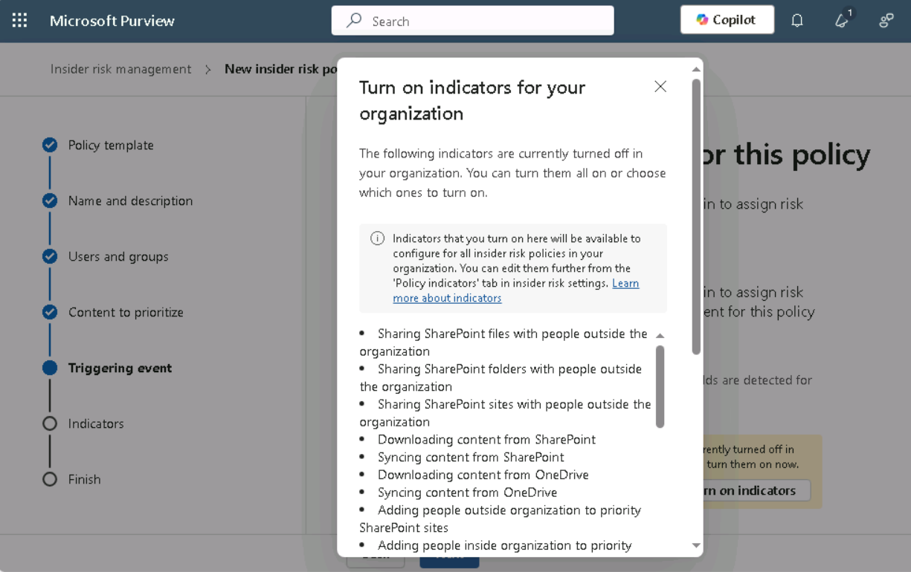
>
> 

13. 在**“選擇指示器以開啟**”對話框中，確保在“風險瀏覽指示器”（預覽）中選中所有指示器。

> 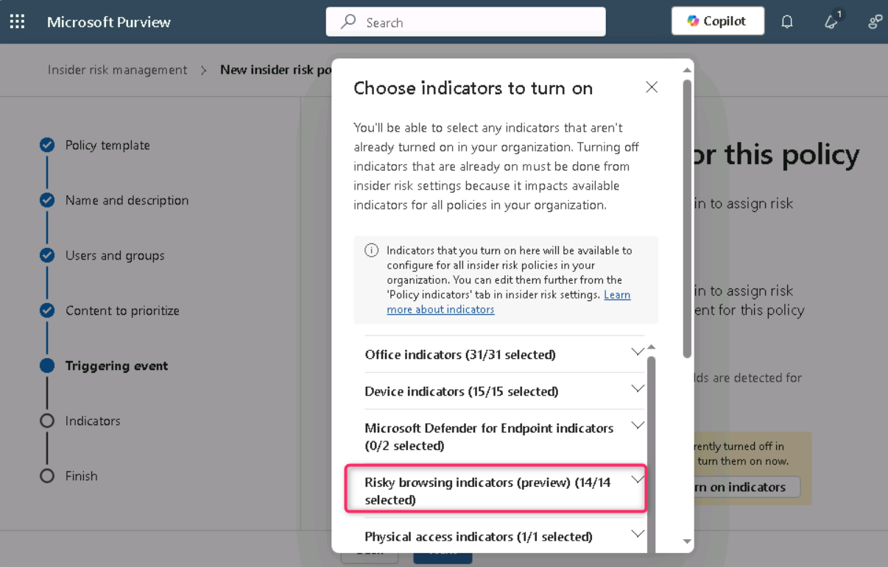
>
> 

14. 向下滾動，選擇**保存**。

15. 在 **Choose triggering event for this policy** 時，確保點擊“用戶瀏覽至潛在風險網站**”旁的單選按鈕** 。在**選擇觸發該政策的活動中**，選擇所有選項，點擊**“下一步**”按鈕。

> 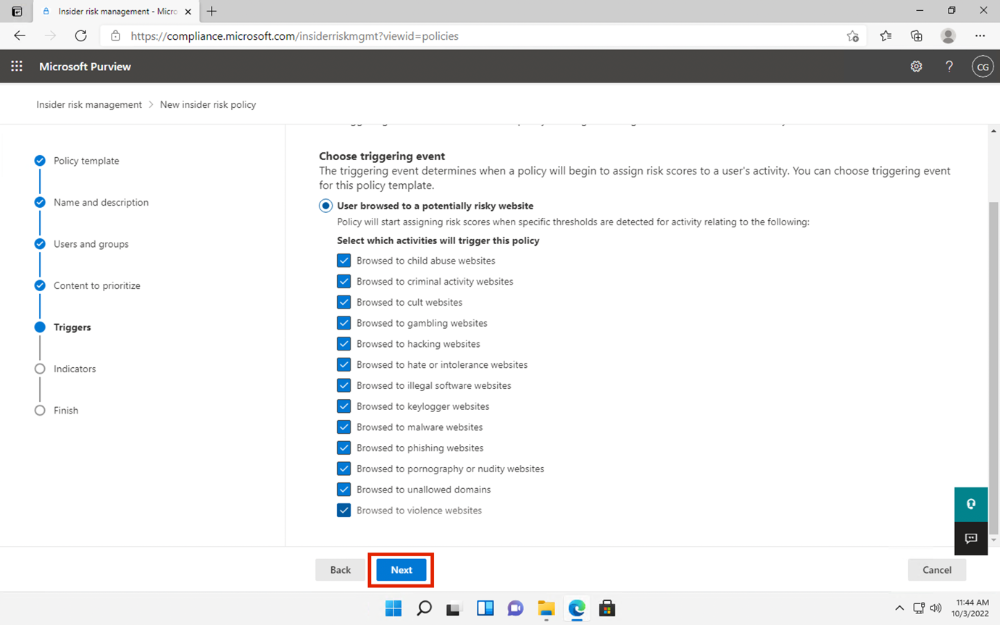

16. 在 ** Choose thresholds for triggering events** 頁面，選擇**“選擇您自己的閾值**”單選按鈕，將所有閾值改為每天1個，然後選擇**“下一步**”。

> 
>
> 

17. 在**指示器**頁面，選擇**“下一步**”。

> 

18. 在**“ Choose threshold type for indicators**”頁面，確保**選擇了“應用 Microsoft 提供的閾值**”，然後點擊**“下一步**”按鈕。

> 

19. 在**審核設置和結束**頁面，選擇**提交**。

> 

20. 在**“你的保單已創建**”頁面，選擇**“完成**”。

> 

21. 保持標簽頁打開，繼續做下一個任務。

**第二步——為保單評分**

1.  點擊名為“風險使用瀏覽器”的新政策。選擇**“為用戶開始計分活動**”。

> 

2.  在“活動評分原因”字段中輸入“測試策略”。在**“計分活動”欄中，針對**5天到30天，選擇**10天**。

> 

3.  在這些用戶的評分活動欄中，輸入MOD，然後選擇MOD管理員。

> 

4.  然後，點擊**“開始計分活動**”按鈕。

> 

5.  點擊**關閉**按鈕。

> 

**任務 2 – 離職用戶的數據盜竊**

**第一步——創建新保單**

1.  在**策略**頁面，點擊 **+ 創建策略**，然後選擇**自定義策略**。

> 

2.  在“選擇政策模板”頁面，在“數據盜竊”下選擇“離職用戶數據盜竊”。選擇“下一頁”繼續。

> 

3.  在**名稱和描述**頁面，填寫以下字段:

    - Name: Data theft by a user

    - Description: This is a test policy for preventing data theft

4.  選擇**“下一頁**”繼續。

> 

5.  在**“選擇用戶、組和自適應範圍”**頁面，選擇“所有用戶、組和自適應範圍”旁邊的單選按鈕，然後點擊**“下一步**”按鈕。

\

6.  在**“排除用戶和群組”（可選）**頁面，點擊**“下一步**”按鈕。

\

7.  在**“決定是否優先排序內容**”頁面，選擇**“我想要優先處理內容**”。只勾選**敏感標簽**和**敏感信息類型的複選框**。選擇**“下一頁**”繼續。

> 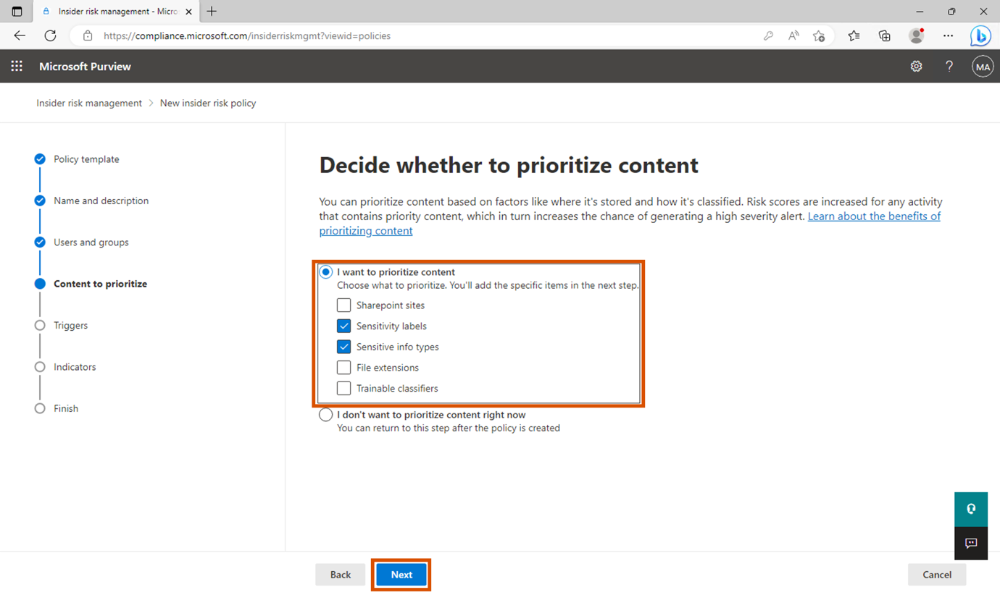

8.  在**“敏感度標簽優先排序**”頁面，選擇**添加或編輯敏感標簽**。在添加或編輯敏感標簽搜索欄中，輸入“employee”並按下回車鍵，選擇**內部/員工數據（HR），**然後選擇**添加**。然後點擊“下一步”。

> 

9.  在“**敏感信息類型優先排序**”頁面，選擇**添加或編輯敏感信息類型**。在跳出窗格中，搜索並選擇信用卡**號**、**Contoso員工ID**和**Contoso員工EDM**。選擇**添加**。然後，點擊**“下一步**”。

> 

10. 在**決定是否只對優先內容的活動進行評分**時，確保**已選擇“獲取所有活動的警報**”。然後，點擊**“下一步**”按鈕。

> 

11. 在**該政策頁面選擇觸發事件**時，保持默認選項並選擇**“下一步**”。

> 

12. 在**“指標”**頁面，點擊“辦公室指標”（選中31/31）**旁的下拉菜單**。

> 

13. 確保所有辦公室指示器都被選中，然後點擊**“下一步**”按鈕。

> 

14. 保持檢測選項頁面**上的所有參數** 保持默認狀態，點擊**“下一步**”按鈕

> 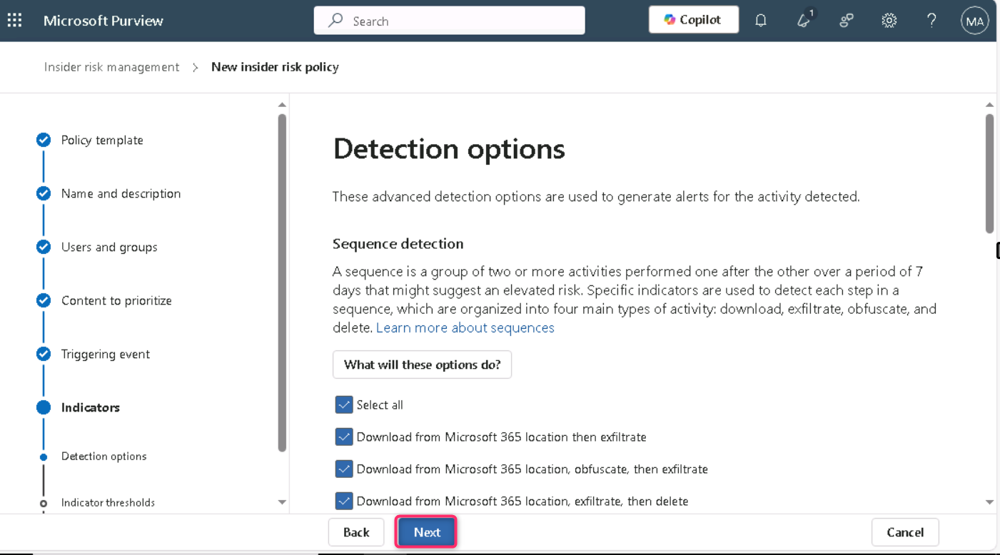

15. 在**“選擇指標閾值類型**”頁面，選擇“**選擇你自己的閾值**”旁的單選按鈕，然後向下滾動並點擊“Office 指標”下拉菜單。

> 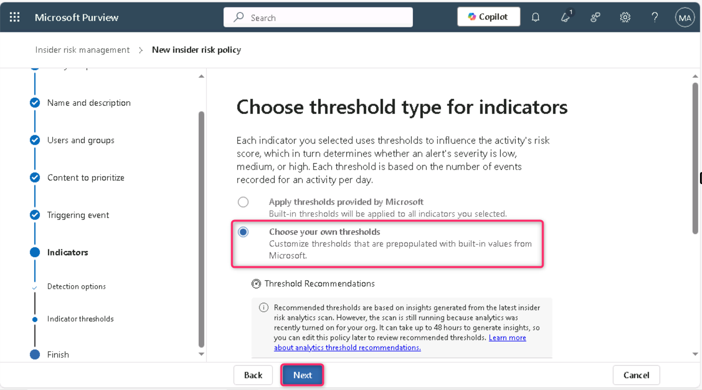
>
> 

16. 在**與組織外部人員共享SharePoint文件**中，每個階段分別設置1、2和3個事件，然後選擇**“下一步**”。

> 

17. 在 **Review and Finish** 頁面，點擊**提交**按鈕。

> 

18. 在您的保單創建中，選擇“完成”。

> 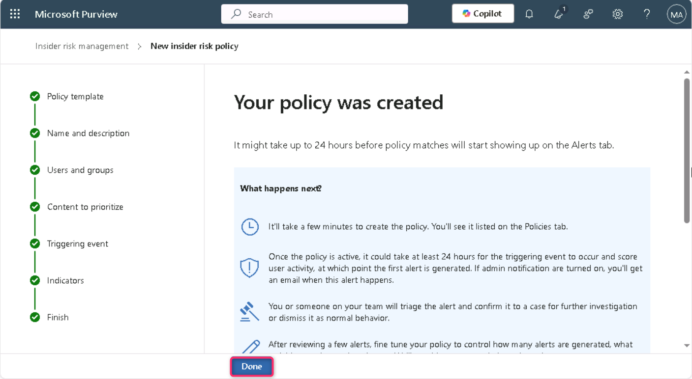

**第二步——為保單評分**

19. 點擊名為**“用戶數據盜竊”的新策略**。選擇**“為用戶開始計分活動**”。

> 

20. 在“活動評分原因”字段中輸入“測試策略”。在**“計分活動”欄中，針對**5天到30天，選擇**10天**。

> 

21. 在這些用戶的評分活動欄中，輸入MOD，然後選擇MOD管理員。

> 

22. 然後，點擊**“開始計分活動**”按鈕。

> 

23. 點擊**關閉**按鈕。

> 

**任務 3 – 用戶數據洩露**

**第一步——創建新保單**

1.  在**策略**頁面，點擊 **+ 創建策略**，然後選擇**自定義策略**。

> 

2.  在“**選擇策略模板**”頁面，選擇**數據洩露**，在**“數據洩露”**下。選擇**“下一頁**”繼續。

> 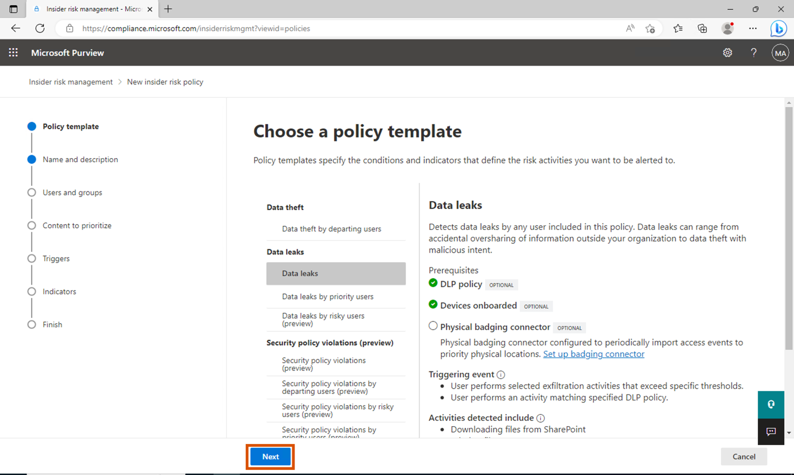

3.  在**名稱和描述**頁面，填寫以下字段:

    1.  Name: Data leaks by a user

    2.  Description: This is a test policy for preventing data leaks

4.  選擇**“下一頁**”繼續。

> 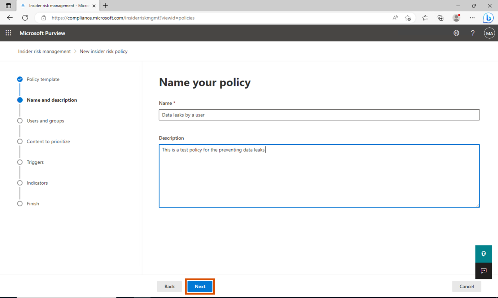

5.  在**“選擇用戶、組和自適應範圍”**頁面，確保**選擇了所有用戶、組和自適應範圍的**單選按鈕。然後點擊**“下一頁**”按鈕繼續。

> 

6.  在**“排除用戶和群組”（可選）**頁面，點擊**“下一步**”按鈕。

7.  在**“Decide whether to prioritize** **”**頁面，選擇**“我想要優先處理內容**”。選擇**SharePoint網站、敏感標簽和敏感信息類型的複選框**。點擊**“下一步**”按鈕。

> 

8.  在“**SharePoint 優先級網站**”頁面，選擇**添加或編輯 SharePoint 網站**。在飛出窗格中輸入 https://WWLxXXXXXX.sharepoint.com/sites/ContosoWeb1，然後選擇Contoso Web 1**旁的複選框** ，點擊**添加按鈕。然後，點擊“下一步**”。

> **注意**：**XXXXXX**租戶前綴可在**資源**標簽頁中獲取。
>
> 
>
> 
>
> 

9.  在**“敏感度標簽優先排序**”頁面，選擇**添加或編輯敏感標簽**。在飛出窗格中輸入“員工”，然後選擇“內部/員工數據（HR）”複選框，點擊添加 按鈕。然後，點擊**“下一步**”按鈕。

> 
>
> 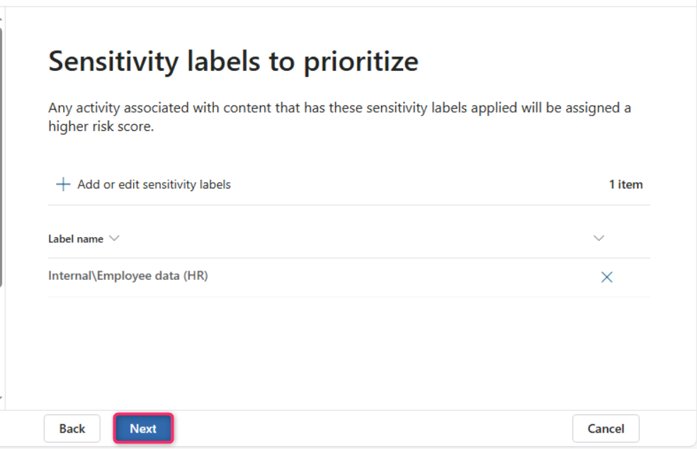

10. 在“**敏感信息類型優先排序**”頁面，選擇**添加或編輯敏感信息類型**。在跳出窗格中，Credit Card Number, Contoso Employee ID 和 Contoso Employee EDM. 。選擇**添加**。然後點擊**“下一步**”。

\

11. 在**Decide whether to score only activity with priority content** ，選擇**獲取所有活動的提醒**。選擇**下一步**。

> 

12. 在**該策略頁面的“選擇觸發事件**”時，確保選擇“用戶執行竊取活動**”的單選按鈕** 。在**選擇觸發該策略的活動**中，選擇**從SharePoint下載內容，向組織外收件人發送帶有附件的郵件**，與**組織外人員共享SharePoint文件**，然後選擇**下一步**。

> 
>
> 

13. 在**“選擇觸發事件閾值**”頁面，選擇“**選擇您自己的閾值**”旁的單選按鈕。將每個閾值設為1，然後選擇**“下一步**”。

> 
>
> 

13. 保持指示器頁面**的默認設置** ，選擇**下一步**。

> 

14. 保持檢測選項頁面的默認設置 ，選擇**“下一步**”。

> 

15. 在**“選擇指示器閾值類型**”頁面，確保**選擇“選擇您自己的閾值**”單選按鈕。然後，點擊 Office 指示器，分別為每個階段使用 1、2 和 3 個事件，然後選擇**“下一步**”。

> 
>
> 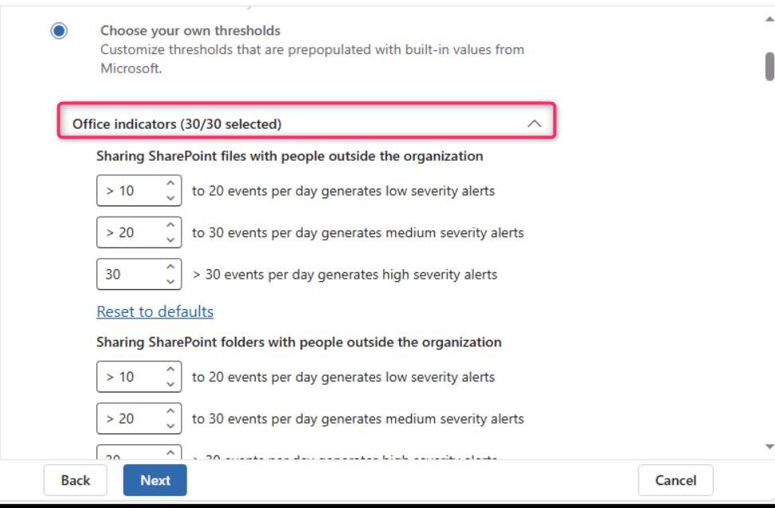
>
> 

16. 在**審核設置並完成時**，選擇**提交**。

> 

11. On Your policy was created, select Done.

> 

**第二步——為保單評分**

1.  在**策略**頁面，選擇名為**“用戶數據洩露”的新策略旁的複選框**。然後，選擇**“開始為用戶計分活動**”。

> 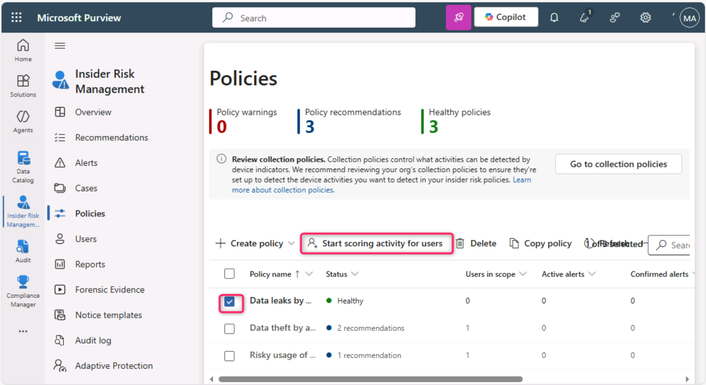

2.  在“活動評分原因”字段中，輸入“測試策略”。在**“計分活動”欄中，針對**5天到30天，選擇**10天**。在這些用戶的評分活動欄中，輸入MOD，然後選擇MOD管理員。

> 
>
> 

3.  然後，點擊**“開始計分活動**”按鈕。

> 

4.  點擊**關閉**按鈕。

> 

**總結:**

在這個實驗室裡，你首先通過同步虛擬機時鐘和為 Microsoft Purview 中的內部風險管理所需的用戶和設備進行導入來準備環境。你啟用了分析洞察，並在所有目標虛擬機上驗證了Defender的反惡意軟件客戶端版本。設備上線後，您創建了三種不同的 Insider Risk Management 策略，以監控和評分與高風險瀏覽器使用、離職用戶潛在數據盜竊以及內部用戶數據洩露相關的活動。每個策略都通過敏感標簽、SharePoint站點和敏感信息類型作為優先級內容進行定制，並配置閾值以觸發警報和評分。最後，你們啟動了評分活動，模擬真實世界的內部風險場景並評估配置策略的有效性。
