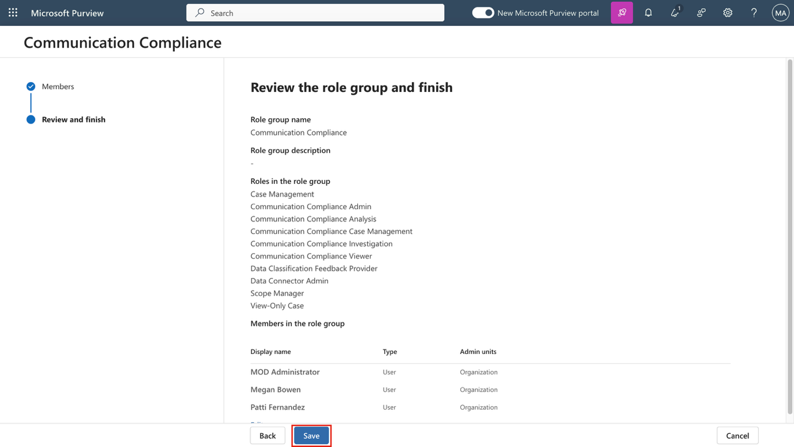
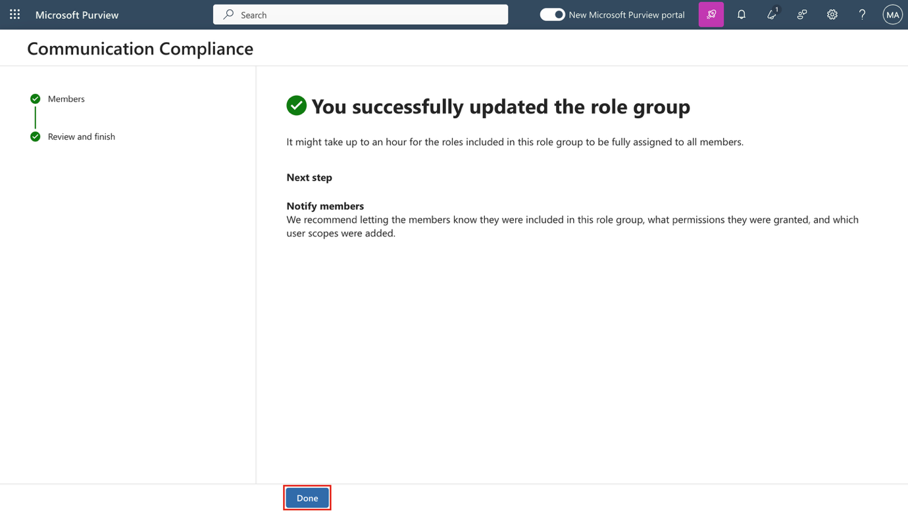
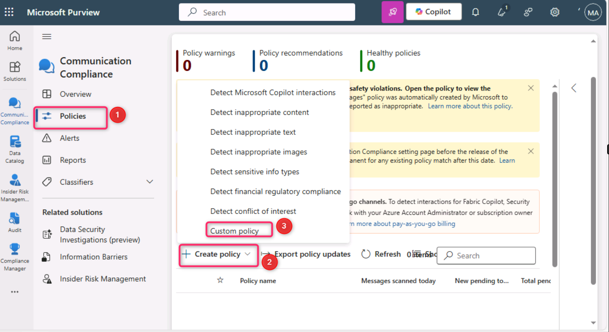
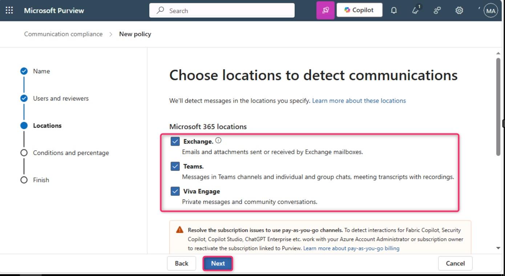
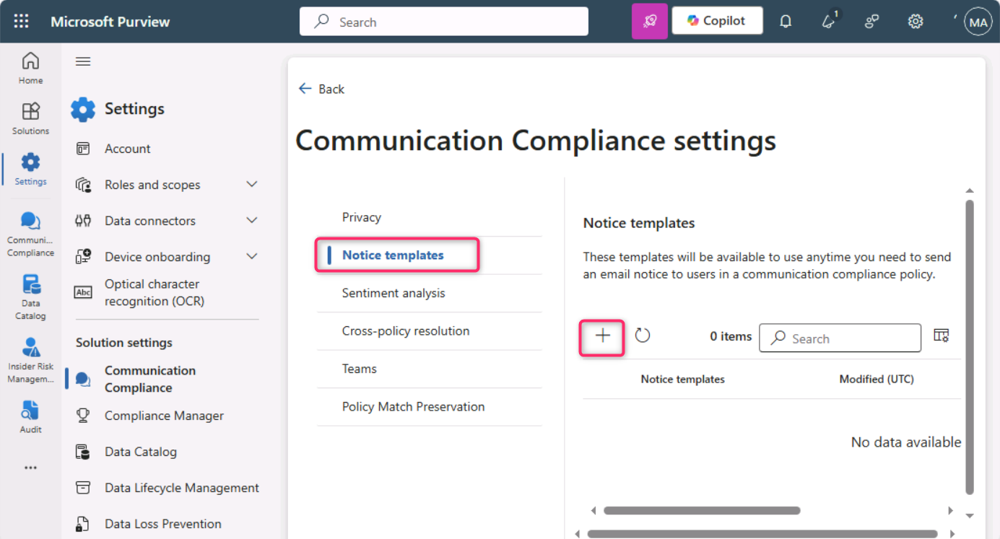

**實驗室 9 – 配置 Communication Compliance**

**介紹**

在本實驗室中，您將配置合規策略，以檢測組織內用戶傳遞的任何敏感信息。你將使用之前實驗室創建的敏感信息類型，檢測通過電子郵件傳遞的員工健康數據或員工身份證。

**目標**

1.  分配通信合規訪問的角色。

2.  使用 PowerShell 創建分發組。

3.  配置和編輯通信合規策略。

4.  啟用匿名化和用戶通知功能。

5.  瞭解政策測試流程。

**練習 1 – 啟用 Communication Compliance 權限**

在此任務中，您將將用戶分配到特定角色組，以在組織內不同用戶之間劃分溝通、合規、訪問和職責。

1.  在導航菜單中，選擇**設置**，然後選擇**角色和範圍。** 導航並點擊**“角色組”。**

> 

2.  向下滾動，選擇“ **Communication Compliance**”旁的複選框。然後，點擊鉛筆圖標進行**編輯**。

> 

3.  在 ** Edit members of the role group，**選擇**選擇用戶**。

> 

4.  務必選擇**國防部管理員**梅**根·鮑恩**和**帕蒂·費爾南德斯**。然後選擇**“選擇**”。

> 

5.  選擇**Next**.

> 

6.  選擇**“保存**”以將用戶添加到角色組。選擇**完成**以完成步驟。

> 
>
> 

**練習 2 – 建立溝通合規組**

在政策中，你將使用電子郵件地址來識別個人或群體。為了簡化你的設置，你可以為被審核溝通的人創建群組，也可以為審核溝通的人創建群組。

你可以用PowerShell配置分發組，為分配的組配置全域通信合規策略。這使你能夠通過單一策略檢測成千上萬用戶的消息，並在新員工加入組織時保持通信合規政策的更新。

1.  右鍵點擊Windows圖標，然後導航並選擇**Windows PowerShell（管理員）**

> 

2.  在用戶賬戶控制對話框中，選擇**“是**”。

> 

3.  輸入以下 cmdlet 即可使用 **Exchange Online PowerShell** 模塊並連接到您的租戶：

> Connect-ExchangeOnline
>
> 

4.  當顯示**登錄**窗口時，請以**MOD管理員身份登錄**。如果**這台設備上自動登錄所有桌面應用和網站？** 對話框出現，然後選擇**“否，僅限此應用**”按鈕

> 
>
> 

5.  為您的全球通信合規政策創建專門的分發組，涵蓋以下物業:

    - **MemberDepartRestriction = 關閉**. 確保用戶無法將自己從分發組中移除。

    - **MemberJoinRestriction = 關閉**. 確保用戶無法將自己添加到分發組。

    - **ModerationEnabled = 真的**. 確保所有發送給該組的消息都需審核，且該組不會被用於通信合規策略配置之外的通信。

> New-DistributionGroup -Name "Communication Compliance Group Contoso" -Alias "CCG_Contoso" -MemberDepartRestriction 'Closed' -MemberJoinRestriction 'Closed' -ModerationEnabled \$true

6.  

7.  **注意：**您可以按照以下命令添加 **Exchange 自定義屬性**，以跟蹤組織中添加到通信合規策略的用戶。

> Set-DistributionGroup -Identity "Communication Compliance Group Contoso" -CustomAttribute1 "MonitoredCommunication"

8.  

9.  請以定期計劃運行以下PowerShell腳本，將用戶添加到通信合規策略中：

> \$Mbx = (Get-Mailbox -RecipientTypeDetails UserMailbox -ResultSize Unlimited -Filter {CustomAttribute9 -eq \$Null})
>
> \$i = 0
>
> ForEach (\$M in \$Mbx)
>
> {
>
> Write-Host "Adding" \$M.DisplayName
>
> Add-DistributionGroupMember -Identity "Communication Compliance Group Contoso" -Member \$M.DistinguishedName -ErrorAction SilentlyContinue
>
> Set-Mailbox -Identity \$M.Alias -CustomAttribute1 "MonitoredCommunication"
>
> \$i++
>
> }
>
> Write-Host \$i "Mailboxes added to supervisory review distribution group."
>
> 

10. 腳本生成輸出後，打開新標簽頁並輸入以下URL：https://admin.cloud.microsoft/ 打開Microsoft 365管理中心。

> 如果被要求設置**多因素認證**，請選擇**暫時跳過**。

11. 在Microsoft 365管理中心頁面，點擊“**Teams & groups**”\>**“活躍團隊和**\>**群組”分發列表**\>**通信**合規組Contoso\*\*

> 

12. 在右側的“ Communication Compliance” 面板上，點擊“**成員**”標簽，向下滾動，查看分發列表組中的所有成員。

\

\

**練習 3 – 制定通信合規政策**

1.  在 Microsoft Purview 門戶中，選擇**“ Solutions \> Communication Compliance. **”。

> 

2.  在**“ Communication Compliance**”刀片中，點擊“**政策**”。然後在**策略**頁面選擇 **+ 創建策略**，然後點擊**自定義策略**。

> 

3.  在名稱 欄中輸入 My first communication compliance policy. 在**描述**字段中輸入 This is a policy to test communication compliance. 選擇**下一頁**.

> 

4.  在“**選擇用戶和審核者**”頁面，向下滾動至**審核員**部分，輸入並選擇**Patti Fernandez**。然後，點擊**“下一步”按鈕**。

> 

5.  在**“ Choose locations to detect communications ”頁面，確保勾選了** Microsoft 365 位置**下的所有複選框** ，然後點擊**“下一步**”按鈕。

> 

6.  在“**選擇條件”和“審核百分比”**中，向下滾動選擇**“添加條件**”，然後導航並選擇**“包含敏感信息類型的內容**”。

> 

7.  在**“內容包含這些敏感信息類型”**的框中，選擇**添加**，點擊**敏感信息類型**，搜索**“contoso**”。勾選我們在早期實驗室創建的所有敏感信息類型。然後點擊**添加**

> 

8.  向下滾動，選擇“使用OCR提取圖片文本**”旁的複選框**，然後將**評論百分比設置為100%，**點擊**“下一步**”按鈕。

> 

9.  在**審核並完成**頁面，選擇**創建政策**.

> 

10. **您的“政策創建”**頁面會顯示，並列出何時啟用政策以及哪些通信將被捕獲的指導方針。現在，點擊**“完成**”按鈕。

> 

**練習 4 – 編輯 Communication Compliance 政策**

1.  在**“communication compliance——政策**”頁面，點擊“我的第一個**communication compliance** 政策**”旁的省略號**，然後導航並點擊**“編輯**”。

> **注釋**: 如果你沒看到“我的第一次溝通合規政策”，請刷新頁面。
>
> 

2.  保留**姓名並描述之前設置的保單**，然後點擊**“下一步**”按鈕。

> 

3.  在**選擇用戶和審核者頁面，點擊“**選擇用戶**”旁邊的單選按鈕**。

> 

4.  在開始**輸入以查找用戶或組**時，搜索**“通信”**並選擇 ** Communication Compliance組 Contoso**。

> 

5.  在**審核員**部分，輸入並選擇MOD管理員。選擇**“下一步**”直到進入**“評測並結束**頁面。

> 

6.  然後，點擊**保存**按鈕。

> 

**練習 5 – 創建通知模板並配置用戶匿名化**

1.  在 Microsoft Purview 門戶中，從 右上角選擇設置，然後導航並選擇**“ Communication Compliance**”。

> 

2.  在**通信合規設置——隱私**頁面，為了啟用匿名化，請確保選擇**“顯示匿名化用戶名版本**”單選按鈕。然後，點擊**保存**按鈕。

> **注釋**: 如果 保存按鈕未被高亮，則選擇其他功能單選按鈕，再次選擇**“顯示匿名用戶名版本”**單選按鈕。
>
> 

3.  選擇**通知模板**，然後點擊**+**符號創建通知模板。

> 

4.  在**“創建通知模板**”頁面，填寫以下字段：

    - 模板名稱: Sample Notice

    - 發送方式：通過**輸入**“Patti”**並從下拉菜單中選擇名字，**選擇“Patti Fernandez”。

    - Cc: 通過輸入MOD 並從下拉菜單中選擇名稱，**選擇**MOD管理員。

    - 主題: Your communication violates company Communication compliance policy.

    - 消息主體: Please note this for future reference and provide an acceptable justification for your current communication.

5.  選擇**創建**以創建並保存通知模板。

> 

**練習 6 – 測試您的 Communication Compliance 政策**

在試用賬戶中，你沒有發送任何電子郵件的權利，但你可以查看以下步驟，瞭解如何在擁有自己許可證的情況下測試該政策。你可以執行步驟，但你的郵件無法從你當前租戶那裡送達收件人。

1.  在新的InPrivate Widnow中，通過在地址欄輸入以下URL，打開Outlook。: https://outlook.office365.com/mail/. 然後，在資源標簽頁中輸入用戶名 adelev@WWLxXXXXXX.onmicrosoft.com 和用戶密碼 登錄。

2.  請發送電子郵件至您的個人郵箱，內容如下.

> 主題行: Patti Fernandez (EMP123456) on Medical Leave Due to Flu
>
> 消息主體: Employee Patti Fernandez EMP123456 is on absence because of the flu/influenza
>
> 
>
> **注意**：電子郵件郵件大約需要24小時才能完全處理成保單。Microsoft Teams、Yammer及第三方平臺的通信大約需要48小時才能完全處理策略.

登錄到 https://purview.microsoft.com/ 飾演**帕蒂·費爾南德斯**。進入**“ Communication Compliance ”**\>**提醒**，查看24小時後保單的提醒。

總結**:**

在本實驗室中，您將學習如何在Microsoft Purview中配置和管理通信合規。你分配了所需的角色，使用PowerShell創建分發組，並設置合規策略以監控內部通信。你啟用匿名化以保護審核中的用戶身份，創建了用戶通知模板，並瞭解如何在全面執行前模擬和測試通信合規政策。
