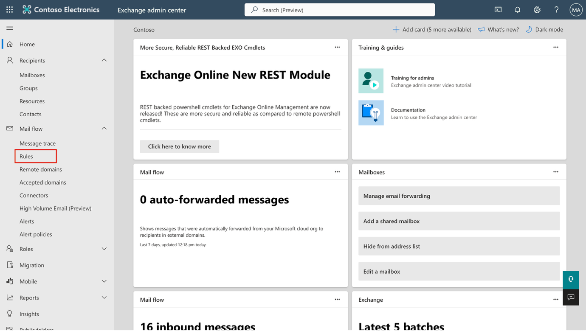
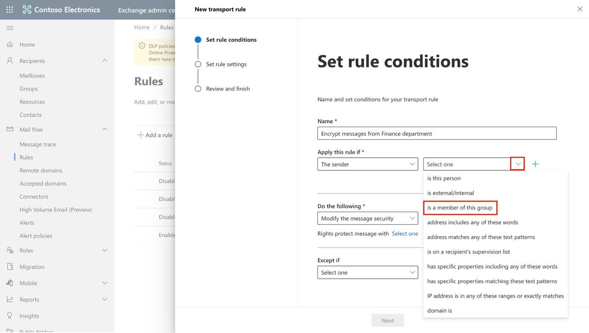
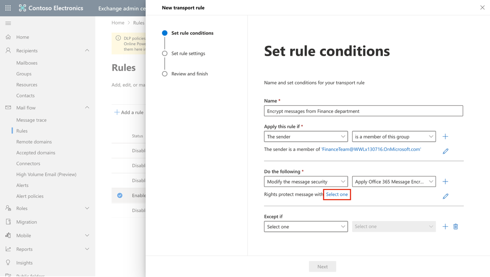
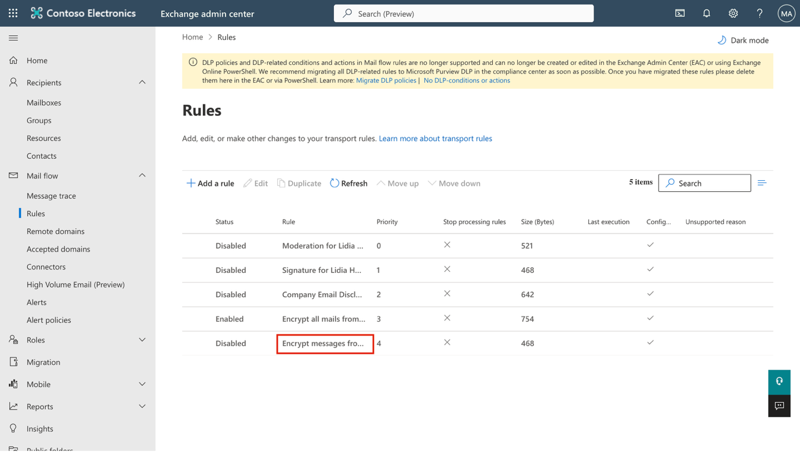
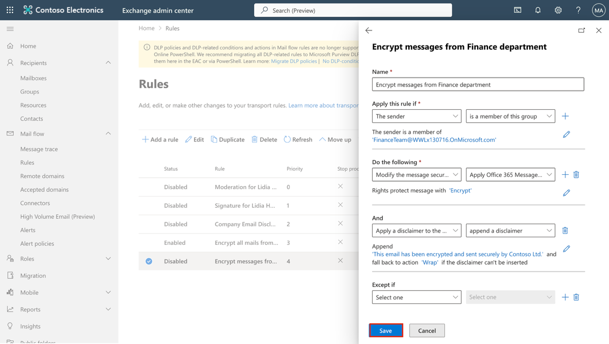
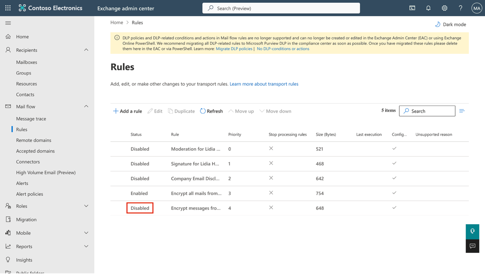

**Laboratorio 1 – Asignar Roles de Cumplimiento y Administrar la Encriptación de Mensajes de Office 365**

**Introducción:**

El portal de **Microsoft Purview** permite administrar directamente los permisos de los usuarios que realizan tareas dentro de Microsoft Purview. Mediante el área **Roles and scopes** en **Settings** del portal, puede administrar permisos para usuarios en todas sus soluciones de seguridad de datos, gobernanza de datos y riesgo y cumplimiento de Purview. Es posible limitar a los usuarios a realizar únicamente tareas específicas a las que se les conceda acceso explícitamente.

**Objetivo:**

- Asignar roles de managers y compliance a usuarios en Microsoft 365.

- Crear grupos de Microsoft 365 y grupos de seguridad para colaboración de equipos.

- Habilitar la prueba de Microsoft Purview compliance assessments.

- Verificar y configurar Azure RMS para Office 365 Message Encryption.

- Modificar la plantilla predeterminada de OME para deshabilitar el acceso mediante social ID.

- Probar la entrega de correos electrónicos encriptados sin inicio de sesión social.

- Crear y aplicar una plantilla personalizada de OME branding para el equipo de finanzas.

- Crear una regla de flujo de correo para encriptar mensajes del departamento de Finanzas.

- Agregar un disclaimer a los mensajes encriptados.

- Habilitar la regla de flujo de correo.

- Validar la encriptación de mensajes.

**Ejercicio 1 – Administrar Roles de Cumplimiento**

En este ejercicio se activarán todas las licencias de prueba necesarias para implementar la seguridad con **Microsoft Purview**.

**Tarea 1 – Asignar rol de manager a un usuario existente.**

1.  Inicie sesión en la máquina virtual (VM) con los datos de cuenta proporcionados para su laboratorio.

2.  Abra **Microsoft Edge** y navegue al **Microsoft 365 admin center**, <https://admin.microsoft.com>, e inicie sesión como **MOD Administrator**, usando las credenciales de administrador.

> \[!Note\] Nota: Omitir MFA para el **Microsoft 365 Admin center**
>
> En algunos tenants, podría aparecer un aviso de **Portal MFA Enforcement** al iniciar sesión. Si aparece este aviso:

- Seleccione **Skip for now** para retrasar temporalmente la configuración de MFA.

- En el cuadro de diálogo **Let us know why you're skipping MFA,** seleccione cualquier justificación y luego haga clic en **Send and skip**.

> Esto pospone la aplicación de MFA en el **Microsoft 365 Admin center** para el tenant y permite continuar con el laboratorio.

3.  En el panel izquierdo, seleccione **Users \> Active users**, y haga clic en el primer usuario **Adele Vance**.

> 

4.  En **Manager**, haga clic en **Edit manager**.

> 

5.  Elimine el manager actual y escriba **Patti** en el cuadro de búsqueda. Seleccione **Patti Fernandez** y haga clic en **Save Changes**.

> 

6.  Cambie el manager a **Patti Fernandez** para todos los siguientes usuarios:

    - Adele Vance

    - Christie Cline

    - Megan Bowen

7.  Para **Patti Fernandez**, agregue como manager a **MOD Administrator**.

**Tarea 2 – Asignar roles administrativos**

1.  Seleccione el usuario **Patti Fernandez**, en **Account**, desplácese a **Roles** y haga clic en **Manage roles**.

> 

2.  Una vez que se abra el panel **Roles**, marque el botón de opción junto a **Admin center access** y expanda **Show all by category.**

> 

3.  En la categoría **Security & Compliance**, seleccione las casillas para **Compliance Administrator**, **Security Administrator** y **Application Administrator**, luego haga clic en **Save changes** en la parte inferior del panel. Haga clic nuevamente en **Save changes**.

> 

4.  Cierre el panel, permanezca en la misma página y continúe con la siguiente tarea.

**Tarea 3 – Crear equipos y grupos en Microsoft admin center**

1.  Ahora expanda **Teams & groups**, seleccione **Active teams & groups** y haga clic en **Add a Microsoft 365 group** bajo **Teams & Microsoft 365 groups**.

> 

2.  En el campo **Name**, ingrese **Contoso Finance Team**, y en el campo **Description**, ingrese **This team handles finance.**, luego haga clic en **Next**.

> 

3.  En la página **Assign Owners**, haga clic en **Assign owners**, marque la casilla junto a **Adele Vance** y haga clic en **Add(1)**. Haga clic en **Next**.

> 

4.  En la página **Add members**, agregue a **Adele Vance** y **Christie Cline** como miembros y haga clic en **Next**.

5.  Para la dirección de correo del grupo, use **contosofinance** y luego haga clic en **Next**.

> 

6.  Haga clic en **Create group**.

> 

7.  Una vez finalizado, haga clic en **Close**.

> 

8.  En la página **Active teams & groups**, seleccione la pestaña **Security groups**. Haga clic en **Add a security group.**

> 

9.  Repita los pasos para crear otro grupo con la siguiente información:

    - En **Set up the basics**, ingrese en el campo **Name:** EDM_DataUploaders.

    - En el campo **Description**, ingrese: People who will upload data for EDM.

    - Seleccione **Next**.

    - En la página **Settings**, seleccione **Next.**

    - En la página **Review and finish adding group**, revise la configuración y seleccione **Create group**.

    - Cuando se muestre la página **New group created**, seleccione el botón **Close.**

    - Ahora seleccione el grupo recién creado **EDM_DataUploaders** de la lista.

    - En la pestaña **Members**, seleccione **View all and manage owners** y agregue a **Patti Fernandez** y **Christie Cline** como **owners.**

    - De manera similar, agregue a **Patti Fernandez** y **Christie Cline** como miembros.

> 

**Ejercicio 2 – Administrar Office 365 Message Encryption**

**Tarea 1 – Crear una regla de flujo de correo para encriptar mensajes del departamento de Finanzas**

En esta tarea, utilizará el **Exchange admin center** para crear una regla de flujo de correo que aplique **Microsoft Purview Message Encryption** a todos los mensajes enviados por los miembros del grupo **Finance Team**..

1.  En **Microsoft Edge**, vaya a <https://admin.exchange.microsoft.com> e inicie sesión como **PattiF@TenantName**.

2.  En el panel de navegación izquierdo, expanda **Mail flow**, luego seleccione **Rules**.

> 

3.  En la página **Rules**, seleccione **+ Add a rule \> Apply Office 365 Message Encryption and rights protection to messages**.

> 

4.  En la página **Set rule conditions**, configure:

    - **Name:** Encrypt messages from Finance department

    - En la sección **Apply this rule if**, configure:

      - Para el primer desplegable: **The sender**

> 

- Para el segundo desplegable: **is a member of this group**, luego seleccione **Finance Team** y haga clic en **Save** en el panel **Select members**.

> 
>
> 
>
> 

- En la sección **Do the following**:

  - Mantenga seleccionadas las opciones predeterminadas **Modify the message security** y **Apply Office 365 Message Encryption and rights protection.**

> 

- Haga clic en el enlace **Select one** bajo la sección **Do the following**.

> 

- En el panel **Select RMS template**, seleccione **Encrypt**, luego haga clic en **Save**.

> 

- Haga clic en **Next** en la página **Set rule conditions**.

> 

5.  En la página **Set rule settings**, mantenga las opciones predeterminadas seleccionadas y luego haga clic en **Next**.

> 

6.  En la página **Review and finish**, revise la regla de flujo de correo y luego haga clic en **Finish**.

> 

7.  Seleccione **Done** una vez que la regla de flujo de correo haya sido creada.

> 

Ha creado exitosamente una regla de flujo de correo que encripta los mensajes enviados desde el departamento de Finanzas usando **Microsoft Purview Message Encryption**, asegurando que las comunicaciones financieras sensibles estén protegidas antes de salir de la organización.

**Tarea 2 – Agregar un disclaimer a los mensajes encriptados**

A continuación, modificará la regla de encriptación existente para añadir un **disclaimer**. Este **disclaimer** funciona como una forma simple de **message branding**, notificando a los destinatarios que el mensaje fue enviado de manera segura por **Contoso Ltd**.

1.  En la página **Rules**, seleccione la regla recién creada **Encrypt messages from Finance department**.

> 

2.  En el panel de **Encrypt messages from Finance department**, seleccione **Edit rule conditions**.

> 

3.  Seleccione el **+** a la derecha de la sección **Do the following** para agregar otra acción.

> 

4.  En la nueva sección **And**:

    - Para el primer desplegable: **Apply a disclaimer to the message.**

> 

- Para el segundo desplegable: **append a disclaimer**.

> 

- Debajo de los desplegables, seleccione **Enter text**.

> 

- Luego ingrese: *This email has been encrypted and sent securely by Contoso Ltd.* en el panel **specify disclaimer text**.

- Seleccione **Save** en la parte inferior del panel.

> 

- Haga clic en el enlace **Select one** para agregar una acción de respaldo (**fallback action**).

- En el panel **specify fallback action**, seleccione **Wrap**, luego haga clic en **Save** en la parte inferior del panel.

> 

5.  Seleccione **Save** en la parte inferior del panel **Encrypt messages from Finance department**.

> 

6.  Una vez que la regla haya sido modificada, verá un mensaje indicando: **Transport rule updated successfully.**

> 

7.  Cierre el panel seleccionando **Done**.

> 

Ha actualizado la regla de encriptación para agregar un **disclaimer** a cada mensaje protegido. Esto deja claro a los destinatarios que el correo fue encriptado y transmitido de manera segura desde **Contoso Ltd.**

**Tarea 3 – Habilitar la regla de flujo de correo**

Por defecto, las nuevas reglas de flujo de correo se crean en estado deshabilitado. En esta tarea, habilitará la regla de encriptación para que comience a proteger los mensajes del departamento de Finanzas.

1.  En la página **Rules**, seleccione **Disabled** para la regla recién creada **Encrypt messages from Finance department**.

> 

2.  En el panel de **Encrypt messages from Finance department**, active el interruptor (**toggle**) bajo **Enable or disable rule** a **Enabled**.

> 

3.  La regla de flujo de correo se habilitará automáticamente. Verá un mensaje indicando: **Updating the rule status, please wait….** Una vez habilitada, aparecerá el mensaje: **Rule status updated successfully**.

> 

4.  Cierre el panel haciendo clic en la **X** en la esquina superior derecha del panel.

> 

**Nota:** La propagación de la regla puede tardar varios minutos en aplicarse. Si la validación falla, espere unos minutos y envíe nuevamente el mensaje de prueba.

La regla de encriptación ahora está activa y aplica Microsoft Purview Message Encryption a los mensajes enviados desde el departamento de Finanzas. Todos los mensajes futuros de los usuarios de Finanzas serán automáticamente encriptados e incluirán el disclaimer de Contoso Ltd.

.

**Tarea 4 – Validar la encriptación de mensajes**

En esta tarea, enviará un correo electrónico de prueba desde un miembro del departamento de Finanzas para confirmar que **Microsoft Purview Message Encryption** se aplica automáticamente y que el destinatario ve la notificación de mensaje seguro.

1.  Abra **Microsoft Edge** en una ventana **InPrivate** haciendo clic derecho en Microsoft Edge desde la barra de tareas y seleccionando **New InPrivate window**.

2.  Navegue a <https://outlook.office.com> e inicie sesión en **Outlook** on the web como **AdeleV@TenantName**.

3.  En el cuadro de diálogo **Stay signed in?,** seleccione la casilla **Don't show this again** y luego haga clic en **No**.

4.  En **Outlook on the web**, seleccione **New mail**.

> 

5.  En la línea **To**, ingrese su correo personal o de un tercero que no pertenezca al dominio del tenant. Ingrese **Secret Message** en la línea de asunto y **My super-secret message.** en el cuerpo del correo.

6.  Seleccione **Send** para enviar el mensaje. Mantenga la ventana de Outlook abierta.

> 
>
> Inicie sesión en su cuenta de correo personal en una nueva ventana y abra el mensaje enviado por **Adele Vance**.

- Si envió el mensaje a una cuenta de Microsoft (por ejemplo, **@outlook.com**), podría abrirse automáticamente.

- Si envió el correo a otro servicio de correo como **@gmail.com**, deberá seguir los pasos siguientes para procesar la encriptación y leer el mensaje.

7.  Seleccione **Read the message**.

> 

8.  Seleccione **Sign in with a One-time passcode** para recibir un código de acceso temporal.

9.  Vaya a su portal de correo personal y abra el mensaje con asunto: **Your one-time passcode to view the message**.

10. Copie el código de acceso, péguelo en el portal y seleccione **Continue**.

11. Revise el mensaje encriptado. Debería ver el texto: **This email has been encrypted and sent securely by Contoso Ltd.** al final del correo.

Ha validado exitosamente que los mensajes del departamento de Finanzas se encriptan automáticamente y que incluyen el disclaimer de Contoso Ltd., confirmando que Microsoft Purview Message Encryption funciona según lo esperado.

**Resumen:**

En este laboratorio, se replicó exitosamente una organización en nuestro **admin center**, se asignaron las licencias apropiadas y se aprendió a usar la encriptación de mensajes incorporada de **Microsoft 365** (**Office 365 Message Encryption – OME**).
