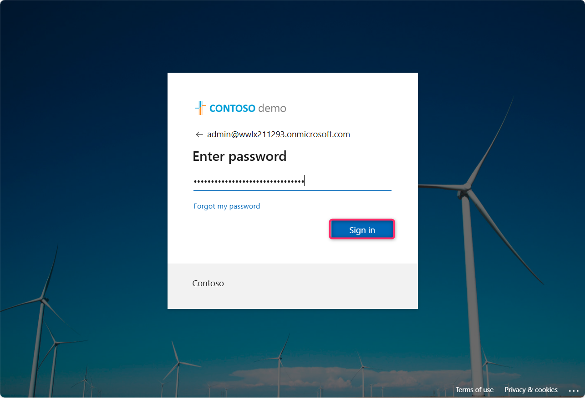
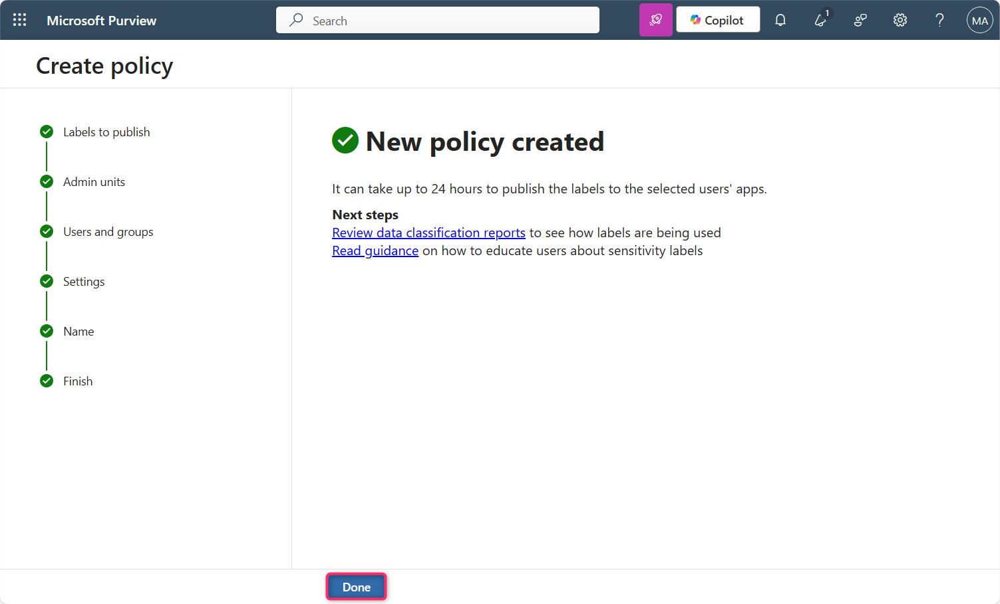
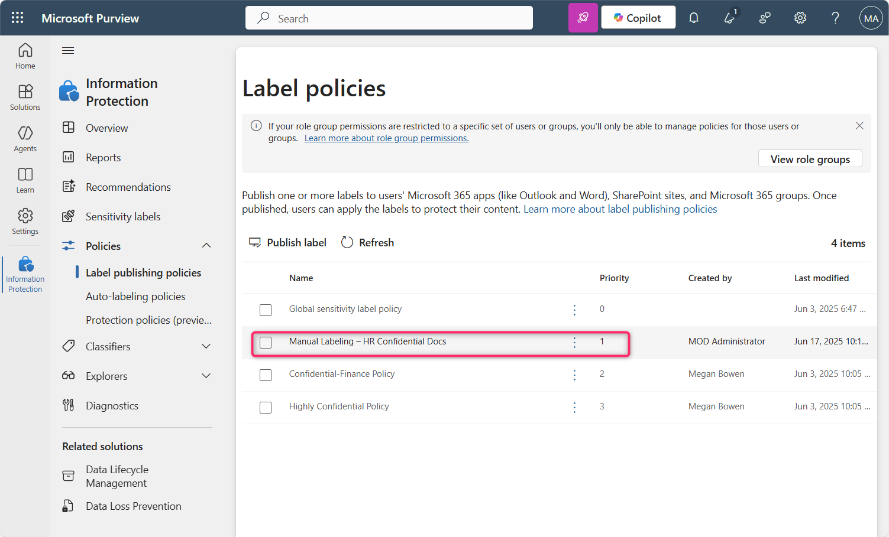

**Laboratorio 10 – Aplicar el etiquetado de *sensitivity labels* en Fabric y Power BI mediante Microsoft Purview**

**Introducción**

En el tenant deben habilitarse las **sensitivity labels** de **Microsoft Purview Information Protection** para Fabric y Power BI (incluido **Power BI Desktop**). Cuando se habilitan las sensitivity labels:

- Los usuarios y grupos de seguridad específicos de la organización pueden aplicar sensitivity labels a su contenido de Fabric. En el servicio de Fabric, esto significa cualquier elemento de Fabric. En Power BI Desktop, significa sus archivos **.pbix**.

- En el servicio, todos los miembros de la organización pueden ver esas etiquetas. En Desktop, solo los miembros de la organización que tengan publicadas dichas etiquetas pueden verlas.

**Objetivo**

- Habilitar y priorizar una directiva manual de *Sensitivity label* en Microsoft Fabric mediante Microsoft Purview.

**Ejercicio 1 – Activar la versión de prueba de Microsoft Fabric y acceder al Purview Hub**

1.  Abra Microsoft Edge y en la barra de direcciones ingrese la siguiente URL para abrir el portal de Fabric:- https://app.fabric.microsoft.com

**Nota:** En caso de que acceda directamente al portal de Fabric, omita los pasos 2 y 3.

2.  Ingrese sus credenciales del tenant.

3.  En el campo de contraseña, ingrese la contraseña del tenant. Luego seleccione **Sign in**.

4.  En el cuadro de diálogo **Welcome to the Fabric view**, seleccione **Cancel**.

5.  Seleccione el ícono de perfil en la barra de comandos.

6.  Navegue y seleccione el botón **Free trial**.

7.  En la ventana **Activate your 60-day free Fabric trial capacity**, en **Trial capacity region**, asegure que la región **Default – West US 3** esté seleccionada. Luego seleccione **Activate**.

8.  En el cuadro de diálogo **Successfully upgraded to a free Microsoft Fabric trial**, seleccione **Got it**.

9.  Seleccione el ícono de **Settings** en la barra de comandos.

10. En la sección **Governance and insights**, seleccione el enlace **Microsoft Purview hub (preview)**. Luego, en la página **Microsoft Purview hub (preview)**, navegue y seleccione el mosaico **Information Protection**.

11. En caso de que aparezca el cuadro de diálogo **Pick an account**, seleccione su ID de tenant.

12. En el cuadro de diálogo **Welcome to Information Protection in the new Microsoft Purview portal**, seleccione **Get started**.

**Ejercicio 2 – Crear y configurar una política de Sensitivity Label para Fabric y Power BI**

1.  En el **Information Protection** blade, navegue y seleccione el menú desplegable junto a **Policies**.

2.  Seleccione **Label publishing policies**. En la página **Label publishing policies**, navegue y seleccione **Publish label**.

3.  En la página **Create policy**, navegue y seleccione el enlace **Choose sensitivity label to publish**.

4.  En el panel **Sensitivity label to publish** que aparece en el lado derecho, seleccione la casilla junto a **Confidential** y luego seleccione **Add**.

5.  Seleccione **Next**.

6.  En la página **Assign admin units**, seleccione **Next**.

7.  En la página **Publish to users and groups**, asegure que la casilla junto a **Users and groups** esté seleccionada y luego seleccione **Next**.

8.  En la página **Policy settings**, seleccione la casilla **Require users to apply a label to their Fabric and Power BI content**. Luego seleccione **Next**.

9.  En **Default settings for documents – Apply a default label to documents**, seleccione **Next**.

10. En **Default settings for documents – Apply a default label to emails**, seleccione **Next**.

11. En **Default settings for meetings and calendar events**, seleccione **Next**.

12. En **Default settings for Fabric and Power BI content**, seleccione **Next**.

13. En la página **Name your policy**, en el campo **Name**, ingrese: Manual Labeling – HR Confidential Docs. Luego seleccione **Next**.

14. En la página **Review and finish**, seleccione **Submit**.

15. La política se crea correctamente. Seleccione **Done**.

16. En la página **Label policies**, verifique que la política **Manual Labeling – HR Confidential Docs** se ha creado correctamente.

17. Seleccione **Manual Labeling – HR Confidential Docs**, luego seleccione el menú de puntos suspensivos horizontales (**…**) y elija **Move up** para cambiar la prioridad.

18. Nuevamente seleccione **Manual Labeling – HR Confidential Docs**, seleccione el menú de puntos suspensivos horizontales y elija **Move up**.

19. Verifique que la prioridad de **Manual Labeling – HR Confidential Docs** se ha actualizado a **1**.

**Resumen**

En este laboratorio, se activó la versión de prueba de Microsoft Fabric, se accedió al portal de Microsoft Purview y se creó una política obligatoria de Sensitivity labels que requiere que los usuarios apliquen la etiqueta **Confidential** al contenido de Fabric y Power BI. Posteriormente, la política fue priorizada para su aplicación.
