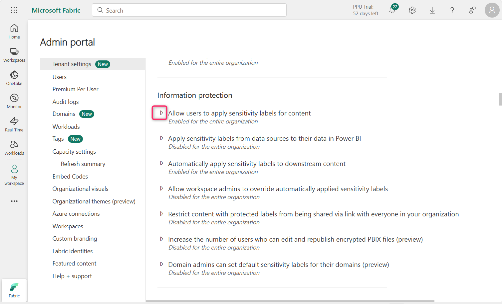
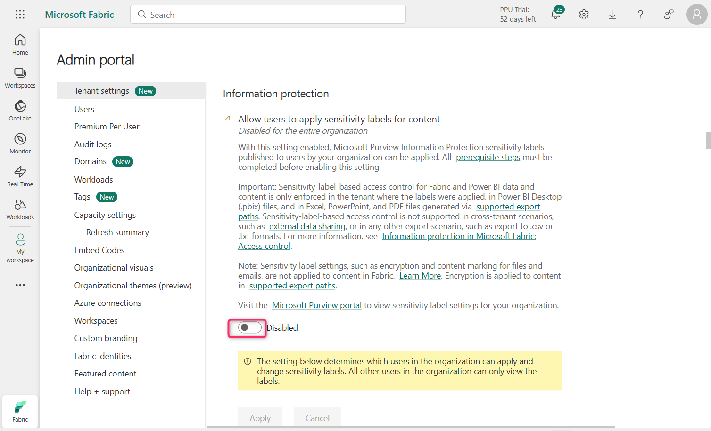
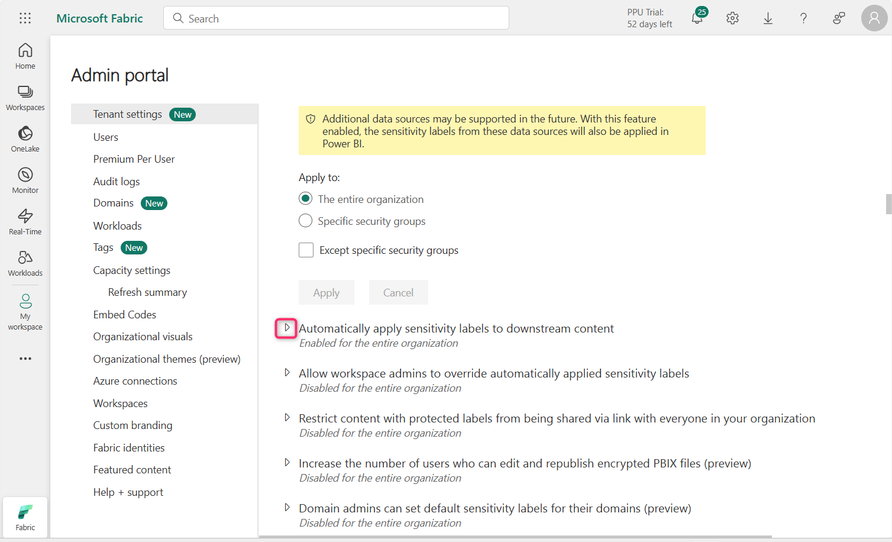
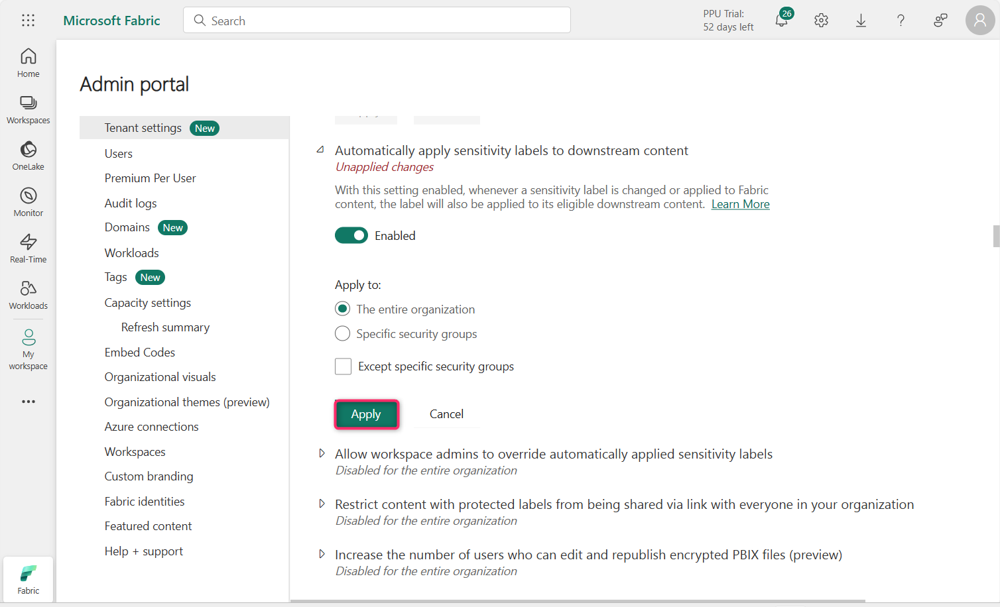
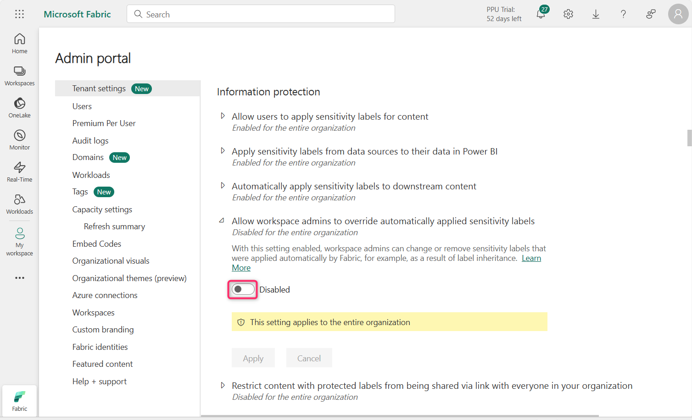
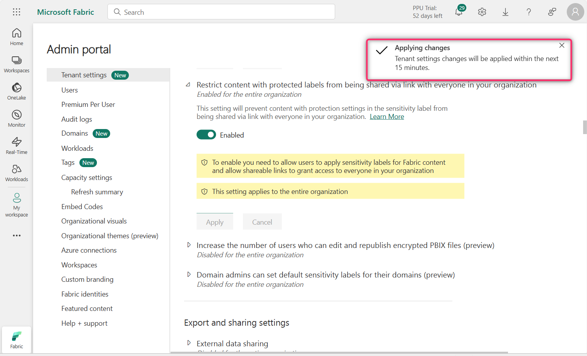

**Laboratorio 11 – Configurar Information Protection Policy en Fabric​**

**Introducción**

Las configuraciones de tenant de Information Protection ayudan a proteger información sensible en el tenant de Power BI. Permitir y aplicar *Sensitivity labels* al contenido garantiza que la información solo sea vista y accedida por los usuarios adecuados. 

**Objetivo**

- Habilitar las funcionalidades de Information Protection en Microsoft Fabric mediante el Admin Portal para preparar la aplicación de *Sensitivity labels*.

**Ejercicio 1 – Configurar Information Protection Settings en Fabric Admin Portal**

1.  En la página de inicio del portal de Fabric, haga clic en el ícono de **Settings** en la barra de comandos, luego navegue a la sección **Governance and insights** y haga clic en el enlace **Admin portal**.

> 

2.  En **Admin portal – Tenant settings**, desplácese hacia abajo hasta la sección **Information protection**.

> 

3.  Haga clic en el ícono de reproducción situado junto a **Allow users to apply sensitivity labels for content**.

> 

4.  Haga clic en el botón de **alternancia para habilitarlo.**\
    Con esta configuración habilitada, los usuarios especificados pueden aplicar *Sensitivity labels* desde Microsoft Purview Information Protection.

> 

5.  Ahora, haga clic en el botón **Apply**.

> 
>
> **Nota:** En caso de que el botón **Apply** no esté habilitado, seleccione el radio button **Specific security groups** y luego seleccione nuevamente **The entire organization.**

6.  Se mostrará una notificación indicando: **Tenant settings will be applied within the next 15 minutes.**

> 

7.  Haga clic en el ícono de reproducción junto a **Apply sensitivity labels from data sources to their data in Power BI.**

> 

8.  Haga clic en el botón de alternancia para habilitarlo.

> 

9.  Con esta configuración habilitada, los *Power BI semantic models* que se conectan a datos con *Sensitivity labels* en orígenes compatibles pueden heredar esas etiquetas, de modo que los datos permanezcan clasificados y seguros al incorporarse en Power BI.\
    \
    Haga clic en el botón **Apply**.

> 

10. Se mostrará una notificación indicando: **Tenant settings will be applied within the next 15 minutes.**

> 

11. Haga clic en el ícono de reproducción junto a **Automatically apply sensitivity labels to downstream content**.

> 

12. Haga clic en el botón de **alternancia para habilitarlo**.

> 

13. Con esta configuración habilitada, cuando se cambia o aplica una *Sensitivity label* a contenido de Fabric, la etiqueta también se aplicará a su contenido de downstream elegible.

> Haga clic en el botón **Apply**.
>
> 

14. Se mostrará una notificación indicando: **Tenant settings will be applied within the next 15 minutes**.

> 

15. Haga clic en el ícono de reproducción junto a **Allow workspace admins to override automatically applied sensitivity labels**.

> 

16. Haga clic en el botón de **alternancia para habilitarlo**.

> 

17. Esta configuración permite que los administradores del espacio de trabajo puedan reemplazar *Sensitivity labels* aplicadas automáticamente sin considerar las reglas de enforcement del cambio de etiqueta.\
    \
    Haga clic en el botón **Apply.**

> 

18. Se mostrará una notificación indicando: **Tenant settings will be applied within the next 15 minutes**.

> 

19. Haga clic en el ícono de reproducción junto a **Restrict content with protected labels from being shared via link with everyone in your organization**.

> 

20. Haga clic en el botón de alternancia para habilitarlo.

> 

21. Con esta configuración habilitada, los usuarios no pueden generar un enlace de uso compartido para *People in your organization* para contenido con configuraciones de protección en la *Sensitivity label*.

> Haga clic en el botón **Apply**.
>
> 

22. Se mostrará una notificación indicando: **Tenant settings will be applied within the next 15 minutes**.

> 

23. Haga clic en el ícono de reproducción junto a **Domain admins can set default sensitivity labels for their domains (preview).**

> 

24. Haga clic en el botón de alternancia para habilitarlo.

> 

25. Haga clic en el botón **Apply**.

> 

26. Se mostrará una notificación indicando: **Tenant settings will be applied within the next 15 minutes**.

> 

**Resumen**

En este laboratorio, se habilitaron varias configuraciones de Information Protection en el Microsoft Fabric Admin Portal para admitir la aplicación de *Sensitivity labels*, su herencia, el etiquetado automático y las anulaciones por parte de administradores.
