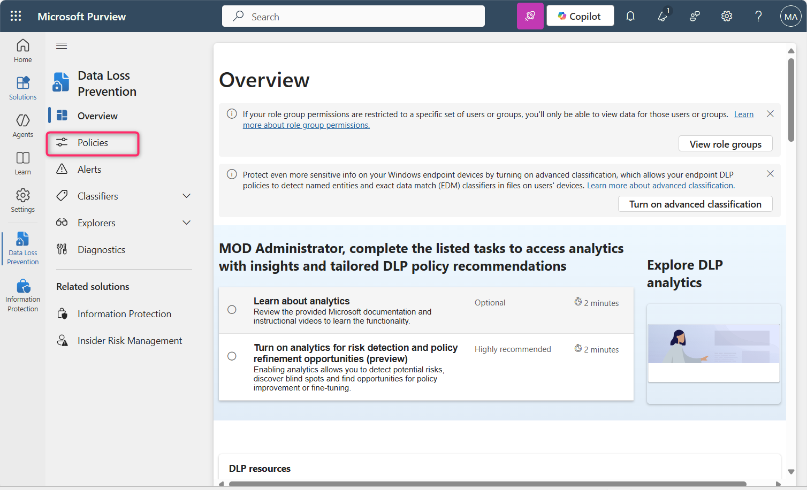
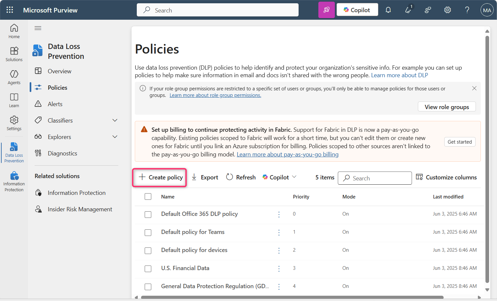
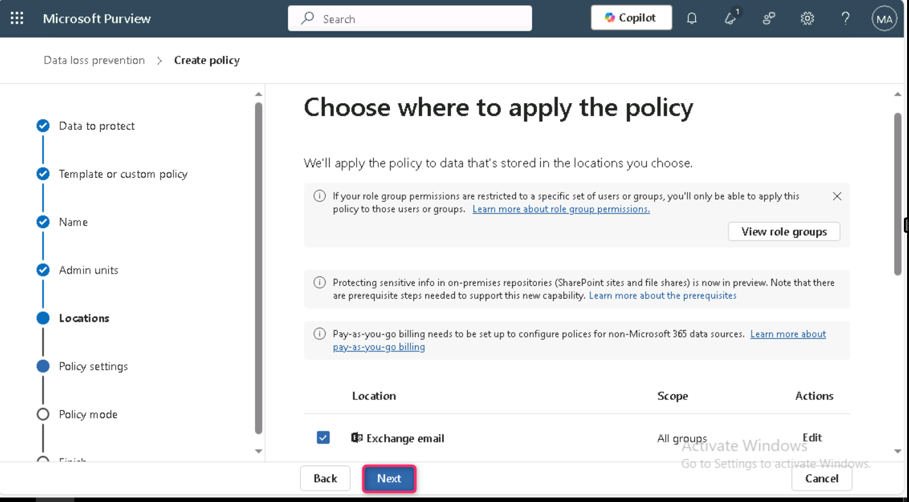
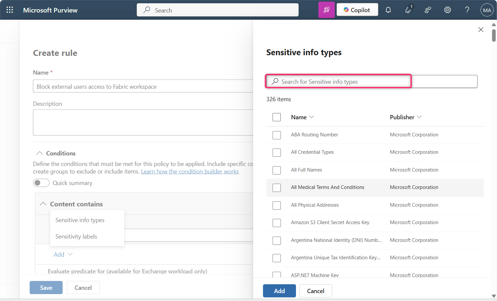
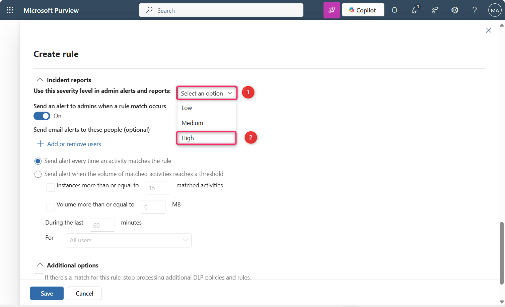
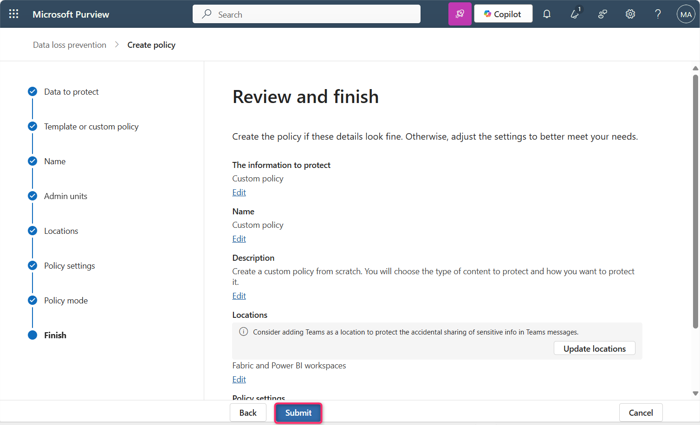
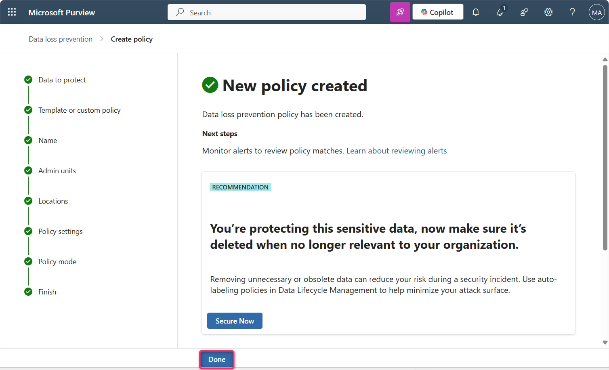

**Lab 12 – Crear una directiva DLP que bloquee el acceso de usuarios externos al espacio de trabajo Fabric\**

**Introducción\**
Se necesita bloquear a los usuarios externos el acceso a informes que contienen números de tarjetas de crédito, a menos que los datos estén etiquetados con la etiqueta de sensibilidad “Highly Confidential - Internal”, en cuyo caso una directiva de protección restringe el acceso a grupos de seguridad específicos. Se desea notificar al administrador de cumplimiento cada vez que un modelo semántico sea bloqueado y al propietario de los datos para que esté al tanto de que se aplicó la restricción. También se desea que los usuarios internos estén conscientes de que los datos son altamente confidenciales y que no deben compartirlos fuera de la organización.

<table>
<colgroup>
<col style="width: 45%" />
<col style="width: 54%" />
</colgroup>
<thead>
<tr>
<th style="text-align: center;"><strong>Declaración</strong></th>
<th style="text-align: center;"><strong>Pregunta de configuración respondida → Consulta de configuración atendida</strong></th>
</tr>
</thead>
<tbody>
<tr>
<td>“Se necesita bloquear a los usuarios externos…”</td>
<td>Dónde supervisar: <strong>Fabric y Power BI 
</strong>Ámbito administrativo: <strong>Directorio completo. 
</strong>Acción: <strong>Restringir. 
Acceso o cifrar el contenido en ubicaciones de Microsoft 365 &gt; Bloquear a los usuarios para que no reciban correo electrónico ni accedan a archivos compartidos de SharePoint, OneDrive y Teams, y elementos de Power BI &gt; Bloquear únicamente a las personas fuera de su organización.</strong></td>
</tr>
<tr>
<td>“…de informes que contienen números de tarjetas de crédito…”</td>
<td>Qué supervisar: usar la <strong>plantilla Custom</strong>. 
Condiciones para coincidencia: editarla para agregar el tipo de información confidencial Credit Card Number.</td>
</tr>
<tr>
<td>“…excepto si los datos están etiquetados con la etiqueta de sensibilidad Highly Confidential - Internal…”</td>
<td>Configuración del grupo de condiciones: crear un grupo de condiciones booleano NOT anidado, unido a la primera condición mediante un operador booleano AND. 
Condición para coincidencia: editarla para agregar la etiqueta de sensibilidad Highly Confidential - Internal.</td>
</tr>
<tr>
<td>“Se desea notificar al administrador de cumplimiento para que sepa cada vez que un modelo semántico sea bloqueado…”</td>
<td>Informes de incidentes: <strong>Send an alert to admins when a rule match occurs: On</strong>. Send an alert every time an activity matches the rule: <strong>selected</strong></td>
</tr>
<tr>
<td>“…el propietario de los datos para que esté al tanto de que la restricción se aplicó. También se desea que los usuarios internos estén conscientes de que los datos son altamente confidenciales y que no deben compartirlos fuera de la organización.”</td>
<td>Notificaciones a usuarios: <strong>On.</strong> Microsoft 365 files and Microsoft Fabric items: Notify users in Office 365 service with a policy tip or email notifications: <strong>selected</strong>. Policy tips: Customize the policy tip text: selected. Agregar texto en el cuadro de texto explicando las reglas que rigen la compartición de datos altamente confidenciales.</td>
</tr>
</tbody>
</table>

**Importante**

Para los fines de este procedimiento de creación de la directiva, se aceptarán los valores predeterminados de inclusión y exclusión, y la directiva permanecerá desactivada. Estos parámetros se modificarán cuando la directiva sea implementada.

**Objetivo**

- Crear una directiva personalizada de Data Loss Prevention (DLP) en Microsoft Purview para bloquear el acceso de usuarios externos a contenido de Fabric y Power BI que contenga información confidencial.

**Ejercicio 1: Crear una directiva DLP personalizada para bloquear el acceso externo a espacios de trabajo Fabric**

1.  En el portal de Microsoft Purview, seleccione **Solutions** y luego navegue y seleccione **Data Loss Prevention**.

> 

2.  Ahora, seleccione **Policies.**

> 

3.  En la página **Policies**, seleccione **+ Create policy**.

> 

4.  En el panel **What info do you want to protect?,** seleccione **Enterprise applications and devices**.

> 

5.  En la página **Choose what type of data to protect**, asegure que la opción **Data stored in connected sources** esté seleccionada y luego seleccione el botón **Next**.

> 

6.  En la página **Start with a template or create a custom policy**, seleccione **Custom** en **Categories**.\
    Seleccione **Custom policy** en la lista **Regulations** y luego seleccione el botón **Next**.

\

5.  En la página **Name your DLP policy**, en el campo **Name**, asegure que aparezca **Custom policy**.\
    **Nota:** Puede usar aquí la declaración de intención de la directiva. Las directivas no pueden ser renombradas.\
    \
    Seleccione el botón **Next**.

> 

6.  En la página **Assign Admin units**, seleccione el botón **Next**.

> 

7.  En la página **Choose where to apply the policy**, seleccione el botón **Next**.

> 

8.  En la página **Define policy settings**, asegure que la opción **Create or customize advanced DLP rules** esté seleccionada. Luego, seleccione el botón **Next**.

> 

9.  En la página **Customize advanced DLP rules**, seleccione **+ Create rule**.

> 

10. En la página **Create rule**, en el campo **Name**, ingrese +++**Block external users access to Fabric workspace**+++.

> 

11. En la sección **Conditions**, seleccione **Add condition \> Content contains \> Add \> Sensitive info types**.

> 
>
> 

12. En el panel **Sensitive info types** que aparece a la derecha, seleccione la barra de búsqueda, escriba +++**credit card number**+++ y presione Enter.

> 
>
> 

13. Seleccione la casilla junto a **Credit Card Number** y luego seleccione el botón **Add**.

> 

14. En **Actions**, seleccione **Add an action \> Restrict access or encrypt the content in Microsoft 365 locations.**

> 

15. Asegure que **Block users from receiving email or accessing shared SharePoint, OneDrive, and Teams files, and Power BI items** y **Block only people outside your organization** estén seleccionados.

> 

16. En **User notifications**, active el control **On**.

> 
>
> 

17. Seleccione las casillas **Notify users in Office 365 service with a policy tip or email notifications** y **Customize the policy tip text**.

> 

18. En la sección **User overrides**, seleccione la casilla **Allow users to override policy restrictions in Fabric (including Power BI), Exchange, SharePoint, OneDrive, and Teams** y luego seleccione la casilla **Override the rule automatically if they report it as a false positive**.

> 

19. En **Incident reports**, establezca **Use this severity level in admin alerts and reports** en **High**.

> 
>
> 

20. Asegure que el control **Send an alert to admins when a rule match occurs** esté en **On**.

21. Asegure que la opción **Send alert every time an activity matches the rule** esté seleccionada.

> 

22. Seleccione el botón **Save**.

> 

23. Revise la regla y luego seleccione el botón **Next**.

> 

24. Asegure que la opción **Run the policy in simulation mode** y la casilla **Show policy tips while in simulation mode** estén seleccionadas. Luego, seleccione el botón **Next**.

> 

25. En la página **Review and finish,** seleccione el botón **Submit.** Después de unos segundos, la directiva se creará correctamente.

> 
>
> 

**Nota importante:\**
Puede aparecer el siguiente error debido a una limitación de licencias en este entorno de laboratorio.

Este laboratorio se ejecuta con una licencia Power BI Pro, que no admite la integración de Microsoft Purview DLP para Fabric o espacios de trabajo Premium. Como resultado, acciones de DLP como “Block external users” no pueden aplicarse correctamente y el asistente falla con el siguiente error:\
To block only people outside your organization, you must select the condition 'Content is shared with people outside my organization'.

En un entorno empresarial real, este problema no ocurre si su tenant cuenta con:\
• Licencia Power BI Premium Per User (PPU)\
• o una capacidad Microsoft Fabric (F64+)

Estas licencias permiten la integración completa de directivas DLP con Microsoft Fabric y Power BI, incluido el soporte para acciones de bloqueo y el alcance adecuado de las condiciones.

**Resumen**

En este laboratorio, se creó una directiva DLP personalizada en Microsoft Purview para proteger contenido de Fabric y Power BI mediante la detección de datos confidenciales y la aplicación de restricciones para bloquear el acceso de usuarios externos. La directiva también habilita notificaciones a usuarios y alertas para administradores.
