**Lab 13 – Implementar y administrar retención**

Usted es Patti Fernandez, administradora de cumplimiento en Contoso Ltd. La empresa está fortaleciendo su estrategia de seguridad de datos para reducir la exposición al riesgo relacionada con datos financieros y comunicaciones privilegiadas. Se le ha solicitado configurar las soluciones de retención de Microsoft Purview que apoyan la preparación para auditorías, limitan la retención innecesaria de datos y garantizan la supervisión adecuada de las comunicaciones sensibles.

**Tareas**:

- Crear una etiqueta de retención.

- Publicar una etiqueta de retención.

- Crear una directiva de aplicación automática de etiqueta de retención.

- Crear una directiva de retención estática.

- Recuperar contenido de SharePoint.

**Ejercicio 1 – Crear una etiqueta de retención**

En esta tarea, se creará una etiqueta de retención para datos financieros sensibles que deben conservarse para fines de auditoría e investigación.

1.  Inicie sesión en la VM como administrador.

2.  En Microsoft Edge, navegue a <https://purview.microsoft.com> e inicie sesión como pattif@TenantName.

3.  Navegue a **Solutions \> Data Lifecycle Management**.

> 

4.  Luego seleccione **Retention labels**.

> 

5.  En la página **Labels**, seleccione **Create a label**.

> 

6.  En la página **Name your retention label**, ingrese:

    - **Name**: Sensitive Financial Records

    - **Description for users**: Use for financial files with sensitive data that must be retained for audit or security purposes.

    - **Description for admins**: Retains high-impact financial data for 5 years to support audits and security investigations.

7.  Seleccione **Next**.

> 

8.  En la página **Define label settings**, seleccione **Retain items forever or for a specific period** y luego seleccione **Next**.

> 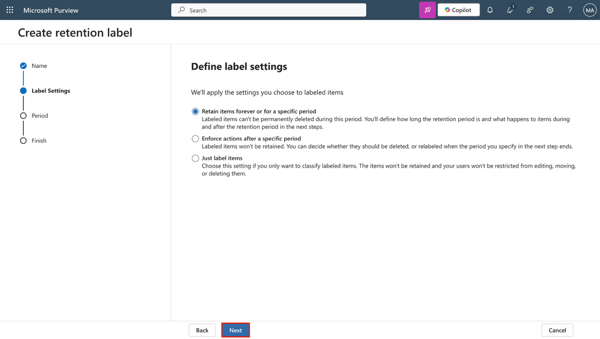

9.  En la página **Define the period**, asegúrese de que estos valores estén configurados para el período de retención:

    - **How long is the period?**: 5 Years

> 

- **When should the period begin?**: When items were modified

> 

10. Seleccione **Next**.

> 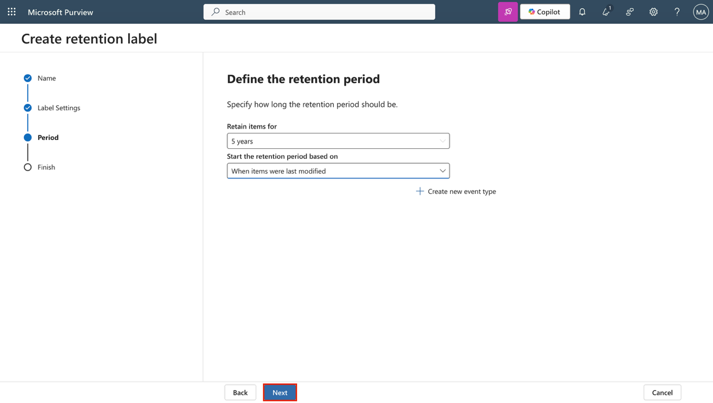

11. En la página **Choose what happens after the retention period**, seleccione **Delete items automatically** y luego seleccione **Next**.

> 

12. En la página **Review and finish**, seleccione **Create label**.

> 

13. En la página **Your retention label is created**, seleccione **Do nothing** y luego **Done**.

> 

Se ha creado una etiqueta de retención que conserva el contenido financiero durante cinco años y lo elimina posteriormente para reducir la exposición de datos.

**Ejercicio 2 – Publicar una etiqueta de retención**

En esta tarea, se publicará la etiqueta de retención para que los usuarios puedan aplicarla en servicios de Microsoft 365 como Exchange, SharePoint y OneDrive.

1.  En Microsoft Purview, navegue a **Solutions \> Data Lifecycle Management \> Retention labels**.

> 

2.  Seleccione la casilla junto a la etiqueta **Sensitive Financial Records** y luego seleccione el icono **Publish labels** para publicar esta etiqueta de retención.

> 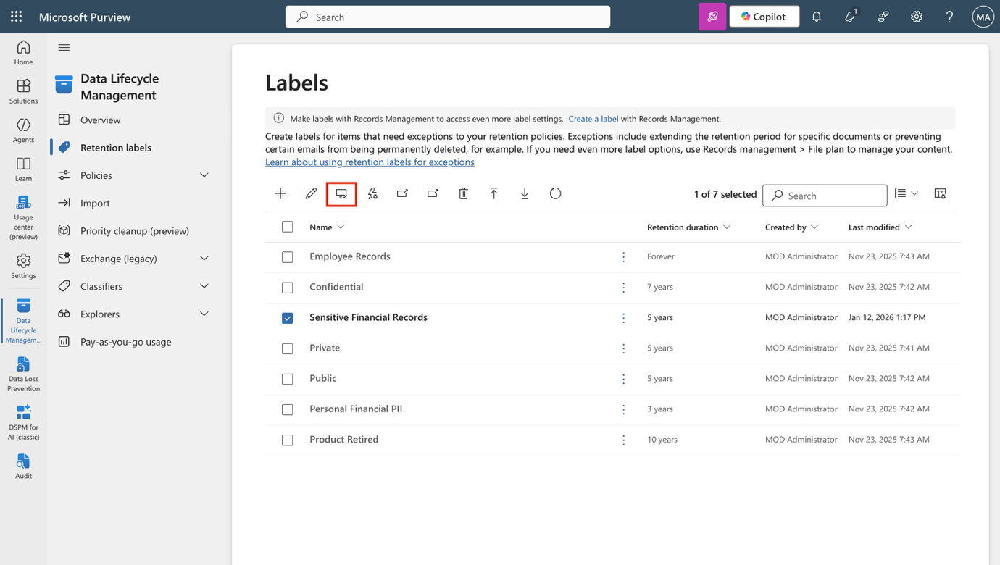

3.  En la página **Choose labels to publish**, verifique que la etiqueta **Sensitive Financial Records** esté seleccionada y luego seleccione **Next**.

> 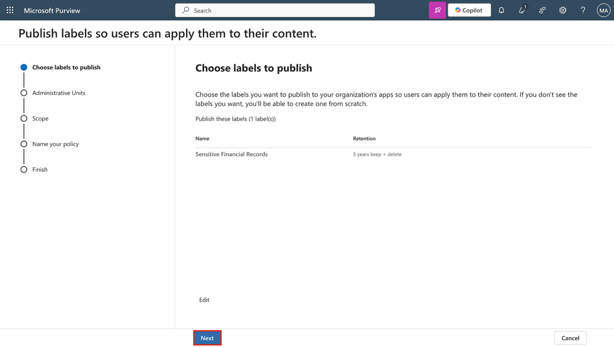

4.  En la página **Policy Scope**, seleccione **Next.**

> 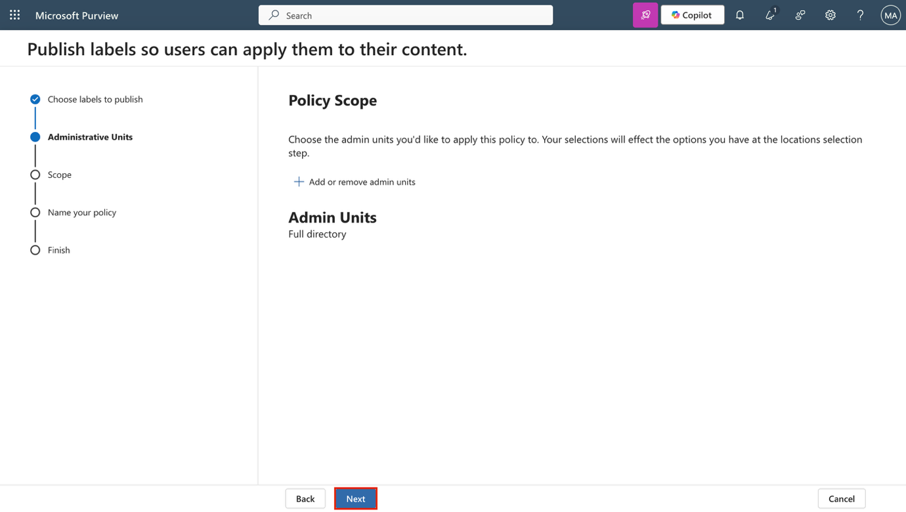

5.  En la página **Choose the type of retention policy to create**, seleccione **Static** y luego seleccione **Next**.

> 

6.  En la página **Choose where to publish labels**, seleccione **Let me choose specific locations** y seleccione:

    - Exchange mailboxes

    - SharePoint classic and communication sites

    - OneDrive accounts

    - Anule la selección de todas las demás ubicaciones

7.  Seleccione **Next**.

> 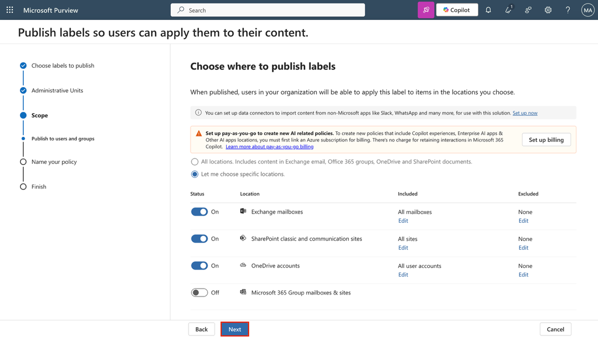

8.  En **Name your policy**, ingrese:

    - **Name**: Sensitive Financial Data Retention

    - **Description**: Makes the 'Sensitive Financial Records' label available to users in Exchange, SharePoint, and OneDrive.

9.  Seleccione **Next**.

> 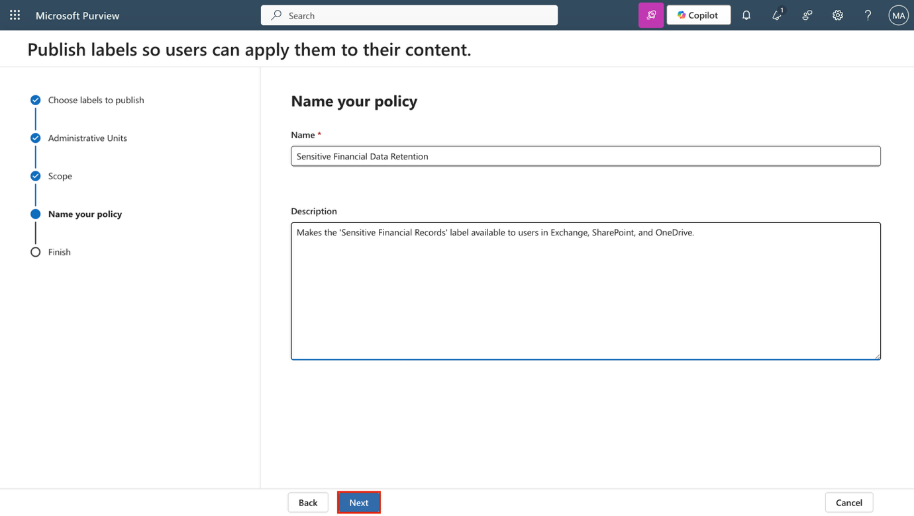

10. En la página **Finish**, seleccione **Submit**.

> 

11. En la página **Your retention label was published**, seleccione **Done**.

> 

Se ha publicado la etiqueta de retención, poniéndola a disposición de los usuarios para aplicarla en los principales servicios de Microsoft 365.

**Ejercicio 3 – Crear una directiva de aplicación automática de etiqueta de retención**

En esta tarea, se configurará una directiva que aplica automáticamente una etiqueta de retención a contenido que contenga información financiera personal.

1.  En Microsoft Purview, navegue a **Solutions \> Data Lifecycle Management \> Policies \> Label policies**.

> 

2.  En la página **Label policies**, seleccione **Auto-apply** **a label** para iniciar la configuración de la etiqueta.

> 

3.  En la página **Let's get started**, ingrese:

    - **Name**: Auto-apply Personal Financial PII

    - **Description**: Applies this label to personal financial data to help meet audit and investigation requirements. Retains content for 3 years.

4.  Seleccione **Next**.

> 

5.  En la página **Choose the type of content you want to apply this label to**, seleccione **Apply label to content that contains sensitive info** y luego seleccione **Next**.

> 

6.  En la página **Content that contains sensitive info**, seleccione la categoría Financial y luego la **regulación U.S. Gramm-Leach-Bliley Act (GLBA).** Seleccione **Next.**

> 

7.  En la página **Define content that contains sensitive info**, seleccione **Next**.

> 

8.  En la página **Policy Scope**, seleccione **Next**.

> 

9.  En la página **Choose the type of retention policy to create**, seleccione **Static** y luego **Next**.

> 

10. En la página **Choose where to publish labels**, seleccione **Let me choose specific locations** y seleccione:

    - Exchange mailboxes

    - SharePoint classic and communication sites

    - OneDrive accounts

    - Anule la selección de todas las demás ubicaciones.

11. Seleccione **Next**.

> 

12. En la página **Choose a label to auto-apply**, seleccione **Add label**.

> 

13. En el panel **Choose a label**, seleccione **Personal Financial PII** y luego seleccione **Add.**

> 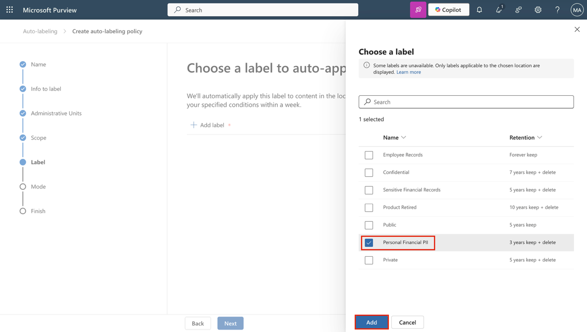

14. De regreso en la página **Choose a label to auto-apply**, seleccione **Next**.

> 

15. En la página **Decide whether to test or run your policy**, seleccione **Test the policy before running it** y luego seleccione **Next**.

> 

16. En la página **Review and finish**, seleccione **Submit**.

> 

17. En la página **Your auto-labeling policy has been created**, seleccione **Done**.

> 

Se ha creado una directiva de aplicación automática que identifica datos financieros personales y aplica automáticamente una etiqueta de retención.

**Ejercicio 4 – Crear una directiva de retención estática**

En esta tarea, creará una directiva de retención estática para el contenido de **Microsoft Teams** con el fin de ayudar a reducir el riesgo asociado al almacenamiento de datos a largo plazo.

1.  En **Microsoft Purview**, navegue a **Solutions \> Data Lifecycle Management \> Policies \> Retention policies**.

> 

2.  En la página **Retention policies**, seleccione **New retention policy**.

> 

3.  En la página **Name your retention policy**, ingrese:

    - **Name**: Teams Retention

    - **Description**: Retains Teams chats and channel messages for 3 years, then deletes them to reduce long-term data risk.

4.  Seleccione **Next**.

> 

5.  En la página **Policy Scope**, seleccione **Next**.

> 

6.  En la página **Choose the type of retention policy to create**, seleccione **Static**, luego seleccione **Next**.

> 

7.  En la página **Choose locations to apply the policy**, habilite:

    - Teams channel messages

    - Teams chats

    - Deje todas las demás ubicaciones deshabilitadas.

8.  Seleccione **Next**.

> 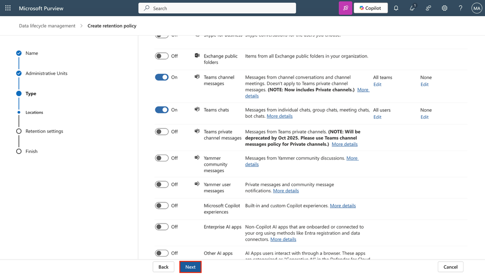

9.  En la página **Decide if you want to retain content, delete it, or both**, asegúrese de que estos valores estén configurados para la configuración de retención:

    - Seleccione **Retain items for a specific period**.

    - En **Retain items for a specific period**, seleccione **Custom** en la lista desplegable.

> 

- Cambie el campo de años a 3.

- **Start the retention period based on**: When items were last modified

- **At the end of the retention period**: Delete items automatically

10. Seleccione **Next**.

> 

11. En la página **Review and finish**, seleccione **Submit**.

> 

12. Luego seleccione **Done** en la página **You successfully created a retention policy**.

> 

Ha configurado una directiva de retención estática que conserva los mensajes de Teams durante tres años antes de eliminarlos automáticamente.

**Ejercicio 5 – Crear un ámbito adaptativo**

En esta tarea, definirá un ámbito adaptativo que se dirige a los **Microsoft 365 groups** asociados con funciones de liderazgo y operaciones.

1.  En **Microsoft Purview**, navegue a **Settings \> Roles and scopes \> Adaptive scopes**.

2.  En la página **Adaptive scopes**, seleccione **+ Create scope**.

> 

3.  En la página **Name your adaptive policy scope**, ingrese:

    - **Name**: Leadership and Ops Groups

    - **Description**: Targets Leadership and Operations M365 groups with privileged access to sensitive data.

4.  Seleccione **Next**.

> 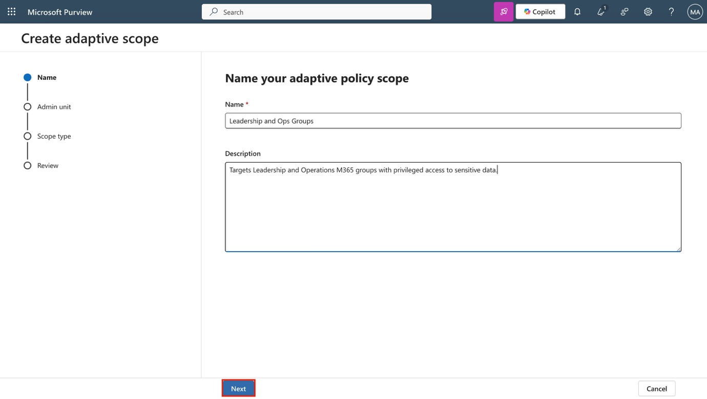

5.  En la página **Assign admin unit**, seleccione **Next**.

> 

6.  En la página **What type of scope do you want to create?**, seleccione **Microsoft 365 Groups**, luego seleccione **Next**.

> 

7.  En la página **Create the query to define users**, en la sección **User attributes**, asegúrese de que estos valores estén configurados para los atributos del usuario:

    - Seleccione el menú desplegable **Attribute**, luego seleccione **Name.**

> 

- Mantenga el valor predeterminado **is equal to** en el siguiente campo.

- Ingrese **Leadership** como **Value.**

8.  Agregue un segundo atributo seleccionando **+ Add attribute** en la página **Create the query to define users**.

> 

9.  En el nuevo campo debajo del que se acaba de configurar, establezca los siguientes valores:

    - Seleccione el menú desplegable del operador de consulta y actualícelo de **And** a **Or**.

> 

- Seleccione el menú desplegable **Attribute**, luego seleccione **Name**.

> 

- Mantenga el valor predeterminado **is equal to** en el siguiente campo.

- Ingrese **Operations** como **Value**.

10. Seleccione **Next**.

> 

11. En la página **Review and finish**, seleccione **Submit**.

> 

12. Una vez creado el ámbito adaptativo, seleccione **Done** en la página **Your scope was created**.

> 

Ha creado un ámbito adaptativo para admitir retención dirigida a grupos con privilegios dentro de la organización.

**Ejercicio 6 – Crear una directiva de retención adaptativa**

En esta tarea, utilizará el ámbito adaptativo que creó previamente para configurar una directiva de retención destinada a **Microsoft 365 groups** con responsabilidades sensibles.

1.  En **Microsoft Purview**, navegue a **Solutions \> Data Lifecycle Management \> Policies \> Retention policies**.

> 

2.  En la página **Retention policies**, seleccione **+ New retention policy**.

> 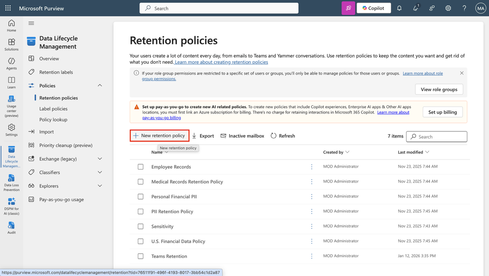

3.  En la página **Name your retention policy**, ingrese:

    - **Name**: Privileged Group Retention

    - **Description**: Retains content from Leadership and Operations groups for 5 years to support audit and investigation.

4.  Seleccione **Next**.

> 

5.  En la página **Policy Scope**, seleccione **Next**.

> 

6.  En la página **Choose the type of retention policy to create**, seleccione **Adaptive**, luego seleccione **Next**.

> 

7.  En la página **Choose adaptive policy scopes and locations**, seleccione **+ Add scopes**.

> 

8.  En el panel **Choose adaptive policy scopes**, seleccione la casilla **Leadership and Ops Groups**, luego seleccione **Add** en la parte inferior.

> 

9.  De vuelta en la página **Choose locations to apply the policy**, habilite:

    - Microsoft 365 Group mailboxes & sites

    - Mantenga todas las demás ubicaciones deshabilitadas.

10. Seleccione **Next**.

> 

11. En la página **Decide if you want to retain content, delete it, or both**, asegúrese de que estos valores estén configurados para la retención:

    - Seleccione **Retain items for a specific period**.

    - En **Retain items for a specific period**, seleccione **5 years** en la lista desplegable.

    - Inicie el período de retención basado en: **When items were last modified.**

    - Al finalizar el período de retención: **Delete items automatically**

12. Seleccione **Next**.

> 

13. En la página **Review and finish**, seleccione **Submit**.

> 

14. Seleccione **Done** una vez que la directiva se haya creado.

> 

Ha creado una directiva de retención que se aplica al contenido propiedad de grupos con privilegios, reteniéndolo durante cinco años antes de eliminarlo.

**Ejercicio 7 – Recuperar contenido de SharePoint**

En esta tarea, se simulará la restauración de un documento eliminado desde un sitio de **SharePoint** para validar las opciones de recuperación.

1.  Mantenga la sesión iniciada en la VM y **manténgase** conectado como **Patti Fernandez** en **Microsoft Purview**.

2.  Seleccione el **App launcher** (el icono de cuadrícula) en la esquina superior izquierda y luego **seleccione** **More apps** en el submenú.

> 

3.  Seleccione **SharePoint**.

> 

4.  En la página principal de **SharePoint**, **busque** **Benefits** y luego **seleccione** **Benefits @ Contoso** en los resultados de búsqueda.

> 

5.  En la barra lateral izquierda, **seleccione** **Documents**.

> 

6.  En la página **Documents**, **seleccione** la casilla correspondiente al archivo **Vacation Policies.pptx** y luego **seleccione** **Delete** en la barra de acciones.

> 

7.  En el cuadro de diálogo **Delete?**, **seleccione** **Delete**.

> 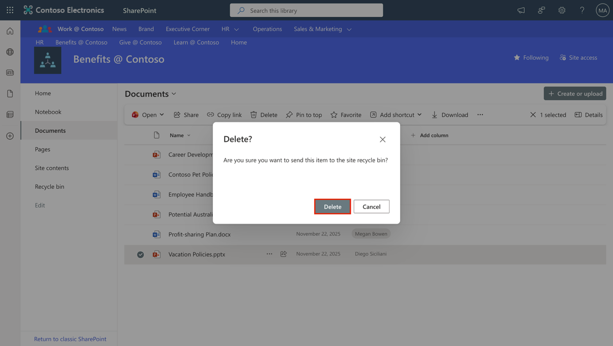

8.  En la barra lateral izquierda, **seleccione** **Recycle bin**.

> 

9.  En la página **Recycle bin**, **haga** clic derecho sobre **Vacation Policies.pptx** y luego **seleccione** **Restore**.

> 

10. En la barra lateral izquierda, seleccione **Documents** y verifique que el archivo ha sido restaurado.

> 

Si desea, también puedo ajustar la redacción de ejercicios anteriores con el mismo estilo.
