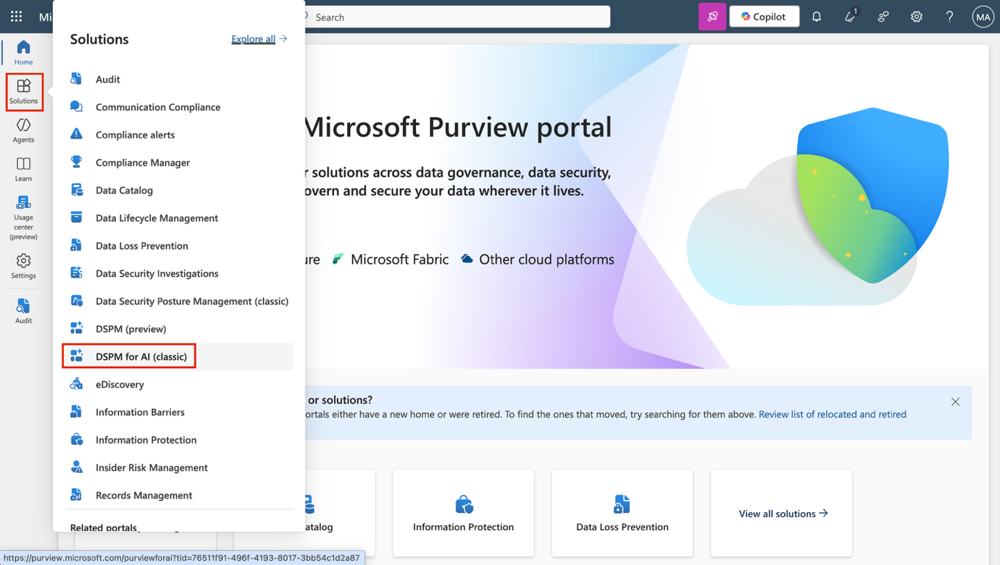
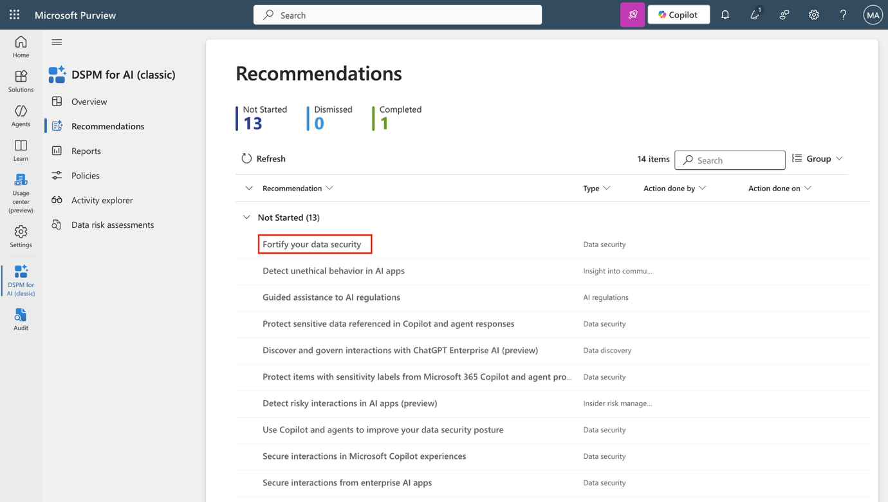
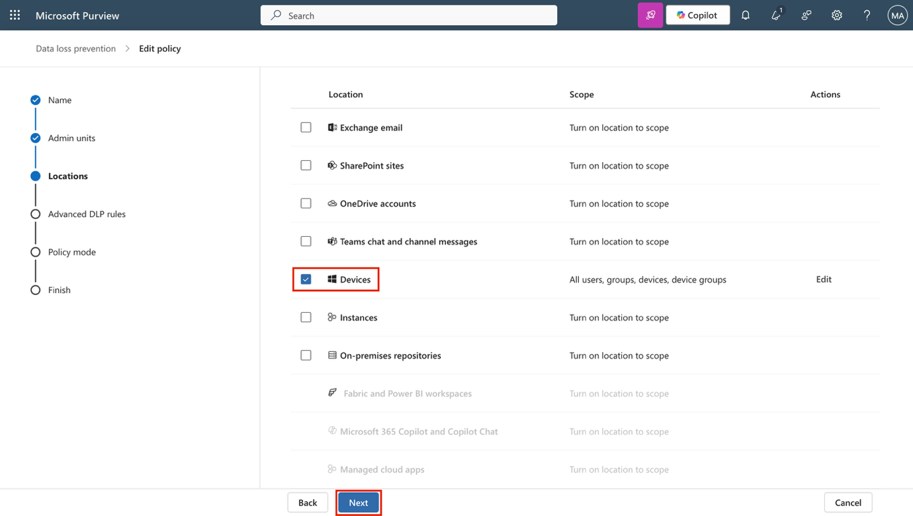
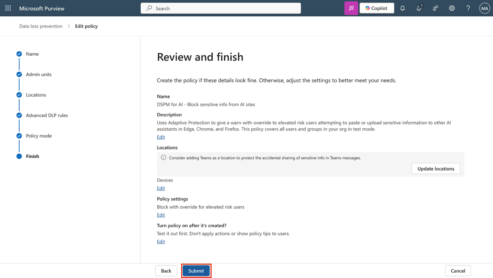

**Laboratorio 14 – Usar DSPM for AI para asegurar sus agentes y aplicaciones de IA**

Usted es Patti Fernandez, administradora de seguridad de la información en Contoso Ltd. A medida que herramientas de IA como Microsoft Copilot se integran cada vez más en los flujos de trabajo diarios, se solicita a su equipo evaluar y mejorar las protecciones en torno a los datos confidenciales. En este laboratorio, explorará cómo Microsoft Purview DSPM for AI puede ayudar a asegurar las interacciones con datos en herramientas de IA mediante la aplicación de directivas, la detección de riesgos y las evaluaciones de exposición.

**Tareas**:

- Usar DSPM for AI para crear una directiva DLP para sitios de IA generativa.

- Crear una directiva de riesgo interno para detectar interacciones de IA riesgosas.

- Detectar comportamiento no ético en aplicaciones de IA.

- Ejecutar una evaluación de datos para detectar contenido sin etiquetar.

**Tarea 1 – Usar DSPM for AI para crear una directiva DLP para sitios de IA generativa**

Para reducir el riesgo de pérdida de datos a través de asistentes de IA, comience creando una directiva DLP usando la recomendación Fortify your data security. Esta directiva usa Adaptive Protection para restringir pegar o cargar datos confidenciales en herramientas de IA como ChatGPT y Copilot en Edge, Chrome y Firefox.

1.  Inicie sesión en la VM como administrador.

2.  En **Microsoft Edge**, navegue a <https://purview.microsoft.com> e inicie sesión como **Patti Fernandez**, Pattif@TenantName.

3.  En Microsoft Purview, navegue a DSPM for AI seleccionando **Solutions \> DSPM for AI \> Recommendations**.

> 

4.  Seleccione la recomendación **Fortify your data security**.

> 

5.  En la página **Data security for AI** que se despliega, revise el resumen y luego seleccione **Create policies**. Esto crea una directiva DLP preconfigurada dirigida a sitios de IA generativa.

> 

6.  Se mostrará la directiva ‘Block elevated risk users from pasting or uploading sensitive info on AI sites’. Dado que las otras dos requieren capacidad pay-as-you-go, no se crearán en este tenant. Una vez creada la directiva, seleccione **Policy details**.

> 

7.  En la sección **Policy details**, seleccione **Edit policy in solution** para abrir la solución **Data Loss Prevention** en Microsoft Purview.

> 

8.  Seleccione **Next** hasta llegar a la página **Choose where to apply the policy**.

> 

9.  Confirme que la directiva está limitada a **Devices**. Seleccione **Next**.

1.  En la página **Customize advanced DLP rules**, seleccione el ícono de lápiz junto a **Block with override for elevated risk users** para ver la regla.

1.  Revise la configuración de la regla creada por DSPM for AI:

    - En **Conditions**, observe los tipos de información confidencial incluidos y que la regla usa **Adaptive Protection** basada en riesgo elevado.

> 

- En **Actions**, para las actividades **Upload** y **Paste**, seleccione **Edit** junto a **Sensitive service domain group restriction(s).**

> 

- En la configuración del grupo de dominios de servicio, confirme que **Generative AI Websites** está configurado en **Block with override**.

> 

- Seleccione **Close** para cerrar el panel.

> 

2.  Seleccione **Cancel** para salir del editor de reglas sin realizar cambios.

1.  De vuelta en la página **Customize advanced DLP rules**, seleccione **Next.**

1.  En la página **Policy mode**, seleccione **Turn the policy on if it's not edited within fifteen days of simulation**, luego seleccione **Next**.

1.  En la página **Review and finish**, seleccione **Submit** y luego **Done**.

Se ha creado una directiva que bloquea a los usuarios de alto riesgo para que no compartan datos confidenciales en sitios de IA generativa y se ha confirmado la configuración establecida por DSPM for AI.\
\
Puede revisar el resto de las directivas seleccionando **Solutions \> DSPM for AI \> Recommendations**. Si cuenta con capacidad pay-as-you-go en su propio tenant o ID de usuario, puede continuar con los siguientes ejercicios.

**Tarea 2 – Crear una directiva de riesgo interno para detectar interacciones de IA riesgosas**

A continuación, cree una directiva que ayude a detectar comportamientos de solicitud riesgosos en Copilot.

1.  En Microsoft Purview, navegue a **DSPM for AI seleccionando Solutions \> DSPM for AI \> Recommendations**.

2.  Seleccione la recomendación **Detect risky interactions in AI apps (preview).**

3.  En la página desplegable **Detect risky interactions in AI apps (preview),** revise el resumen y seleccione **Create policy.**

4.  Una vez creada la directiva, seleccione **View policy**.

5.  En la sección **Policy details**, seleccione **Edit policy in solution** para abrir el área **Insider Risk Management** de Microsoft Purview.

6.  En la página **Policies**, localice y seleccione la directiva **DSPM for AI - Detect risky AI usage**.

7.  En el panel desplegable, seleccione **Edit policy** para revisar la configuración completa de la directiva.

8.  En la página **Choose a policy template**, observe que la directiva usa la plantilla **Risky AI usage (preview)**.

9.  Seleccione **Next** hasta llegar a la página **Choose triggering event for this policy.** Confirme que el evento desencadenante es **User account deleted from Microsoft Entra ID**, lo cual indica posibles riesgos relacionados con procesos de offboarding que podrían preceder o seguir a actividades riesgosas con IA.

10. Seleccione **Next**.

11. En la página **Indicators**, expanda las categorías de indicadores para revisar las señales seleccionadas:

    - Browsed to generative AI websites

    - Received sensitive response from Copilot

    - Entered risky prompt in Copilot

12. Seleccione **Next** hasta llegar a la página **Review and finish** y luego seleccione **Cancel** para salir del editor sin realizar cambios.

Se ha creado una directiva que detecta interacciones riesgosas con IA, incluidas solicitudes y respuestas, para ayudar a identificar señales tempranas de comportamiento riesgoso por parte de los usuarios.

**Tarea 3 – Detectar comportamiento no ético en aplicaciones de IA**

En esta tarea, se creará una directiva en DSPM for AI para detectar comportamiento no ético o inapropiado en Microsoft 365 Copilot y otras aplicaciones de IA.

1.  En Microsoft Purview, vaya a **DSPM for AI** seleccionando **Solutions \> DSPM for AI \> Recommendations**.

2.  Seleccione la recomendación **Detect unethical behavior in AI apps**.

3.  En el panel desplegable, revise la descripción general de lo que configurará esta directiva:

    - El nombre predeterminado de la directiva es **DSPM for AI – Unethical behavior in AI apps**.

    - La directiva detecta información sensible o inapropiada dentro de las solicitudes y respuestas en Microsoft 365 Copilot y otros agentes de IA.

    - Se aplica a todos los usuarios y grupos de la organización.

4.  Seleccione **Create policy** para crear la directiva de **Communication Compliance**.

5.  En la página **Policy successfully created**, seleccione **X** para cerrar el panel.

6.  The **Recommendations** page will refresh, and the **Detect unethical behavior in AI apps** recommendation will move to **Completed**.

7.  En la navegación izquierda, seleccione **Policies**.

8.  Seleccione la directiva recién creada **DSPM for AI – Unethical behavior in AI apps** para revisar su configuración y estado.

9.  En la página **DSPM for AI – Unethical behavior in AI apps**, seleccione **X** para cerrar el panel.

Se ha creado una directiva que detecta actividad no ética en aplicaciones de IA para ayudar a Contoso a mantener un uso responsable de Copilot.

**Tarea 4 – Crear una evaluación de riesgo de datos para detectar contenido sin etiquetar**

Para comprender posibles brechas en la cobertura de etiquetado, ejecute una evaluación de riesgo de datos para identificar archivos sin etiquetas de sensibilidad que puedan ser accedidos por Copilot.

1.  En **DSPM for AI**, seleccione la recomendación titulada **Protect sensitive data referenced in Copilot and agent responses**.

2.  En el panel **Protect sensitive data referenced in Copilot and agent responses**, revise el resumen y luego seleccione **Go to assessments**.

3.  En la página **Data risk assessments**, seleccione **Create custom assessment.**

4.  En la página **Basic details**, ingrese:

    - **Name**: Unlabeled File Exposure Assessment

    - **Description**: Identifies files without sensitivity labels that may be exposed in Microsoft 365 Copilot responses and provides recommendations to reduce oversharing risks.

5.  Seleccione **Next**.

6.  En la página **Add users**, seleccione **All** y luego seleccione **Next**.

7.  En la página **Add data sources to assess**, deje seleccionada la ubicación predeterminada **SharePoint** y luego seleccione **Next.**

8.  En la página **Review and run the data assessment scan**, seleccione **Save and run**.

9.  En la página **Data assessment successfully created**, seleccione **Done**.

Ahora se ha utilizado Microsoft Purview DSPM for AI para detectar riesgos relacionados con IA, aplicar directivas y evaluar la exposición de datos confidenciales, ayudando a la organización a usar IA de manera segura.
