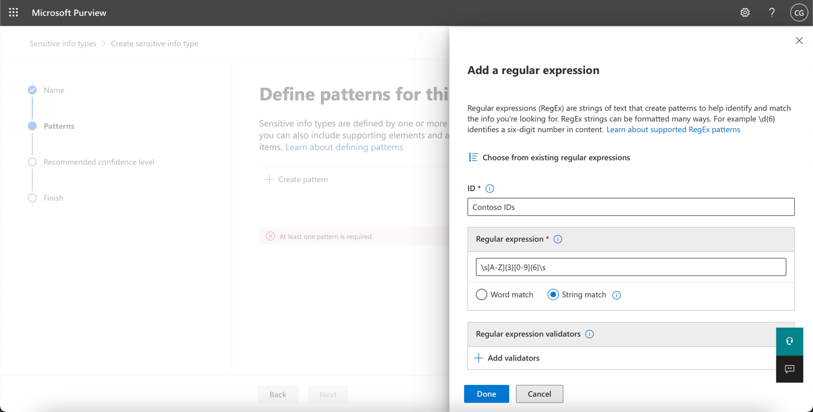
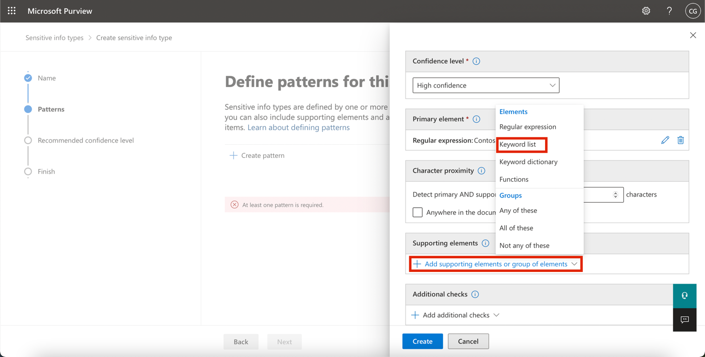
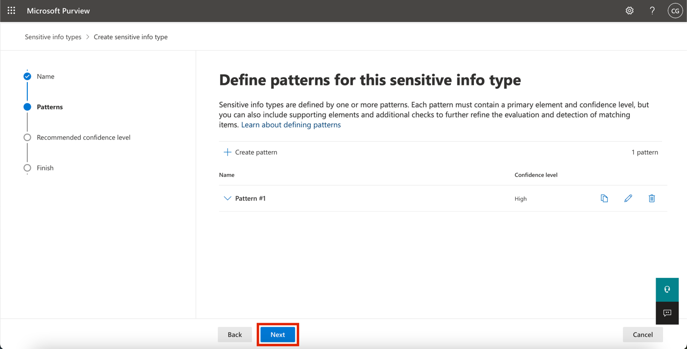
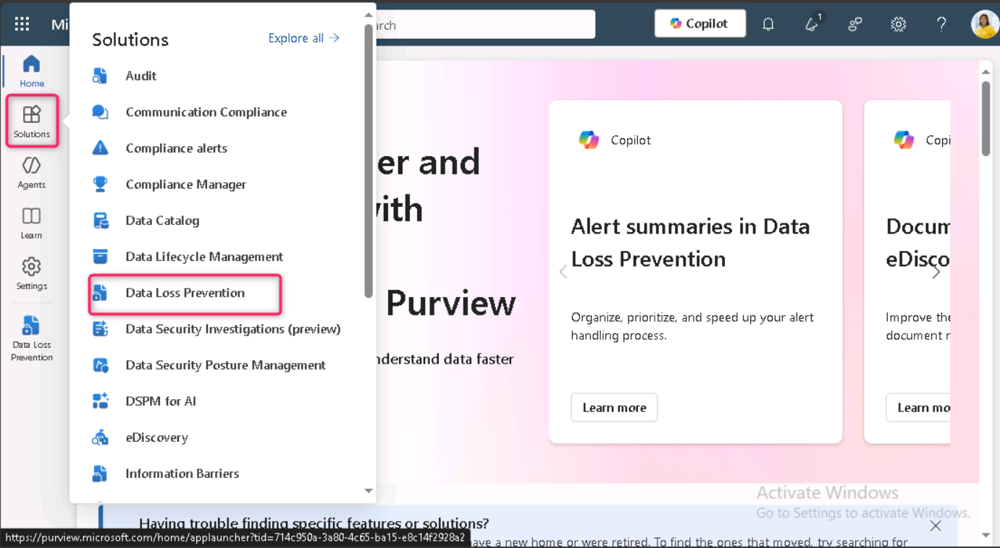
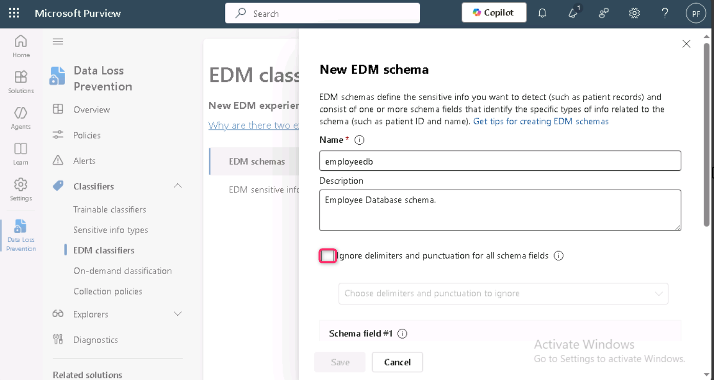
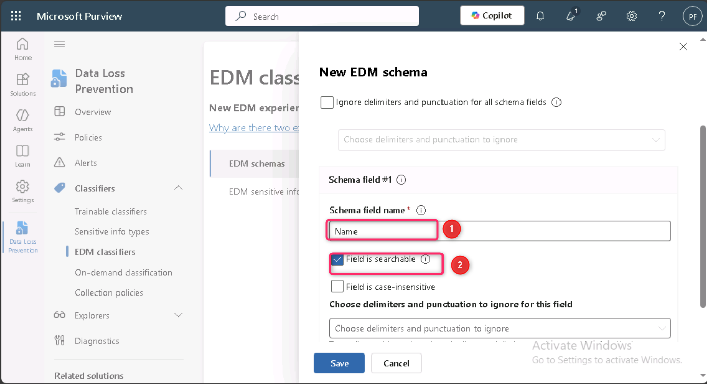
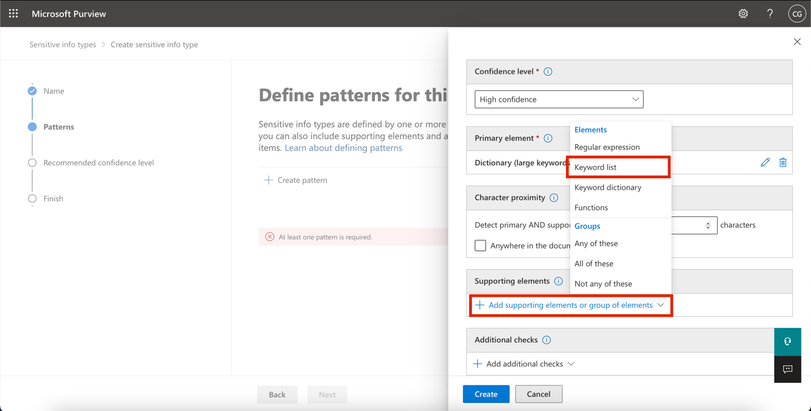
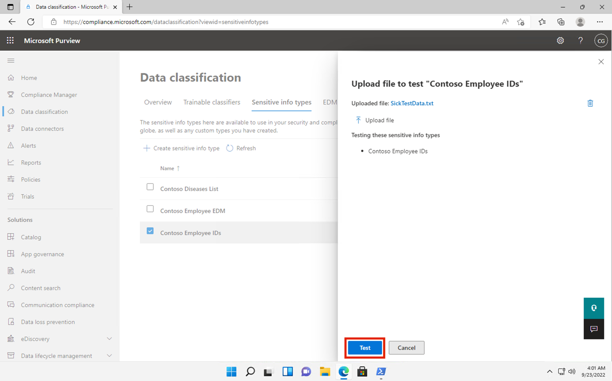

**Laboratorio 2 – Administrar tipos de información sensible​**

**I** **Introducción**

Contoso Ltd. había tenido previamente problemas con empleados que enviaban accidentalmente información personal de clientes al trabajar en tickets de soporte dentro de la solución de tickets.

Para educar a los usuarios en el futuro, se requiere un **tipo de información sensible personalizado** para identificar los ID de empleados en correos electrónicos y documentos, que consisten en tres caracteres en mayúsculas y seis números, utilizando **Sensitive info types**. Para reducir la tasa de falsos positivos, se usarán las palabras clave "Employee" y "IDs".

**Objetivos**

- Crear un tipo de información sensible personalizado utilizando expresiones regulares y listas de palabras clave.

- Configurar y definir un **EDM-based sensitive info type** usando datos estructurados de empleados.

- Aplicar **hash** y cargar los datos de empleados en el **EDM Upload Agent** para su clasificación.

- Construir un tipo de información sensible basado en diccionario de palabras clave para identificar términos confidenciales relacionados con salud.

- Probar y validar los tipos de información sensible personalizados para garantizar su precisión antes de aplicarlos en políticas.

**Ejercicio 1 – Crear tipos de información sensible personalizados**

En este ejercicio, utilizará el módulo de **Security & Compliance Center PowerShell** para crear un nuevo **tipo de información sensible personalizado** que reconozca el patrón de los ID de empleados cerca de las palabras clave "Employee" y "ID".

1.  Abra una ventana **InPrivate** en su navegador Edge, ingrese la siguiente URL en la barra de direcciones para abrir el portal de Microsoft Purview: <https://purview.microsoft.com>, luego inicie sesión como **Patti Fernandez** usando el usuario **PattiF@TenantName** y la contraseña proporcionada en la pestaña de recursos.

> 
>
> 

2.  Si aparece el cuadro de diálogo **Welcome to the new Microsoft Purview portal**!, haga clic en **Get Started**.

> 

3.  En la navegación izquierda, seleccione **Solutions \> Data Loss Prevention**.

> 
>
> **Nota:** Si no ve **Data Loss Prevention** en la lista de **Solutions**, espere unos minutos y recargue la página. Si aún no aparece, inicie sesión usando la ventana de navegación normal **(Regular (Normal) browsing window).**

4.  Seleccione **Classifiers** en el panel izquierdo. Luego seleccione **Sensitive info types** en el subpanel de navegación. Seleccione **+Create sensitive info type** para abrir el asistente de creación de un nuevo tipo de información sensible.

> 

5.  En la página **Name your sensitive info type**, ingrese la siguiente información:

    - **Name**: Contoso Employee IDs

    - **Description**: Pattern for Contoso employee IDs

6.  Seleccione **Next**.

> 

7.  En la página **Define patterns for this sensitive info type**, seleccione **Create pattern**.

8.  En el panel **New pattern** que aparece a la derecha, seleccione **Add primary element** y luego **Regular expression**.

9.  En el nuevo panel derecho **Add a regular expression**, ingrese lo siguiente:

    - **ID**: Contoso IDs

    - **Regular expression**: \s\\A-Z\\{3}\\0-9\\{6}\s

    - Seleccione **String match**

10. Seleccione **Done**.

11. En el panel **New pattern**, disminuya el valor de **Character proximity** a 100 caracteres.

> 
>
> 

12. Navegue hasta **Supporting elements**, haga clic en **+ Add supporting elements or group of elements** y seleccione **Keyword list**.

> 

13. En el panel **Add a keyword list**, ingrese lo siguiente:

    - **ID**: Employee ID keywords

    - **Case insensitive**:Employee ID

> 

14. Desplácese hacia abajo y seleccione el botón de opción junto a **Word match**, luego haga clic en **Done**. 

> 

15. Ahora, haga clic en **Create**.

> 

16. En la página **Define patterns for this sensitive info type**, seleccione **Next**.

> 

17. En la página **Choose the recommended confidence level to show in compliance policies**, use el valor predeterminado y seleccione **Next**.

> 

18. En la página **Review settings and finish**, revise la configuración y seleccione **Create**. Cuando se haya creado correctamente, seleccione **Done**.

> 
>
> 

19. Deje la ventana del navegador abierta.

Ha creado exitosamente un nuevo tipo de información sensible para identificar los ID de empleados con un patrón de tres caracteres en mayúsculas, seis números y las palabras clave 'Employee' o 'IDs' dentro de un rango de 100 caracteres.

**Ejercicio 2 – Crear un tipo de información sensible basado en EDM**

Como patrón de búsqueda adicional, creará una clasificación basada en **EDM** con un esquema de base de datos de datos de empleados. El archivo fuente de la base de datos estará formateado con los siguientes campos de datos de los empleados: **Name**, **Birthdate**, **StreetAddress** y **EmployeeID**.

1.  Haga clic en **Solutions**, luego seleccione **Data Loss Prevention.**

> 

2.  Haga clic en **Classifiers**, luego seleccione **EDM classifiers**. En la página **EDM classifiers**, haga clic en el interruptor junto a **New EDM experience** para desactivarlo (**Off**).

> 

3.  Luego, haga clic en **Create EDM schema**.

> 

4.  En el campo **Name**, ingrese **employeedb**.

5.  En el campo **Description**, ingrese *Employee Database schema*. Desmarque **Ignore delimiters and punctuation for all schema fields**.

> 
>
> 

6.  En el primer campo **Schema field name**, ingrese **Name** y marque la casilla **Field is searchable**.

> 

7.  Haga clic en el desplegable **Choose delimiters and punctuation to ignore** y seleccione **Hyphen, Period, Space, Open parenthesis** y **Close parenthesis**.

> 

8.  Seleccione **+ Add schema data field** desde la parte inferior.

> 

9.  En **Schema field name**, debajo de **Schema field \#2**, ingrese **Birthdate**.

10. Seleccione **+ Add schema data field** nuevamente desde la parte inferior.

11. En **Schema field name**, debajo de **Schema field \#3**, ingrese **StreetAddress**.

12. Seleccione **+ Add schema data field** por última vez desde la parte inferior.

13. En **Schema field name**, debajo de **Schema field \#4**, ingrese EmployeeID.

14. Seleccione **Field is searchable**.

15. Seleccione **Save**.

> 

16. En el panel izquierdo, seleccione **EDM sensitive info types** y haga clic en **+ Create EDM sensitive info type** para abrir el asistente de paquete de reglas EDM.

> 

17. En la página **Define data store schema**, seleccione **Choose an existing EDM schema**.

> 

18. Seleccione **employeedb** y haga clic en **Add**.

> 

19. Revise el esquema de la base de datos y seleccione **Next**.

> 

20. En la página **Define patterns for this EDM sensitive info type**, seleccione **+ Create pattern**.

> 

21. En el panel **New pattern** del lado derecho, en el campo **Primary element**, seleccione **EmployeeID**.

22. Debajo del tipo de información sensible del **Primary element**, seleccione **Choose sensitive info type**.

> 

23. En la barra de búsqueda, ingrese **Contoso** y presione la tecla **Enter**.

24. Seleccione **Contoso Employee IDs** y haga clic en **Done.**

25. Seleccione **Done** nuevamente.

> 

26. En la pantalla **Define patterns for this EDM sensitive info type**, haga clic en **Next**.

> 

27. En **Choose the recommended confidence level and character proximity**, mantenga los valores predeterminados y seleccione **Next**.

> 

28. En la página **Name and describe your EDM sensitive info type**, ingrese **Contoso Employee EDM** en el campo de nombre.

29. En el campo **Description for admins**, ingrese *EDM-based sensitive information type for employee personal information*. Seleccione **Next.**

> 

30. Revise la configuración y seleccione **Submit**.

> 

31. En la página **Your EDM sensitive info type was created**, seleccione **Done**.

> 

32. Mantenga el navegador abierto con el portal de **Microsoft Purview**.

Ha creado exitosamente un nuevo **tipo de información sensible basado en EDM** para identificar datos de empleados a partir de un archivo fuente de base de datos.

**Ejercicio 3 – Crear un origen de datos de clasificación basado en EDM**

Para asociar la clasificación basada en **EDM** con una base de datos que contiene datos sensibles, es necesario **aplicar hash y cargar los datos reales** para el tipo de información sensible mediante la herramienta **EDM Upload Agent**.

1.  En el navegador **Microsoft Edge**, navegue a <https://go.microsoft.com/fwlink/?linkid=2088639> para descargar el **EDM download agent**.

2.  Haga clic en el enlace **Open file** para acceder a **EdmUploadAgent.msi**.

> 

3.  En el cuadro de diálogo **Welcome to the Microsoft Exact Data Match Upload Agent Setup Wizard**, haga clic en **Next**.

> 

4.  En el asistente de instalación **Microsoft Exact Data Match Upload Agent Setup**, haga lo siguiente:

    - Seleccione **I accept the terms in the License Agreement** y haga clic en **Next**.

    - No cambie la ruta predeterminada en **Destination Folder** y haga clic en **Next**.

    - Seleccione **Install** para realizar la instalación.

    - Cuando se abra la ventana de **User Account Control**, seleccione **Yes**.

    - Si se le solicita iniciar sesión, inicie sesión con la cuenta de **Patti**.

    - Cuando la instalación finalice, seleccione **Finish**.

5.  Ahora, haga clic derecho en el ícono de **Windows**, navegue y seleccione **Run**. En el cuadro de diálogo **Run**, escriba **notepad** y haga clic en **OK**.

> 
>
> 

6.  Ingrese el siguiente texto en **Notepad**:

> Name,Birthdate,StreetAddress,EmployeeID
>
> Patti Fernandez,01.06.1980,1Main Street,CSO123456
>
> Christie Cline,31.01.1985,2Secondary Street,CSO654321
>
> 

7.  Seleccione **File \> Save As** y guarde como **EmployeeData.csv**.

8.  En el desplegable **Save as type**, seleccione **All Files (.)**.

9.  En el campo **Encoding**, asegúrese de que esté seleccionado **UTF-8**, luego haga clic en **Save**.

> 

10. Cierre la ventana de **Notepad**.

11. Haga clic derecho en el ícono de **Windows** en la barra de tareas y seleccione **Windows PowerShell (Admin)** para ejecutarlo como administrador.

> 

12. En el cuadro de diálogo **User Account Control**, haga clic en **Yes**.

> 

13. Navegue al directorio del **EDM Upload Agent**:

> cd "C:\Program Files\Microsoft\EdmUploadAgent"
>
> 

14. Autorice su cuenta para cargar la base de datos en su tenant ejecutando el siguiente cmdlet:

> .\EdmUploadAgent.exe /Authorize
>
> 

15. Cuando aparezca la ventana **Pick an account**, inicie sesión como **Patti Fernandez** usando el usuario **PattiF@TenantName** y la contraseña proporcionada en la pestaña de recursos (o la nueva contraseña que haya restablecido).

> 
>
> 

16. Descargue la definición del esquema de la base de datos del tipo de información sensible de clasificación basada en EDM ejecutando el siguiente script en PowerShell:

> .\EdmUploadAgent.exe /SaveSchema /DataStoreName employeedb /OutputDir "C:\Users\Admin\Documents\\
>
> **Nota:** Si el último comando falla, puede ser porque aún no se ha aplicado la membresía del grupo **EDM_DataUploaders**. Puede tardar hasta una hora en poder descargar el archivo del esquema. Si falla, continúe con la siguiente tarea y regrese a este paso más tarde, o verifique la ruta de la carpeta Documents en su VM**.**
>
> 

17. Aplique hash al archivo de base de datos y cárguelo en el tipo de información sensible basado en EDM ejecutando el siguiente script en PowerShell:

.\EdmUploadAgent.exe /UploadData /DataStoreName employeedb /DataFile C:\Users\Admin\Documents\EmployeeData.csv /HashLocation "C:\Users\Admin\Documents\\ /Schema "C:\Users\Admin\Documents\employeedb.xml"

\

\*\*Note:\*\* If you get the following errors

Error Type: System.IO.FileNotFoundException

Error Message: Unable to find the specified file.

\*\*Check the path where you saved the file EmployeeData.csv\*\*

\

19. Verifique el progreso de la carga hasta que el estado cambie a **completed**, luego ejecutar el siguiente comando de PowerShell:

> .\EdmUploadAgent.exe /GetSession /DataStoreName employeedb
>
> 

Ha completado correctamente el proceso de hash y carga de un archivo de base de datos para un tipo de información confidencial basado en **EDM-based classification**.

**Ejercicio 4 – Crear un diccionario de palabras clave**

Se registraron varias violaciones de filtración de información personal cuando los usuarios enviaban correos electrónicos después de que colegas informaban bajas por enfermedad. En esos casos, se enviaba la razón de la enfermedad o dolencia. No deseamos que esto ocurra.

1.  En **Microsoft Edge**, abra una **New InPrivate Window**, navegue a <https://purview.microsoft.com> e inicie sesión como **Patti Fernandez** usando el usuario **PattiF@TenantName** y la contraseña proporcionada en la pestaña de recursos.

2.  En la navegación izquierda, seleccione **Solutions \> Data Loss Prevention**.

> 

3.  Seleccione **Classifiers** en el panel izquierdo. Luego seleccione **Sensitive info types** en el subpanel de navegación. Seleccione **+Create sensitive info type** para abrir el asistente de creación de un nuevo tipo de información sensible.

> 

4.  En la página **Name your sensitive info type**, ingrese lo siguiente:

    - Name: Contoso Diseases List

    - Description: List of possible diseases of employees.

> 

5.  Seleccione **Next**.

6.  En la página **Define patterns for this sensitive info type**, seleccione **+ Create pattern**.

> 

7.  En el campo desplegable debajo de **Primary element**, seleccione **Keyword dictionary**.

> 

8.  En la página **Add a keyword dictionary**, ingrese el nombre Diseases Dictionary\*.

9.  En el área **Keywords**, ingrese las siguientes palabras clave, cada una en una línea separada:

> flu
>
> influenza
>
> cold
>
> bronchitis
>
> otitis
>
> 

10. Seleccione **Done.**

11. Debajo de **Supporting elements**, seleccione **+ Add supporting elements or group of elements** y luego **keyword list** para agregar soporte adicional al diccionario de palabras clave.

> 

12. En la página **Add a keyword list**, ingrese **Employee** en el campo **ID**. En la casilla **Case insensitive**, ingrese las siguientes palabras clave, cada una en una línea separada, luego haga clic en **Done**:

> Employee ID
>
> leave
>
> reason
>
> 

13. En la página **New pattern**, revise la configuración y seleccione **Create**.

> 

14. En la página **Define patterns for this sensitive info type**, seleccione **Next**.

> 

15. En la página **Choose the recommended confidence level to show in compliance policies**, mantenga el valor predeterminado y seleccione **Next**.

> 

16. En la página **Review settings and finish**, revise su configuración y seleccione **Create**. Cuando finalice el proceso, seleccione **Done**.

> 

17. Mantenga la ventana del navegador abierta en el portal de **Microsoft Purview**.

Ha creado exitosamente un nuevo **tipo de información sensible** basado en un diccionario de palabras clave y agregado palabras clave adicionales para disminuir la tasa de falsos positivos. Proceda con la siguiente tarea.

**Ejercicio 5 – Trabajar con tipos de información sensible personalizados**

Los tipos de información sensible personalizados deben probarse siempre antes de aplicarlos en políticas; de lo contrario, podría ocurrir pérdida o filtración de datos debido a un patrón de búsqueda personalizado defectuoso.

1.  Haga clic derecho en el ícono de **Windows**, navegue y seleccione **Run**. En el cuadro de diálogo **Run**, escriba **notepad** y haga clic en **OK**.

> 
>
> 

2.  Ingrese el siguiente texto en **Notepad**:

> Employee Patti Fernandez with Employee ID ABC123456 is on leave because of the flu/influenza

3.  Seleccione **File \> Save As**, guarde como **SickTestData** y haga clic en **Save**.

4.  Cierre la ventana de Notepad.

5.  En **Microsoft Edge**, la pestaña del portal de Microsoft Purview debería estar abierta. Si es así, selecciónela y continúe; si la cerró, abra una nueva pestaña, navegue a <https://purview.microsoft.com> e inicie sesión como **Patti Fernandez** usando el usuario **PattiF@TenantName** y la contraseña proporcionada en la pestaña de recursos.

6.  En la navegación izquierda, seleccione **Solutions \> Data Loss Prevention**, luego seleccione **Sensitive info types** bajo **Classifiers**. En el cuadro de búsqueda en la esquina superior derecha, ingrese Contoso y presione Enter. Haga clic en **Contoso Employee IDs** para abrir el panel derecho.

7.  Seleccione **Test** en el panel derecho.

> 

8.  En la página **Upload file to test**, seleccione **Upload file**.

> 

9.  Seleccione **Documents** en el panel izquierdo, seleccione el archivo **SickTestData** y haga clic en **Open**.

> 

10. Seleccione **Test** para iniciar el análisis.

> 

11. En la página **Match results**, revise las coincidencias encontradas.

> 

12. Seleccione **Finish** y cierre la página de prueba haciendo clic en **X**.

> 

13. En la página **Data classification**, seleccione el tipo de información sensible **Contoso Diseases List**.

14. En el panel derecho, seleccione **Test**.

> 

15. En la página **Upload file to test**, seleccione **Upload file**.

> 

16. Seleccione **Documents** en el panel izquierdo, seleccione el archivo **SickTestData** y haga clic en **Open**.

17. Seleccione **Test** para iniciar el análisis.

> 

18. En la página **Match results**, revise las coincidencias encontradas. Cuando termine, seleccione **Finish**.

> 

**Resumen:**

En este laboratorio, ha aprendido a crear y probar **tipos de información sensible personalizados (SITs)** en **Microsoft Purview** utilizando **expresiones regulares**, **diccionarios de palabras clave** y técnicas de **Exact Data Match (EDM)** para mejorar las capacidades de **Data Loss Prevention (DLP)**.
