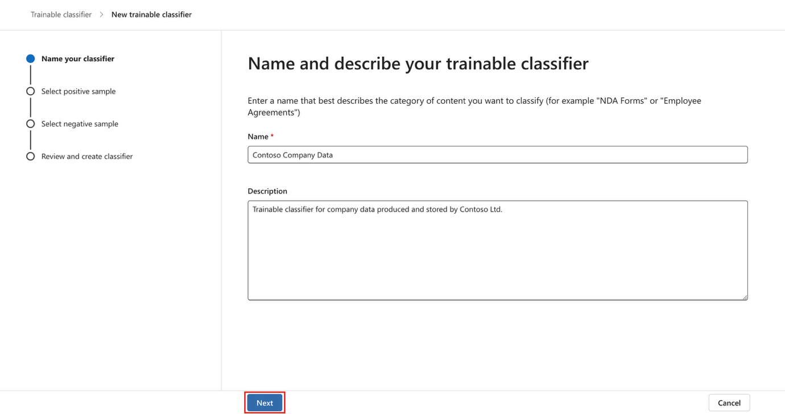
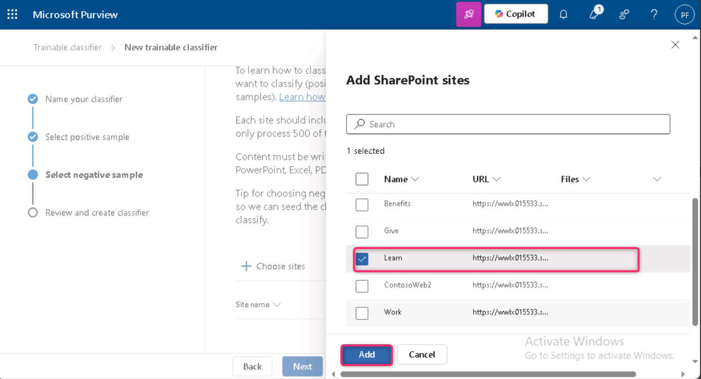
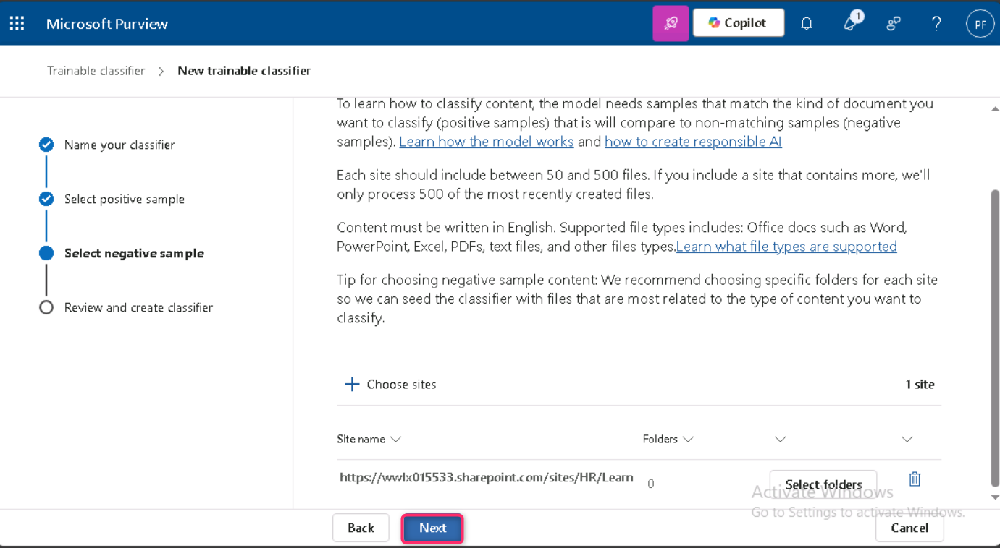

**Laboratorio 3 – Administrar clasificadores entrenables**

**Introducción**

El tenant de **Contoso Ltd.** contiene una colección de sitios de **SharePoint** llamada **"Sales and Marketing"**, que se utilizará en el futuro para almacenar varios documentos e informes relacionados con finanzas. Debido a la naturaleza de estos documentos, es necesario crear un **trainable classifier** para reconocer y etiquetar estos archivos. Para este propósito, en este laboratorio activará clasificadores entrenables personalizados y creará uno nuevo.

**Objetivos**

- Crear un **trainable classifier** para identificar y categorizar datos típicos almacenados en los sitios de **SharePoint** seleccionados.

**Ejercicio 1 – Crear un clasificador entrenable**

En esta tarea, **Patti** creará un nuevo **trainable classifier** y seleccionará diferentes sitios de **SharePoint** para identificar los datos típicos creados y almacenados por **Contoso Ltd**.

1.  En **Microsoft Edge**, abra una **New InPrivate Window**, navegue a [**https://purview.microsoft.com**](https://purview.microsoft.com) e inicie sesión como **Patti Fernandez** usando el usuario **<PattiF@WWLxXXXXXX.onmicrosoft.com>** y la contraseña proporcionada en la pestaña de recursos.

2.  En la navegación izquierda, seleccione **Solutions \> Data Loss Prevention**.

> 

3.  Expanda **Classifiers** en el panel izquierdo. Seleccione **Trainable Classifiers** en el subpanel de navegación. Seleccione **+ Create trainable classifier** para crear un nuevo clasificador.

> 

4.  Ingrese la siguiente información:

5.  Name: **+++Contoso Company Data+++**

6.  Description: **+++Trainable classifier for company data produced and stored by Contoso Ltd.+++**

7.  Seleccione **Next**.

> 

8.  Seleccione **Choose sites** para abrir el panel derecho.

> 

9.  Seleccione los siguientes sitios de **SharePoint** y haga clic en **Add**:

    - Brand

    - Digital Initiative Public Relations

    - Work

    - Sales and Marketing

    - Mark 8 Project Team

> 

10. Espere hasta que los sitios seleccionados se muestren en la lista y seleccione **Next**.

> 

11. En la página **Source of the negative sample content**, haga clic en **+ Choose sites**.

> 

12. En el panel **Add SharePoint sites**, seleccione la casilla junto a **Learn**, luego haga clic en **Add**.

> 

13. Haga clic en **Next**.

> 

14. Revise la configuración y seleccione **Create trainable classifier**.

> 

15. n la página **Your trainable classifier is being trained**, haga clic en **Done**.

> 

Los documentos y archivos en los sitios de **SharePoint** seleccionados ahora están siendo analizados, lo que puede tardar hasta 24 horas.

**Resumen:**

En este laboratorio, ha creado un **trainable classifier** en **Microsoft Purview** llamado **Contoso Company Data**, seleccionando sitios relevantes de **SharePoint** como fuentes de contenido positivo y negativo. Este clasificador analizará los documentos para identificar datos específicos de la empresa, con un tiempo de entrenamiento de hasta 24 horas.
