**Laboratorio 4 – Crear y administrar etiquetas de sensibilidad**

**Introducción**

**Patti Fernandez**, Administradora de Seguridad de la Información en **Contoso Ltd.**, está implementando un marco moderno de **sensitivity labeling** para fortalecer la protección de datos en toda la organización. **Patti** creará y publicará grupos de etiquetas y etiquetas de sensibilidad para clasificar y proteger contenido, incluyendo **encryption**, **auto-labeling** y **Double Key Encryption (DKE)**. Además, integrará **Microsoft Purview** con **Microsoft Defender for Cloud Apps** para ampliar los controles de protección de datos a archivos almacenados en ubicaciones en la nube.

**Objetivos:**

- Habilitar soporte para **sensitivity labels**.

- Crear un **label group**.

- Crear una **child label.**

- Publicar etiquetas.

- Configurar **auto-labeling**.

- Crear y publicar una **etiqueta DKE** para contenido confidencial.

- Habilitar integración de **Microsoft Purview** en **Defender for Cloud Apps**.

- Crear una política de archivos para etiquetar archivos compartidos externamente.

**Ejercicio 1 – Habilitar soporte para etiquetas de sensibilidad**

En esta tarea, habilitará **co-authoring** para **sensitivity labels**, lo que también habilita las etiquetas de sensibilidad para archivos en **SharePoint** y **OneDrive**.

1.  Debe continuar conectado en la VM con la cuenta de administrador.

2.  Abra Microsoft Edge, navegue a <https://purview.microsoft.com> e inicie sesión en **Microsoft Purview** como **Patti Fernandez**.

3.  En la navegación izquierda, seleccione **Settings \> Information Protection**.

> 

4.  En la página **Information Protection settings**, asegúrese de estar en la pestaña **Co-authoring for files with sensitivity labels**.

5.  Marque la casilla **Turn on co-authoring for files with sensitivity labels**.

> 

6.  Seleccione **Apply** en la parte inferior de la pantalla.

> 

Ha habilitado correctamente el soporte para **sensitivity labels** en archivos de **SharePoint** y **OneDrive**.

**Ejercicio 2 - Trabajar con etiquetas de confidencialidad**

**Tarea 1 – Crear un grupo de etiquetas**

En esta tarea, creará un grupo de etiquetas para organizar las etiquetas de confidencialidad internas. Los grupos de etiquetas funcionan como contenedores para etiquetas relacionadas, como clasificaciones por departamento o unidad de negocio.

1.  En **Microsoft Edge**, navegue a https://purview.microsoft.com.

2.  En el portal **Microsoft Purview**, seleccione **Solutions** en la barra lateral izquierda y luego seleccione **Information Protection**.

> 

3.  En la página **Microsoft Information Protection**, en la barra lateral izquierda, seleccione **Sensitivity labels**.

> 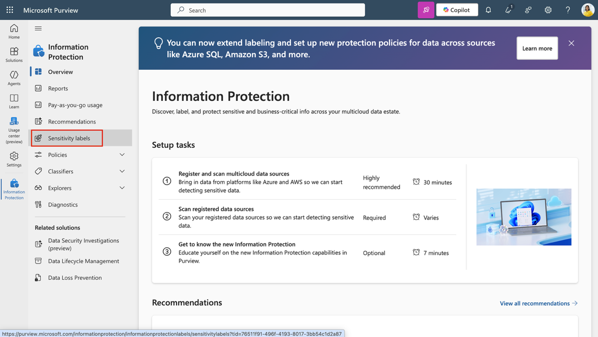

4.  En la página **Sensitivity labels**, seleccione **+ Create \> Label group**.

> 

5.  Se iniciará la configuración del nuevo grupo de etiquetas. En **Provide basic details for this label group**, ingrese:

    - **Name**: Internal

    - **Display name**: Internal

    - **Description for users**: Internal sensitivity label.

    - **Description for admins**: Internal sensitivity label group for Contoso.

6.  Seleccione **Next**.

> 

7.  En la página **Review your settings and finish**, seleccione **Create label group**.

> 

8.  En la página **Your label group was created successfully**, seleccione **Don't create a label yet**, luego seleccione **Done**.

> 

Se ha creado un grupo de etiquetas para uso interno. Este grupo permite administrar etiquetas relacionadas para departamentos o categorías específicas de datos.

**Tarea 2 – Crear una etiqueta secundaria**

Ahora que se creó un grupo de etiquetas, creará una etiqueta secundaria para contenido relacionado con Recursos Humanos (HR). Esta etiqueta aplica cifrado y marcas de contenido para proteger los datos de HR contra el acceso no autorizado.

1.  En la página **Sensitivity labels**, ubique el grupo de etiquetas **Internal**. Seleccione el **vertical ellipsis (…)** junto a él y luego seleccione **+ Create label in group** en el menú desplegable.

> 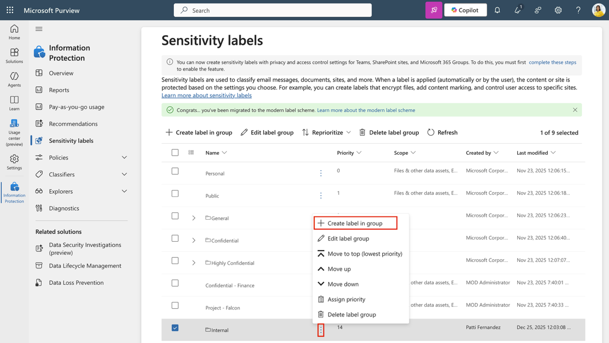

2.  Se iniciará el asistente **New sensitivity label**. En la página **Provide basic details for this label**, ingrese:

    - **Name**: Employee data (HR)

    - **Display name**: Employee data (HR)

    - **Description for users**: This HR label is the default label for all specified documents in the HR Department.

    - **Description for admins**: This label is created in consultation with Ms. Jones (Head of the HR department). Contact her if you need to change the label settings.

3.  Seleccione **Next**.

> 

4.  En la página **Define the scope for this label**, seleccione **Files and Emails**. Si la casilla **Meetings** está seleccionada, asegúrese de desactivarla.

5.  Seleccione **Next**.

> 

6.  En la página **Choose protection settings for labeled items**, seleccione las opciones **Control access** y **Apply content marking**, luego seleccione **Next**.

> 

7.  En la página **Access control**, seleccione **Configure access control settings**.

8.  Configure los valores de cifrado con las siguientes opciones:

    - **Assign permissions now or let users decide?**: Assign permissions now

    - **User access to content expires**: Never

    - **Allow offline access**: Only for a number of days

    - **Users have offline access to the content for this many days**: 15

    - Seleccione el vínculo **Assign permissions**. En el panel lateral **Assign permissions**, seleccione **+ Add any authenticated users**, luego seleccione **Save** para aplicar esta configuración.

9.  En la página **Access control**, seleccione **Next**.

> 

10. En la página **Content marking**, active el control para **enable Content marking**.

> 

11. Para cada uno de los siguientes tipos de marcado, seleccione la casilla correspondiente y luego seleccione el icono de edición para ingresar el texto:

| **Marking type** | **Text**             |
|------------------|----------------------|
| Add a watermark  | INTERNAL USE ONLY    |
| Add a header     | Internal Document    |
| Add a footer     | Contoso Confidential |

12. Seleccione **Next**.

> 

13. En la página **Auto-labeling for files and emails**, seleccione **Next**.

> 

14. En la página **Define protection settings for groups and sites**, seleccione **Next**.

> 

15. En la página **Review your settings and finish**, seleccione **Create label**.

> 

16. En la página **Your sensitivity label was created**, seleccione **Don't create a policy yet**, luego seleccione **Done**.

> 

Se creó una etiqueta secundaria dentro del grupo de etiquetas **Internal**. La etiqueta aplica cifrado y marcas de contenido a los documentos de HR, lo que permite identificar fácilmente los datos sensibles y garantizar que estén protegidos mediante una directiva.

**Tarea 3 – Publicar etiquetas**

A continuación, publicará la etiqueta de HR del grupo de etiquetas Internal para que los usuarios del departamento de HR puedan aplicarla a sus documentos.

1.  En **Microsoft Edge**, la pestaña del portal **Microsoft Purview** debería seguir abierta. Si no es así, navegue a https://purview.microsoft.com \> **Solutions** \> **Information Protection** \> **Sensitivity labels**.

2.  En la página **Sensitivity labels**, seleccione **Publish labels**.

> 

3.  Se iniciará la configuración **publish sensitivity labels**.

4.  En la página **Choose sensitivity labels to publish**, seleccione el vínculo **Choose sensitivity labels to publish**.

> 

5.  En el panel lateral **Sensitivity labels to publish**, seleccione la casilla **Internal/Employee data (HR)** y luego seleccione **Add** en la parte inferior del panel.

> 

6.  De vuelta en la página **Choose sensitivity labels to publish**, seleccione **Next**.

> 

7.  En la página **Assign admin units**, seleccione **Next.**

> 

8.  En la página **Publish to users and groups**, seleccione **Next**.

> 

9.  En la página **Policy settings**, seleccione **Next**.

> 

10. En la página **Default settings for documents**, seleccione **Next**.

> 

11. En la página **Default settings for emails**, seleccione **Next**.

> 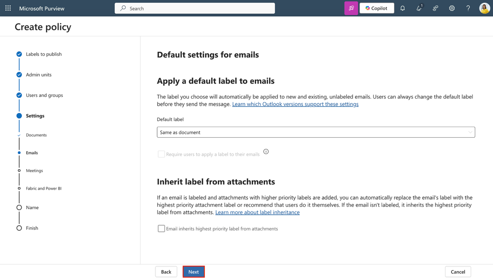

12. En la página **Default settings for meetings and calendar events**, seleccione **Next**.

> 

13. En la página **Default settings for Fabric and Power BI content**, seleccione **Next**.

> 

14. En la página **Name your policy**, ingrese:

    - **Name**: Internal HR employee data

    - **Enter a description for your sensitivity label policy**: This HR label is to be applied to internal HR employee data.

15. Seleccione **Next**.

> 

16. En la página **Review and finish**, seleccione **Submit**.

> 

17. En la página **New policy created**, seleccione **Done** para finalizar la publicación de su directiva de etiquetas.

> 

Se publicó el grupo de etiquetas Internal y su etiqueta de HR para que los usuarios puedan aplicarlas a documentos de HR. La propagación de la directiva en los servicios puede tardar hasta 24 horas.

**Tarea 4 – Configurar auto-labeling**

1.  En el portal **Microsoft Purview**, seleccione **Solutions \> Information Protection \> Sensitivity labels**.

2.  En la página **Sensitivity labels**, ubique la etiqueta de confidencialidad **Internal**. Seleccione el **vertical ellipsis (…)**, luego seleccione **+ Create label in group** en el menú desplegable.

> 

3.  En la página **Provide basic details for this label**, ingrese:

| **Details** | **Text** |
|----|----|
| **Name** | Financial Data |
| **Display name** | Financial Data |
| **Description for users** | This content contains financial data that must be labeled and protected. |
| **Description for admins** | This label is used for content that includes sensitive financial identifiers. |

4.  Seleccione **Next**.

> 

5.  En la página **Define the scope for this label**, seleccione **Files and Emails**. Si la casilla **Meetings** está seleccionada, asegúrese de desactivarla.

6.  Seleccione **Next**.

> 

7.  En la página **Choose protection settings for labeled items**, seleccione **Next**.

> 

8.  En la página **Auto-labeling for files and emails**, habilite **Auto-labeling for files and emails**.

> 

9.  En la sección **Detect content that matches these conditions**, seleccione **+ Add condition \> Content contains**.

> 

10. En la sección **Content contains**, seleccione **Add \> Sensitive info types**.

> 

11. En la página lateral **Sensitive info types**, busque y seleccione los siguientes tipos de información confidencial:

    - Credit Card Number

    - ABA Routing Number

    - SWIFT Code

12. Seleccione **Add**.

> 

13. De vuelta en la página **Auto-labeling for files and emails**, seleccione **Next**.

> 

14. En la página **Define protection settings for groups and sites**, seleccione **Next**.

> 

15. En la página **Review your settings and finish**, seleccione **Create label**.

> 

16. En la página **Your sensitivity label was created**, seleccione **Automatically apply label to sensitive content**, luego seleccione **Done.**

> 

17. En la página lateral **Create auto-labeling policy**, seleccione **Review policy**.

> 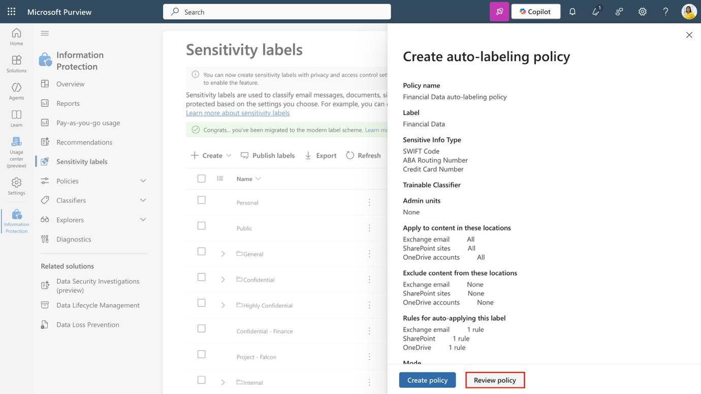

18. En la página **Name your auto-labeling policy**, mantenga el valor predeterminado y seleccione **Next**.

> 

19. En la página **Choose a label to auto-apply**, revise que la etiqueta **Internal/Financial Data** esté seleccionada, luego seleccione **Next**.

> 

20. En la página **Assign admin units**, seleccione **Next**.

> 

21. En la página **Choose locations where you want to apply the label**, seleccione las opciones:

    - Exchange email

    - SharePoint sites

    - OneDrive accounts

22. Seleccione **Next**.

> 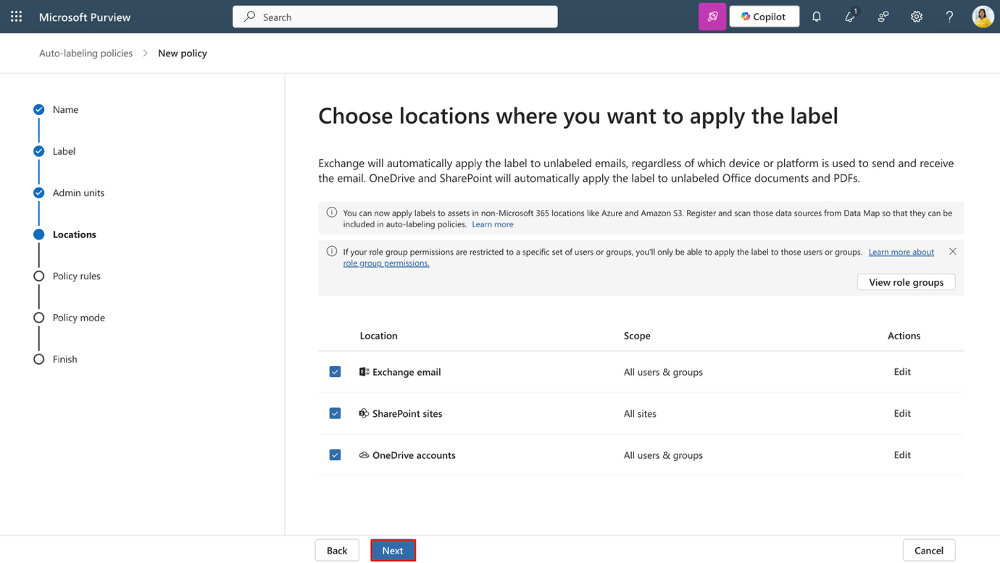

23. En la página **Set up common or advanced rules**, mantenga seleccionada la opción predeterminada **Common rules**, luego seleccione **Next**.

> 

24. En la página **Define rules for content in all locations**, expanda las reglas para **Financial Data** para confirmar que las reglas esperadas estén configuradas, luego seleccione **Next**.

> 

25. En la página **Additional settings for email**, seleccione **Next**.

> 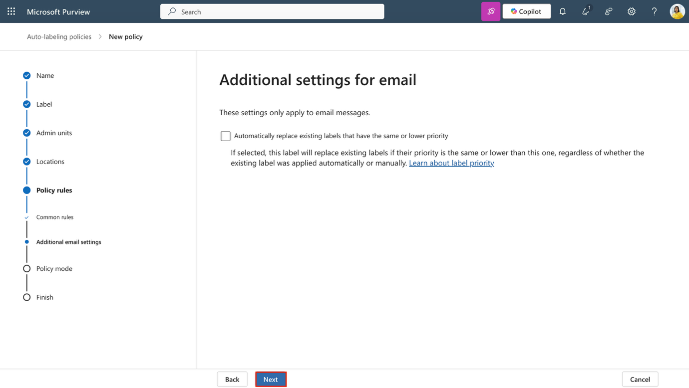

26. En la página **Decide if you want to test out the policy now or later**, seleccione **Run policy in simulation mode** y marque la casilla **Automatically turn on policy if not modified after 7 days in simulation.**

> 

27. Seleccione **Next**.

> 

28. En la página **Review and finish**, seleccione **Create policy**.

> 

29. En la página **Your auto-labeling policy was created**, seleccione **Done**.

Se creó una etiqueta secundaria para datos financieros y se configuró una política de auto-labeling que detecta y etiqueta contenido que contiene información financiera sensible.

**Tarea 5 – Crear y publicar una etiqueta DKE para contenido confidencial**

A continuación, creará una etiqueta secundaria en el grupo Internal que utiliza **Double Key Encryption (DKE)** y **dynamic watermarking** para proteger contenido legal confidencial.

1.  En **Microsoft Edge**, navegue a [**https://purview.microsoft.com**](https://purview.microsoft.com) e inicie sesión en el portal **Microsoft Purview** como **Patti Fernandes**.

2.  En el portal **Microsoft Purview**, seleccione **Solutions \> Information Protection \> Sensitivity labels**.

3.  En la página **Sensitivity labels**, ubique el grupo de etiquetas **Internal**. Seleccione el **vertical ellipsis (…)** y luego seleccione **+ Create label in group** en el menú desplegable.

> 

4.  En la página **Provide basic details for this label**, ingrese:

| **Details** | **Text** |
|----|----|
| **Name** | Confidential Legal |
| **Display name** | Confidential Legal |
| **Description for users** | Use this label for highly sensitive legal content that must be encrypted using Double Key Encryption. |
| **Description for admins** | Label configured with DKE and dynamic watermarking for highly sensitive legal content. |

5.  Seleccione **Next**.

> 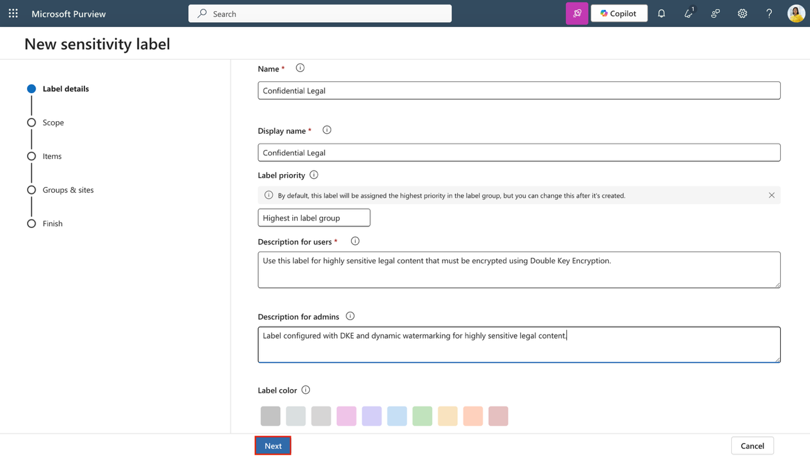

6.  En la página **Define the scope for this label**, seleccione **Files and Emails**. Si la casilla **Meetings** está seleccionada, asegúrese de desactivarla; luego seleccione **Next**.

> 

7.  En la página **Choose protection settings for the types of items you selected**, seleccione **Control access**, luego seleccione **Next**.

> 

8.  En la página **Access control**, seleccione **Configure access control settings**.

> 

9.  Configure los valores de cifrado con las siguientes opciones:

    - **Assign permissions now or let users decide?**: Assign permissions now

    - **User access to content expires**: A number of days after label is applied

    - **Access expires this many days after the label is applied**: 5

    - **Allow offline access**: Never

    - Seleccione el vínculo **Assign permissions**.

> En el panel lateral **Assign permissions**, seleccione **+ Add users or groups**.\
> En la página lateral **Add users or groups**, busque y seleccione **Legal Team** y **Patti Fernandes**, luego seleccione **Add.\**
> En la página **Assign permissions**, seleccione **Save**.
>
> 

- De regreso en la página **Access control**, seleccione la casilla Legal Team y Patti Fernandes, luego seleccione **Add**.

> 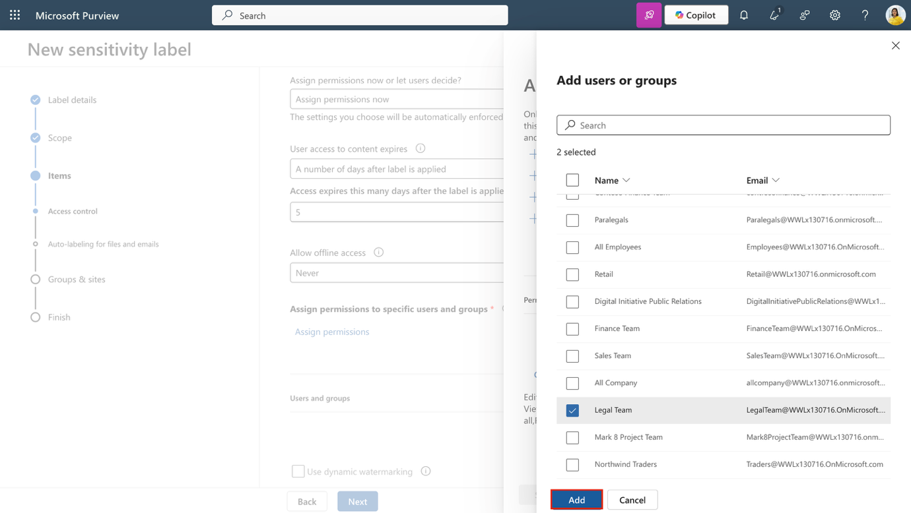

- En la página **Assign permissions**, seleccione **Save**

> 

10. De regreso en la página **Access control**, seleccione la casilla **Use dynamic watermarking**, luego seleccione **Customize text (optional)**.

> 

11. En la página **Add custom text to watermark (optional)**, ingrese **Confidential**, luego seleccione **UPN** y **Timestamp**.

12. Seleccione **Save** en la parte inferior del panel lateral.

> 

13. De regreso en la página **Access control**, seleccione la casilla **Use Double Key Encryption** e ingrese [**https://testingdke1.azurewebsites.net/Test**](https://testingdke1.azurewebsites.net/Test) como la URL del servicio **Double Key Encryption**.

14. Seleccione **Next**.

> 

15. En la página **Auto-labeling for files and emails**, seleccione **Next**.

> 

16. En la página **Define protection settings for groups and sites**, seleccione **Next**.

> 

17. En la página **Review your settings and finish**, seleccione **Create label**.

> 

18. En la página **Your sensitivity label was created**, seleccione **Publish label to users' apps**, luego seleccione **Done**.

> 

19. En la página lateral **Publish label**, seleccione **Create new label policy**.

> 

20. En la página **Choose sensitivity labels to publish**, seleccione **Choose sensitivity labels to publish**, agregue la etiqueta **Internal/Confidential Legal**, luego seleccione **Add**.

> 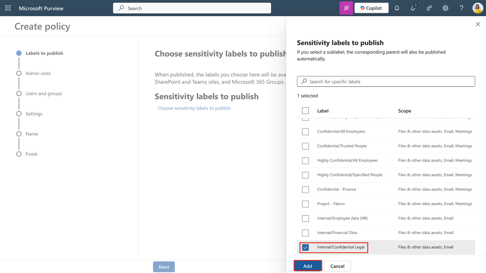

21. Seleccione **Next**.

> 

22. En la página **Assign admin units**, seleccione **Next**.

> 

23. En la página **Publish to users and groups**, deje el valor predeterminado y seleccione **Next**.

> 

24. En la página **Policy settings**, seleccione la casilla **Users must provide a justification to remove a label or lower its classification**, luego seleccione **Next**.

> 

25. En la página **Default settings for documents**, seleccione **Next**.

> 

26. En la página **Default settings for emails**, seleccione **Next**.

> 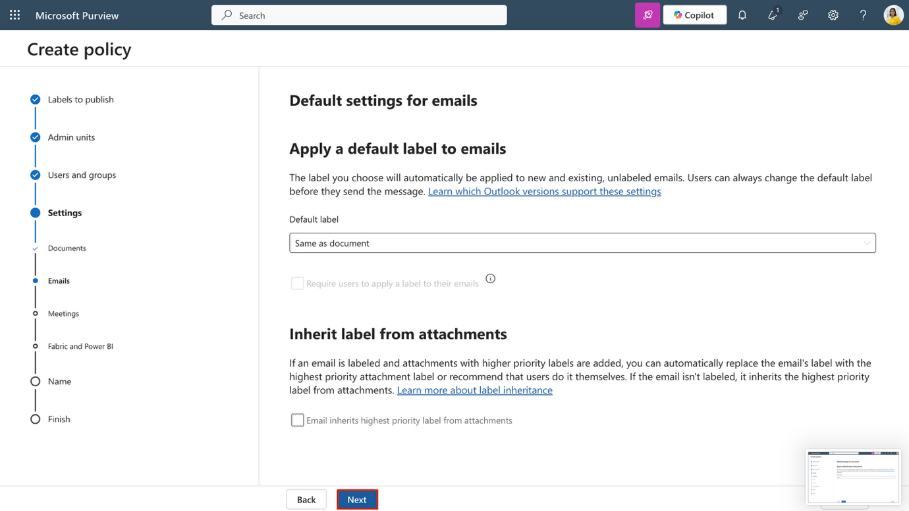

27. En la página **Default settings for meetings and calendar events**, seleccione **Next**.

> 

28. En la página **Default settings for Fabric and Power BI content**, seleccione **Next**.

> 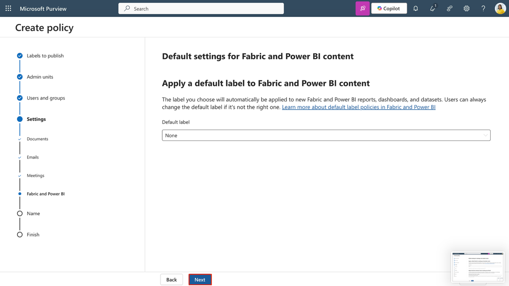

29. En la página **Name your policy**, ingrese:

    - **Name**: Confidential Legal

    - **Description**: Enables manual use of the DKE label for confidential content accessible by Legal.

30. Seleccione **Next**.

> 

31. En la página **Review and finish**, seleccione **Submit**.

> 

32. En la página **New policy created**, seleccione **Done**.

> 

Se creó y publicó una etiqueta secundaria que utiliza **Double Key Encryption** y **dynamic watermarking**. Esta etiqueta restringe el acceso a usuarios autorizados y exige justificación para reducir la clasificación.

**Ejercicio 3 – Política de archivos mediante etiquetas con Microsoft Purview**

**Tarea 1 – Habilitar la integración de Microsoft Purview en Defender for Cloud Apps**

Con las etiquetas de sensibilidad creadas y publicadas, ahora se integrará Microsoft Purview con Microsoft Defender for Cloud Apps. Esta integración permite que Defender analice archivos en busca de etiquetas de sensibilidad y aplique supervisión de archivos.

1.  Abra **Microsoft Edge** y navegue a **Microsoft Defender** mediante https://security.microsoft.com.

2.  En la navegación izquierda, seleccione **Settings**, luego seleccione **Cloud Apps**.

> 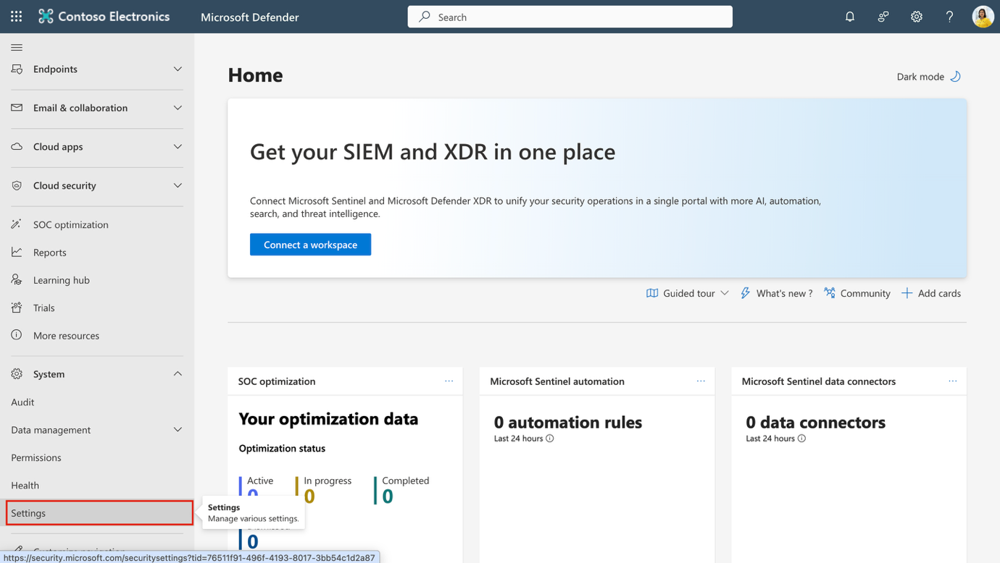

3.  En la sección **Information Protection** del panel izquierdo, seleccione **Microsoft Information Protection**.

> 

4.  En la página **Microsoft Information Protection**, seleccione ambas casillas disponibles:

    - **Automatically scan new files for Microsoft Information Protection sensitivity labels and content inspection warnings**

> Habilita que Defender for Cloud Apps analice automáticamente los archivos nuevos o modificados en busca de etiquetas de sensibilidad y advertencias de inspección de contenido de Microsoft Purview.

- **Only scan files for Microsoft Information Protection sensitivity labels and content inspection warnings from this tenant**

> Limita el análisis a etiquetas y advertencias creadas en su propia organización. Se ignorarán las etiquetas aplicadas por inquilinos externos.

5.  Seleccione **Save** para aplicar la configuración.

> 

6.  En la sección **Information Protection** del panel izquierdo, seleccione **Files**.

> 

7.  En la página **Files**, seleccione **Enable file monitoring**.

> 

8.  Seleccione **Save** para guardar la configuración.

> 

Ha habilitado la integración de Microsoft Purview en Defender for Cloud Apps. Defender ahora puede detectar etiquetas de sensibilidad y supervisar archivos para la evaluación de políticas y acciones de gobernanza..

**Tarea 2 – Crear una política de archivos para etiquetar archivos compartidos externamente**

Finalmente, se creará una política de archivos que aplique automáticamente una etiqueta de sensibilidad a los archivos compartidos externamente. Esto garantiza que el contenido sensible permanezca protegido incluso cuando se comparte fuera de la organización.

1.  En Microsoft Defender, navegue a **Cloud apps \> Policies \> Policy management**.

> 

2.  Seleccione la pestaña **Information protection**, luego seleccione **Create policy \> File policy**.

> 

3.  En la página **Create file policy**, configure:

    - **Policy name**: Auto-label externally shared files

    - **Policy severity**: **High**

    - **Category**: **DLP**

    - En la sección **Files matching all of the following**:

      - Para el primer filtro, configure los menús desplegables como: **Access level equals external.**

      - Para el segundo filtro, configure los menús desplegables como: **Last modified after (date)** y utilice la fecha actual.

> 

- En **Governance actions**, expanda **Microsoft OneDrive for Business**:

  - Seleccione la casilla **Apply sensitivity label.**

  - En el menú desplegable, seleccione **Highly Confidential-Specified People.**

> 

- Repita el mismo proceso para **Microsoft SharePoint Online**:

  - Seleccione la casilla **Apply sensitivity label.**

  - Seleccione **Highly Confidential-Specified People** en el menú desplegable.

> 

4.  Seleccione **Create** para finalizar la creación de la política de archivos.

> 

Ha creado una política de archivos que aplica etiquetas de sensibilidad a archivos compartidos externamente. Esta política amplía su estrategia de protección de la información al contenido almacenado en la nube.

**Resumen**

En este laboratorio, se asumió el rol de Patti Fernandez, administradora de sistemas en Contoso Ltd., y se implementó protección de la información mediante Microsoft Purview Sensitivity Labels. Se habilitó la compatibilidad con etiquetas de sensibilidad en SharePoint y Teams mediante PowerShell, se creó y publicó una etiqueta **Internal** y una subetiqueta específica para **HR**, y se aplicaron estas etiquetas en documentos de Word y correos de Outlook. También se creó y publicó una etiqueta de autoetiquetado para contenido relacionado con GDPR específico de Alemania. Estos pasos garantizan que los documentos de HR y regulaciones estén clasificados y protegidos correctamente dentro de la organización.
