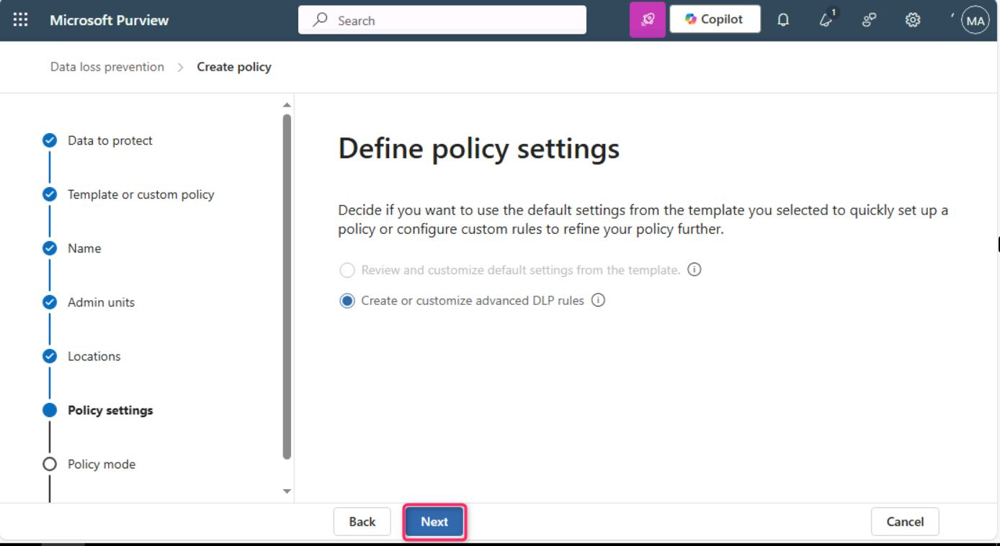
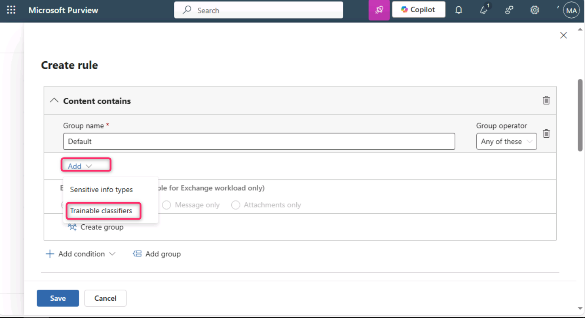
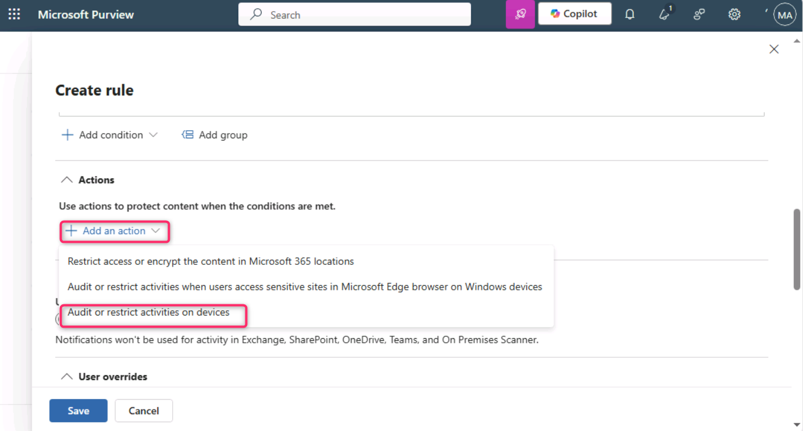
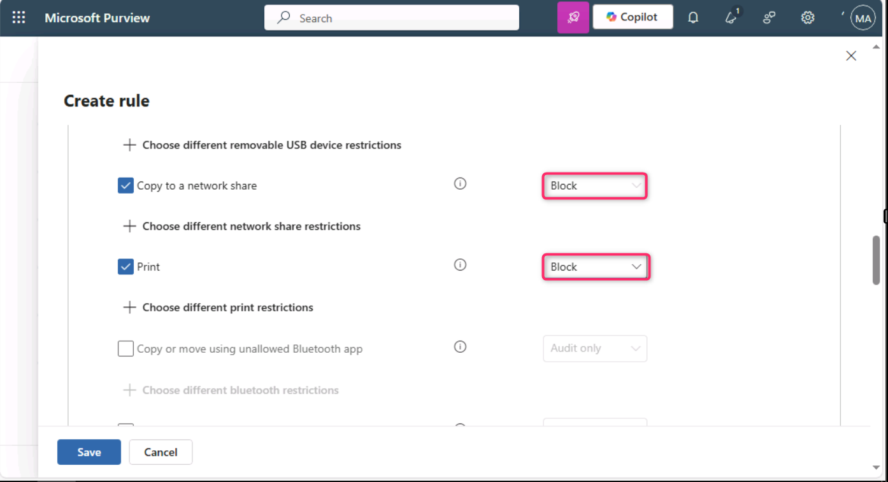

**Laboratorio 5 – Exploración de las capacidades de Adaptive Protection**

**Introducción**

Adaptive Protection en Microsoft Purview integra Microsoft Purview Insider Risk Management con Microsoft Purview Data Loss Prevention (DLP). Cuando Insider Risk identifica a un usuario que presenta un comportamiento riesgoso, se le asigna dinámicamente un nivel de riesgo interno. Luego, Adaptive Protection puede crear automáticamente una política de DLP para ayudar a proteger a la organización contra el comportamiento riesgoso asociado con ese nivel de riesgo interno.

**Objetivos**

- Establecer umbrales de riesgo para Adaptive Protection en Insider Risk Management.

- Crear y configurar una política personalizada de DLP para la protección de endpoints.

- Definir condiciones mediante clasificadores entrenables y niveles de riesgo interno.

- Aplicar acciones para bloquear actividades de exfiltración de datos de alto riesgo.

- Habilitar la política para su aplicación inmediata.

**Ejercicio 1 – Configurar Adaptive Protection**

**Tarea 1 – Configurar niveles de riesgo para Adaptive Protection**

1.  Abra una ventana normal del navegador Microsoft Edge, inicie sesión en el portal de Microsoft Purview usando las credenciales de administrador **MOD** y navegue a **Solutions \> Insider risk management**..

> 

2.  En el panel izquierdo de **Insider Risk Management**, navegue y seleccione **Adaptive Protection**.

> 

3.  En la página de **Adaptive Protection**, seleccione **Insider risk levels**. Luego, en la sección **Insider risk policy**, abra la lista desplegable junto a **Select a policy**, navegue y seleccione la casilla correspondiente a **Data leaks by a user**.

> 
>
> 

4.  En **Conditions for insider risk levels**, seleccione **User performs at least 3 data exfiltration activities, each…** para el nivel de riesgo **Elevated**. Seleccione **User performs at least 2 data exfiltration activities, each…** para el nivel de riesgo **Moderate**. Seleccione **User performs at least 1 data exfiltration activities, each…** para el nivel de riesgo **Minor**. Luego, desplácese hacia abajo y seleccione **Save**.

> 

5.  Seleccione nuevamente **Save**.

> 

**Tarea 2 – Crear una Directiva DLP personalizada de Adaptive Protection para Endpoint**

1.  En la página de **Adaptive Protection**, navegue y seleccione **Data Loss Prevention**, luego seleccione **+ Create policy**.

> 

2.  En la página **Choose what type of data to protect**, verifique que la opción **Data stored in connected sources** esté seleccionada.

> 

3.  En la página **Template or custom policy**, en la sección **Categories**, navegue y seleccione **Custom**. Luego, en **Regulations**, seleccione **Custom policy**.

> 

4.  En la página **Name your DLP policy**, en el campo **Name**, ingrese Custom Policy for Endpoint.

> 

5.  En la página **Assign admin units**, seleccione **Next**.

> 

6.  En la página **Choose where to apply the policy**, seleccione **Next**.

> 

7.  En la página **Define policy settings**, seleccione **Next**.

> 

8.  En la página **Customize advanced DLP rules**, seleccione **+ Create rule**.

> 

9.  En el campo **Create rule**, ingrese Adaptive Protection block rule for Endpoint DLP

> 

10. Seleccione la lista desplegable junto a **Select one or more risk levels** y active la casilla correspondiente a **Elevated risk level**.

> 

11. Seleccione la lista desplegable junto a **+ Add condition** y seleccione **Content contains**.

> 

12. En la sección **Content contains**, seleccione la lista desplegable junto a **Add**, luego seleccione **Trainable classifiers**.

> 

13. En el panel de **Trainable classifiers**, navegue y active las casillas correspondientes a **Source code**, **Agreements**, **HR** y **IP**, luego seleccione **Add**.

> 
>
> 

14. En la sección **Actions**, seleccione la lista desplegable junto a **Add an action** y seleccione **Audit or restrict activities on devices**.

> 

15. Seleccione **Block** para las acciones **Copy to clipboard**, **Copy to a removable USB device**, **Copy to a network share** y **Print**.

> ..
>
> 

16. En la sección **Incident reports**, en el campo **Use this severity level in admin alerts and reports**, seleccione **Low** en la lista desplegable. Luego seleccione **Save**.

> 

17. Seleccione **Next**.

> 

18. En la página **Policy mode**, seleccione la opción **Turn the policy on immediately**, luego seleccione **Next**.

> 

19. En la página **Review and finish**, seleccione **Submit**.

> 

20. En la página **New policy created**, seleccione **Done**.

> 

**Resumen**\
En este ejercicio, se configuró Adaptive Protection en Microsoft Purview mediante la definición inicial de niveles de riesgo interno basados en umbrales de actividades de exfiltración de datos. Posteriormente, se creó una directiva personalizada de Data Loss Prevention (DLP) para dispositivos endpoint que utiliza Adaptive Protection para restringir automáticamente actividades como copiar a una unidad USB o imprimir cuando se detecta un nivel de riesgo elevado. La directiva se orienta a contenido sensible mediante *trainable classifiers* y aplica acciones estrictas basadas en los niveles de riesgo interno para mitigar posibles fugas de datos.
