**Laboratorio 6 – Crear y administrar directivas DLP**

**Introducción**

Usted es Patti Fernandez, la nueva Administradora de Cumplimiento en Contoso Ltd., encargada de configurar el tenant de Microsoft 365 de la compañía para la prevención de pérdida de datos. Contoso Ltd. es una empresa que ofrece instrucción de manejo en los Estados Unidos y se requiere garantizar que la información sensible de los clientes no salga de la organización.

**Objetivos**

- Crear y probar directivas DLP en Microsoft Purview.

- Utilizar PowerShell para administrar configuraciones DLP.

- Habilitar el monitoreo de archivos y crear directivas de archivos en Defender for Cloud Apps.

- Implementar DLP para Power Platform con el fin de controlar flujos de datos.

**Ejercicio 1 – Crear directivas DLP**

**Tarea 1 – Crear una directiva DLP en modo de prueba**

En este ejercicio se creará una directiva de Data Loss Prevention en el portal de Microsoft Purview para proteger datos sensibles que puedan ser compartidos por los usuarios. La directiva notificará a los usuarios cuando intenten compartir contenido que contenga información de tarjetas de crédito y les permitirá proporcionar una justificación para enviarla. La directiva se implementará en modo de prueba para evitar que la acción de bloqueo afecte a los usuarios por el momento.

1.  En **Microsoft Edge**, navegue a <https://purview.microsoft.com> y confirme que se ha iniciado sesión en el portal de **Microsoft Purview** como **Patti Fernandez.**

2.  En el portal de **Microsoft Purview**, en el panel de navegación izquierdo, seleccione **Solutions \> Data loss prevention**.

> 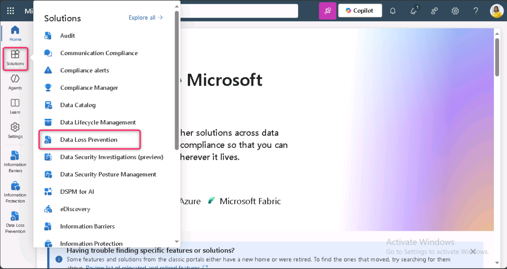

3.  En **Data loss prevention**, seleccione **Policies** y luego **+Create policy** para iniciar el asistente de creación de una nueva directiva DLP.

> 

4.  En el panel **What info do you want to protect?**, seleccione **Enterprise applications and devices**.

> 

5.  En la página **Start with a template or create a custom policy**, desplácese hacia abajo y seleccione **Custom** en la sección **Categories**. Luego seleccione **Custom policy** en **Regulations**. Seleccione **Next**.

> 

6.  En la página **Name your DLP policy**, escriba Credit Card DLP Policy en el campo **Name** y Protect credit card numbers from being shared. en el campo **Description**. Seleccione **Next.**

> 

7.  En la página **Assign admin units**, seleccione **Next**.

> 

8.  En **Choose where to apply the policy**, marque **Teams chat and channel messages** y desmarque las demás opciones. Seleccione **Next**.

> 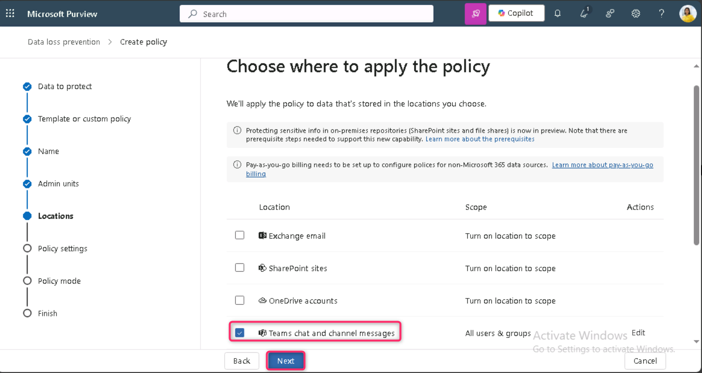

9.  En **Define policy settings**, confirme que la opción **Create or customize advanced DLP rules** esté seleccionada y seleccione **Next**.

> 

10. En **Customize advanced DLP rules**, seleccione **+ Create rule**.

> 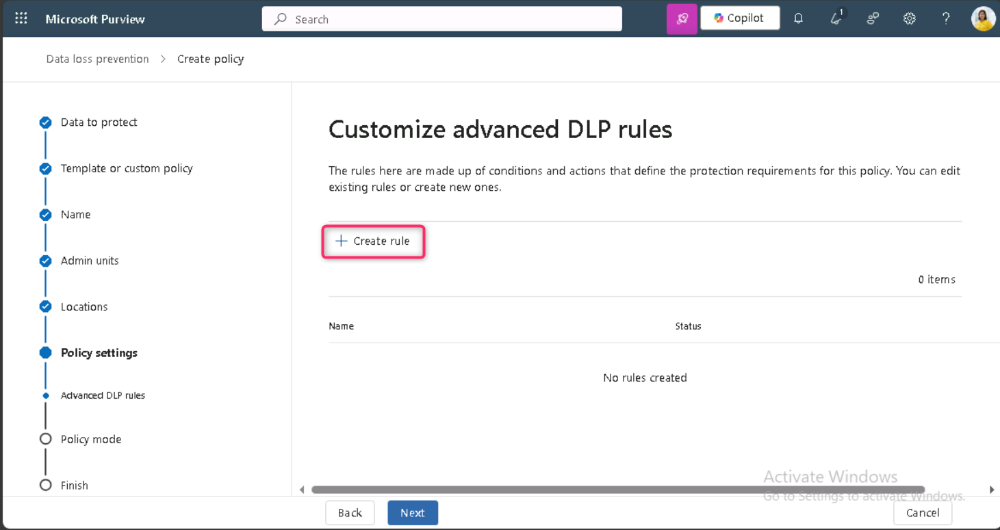

11. En **Create rule**, escriba el nombre de la regla en el campo **Name**.

> 

12. En la sección Conditions, seleccione **+ Add condition** y elija **Content is shared from Microsoft 365**.

> 

13. En la sección agregada, seleccione **with people outside my organization**.

> 

14. Seleccione nuevamente **+ Add condition** y elija **Content contains**.

> 

15. En la nueva sección, seleccione **Add**, luego elija **Sensitive info types**.

> 

16. En el panel lateral, busque credit card number, presione Enter, seleccione la casilla junto a **Credit Card Number** y seleccione **Add**.

17. En la página de creación de regla, seleccione **+ Add an action** y elija **Restrict access or encrypt the content in Microsoft 365 locations**.

> 

18. En esta sección, asegúrese de seleccionar **Block users from receiving email or accessing shared SharePoint, OneDrive, and Teams files, and Power BI items**, y seleccione **Block only people outside your organization**.

> 

19. En **User notifications**, active el interruptor.

> 

20. En la página **Create rule**, en la sección **User overrides**, en **Allow overrides from M365 services**, marque la casilla **Allow overrides from M365 services**. Permite que los usuarios en Exchange, SharePoint, OneDrive y Teams omitan las restricciones de la directiva**.**

> 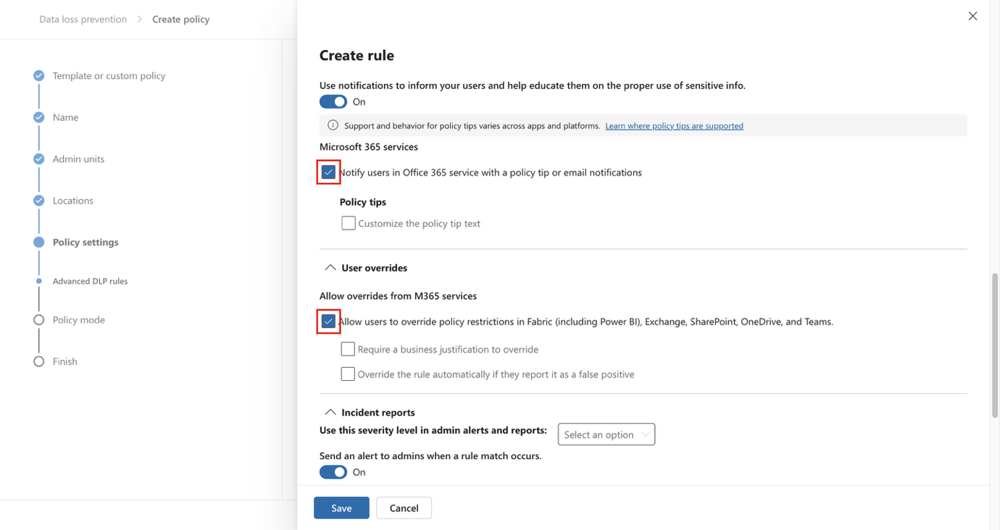

**Nota:** Si no pudo seleccionar la casilla **Allow overrides from M365 services,** active la casilla **Notify users in Office 365 with a policy tip,** la cual se encuentra en la página **Create rule,** en la sección **User notification \> Microsoft 365 services del paso anterior.** Luego, marque la casilla **Allow overrides from M365 services.** Permite que los usuarios en **Exchange, SharePoint, OneDrive y Teams** omitan las restricciones de la directiva.

21. Marque la casilla **Require a business justification to override**.

> 

22. En la sección **Incident reports**, en el menú desplegable **Use this severity level in admin alerts and reports**, seleccione **Low**.

> 

23. Seleccione **Save**, luego seleccione **Next**.

> 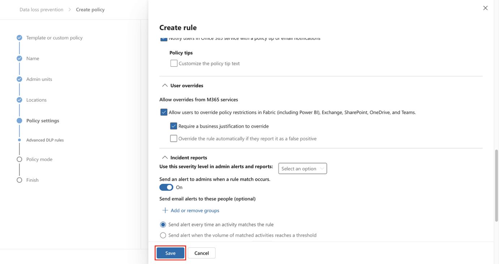
>
> 

24. En la página **Policy mode**, asegúrese de que el botón de opción **Run the policy in simulation mode** esté seleccionado y asegúrese de que la casilla junto a **Show policy tips while in test mode** esté seleccionada. Luego, seleccione el botón **Next**.

> 

25. Seleccione **Submit** para crear la directiva.

> 

26. Una vez creada la directiva, seleccione **Done**.

> 
>
> Ha creado una directiva DLP que escanea números de tarjetas de crédito en los chats y canales de Microsoft Teams y permite que los usuarios proporcionen una justificación empresarial para omitir la directiva.
>
> 

**Tarea 2 – Modificar una política de DLP**

En esta tarea, modificará la política de DLP existente creada en el paso anterior para incluir también el análisis de correos electrónicos en busca de información de tarjetas de crédito e informar a los usuarios si intentan compartir este contenido en un correo electrónico.

1.  **Seleccione** la casilla situada junto a *Credit Card DLP Policy* y luego **seleccione** el ícono **Edit** en la barra de comandos, como se muestra en la imagen.

> 

2.  En la página **Name your DLP policy and Assign admin units**, seleccione **Next.**

> 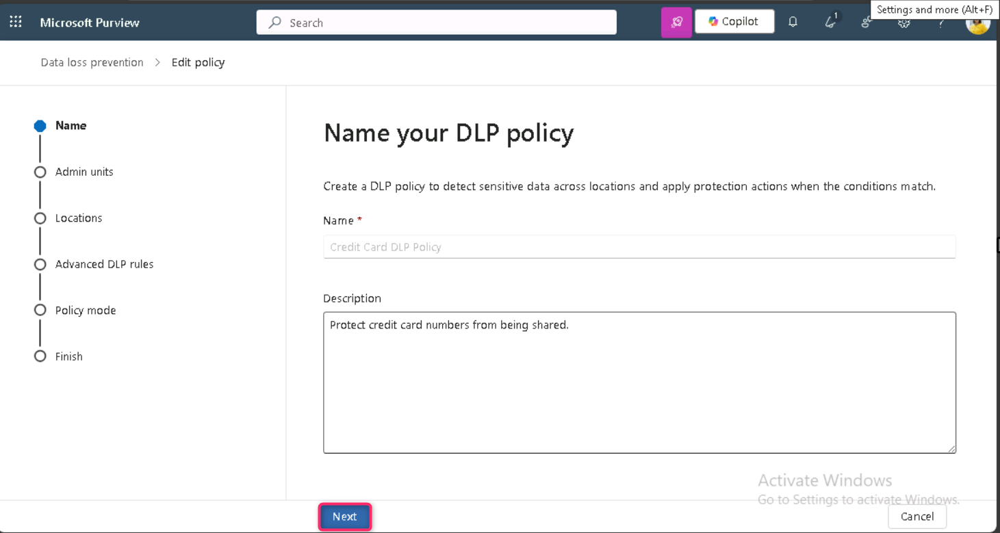
>
> 

3.  En la página **Choose where to apply the policy**, seleccione únicamente la casilla situada junto a **Exchange email** y luego seleccione **Next** hasta llegar a la página **Review and finish.**

> 

4.  Seleccione **Submit** para aplicar el cambio realizado en la política.

> 

5.  Una vez que la política se haya actualizado, seleccione el botón **Done.**

> 

Ha modificado correctamente una política de DLP existente y ajustado las ubicaciones en las que analiza contenido.

**Tarea 3 – Crear una política de DLP en PowerShell**

En esta tarea, utilizará PowerShell para crear una política de DLP que proteja los Contoso EmployeeIDs y evite que se compartan en Exchange. Los usuarios serán informados de que están intentando compartir datos confidenciales y se bloqueará el envío del correo electrónico si incluye Contoso EmployeeIDs.

1.  **Haga clic derecho** en el ícono de Windows en la barra de tareas y **seleccione** *Windows PowerShell (Admin)* para ejecutarlo como administrador.

> 

2.  En el cuadro de diálogo *User Account Control*, **haga clic** en el botón *Yes*.

> 

3.  En PowerShell, **ejecute** los siguientes comandos:

> Install-Module ExchangeOnlineManagement
>
> Import-Module ExchangeOnlineManagement
>
> 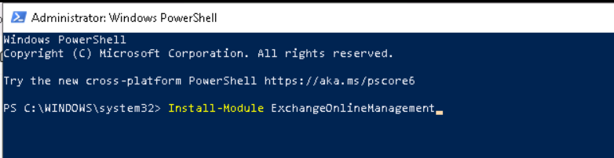
>
> 

4.  En la ventana de PowerShell, **ingrese**, Connect-IPPSSession y luego inicie sesión como **Patti Fernandez**.

> 
>
> 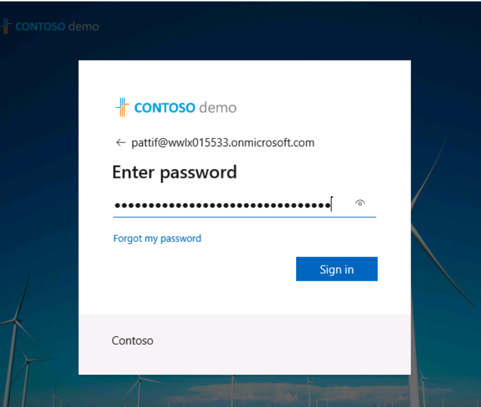
>
> En caso de que aparezca el cuadro de diálogo **Automatically sign in to all desktop apps and websites on this device?**, seleccione **No, this app only**.
>
> 
>
> 

5.  Ingrese el siguiente comando en PowerShell para crear una política de DLP que analice todos los buzones de Exchange:

> New-DlpCompliancePolicy -Name "EmployeeID DLP Policy" -Comment "This policy blocks sharing of Employee IDs" -ExchangeLocation All
>
> 

6.  Ingrese el siguiente comando en PowerShell para agregar una regla de DLP a la política creada en el paso anterior:

> New-DlpComplianceRule -Name "EmployeeID DLP rule" -Policy "EmployeeID DLP Policy" -BlockAccess \$true -ContentContainsSensitiveInformation @{Name="Contoso Employee IDs"}
>
> 
>
> 

7.  Use el siguiente comando para revisar la regla **EmployeeID DLP rule**:

> Get-DLPComplianceRule -Identity "EmployeeID DLP rule"
>
> 

Ha creado una política de DLP que analiza *Contoso EmployeeIDs* en Exchange mediante PowerShell.

**Tarea 4 – Activar una política en modo de prueba**

En esta tarea, activará la política de DLP de información de tarjetas de crédito que creó en modo de prueba para que aplique sus acciones de protección.

1.  En una ventana **InPrivate de Microsoft Edge**, navegue a [**https://purview.microsoft.com**](https://purview.microsoft.com) y asegúrese de haber iniciado sesión en el portal de **Microsoft Purview** como **Patti Fernandez**.

2.  En el portal de **Microsoft Purview**, en el panel de navegación izquierdo, seleccione **Solutions \> Data loss prevention**.

> 

3.  En **Data loss prevention**, seleccione **Policies**, luego seleccione la política denominada **Credit Card DLP Policy** y después seleccione **Edit policy** (icono de lápiz) para abrir el asistente de políticas.

> 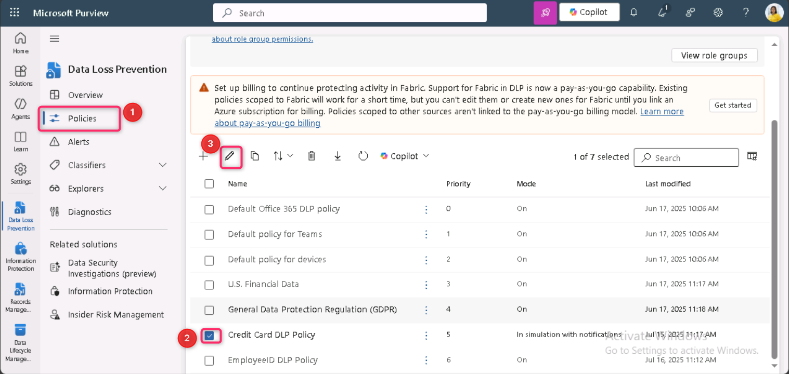

4.  Seleccione **Next** hasta llegar a la página **Test or turn on the policy** y seleccione **Turn the policy on immediately**.

> 

5.  Seleccione **Next**, luego seleccione **Submit** para activar la política.

> 

6.  Una vez que la política se haya actualizado, seleccione **Done**.

> 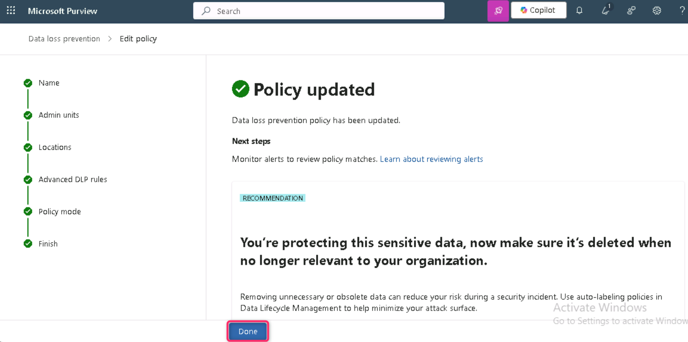

Ha activado correctamente la política de DLP. Si la política detecta un intento de compartir información de tarjetas de crédito, ahora bloqueará el intento y permitirá que los usuarios proporcionen una justificación empresarial para invalidar la acción de bloqueo.

**Ejercicio 2 – Administrar políticas de DLP**

**Tarea 1 – Modificar la prioridad de una política**

Después de crear dos políticas de DLP, desea asegurarse de que la política más restrictiva se procese con una prioridad más alta que la política menos restrictiva. Por este motivo, desea mover la **EmployeeID DLP Policy** a una prioridad superior.

1.  En **Microsoft Edge**, navegue a [**https://purview.microsoft.com**](https://purview.microsoft.com) y asegúrese de haber iniciado sesión en el portal de **Microsoft Purview** como **Patti Fernandez**.

2.  En el portal de Microsoft Purview, en el panel de navegación izquierdo, seleccione **Solutions \> Data loss prevention**.

> 

3.  En **Data loss prevention**, seleccione **Policies**, luego seleccione la política denominada **Credit Card DLP Policy**. Seleccione **Move to top (highest priority)**.

> 

4.  En la ventana **Data loss prevention**, seleccione **Refresh** y revise la prioridad en la columna **Order** de la tabla de políticas.

> 

Ha modificado correctamente la prioridad de sus políticas de DLP. Si ambas políticas coinciden con el mismo contenido, se aplicará la acción de la política con mayor prioridad.

**Tarea 2 – Habilitar la supervisión de archivos en Microsoft Defender**

Desea utilizar las políticas de archivos en **Microsoft Defender** para proteger archivos en sus ubicaciones de OneDrive y SharePoint Online. Antes de poder crear una política de archivos, es necesario habilitar la supervisión de archivos para que Microsoft Defender pueda analizar los archivos de su organización.

1.  Abra una nueva pestaña en su navegador habitual Microsoft Edge, introduzca la siguiente URL en la barra de direcciones para abrir el portal de Microsoft Defender:  https://security.microsoft.com. Luego, inicie sesión en el portal de Microsoft Defender como **MOD Administrator**.

2.  En el portal de Microsoft Defender, desplácese hacia abajo y haga clic en **System \> Settings** en el menú de navegación del lado izquierdo. En la página **Settings**, haga clic en **Cloud Apps**.

> 

3.  Ahora, desplácese hacia abajo hasta la sección **Information Protection**, luego haga clic en **Files**. En la página **Files**, seleccione la casilla situada junto a **Enable file monitoring**, luego haga clic en el botón **Save**.

> 

**Nota:** Si la supervisión de archivos (File monitoring) ya se encuentra habilitada de forma predeterminada, entonces ignore el paso anterior y continúe con la siguiente tarea.

Ha habilitado correctamente la supervisión de archivos en Microsoft Defender for Cloud Apps y ahora puede analizar archivos en busca de contenido sensible utilizando políticas de archivos.

**Tarea 3 – Crear una File Policy para Microsoft Defender**

En esta tarea, se desea crear una File Policy en Microsoft Defender para analizar archivos en OneDrive y SharePoint Online y poner automáticamente en cuarentena los archivos que contengan información de tarjetas de crédito si son compartidos.

1.  Ahora, bajo la misma sección **Information Protection**, haga clic en **Microsoft Information Protection**, luego seleccione la casilla junto a **Automatically scan new files for Microsoft Information Protection sensitivity labels and content inspection warnings**. Después, haga clic en el botón **Save**.

> 
>
> 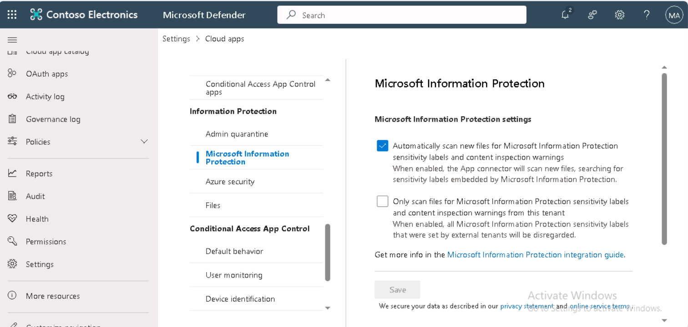

2.  En **Inspect protected files**, haga clic en **Grant Permission**.

> 

3.  Aparecerá el cuadro de diálogo **Pick an account**, luego seleccione las credenciales del tenant **MOD Administrator.**

\

4.  En la página **Permissions requested**, haga clic en el botón **Accept**.

> 

5.  Se observará el estado **Active**, lo que indica que el permiso se ha concedido correctamente.

> 

6.  En la subnavegación, bajo la sección **Connected apps**, haga clic en **App Connectors**, luego asegúrese de que **Microsoft 365** esté agregado.

> 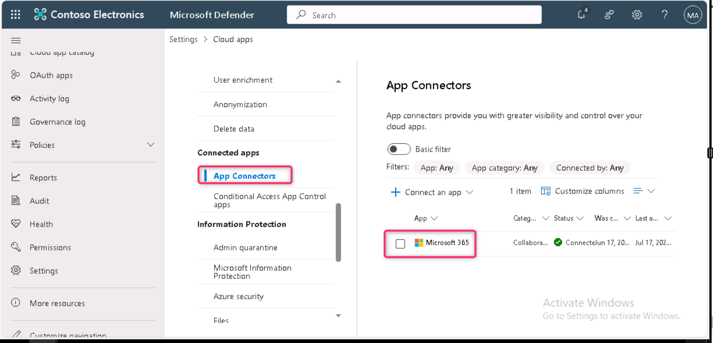

7.  Ahora, en el panel de navegación izquierdo del portal de Microsoft Defender, expanda **Policies** bajo la sección **Cloud Apps** y seleccione **Policy management**.

> 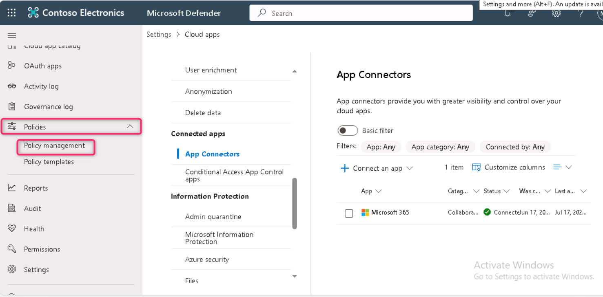

8.  En la página **Policies**, haga clic en **Create policy**, luego seleccione **File policy**.

> 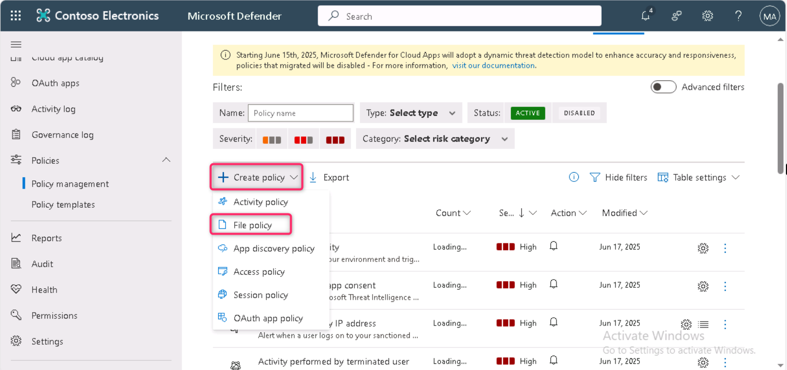

9.  En la página **Create file policy**, escriba Credit Card Information for files. en el campo **Policy name** y escriba Protect credit card numbers from being shared in files. en el campo **Description**.

> 

10. Mantenga la **Policy Severity** en **Low** (un icono iluminado) y asegúrese de que la categoría esté establecida en **DLP**. Para una file policy, esto debería ser el valor predeterminado.

> 

11. En el área **Files matching all of the following**, expanda el menú desplegable **Public (Internet), External, Public** y agregue **Internal**.

> 

12. En la sección **Apply to**, en el menú desplegable **Inspection Method**, seleccione **Data Classification Service**.

> 
>
> **Nota:** Si aún no ve **Data Classification Service** en el menú desplegable, seleccione **None** por el momento. Una vez finalizado, regrese más tarde a **Policies \> Policy management \> All Policies \> Search for name: Credit card \> Select Credit Card Information for files.**

13. En el menú desplegable **Choose inspection type…**, seleccione **Sensitive information type…**

14. En el cuadro de diálogo **Select a sensitive information type**, escriba Credit Card Number en la barra de búsqueda, seleccione la casilla situada junto a **Credit Card Number**, luego haga clic en el botón **Done**.

> 

15. En la sección **Alerts**, seleccione la casilla junto a **Create an alert for each matching file**. Luego, haga clic en el botón **Save as default settings**.

> 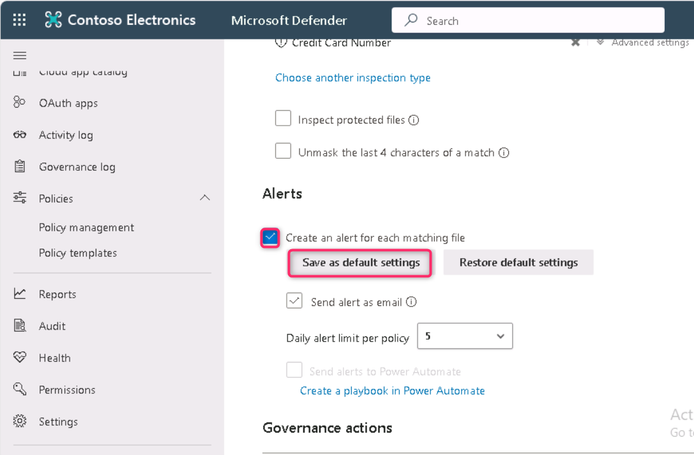

16. En la sección **Governance actions**, expanda **Microsoft OneDrive for Business** y seleccione **Put in user quarantine**.

> 

17. En la sección **Governance actions**, expanda **Microsoft SharePoint Online** y seleccione **Put in user quarantine**.

> 

18. Seleccione **Create** en la parte inferior de la página.

> 

19. Seleccione la **imagen de perfil** del **MOD Admin** en la esquina superior derecha y seleccione **Sign out** junto al ícono del engranaje, luego cierre el navegador.

> 

Ha creado una file policy que analizará continuamente los archivos guardados en OneDrive y SharePoint para detectar información de tarjetas de crédito y los pondrá en cuarentena si se comparten dentro de su organización.

**Tarea 4 – Crear una DLP Policy para Power Platform**

Su empresa usa Power Automate flows para compartir datos entre SharePoint Online y Salesforce. En esta tarea, se creará una DLP policy para Power Platform que permita que los flows existentes continúen funcionando, pero que impida la creación de nuevos flows que compartan datos entre SharePoint Online y aplicaciones definidas como no empresariales (*non-business*).

1.  En **Microsoft Edge**, navegue a https://admin.powerplatform.microsoft.com e inicie sesión en el Power Platform admin center como **MOD Administrator**.

2.  En la página principal del **Power Platform** **admin center**, navegue y haga clic en **Security**.

> 

3.  Luego, haga clic en el icono **Data and privacy** como se muestra en la imagen.

> 

4.  En la página **Data protection and privacy**, navegue y haga clic en **Data policy**.

> 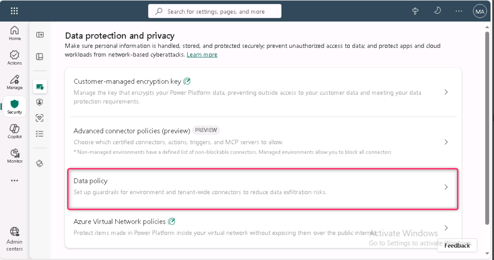

5.  En la página **Data policies**, seleccione **+ New Policy**.

> 

6.  En la página **Name your policy**, escriba **Tenant-wide SharePoint Policy**, luego seleccione **Next**.

> 

7.  En la pestaña **Non-business \| Default**, seleccione **SharePoint** y **Salesforce**, luego seleccione **Move to Business** en la parte superior de la página.

> 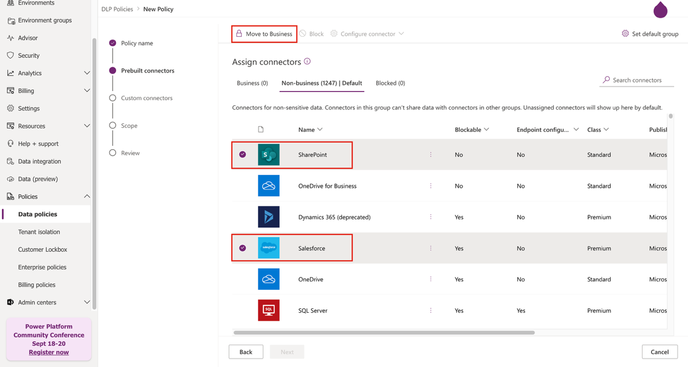

8.  En la página **Assign connectors**, seleccione la pestaña **Business** para verificar que tanto SharePoint como Salesforce aparecen ahora en ella.

> 

9.  Seleccione **Next** dos veces.

> 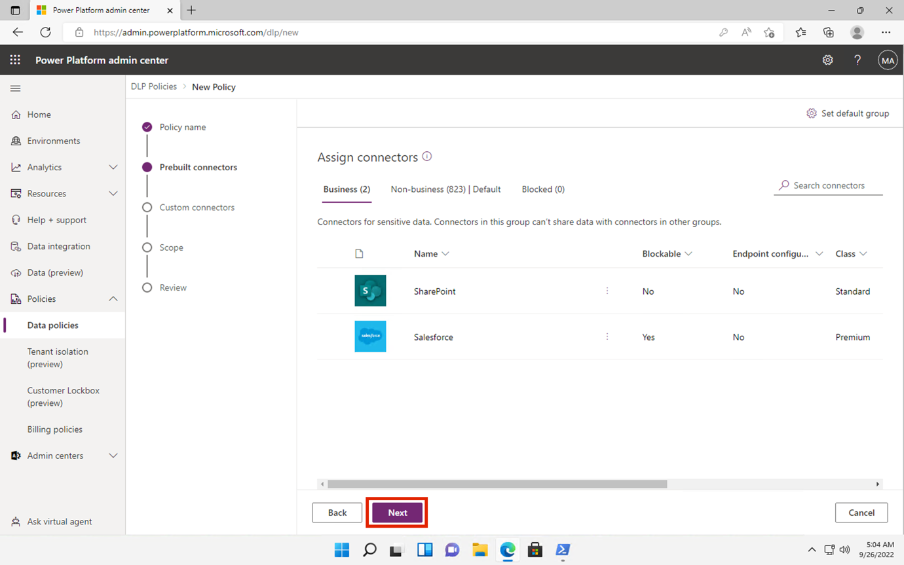
>
> 

10. En la página **Define scope**, seleccione **Add all environments**, luego seleccione **Next**.

> 

11. En la página **Review and create policy**, revise la configuración de la policy y seleccione **Create policy**.

> 
>
> Ha creado una Power Platform DLP policy que evita que los usuarios creen flows que incluyan un conector de SharePoint Online y cualquier conector que no sea Salesforce.
>
> 

**Resumen:**

En este laboratorio, se crearon y administraron Data Loss Prevention (DLP) policies para proteger datos confidenciales como números de tarjetas de crédito e identificaciones de empleados en Microsoft Teams, Exchange, OneDrive, SharePoint y Power Platform. Se construyeron policies mediante Microsoft Purview y PowerShell, se habilitaron notificaciones y reemplazos de usuario, se priorizaron policies, se activó el monitoreo de archivos en Microsoft Defender y se configuraron acciones de cuarentena de archivos. Además, se creó una Power Platform DLP policy para restringir el intercambio de datos con conectores no empresariales.
