**Laboratorio 7 – Configurar Insider Risk Management**

**Introducción**

En este laboratorio, se aprenderá cómo configurar **Insider Risk Management** mediante las Insider Risk Management Policies. Se usarán los Sensitive Info Types creados en el Lab 1 y las DLP policies creadas en el Lab 4 para crear policies que protegerán a la organización contra el uso riesgoso del navegador o cualquier robo o filtración de datos.

Para lograrlo, se creará una infraestructura en Azure que representará los dispositivos de una organización. Se aprenderá cómo incorporar esos dispositivos en Azure AD e Intune, e instalar un MDM agent en ellos, de modo que puedan utilizarse para obtener alertas desde esas máquinas.

**Objetivos**

- Sincronizar los relojes de las máquinas virtuales para garantizar configuraciones de hora precisas durante las pruebas de las policies.

- Asignar usuarios al Insider Risk Management role group en Microsoft Purview.

- Habilitar analytics insights para la detección de riesgos internos a nivel de tenant y de usuario.

- Incorporar dispositivos Windows 10 a Microsoft Defender for Endpoint para monitoreo de riesgos internos.

- Crear y configurar Insider Risk Management policies para:\
  o Uso riesgoso del navegador\
  o Robo de datos por usuarios que están por abandonar la organización\
  o Filtraciones de datos por parte de usuarios

- Ponderar cada policy para simular escenarios de detección de riesgos internos para la cuenta MOD administrator..

**Ejercicio 1 – Configurar el entorno**

**Tarea 0 – Sincronizar el reloj de la máquina virtual**

1.  Cierre todas las pestañas del navegador **Microsoft Edge** que estén abiertas en su máquina virtual. Haga clic en el ícono de Windows y luego haga clic en **Settings**, como se muestra en la imagen.

> 

2.  En la barra de búsqueda de **Windows Settings**, escriba **Date & time settings** y seleccione **Date & time settings** de la lista.

> 

3.  En la página **Date & time**, navegue y haga clic en el botón **Sync now**.

> 

**Ejercicio 2 – Crear políticas de Insider Risk Management**

**Requisitos previos**

**Paso 1 – Agregar usuarios al grupo de roles de Insider Risk Management**

1.  Abra el portal de **Microsoft Purview**: <https://purview.microsoft.com> e inicie sesión con las credenciales de **MOD Administrator**.

2.  En el menú de navegación izquierdo, haga clic en **Settings.**

> 

3.  En el panel **Settings**, navegue y haga clic en **Roles and scopes**. Haga clic en **Role groups**, luego seleccione la casilla junto a **Insider Risk Management** y haga clic en el ícono del lápiz para **Edit**.

> 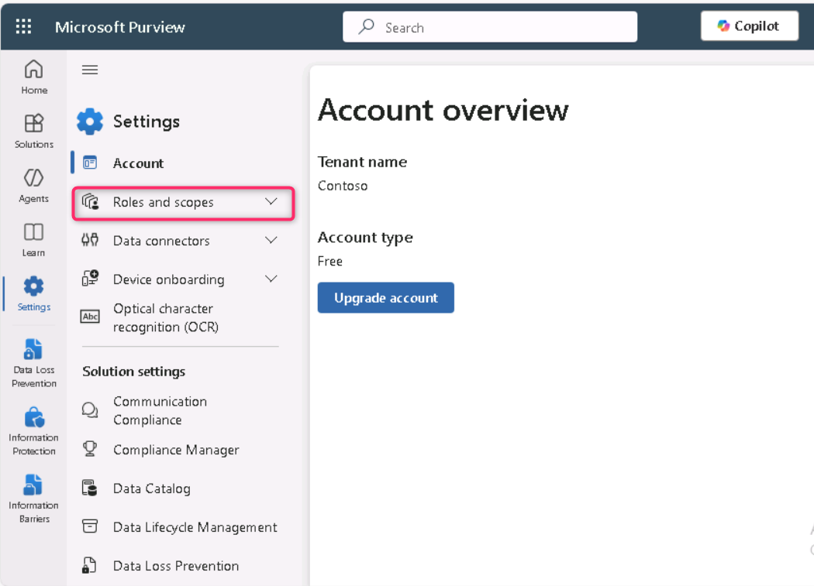
>
> 

4.  En la página **Edit Members of the role group**, haga clic en **Choose users**.

> 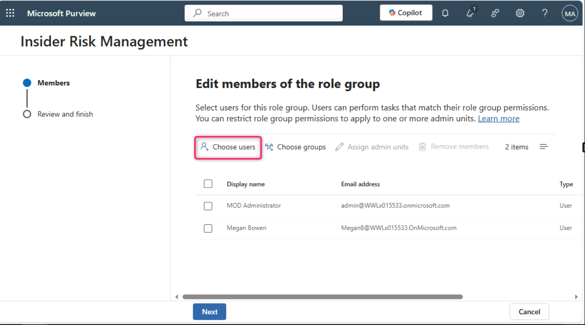

5.  Seleccione la casilla junto a **Alex Wilber**. Luego, haga clic en **Select**.\
    *En caso de que Alex Wilber ya esté seleccionado, ignore este paso*.

> **Nota:** Si no ve los nombres Megan Bowen y MOD Administrator en la lista de miembros para editar, además de Alex, seleccione también Megan Bowen y MOD Administrator.
>
> 

6.  Asegúrese de que los nombres **MOD Administrator**, **Megan Bowen** y **Alex Wilber** estén visibles, luego haga clic en **Next**.

> 

7.  Seleccione **Save** para agregar los usuarios al grupo de roles.

> 

8.  Seleccione **Done** para completar los pasos.

> 

**Paso 2 – Habilitar análisis de información para Insider Risk**

1.  En el portal de **Microsoft Purview**, navegue a **Settings**, luego desplácese hacia abajo y haga clic en **Insider risk management**.\
    En la página **Insider Risk Management settings – Analytics**, active los interruptores **Show insights at tenant level** y **Show insights at user level**. Luego haga clic en **Save**.

> 

**Paso 3 – Incorporar un dispositivo**

En este escenario de implementación, se incorporarán dispositivos que aún no han sido incorporados y únicamente se desea detectar actividades de riesgo interno en dispositivos Windows 10.\
\
Es necesario registrar el dispositivo/VM en Microsoft Entra ID como requisito previo para crear cualquier Insider Risk Policy.

1.  Haga clic en el ícono de **Windows**, luego seleccione **Settings**.

> 

2.  Vaya a **Accounts \> Access work or school**. En la página **Access work or school**, haga clic en **Connect**.

> 
>
> 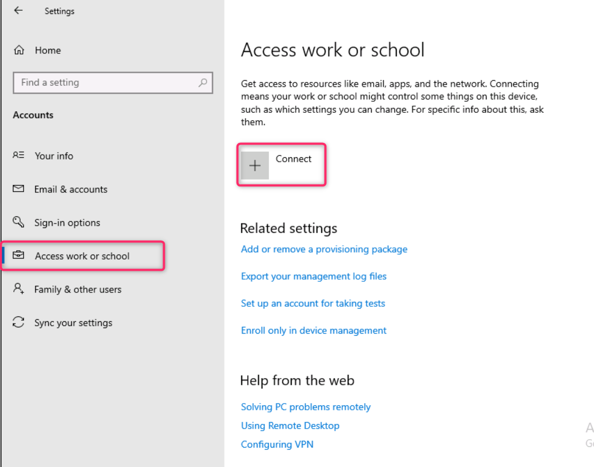

3.  En el mensaje **Set up a work or school account**, haga clic en **Join this device to Microsoft Entra ID**.

> 

4.  En la ventana de inicio de sesión, inicie sesión con las credenciales de **MOD Administrator** proporcionadas en la pestaña **Resources** de su entorno de laboratorio.

> 
>
> 

5.  En el mensaje **Make sure this is your organisation**, haga clic en **Join**.

> 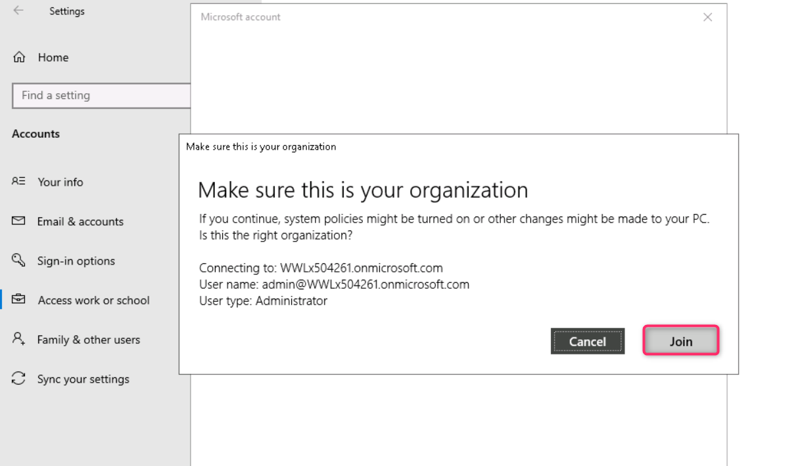

6.  Una vez completado, aparecerá la ventana de confirmación **You're all set!**. Haga clic en **Done**.

> 

7.  Nuevamente, en la página **Access work or school**, haga clic en **Connect**.

> 

8.  En el mensaje **Set up a work or school account**, inicie sesión usando las credenciales de **MOD Administrator**.

> 
>
> 

9.  En el mensaje **Stay signed in?**, haga clic en **Yes**.

> 

10. Si aparece el mensaje **Setting up your device**, seleccione **Got it**.

> 

11. Ahora vaya a **Windows Settings \> Accounts \> Access work or school \> Connected to Contoso MDM \> Info \> Sync**.

> 
>
> 

12. Haga clic en el ícono de Windows en su VM. Seleccione el usuario **Admin** y haga clic en **Sign out**.

> 

13. En la pantalla de usuarios, seleccione **Other user**.

> 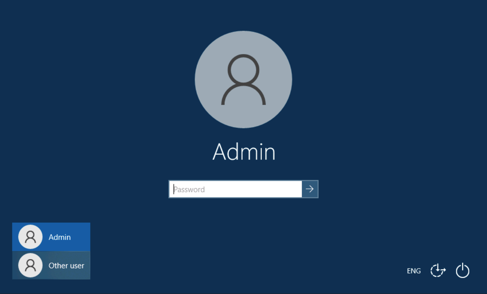

14. Ingrese las credenciales de **O365** mostradas en la página de inicio del laboratorio e inicie sesión como **MOD Administrator**.

> 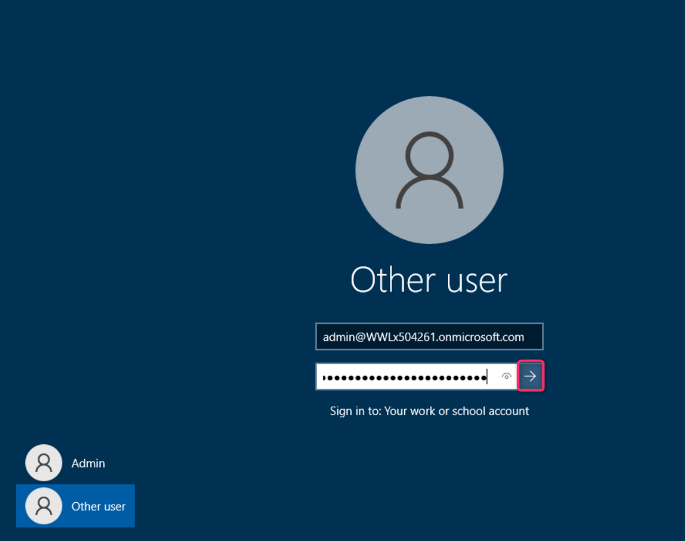

15. Inicie sesión en <https://purview.microsoft.com> usando su cuenta **MOD Administrator** en la VM del laboratorio.

16. En el portal de Microsoft Purview, navegue y seleccione **Settings \> Device onboarding \> Devices**. Haga clic en **Turn on Device onboarding**.

17. En el cuadro de diálogo **Turn on device onboarding**, haga clic en **OK**.

> 

18. En el cuadro de diálogo **Device monitoring is being turned on**, haga clic en **OK**.

> 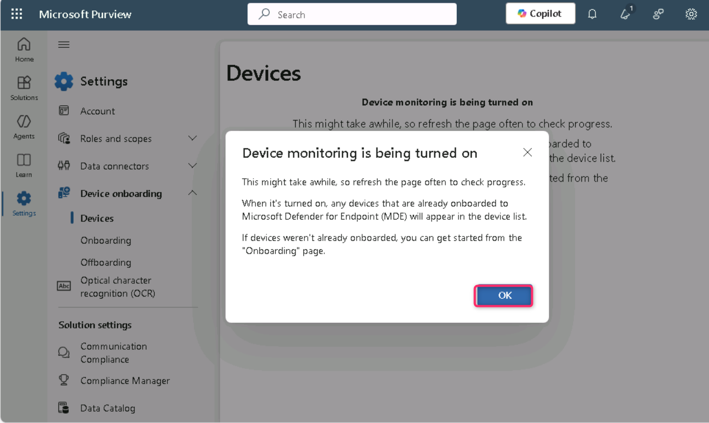

19. Espere unos minutos y luego actualice la página.

> 
>
> 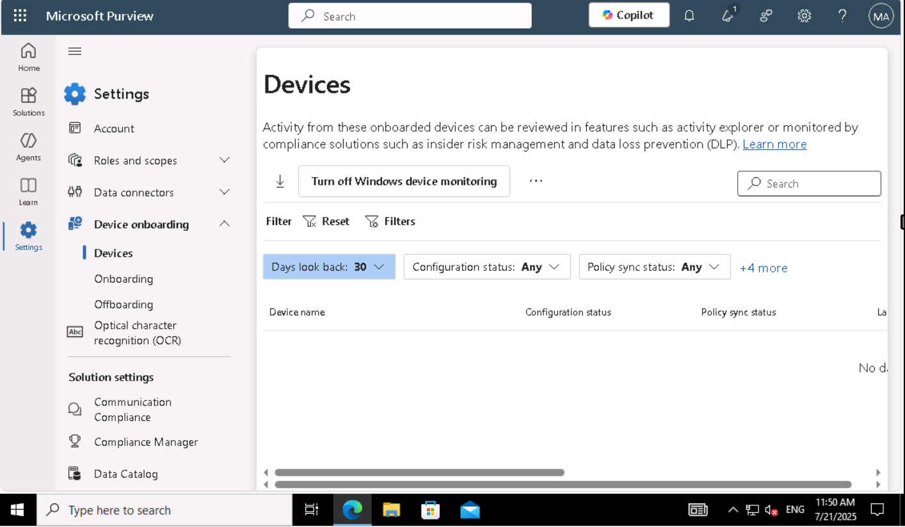

20. Desde **Settings \> Device onboarding \> Onboarding**, haga clic en **Download package**.

> 

21. Una vez descargado, copie el archivo al escritorio. Haga clic derecho sobre el archivo y seleccione **Extract all…**, luego haga clic en **Extract**.

> 
>
> 
>
> 

22. Una vez extraído, abra la carpeta y ejecute el archivo **con derechos de administrador**.

> 

23. Si aparece el mensaje **Search for app in the Store?**, haga clic en **Yes**; si no aparece, ignore.

24. En el mensaje **The publisher could not be verified. Are you sure you want to run this software?**, haga clic en **Run**.

> 

25. Si aparece el mensaje **User Account Control**, haga clic en **Yes**.

> 

26. En la ventana de **Command Prompt**, presione **Y** y luego presione **Enter** para confirmar.\
    Aparecerá un mensaje indicando que el dispositivo está incorporado.\
    Cuando vea el mensaje **Press any key to continue...**, presione cualquier tecla.

> 

27. Después de cerrarse la ventana, abra **Command Prompt** como administrador: escriba *cmd* en la búsqueda de Windows, haga clic derecho en **Command Prompt** y seleccione **Run as administrator**.

> 

28. En el mensaje **User Account Control**, haga clic en **Yes**.

> 

29. Ejecute la prueba de detección ingresando el siguiente comando (la ventana se cerrará automáticamente):

> powershell.exe -NoExit -ExecutionPolicy Bypass -WindowStyle Hidden \$ErrorActionPreference= 'silentlycontinue';(New-ObjectSystem.Net.WebClient).DownloadFile('http://127.0.0.1/1.exe','C:\test-WDATP-test\invoice.exe');Start-Process 'C:\test-WDATP-test\invoice.exe'
>
> 

30. Cierre la conexión de la máquina virtual.

31. Abra **Settings** en el portal y seleccione **Devices Onboarding \> Devices**.

> **Nota:** Aunque usualmente toma 60 segundos habilitar el onboarding, puede tardar hasta 30 minutos.

32. Será posible verificar la lista **Devices**. La lista permanecerá vacía hasta que se incorporen los dispositivos; una vez completado el proceso, será posible ver las máquinas virtuales en la lista como dispositivos incorporados.

**Tarea 1 – Crear una directiva para toda la organización para detectar y puntuar el uso riesgoso del navegador**

**Paso 1 – Crear una nueva directiva**

1.  En el portal de **Microsoft Purview**, seleccione **Solutions**, luego seleccione **Insider Risk Management**.

> 

2.  Seleccione **Policies**. En la página **Policies**, seleccione **+Create policy \> Custom policy**.

> 

3.  En la página **Choose a policy template**, seleccione **Risky browser usage (preview)**, bajo **Risky browser usage (preview)**.

> 

4.  Revise todos los requisitos previos.

> 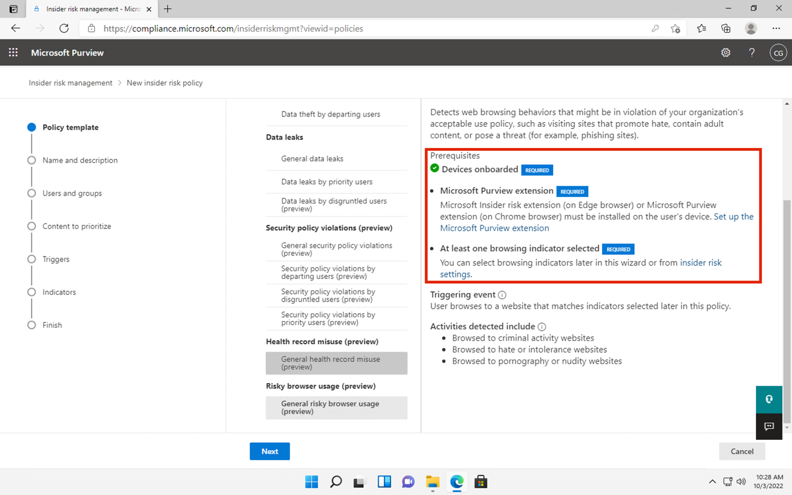

5.  Seleccione **Next** para continuar.

> 

6.  En la página **Name and description**, complete los siguientes campos:

    - Name: Risky usage of browser

    - Description: This is a test policy for the risky browser usage

7.  Seleccione **Next** para continuar.

> 

8.  En la página **Choose users, groups, & adaptive scopes**, seleccione **All users, groups, & adaptive scopes**. Seleccione **Next** para continuar.

> 

9.  En la página **Exclude users and groups**, seleccione **Next**.

> 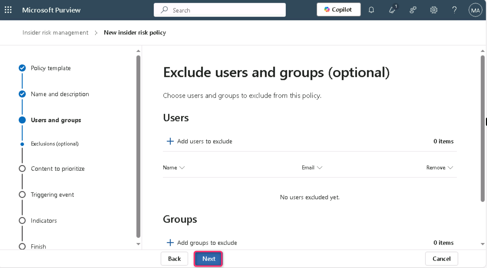

10. En la página **Decide whether to prioritize**, seleccione **I don't want to priority content right now**. Luego, seleccione **Next** para continuar.

> 

11. En la página **Choose triggering event for this policy**, seleccione el botón **Turn on indicators**.

> 

12. En el cuadro de diálogo **Turn on indicators for your organization**, desplácese hacia abajo y seleccione **Choose indicators to turn on**.

> 
>
> 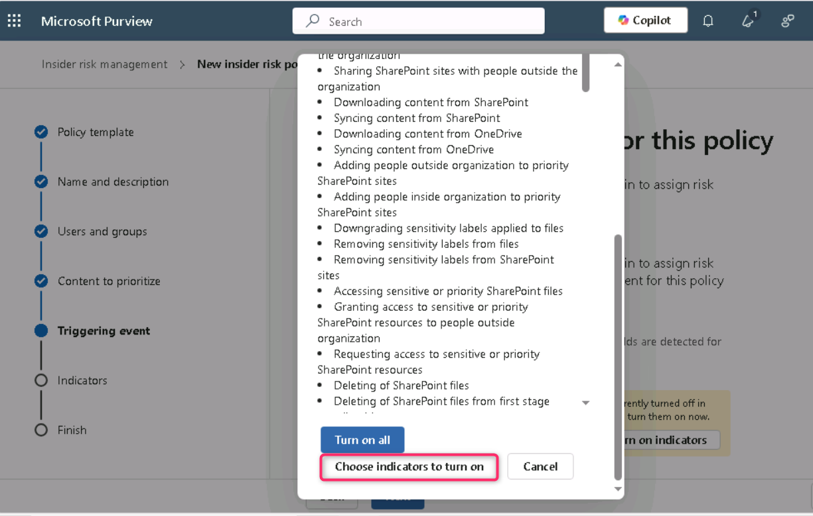

13. En el cuadro de diálogo **Choose indicators to turn on**, asegúrese de que, bajo **Risky browsing indicators (preview)**, todos los indicadores estén seleccionados.

> 
>
> 

14. Desplácese hacia abajo y seleccione **Save**.

15. En la página **Choose triggering event for this policy**, asegúrese de que esté seleccionada la opción **User browsed to a potentially risky website**. Bajo **Select which activities will trigger this policy**, seleccione todas las opciones y luego seleccione **Next**.

> 

16. En la página **Choose thresholds for triggering events**, seleccione la opción **Choose your own thresholds**, cambie todos los umbrales a **1 per day** y luego seleccione **Next.**

> 
>
> 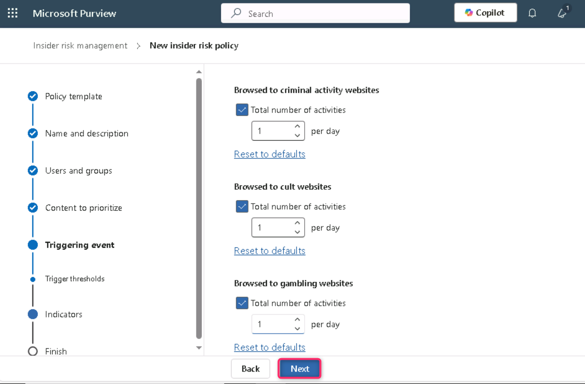

17. En la página **Indicators**, seleccione **Next**.

> 

18. En la página **Choose threshold type for indicators**, asegúrese de que esté seleccionada **Apply thresholds provided by Microsoft**, luego seleccione **Next**.

> 

19. En la página **Review settings and finish**, seleccione **Submit**.

> 

20. En la página **Your policy was created**, seleccione **Done**.

> 

21. Mantenga la pestaña abierta y continúe con la siguiente tarea.

**Paso 2 – Puntuar la directiva**

1.  Seleccione la nueva directiva denominada **Risky usage of browser**. Seleccione **Start scoring activity for users**.

> 

2.  En el campo **Reason for scoring activity**, ingrese *Testing the policy*. En el campo **Scoring activity for this many days (between 5 and 30)**, seleccione *10 days*.

> 

3.  En el campo **Score activity for these users**, escriba **MOD** y seleccione **MOD administrator**.

> 

4.  Seleccione **Start scoring activity**.

> 

5.  Seleccione **Close**.

> 

**Tarea 2 – Robo de datos por usuarios que están por salir**

**Paso 1 – Crear una nueva directiva**

1.  En la página **Policies**, seleccione **+ Create policy** y luego **Custom policy**.

> 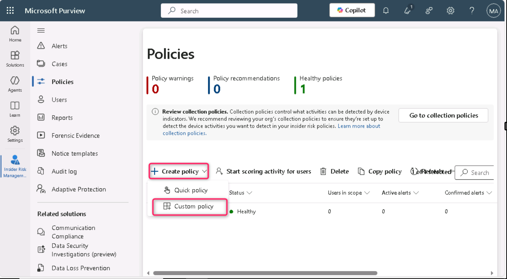

2.  En la página **Choose a policy template**, seleccione **Data theft by departing users** en la sección *Data theft*. Seleccione **Next**.

> 

3.  En la página **Name and description**, complete los siguientes campos:

    - Name: Data theft by a user

    - Description: This is a test policy for preventing data theft

4.  Seleccione **Next**.

> 

5.  En **Choose users, groups, & adaptive scopes**, seleccione \*\***All users, groups, and adaptive scopes\*\***, luego seleccione **Next**.

\

6.  En **Exclude users and groups (optional)**, seleccione **Next**.

\

6.  En **Decide whether to prioritize content**, seleccione **I want to prioritize content**. Seleccione únicamente las casillas **Sensitivity labels** y **Sensitive info types**. Seleccione **Next**.

> 

7.  En **Sensitivity labels to prioritize**, seleccione **Add or edit sensitivity labels**. En el buscador, escriba *employee* y presione **Enter**. Seleccione **Internal/Employee data (HR)** y luego **Add**. Seleccione **Next**.

> 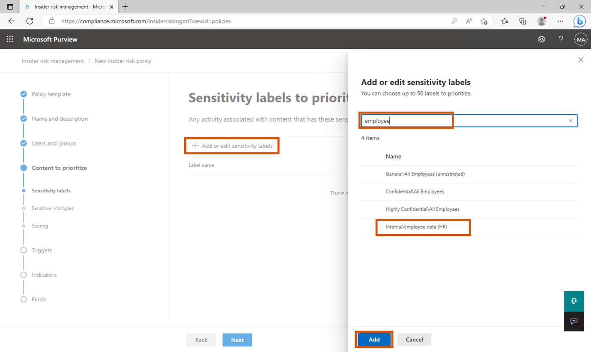

8.  En **Sensitive info types to prioritize**, seleccione **Add or edit sensitive info types**. Busque y seleccione **Credit Card Number**, **Contoso Employee ID** y **Contoso Employee EDM**. Seleccione **Add**, luego **Next**.

> 

9.  En **Decide whether to score only activity with priority content**, asegúrese de que **Get alerts for all activity** esté seleccionado. Seleccione **Next**.

> 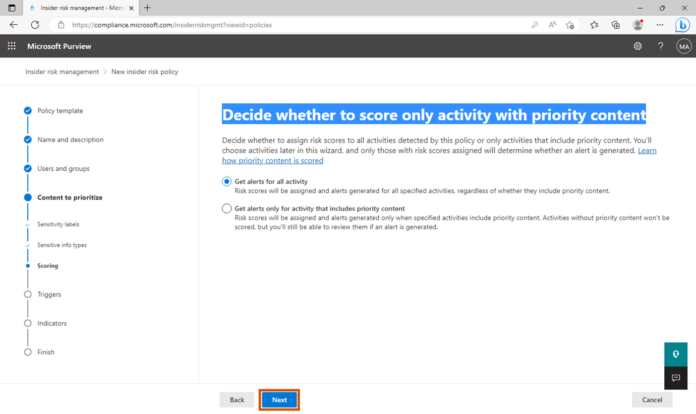

10. En **Choose triggering event for this policy**, mantenga la selección predeterminada y seleccione **Next**.

> 

11. En la página **Indicators**, abra el menú desplegable de **Office indicators (31/31 selected)**.

> 

12. Verifique que todos los indicadores de Office estén seleccionados y seleccione **Next**.

> 

13. En **Detection options**, mantenga todas las opciones en su estado predeterminado y seleccione **Next**.

> 

14. En **Choose threshold type for indicators**, seleccione **Choose your own thresholds**. Luego, desplácese hacia abajo y abra el menú **Office indicators**.

> 
>
> 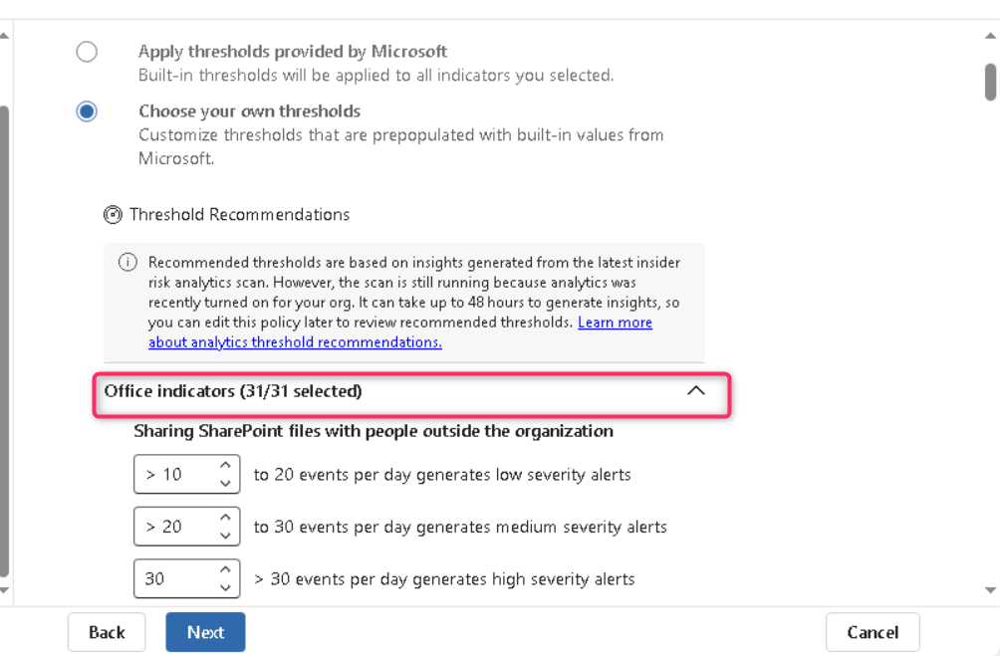

15. En **Sharing SharePoint files with people outside the organization**, configure los umbrales en **1**, **2** y **3** eventos para cada etapa, respectivamente. Seleccione **Next**.

> 

16. En **Review settings and finish**, seleccione **Submit**.

> 

17. En **Your policy was created**, seleccione **Done**.

> 

**Paso 2 – Calificar la directiva**

1.  Seleccione la nueva directiva denominada **Data theft by a user**. Seleccione **Start scoring activity for users**.

> 

2.  En el campo **Reason for scoring activity**, escriba *Testing the policy*. En **Scoring activity for this many days (between 5 and 30)**, seleccione **10 days**.

> 

3.  En el campo **Score activity for these users**, escriba **MOD** y seleccione **MOD Administrator**.

> 

4.  Luego, haga clic en el botón **Start scoring activity**.

> 

5.  Haga clic en el botón **Close**.

> 

**Tarea 3 – Fugas de datos por usuarios**

**Paso 1 – Crear una nueva política**

1.  En la página **Policies**, haga clic en **+ Create policy** y luego seleccione **Custom policy**.

> 

2.  En la página **Choose a policy template**, elija **Data leaks** dentro de **Data leaks**. Seleccione **Next** para continuar.

> 

3.  En la página **Name and description**, complete los siguientes campos:

    - Name: Data leaks by a user

    - Description: This is a test policy for preventing data leaks

4.  Seleccione **Next** para continuar.

> 

5.  En la página **Choose users, groups, & adaptive scopes**, asegúrese de que el botón de opción **All users, groups, and adaptive scopes** esté seleccionado. Luego, haga clic en **Next** para continuar.

> 
>
> En la página **Exclude users and groups (optional)**, haga clic en **Next**.

6.  En la página **Decide whether to prioritize**, seleccione **I want to priority content**. Marque las casillas **SharePoint sites**, **Sensitivity labels** y **Sensitive info types**. Haga clic en **Next**.

> 

7.  En la página **SharePoint sites to prioritize**, seleccione **Add or edit SharePoint sites**. En el panel lateral, escriba, https://WWLxXXXXXX.sharepoint.com/sites/ContosoWeb1, luego seleccione la casilla junto a **Contoso Web 1** y haga clic en **Add**. Después, haga clic en **Next**.

> **Nota:** XXXXXX **Tenant Prefix** está disponible en la pestaña **Resources.**
>
> 
>
> 
>
> 

8.  En la página **Sensitivity labels to prioritize**, seleccione **Add or edit sensitivity labels**. En el panel lateral, escriba **employee**, luego seleccione la casilla **Internal/Employee data (HR)** y haga clic en **Add**. Después, haga clic en **Next.**

> 
>
> 

9.  En la página **Sensitive info types to prioritize**, seleccione **Add or edit sensitive info types**. En el panel lateral, busque y seleccione **Credit Card Number**, **Contoso Employee ID** y **Contoso Employee EDM**. Seleccione **Add** y luego haga clic en **Next**.

\

11. En la página **Decide whether to score only activity with priority content**, seleccione **Get alerts for all activity** y haga clic en **Next**.

> 

12. En la página **Choose triggering event for this policy**, asegúrese de que el botón de opción **User performs an exfiltration activity** esté seleccionado. Bajo **Select which activities will trigger this policy**, seleccione:

- **Download content from SharePoint**

- **Sending email with attachments to recipients outside the organization**

- **Sharing SharePoint files with people outside the organization\**
  Luego, haga clic en **Next**

> 
>
> 

13. En la página **Choose thresholds for triggering events**, seleccione el botón de opción **Choose your own thresholds**. Establezca cada umbral en **1** y haga clic en **Next**.

> 
>
> 

14. Mantenga la configuración predeterminada en la página **Indicators** y seleccione **Next**.

> 

15. Mantenga la configuración predeterminada en la página **Detection options** y seleccione **Next**.

> 

16. En la página **Choose threshold type for indicators**, asegúrese de que el botón de opción **Choose your own thresholds** esté seleccionado. Luego, en **Office indicators**, use **1, 2 y 3 eventos** para cada etapa respectivamente y seleccione **Next**.

> 
>
> 
>
> 

17. En **Review settings and finish**, seleccione **Submit**.

> 

18. En **Your policy was created**, seleccione **Done**.

> 

**Paso 2 – Puntuar la política**

1.  En la página **Policies**, seleccione la casilla junto a la nueva política llamada **Data leaks by a user**. Luego, seleccione **Start scoring activity for users**.

> 

2.  En el campo **Reason for scoring activity**, escriba **Testing the policy**. En el campo **Scoring activity for this many days (between 5 and 30)**, seleccione **10 days**. En el campo **Score activity for these users**, escriba **MOD** y luego seleccione **MOD administrator**.

> 
>
> 

3.  Luego, haga clic en el botón **Start scoring activity**.

> 

4.  Haga clic en el botón **Close**.

> 

**Resumen:**

En este laboratorio, primero preparó el entorno sincronizando los relojes de las VM y registrando los usuarios y dispositivos requeridos para **Insider Risk Management** en **Microsoft Purview**. Habilitó insights de análisis y verificó la versión del cliente antimalware de **Defender** en todas las VM objetivo. Después de registrar los dispositivos, creó tres políticas diferentes de **Insider Risk Management** para monitorear y puntuar actividades relacionadas con el uso arriesgado del navegador, el posible robo de datos por usuarios que abandonan la organización y las fugas de datos por usuarios internos. Cada política se personalizó con etiquetas de sensibilidad, sitios de **SharePoint** y tipos de información sensible como contenido prioritario, y se configuraron umbrales para activar alertas y puntuaciones. Finalmente, inició las actividades de puntuación para simular escenarios reales de riesgo interno y evaluar la efectividad de las políticas configuradas.
