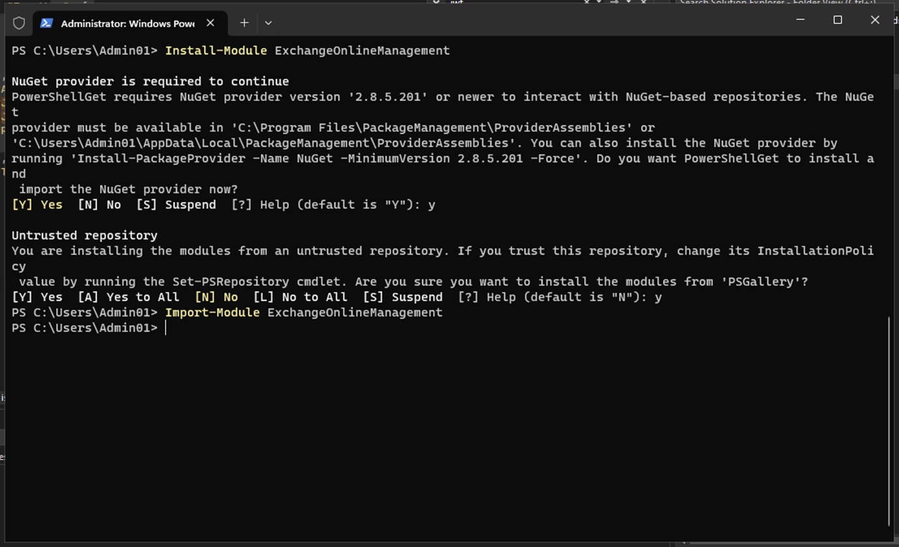
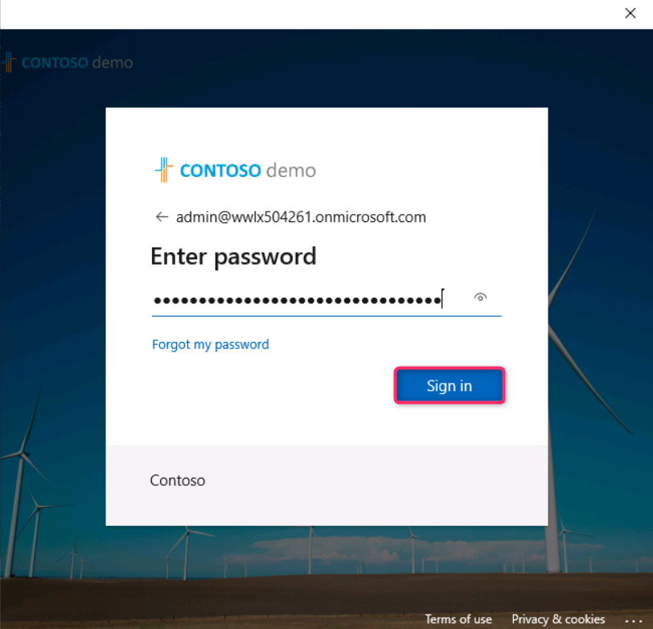
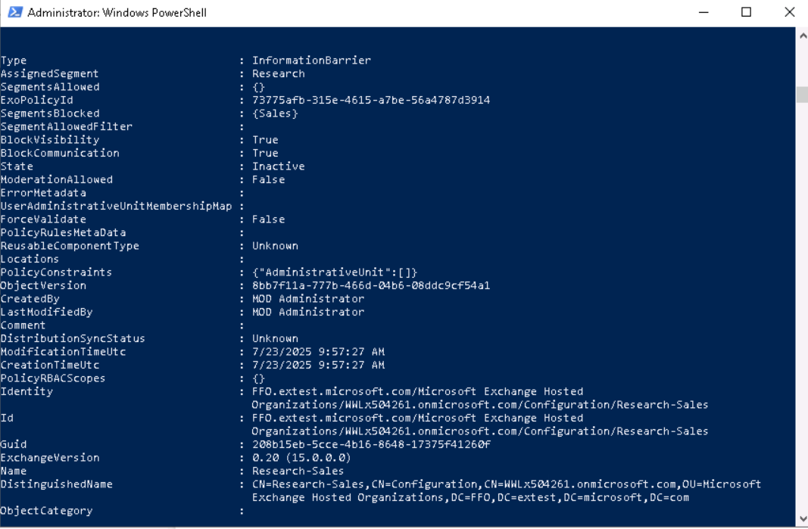
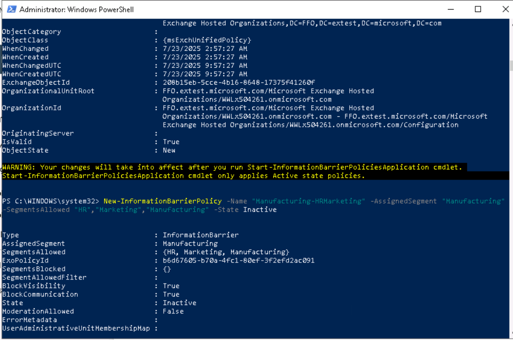
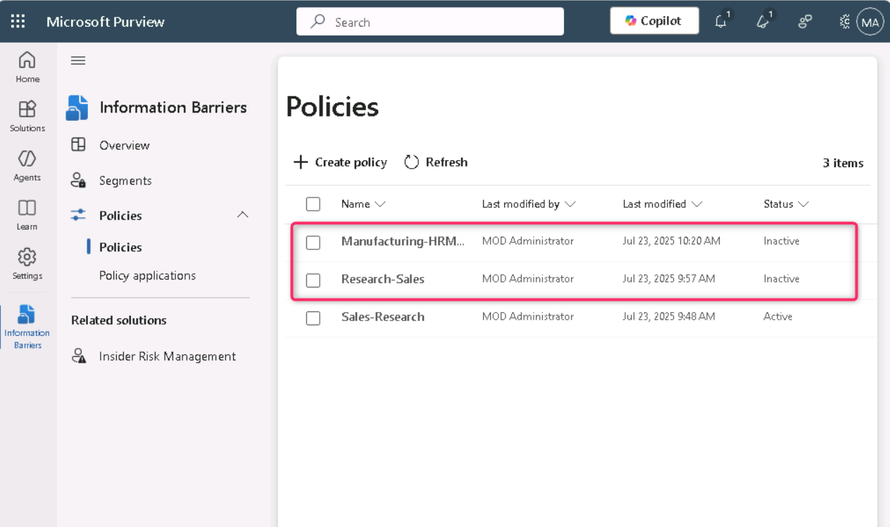

**Laboratorio 8 – Configurar las Information Barriers**

**Introducción**

Contoso cuenta con cinco departamentos: **HR**, **Sales**, **Marketing**, **Research** y **Manufacturing**. Para cumplir con las regulaciones de la industria, los usuarios de algunos departamentos no deben comunicarse con otros departamentos, según se muestra en la siguiente tabla:

| **Segmento** | **Puede comunicarse con** | **No puede comunicarse con** |
|----|----|----|
| HR | Todos | (sin restricciones) |
| Sales | HR, Marketing Manufacturing | Research |
| Marketing | Todos | (sin restricciones) |
| Research | HR, Marketing, Manufacturing | Sales |
| Manufacturing | HR, Marketing | Cualquier otro que no sea HR o Marketing |

Para esta estructura, el plan de Contoso incluye tres políticas de **IB**:

1.  Una política de IB diseñada para evitar que Sales se comunique con Research.

2.  Otra política de IB para evitar que Research se comunique con Sales.

3.  Una política de IB diseñada para permitir que Manufacturing se comunique únicamente con HR y Marketing.

**Objetivos**

- Configurar segmentos de la organización mediante PowerShell para la implementación de **Information Barriers** (IB).

- Habilitar la búsqueda de directorio delimitada en **Microsoft Teams** para aplicar la visibilidad de usuarios según segmentos.

- Crear políticas de **Information Barrier (IB)** mediante el portal de **Microsoft Purview** y PowerShell para controlar la comunicación entre segmentos.

**Ejercicio 1 – Prerrequisitos**

**Tarea 1 – Crear un segmento para los usuarios de su organización**

1.  Haga clic derecho en el ícono de **Windows**, luego navegue y haga clic en **Windows PowerShell (Admin)**. 

> 

2.  En el cuadro de diálogo **User Account Control**, haga clic en el botón **Yes**.

> 

3.  Ejecute lo siguiente:

> Install-Module ExchangeOnlineManagement

4.  Si se le solicita ‘**Do you want PowerShellGet to install and import the NuGet provider now?**’ y ‘**Are you sure you want to install the modules from 'PSGallery'?**’ escriba **y** y presione **Enter**.

> 

5.  Ejecute el siguiente comando:

> Import-Module ExchangeOnlineManagement
>
> 

6.  Ahora ejecute el siguiente comando para conectarse a **Exchange Online**.

> Connect-IPPSSession
>
> 

7.  Inicie sesión usando las credenciales de **MOD Administrator** proporcionadas en la página principal del entorno del laboratorio.

> **Nota**: En caso de que aparezca el cuadro de diálogo, **Automatically sign in to all desktop apps and websites on this device?** haga clic en **No, this app only**.
>
> 
>
> 

8.  Ejecute los siguientes comandos uno por uno en **PowerShell** para crear la estructura de la organización.

> New-OrganizationSegment -Name "HR" -UserGroupFilter "Department -eq 'HR'"
>
> 
>
> New-OrganizationSegment -Name "Sales" -UserGroupFilter "Department -eq 'Sales'"
>
> New-OrganizationSegment -Name "Marketing" -UserGroupFilter "Department -eq 'Marketing'"
>
> New-OrganizationSegment -Name "Research" -UserGroupFilter "Department -eq 'Research'"
>
> New-OrganizationSegment -Name "Manufacturing" -UserGroupFilter "Department -eq 'Manufacturing'"

**Tarea 2 – Habilitar la búsqueda de directorio delimitada en Microsoft Teams**

Para activar la búsqueda por nombre:

1.  Vaya al **Microsoft Teams admin center** en https://admin.teams.microsoft.com, seleccione **Teams** \> **Teams settings**.

> 

2.  En **Search by name**, junto a **Scope directory search using an Exchange address book policy**, active el interruptor (**On**). Seleccione **Save**.

> 

3.  Si aparece el cuadro de diálogo **Changes might take some time to take effect**, haga clic en el botón **Confirm**.

> 

**Ejercicio 2 – Crear políticas de IB**

**Tarea 1 – Bloquear comunicaciones entre segmentos**

1.  En el portal de **Microsoft Purview**, haga clic en **Solutions \> Information barriers**.

> 

2.  En el panel **Information Barriers**, haga clic en **Policies**, luego seleccione **Policies**. En la página **Policies**, seleccione **+ Create policy** para crear y configurar una nueva política de IB.

> 

3.  En la página **Provide a policy name**, en el campo **Name**, escriba el nombre de la política—Sales-Research. Luego, seleccione **Next**.

> 

4.  En la página **Add assigned segment details**, seleccione **Choose segment**. En el panel **Select assigned segment for this policy**, seleccione **Sales**. Ahora seleccione **Add** para agregar el segmento a la política. Solo puede seleccionar un segmento.

> 

5.  Seleccione **Next**.

> 

6.  En la página **Configure Communication and collaboration details**, seleccione **Block**. Luego seleccione **Choose segment**, **Research** y **Add**.

> 
>
> 

7.  Luego, haga clic en el botón **Next**.

> 

8.  En la página **Configure Policy status**, active el estado de la política con el interruptor **On**. Seleccione **Next** para continuar.

> 

9.  En la página **Review your settings**, revise la configuración seleccionada para la política y cualquier sugerencia o advertencia. Seleccione **Submit** para crear la política.

> 

10. Una vez creada la política, seleccione **Done**.

> 

11. La política **Sales-Research IB Policy** se creó correctamente.

> 

**Tarea 2 – Crear políticas de IB mediante PowerShell**

1.  Regrese a **Administrator: Windows PowerShell** y ejecute el siguiente comando:

> Import-Module ExchangeOnlineManagement
>
> 

2.  Ahora ejecute el siguiente comando para conectarse a **Exchange Online**:

> Connect-IPPSSession
>
> 

3.  Inicie sesión usando las credenciales de **MOD Administrator** proporcionadas en la página principal del entorno del laboratorio.

> **Nota:** En caso de que aparezca el cuadro de diálogo **“Automatically sign in to all desktop apps and websites on this device?”,** haga clic en **No, this app only.**
>
> 
>
> 

4.  Ejecute el siguiente comando para crear una política de IB llamada **Research-Sales**. Cuando esta política esté activa y aplicada, evitará que los usuarios del segmento **Research** se comuniquen con los usuarios del segmento **Sales**:

> New-InformationBarrierPolicy -Name "Research-Sales" -AssignedSegment "Research" -SegmentsBlocked "Sales" -State Inactive
>
> 
>
> 

5.  Ejecute el siguiente comando para crear una política de IB llamada **Manufacturing-HRMarketing**. Cuando esta política esté activa y aplicada, **Manufacturing** podrá comunicarse solo con **HR** y **Marketing**. **HR** y **Marketing** no tienen restricciones para comunicarse con otros segmentos:

> New-InformationBarrierPolicy -Name "Manufacturing-HRMarketing" -AssignedSegment "Manufacturing" -SegmentsAllowed "HR","Marketing","Manufacturing" -State Inactive
>
> 
>
> 

6.  Regrese al portal de **Microsoft Purview**, actualice la página **Information Barriers – Policies**, y podrá ver las políticas creadas mediante PowerShell.

> 

**Resumen**

En este laboratorio, creó segmentos organizacionales (**HR**, **Sales**, **Marketing**, **Research** y **Manufacturing**) utilizando PowerShell y habilitó la búsqueda de directorio delimitada en **Microsoft Teams** para alinear la visibilidad de usuarios con las restricciones por segmentos. Luego configuró políticas de **Information Barriers** en **Microsoft Purview** para bloquear o permitir comunicaciones entre segmentos específicos (por ejemplo, bloquear la comunicación de **Sales** hacia **Research**). Estas políticas se crearon tanto desde el portal como mediante PowerShell para brindar práctica práctica en ambos métodos.
