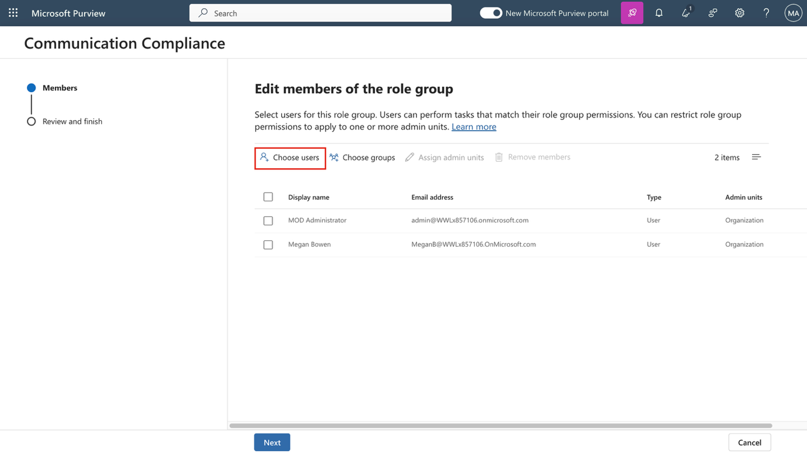
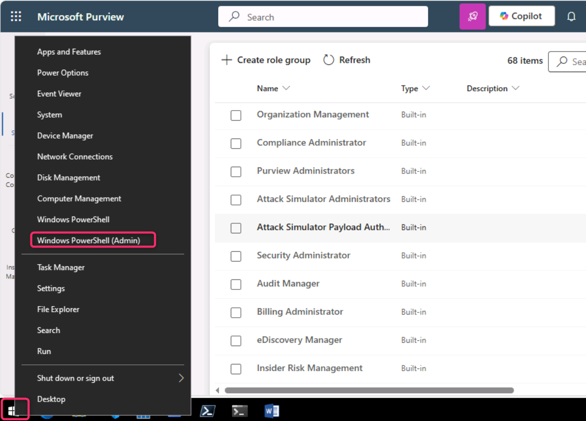
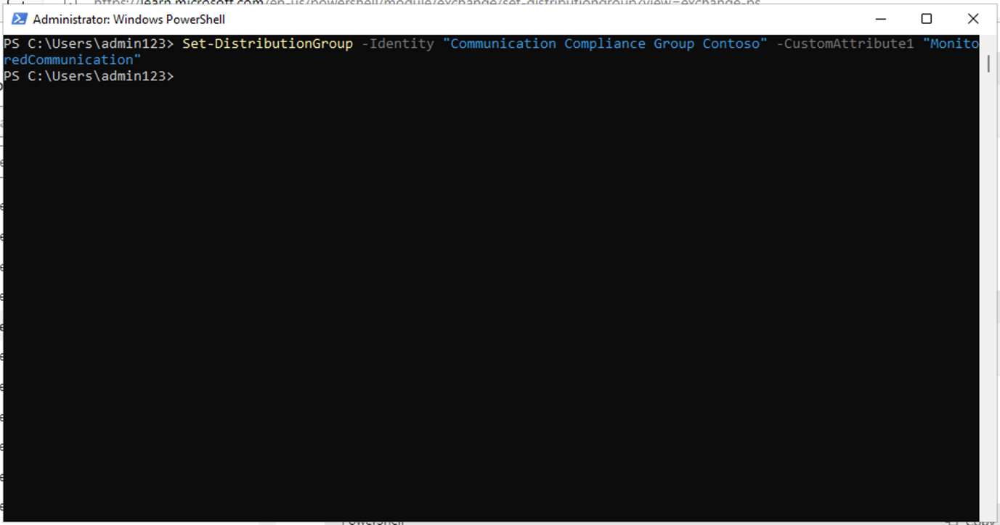
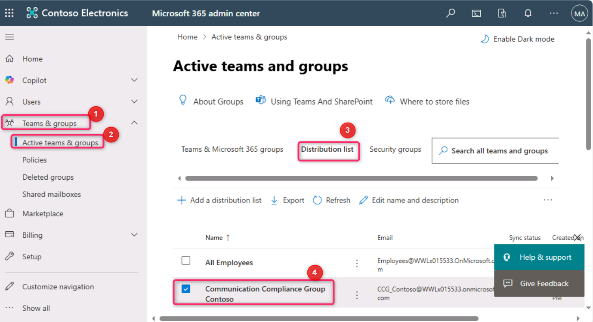
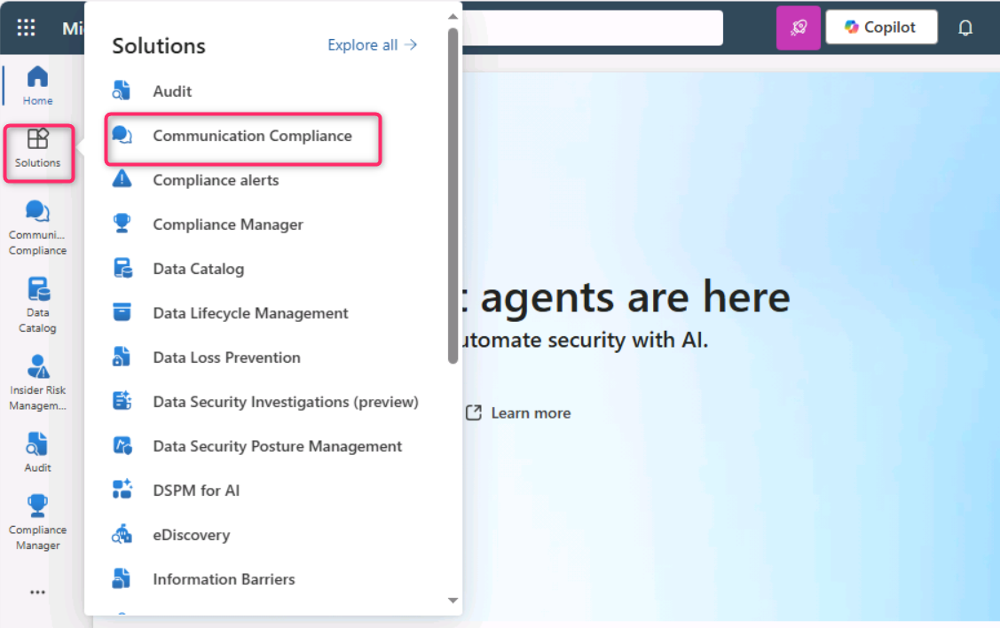
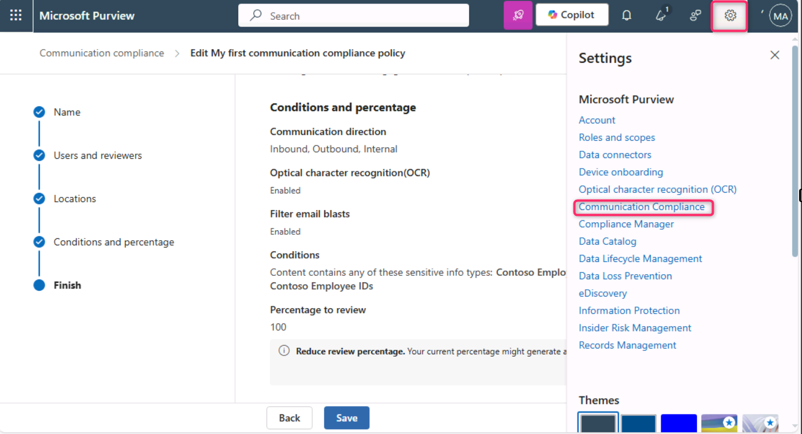

**Laboratorio 9 – Configurar Communication Compliance**

**Introducción**

En este laboratorio, configurará una política de cumplimiento para detectar cualquier información confidencial que esté siendo comunicada por los usuarios de su organización. Utilizará los tipos de información sensible creados en el laboratorio anterior para detectar datos de salud de empleados o IDs de empleados que se envíen a través de correos electrónicos.

**Objetivos**

- Asignar roles para el acceso a **Communication Compliance** dentro de **Microsoft Purview**.

- Crear grupos de distribución mediante **PowerShell**.

- Configurar y editar políticas de **Communication Compliance**.

- Habilitar la anonimización y las notificaciones a usuarios.

- Comprender el proceso de prueba de la política.

**Ejercicio 1 – Habilitar permisos para Communication Compliance**

En esta tarea asignará usuarios a grupos de roles específicos para segmentar el acceso y las responsabilidades de **Communication Compliance** entre distintos usuarios de su organización.

1.  En el menú de navegación, seleccione **Settings**, luego **Roles and scopes**. Navegue y haga clic en **Role groups.**

> 

2.  Desplácese hacia abajo y seleccione la casilla junto a **Communication Compliance**. Luego, haga clic en el ícono de lápiz para **Edit**.

> 

3.  En **Edit members of the role group**, seleccione **Choose Users**.

> 

4.  Asegúrese de seleccionar **MOD Administrator**, **Megan Bowen** y **Patti Fernandez**. Luego elija **Select**.

> 

5.  Seleccione **Next**.

> 

6.  Seleccione **Save** para agregar los usuarios al grupo de roles. Seleccione **Done** para completar los pasos.

> 
>
> 

**Ejercicio 2 – Configurar grupos para Communication Compliance**

En la política, utilizará direcciones de correo electrónico para identificar individuos o grupos de personas. Para simplificar la configuración, puede crear grupos para quienes tendrán su comunicación revisada y grupos para quienes revisarán dichas comunicaciones.

Es posible usar **PowerShell** para configurar un grupo de distribución destinado a una política global de **Communication Compliance**, permitiendo detectar mensajes de miles de usuarios con una sola política y mantenerla actualizada conforme ingresan nuevos empleados a la organización.

1.  Haga clic derecho en el ícono de **Windows**, luego navegue y seleccione **Windows PowerShell (Admin).**

> 

2.  En el cuadro de diálogo **User Account Control**, seleccione **Yes**.

> 

3.  Ingrese el siguiente cmdlet para usar el módulo de **Exchange Online PowerShell** y conectarse a su tenant:

> Connect-ExchangeOnline
>
> 

4.  Cuando aparezca la ventana **Sign in**, inicie sesión como **MOD Administrator**.\
    Si aparece el cuadro **Automatically sign in to all desktop apps and websites on this device?**, seleccione **No, this app only**.

> 
>
> 

5.  Cree un grupo de distribución dedicado para la política global de Communication Compliance con las siguientes propiedades:

    - **MemberDepartRestriction = Closed**. Impide que los usuarios se eliminen a sí mismos del grupo..

    - **MemberJoinRestriction = Closed**. Impide que los usuarios se agreguen a sí mismos.

    - **ModerationEnabled = True**. Garantiza que todos los mensajes enviados al grupo estén sujetos a aprobación y que el grupo no se utilice fuera de la configuración de Communication Compliance.\
      \
      Ejecute:

> New-DistributionGroup -Name "Communication Compliance Group Contoso" -Alias "CCG_Contoso" -MemberDepartRestriction 'Closed' -MemberJoinRestriction 'Closed' -ModerationEnabled \$true

6.  

7.  **Nota:** Puede agregar un **Exchange Custom Attribute** para realizar seguimiento de los usuarios agregados a la política**.**

8.  Set-DistributionGroup -Identity "Communication Compliance Group Contoso" -CustomAttribute1 "MonitoredCommunication"

9.  

10. Ejecute el siguiente script de PowerShell periódicamente para agregar usuarios a la política de Communication Compliance:

11. \$Mbx = (Get-Mailbox -RecipientTypeDetails UserMailbox -ResultSize Unlimited -Filter {CustomAttribute9 -eq \$Null})

12. \$i = 0

13. ForEach (\$M in \$Mbx)

14. {

15. Write-Host "Adding" \$M.DisplayName

16. Add-DistributionGroupMember -Identity "Communication Compliance Group Contoso" -Member \$M.DistinguishedName -ErrorAction SilentlyContinue

17. Set-Mailbox -Identity \$M.Alias -CustomAttribute1 "MonitoredCommunication"

18. \$i++

19. }

20. Write-Host \$i "Mailboxes added to supervisory review distribution group."

> 

21. Una vez que se muestre la salida del script, abra una nueva pestaña e ingrese: https://admin.cloud.microsoft/ para abrir **Microsoft 365 admin center**.

> Si se solicita configurar autenticación multifactor, seleccione **Skip for now**.

22. En la página de **Microsoft 365 admin center**, navegue y haga clic en:\
    **Teams & groups \> Active teams & groups \> Distribution list \> Communication Compliance Group Contoso**.\*\*

> 

23. En el panel **Communication Compliance** que aparece en el lado derecho, haga clic en la pestaña **Members**, desplácese hacia abajo y revise todos los miembros del grupo de lista de distribución.

\

\

**Ejercicio 3 – Crear una política de Communication Compliance**

1.  En el portal de **Microsoft Purview**, seleccione **Solutions \> Communication Compliance**.

> 

2.  En el panel **Communication Compliance**, navegue y haga clic en **Policies**. Luego, en la página **Policies**, seleccione **+ Create policy** y haga clic en **Custom policy**.

> 

3.  En el campo **Name**, escriba My first communication compliance policy. En el campo **Description**, escriba This is a policy to test communication compliance. Seleccione **Next**.

> 

4.  En la página **Choose users and reviewers**, desplácese hasta la sección **Reviewers**, escriba y seleccione **Patti Fernandez**. Luego, haga clic en el botón **Next**.

> 

5.  En la página **Choose locations to detect communications**, asegúrese de que todas las casillas bajo **Microsoft 365 locations** estén seleccionadas y haga clic en **Next**.

> 

6.  En **Choose conditions and review percentage**, desplácese hacia abajo y seleccione **Add condition**, luego elija **Content contains sensitive info types**.

> 

7.  En el cuadro **Content contains any of these sensitive info types**, seleccione **Add**, haga clic en **Sensitive info types** y busque **contoso**. Marque todas las casillas de los tipos de información sensible creados en laboratorios anteriores. Luego seleccione **Add**.

> 

8.  Desplácese hacia abajo y seleccione la casilla **Use OCR to extract text from images**, luego establezca **Review percentage** en **100%** y haga clic en **Next**.

> 

9.  En la página **Review and finish**, seleccione **Create policy**.

> 

10. Se mostrará la página **Your policy was created,** con indicaciones sobre cuándo se activará la política y qué comunicaciones se capturarán. Haga clic en **Done**.

> 

**Ejercicio 4 – Editar una política de Communication Compliance**

1.  En la página **Communication Compliance – Policies**, haga clic en la **ellipsis** junto a **My first communication compliance policy**, luego navegue y seleccione **Edit**.

> **Nota:** Si no ve la política, actualice la página**.**
>
> 

2.  Mantenga el **Name** y la descripción de la política tal como estaban configurados previamente, luego haga clic en **Next**.

> 

3.  En la página **Choose users and reviewers**, navegue y seleccione el botón de opción **Select users**.

> 

4.  En **Start typing to find users or groups**, busque **Communication** y seleccione **Communication Compliance Groups Contoso**.

> 

5.  En la sección **Reviewers**, escriba y seleccione **MOD Administrator**. Seleccione **Next** hasta llegar a la página **Review and finish**.

> 

6.  Finalmente, haga clic en **Save**.

> 

**Ejercicio 5 – Crear plantillas de aviso y configurar la anonimización de usuarios**

1.  En el portal de **Microsoft Purview**, seleccione **Settings** en la parte superior derecha, luego navegue y seleccione **Communication Compliance**.

> 

2.  En la página **Communication Compliance settings – Privacy**, para habilitar la anonimización, asegúrese de que el botón de opción **Show anonymized versions of usernames** esté seleccionado. Luego, haga clic en **Save**.

> **Nota:** Si el botón **Save** no está habilitado, seleccione otra opción temporalmente y luego vuelva a seleccionar **Show anonymized versions of usernames.**
>
> 

3.  Seleccione **Notice templates** y haga clic en el símbolo **+** para crear una nueva plantilla de aviso.

> 

4.  En la página **Create a notice template**, complete los siguientes campos:

    - Template name: Sample Notice

    - Send from: Seleccione **Patti Fernandez** escribiendo *Patti* y seleccionando el nombre en la lista desplegable.

    - Cc: Seleccione **MOD Administrator** escribiendo *MOD* y eligiendo el nombre en la lista.

    - Línea de asunto: Your communication violates company Communication compliance policy.

    - Cuerpo del mensaje: Please note this for future reference and provide an acceptable justification for your current communication.

5.  Seleccione **Create** para crear y guardar la plantilla de aviso.

> 

**Ejercicio 6 – Probar la directiva de Communication Compliance**

En la cuenta de prueba no se tendrá el privilegio de enviar correos electrónicos, pero se pueden revisar los siguientes pasos para comprender cómo probar la directiva cuando se cuente con licencias propias. Es posible ejecutar los pasos, pero el correo no llegará al destinatario desde el tenant actual.

1.  **Abra** una nueva ventana **InPrivate**, abra Outlook ingresando la siguiente URL en la barra de direcciones: https://outlook.office365.com/mail/. Luego, **inicie sesión** con el nombre de usuario adelev@WWLxXXXXXX.onmicrosoft.com y la contraseña proporcionada en la pestaña **Resources**.

2.  **Envíe** un correo electrónico a su cuenta de correo personal con el siguiente contenido:

> Línea de asunto: Patti Fernandez (EMP123456) on Medical Leave Due to Flu
>
> Cuerpo del mensaje: Employee Patti Fernandez EMP123456 is on absence because of the flu/influenza
>
> 
>
> **Nota:** El procesamiento completo de los mensajes de correo electrónico en una directiva puede tardar aproximadamente 24 horas. Las comunicaciones en Microsoft Teams, Yammer y plataformas de terceros pueden tardar aproximadamente 48 horas en procesarse completamente dentro de una directiva.

**Inicie sesión** en https://purview.microsoft.com/ como **Patti Fernandez**. **Navegue** a **Communication compliance \> Alerts** para **visualizar** las alertas de las directivas después de 24 horas.

**Resumen:\**

En este laboratorio se ha aprendido a configurar y administrar **Communication Compliance** en **Microsoft Purview**. Se asignaron los roles requeridos, se crearon grupos de distribución mediante **PowerShell**, y se configuraron directivas de cumplimiento para monitorear comunicaciones internas. Se habilitó la anonimización para proteger las identidades de los usuarios durante las revisiones, se crearon plantillas de notificación para los usuarios y se comprendió cómo simular y probar directivas de Communication Compliance antes de su aplicación completa.

.
