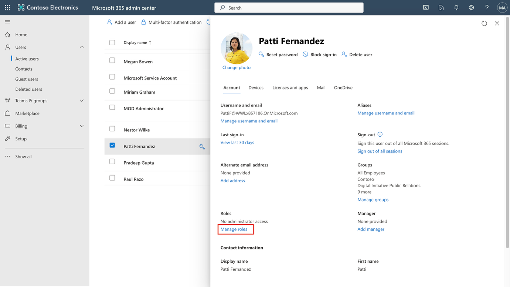
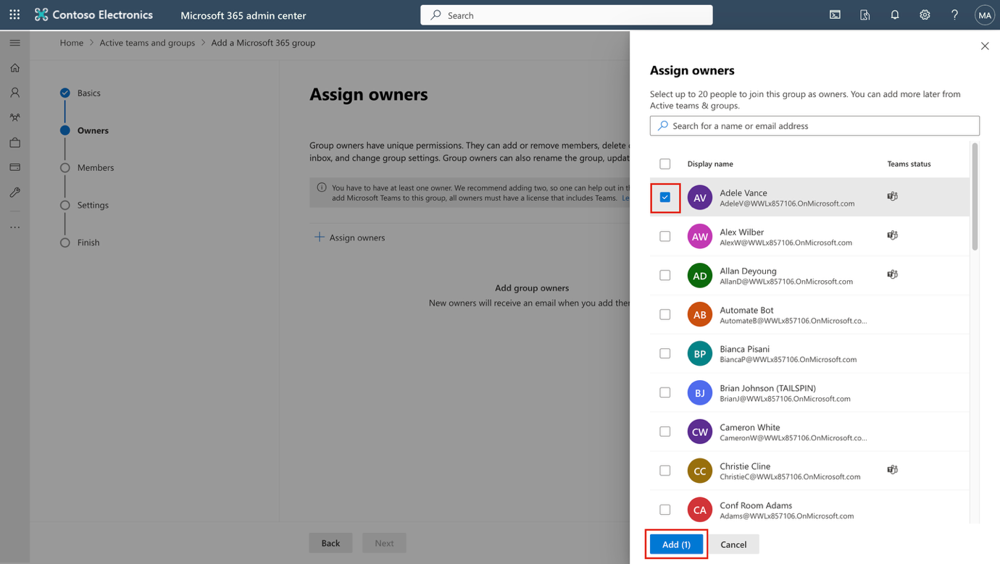
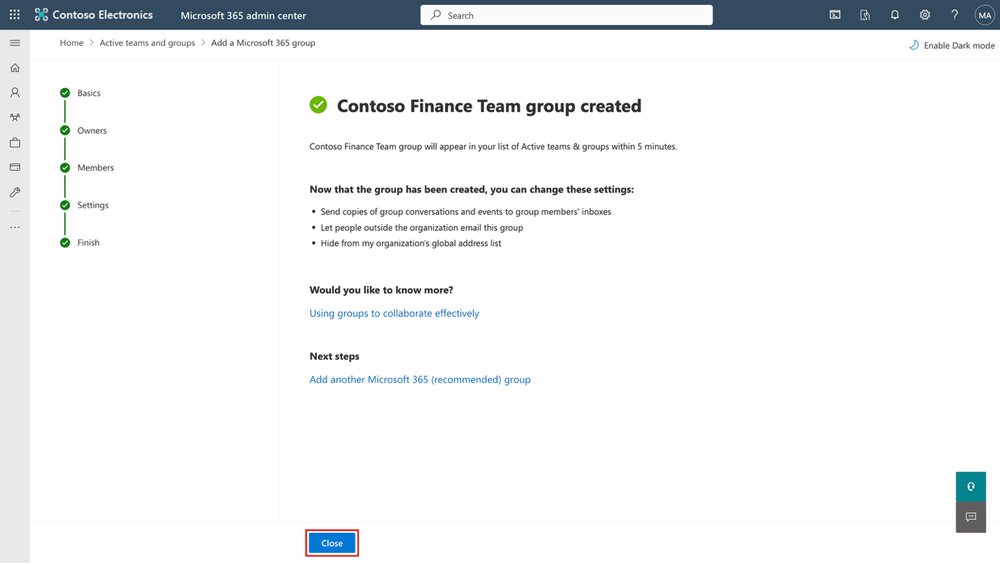
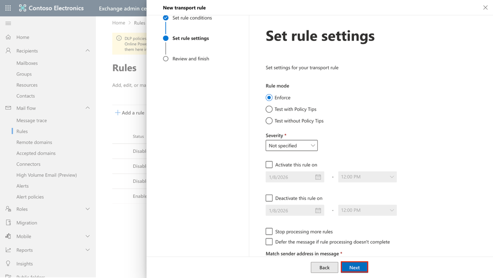
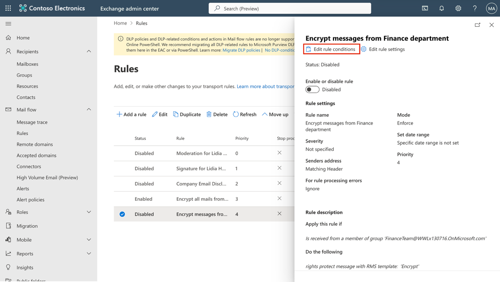
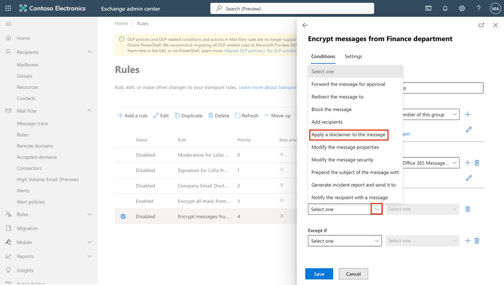
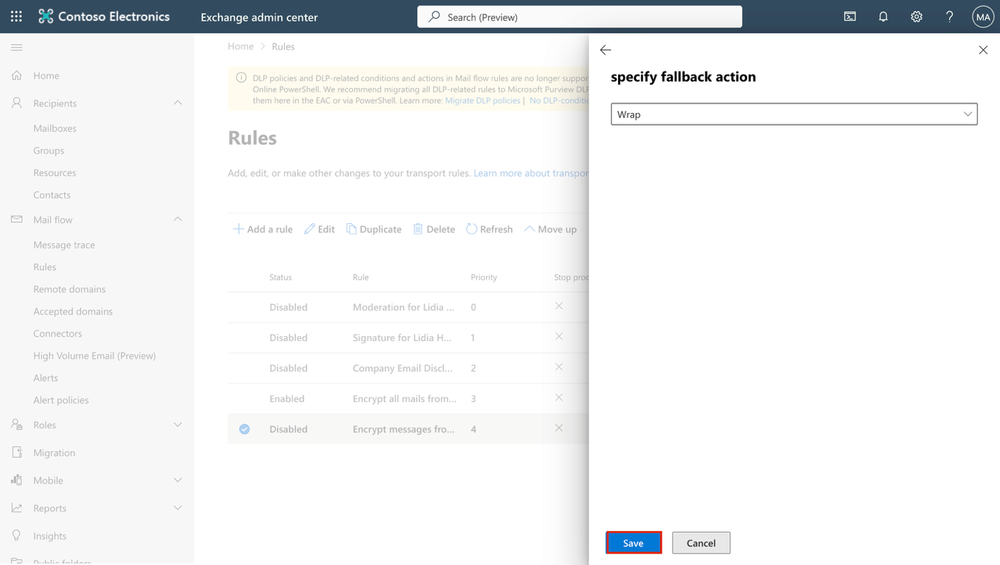

**ラボ 1 – Compliance Rolesの割り当てと Office 365 Message Encryptionの管理**

**導入：**

Microsoft Purview ポータルは、Microsoft Purview 内でタスクを実行するユーザーの権限を直接管理できます。ポータルの設定にある「Roles and scopes」領域を使用すると、Purview のデータセキュリティ、データガバナンス、リスクとコンプライアンスの各ソリューション全体にわたってユーザーの権限を管理できます。ユーザーが実行できるタスクを、明示的にアクセスを許可した特定のタスクのみに制限することもできます。

**客観的：**

- Microsoft 365 のユーザーにマネージャーとCompliance Rolesを割り当てます。

- チームコラボレーション用の Microsoft 365 とセキュリティ グループを作成します。

- Microsoft Purview コンプライアンス評価の試用版を有効にします。

- Office 365 Message Encryption 用に Azure RMS を検証および構成します。

- デフォルトの OME テンプレートを変更して、ソーシャル ID アクセスを無効にします。

- ソーシャル サインインなしで暗号化された電子メール配信をテストします。

- 財務チーム向けにカスタム OME ブランディング テンプレートを作成して適用します。

- 財務部門からのメッセージを暗号化するメールフロールールを作成する

- 暗号化されたメッセージに免責事項を追加する

- メールフロールールを有効にする

- Message Encryptionを検証する

**演習 1 - Compliance Rolesの管理**

この演習では、Microsoft Purview を使用してセキュリティを実装するために必要なすべての試用ライセンスをアクティブ化します。

**タスク 1 – 既存のユーザーにマネージャー ロールを追加します。**

1.  ラボで提供されたアカウントの詳細を使用して VM にログインします。

2.  **Microsoft Edge**を開き、Microsoft 365 admin center( https://admin.microsoft.com ) に移動し、管理者資格情報を使用して**MOD ADMINISTRATOR**としてログインします。

> \[!Note \]**注: Microsoft 365 admin centerの MFA をスキップします。**
>
> 一部のテナントでは、サインイン時にポータル MFA 適用プロンプトが表示される場合があります。このプロンプトが表示された場合:

- **「Skip for now」**を選択します。

- **\[Let us know why you're skipping MFA\]**ダイアログで、正当な理由を選択し、 **\[Send and skip\]**を選択します。

> これにより、テナントの Microsoft 365 admin centerでの MFA の適用が延期され、ラボを続行できるようになります。

3.  左側のペインから、 **\[Users\]** \> **\[Active users\]**を選択し、最初のユーザー**Adele Vance**をクリックします。

> 

4.  **\[Manager\]**の下で、 **\[Edit manager\]**をクリックします。

> 

5.  現在のマネージャーを削除し、検索ボックスに「Patti」と入力します。**Patti Fernandezを選択します**。 **「Save Changes」**をクリックします。

> 

6.  次のすべてのユーザーのマネージャーを**Patti Fernandez**に変更します**。**

    - Adele Vance

    - Christie Cline

    - Megan Bowen

7.  **Patti Fernandez**の場合は、 **MOD Administrator を**マネージャーとして追加します。

**タスク2 – 管理者ロールの割り当て**

1.  ユーザー**Patti Fernandez**を選択し、 **\[Account\]の下で\[Roles\]**までスクロールして、 **\[Manage roles\]**をクリックします。

> 

2.  **\[Roles\]**ウィンドウが開いたら、 **\[Admin center access\]**の横にあるラジオ ボタンをオンにして、 **\[Show all by category\] を展開します。**

> 

3.  **「Security & Compliance」**カテゴリで、 **「Compliance Administrator」** 、 **「Security Administrator」** 、 **「Application Administrator」**のチェックボックスをオンにし、フライアウトパネルの下部にある「**Save changes」**を選択します**。 「Save changes」**をクリックします。

> 

4.  ペインを閉じて、同じページに留まり、次のタスクに進みます。

**タスク 3 – Microsoft admin centerでチームとグループを作成する**

1.  次に、 **「Teams & groups」**を展開し、 **「Active teams & groups」**を選択して、 **「Teams & Microsoft 365 groups」**の下の**「Add a Microsoft 365 group」**をクリックします。

> 

2.  **\[Name\]**フィールドに「 Contoso Finance Team 」と入力し、 **\[Description\]**フィールドに「 This team handles finance. 」と入力して、 **\[Next\]**をクリックします。

> 

3.  **「Assign Owners」**ページで、 **「Assign owners」**をクリックし、 **Adele Vance**の横にあるボックスにチェックを入れて、 **「Add(1)」**をクリックします**。 「Next」**をクリックします。

> 

4.  **「Add members」ページ**で、 **Adele Vance**と**Christie Clineを**メンバーとして追加し、 **「Next」**をクリックします。「**Add members」**ページで、 **「Next」**を選択します。

5.  グループの電子メール アドレスにはcontosofinanceを使用し、 **\[Next\]**をクリックします。

> 

6.  **「Create group」**をクリックします。

> 

7.  完了したら、 **「Close」**をクリックします。

> 

8.  **Active teams & groups**ページで、**Security groups**タブを選択します。**Add a security group**を選択します。

> 

9.  次の情報を持つ別のグループを作成するには、手順を繰り返します。

    - **Set up the basics**で、**Name**フィールドに「 EDM_DataUploaders 」と入力します。

    - **Description**フィールドに「People who will upload data for EDM.」と入力します。

    - **「Next」**を選択します。

    - **\[Settings\]**ページで、 **\[Next\]**を選択します。

    - **\[Review and finish adding group\]ページ**で設定を確認し、 **\[Create group\]**を選択します。

    - **New group createdページが表示され**たら、閉じるボタンを選択します。

    - リストから新しく作成した**EDM_DataUploadersグループを選択します。**

    - **\[Members\]**タブで、 **\[View all and manage owners\]**を選択し、 **Patti Fernandez**と**Christie Cline** を追加します。

    - 同様に追加追加 メンバーは**Patti Fernandez** と**Christie Cline。**

> 

**演習2 – Office 365 Message Encryptionの管理**

**タスク1 – 財務部門からのメッセージを暗号化するためのメールフロールールを作成する**

このタスクでは、Exchange admin centerを使用して、Finance Team グループのメンバーによって送信されるすべてのメッセージに Microsoft Purview Message Encryption を適用するメール フロー ルールを作成します。

1.  **Microsoft Edge**で、 https://admin.exchange.microsoft.comにアクセスし、 PattiF@TenantNameとしてサインインします。

2.  左側のナビゲーション ウィンドウで、 **\[Mail flow\]**を展開し、 **\[Rules\]**を選択します。

> 

3.  **\[Rules\]ページ**で、 **\[+Add a rule\]** \> **\[Apply Office 365 Message Encryption and rights protection to messages\]** を選択します。

> 

4.  **Set rule conditions** ページで、以下を構成します。

    - **Name：**Encrypt messages from Finance department

    - **\[Apply this rule if\]** セクションで、以下を設定します。

      - ドロップダウン1の場合:**The sender**

> 

- ドロップダウン 2: **is a member of this group**、 \[**Select members\]**フライアウトで**\[Finance Team\]**と**\[Save**\] を選択します。

> 
>
> 
>
> 

- 「**Do the following**」セクションで、次の操作を実行します。

  - デフォルトの「**Modify the message security」**と**「Apply Office 365 Message Encryption and rights protection」**を選択したままにします。

> 

- **\[Do the following\]**セクションの**\[Select one\]**リンクを選択します。

> 

- **\[Select RMS template\]**フライアウトで、 **\[Encrypt\]**を選択し、 **\[Save\]**を選択します。

> 

- **\[Set rule conditions\]ページ**で**\[Next\]**を選択します。

> 

5.  **\[Set rule settings\]**ページで、デフォルトを選択したままにして、 **\[Next\]**を選択します。

> 

6.  **\[Review and finish\]ページ**でメール フロー ルールを確認し、 **\[Finish\]**を選択します。

> 

7.  メール フロー ルールが作成されたら、 **\[Done\]**を選択します。

> 

財務部門から送信されるメッセージをMicrosoft Purview Message Encryptionを使用して暗号化するメールフロールールの作成に成功しました。これにより、機密性の高い財務関連の通信が組織から送信される前に保護されます。

**タスク2 – 暗号化されたメッセージに免責事項を追加する**

次に、既存の暗号化ルールを変更して免責事項を追加します。この免責事項は、メッセージがContoso Ltd.によって安全に送信されたことを受信者に通知する、シンプルなメッセージブランディングとして機能します。

1.  **\[Rules\]ページ**で、新しく作成された**\[Encrypt messages from Finance department\]**を選択します。

> 

2.  **Encrypt messages from Finance department**フライアウトで、Edit rule conditions**を**選択します。

> 

3.  **「Do the following」セクション**の右側にある**+**を選択します。

> 

4.  新しく作成された**And**セクションでは、次のようになります。

    - ドロップダウン1: **Apply a disclaimer to the message**

> 

- ドロップダウン 2:**Append a disclaimer.**

> 

- ドロップダウンの下で、 **\[Enter text\]**を選択します。

> 

- 次に、**specify disclaimer text** **ポップアップ**に「This email has been encrypted and sent securely by Contoso Ltd.」と入力します。

- フライアウトの下部にある**\[Save\]**を選択します。

> 

- フォールバック アクションを追加するには、\[Select one\] リンクを選択します。

- **specify fallback action** フライアウトで**\[Wrap\]**を選択し、フライアウトの下部にある**\[Save\]**を選択します。

> 

5.  下部の「**Encrypt messages from Finance department**」フライアウトで「**Save**」を選択します。

> 

6.  **「Transport rule updated successfully」**というメッセージが表示されます。

> 

7.  **\[Done\]**を選択してフライアウトを閉じます。

> 

暗号化ルールを更新し、保護された各メッセージに免責事項を追加しました。これにより、受信者はメールがContoso Ltd.から暗号化され、安全に送信されたことを明確に理解できます。

**タスク3 – メールフロールールを有効にする**

デフォルトでは、新しいメールフロールールは無効な状態で作成されます。このタスクでは、暗号化ルールを有効にして、財務部門からのメッセージを保護できるようにします。

1.  **\[Rules\]**ページで、新しく作成された**\[Encrypt messages from Finance department\]に対して\[Disabled\]**を選択します。

> 

2.  **\[Encrypt messages from Finance department\]**フライアウトで、 **\[Enable or disable rule\]**の下のトグルを**\[Enabled\]**に設定します。

> 

3.  メールフロールールは自動的に有効になります。 **「Updating the rule status, please wait...」**というメッセージが表示されます。ルールが有効になると、 **「Rule status updated successfully」**というメッセージが表示されます。

> 

4.  フライアウトの右上隅にある**X**を選択して、フライアウトを閉じます。

> 

**注**：ルールの伝播変更の適用には数分かかる場合があります。検証に失敗した場合は、数分待ってから再度テストを送信してください。

暗号化ルールが有効になり、財務部門から送信されるメッセージにMicrosoft Purview Message Encryptionが適用されます。今後、財務部門のユーザーから送信されるメッセージは自動的に暗号化され、Contoso Ltd.の免責事項が含まれます。

**タスク4 – メッセージの暗号化を検証する**

このタスクでは、財務部門のメンバーからテスト メールを送信し、Microsoft Purview Message Encryption が自動的に適用され、受信者にセキュリティで保護されたメッセージの通知が表示されることを確認します。

1.  タスク バーから **Microsoft Edge** を右クリックし、「**New InPrivate window**」を選択して、InPrivate ウィンドウで「Microsoft Edge」を開きます。

2.  https://outlook.office.comに移動し、 AdeleV@TenantNameとして Web 上の Outlook にログインします。

3.  **\[Stay signed in?\]**ダイアログ ボックスで、\[**Don't show this again\]**チェック ボックスをオンにして、 **\[No\]**を選択します。

4.  Web 上の Outlook で、 **\[New mail\]**を選択します。

> 

5.  **To**欄に、テナントドメイン外の個人用メールアドレスまたはサードパーティのメールアドレスを入力します。件名欄に「Secret Message」 、本文に「My super-secret message.」と入力します。

6.  **「Send」**を選択してメッセージを送信します。Outlookウィンドウは開いたままにしておきます。

> 
>
> 新しいウィンドウで個人用メールアカウントにサインインし、Adele Vanceからのメッセージを開きます。メッセージをMicrosoftアカウント（@outlook.comなど）に送信した場合は、自動的に開く可能性があります。他のメールサービス（@gmail.comなど）に送信した場合は、暗号化処理を行ってメッセージを読むために、次の手順を実行する必要がある場合があります。

7.  **\[Read the message\]**を選択します。

> 

8.  期間限定のパスコードを受け取るには、「**Sign in with a One-time passcode**」を選択します。

9.  **「Your one-time passcode to view the message」**のメッセージを開きます。

10. パスコードをコピーしてポータルに貼り付け、 **「Continue」**を選択します。

11. 暗号化されたメッセージを確認してください。メールの下部に「**This email has been encrypted and sent securely by Contoso Ltd.」**というメッセージが表示されます。

財務部門からのメッセージが自動的に暗号化され、Contoso の免責事項が付加されていることが検証され、Microsoft Purview Message Encryption が期待どおりに動作していることが確認されました。

**まとめ：**

このラボでは、管理センターで組織を正常に複製し、適切なライセンスを割り当て、Microsoft 365 に組み込まれている Office 365 Message Encryption (OME) の使用方法を学習しました。
