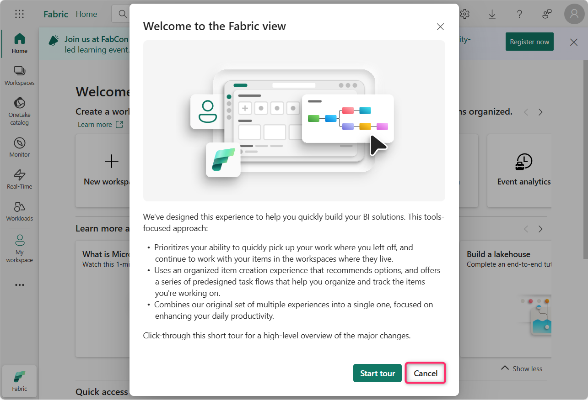
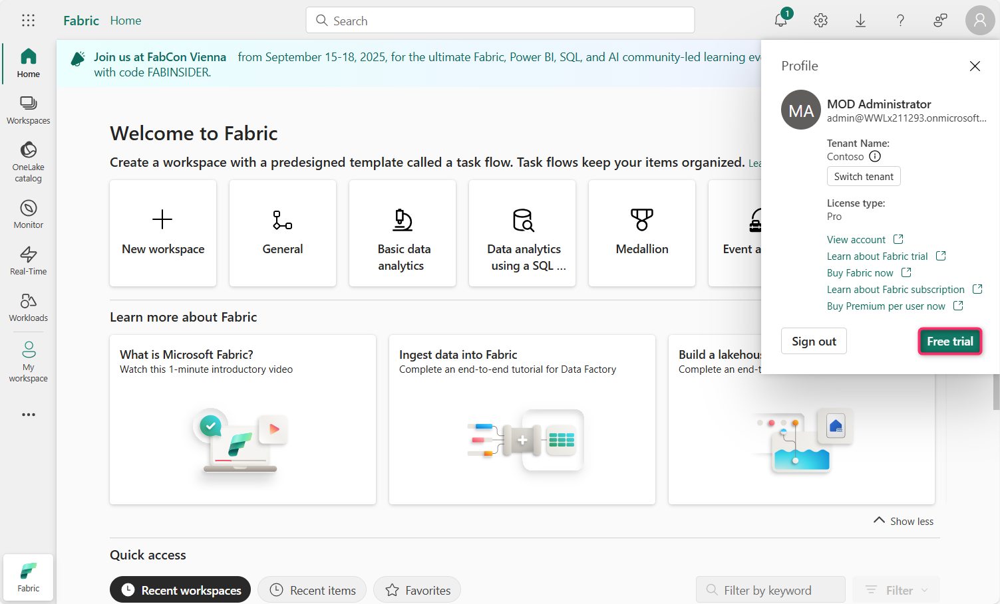
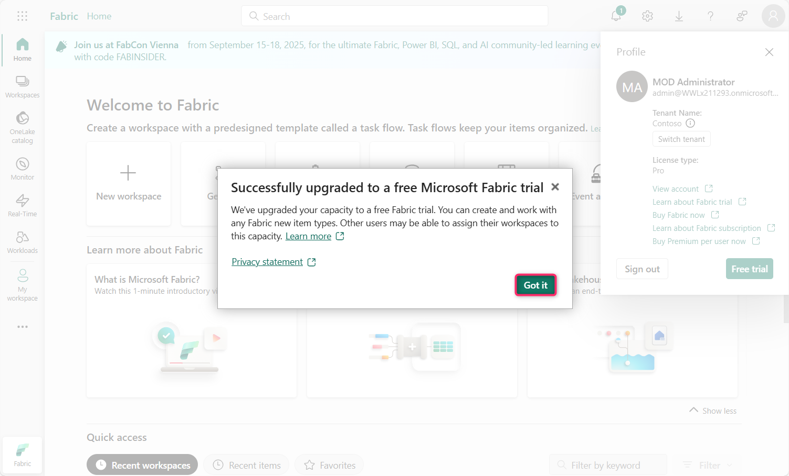
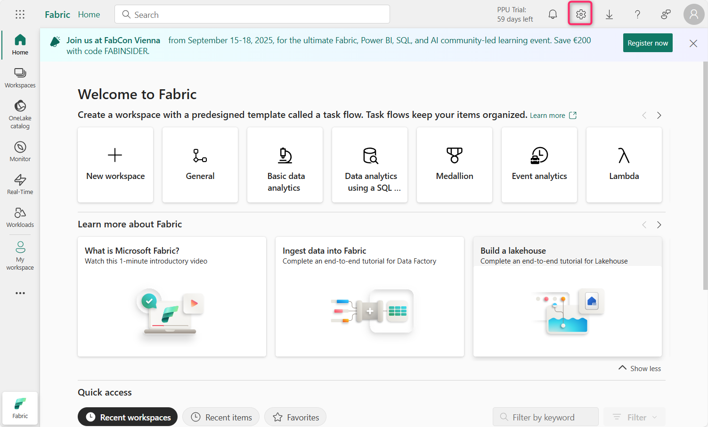
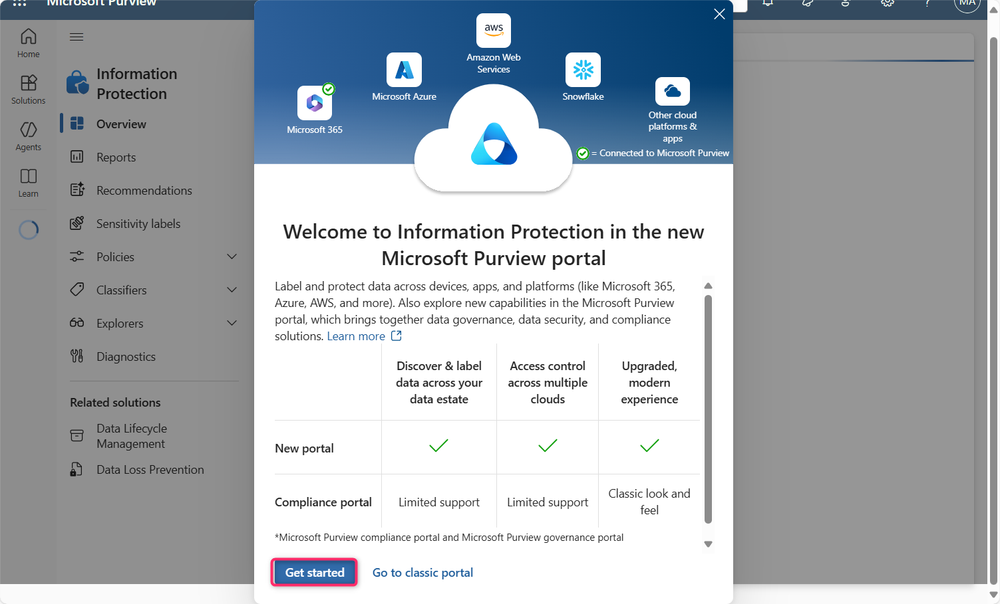
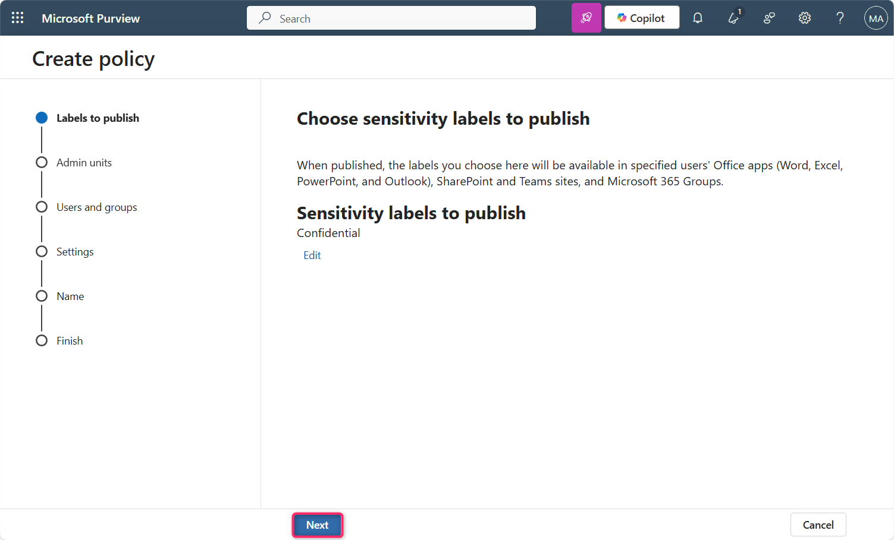
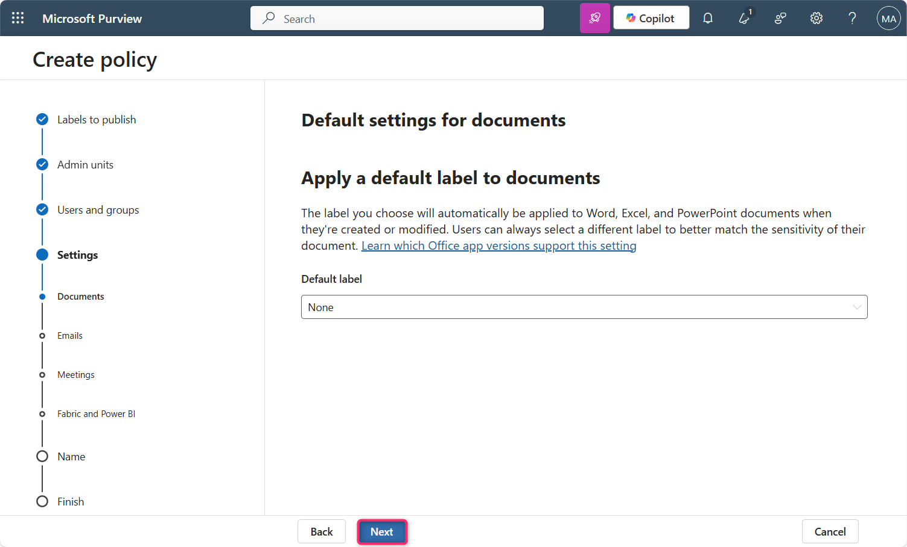
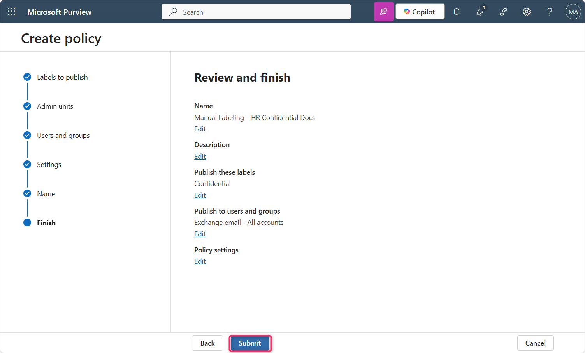
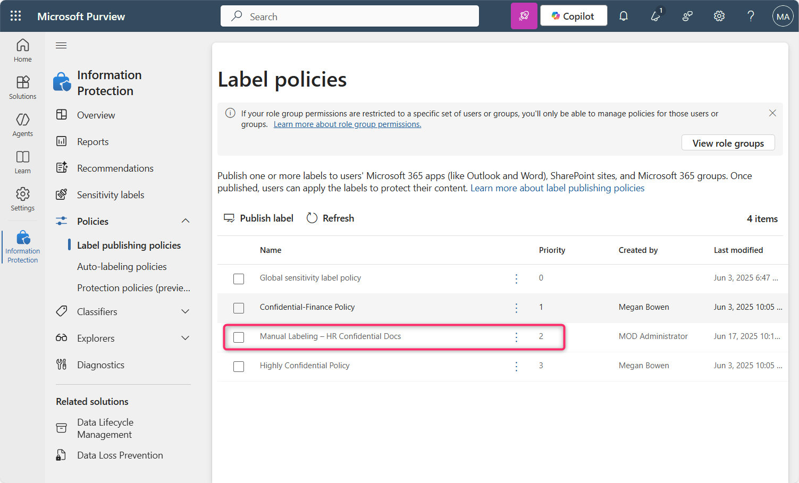

**ラボ 10 – Microsoft Purview を使用して Fabric と Power BI でSensitivity labelを強制する**

**導入**

FabricおよびPower BI（Power BI Desktopを含む）のMicrosoft Purview Information ProtectionのSensitivity labelをテナントで有効にする必要があります。Sensitivity labelを有効にすると、次のようになります。

- 組織内の指定されたユーザーとセキュリティグループは、Fabric コンテンツにSensitivity labelを適用できます。Fabric サービスでは、これは任意の Fabric アイテムを意味します。Power BI Desktop では、 .pbixファイルを意味します。

- サービスでは、組織のすべてのメンバーがラベルを閲覧できます。デスクトップでは、ラベルが公開されている組織のメンバーのみがラベルを閲覧できます。

**客観的**

- Microsoft Purview を使用して、Microsoft Fabric で手動のSensitivity label ポリシーを有効にし、優先順位を付けます。

**演習 1 – Microsoft Fabric の試用版をアクティブ化し、Purview Hub にアクセスする**

1.  Edge ブラウザーのアドレス バーを開き、次の URL を入力して Fabric ポータルを開きます - https://app.fabric.microsoft.com

**注**: Fabric ポータルに直接アクセスする場合は、手順 2 と 3 をスキップしてください。

2.  テナントの資格情報を入力します。

3.  パスワード欄にテナントパスワードを入力します。次に、「**Sign in」**ボタンをクリックします。

4.  **\[Welcome to the Fabric view\]ダイアログ ボックス**で、 **\[Cancel\]**ボタンをクリックします。

5.  コマンド バーのプロフィール アイコンをクリックします。

6.  **「Free trial」ボタン**に移動してクリックします。

7.  **Activate your 60-day free Fabric trial capacityのTrial capacityリージョン**で、**Default – West US 3** **リージョンが選択されている**ことを確認し、**Activateボタン**をクリックします。

8.  **Successfully upgraded to a free Microsoft Fabric trial** ダイアログ ボックスで、 **\[Got it\]**ボタンをクリックします。

9.  コマンド バーの**\[Settings\]ギア ボックス**をクリックします。

10. **「Microsoft Purview hub（Preview）」リンク**をクリックします。次に、 **「Microsoft Purview hub（Preview）」ページで、 「Information Protection」タイル**をクリックします。

11. 場合によっては、 **「Pick an account」**ダイアログ ボックスが表示されるので、テナント ID を選択します。

12. **\[Welcome to Information Protection in the new Microsoft Purview portal\]**で、 **\[Get started\]**ボタンをクリックします。

**演習 2 – Fabric と Power BI のSensitivity label ポリシーの作成と構成**

1.  \[Information Protection\] ブレードで、 **\[Policies\]**の横にあるドロップダウンに移動してクリックします。

2.  次に、 **「Label publishing policies」をクリックします**。 **「Label publishing policies」ページで、 「Publish label」**をクリックします。

3.  **「Create policy」ページ**で、 **「Choose sensitivity label to publish」**リンクに移動してクリックします。

4.  **Sensitivity label to publish** **の**ペインが右側に表示されるので、移動して**「Confidential」の横にあるチェックボックスを選択し、 「Add」ボタン**をクリックします。

5.  次に、 **「Next」**ボタンをクリックします。

6.  **Assign admin units** ページで、 **\[Next\]**ボタンをクリックします。

7.  **\[Publish to users and groups\]ページ**で、 **\[Users and groups\] の**横にあるチェックボックスが選択されていることを確認し、 **\[Next\]ボタン**をクリックします。

8.  **Policy settingsページ**で、 **「Require users to apply a label to their Fabric and Power BI content」**の横にあるチェックボックスをオンにします。次に、 **「Next」**ボタンをクリックします。

9.  **Default settings for documents – Apply a default label to documents** **ページ**で、 **\[Next\]**ボタンをクリックします。

10. **Default settings for documents – Apply a default label to emails** **ページ**で、 **\[Next\]**ボタンをクリックします。

11. **Default settings for meetings and calendar events** **ページ**で、 **\[Next\]**ボタンをクリックします。

12. **Default settings for Fabric and Power BI content** **ページ**で、 **\[Next\]**ボタンをクリックします。

13. **「Name your policy」**ページの「**Name」**欄に「Manual Labeling – HR Confidential Docs」と入力します。「**Name」**ボタンをクリックします。

14. **「Review and finish」ページ**で、 **「Submit」**ボタンをクリックします。

15. ポリシーが正常に作成されました。「**Done」**ボタンをクリックしてください。

16. **Label policiesページ**に、**Manual Labeling – HR Confidential Docs** **ポリシーが正常に作成された**ことが表示されます。

17. **「Manual Labeling – HR Confidential Docs」**を選択し、水平の省略記号をクリックして移動し、「**Move up」を選択して**優先度を変更します。

18. もう一度、 **\[Manual Labeling – HR Confidential Docs\] を選択し**、その横にある水平の省略記号をクリックして、 **\[Move up\]を選択します**。

19. **「Manual Labeling – HR Confidential Docs」の**優先度が 1 に変更されていることがわかります。

**まとめ**

このラボでは、Microsoft Fabric の試用版を有効化し、Microsoft Purview ポータルにアクセスし、Fabric および Power BI コンテンツに「Confidential」ラベルを適用することをユーザーに義務付ける必須のSensitivity labelポリシーを作成しました。その後、ポリシーの適用優先順位を設定しました。
