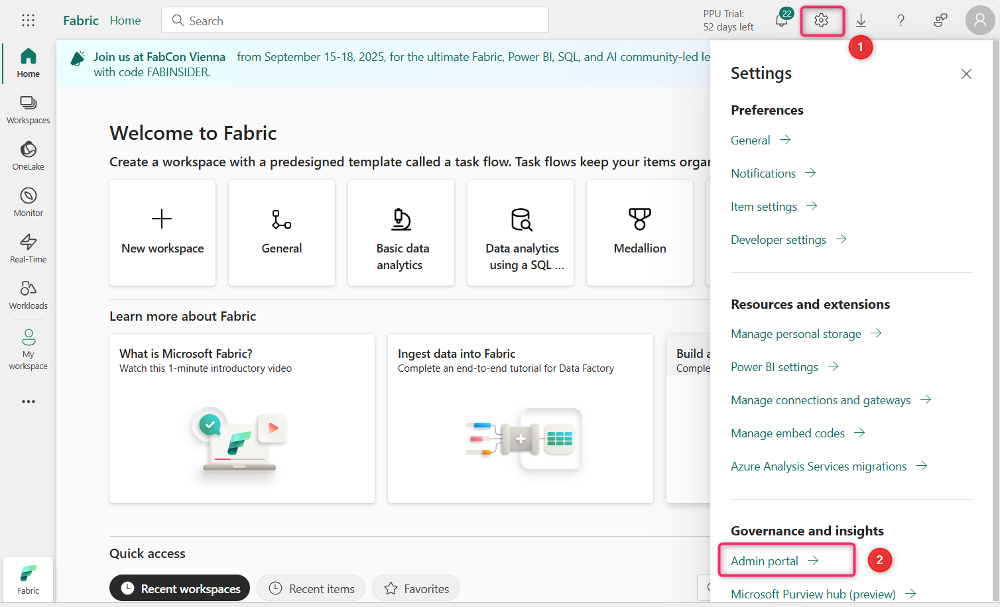
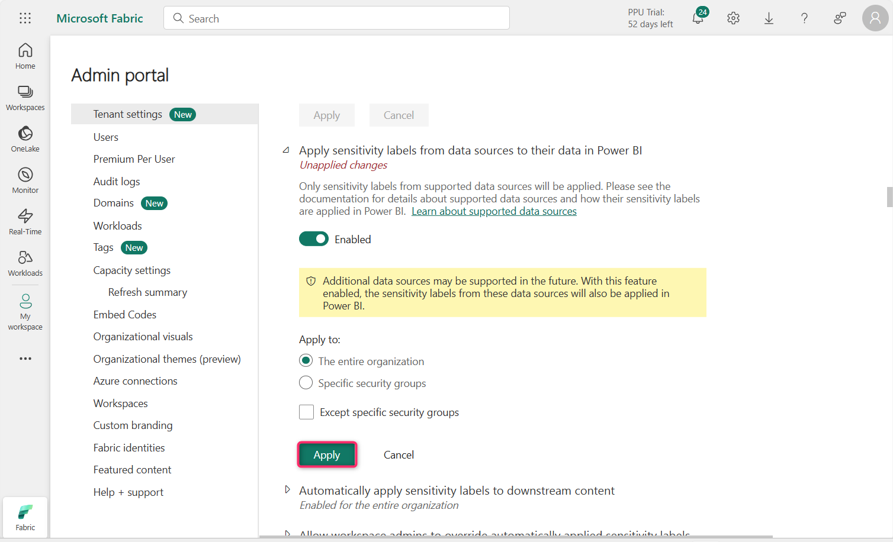
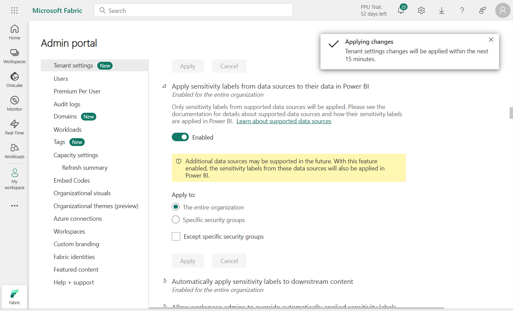
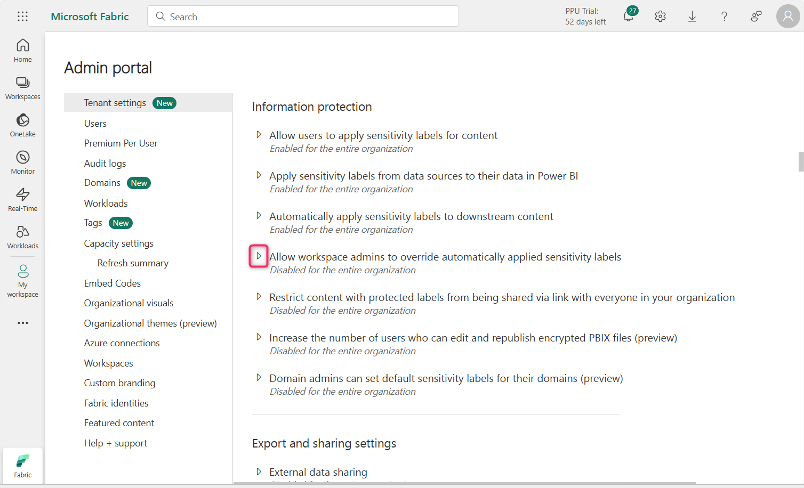

**ラボ 11 – FabricでInformation Protectionポリシーを構成する**

**導入**

Information Protectionテナント設定は、Power BI テナント内の機密情報を保護するのに役立ちます。コンテンツにSensitivity labelを許可および適用することで、適切なユーザーのみが情報を閲覧およびアクセスできるようになります。

**客観的**

- 管理ポータルを通じて Microsoft Fabric のInformation Protection機能を有効にして、Sensitivity labelの適用を準備します。

**演習 1 – Fabric Admin Portal でInformation Protection設定を構成する**

1.  Fabric ポータルのホームページで、コマンド バーの**\[Settings\]アイコンをクリックし、 \[Governance and insights\]セクションに移動して、 \[Admin portal\]リンク**をクリックします。

> 

2.  Admin portal – Tenant settingsで、**Information Protection**セクションまで下にスクロールします。

> 

3.  **「Allow users to apply sensitivity labels for content」**の横にある再生ボタンをクリックします。

> 

4.  トグルボタンをクリックして有効にします。この設定を有効にすると、指定されたユーザーがMicrosoft Purview Information ProtectionからSensitivity labelを適用できるようになります。

> 

5.  次に、**「Apply」**ボタンをクリックします。

> 
>
> **注: \[Apply\]**ボタンが強調表示されていない場合は、 **\[Specific security groups**\] ラジオ ボタンを選択し、 **\[The entire organization**\] ラジオ ボタンを再度選択します。

6.  **\[Tenant settings will be applied within the next 15 minutes」**という通知が表示されます。

> 

7.  **「Apply sensitivity labels from data sources to their data in Power BI」**の横にあるプレイアイコンをクリックします。

> 

8.  有効にするには、トグルボタンをクリックします。

> 

9.  この設定を有効にすると、サポートされているデータ ソース内のSensitivity labelが付けられたデータに接続する Power BI セマンティック モデルはそれらのラベルを継承できるため、Power BI に取り込まれたときにデータは分類され、セキュリティが保護されたままになります。

> **「Apply」ボタン**をクリックします。
>
> 

10. **\[Tenant settings will be applied within the next 15 minutes」**という通知が表示されます。

> 

11. **「Automatically apply sensitivity labels to downstream content」**の横にあるプレイアイコンをクリックします。

> 

12. 有効にするには、トグルボタンをクリックします。

> 

13. この設定を有効にすると、Sensitivity labelを変更したり、Fabric コンテンツに適用したりするたびに、そのラベルは対象となるダウンストリーム コンテンツにも適用されます。

> **「Apply」ボタン**をクリックします。
>
> 

14. 「Tenant settings will be applied within the next 15 minutes」という通知が表示されます。

> 

15. **「Allow workspace admins to override automatically applied sensitivity labels**」の横にあるプレイアイコンをクリックします。

> 

16. 有効にするには、トグルボタンをクリックします。

> 

17. この設定により、ワークスペース管理者は、ラベル変更の適用ルールに関係なく、自動的に適用されたSensitivity labelを上書きできるようになります。

> **「Apply」**ボタンをクリックします
>
> 

18. 「Tenant settings will be applied within the next 15 minutes」という通知が表示されます。

> 

19. **Restrict content with protected labels from being shared via link with everyone in your organization**の横にあるプレイアイコンをクリックします。

> 

20. 有効にするには、トグルボタンをクリックします。

> 

21. この設定を有効にすると、ユーザーはSensitivity labelに保護設定があるコンテンツについて、組織内のユーザー向けの共有リンクを生成できなくなります。

> **「Apply」**ボタンをクリックします
>
> 

22. 「Tenant settings will be applied within the next 15 minutes」という通知が表示されます。

> 

23. **「Domain admins can set default sensitivity labels for their domains (preview)」**の横にあるプレイアイコンをクリックします。

> 

24. 有効にするには、トグルボタンをクリックします。

> 

25. **「Apply」ボタン**をクリックします。

> 

26. 「Tenant settings will be applied within the next 15 minutes」という通知が表示されます。

> 

**まとめ**

このラボでは、Microsoft Fabric 管理ポータルでさまざまなInformation Protection設定を有効にして、Sensitivity labelの適用、継承、自動ラベル付け、管理者のオーバーライドをサポートしました。
