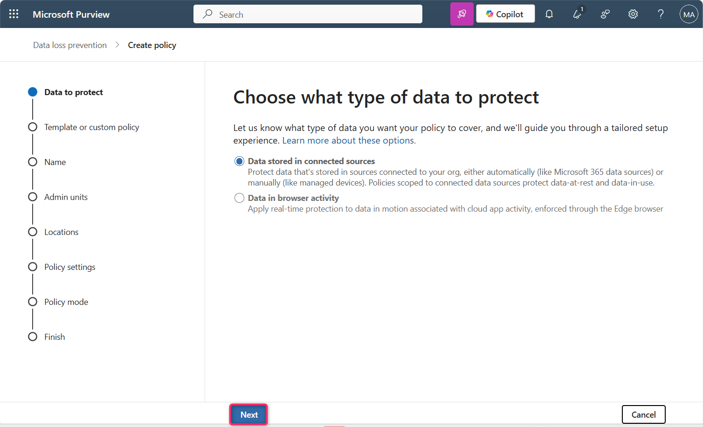
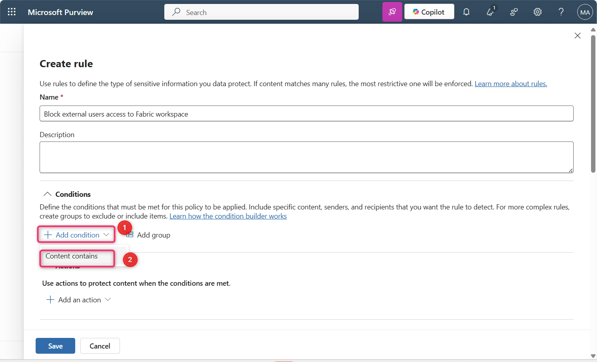
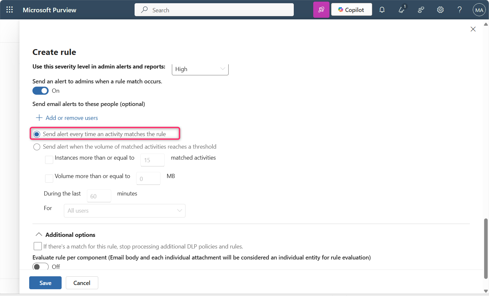
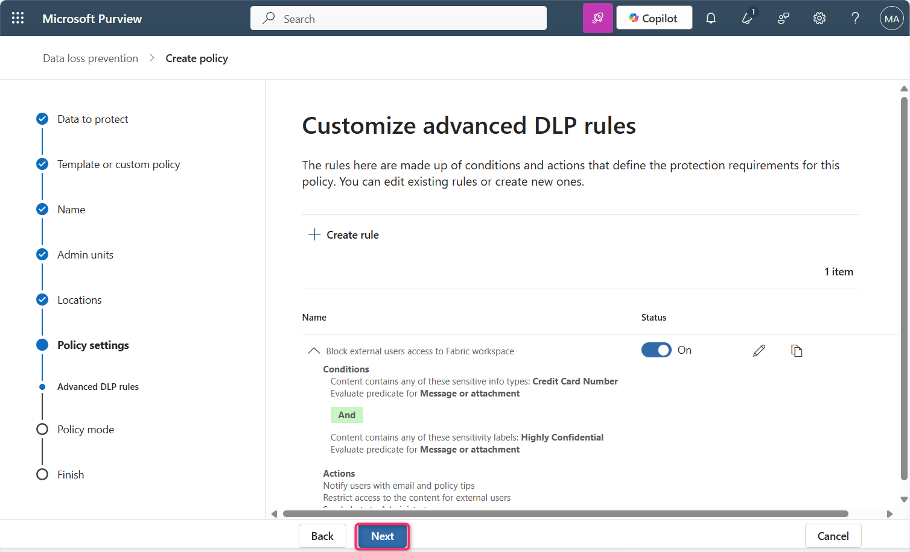
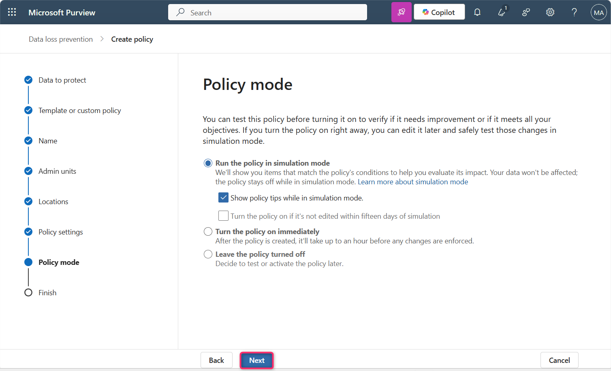

**ラボ 12 – 外部ユーザーによる Fabric ワークスペースへのアクセスをブロックする DLP ポリシーを作成する**

**導入**

クレジットカード番号を含むレポートを外部ユーザーが閲覧できないようにする必要があります。ただし、データに「Highly Confidential - Internal」の機密ラベルが付けられている場合は、保護ポリシーによってアクセスが特定のセキュリティグループに制限されます。コンプライアンス管理者にはセマンティックモデルがブロックされたことを通知し、データ所有者には制限が適用されたことを認識してもらいます。また、社内ユーザーにも、データが極秘であり、組織外で共有してはならないことを認識してもらう必要があります。

| **声明** | **構成に関する質問への回答と構成のマッピング** |
|----|----|
| 「外部ユーザーをブロックする必要があります...」 | 監視対象: **Fabric および Power BI**管理範囲:**ディレクトリ全体**。アクション: **Microsoft 365 の場所のコンテンツへのアクセスを制限または暗号化 \> ユーザーがメールを受信したり、共有されている SharePoint、OneDrive、Teams ファイル、および Power BI アイテムにアクセスしたりできないようにする \> 組織外のユーザーのみをブロックする** |
| 「...クレジットカード番号を含むレポートから...」 | 監視対象:**カスタム テンプレートを使用します**。一致条件: 編集して、クレジットカード番号の機密情報タイプを追加します。 |
| 「ただし、データに「極秘 - 内部機密」ラベルが付けられている場合は除きます...」 | 条件グループの構成:ブールAND 一致条件を使用して最初の条件に結合されたネストされたブールNOT 条件グループを作成します。これを編集して、極秘 - 内部の機密ラベルを追加します。 |
| 「セマンティック モデルがブロックされるたびにコンプライアンス管理者に通知したいのですが...」 | インシデントレポート：**ルールに一致した場合に管理者にアラートを送信する：オン**。アクティビティがルールに一致するたびにアラートを送信する：**選択済み** |
| 「…データ所有者には、制限が課されたことを認識してもらいます。また、社内ユーザーにも、データは機密性が高いため、組織外に共有してはならないことを認識してもらいます。」 | ユーザー通知：**オン**。Microsoft 365 ファイルと Microsoft Fabric アイテム：ポリシーヒントまたはメール通知で Office 365 サービスのユーザーに通知：**オン。ポリシーヒント：ポリシーヒントのテキストをカスタマイズ：オン。**機密性の高いデータの共有に関するルールを説明するテキストをテキストボックスに追加します。 |

**重要**

このポリシー作成手順では、デフォルトの包含/除外値をそのまま使用し、ポリシーはオフのままにします。ポリシーを展開する際に、これらの値を変更します。

**客観的**

- Microsoft Purview でカスタム Data Loss Prevention(DLP) ポリシーを作成し、機密情報を含む Fabric および Power BI コンテンツへの外部ユーザー アクセスをブロックします。

**演習 1: Fabric ワークスペースへの外部アクセスをブロックするカスタム DLP ポリシーの作成**

1.  Microsoft Purviewポータルで、 **「Solutions」をクリックし**、 **「Data Loss Prevention」に移動してクリックします。**

> 

2.  次に、 **「Policies」をクリックします**。

> 

3.  **Policiesページ**で、 **+Create policyをクリックします。** 

4.  **\[What info do you want to protect?\]ペイン**から、 **\[Enterprise applications and devices\]を選択します**。

> 

5.  **Choose what type of data to protect** **ページ**で、 **「Data stored in connected sources」ラジオ ボタンが選択されていることを確認し、 「Next」ボタン**をクリックします。

> 

6.  **Start with a template or create a custom policy** ページで、Categoriesの下の**Customをクリックします**。

**Regulationsリスト**からCustom policyを選択し、 **「Next」**ボタンをクリックします。

\

5.  **「Name your DLP policy」**ページの「**Name」**フィールドに、 **「Custom policy」**が記載されていることを確認します。

> **注**: ここではポリシーインテントステートメントを使用できます。ポリシーの名前は変更できません。
>
> **「Next」ボタン**をクリックします。
>
> 

6.  **Assign** **Admin units** ページで、 **「Next」**ボタンをクリックします。

> 

7.  **「Choose where to apply the policy」ページ**で、 **「Next」**ボタンをクリックします。

> 

8.  **「Define policy settings」ページ**で、 **「Create or customize advanced DLP rules」ラジオボタンが選択されていることを確認します。次に、「Next」ボタン**をクリックします。

> 

9.  **Customize advanced DLP rules** **ページ**で、 **+Create ruleを選択します**。

> 

10. **\[Create rule\]ページの \[Name\]**フィールドに、 **「 +++Block external users access to Fabric workspace+++ 」と入力します**。

> 

11. **\[Conditions\]セクション**で、 **\[Add condition** \> **Content contains** \> **Add** \> **Sensitive info types\]を選択します**。

> 
>
> 

12. 右側に表示される**「Sensitive info types」ペイン**で、検索バー内をクリックし、 **「+++credit card number+++」と入力して**Enter キーを押します。

> 
>
> 

13. **「Credit Card Number」**の横にあるチェックボックスをオンにして、 **「Add」**ボタンをクリックします。

> 

14. **\[Actions\]**で、 **\[Add an action** \> **Restrict access or encrypt the content in Microsoft 365 locations\]を選択します。**

> 

15. \[**Block users from receiving email or accessing shared SharePoint, OneDrive, and Teams files, and Power BI items** **\] と \[Block only people outside your organization\]**が選択されていることを確認します。

> 

16. **\[User notifications\]**の下で、トグルを**\[On\]に設定します**。

> 
>
> 

17. **\[Notify users in Office 365 service with a policy tip or email notifications**\] チェック ボックスと**\[Customize the policy tip text\]**チェック ボックスをオンにします。

> 

18. **\[User overrides\]セクション**で、\[**Allow users to override policy restrictions in Fabric (including Power BI), Exchange, SharePoint, OneDrive, and Teams\] の横にあるチェックボックスをオンにし、 \[Override the rule automatically if they report it as a false positive\]**の横にあるチェックボックスをオンにします。

> 

19. **\[Incident reports\]**で、 **\[Use this severity level in admin alerts and reports\] を\[High\]**に設定します。

> 
>
> 

20. **Send an alert to admins when a rule match occurs** **トグルがOn**に設定されていることを確認します。

21. **「Send alert every time an activity matches the rule** **」ラジオ ボタンが選択されている**ことを確認します。

> 

22. **\[Save\]ボタン**をクリックします。

> 

23. ルールを確認して、 **「Next」**ボタンをクリックします。

> 

24. **「Run the policy in simulation mode」**ラジオボタンと**「Show policy tips while in simulation mode」チェックボックスが選択されている**ことを確認します。 **「Next」ボタン**をクリックします。

> 

25. **「Review and finish」**ページで**「Submit」**ボタンをクリックします。数秒後、ポリシーが正常に作成されます。

> 
>
> 

**重要な注意**:

このラボエンビロンメントではライセンスの制限により、次のエラーが発生する可能性があります。

このラボはPower BI Proライセンスで実行されていますが、FabricまたはPremiumワークスペース向けのMicrosoft Purview DLP統合をサポートしていません。そのため、「Block external users」などのDLPポリシーアクションのスコープを適切に設定できず、ウィザードが以下のエラーで失敗します。

組織外のユーザーのみをブロックするには、「コンテンツは組織外のユーザーと共有されます」という条件を選択する必要があります。

実際のエンタープライズエンビロンメントでは、テナントに次の条件が満たされている場合、この問題は発生しません。

- Power BI Premium Per User (PPU) ライセンス

- または Microsoft Fabric Capacity (F64+)

これらのライセンスにより、ブロック アクションと適切な条件のスコープ設定のサポートを含む、Microsoft Fabric および Power BI との完全な DLP ポリシー統合が可能になります。

**まとめ**

このラボでは、Microsoft Purview でカスタム DLP ポリシーを作成しました。このポリシーは、機密データを検出し、外部ユーザーによるアクセスをブロックする制限を適用することで、Fabric と Power BI のコンテンツを保護します。また、このポリシーでは、ユーザーへの通知と管理者アラートも有効になります。
