**ラボ13 – Retentionの実装と管理**

あなたはContoso Ltd.のコンプライアンス管理者、パティ・フェルナンデスです。同社は、財務データと特権通信に関連するリスクを軽減するため、データセキュリティ戦略を強化しています。あなたは、監査への対応を支援し、不要なデータRetentionを制限し、機密性の高い通信を適切に監視するためのMicrosoft PurviewデータRetentionソリューションを構成するよう依頼されています。

**タスク**:

- Retention labelを作成する

- Retention labelを公開する

- 自動適用Retention labelポリシーを作成する

- 静的Retentionポリシーを作成する

- SharePoint コンテンツを回復する

**演習1 – Retention labelを作成する**

このタスクでは、監査と調査の目的でRetentionする必要がある機密の財務データのRetention labelを作成します。

1.  管理者として VM にログインします。

2.  Microsoft Edge で、 https://purview.microsoft.comに移動し、 pattif@TenantNameとしてサインインします。

3.  **\[Solutions\]** \> **\[Data Lifecycle Management\]**に移動します。

> 

4.  次に、**Retention labelsを選択します**。

> 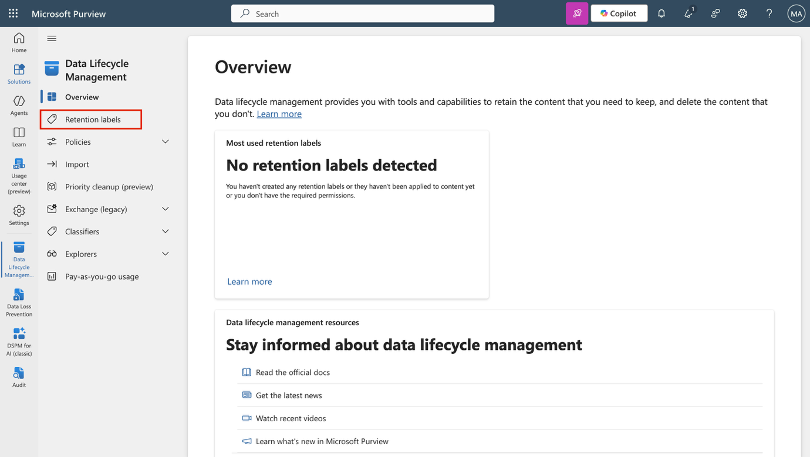

5.  **\[Labels\]ページ**で、 **\[Create a label\]を選択します**。

> 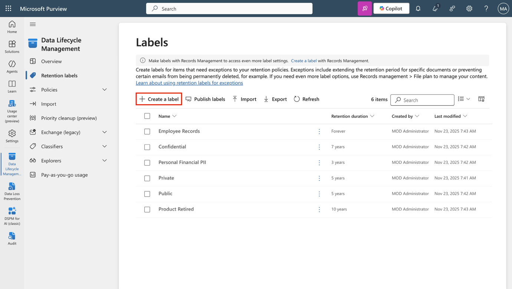

6.  **「Name your retention label」ページ**で、次のように入力します。

    - **Name**: Sensitive Financial Records

    - **Description for users**: Use for financial files with sensitive data that must be retained for audit or security purposes.

    - **Description for admins**: Retains high-impact financial data for 5 years to support audits and security investigations.

7.  **「Next」**を選択します。

> 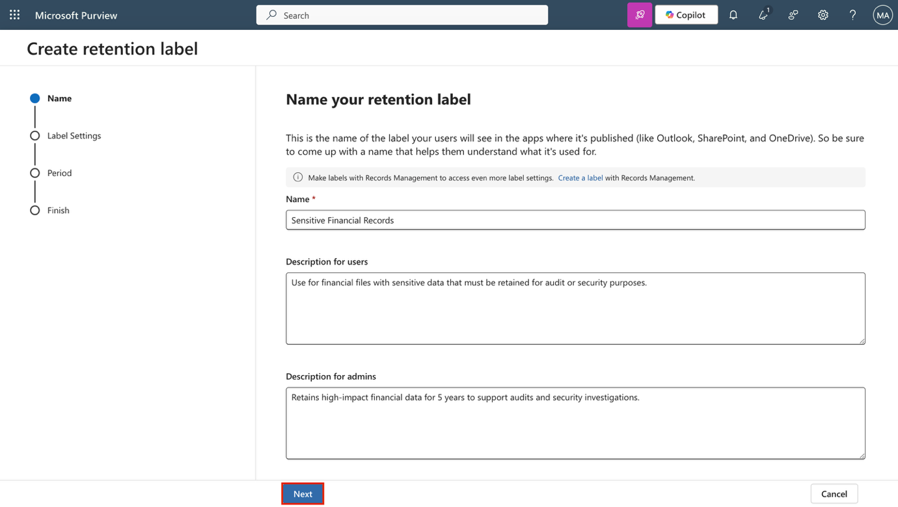

8.  **\[Define label settings\]ページ**で、 **\[Retain items forever or for a specific period\]を選択し**、 **\[Next\]を選択します**。

> 

9.  **「Define the period」ページ**で、Retention期間の構成入力に次の値が設定されていることを確認します。

    - **How long is the period?**: 5 Years

> 

- **When should the period begin?**: When items were modified

> 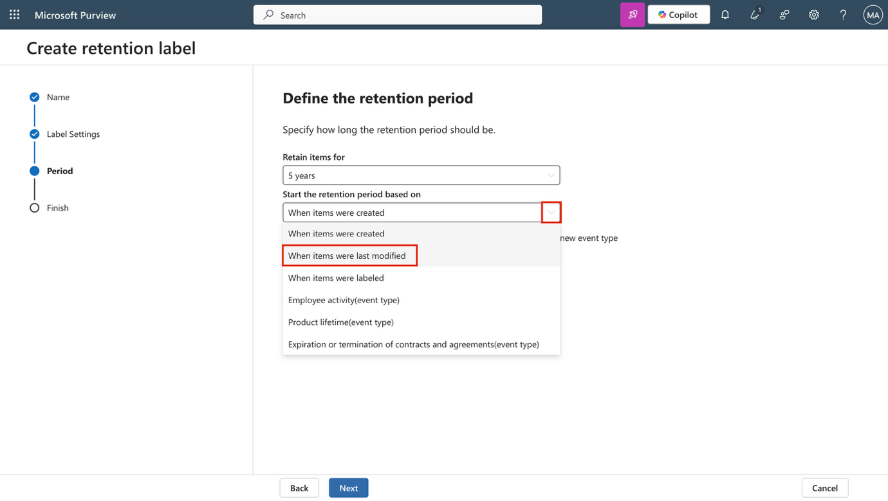

10. **「Next」**を選択します。

> 

11. **\[Choose what happens after the retention period**\] ページで、 **\[Delete items automatically\]を選択し**、 **\[Next\]を選択します**。

> 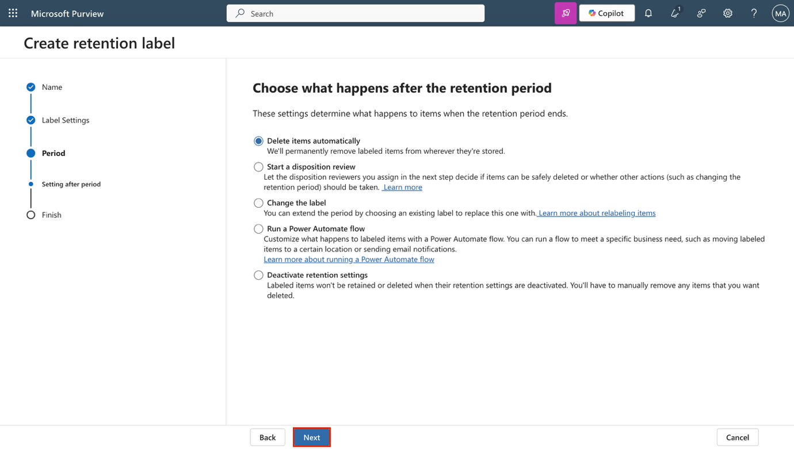

12. **\[Review and finish\]ページ**で、 **\[Create label\]を選択します**。

> 

13. **\[Your retention label is created\]ページ**で、 **\[Do nothing\]**オプションを選択し、 **\[Done\]を選択します**。

> 

データの露出を減らすために、財務コンテンツを 5 年間Retentionし、その後削除するRetention labelを作成しました。

**演習2 – Retention labelを公開する**

このタスクでは、Retention labelを公開して、ユーザーが Exchange、SharePoint、OneDrive などの Microsoft 365 サービスに適用できるようにします。

1.  Microsoft Purview で、 **\[Solutions\]** \> **\[Data Lifecycle Management\]** \> **\[Retention label\]に移動します**。

> 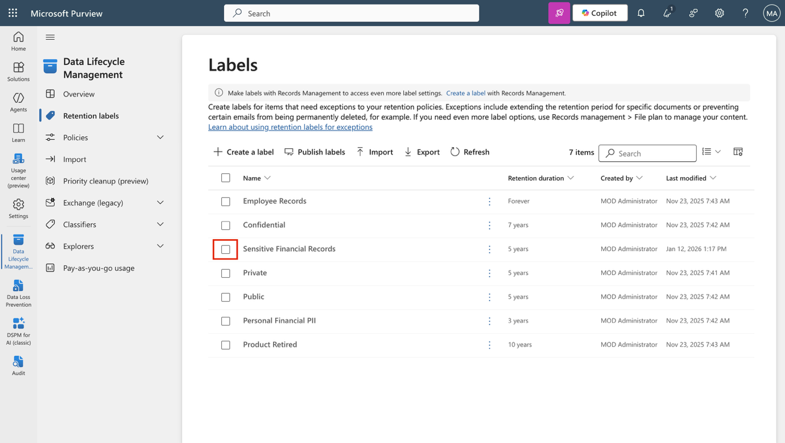

2.  **Sensitive Financial Records** **ラベルの**横にあるチェックボックスをオンにし、**Publish labelsアイコン**を選択してこのRetention labelを公開します。

> 

3.  **\[Choose labels to publish\]ページ**で、 **\[Sensitive Financial Records\]**ラベルが選択されていることを確認し、 **\[Next\]を選択します**。

> 

4.  **\[Policy scope\]**ページで**\[Next\]を選択します**。

> 

5.  **Choose the type of retention policy to create** ページで、 **\[Static\]を選択し**、 **\[Next\]を選択します**。

> 

6.  **\[Choose where to publish labels\]**ページで、 **\[Let me choose specific locations\] を選択し**、以下を選択します。

    - Exchangeメールボックス

    - SharePoint クラシックとコミュニケーション サイト

    - OneDriveアカウント

    - 他の場所の選択をすべて解除

7.  **「Next」**を選択します。

> 

8.  **Name your policy** に以下を入力します。

    - **Name**: Sensitive Financial Data Retention

    - **Description**: Makes the 'Sensitive Financial Records' label available to users in Exchange, SharePoint, and OneDrive.

9.  **「Next」**を選択します。

> 

10. **\[Finish\]ページ**で、 **\[Submit\]を選択します**。

> 

11. **\[Your retention label was published\]ページ**で、 **\[Done\]を選択します**。

> 

Retention labelを公開し、ユーザーが主要な Microsoft 365 サービスに適用できるようにしました。

**演習3 – 自動適用Retention labelポリシーを作成する**

このタスクでは、個人の財務情報を含むコンテンツにRetention labelを自動的に適用するポリシーを構成します。

1.  Microsoft Purview で、 **\[Solutions** \> **Data Lifecycle Management** \> **Policies** \> **Label policies\]に移動します**。

> 

2.  **\[Label policies\]ページ**で、 **\[Auto-apply a label\]を選択して**、ラベルの構成を開始します。

> 

3.  **「Let's get started page」ページ**で、次のように入力します。

    - **Name**: Auto-apply Personal Financial PII

    - **Description**: Applies this label to personal financial data to help meet audit and investigation requirements. Retains content for 3 years.

4.  **「Next」**を選択します。

> 

5.  **\[Choose the type of content you want to apply this label to\]ページ**で、 **\[Apply label to content that contains sensitive info\]を選択し**、 **\[Next\]を選択します**。

> 

6.  **\[Content that contains sensitive info\]ページ**で、 **\[Financial\]**カテゴリを選択し、**U.S. Gramm-Leach-Bliley Act (GLBA)** 規制を選択して、 **\[Next\]を選択します**。

> 

7.  **\[Define content that contains sensitive info\]ページ**で、 **\[Next\]を選択します**。

> 

8.  **\[Policy Scope\]ページ**で、 **\[Next\]を選択します**。

> 

9.  **Choose the type of retention policy to createページ**で、**Staticを選択します**。**Nextを選択します**。

> 

10. **\[Choose where to publish labels\]**ページで、 **\[Let me choose specific locations\] を選択し**、以下を選択します。

    - Exchangeメールボックス

    - SharePoint クラシックとコミュニケーション サイト

    - OneDriveアカウント

    - 他の場所の選択をすべて解除

11. **「Next」**を選択します。

> 

12. **\[Choose a label to auto-apply\]ページ**で、 **\[Add label\]を選択します**。

> 

13. **\[Choose a label\]フライアウト**で、 **\[Personal Financial PII\]を選択し**、 **\[Add\]を選択します**。

> 

14. **\[Choose a label to auto-apply\]ページ**に戻り、 **\[Next\]を選択します**。

> 

15. **\[Decide whether to test or run your policy**\] で、 **\[Test the policy before running it\]を選択し**、 **\[Next\]を選択します**。

> 

16. **\[Review and Finish\]ページ**で、 **\[Submit\]を選択します**。

> 

17. 次に、 **「Your auto-labeling policy has been created** **」ページ**で**「Done」を選択します**。

> 

個人の財務データを識別し、Retention labelを自動的に適用する自動適用ポリシーを作成しました。

**演習4 – 静的Retention policiesを作成する**

このタスクでは、長期的なデータ リスクを軽減するために、Microsoft Teams コンテンツの静的Retention policiesを作成します。

1.  Microsoft Purview で、 **\[Solutions** \> **Data Lifecycle Management** \> **Policies** \> **Retention policies\]に移動します**。

> 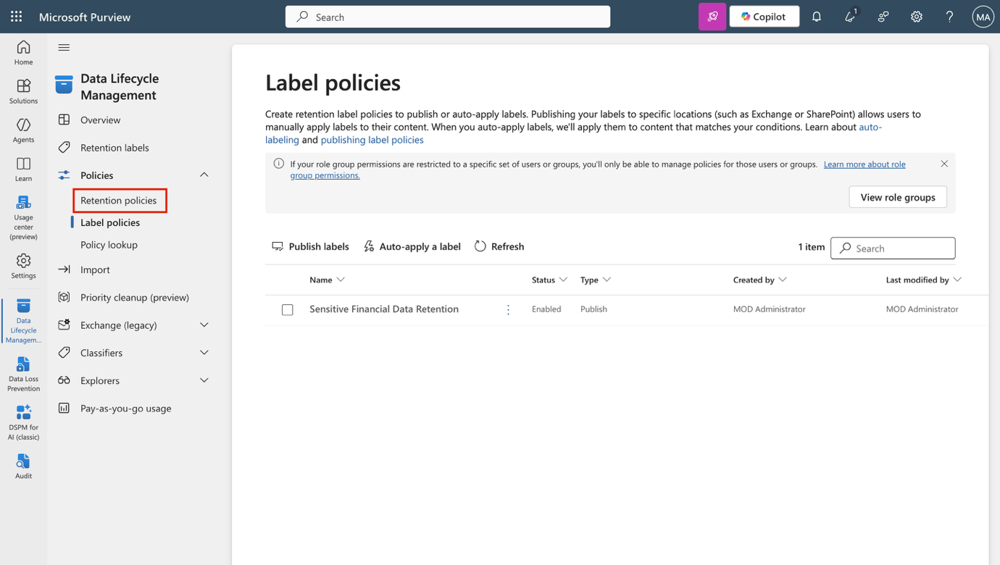

2.  **\[Retention policies\]ページ**で、 **\[New Retention policies\]を選択します**。

> 

3.  **「Name your Retention policies」ページ**で、次のように入力します。

    - **Name**: Teams Retention

    - **Description**: Retains Teams chats and channel messages for 3 years, then deletes them to reduce long-term data risk.

4.  **「Next」**を選択します。

> 

5.  **\[Policy scope\]ページ**で、 **\[Next\]を選択します**。

> 

6.  **\[Choose the type of retention policy to create\]ページ**で、 **\[Static\]を選択し**、 **「Next」を選択します**。

> 

7.  **\[Choose locations to apply the policy\]ページ**で、以下を有効にします。

    - Teams チャネル メッセージ

    - Teamsチャット

    - その他の場所はすべて無効のままにします。

8.  **「Next」**を選択します。

> 

9.  **Decide if you want to retain content, delete it, or both** ページで、保持構成に次の値が設定されていることを確認します。

    - **\[Retain items for a specific period\]**を選択します。

    - **「Retain items for a specific period」**の下で、ドロップダウンリストから**「Custom」を選択します。**

> 

- 年フィールドを3に変更します

- **Start the retention period based on**: When items were last modified

> 

- **At the end of the retention period**: Delete items automatically

10. **「Next」**を選択します。

> 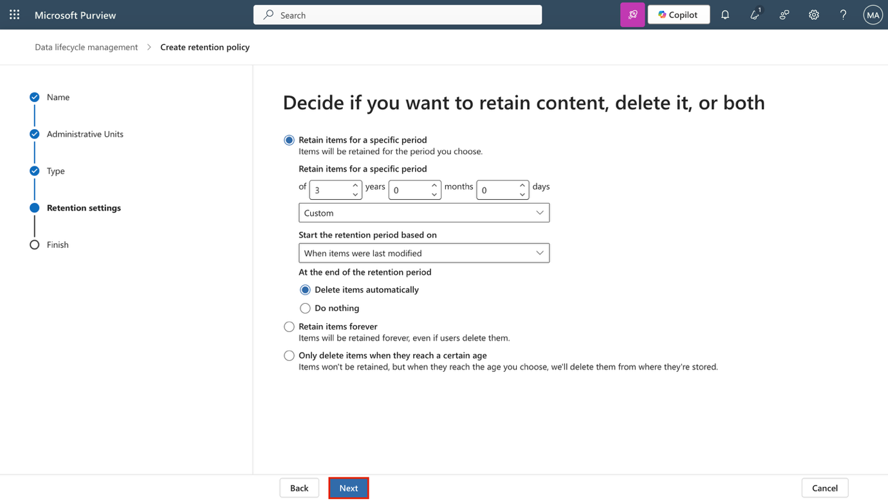

11. **\[Review and finish\]**ページで**\[Submit\]を選択します**。

> 

12. 次に、 **\[You successfully created a retention policy\]ページ**で**\[Done\]を選択します**。

> 

Teams メッセージを 3 年間保持してから自動的に削除する静的Retention policiesを構成しました。

**演習5 – 適応型スコープを作成する**

このタスクでは、リーダーシップと運用の役割に関連付けられた Microsoft 365 グループを対象とする適応型スコープを定義します。

1.  Microsoft Purview で、 **\[Settings** \> **Roles and scopes** \> **Adaptive scopes\] を選択します**。

2.  **「Adaptive scopes」**ページで、 **「+Create scope」を選択します**。

> 

3.  **「Name your adaptive policy scope」**ページで、次のように入力します。

    - **Name**: Leadership and Ops Groups

    - **Description**: Targets Leadership and Operations M365 groups with privileged access to sensitive data.

4.  **「Next」**を選択します。

> 

5.  **Assign admin unit** ページで、 **「Next」を選択します**。

> 

6.  **\[What type of scope do you want to create?\]**ページで**\[Microsoft 365 Groups\]を選択し**、 **「Next」を選択します**。

> 

7.  **「Create the query to define users」**ページの**「User attributes」セクション**で、ユーザー属性の構成に次の値が選択されていることを確認します。

    - **Attribute**ドロップダウンを選択し、Nameを選択します。

> 

- 次のフィールドの値はデフォルト**のままにしておきます**

- LeadershipをValueとして入力します。

8.  **「Create the query to define users」ページ**で**「+ Add attribute」**を選択して、2 番目の属性を追加します。

> 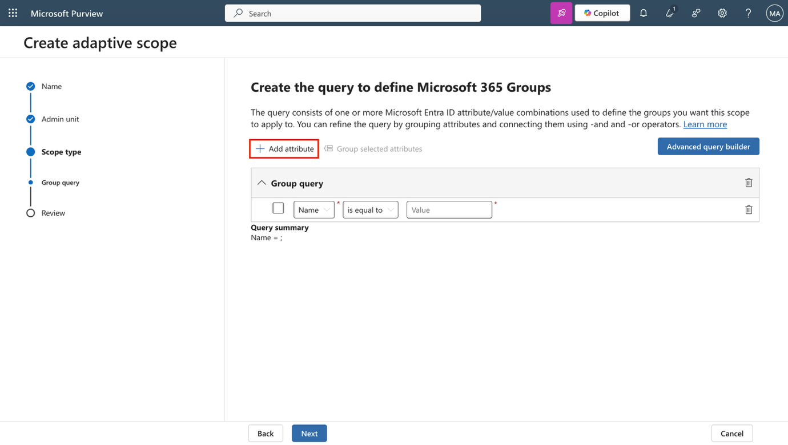

9.  先ほど設定したフィールドの下の新しいフィールドで、次の値を設定します。

    - クエリ演算子のドロップダウンを選択し、 And から**Orに更新します**。

> 

- **Attribute**ドロップダウンを選択し、 **Nameを選択します**。

> 

- 次のフィールドの値はデフォルト**のままにしておきます**

- **Value**としてOperationsを入力します

10. **「Next」**を選択します。

> 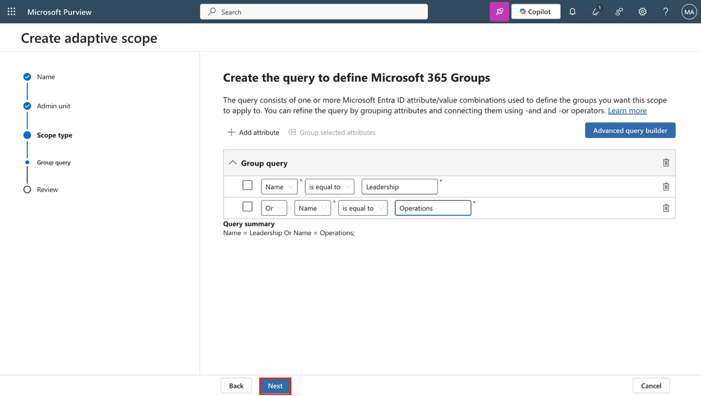

11. **\[Review abd finish\]**ページで**\[Submit\]を選択します**。

> 

12. Adaptive scopeが作成されたら、\[**Your scope was created\]ページ**で**\[Done\]を選択します**。

> 

組織内の特権グループのターゲット保持をサポートするAdaptive scopeを作成しました。

**演習6 – Adaptive Retention policiesを作成する**

このタスクでは、作成したAdaptive scopeを使用して、機密性の高い責任を負う Microsoft 365 グループのRetention policiesを構成します。

1.  Microsoft Purviewで、**Solutions** \> **Data Lifecycle Management** \> **Policies** \>  **Retention policiesに移動します。** 

2.  **\[Retention policies\]ページ**で、 **\[+New Retention policies\]を選択します**。

> 

3.  **「Name your retention policy」**ページで次のように入力します。

    - **Name**: Privileged Group Retention

    - **Description**: Retains content from Leadership and Operations groups for 5 years to support audit and investigation.

4.  **「Next」**を選択します。

> 

5.  **\[Policy Scope\]**ページで**「Next」を選択します**。

> 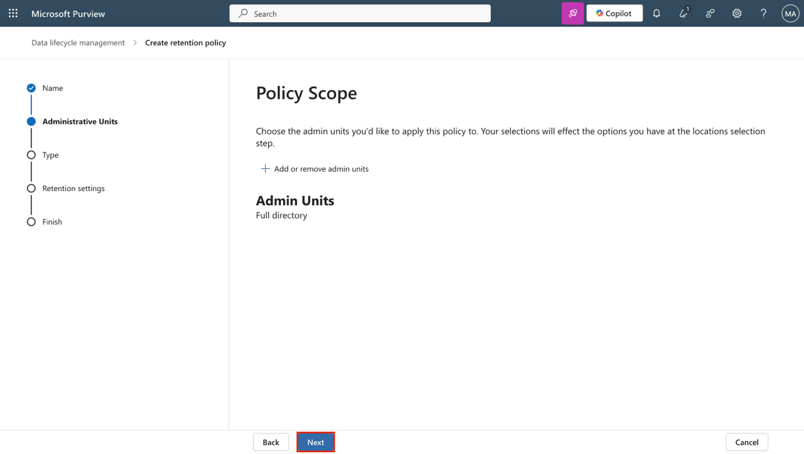

6.  **Choose the type of retention policy to create** ページで、Adaptive**を選択し**、Next**を選択します**。

> 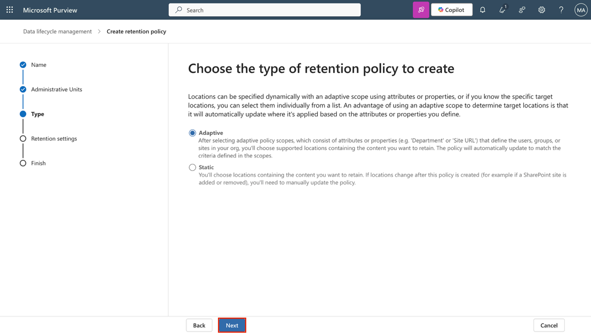

7.  **\[Choose adaptive policy scopes and locations\]**ページで、 **\[+Add scopes\]を選択します**。

> 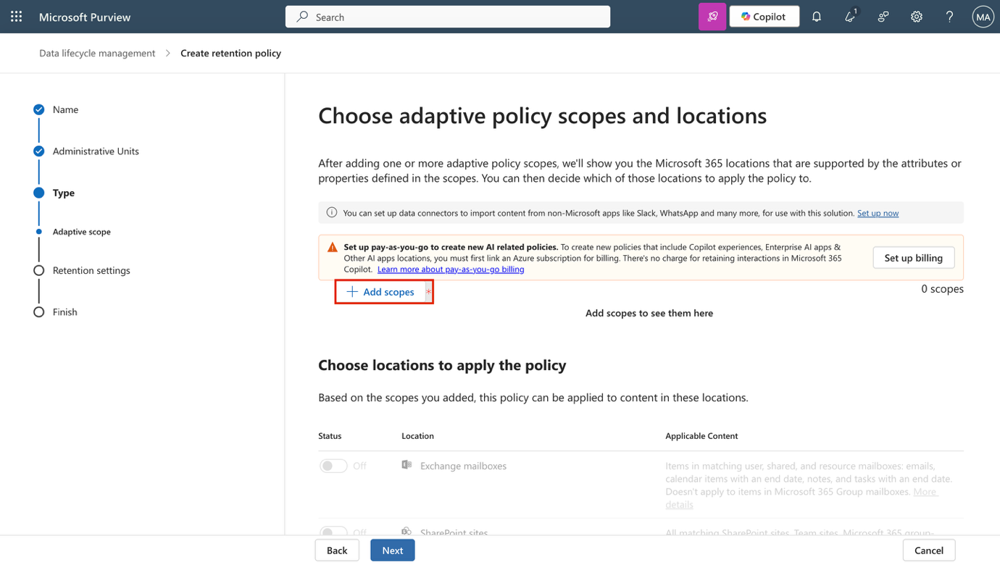

8.  **\[Choose adaptive policy scopes\]フライアウト パネル**で**、\[Leadership and Ops Groups** **\]**のチェック ボックスをオンにし、パネルの下部にある**\[Add\]**を選択します。

> 

9.  **Choose locations to apply the policy** に戻り、以下を有効にします。

    - Microsoft 365 Group mailboxes & sites

    - その他の場所はすべて無効のままにします。

10. **「Next」**を選択します。

> 

11. **Decide if you want to retain content, delete it, or both** ページで、保持構成に次の値が設定されていることを確認します。

    - **\[Retain items for a specific period\]**を選択します。

    - **「Retain items for a specific period」**の下で、ドロップダウンリストから**5 yearsを選択します。**

    - **Start the retention period based on**: When items were last modified

    - **At the end of the retention period**: Delete items automatically

12. **「Next」**を選択します。

> 

13. **\[Review and finish\]**ページで**\[Submit\]を選択します**。

> 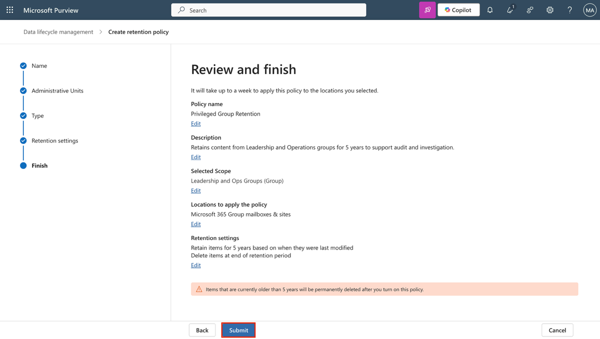

14. ポリシーが作成されたら、 **\[Done\]**を選択します。

> 

特権グループが所有するコンテンツに適用され、削除されるまで 5 年間保持されるRetention policiesを作成しました。

**演習7 – SharePointコンテンツの回復**

このタスクでは、SharePoint サイトから削除されたドキュメントの復元をシミュレートして、回復オプションを検証します。

1.  VM にログインしたまま、Microsoft Purview で Patti Fernandez としてログインしている必要があります。

2.  左上隅にあるアプリ ランチャー (グリッド アイコン) を選択し、サブメニューから \[**More apps\]を選択します。**

> 

3.  **SharePoint**を選択します。

> 

4.  SharePoint ランディング ページで「Benefits」を検索し、検索結果から**「Benefits @ Contoso」**を選択します。

> 

5.  左側のサイドバーで**\[Documents\]を選択します**。

> 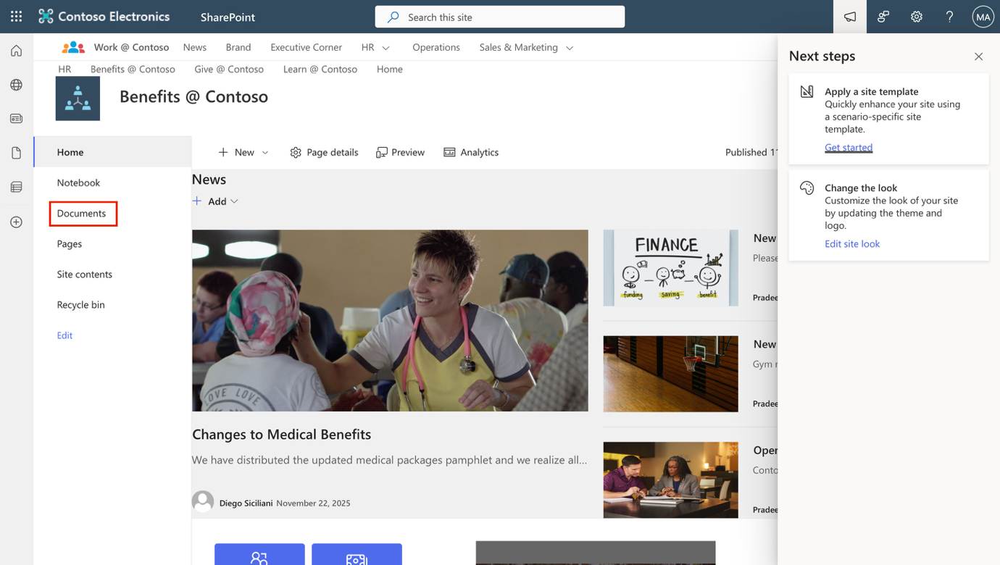

6.  **\[Documents\]ページ**で、 **Vacation Policies.pptx**のチェックボックスをオンにし、アクション バーから**\[Delete\]を選択します。**

> 

7.  **\[Delete?\]ダイアログ**で、 **\[Delete\]を選択します**。

> 

8.  左側のサイドバーで、 **\[Recycle bin\]を選択します**。

> 

9.  **\[Recycle bin\]ページ**で、 **Vacation Policies.pptx**を右クリックし、 **\[Restore\]を選択します**。

> 

10. 左側のサイドバーで**「Documents」を選択し**、ファイルが復元されていることを確認します。

> 

削除されたドキュメントを SharePoint サイトから正常に復元しました。
