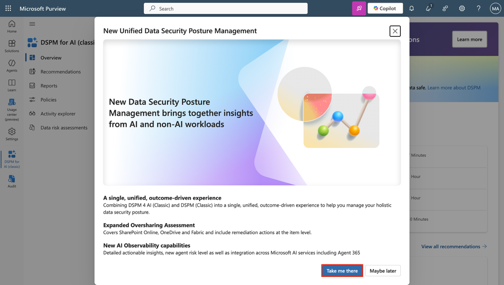
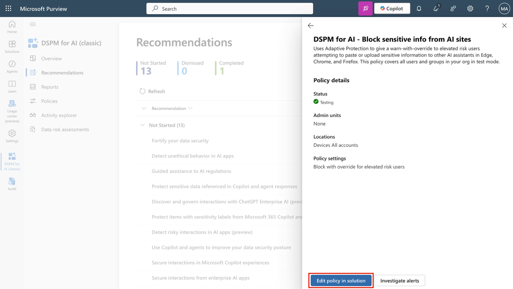
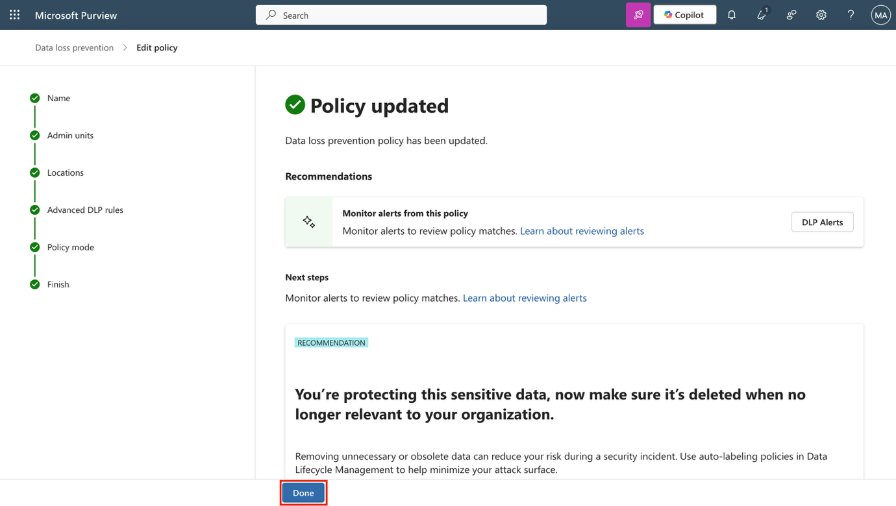

**ラボ 14 – DSPM FOR AI を使用してエージェントと AI アプリを保護する**

Contoso Ltd.の情報セキュリティ管理者、Patti Fernandezです。Microsoft CopilotなどのAIツールが日常のワークフローにますます統合されるにつれ、あなたのチームは機密データの保護を評価・改善するよう求められています。このラボでは、Microsoft Purview DSPM for AIがポリシー適用、リスク検出、そしてエクスポージャー評価を通じて、AIツールとのデータインタラクションのセキュリティ確保にどのように役立つかを学びます。

**タスク**:

- DSPM for AI を使用して生成 AI サイトの DLP ポリシーを作成する

- 危険な AI 相互作用を検出するためのインサイダーリスクポリシーを作成する

- AIアプリにおける非倫理的な行動を検出する

- データ評価を実行してラベルのないコンテンツを検出する

**タスク 1 – DSPM for AI を使用して生成 AI サイトの DLP ポリシーを作成する**

AIアシスタントによるデータ損失のリスクを軽減するには、まず「データセキュリティの強化」推奨事項に基づいてDLPポリシーを作成します。このポリシーは、Adaptive Protectionを使用して、Edge、Chrome、FirefoxのChatGPTやCopilotなどのAIツールへの機密データの貼り付けやアップロードを制限します。

1.  管理者として VM にサインインします。

2.  **Microsoft Edge**で、 https://purview.microsoft.comに移動し、 **Patti Fernandez** 、 Pattif@TenantNameとしてサインインします。

3.  Microsoft Purviewで、 **「Solutions** \> **DSPM for AI** \> **Recommendations」を選択して、DSPM for AIに移動します。**

> 

4.  **「Fortify your data security」推奨事項**を選択します。

> 

5.  **「Data security for AI」ポップアップページ**で概要を確認し、 **「Create policies」を選択します**。これにより、Generative AIサイトを対象とした事前構成済みのDLPポリシーが作成されます。

> 

6.  「'Block elevated risk users from pasting or uploading sensitive info on AI sites」ポリシーが作成されます。他の2つは従量課金制であるため、このテナントには作成されません。ポリシーが作成されたら、 **「Policy details」を選択してください**。

> 

7.  **\[Policy details\]セクション**で、 **\[Edit policy in solution\]を選択して、** Microsoft Purview で**Data Loss Prevention ソリューション**を開きます。

> 

8.  **「Choose where to apply the policy」ページ**が表示されるまで**「Next」**を選択します。

> 

9.  ポリシーのスコープが**Devicesに設定されていることを確認します**。 **「Next」を選択します**。

1.  **\[Customize advanced DLP rules\]ページ**で、 **\[Block with override for elevated risk users\]**の横にある鉛筆アイコンを選択してルールを表示します。

1.  DSPM for AI によって作成されたルールの構成を確認します。

    - **\[Conditions\]**で、含まれるSensitive info typesと、ルールが高められたリスクに基づいてAdaptive Protection**を使用していることに注意してください**。

> 

- **\[Actions\]**の\[アップロード\] および \[貼り付け\] アクティビティの両方で、 **\[Sensitive service domain group restriction(s)\]**の横にある**\[Edit\] を選択します**。

> 

- サービス ドメイン グループ構成で、 **Generative AI Websitesが\[Block with override\]**に設定されていることを確認します。

> 

- パネルを閉じるには、 **「Close」**を選択します。

> 

2.  変更せずにルール エディターを終了するには、 **\[Cancel\]**を選択します。

1.  **\[Customize advanced DLP rules\]ページ**に戻り、 **\[Next\]を選択します**。

1.  **\[Policy mode\]ページ**で、 **\[Turn the policy on if it's not edited within fifteen days of simulation\]を選択し**、 **\[Next\]を選択します**。

1.  **\[Review and Finish\]**ページで**\[Submit\]を選択し**、 **\[Done\]を選択します**。

高リスクのユーザーがGenerative AI サイトで機密データを共有することをブロックするポリシーを作成し、DSPM for AI によって設定されたポリシー構成を確認しました。

**「Solutions** \> **DSPM for AI** \> **Recommendations」**を選択することで、残りのポリシーを確認できます。ご自身のテナントまたはユーザーIDで従量課金制をご利用の場合は、次の演習に進んでください。

**タスク2 – 危険なAIインタラクションを検出するためのインサイダーリスクポリシーを作成する**

Copilot で危険なプロンプト動作を検出するのに役立つポリシーを作成します。

1.  Microsoft Purview で、 **\[Solutions\]** \> **\[DSPM for AI\]** \> **\[Recommendations\]**を選択して、 **DSPM for AIに移動します**。

2.  **「Detect risky interactions in AI apps (preview)」推奨事項**を選択します。

3.  **\[Detect risky interactions in AI apps (preview)\]フライアウト ページ**で概要を確認し、 **\[Create policy\] を選択します**。

4.  ポリシーが作成されたら、 **\[View policy\]を選択します**。

5.  **\[Policy details\]セクション**で、 **\[Edit policy in solution\]を選択して、** Microsoft Purview の**Insider Risk Management領域**を開きます。

6.  **\[Policies\]ページ**で、 **DSPM for AI - Detect risky AI usage** **ポリシー**を見つけて選択します。

7.  フライアウトで**\[Edit policy\]を選択して、**完全なポリシー構成を確認します。

8.  **\[Choose a policy template\]ページ**で、ポリシーが**Risky AI usage (preview)**テンプレートを使用していることを確認します。

9.  **「Choose triggering event for this policy page」ページが表示**されるまで**「Next」**を選択します。トリガーイベントが**「User account deleted from Microsoft Entra ID」であることを確認します**。これは、危険な AI アクティビティの前後に発生する可能性のある、オフボード関連のリスクを示しています。

10. **「Next」**を選択します。

11. **\[Indicators\]ページ**で、インジケーターのカテゴリを展開して、選択されているシグナルを確認します。

    - Generative AIウェブサイトを閲覧

    - Copilotから敏感な反応を受け取った

    - Copilotで危険なプロンプトを入力

12. **「Review and finish」ページが**表示されるまで**「Next」**を選択し、 **「Cancel」**を選択して変更を加えずにエディターを終了します。

行動の早期兆候を特定できるように、プロンプトや応答などの危険な AI インタラクションを検出するポリシーを作成しました。

**タスク3 – AIアプリにおける非倫理的な行動の検出**

Microsoft 365 Copilot やその他の AI アプリケーションにおける非倫理的または不適切な動作を検出するためのポリシーを DSPM for AI で作成します。

1.  Microsoft Purview で、 **\[Solutions\]** \> **\[DSPM for AI\]** \> **\[Recommendations\]**を選択して、 **DSPM for AIに移動します**。

2.  **「Detect unethical behavior in AI apps」推奨事項**を選択します。

3.  フライアウトで、このポリシーが構成する内容の概要を確認します。

    - デフォルトのポリシー名は、 **「DSPM for AI – Unethical behavior in AI apps」です**。

    - このポリシーは、Microsoft 365 Copilot やその他の AI エージェントのプロンプトと応答内の機密情報や不適切な情報を検出します。

    - これは組織内のすべてのユーザーとグループに適用されます。

4.  通信コンプライアンス ポリシーを作成するには、\[**Create policy\]**を選択します。

5.  **「Policy successfully created」ページ**で、 **\[X\]を選択して**フライアウトを閉じます。

6.  \[Recommendations**\]**ページが更新され、 **\[Detect unethical behavior in AI apps\] 推奨事項が\[Completed\]**に移動します。

7.  左側のナビゲーションで、 **\[Policies\]を選択します**。

8.  新しく作成された**DSPM for AI – Unethical behavior in AI apps** ポリシーを選択し、その構成とステータスを確認します。

9.  **DSPM for AI - AI アプリにおける非倫理的な動作**ページで、 **Xを選択して**フライアウトを閉じます。

Contoso が Copilot を責任を持って使用し続けることができるように、AI アプリケーションにおける非倫理的なアクティビティを検出するポリシーを作成しました。

**ラベル付けされていないコンテンツを検出するためのデータリスク評価を作成する**

ラベル付けの範囲における潜在的なギャップを理解するために、データ リスク評価を実行し、Copilot によってアクセスされる可能性のある機密ラベルのないファイルを特定します。

1.  **DSPM for AI**で、 **「Protect sensitive data referenced in Copilot and agent responses」**という推奨事項を選択します。

2.  **Protect sensitive data referenced in Copilot and agent responsesペイン**で概要を確認し、**評価に移動 を選択します**。

3.  **Data risk assessments** **ページ**で、**Create custom assessmentを選択します。**

4.  **「Basic details」ページ**で、以下を入力します。

    - **Name**: Unlabeled File Exposure Assessment

    - **Description**: Identifies files without sensitivity labels that may be exposed in Microsoft 365 Copilot responses and provides recommendations to reduce oversharing risks.

5.  **「Next」**を選択します。

6.  **\[Add users\]ページ**で、 **\[All\]を選択し**、 **\[Next\]を選択します**。

7.  **\[Add data sources to assess\]ページ**で、 **SharePoint**の既定の場所を選択したままにして、 **\[Next\]を選択します**。

8.  **Review and run the data assessment scanページ**で、**保存して実行を選択します**。

9.  **Data assessment successfully createdページ**で、 **\[Done\]を選択します**。

これで、Microsoft Purview DSPM for AI を使用して AI 関連のリスクを検出し、ポリシーを適用し、機密データの露出を評価し、組織が AI を安全に使用できるように支援できるようになりました。
