**ラボ 2 – Sensitive Information Typesの管理**

**導入**

Contoso Ltd. では以前、チケット ソリューションでサポート チケットを処理する際に、従業員が顧客の個人情報を誤って送信してしまうという問題がありました。

今後のユーザー教育のため、メールや文書に含まれる従業員ID（大文字3文字と数字6桁）をSensitive Information Typesで識別するためのカスタムSensitive Information Typesが必要となります。誤検出率を下げるため、「Employee」と「ID」というキーワードを使用します。

**目的**

- 正規表現とキーワード リストを使用して、**カスタムのSensitive Information Types**を作成します。

- **EDM-based sensitive info type**を構成および定義します。

- **EDM アップロード エージェント**にアップロードします。

- 機密性の高い健康関連の用語を識別するために、**キーワード辞書ベースのSensitive Information Types**を構築します。

- カスタムのSensitive Info Typesをポリシーに適用する前に、その正確性をテストして検証します。

**演習1 – カスタムSensitive Information Typesの作成**

この演習では、**Security & Compliance Center PowerShell** モジュールを使用して、キーワード「Employee」および「ID」の近くにあるEmployee ID のパターンを認識する新しいカスタムSensitive Info Typesを作成します。

1.  Edge ブラウザーで InPrivate ウィンドウを開き、アドレス バーに次の URL を入力してMicrosoft Purview ポータルを開きます: https://purview.microsoft.com 。次に、ユーザー名**PattiF@TenantName**とリソース タブに指定されているユーザー パスワードを使用して**Patti Fernandez**としてログインします。

> 
>
> 

2.  **「Welcome to the new Microsoft Purview protal!** **」**ダイアログボックスが表示されたら、「**Get Started**」ボタンをクリックし**ます**。

> 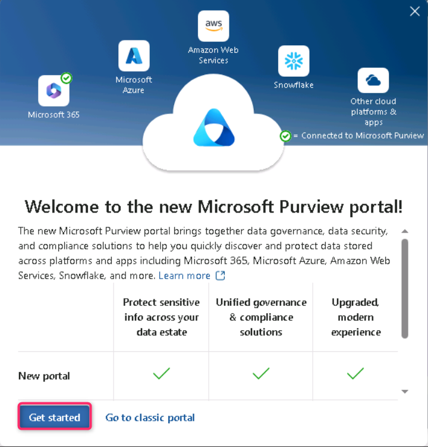

3.  左側のナビゲーションから、 **\[Solutions\]** \> **\[Data Loss Prevention\]**を選択します。

> 
>
> **注：**Solutionsリストに**Data Loss Preventionが**表示されない場合は、数分待ってからページを再度アップロードしてください。それでもSolutionsリストにData Loss Preventionが表示されない場合は、通常のブラウジングウィンドウを使用してログインしてください。

4.  左ペインから**「Classifiers」**を選択します。サブナビゲーションペインから**「Sensitive Info Types」**を選択します。 **「+Create Sensitive Info Types」**を選択して、新しいSensitive Info Typesを作成するためのウィザードを開きます。

> 

5.  **「Name your sensitive info type」**ページで、次の情報を入力します。

    - **Name**: Contoso Employee IDs

    - **Description**: Pattern for Contoso employee IDs

6.  **「Next」**を選択します。

> 

7.  **\[Define patterns for this sensitive info type\]**ページで、 **\[Create pattern\]**を選択します。

8.  右側に表示される**\[New pattern\]**ペインで、 **\[Add primary element** **\]**を選択し、 **\[Regular expression\]**を選択します。

9.  新しい右側のペイン**「Add a regular expression」**で、次のように入力します。

    - **ID** : Contoso ID

    - **Regular expression**: \s\\A-Z\\{3}\\0-9\\{6}\s

    - **String match**を選択

10. **\[Done\]**を選択します。

11. \[New pattern\] ペインで、**Character proximity値**を***100***文字に減らします。

> 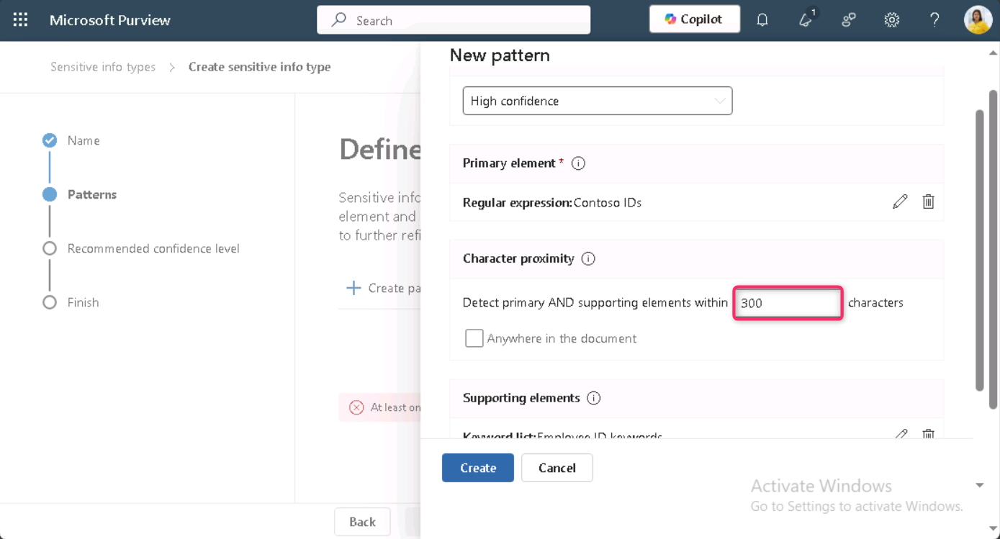
>
> 

12. **「Supporting elements」**見出しに移動し、 **「+ Add supporting elements or group of elements」**ドロップダウン メニューをクリックして、 **「Keywork list」**を選択します。

> 

13. **\[Add a keyword list\]**ペインで、次のように入力します。

    - **ID**: Employee ID keywords

    - **Case insensitive**:Employee ID

> 

14. **「Word match」の**横にあるラジオボタンを選択します。次に、 **「Done」**ボタンをクリックします。

> 

15. 次に、**「Create」**ボタンをクリックします。

> 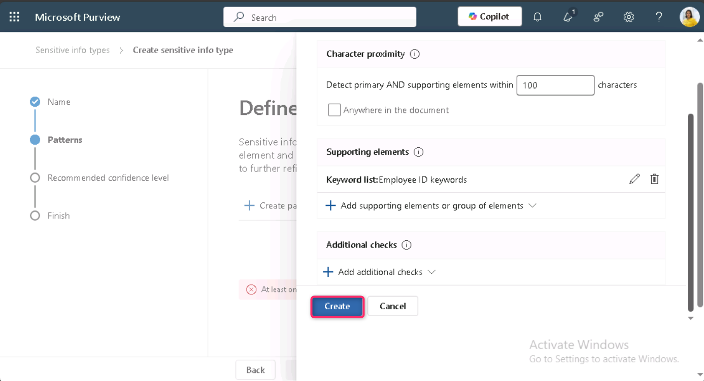

16. **Define patterns for this sensitive info type** ページに戻り、 **\[Next\]**を選択します。

> 

17. **\[Choose the recommended confidence level to show in compliance policies\]**ページで、既定値を使用して**\[Next\]**ボタンを選択します。

> 

18. **「Review settings and finish」**ページで設定を確認し、 **「Create」**を選択します。正常に作成されたら、 **「Done」**を選択します。

> 
>
> 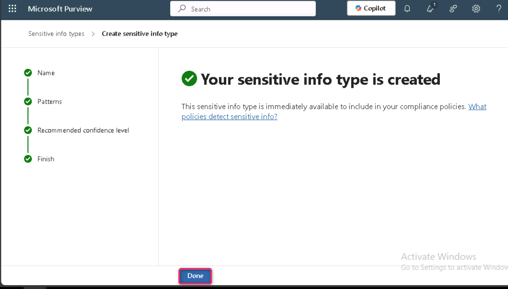

19. ブラウザウィンドウを開いたままにしておきます。

100 文字の範囲内で 3 つの大文字、6 つの数字、およびキーワード「Employee」または「ID」のパターンでEmployee ID を識別するための新しいSensitive Info Typesを正常に作成しました。

**演習2 – EDMベースの分類情報タイプの作成**

追加の検索パターンとして、従業員データのデータベーススキーマを使用して、EDMベースの分類を作成します。データベースソースファイルは、従業員の以下のデータフィールド（名前、生年月日、住所、従業員ID）でフォーマットされます。

1.  「Solutions」をクリックし、 **「Data Loss Prevention」**を選択します**。**

> 

2.  **「Classifiers」**をクリックし、 **「EDM classifiers」**を選択します。EDM CLASSIFIERSページで、 **「New EDM experience」の**横にあるトグルボタンをクリックして**Off**にします。

> 

3.  次に、 **「Create** **EDM schema」をクリックします** 

4.  **Name**フィールドにemployeedbと入力します。

5.  **Description**フィールドに「従業員データベーススキーマ」と入力します。**すべてのスキーマ フィールドの区切り文字と句読点を無視するの**チェックを外します。

> 
>
> 

6.  最初のスキーマ フィールド名に「名前」と入力し、「**フィールドは検索可能です」**ボックスをオンにします。

> 

7.  **\[無視する区切り文字と句読点を選択\]**のドロップダウンをクリックし、 **\[ハイフン\]** 、 **\[ピリオド\]** 、 \[**スペース\]** 、 **\[開き括弧\]** 、 **\[閉じ括弧\]**を選択します。

> 

8.  下端から**+ スキーマ データ フィールドの追加を**選択します。

> 

9.  **スキーマ フィールド名**で、**スキーマ フィールド \#2の下に**「生年月日」と入力します。

10. もう一度、下端から**「+ スキーマ データ フィールドの追加」**を選択します。

11. **スキーマ フィールド名**で、**スキーマ フィールド \#3の下に**StreetAddressと入力します。

12. 最後に、下端から**+ スキーマ データ フィールドの追加を**選択します。

13. **スキーマ フィールド名**で、**スキーマ フィールド \#4の下に**EmployeeIDと入力します。

14. 選択した**フィールドは検索可能です**。

15. **\[保存\]**を選択します。

> 

16. 左側のペインから**EDM Sensitive Info Types**を選択し、 **+ EDM Sensitive Info Typesの作成を選択して、 EDM ルール パッケージウィザード**を開きます。

> 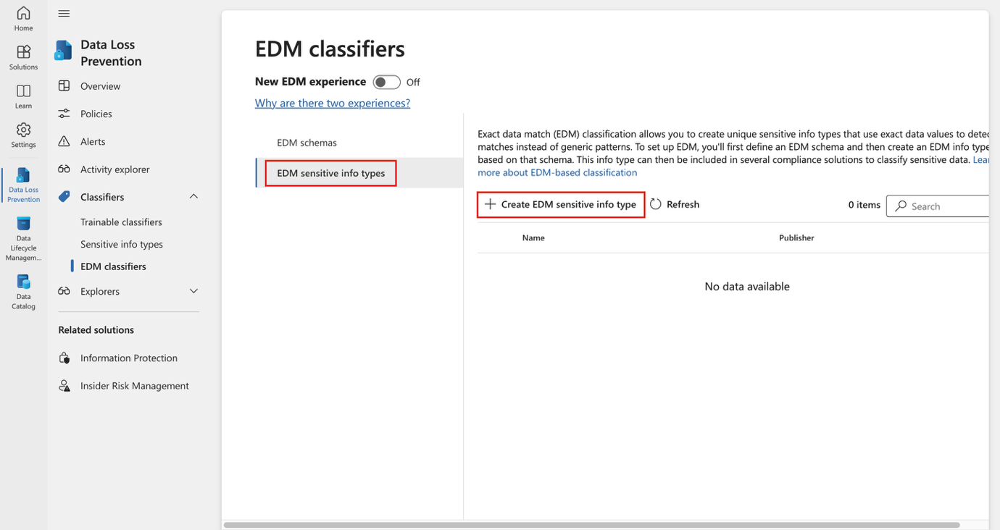

17. **\[データ ストア スキーマの定義\]ページ**で、 **\[既存の EDM スキーマを選択\]を選択します**。

> 

18. **employeedb**を選択し、**追加を選択します**。

> 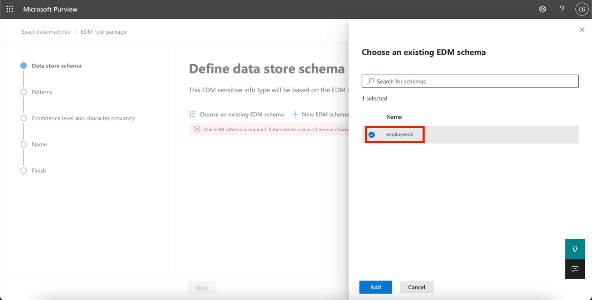

19. データ ストア スキーマを確認し、 **\[次へ\]を選択します**。

> 

20. **この EDM Sensitive Info Typesのパターンの定義ページ**で、 **+ パターンの作成を選択します**。

> 

21. 右側の \[**新しいパターン\]ペイン**の**\[プライマリ要素\]**フィールドで、 ***EmployeeIDを選択します***。

22. **プライマリ要素のSensitive Info Types**の下で、**Sensitive Info Typesを選択を選択します**。

> 

23. **検索**バーに「Contoso」と入力し、Enter キーを押します。

24. **Contoso 従業員 ID**を選択し、 **\[完了\]を選択します**。

25. **\[完了\]**を選択します。

> 

26. *この EDM Sensitive Information Typesのパターンを定義する画面*で**次へ**を選択します。

> 

27. **推奨される信頼度レベルと文字の近接性を選択する**場合は、デフォルト値をそのままにして、 **\[次へ\]を選択します**。

> 

28. **EDM のSensitive Info Typesの名前と説明のページ**で、名前として「Contoso Employee EDM」と入力します。

29. **管理者向けの説明欄**に、従業員の個人情報のEDMベースのSensitive Info Typesを入力します。 **次。**

> 

30. 設定を確認して、 **\[送信\]を選択します**。

> 

31. **EDM のSensitive Info Typesが作成されましたページ**で、 **\[完了\]を選択します**。

> 

32. Microsoft Purview ポータルでブラウザを開いたままにしておきます。

データベース ファイル ソースから従業員データを識別するための新しい EDM ベースの分類Sensitive Information Typesが正常に作成されました。

**演習3 – EDMベースの分類データソースの作成**

EDM ベースの分類を機密データを含むデータベースに関連付けるには、次に、EDM UPLOAD AGENT ツールを使用してSensitive Information Typeの実際のデータをハッシュしてアップロードする必要があります。

1.  **Microsoft Edge**ブラウザーで、 https://go.microsoft.com/fwlink/? linkid=2088639 にアクセスして、EDM ダウンロード エージェントをダウンロードします。

2.  **Open file**リンクをクリックして、 **EdmUploadAgent.msi**にアクセスします。

> 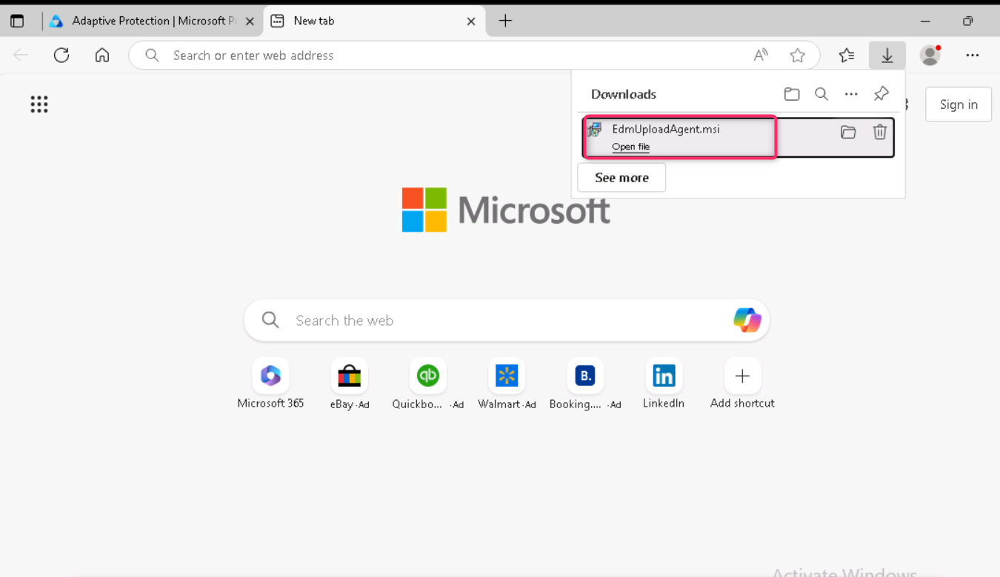

3.  **\[Welcome to the Microsoft Exact Data Match Upload Agent Setup Wizard** **\]**ダイアログ ボックスで、 **\[Next\]**ボタンをクリックします。

> 

4.  **Microsoft Exact Data Match Upload Agent Setup** wizardで、 **\[Next\]**を選択します。

    - **\[I accept the terms in the License Agreement\]**を選択し、 **\[Next\]**を選択します。

    - **Destination Folder** のパスを変更せず、 **\[Next\]**を選択します。

    - **\[Install\]**を選択します。

    - **\[User Account Control\]**ウィンドウが開いたら、 **\[Yes\]**を選択します。

    - ログインを求められた場合は、 **Patti の**アカウントを使用してログインします。

    - インストールが完了したら、 **\[Finish\]**を選択します。

5.  次に、Windowsアイコンを右クリックし、ファイル名を指定して「**Run」**をクリックします**。「Run」**ダイアログボックスに「notepad」と入力し、 「**OK」**ボタンをクリックします。

> 
>
> 

6.  メモ帳に次のテキストを入力します。

> Name,Birthdate,StreetAddress,EmployeeID
>
> Patti Fernandez,01.06.1980,1Main Street,CSO123456
>
> Christie Cline,31.01.1985,2Secondary Street,CSO654321
>
> 

7.  Fileを選択し、EmployeeData.csv として保存します。

8.  **\[Save as type\]**のドロップダウンを選択し、 **\[All files\] (*.*)**を選択します。

9.  **Encoding**フィールドで、 **UTF-8**が選択されていることを確認し、 **\[Save\]**ボタンをクリックします。

> 

10. Notepadウィンドウを閉じます。

11. タスクバーの**Windows**アイコンを右クリックし、 **「Windows PowerShell (Admin)」**を選択して管理者として実行します。

> 

12. **「User Account Control」**ダイアログ **ボックス**で、 **「Yes」**ボタンをクリックします。

> 

13. EDM Upload Agent ディレクトリに移動します。

> cd "C:\Program Files\Microsoft\\ EdmUploadAgent "
>
> 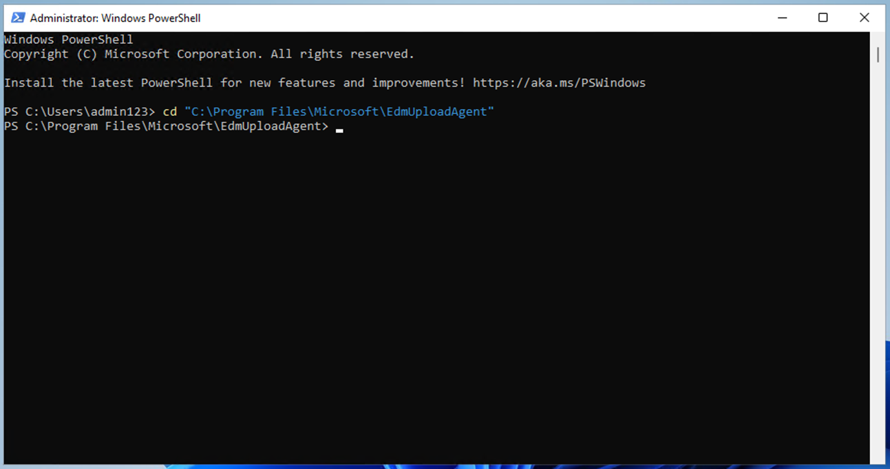

14. 次のコマンドレットを実行して、アカウントでデータベースをテナントにアップロードすることを承認します。

> .\EdmUploadAgent.exe /承認
>
> 

15. **\[Pick an account\]**ウィンドウが表示されたら、ユーザー名**PattiF@TenantName**とResourcesタブで指定したユーザー パスワードを使用して、 **Patti Fernandez**としてログインします。(またはリセットした新しいパスワード)

> 
>
> 

16. PowerShell で次のスクリプトを実行して、EDM ベースの分類Sensitive Information Typeのデータベース スキーマ定義をダウンロードします。

> .\EdmUploadAgent.exe /保存スキーマ/データストア名 従業員データベース/出力ディレクトリ"C:\Users\Admin\Documents\\
>
> **注**：最後のコマンドが失敗した場合、 **EDM_DataUploaders**グループのメンバーシップが適用されるまでさらに時間がかかる可能性があります。スキーマファイルのダウンロードが可能になるまで、最大1時間かかる場合があります。失敗した場合は、次のタスクに進み、後でこの手順に戻ってください。または、VM 上のドキュメントフォルダへのパスを確認してください。
>
> 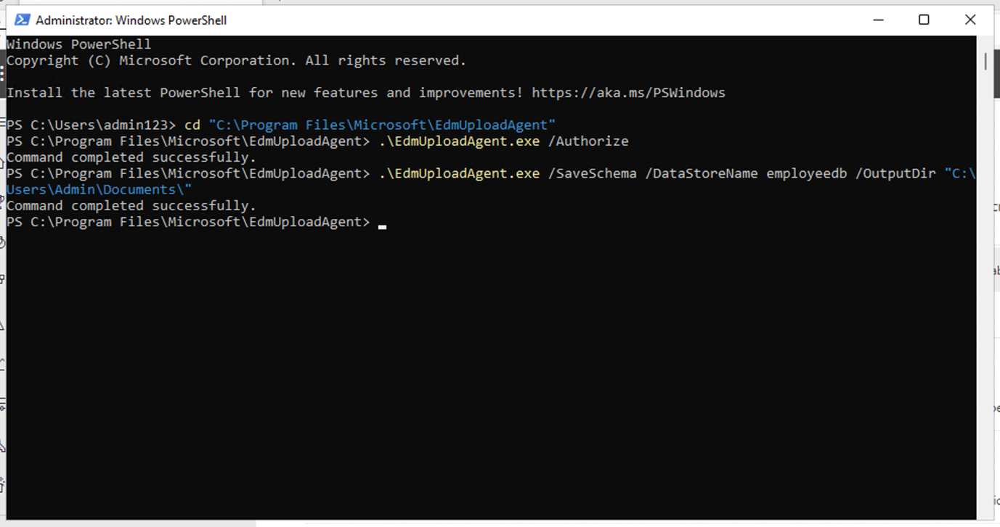

17. PowerShell で次のスクリプトを実行して、データベース ファイルをハッシュし、EDM ベースの分類Sensitive Information Typeにアップロードします。

.\EdmUploadAgent.exe /UploadData /DataStoreName employeedb /DataFile C:\Users\Admin\Documents\EmployeeData.csv /HashLocation "C:\Users\Admin\Documents\\ /Schema "C:\Users\Admin\Documents\employeedb.xml"

\

\*\*Note:\*\* If you get the following errors

Error Type: System.IO.FileNotFoundException

Error Message: Unable to find the specified file.

\*\*Check the path where you saved the file EmployeeData.csv\*\*

\

19. 状態が完了に変わるまでアップロードの進行状況を確認し、次の PowerShell コマンドを実行します。

> .\EdmUploadAgent.exe /GetSession /DataStoreName employeedb
>
> 

EDMベースの分類Sensitive Information Typeのデータベース ファイルをハッシュしてアップロードしました。

**演習4 – キーワード辞書の作成**

同僚が病欠を報告した後にユーザーがメールを送信した際に、個人情報漏洩の違反が複数発生しました。その際、病欠の理由が公表されていました。このような事態は絶対に避けなければなりません。

1.  **Microsoft Edge**で、**新しい InPrivate ウィンドウ**を開き**、** https://purview.microsoft.comに移動して、ユーザー名**PattiF@TenantName**とResourcesタブに指定されているユーザー パスワードを使用して**Patti Fernandez**としてログインします。

2.  左側のナビゲーションから、 **\[Solutions\]** \> **\[Data Loss Prevention\]**を選択します。

> 

3.  左ペインから**「Classifiers」**を選択します。サブナビゲーションペインから**「Sensitive Info Types」**を選択します。 **「+Create Sensitive Info Types」**を選択して、新しいSensitive Info Typesを作成するためのウィザードを開きます。

> 

4.  **「Name your sensitive info type」**ページで、次のように入力します。

    - Name: Contoso Diseases List

    - Description: List of possible diseases of employees.

> 

5.  **「Next」**を選択します。

6.  **\[Define patterns for this sensitive info type\]**ページで、 **\[+Create pattern\]**を選択します。

> 

7.  **Primary element** の下のドロップダウン フィールドを選択し、**Keyword dictionary**を選択します。

> 

8.  **Add a keyword dictionary**ページで、名前として「 Diseases Dictionary \*」と入力します。

9.  **Keywords**領域に、次のキーワードをそれぞれ別の行に入力します。

> flu
>
> influenza
>
> cold
>
> bronchitis
>
> otitis
>
> 

10. **\[Done\]**を選択します。

11. **\[Supporting elements\]**の下で、 **\[+Add supporting elements or group of elements\]**ドロップダウンを選択し、**keyword list** を選択して、キーワード ディクショナリに追加のサポートを追加します。

> 

12. **「Add a keyword list」**ページで、 **ID**フィールドに「Employee」と入力します。 **「Case insensitive」**ボックスに、以下のキーワードをそれぞれ1行ずつ入力し、 **「Done」**ボタンをクリックします。

> Employee ID
>
> leave
>
> reason
>
> 

13. **\[New pattern\]**ページで構成を確認し、 **\[Create\]**を選択します。

> 

14. **Define patterns for this sensitive info type** で、 **\[Next\]**を選択します。

> 

15. **Choose the recommended confidence level to show in compliance policies** では、既定値をそのままにして、 **\[Next\]**を選択します。

> 

16. **「Review settings and finish」**ページで設定を確認し、 **「Create」**を選択します。プロセスが完了したら、 **「Done」**を選択します。

> 

17. Microsoft Purview ポータルのブラウザ ウィンドウを開いたままにしておきます。

キーワード辞書に基づいて新しいSensitive Information Typeを作成し、誤検知率を下げるためのキーワードを追加しました。次のタスクに進んでください。

**演習 5 – カスタムのSensitive Information Typeの操作**

カスタムのSensitive Information Typeは、ポリシーで使用する前に必ずテストする必要があります。そうしないと、カスタム検索パターンの誤動作によりデータの損失や漏洩が発生する可能性があります。

1.  Windowsアイコンを右クリックし、「**Run」**をクリックします。「**Run**」ダイアログボックスに**「 +++notepad+++」**と入力し、 **「OK」**ボタンをクリックします。

> 
>
> 

2.  Notepadウィンドウに次のテキストを入力します。

> Employee Patti Fernandez with Employee ID ABC123456 is on leave because of the flu/influenza

3.  **\[File\]**を選択し、 \[SickTestDataとして保存\]を選択して**\[Save\]を選択します**。

4.  Notepadウィンドウを閉じます。

5.  **Microsoft Edge**では、Microsoft Purview ポータルのタブがまだ開いているはずです。開いている場合は、それを選択して次の手順に進みます。閉じてしまった場合は、新しいタブでhttps://purview.microsoft.comにアクセスします。ユーザー名**PattiF@TenantName**とResourcesタブに表示されているユーザーパスワードを使用して、 **Patti Fernandez**としてログインします。

6.  左側のナビゲーションペインで**「Solutions」** \> **「Data Loss Prevention」を選択し**、 **「Classifiers」**の下にある「**Sensitive Info Types」を選択します**。右上の**Search**ボックスに「Contoso」と入力し、Enterキーを押します。 **「Contoso Employee ID」をクリックして**右側のペインを開きます。

7.  右側のペインから**「Test」**を選択します。

> 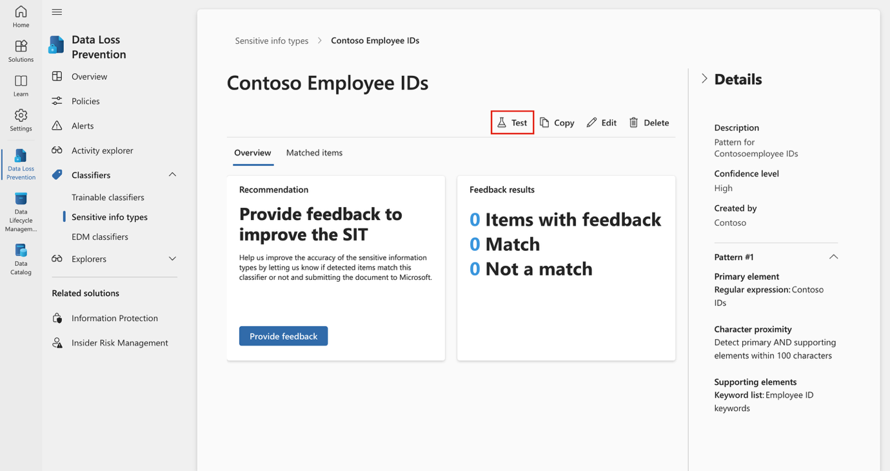

8.  **\[Upload file to test\]**ページで、 **\[Upload file\]**を選択します。

> 

9.  **\[Documents\]**を選択し、 **SickTestData**という名前のファイルを選択して**\[Open\]**を選択します。

> 

10. 分析を開始するには、 **「Test」**を選択します。

> 

11. **「Match results」**ページで、見つかった一致を確認します。

> 

12. **\[Finish\]**を選択し、 **\[X\]**ボタンをクリックしてテスト ページを閉じます。

> 

13. **Data classification**ページに戻り、 **「Contoso Diseases List」**という名前のSensitive Info Typesを選択します。

14. 右側のペインで、 **\[Test\]**を選択します。

> 

15. **\[Upload file to test\]**ページで、 **\[Upload file\]**を選択します。

> 

16. **\[Documents\]**を選択し、 *SickTestData*という名前のファイルを選択して**\[Open\]**を選択します。

17. 分析を開始するには、**「Test」**を選択します。

> 

18. **「Match results」**ページで、見つかった一致を確認します。確認が完了したら、**「Finish」**を選択します**。**

> 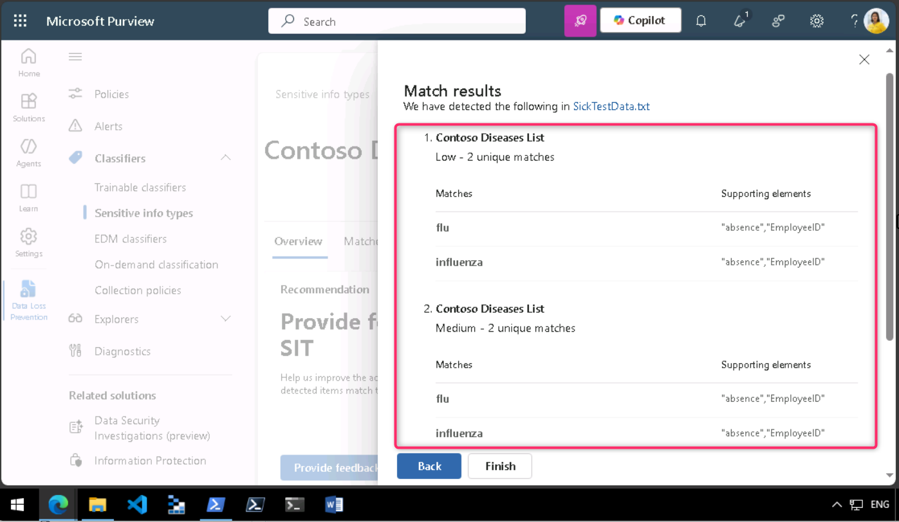

**まとめ：**

このラボでは、正規表現、キーワード辞書、および Exact Data Match (EDM) テクニックを使用して Microsoft Purview でカスタムのSensitive Information Type (SIT) を作成およびテストし、Data Loss Prevention機能を強化する方法を学習しました。
