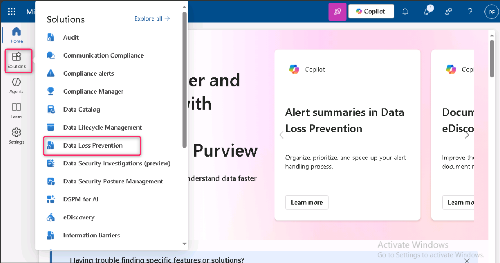

**ラボ3 – トレーニング可能な分類器の管理**

**導入**

Contoso Ltd. テナントには、「Sales and Marketing」という名前の SharePoint サイトコレクションが含まれており、将来的には財務関連のドキュメントやレポートを保存するために利用されます。これらのドキュメントの性質上、これらのファイルを認識してラベルを付けるトレーニング可能な分類子を作成する必要があります。このラボでは、カスタムのトレーニング可能な分類子を有効化し、新しい分類子を作成します。

**目的**

- 選択した SharePoint サイトに保存されている一般的なデータを識別および分類するためのトレーニング可能な分類子を作成します。

**演習1 – 学習可能な分類器の作成**

このタスクでは、Patti は新しいトレーニング可能な分類子を作成し、Contoso Ltd によって作成および保存された一般的なデータを識別するためのさまざまな SharePoint サイトを選択します。

1.  **Microsoft Edge**で、**新しい InPrivate ウィンドウ**を開き、 **+++ [<u>https://purview.microsoft.com+++</u>](https://purview.microsoft.com+++)**に移動し、ユーザー名[**<u>PattiF@WWLxXXXXXX.onmicrosoft.com</u>**](mailto:PattiF@WWLxXXXXXX.onmicrosoft.com)とResources タブに指定されているユーザー パスワードを使用して**Patti Fernandez**としてログインします。

2.  左側のナビゲーションから、 **\[Solutions\]** \> **\[Data Loss Prevention\]**を選択します。

> 

3.  左ペインから**「Classifiers」**を展開します。サブナビゲーションペインから**「Trainable Classifiers」**を選択します。 **「+Create trainable classifier」**を選択して、新しい分類子を作成します。

> 

4.  次の情報を入力してください。

5.  Name: **+++ Contoso Company Data +++**

6.  Description: **+++ Trainable classifier for company data produced and stored by Contoso Ltd.+++**

7.  **「Next」**を選択します。

> 

8.  **\[Choose sites\]**を選択して右側のペインを開きます。

> 

9.  次の SharePoint サイトを選択し、 **\[Add\]**を選択します。

    - Brand

    - Digital Initiative Public Relations

    - Work

    - Sales and Marketing

    - Mark 8 Project Team

> 

10. 選択したサイトがリストに表示されるまで待ってから、 **「Next」**を選択します。

> 

11. **Source of the negative sample contentページ**で、 **「+Choose sites」**をクリックします。

> 

12. **\[Add SharePoint sites\]**ウィンドウで、 **\[Learn\]** の横にあるチェックボックスに移動して選択し、 **\[Add\]**ボタンをクリックします。

> 

13. **「Next」**ボタンをクリックします。

> 

14. 設定を確認し、 **「Create trainable classifier」を選択します**。

> 

15. **Your trainable classifier is being trained** **ページ**で、 **\[Done\]**ボタンをクリックします。

> 

選択した SharePoint サイト内のドキュメントとファイルは現在分析中です。分析には最大 24 時間かかる場合があります。

**まとめ：**

このラボでは、関連するSharePointサイトをポジティブおよびネガティブなコンテンツソースとして選択することで、Microsoft Purviewで*「Contoso Company Data」というトレーニング可能な分類器を作成しました*。この分類器はドキュメントを分析して企業固有のデータを識別します。トレーニングには最大24時間かかります。
