**ラボ4 – Sensitivity Labelsの作成と管理**

**導入**

Contoso Ltd.のInformation Security AdministratorであるPatti Fernandez氏は、組織全体のデータ保護を強化するため、最新のSensitivity Labels付けフレームワークを導入しています。Patti氏は、暗号化、自動ラベル付け、Double Key Encryption（DKE）など、Sensitivity Labelsグループとラベルを作成・公開することで、コンテンツを分類・保護しています。また、Microsoft PurviewとMicrosoft Defender for Cloud Appsを統合し、クラウドに保存されているファイルにもデータ保護制御を拡張する予定です。

**目的:**

- Sensitivity Labelsのサポートを有効にする

- ラベルグループを作成する

- 子ラベルを作成する

- ラベルを公開する

- 自動ラベル付けを設定する

- 機密コンテンツ用のDKEラベルを作成して公開する

- Defender for Cloud Apps で Microsoft Purview の統合を有効にする

- 外部共有ファイルにラベルを付けるファイルポリシーを作成する

**演習1 – Sensitivity Labelsのサポートを有効にする**

このタスクでは、Sensitivity Labelsの共同編集を有効にします。これにより、SharePoint と OneDrive 内のファイルのSensitivity Labelsも有効になります。

1.  **管理者**アカウントを使用して VM にログインする必要があります。

2.  **Microsoft Edge**を開き、 https://purview.microsoft.comに移動して、Patti Fernandes として Microsoft Purview にログインします。

3.  左側のナビゲーションで、 **\[Settings\]** \> **\[Information Protection\]**を選択します。

> 

4.  **\[Information Protection settings\]ページ**で、 **\[Co-authoring for files with sensitivity labels\]**タブが表示されていることを確認します。

5.  **\[Turn on co-authoring for files with sensitivity labels\]**チェックボックスをオンにします。

> 

6.  画面下部の**「Apply」**を選択します。

> 

SharePoint および OneDrive 内のファイルのSensitivity Labelsのサポートが正常に有効になりました。

**演習 2 – Sensitivity Labelsの操作**

**タスク1 – ラベルグループを作成する**

このタスクでは、社内のSensitivity Labelsを整理するためのラベルグループを作成します。ラベルグループは、部門や事業部門の分類など、関連するラベルのコンテナとして機能します。

1.  **Microsoft Edge**で、 https://purview.microsoft.comに移動します。

2.  Microsoft Purview ポータルで、左側のサイドバーから**\[Solutions\]**を選択し、 **\[Information Protection\]**を選択します。

> 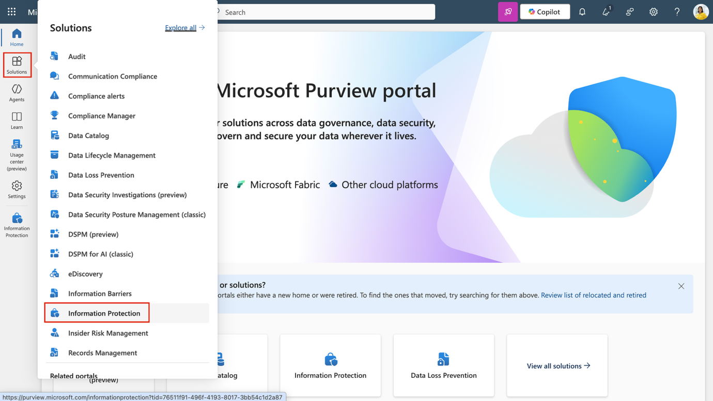

3.  **Microsoft Information Protection**ページの左側のサイドバーで、 **\[Sensitivity labels\]**を選択します。

> 

4.  **Sensitivity labels**ページで、 **+ Create**\>**Label group**を選択します。

> 

5.  **New label group**の設定が開始されます**。 「Provide basic details for this label group」**で、以下を入力します。

    - **Name**: Internal

    - **Display name**: Internal

    - **Description for users**: Internal sensitivity label.

    - **Description for admins**: Internal sensitivity label group for Contoso.

6.  **「Next」**を選択します。

> 

7.  **\[Review your settings and finish\]**ページで、 **\[Create label group\]**を選択します。

> 

8.  **\[Your label group was created successfully\]** ページで、**\[Don't create a label yet\]**を選択し、 **\[Done\]**を選択します。

> 

社内使用のためのラベルグループを作成しました。このグループは、特定の部署やデータカテゴリに関連するラベルを管理するのに役立ちます。

**タスク2 – 子ラベルを作成する**

ラベルグループを作成したので、次は人事関連コンテンツ用の子ラベルを追加します。このラベルは、暗号化とコンテンツのマーキングを適用し、人事データを不正アクセスから保護します。

1.  **「Sensitivity labels」**ページで、「**Internal** Sensitivity labels」グループを見つけます。その横にある縦の省略記号（ **... ）**を選択し、ドロップダウンメニューから**「+ Create label in group」**を選択します。

> 

2.  New **Sensitivity Labels**ウィザードが起動します。「**Provide basic details for this label」**ページで、以下の情報を入力します。

    - **Name**: Employee data (HR)

    - **Display name**: Employee data (HR)

    - **Description for users**: This HR label is the default label for all specified documents in the HR Department.

    - **Description for admins**: This label is created in consultation with Ms. Jones (Head of the HR department). Contact her if you need to change the label settings.

3.  **「Next」**を選択します。

> 

4.  **「Define the scope for this label」**ページで、 **「Files**と**Emails」**を選択します。 **「Meetings」**のチェックボックスが選択されている場合は、選択解除されていることを確認してください。

5.  **「Next」**を選択します。

> 

6.  **\[Choose protection settings for labeled items\]**ページで、**\[Control access\]**および**\[Apply content marketing\]**オプションを選択し、 **\[Next\]**を選択します。

> 

7.  **\[Access control\]**ページで、 **\[Configure access control settings\]**を選択します。

8.  次のオプションを使用して暗号化設定を構成します。

    - **Assign permissions now or let users decide?**: Assign permissions now

    - **User access to content expires**: Never

    - **Allow offline access**: Only for a number of days

    - **Users have offline access to the content for this many days**:15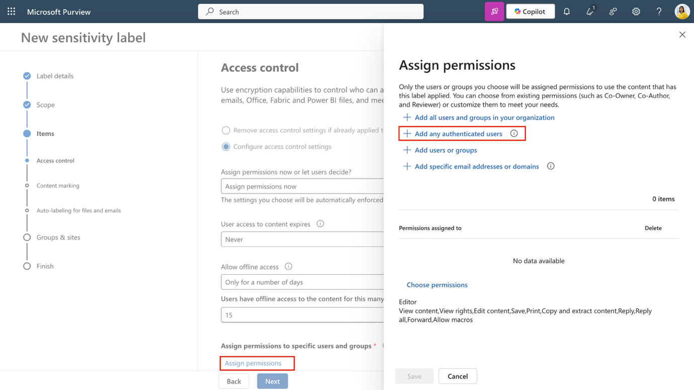

    - **「Assign permissions」**リンクを選択します。 **「Assign permissions」**ポップアップパネルで、 **「+ Add any authenticated users」**を選択し、 **「Save」**を選択してこの設定を適用します。

9.  **\[Access control\]**ページで、 **\[Next\]**を選択します。

> 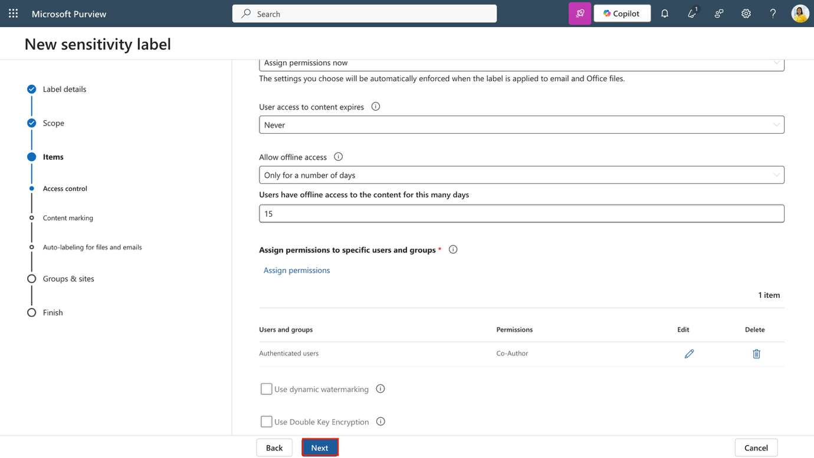

10. **\[Content marking\]**ページで、トグルを選択して**\[Content marking\]**を有効にします。

> 

11. 次のマーキング タイプごとにチェックボックスを選択し、編集アイコンを選択してテキストを入力します。

| **Marking type** | **Text**             |     |
|------------------|----------------------|-----|
| Add a watermark  | INTERNAL USE ONLY    |     |
| Add a header     | Internal Document    |     |
| Add a footer     | Contoso Confidential |     |

12. **「Next」**を選択します。

> 

13. **Auto-labeling for files and emails** ページで、 **\[Next\]**を選択します。

> 

14. **\[Define protection settings for groups and sites\]**ページで、 **\[Next\]**を選択します。

> 

15. **\[Review your settings and finish\]ページ**で、 **\[Create label\]**を選択します。

> 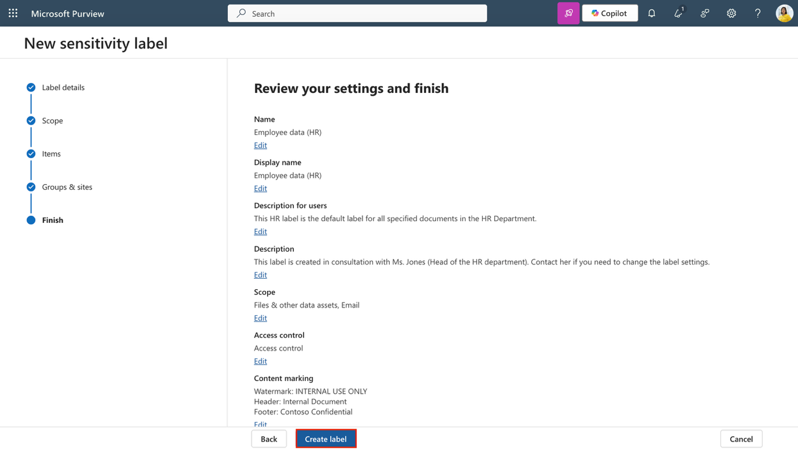

16. **\[Your sensitivity label was created\]ページ**で、 **\[Don't create a policy yet\]を選択し**、 **\[Done\]を選択します**。

> 

内部ラベルグループ内に子ラベルを作成しました。このラベルは人事ドキュメントに暗号化とコンテンツマーキングを適用し、機密データを容易に識別し、ポリシーによって保護します。

**タスク3 – ラベルを公開する**

次に、内部ラベル グループから HR ラベルを公開して、HR 部門のユーザーが自分のドキュメントに適用できるようにします。

1.  **Microsoft Edge**では、Microsoft Purview ポータルのタブがまだ開いているはずです。開いていない場合は、 https://purview.microsoft.com \>**Solutions\>Information Protection**\>**Sensitivity labels**に移動してください。

2.  **\[Sensitivity labels\]**ページで**\[Publish labels\]**を選択します。

> 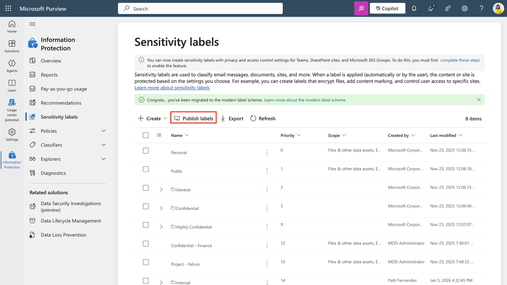

3.  Sensitivity Labelsの公開構成が開始されます。

4.  **\[Choose sensitivity labels to publish\]ページ**で、 **\[Choose sensitivity labels to publish\]**リンクを選択します。

> 

5.  **\[Sensitivity labels to publish\]**フライアウト パネルで、\[**Internal/Employee data (HR)**\] チェックボックスをオンにし、フライアウトページの下部にある**\[Add\]** を選択します。

> 

6.  **\[Choose sensitivity labels to publish\]**ページに戻り、 **\[Next\]**を選択します。

> 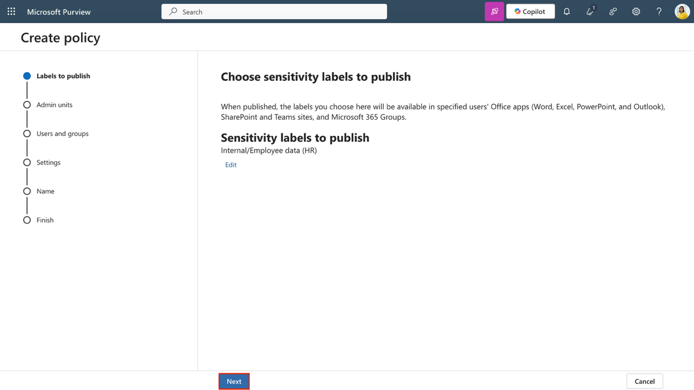

7.  **Assign admin units**ページで、**Next**を選択します**。**

> 

8.  **\[Publish to users and groups\]**ページで、 **\[Next\]**を選択します。

> 

9.  **\[Policy settings\]ページ**で、 **\[Next\]**を選択します。

> 

10. **Default settings for documents** で**\[Next\]**を選択します。

> 

11. **Default settings for emails**で、 **\[Next\]**を選択します。

> 

12. **Default settings for meetings and calendar events**で、 **\[Next\]**を選択します。

> 

13. **Default settings for Fabric and Power BI content** **ページ**で、 **\[Next\]を選択します**。

> 

14. **「Name your policy」ページ**で、次のように入力します。

    - **Name**: Internal HR employee data

    - **Enter a description for your sensitivity label policy**: This HR label is to be applied to internal HR employee data.

15. **「Next」**を選択します。

> 

16. **\[Review and finish\]ページ**で、 **\[Submit\]を選択します**。

> 

17. **\[New policy created\]ページ**で**\[Done\]**を選択して、ラベル ポリシーの公開を完了します。

> 

内部ラベルグループとそのHRラベルを公開しました。ユーザーはHRドキュメントにこれらのラベルを適用できます。ポリシーがサービス全体に反映されるまで、最大24時間かかる場合があります。

**タスク4 – 自動ラベル付けを構成する**

1.  Microsoft Purview ポータルで、 **\[Solutions\]** \> **\[Information Protection\]** \> **\[Sensitivity Labels\]を選択します**。

2.  **「Sensitivity labels」ページ**で、「**Internal** Sensitivity labels」を見つけます。縦の省略記号（ **...** ）を選択し、ドロップダウンメニューから「+**Create label in group」を選択します。**

> 

3.  **Provide basic details for this labelページ**で、次の内容を入力します。

|  | **詳細** | **テキスト** |  |
|----|----|----|----|
|  | **Name** | Financial Data |  |
|  | **Display name** | Financial Data |  |
|  | **Description for users** | This content contains financial data that must be labeled and protected. |  |
|  | **Description for admins** | This label is used for content that includes sensitive financial identifiers. |  |

4.  **「Next」**を選択します。

> 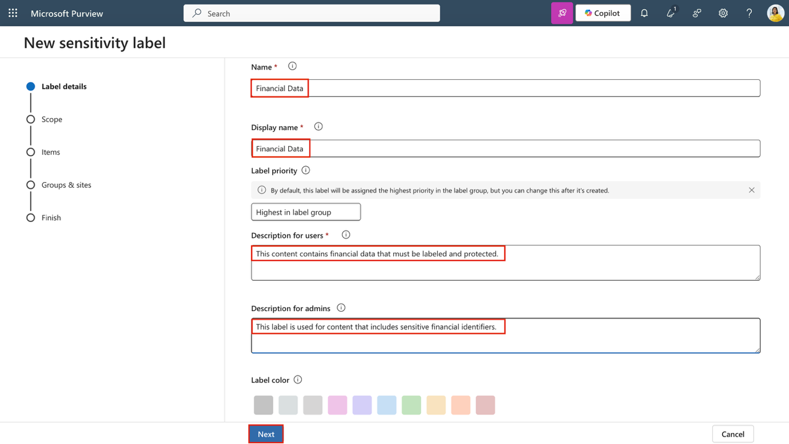

5.  **「Define the scope for this label」ページ**で、 **「Files**とEmails**」を選択します。 「Meetings」**のチェックボックスが選択されている場合は、選択解除されていることを確認してください。

6.  **「Next」**を選択します。

> 

7.  **\[Choose protection settings for labeled items\]ページ**で、 **\[Next\]を選択します**。

> 

8.  **\[Auto-labeling for files and emails\]ページ**で、\[**Auto-labeling for files and emails\]**を有効に設定します。

> 

9.  **Detect content that matches these conditionsセクション**で、 **+ Add condition** \> **Content containsを選択します**。

> 

10. **\[Content contains\] セクション**で、\[**Add\]** \> **\[Sensitive info types\]を選択します**。

> 

11. **\[Sensitive info types\]フライアウト ページ**で、次のSensitive info typesを検索して選択します。

    - Credit Card Number

    - ABA Routing Number

    - SWIFT Code

12. **\[Add\]**を選択します。

> 

13. **Auto-labeling for files and emailsページ**に戻り、 **\[Next\]を選択します**。

> 
>
> **\[Define protection settings for groups and sites\]ページ**で、 **\[Next\]を選択します**。 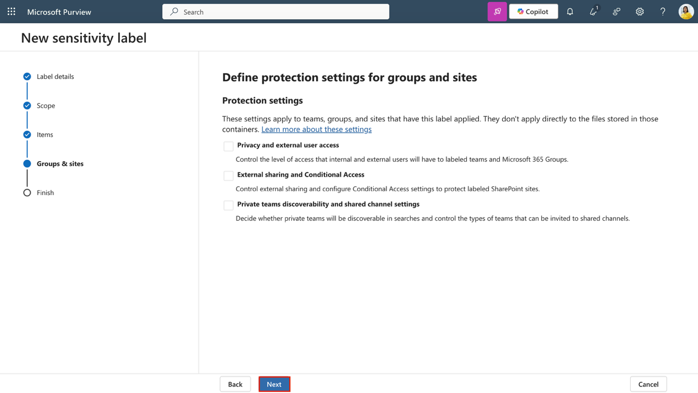

14. **\[Review your settings and finish\]ページ**で、 **\[Create label\]を選択します**。

> 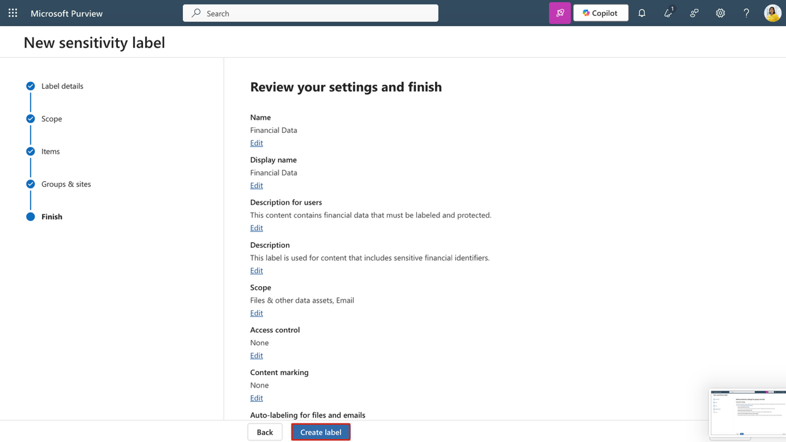

15. **\[Your sensitivity label was created\]ページ**で、 **\[Automatically apply label to sensitive content\]を選択し**、 **\[Done\]を選択します**。

> 

16. **ラベル付けポリシーの作成\] ポップアップ ページ**で、 **\[ポリシーの確認\]を選択します**。

> 

17. **\[Name your auto-labeling policy\] ページ**で、デフォルトのままにして、 **\[Next\]を選択します**。

> 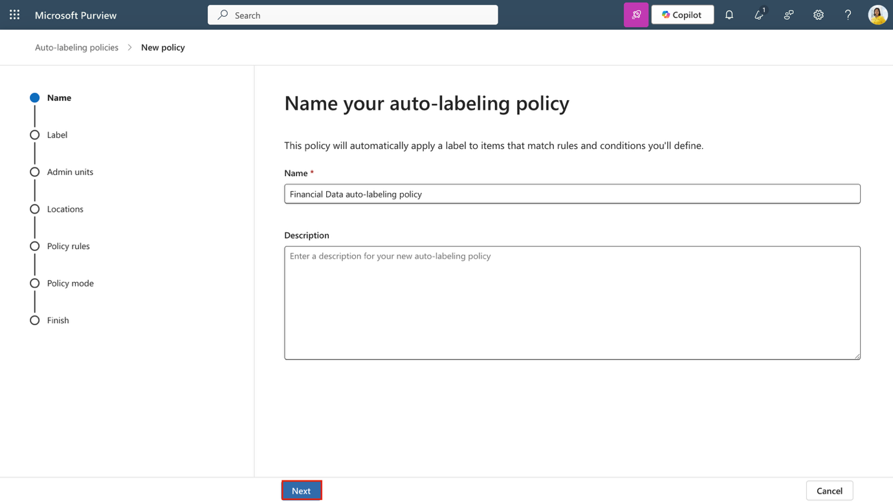

18. **\[Choose a label to auto-apply\]ページ**で、 *\[Internal/Financial Data\]ラベルが選択されている*ことを確認し、 **\[Next\]を選択します**。

> 

19. **\[Assign admin units\]ページ**で、 **\[Next\]を選択します**。

> 

20. **Choose locations where you want to apply the label** **ページ**で、次のオプションを選択します。

    - Exchange email

    - SharePoint sites

    - OneDrive accounts

21. **「Next」**を選択します。

> 

22. **\[Set up common or advanced rules\]ページ**で、既定の**\[Common rules\]**を選択したままにして、 **\[Next\]を選択します**。

> 

23. **\[Define rules for content in all locations\]ページ**で、*Financial Data rule*のルールを展開して、必要なルールが定義されていることを確認し、 **\[Next\]を選択します**。

> 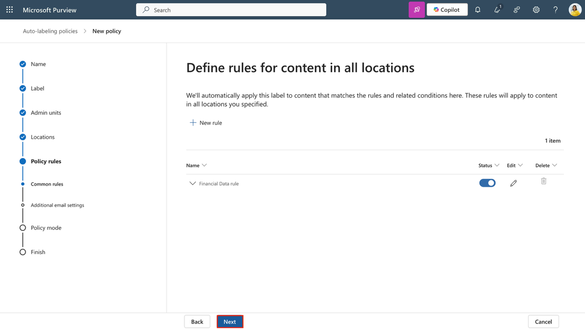

24. **\[Additional settings for email\]ページ**で、 **\[Next\]を選択します**。

> 

25. **\[Decide if you want to test out the policy now or later\] ページ**で、 **\[Run policy in simulation mode\]を選択**し、 **\[Automatically turn on policy if not modified after 7 days in simulation\] チェック ボックスをオンにします。**

> 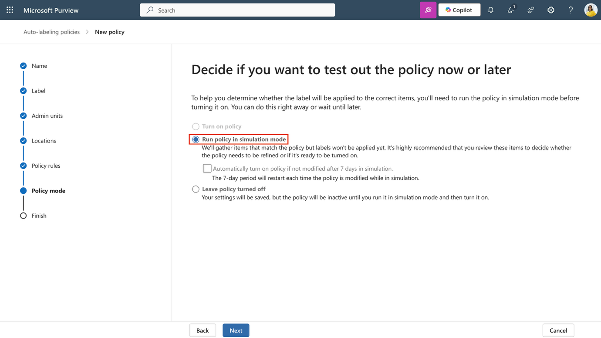

26. **「Next」**を選択します。

> 

27. **\[Review and finish\]ページ**で、 **\[Create policy\]を選択します**。

> 

28. **Your auto-labeling policy was createdページ**で、 **\[Done\]を選択します**。

財務データの子ラベルを作成し、財務情報を含むコンテンツを検出してラベルを付ける自動ラベル付けポリシーを構成しました。

**タスク5 – 機密コンテンツのDKEラベルを作成して公開する**

次に、二重キー暗号化 (DKE) と動的ウォーターマークを使用して機密の法的コンテンツを保護する子ラベルを内部グループに作成します。

1.  **Microsoft Edge**で、 https://purview.microsoft.comに移動し、 **Patti Fernandes**として Microsoft Purview ポータルにログインします。

2.  Microsoft Purview ポータルで、 **\[Solutions\]** \> **\[Information Protection\]** \> **\[Sensitivity labels\]を選択します**。

3.  **「Sensitivity labels」ページ**で、「**Internal** Sensitivity labels」グループを見つけます。縦の省略記号（ **...** ）を選択し、ドロップダウンメニューから**「+ Create label in group」を選択します。**

> 

4.  **Provide basic details for this labelページ**で、次の内容を入力します。

|     |                            |
|-----|----------------------------|
|     |                            |
|     |                            |
|     |                            |
|     | 詳細                       |
|     | **Name**                   |
|     | **Display name**           |
|     | **Description for users**  |
|     | **Description for admins** |

5.  **「Next」**を選択します。

> 

6.  **「Define the scope for this label」ページ**で、 **「Files**とEmails**」を選択します。 「Meetings」**のチェックボックスが選択されている場合は、選択解除されていることを確認して、 **「Next」を選択します**。

> 

7.  **\[Choose protection settings for the types of items you selected\]ページ**で、 **\[Control access\]を選択し**、 **\[Next\]を選択します**。

> 

8.  **\[Access control\]ページ**で、 **\[Configure access control settings\]を選択します**。

> 

9.  次のオプションを使用して暗号化設定を構成します。

    - **Assign permissions now or let users decide?**: Assign permissions now

    - **User access to content expires**: A number of days after label is applied

    - **Access expires this many days after the label is applied**: 5

    - **Allow offline access**: Never

    - **「Assign permissions」ク**を選択します。 **「Assign permissions」**フライアウトパネルで、「**+ Add users or groups」を選択します**。

> 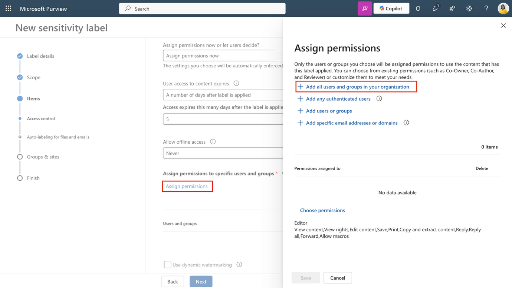

- **\[Add users or groups\]フライアウト ページ**で、 Legal TeamとPatti Fernandesを検索して選択し、 **\[Add\]を選択します**。

> 

- **\[Assign permissions\]ページ**で、 **\[Save\]を選択します**。

> 

10. **\[Access control\]ページ**に戻り、 **\[Use dynamic watermarking\]**チェックボックスをオンにして、 **\[Customize text (optional)\]を選択します**。

> 

11. **\[Add custom text to watermark (optional)\]ページ**で、 「 Confidential 」と入力し、 **\[UPN\]**と**\[Timestamp\]を選択します**。

12. フライアウト ページの下部にある**\[Save\]**を選択します。

> 

13. **\[Access control\]ページ**に戻り、 **\[Use Double Key Encryption**\] チェックボックスをオンにし、二重キー暗号化サービスの URL としてhttps://testingdke1.azurewebsites.net/Testを入力します。

14. **「Next」**を選択します。

> 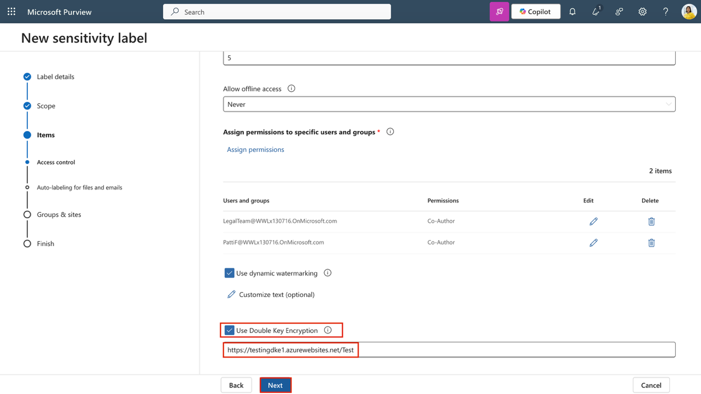

15. **Auto-labeling for files and emails** **ページ**で、 **\[Next\]を選択します**。

> 

16. **\[Define protection settings for groups and sites\]ページ**で、 **\[Next\]を選択します**。

> 

17. **\[Review your settings and finish\]ページ**で、 **\[Create label\]を選択します**。

> 

18. **\[Your sensitivity label was created\] ページ**で、 **\[Publish label to users' apps\]を選択し**、 **\[Done\]を選択します**。

> 

19. **\[Publish label\]**フライアウト **ページ**で、 **\[Create new label policy\]を選択します**。

> 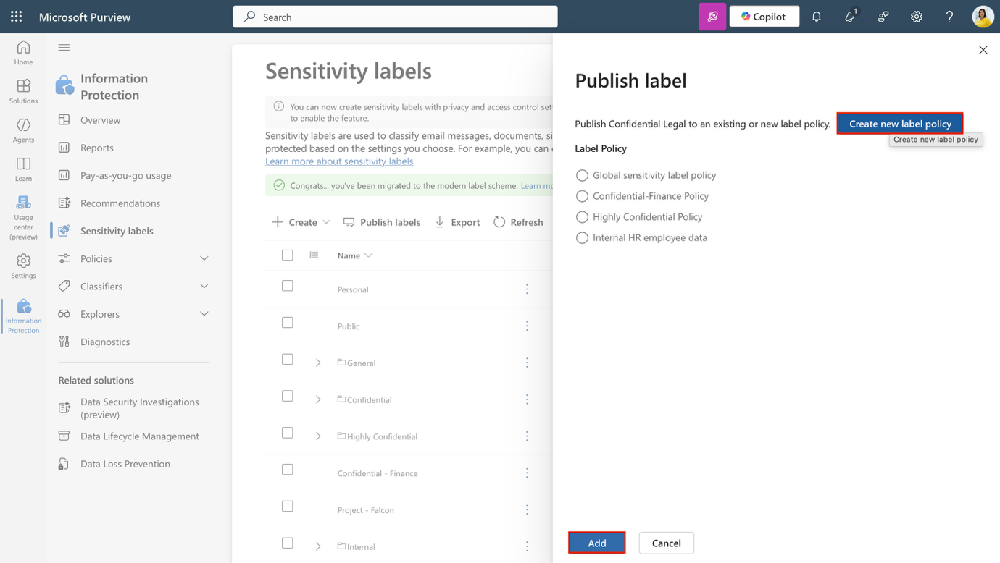

20. **\[Choose sensitivity labels to publish\]ページ**で、\[**Choose sensitivity labels to publish\]を選択し**、 **Internal/Confidential Legal**ラベルを追加して、 **\[Add\]を選択します**。

> 

21. **「Next」**を選択します。

> 

22. **\[Assign admin units\]ページ**で、 **\[Next\]を選択します**。

> 

23. **\[Publish to users and groups\]ページ**で、デフォルトが選択されたままにして、 **\[Next\]を選択します**。

> 

24. **\[Policy settings\]ページ**で、 **\[Users must provide a justification to remove a label or lower its classification**\] チェックボックスをオンにして、 **\[Next\]**を選択します。

> 

25. **\[Default settings for documents\]ページ**で、 **\[Next\]を選択します**。

> 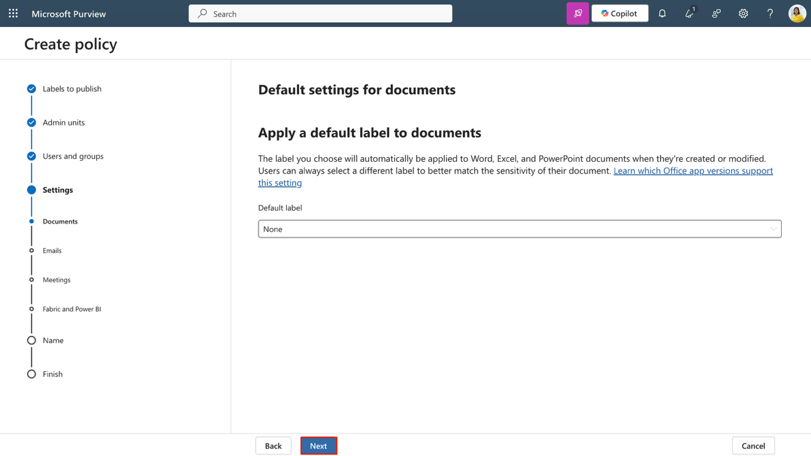

26. **\[Default settings for emails\]ページ**で、 **\[Next\]を選択します**。

> 

27. **\[Default settings for meetings and calendar events\]ページ**で、 **\[Next\]を選択します**。

> 

28.  **Default settings for Fabric and Power BI contentページ**で、**Nextを選択します**。

> 

29. **「Name your policy」ページ**で、次のように入力します。

    - **Name**: Confidential Legal

    - **Description**: Enables manual use of the DKE label for confidential content accessible by Legal.

30. **「Next」**を選択します。

> 

31. **\[Review and finish\]ページ**で、 **\[Submit\]を選択します**。

> 

32. **New policy created** **ページ**で、 **\[Done\]を選択します**。

> 

二重鍵暗号化と動的透かしを使用して子ラベルを作成し、公開しました。このラベルは、承認されたユーザーのみにアクセスを制限し、分類のダウングレードの正当性を強化します。

**Microsoft Purview でラベルを使用したファイル ポリシー**

**タスク 1 – Defender for Cloud Apps で Microsoft Purview の統合を有効にする**

Sensitivity labelsを作成して公開したら、Microsoft Purview を Microsoft Defender for Cloud Apps と統合します。この統合により、Defender はファイルのSensitivity labelsをスキャンし、ファイル監視を適用できるようになります。

1.  **Microsoft Edge**を開き、 https://security.microsoft.comに移動して**Microsoft Defenderに移動します**。

2.  左側のナビゲーションで**\[Settings\]を選択し**、 **\[Cloud Apps\]を選択します**。

> 

3.  左側のペインの**\[Information Protection\]セクション**で、 **\[Microsoft Information Protection\]を選択します**。

> 

4.  **Microsoft Information Protectionページ**で、ページにある両方のチェックボックスをオンにします。

    - **新しいファイルを自動的にスキャンして、Microsoft Information Protection のSensitivity labelsとコンテンツ検査の警告を検出します。**

> Defender for Cloud Apps が、Microsoft Purview からのSensitivity labelsとコンテンツ検査の警告について、新規ファイルまたは変更されたファイルを自動的にスキャンできるようにします。

- **このテナントからの Microsoft Information Protection のSensitivity labelsとコンテンツ検査の警告についてのみファイルをスキャンします**

> スキャン対象を、組織内で作成されたラベルと警告に制限します。外部テナントによって適用されたラベルは無視されます。

5.  設定を適用するには、 **\[Save\]**を選択します。

> 

6.  左側のペインの**「Information Protection」セクション**で、 **「Files」を選択します**。

> 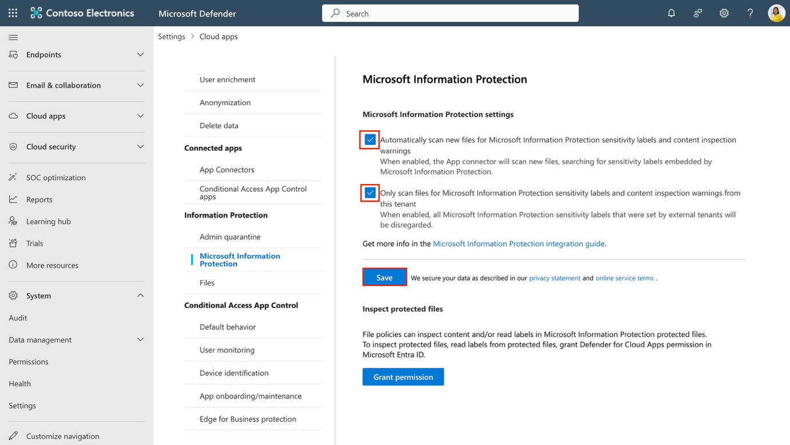

7.  **\[Files\]ページ**で、 **\[Enable file monitoring\]を選択します**。

> 

8.  設定を適用するには、 **\[Save\]**を選択します。

> 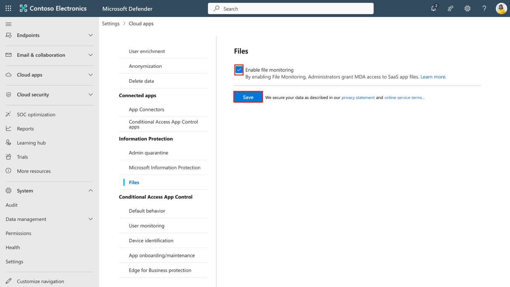

Defender for Cloud Apps で Microsoft Purview の統合が有効になりました。これで、Defender はSensitivity labelsを検出し、ポリシー評価とガバナンスアクションのためにファイルを監視できるようになりました。

**タスク2 – 外部共有ファイルにラベルを付けるファイルポリシーを作成する**

最後に、外部で共有されたファイルにSensitivity labelsを自動的に適用するファイルポリシーを作成します。これにより、組織外で共有された場合でも、機密コンテンツが保護された状態を維持できます。

1.  **Microsoft Defender**で、 **\[Cloud apps\]** \> **\[Policies\]** \> **\[Policy management\]に移動します**。

> 

2.  **\[Information Protection\]タブ**を選択し、 **\[Create policy\]** \> **\[File policy\]を選択します**。

> 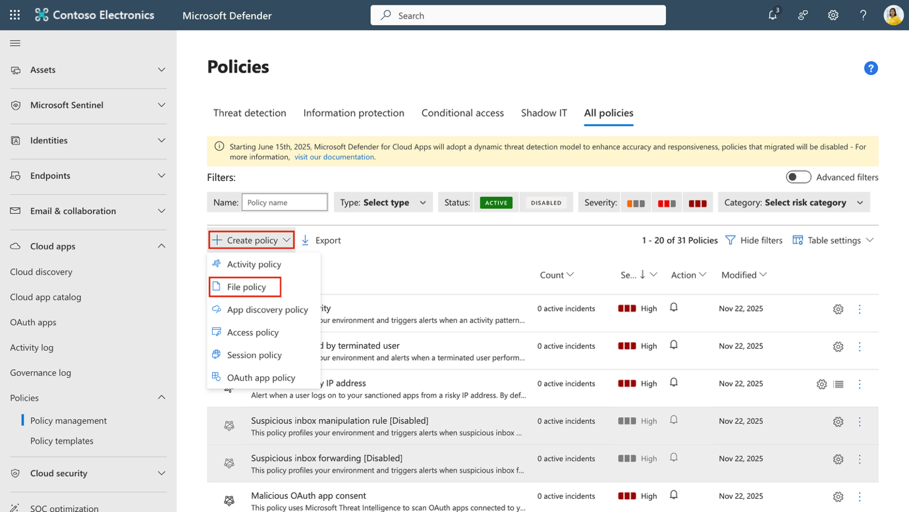

3.  **Create file policyページ**で、次の項目を構成します。

    - **Policy name**: Auto-label externally shared files

    - **Policy severity**: **High**

    - **Category**: **DLP**

    - **Files matching all of the following sectionで**:

      - 最初のフィルターでは、ドロップダウンを次のように設定します: **Access level equals external**

      - 2番目のフィルターでは、ドロップダウンを「**Last modified after (date)」に設定し**、今日の日付を使用します。

> 

- **\[Governance actions\]**の下で、 **\[Microsoft OneDrive for Business\]を展開します**。

  - **Apply sensitivity label**チェックボックスを選択します

  - ドロップダウンから「**Highly Confidential-Specified People」を選択します**

> 

- **Microsoft SharePoint Online**でも同じ手順を繰り返します。

  - **Apply sensitivity label**チェックボックスを選択します

  - ドロップダウンから**「Highly Confidential-Specified People** **」**を選択します

> 

4.  **\[Create\]**を選択して、ファイル ポリシーの作成を完了します。

> 

外部共有ファイルにSensitivity labelsを適用するファイルポリシーを作成しました。このポリシーにより、Information Protection戦略がクラウド保存コンテンツにも拡張されます。

**まとめ**

このラボでは、Contoso Ltd. のシステム管理者である Patti Fernandez の役割を担い、Microsoft Purview Sensitivity Labels を使用してInformation Protectionを実装しました。PowerShell を使用して SharePoint と Teams でSensitivity labelsのサポートを有効にし、社内ラベルと人事固有のサブラベルを作成・公開し、これらのラベルを Word 文書と Outlook メールに適用しました。また、ドイツ固有の GDPR 関連コンテンツ用の自動ラベル付けSensitivity labelsも作成・公開しました。これらの手順により、人事および規制文書が組織内で適切に分類・保護されます。
