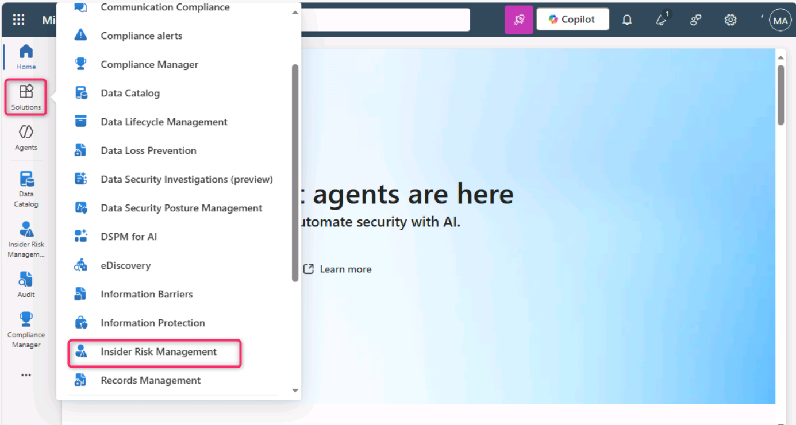
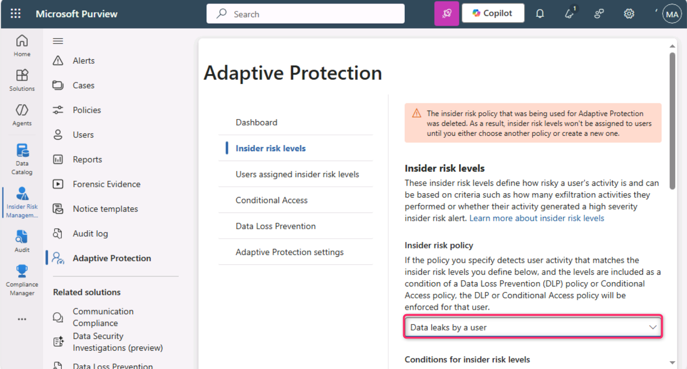
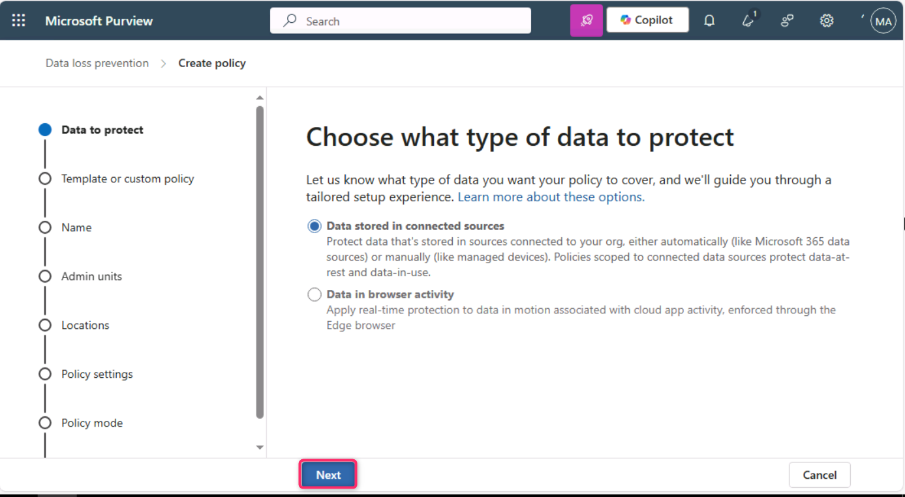
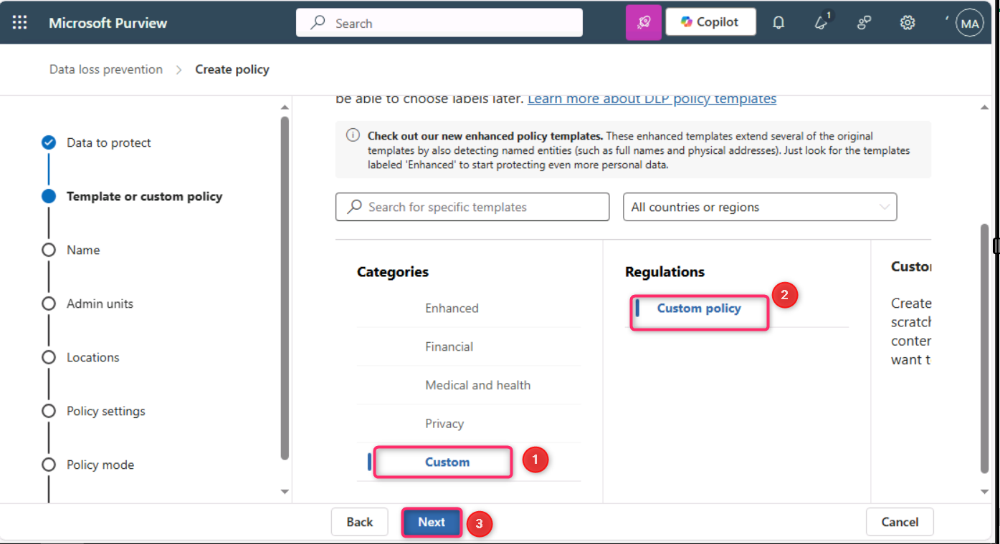
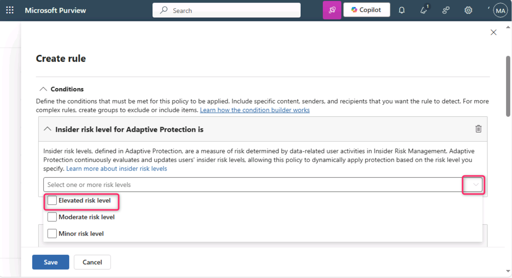
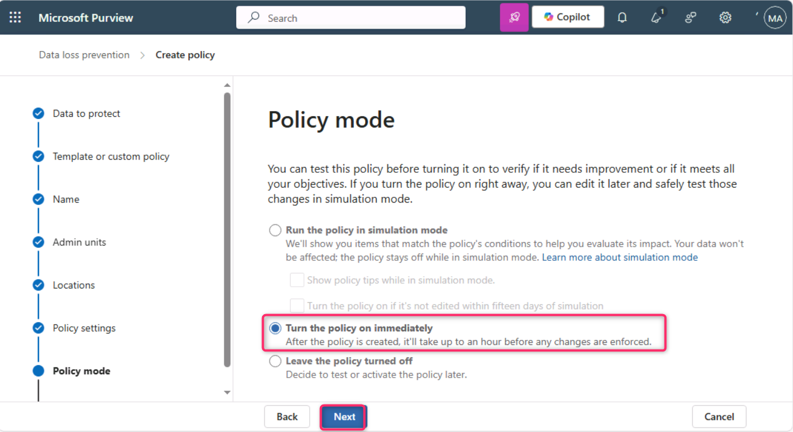
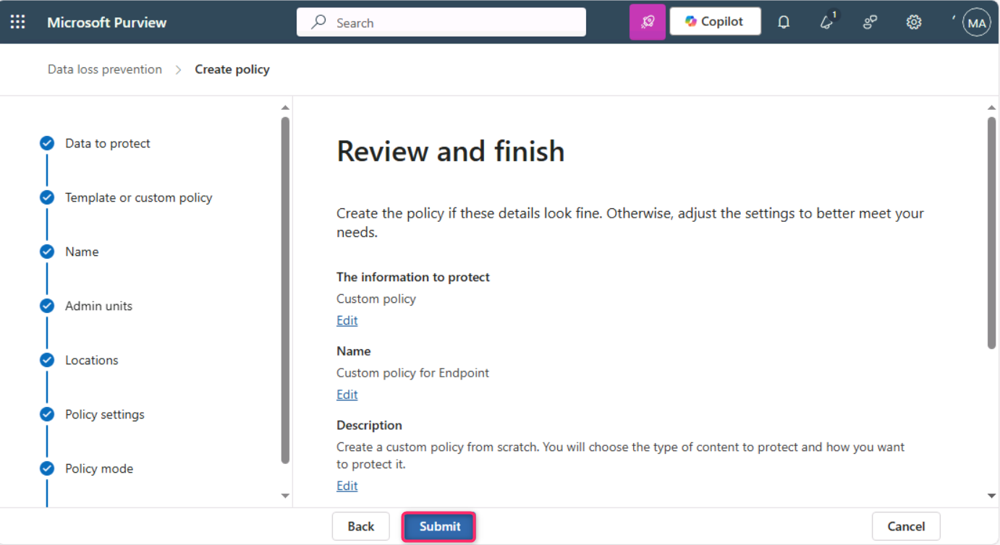

**ラボ5 – Adaptive Protectionの機能の探究**

**導入**

Microsoft Purview の Adaptive Protection は、Microsoft Purview Insider Risk Management と Microsoft Purview Data Loss Prevention (DLP) を統合します。Insider Risk Management によって危険な行動を行っているユーザーが特定されると、そのユーザーは内部リスクレベルに動的に割り当てられます。その後、Adaptive Protection は DLP ポリシーを自動的に作成し、その内部リスクレベルに関連付けられた危険な行動から組織を保護します。

**目的**

- Insider Risk Management で Adaptive Protection のリスクしきい値を設定します。

- エンドポイント保護用のカスタム DLP ポリシーを作成して構成します。

- トレーニング可能な分類子とインサイダー リスク レベルを使用して条件を定義します。

- リスクの高いデータ流出活動をブロックするアクションを適用します。

- 即時適用するにはポリシーを有効にします。

**演習1 – Adaptive Protectionの設定**

**タスク1 – Adaptive Protectionのリスクレベルの設定**

1.  通常のウィンドウで Microsoft Edge ブラウザー タブを開き、 **MOD administratorの**資格情報を使用して Microsoft Purview ポータルにログインし、 **\[Solutions\]** \> **\[Insider Risk Management\]に移動します**。

> 

2.  **Insider Risk Management の**左側のペインで、 **Adaptive Protection**に移動してクリックします。

> 

3.  **「Adaptive Protection」ページ**で、 **「Insider risk levels」をクリックします**。次に、 **「Insider risk policy」**セクションに移動し、 **「Select a policy」の横にあるドロップダウンをクリックします。 「Data leaks by a user」**の横にあるチェックボックスを選択して選択します。

> 
>
> 

4.  **Conditions for insider risk levels**で、「**Elevated risk level」フィールド**の「User performs at least 3 data exfiltration activities, each…」を選択します。「Moderate risk level」フィールドの「User performs at least 2 data exfiltration activities, each…」を選択します。 **「Minor risk level」フィールド**の「Select User performs at least 1 data exfiltration activities, each…」を選択します。次に、下にスクロールして「Save**」**ボタンを選択します。

> 

5.  **\[Save\]ボタン**をクリックします。

> 

**タスク2 – エンドポイント用のカスタムAdaptive Protection DLPポリシーを作成する**

1.  **「Adaptive Protection」ページ**で、 **「Data Loss Prevention」**に移動してクリックし、 **「+ Create policy」**をクリックします。

> 

2.  「**Choose what type of data to protect**」ページで、「**Data stored in connected sources**」ラジオ ボタンが選択されていることを確認します。

> 

3.  **Template or custom policy** ページの**\[Categories\]セクション**で、 **\[Custom\]**に移動して選択し、 **\[Regulations\]**の下にある**\[Custom policy\]**をクリックします。

> 

4.  **Name your DLP policy** ページの「**Name」**フィールドに、 「Custom Policy for Endpoint」と入力します。

> 

5.  **「Assign admin units」ページ**で、 **「Next」**ボタンをクリックします。

> 

6.  **「Choose where to apply the policy」ページ**で、 **「Next」**ボタンをクリックします。

> 

7.  **「Define policy settings」ページ**で、 **「Next」**ボタンをクリックします。

> 

8.  **\[Customize advanced DLP rules\]ページ**で、 **\[+Create rule\]をクリックします**。

> 

9.  **Create rule**フィールドに、Adaptive Protection block rule for Endpoint DLPを入力します。

> 

10. **「Select one or more risk levels」**の横にあるドロップダウンをクリックし、 **「Elevated risk level」の**横にあるチェックボックスを選択します。

> 

11. **+Add conditionの**横にあるドロップダウンをクリックし、Content contains**を選択します**。

> 

12. **\[Content contains\] セクション**で、 **\[Add\]の**横にあるドロップダウンをクリックし、 **\[Trainable classifiers\]を選択します**。

> 

13. 右側の**「Trainable classifiers」ペイン**で、 **「Source code」** 、 **「Agreements」** 、 **「HR」** 、 **「IP」の横にあるチェックボックスを選択して、 「Add」**ボタンをクリックします。

> 
>
> 

14. **\[Actions\]セクション**で、 **\[Add an action\]**の横にあるドロップダウンをクリックし、 **\[Audit or restrict activities on devices\]を選択します**。

> 

15. 「**Copy to clipboard**」、「**Copy to a removable USB device**」、「**Copy to a network share**」、および「**Print**」に対して「**Block**」を選択します。

> ..
>
> 

16. **「Incident reports」**セクションの**「Use this severity level in admin alerts and reports」フィールド**で、ドロップダウンから**「Low」を選択します。 「Save」**ボタンをクリックします。

> 

17. **「Next」ボタン**をクリックします。

> 

18. **\[Policy mode\]ページ**で、 **\[Turn the policy on immediately\]**の横にあるラジオ ボタンを選択し、 **\[Next**\] ボタンをクリックします。

> 

19. **「Review and finish」ページ**で、 **「Submit」**ボタンをクリックします。

> 

20. **New policy createdページ**で、 **\[Done\]**ボタンをクリックします。

> 

**まとめ**

この演習では、Microsoft Purview で Adaptive Protection を構成しました。まず、データ流出アクティビティのしきい値に基づいてインサイダーリスクレベルを定義しました。次に、エンドポイントデバイス向けに、Adaptive Protection を使用して、リスクの上昇が検出された場合に USB へのコピーや印刷などのアクティビティを自動的に制限するカスタムData Loss Prevention(DLP) ポリシーを作成しました。このポリシーは、トレーニング可能な分類子を用いて機密コンテンツを対象とし、インサイダーリスクレベルに基づいて厳格なアクションを適用することで、潜在的なデータ漏洩を軽減します。
