**ラボ 6 – DLP ポリシーの作成と管理**

**導入**

あなたは、Contoso Ltd.に新しく採用されたコンプライアンス管理者、パティ・フェルナンデスです。同社のMicrosoft 365テナントをData Loss Prevention用に設定する任務を負っています。Contoso Ltd.は米国で運転教習サービスを提供する会社であり、機密性の高い顧客情報が社外に漏洩しないよう徹底する必要があります。

**目的**

- Microsoft Purview で DLP ポリシーを作成してテストします。

- PowerShell を使用して DLP 設定を管理します。

- Defender for Cloud Apps でファイル監視を有効にし、ファイル ポリシーを作成します。

- データ フローを制御するために、Power Platform の DLP を実装します。

**演習1 – DLPポリシーの作成**

**タスク1 – テストモードでのDLPポリシーの作成**

この演習では、Microsoft Purview ポータルでData Loss Preventionポリシーを作成し、機密データがユーザーによって共有されるのを防ぎます。作成する DLP ポリシーは、クレジットカード情報を含むコンテンツを共有するかどうかをユーザーに通知し、その情報を送信する正当な理由を提示できるようにします。ブロックアクションがまだユーザーに影響を与えないようにするため、ポリシーはテストモードで実装します。

1.  **Microsoft Edge**で、 https://purview.microsoft.comに移動し、 **Patti Fernandez**として**Microsoft Purviewポータル**にログインしていることを確認します。

2.  **Microsoft Purview**ポータルの左側のナビゲーション ウィンドウで、 **\[Solutions\]** \> **\[Data Loss Prevention\]**を選択します。

> 

3.  **\[Data Loss Prevention\]**の下で**\[Policies\]**を選択し、 **\[+Create policy\]を選択して**、新しいData Loss Preventionポリシーを作成するためのウィザードを開始します。

> 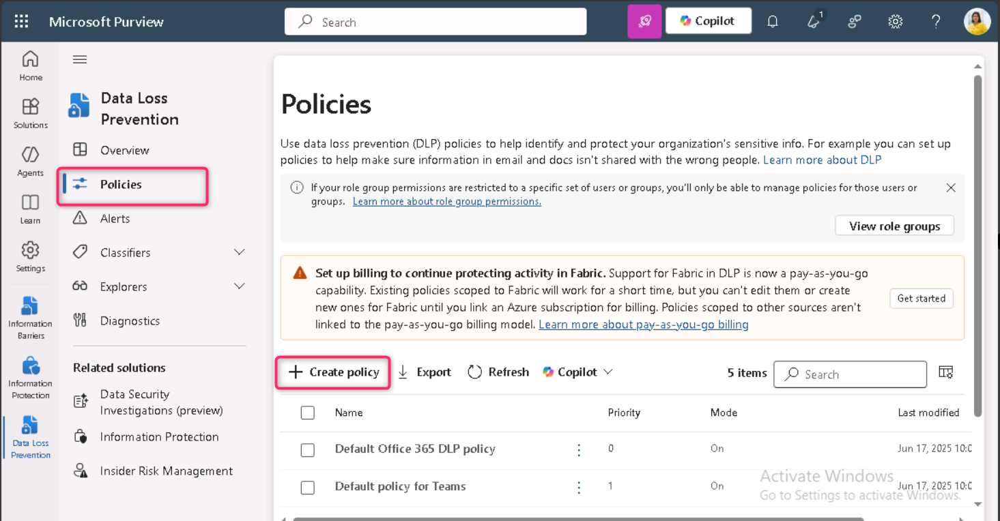

4.  **\[What info do you want to protect?\]ペイン**から、 **\[Enterprise applications and devices\]を選択します**。

> 

5.  **「Start with a template or create a custom policy」**ページで、下にスクロールし、 「Categories」の**「Custom」を選択します。**次に、 **「Regulations」**の**「Custom policy」を選択します。「Next」ボタン**をクリックします。

> 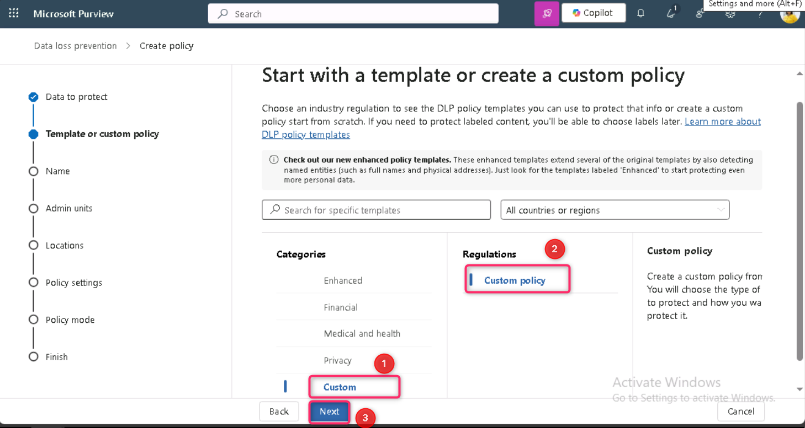

6.  **「Name your DLP policy」ページ**で、 **「Name」フィールド**に「クレジットカードDLPポリシー」と入力し、 「**Description」フィールド**に「クレジットカード番号の共有を防ぎます。」と入力します。 **「Next」**を選択します。

> 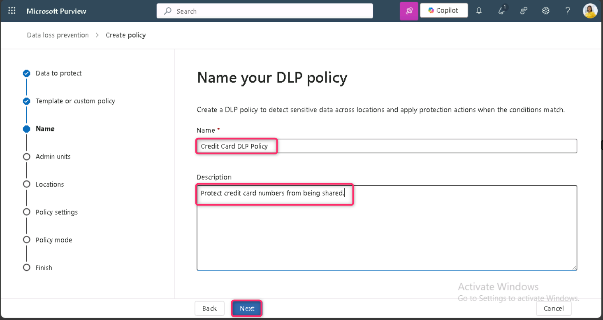

7.  **\[Assign admin units\]ページ**で、 **\[Next\]を選択します**。

> 

8.  **\[Choose where to apply the policy\]ページ**で、**Teams chat and channel messages** **の**横にあるチェックボックスをオンにし、その他のリソースの横にあるチェックボックスをオフにして、 **\[Next\]**ボタンをクリックします。

> 

9.  **\[Define policy settings\]ページ**で、 **\[Create or customize advanced DLP rules\] ラジオ ボタンが選択されていることを確認し、 \[Next\]ボタン**をクリックします。

> 

10. **\[Customize advanced DLP rules\]ページ**で、 **\[+Create rule\]を選択します**。

> 

11. 「**Create rule**」ページで、「**Name**」フィールドに入力します。

> 

12. **\[Create rule\]**ページの**\[Conditions\]**で**\[+Add condition\]を選択し**、ドロップダウン メニューから**\[Content is shared from Microsoft 365\]を選択します。**

> 

13. 新しい**\[Content is shared from Microsoft 365**\] セクションで、 **\[with people outside my organization\]**オプションを選択します。

> 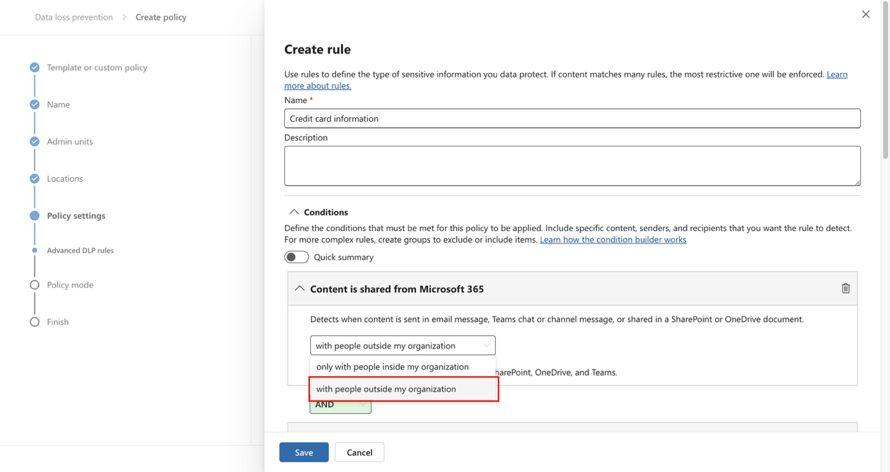

14. **\[+ Add condition\]**を選択し、ドロップダウン メニューから**\[Content contains\]を選択します。**

> 

15. 新しい**\[Content contains\]**領域で**\[Add\]を選択し**、ドロップダウン メニューから**\[Sensitive info types\]を選択します。**

> 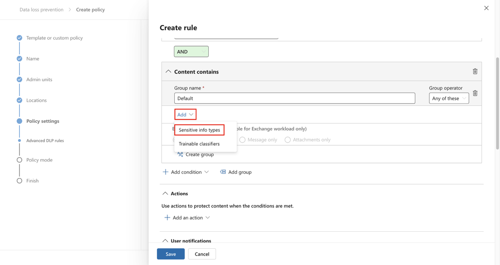

16. 右側に表示される**「Sensitive info types」パネル**の検索バーに「credit card number」と入力し、Enterキーを押します。 **「Credit card number」**の横にあるチェックボックスをオンにし、 **「Add」**ボタンを選択します。

> 

17. **\[Create rule\]ページ**で、 **\[+ Add an action\]を選択し**、 **\[Restrict access or encrypt the content in Microsoft 365 locations\]を選択します**。

> 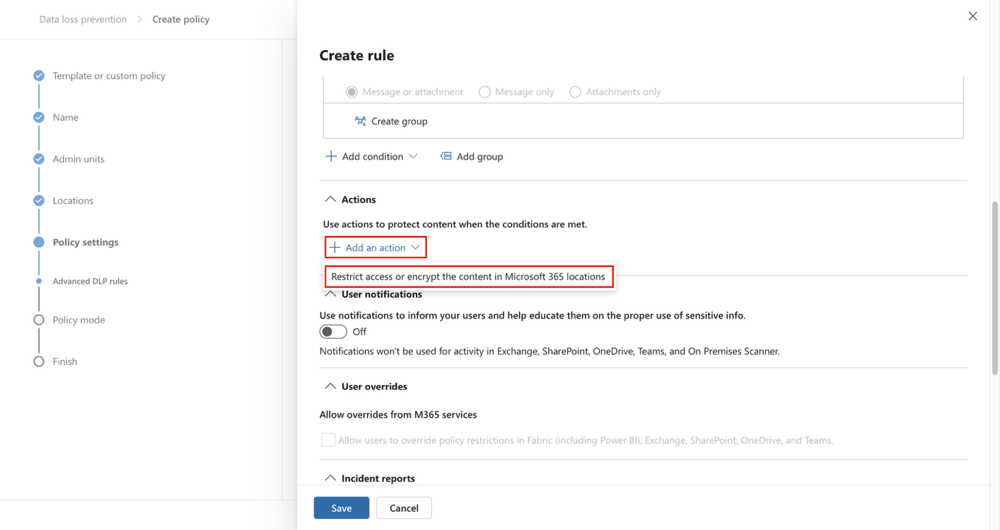

18. **\[Restrict access or encrypt the content in Microsoft 365 locations\]**セクションで、 **\[Block users from receiving email or accessing shared SharePoint, OneDrive, and Teams files, and Power BI items\]**ラジオ ボタンが選択されていることを確認し、次に**\[Block only people outside your organization**\] ラジオ ボタンが選択されていることを確認します。

> 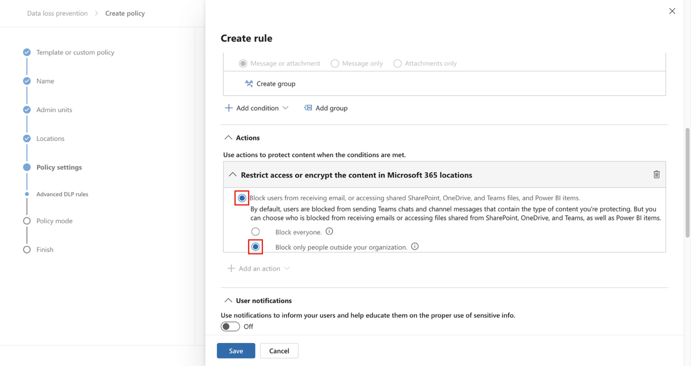

19. **\[Create rule\]**ページの**\[User notifications\]セクション**で、スイッチを選択して**Onの**位置に切り替えます。

> 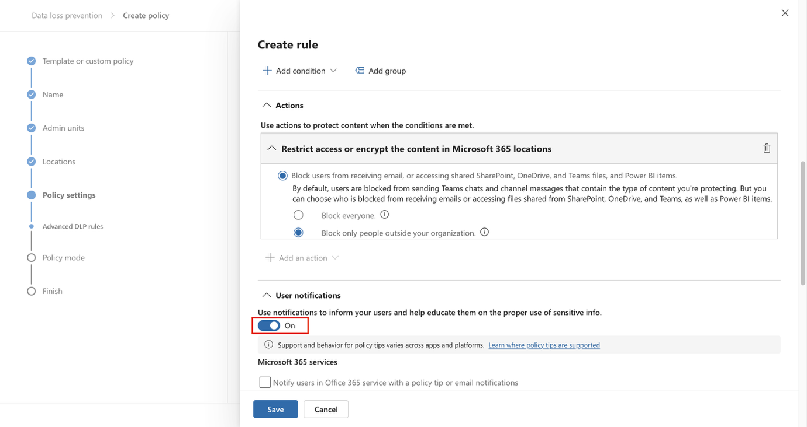

20. **「Create rule」**ページの**「User overrides」**セクションにある「**Allow overrides from M365 services**」で、 **「Allow overrides from M365 services. Allows users in Exchange, SharePoint, OneDrive and Teams to override policy restrictions.**」チェックボックスをオンに**します。**

**注**: **「Allow overrides from M365 services**」チェックボックスをオンにできなかった場合は、 **「Notify users in Office 365 with a policy tip」**チェックボックスをオンにしてください。このポリシーヒントは、前の手順の**「Create rule」**ページの「**User notification \>\\ \>Microsoft 365 services」セクション**にあります。次に、「**Allow overrides from M365 services. Allows users in Exchange, SharePoint, OneDrive and Teams to override policy restrictions.**」チェックボックスをオンにしてください**。**

21. **\[Require a business justification to override\]**ボックスをオンにします。

> 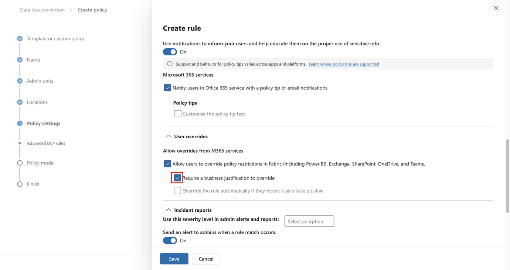

22. **Incident reports**セクションの**\[Use this severity level in admin alerts and reports\]**ドロップダウンで、 **\[Low\]を選択します**。

> 

23. **\[Save\]**を選択し、 **\[Next\]を選択します**。

> 
>
> 

24. **「Policy mode」ページ**で、 **「Run the policy in simulation mode**」ラジオボタンが選択されていること、および**「Show policy tips while in test mode」チェックボックス**が選択されていることを確認します。「**Next」**ボタンをクリックします。

> 

25. **\[Submit\]**を選択してポリシーを作成します。

> 

26. ポリシーが作成されたら、 **\[Done\]を選択します**。

> 
>
> これで、Microsoft Teams のチャットとチャネルでクレジットカード番号をスキャンし、ユーザーがポリシーを上書きするためのビジネス上の正当な理由を提供できる DLP ポリシーが作成されました。
>
> 

**タスク2 – DLPポリシーの変更**

このタスクでは、前の手順で作成した既存の DLP ポリシーを変更して、電子メールでクレジットカード情報もスキャンし、このコンテンツを電子メールで共有するかどうかをユーザーに通知します。

1.  **「Credit card DLP Policy」**の横にあるチェックボックスを選択し、下の画像に示すようにコマンド バーの**Editアイコン**をクリックします。

> 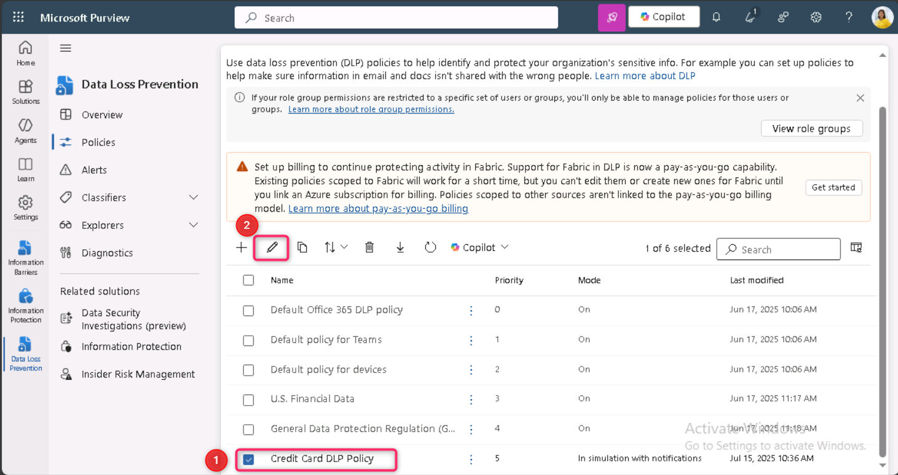

2.  **Name your DLP policy** と**Assign admin units**ページで、 **\[Next\]を選択します**。

> 
>
> 

3.  **\[Choose where to apply the policy\]ページ**で、 **\[Exchange email\]**の横にあるチェックボックスのみを選択し、 **\[Review and finish\]ページが**表示されるまで**\[Next\]**を選択します。

> 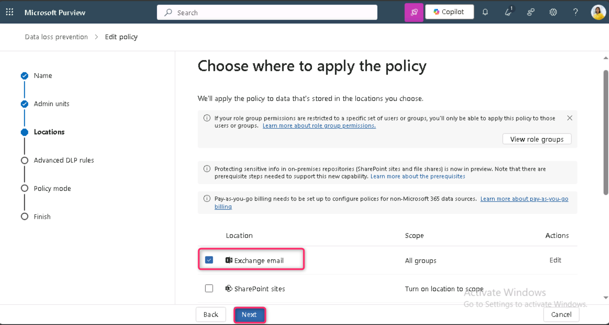

4.  ポリシーに加えた変更を適用するには、 **\[Submit\]**を選択します。

> 

5.  ポリシーが更新されたら、 **\[Done\]**ボタンを選択します。

> 

既存の DLP ポリシーを変更し、コンテンツをスキャンする場所を変更しました。

**タスク3 – PowerShellでDLPポリシーを作成する**

このタスクでは、PowerShell を使用して、Contoso EmployeeID を保護し、Exchange で共有されないようにするための DLP ポリシーを作成します。ユーザーには、機密データを共有しようとしていることが通知され、Contoso EmployeeID を含むメールの送信がブロックされます。

1.  タスクバーの Windows アイコンを右クリックし、\[Windows PowerShell (Admin)\] を選択して管理者として実行します。

> 

2.  **「User Account Control」ダイアログ ボックス**で、 **「Yes」**ボタンをクリックします。

> 

3.  PowerShell で次のコマンドを実行します。

> Install-Module ExchangeOnlineManagement
>
> Import-Module ExchangeOnlineManagement
>
> 
>
> 

4.  **PowerShellウィンドウ**で、 「Connect- IPPSSession」と入力し、 **Patti Fernandez としてサインインします。**

> 
>
> 
>
> 「**Automatically sign in to all desktop apps and websites on this device?**」というダイアログ ボックスが表示された場合は、「**No, this app only**」ボタンをクリックします。
>
> 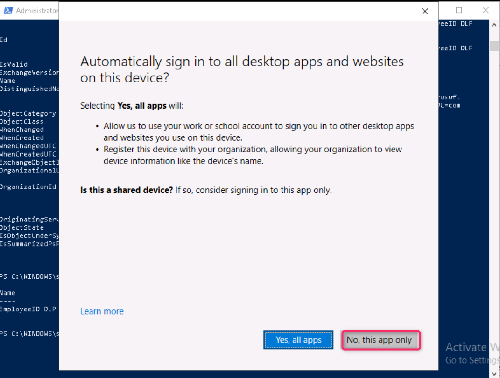
>
> 

5.  すべての Exchange メールボックスをスキャンする DLP ポリシーを作成するには、PowerShell に次のコマンドを入力します。

> New-DlpCompliancePolicy -Name "EmployeeID DLP Policy" -Comment "This policy blocks sharing of Employee IDs" -ExchangeLocation All
>
> 

6.  前の手順で作成した DLP ポリシーに DLP ルールを追加するには、PowerShell に次のコマンドを入力します。

> New-DlpComplianceRule -Name "EmployeeID DLP rule" -Policy "EmployeeID DLP Policy" -BlockAccess \$true -ContentContainsSensitiveInformation @{Name="Contoso Employee IDs"}
>
> 
>
> 

7.  **EmployeeID DLP ルール**を確認するには、次のコマンドを使用します。

> Get-DLPComplianceRule -Identity "EmployeeID DLP rule"
>
> 

PowerShell を使用して Exchange 内の Contoso EmpoloyeeID をスキャンする DLP ポリシーが作成されました。

**タスク4 – テストモードでポリシーを有効化する**

モードで作成したクレジットカード情報 DLP ポリシーをアクティブ化して、保護アクションを適用します。

1.  **Microsoft Edge InPrivate ウィンドウ**で、 https://purview.microsoft.comに移動し、 **Patti Fernandez**として**Microsoft Purviewポータル**にログインしていることを確認します。

2.  **Microsoft Purview**ポータルの左側のナビゲーション ウィンドウで、 **\[Solutions\]** \> **\[Data Loss Prevention\]を選択します**。

3.  **\[Data Loss Prevention\]**の下で**\[Policies\]**を選択し、 **\[Credit Card DLP Policy\]**という名前のポリシーを選択してから、 **\[Edit policy\]** (鉛筆アイコン) を選択してポリシー ウィザードを開きます。

4.  **\[Next\]**を選択し、 **\[Test or turn on the policy\] ページに**到達して、 **\[Turn the policy on immediately\]を選択します**。

5.  **「Next」**を選択し、 **「Submit」を選択して**ポリシーを有効にします。

6.  ポリシーが更新されたら、 **\[Done\]を選択します**。

DLPポリシーの有効化に成功しました。ポリシーがクレジットカード情報の共有試行を検知した場合、その試行はブロックされ、ユーザーはブロック解除の正当な理由を提示できるようになります。

**演習2 – DLPポリシーの管理**

**タスク1 – ポリシーの優先順位の変更**

2つのDLPポリシーを作成した後、より制限の厳しいポリシーが、より制限の緩いポリシーよりも高い優先度で処理されるようにする必要があります。そのため、 EmployeeID DLPポリシーをより高い優先度に移動します。

1.  **Microsoft Edge**で、 https://purview.microsoft.comに移動し、 **Patti Fernandez**として**Microsoft Purviewポータル**にログインしていることを確認します。

2.  **Microsoft Purview**ポータルの左側のナビゲーション ウィンドウで、 **\[Solutions\]** \> **\[Data Loss Prevention\]を選択します**。

3.  Data Loss Preventionで**「Policies」**を選択し、 **「Credit Card DLP Policy」**というポリシーを選択します。 **「Move to top (highest priority)**.**」を選択します**。

4.  **Data Loss Preventionウィンドウ**で、 **\[Refresh\]を選択し、**ポリシー テーブルの**\[Order\]列**で優先順位を確認します。

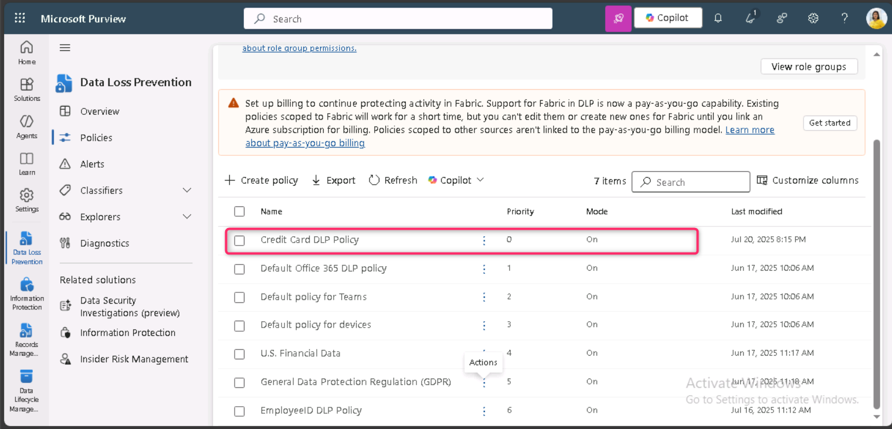

DLPポリシーの優先度を変更しました。両方のポリシーが同じコンテンツに一致した場合、優先度の高いポリシーのアクションが適用されます。

**タスク2 – Microsoft Defenderでファイル監視を有効にする**

**Microsoft Defender**のファイルポリシーを使用したいとお考えですか？ファイルポリシーを作成する前に、Microsoft Defender が組織内のファイルをスキャンできるように、ファイル監視を有効にする必要があります。

1.  普段お使いのMicrosoft Edgeブラウザで新しいタブを開き、アドレスバーに次のURLを入力してMicrosoft Defenderポータルを開きます： https://security.microsoft.com 。次に、 **MOD administrator**としてMicrosoft Defenderポータルにログインします。

2.  Microsoft Defenderポータルで、下にスクロールし、左側のナビゲーションメニューで**「System」\>「Settings」をクリックします。 「Settings」ページで「Cloud Apps」**をクリックします。

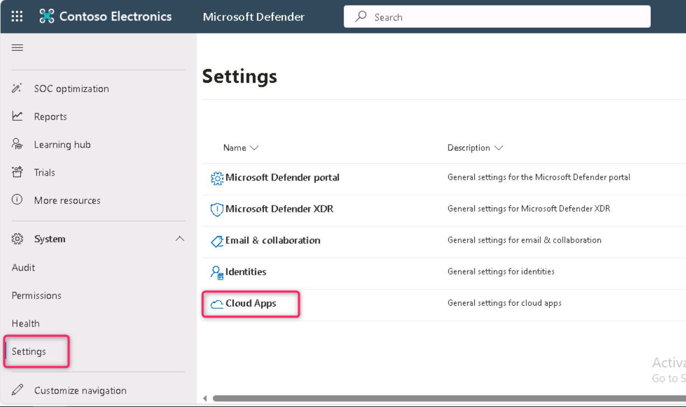

3.  **「Information Protection」セクション**までスクロールし、 **「Files」**をクリックします。 **「Files」ページで、 「Enable file monitoring」**の横にあるチェックボックスをオンにし、 **「Save」ボタン**をクリックします。

**注**: ファイル監視がすでにデフォルトで有効になっている場合は、上記の手順を無視して次のタスクに進みます。

Microsoft Defender for Cloud Apps でファイル監視が正常に有効化され、ファイル ポリシーを使用して機密コンテンツのファイルをスキャンできるようになりました。

**タスク3 – Microsoft Defenderのファイルポリシーの作成**

このタスクでは、Microsoft Defender でファイル ポリシーを作成し、OneDrive と SharePoint Online 内のファイルをスキャンし、共有されているクレジットカード情報を含むファイルを自動的に検疫します。

1.  次に、同じ**「Information Protection」セクションで「Microsoft Information Protection」**をクリックし、 **「Automatically scan new files for Microsoft Information Protection sensitivity labels and content inspection warnings**.**」**の横にあるチェックボックスをオンにします。次に、「Save」ボタンをクリックします。

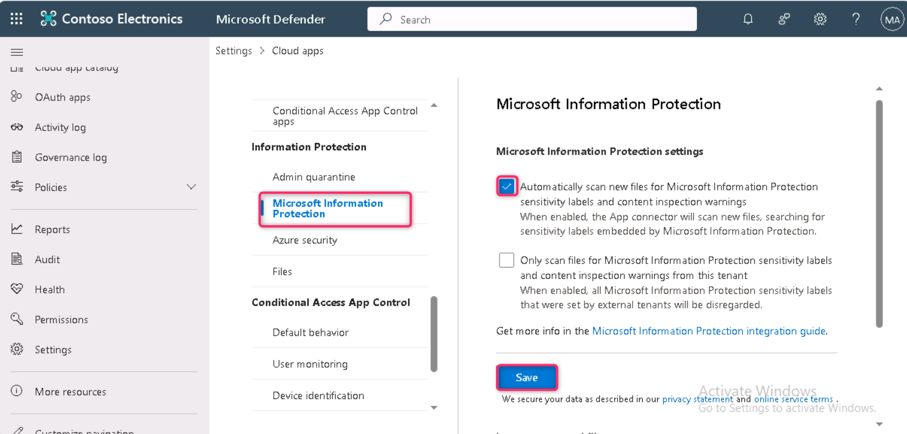

2.  **\[Inspect protected files\]**の下で、 **\[Grant Permission\]をクリックします**。

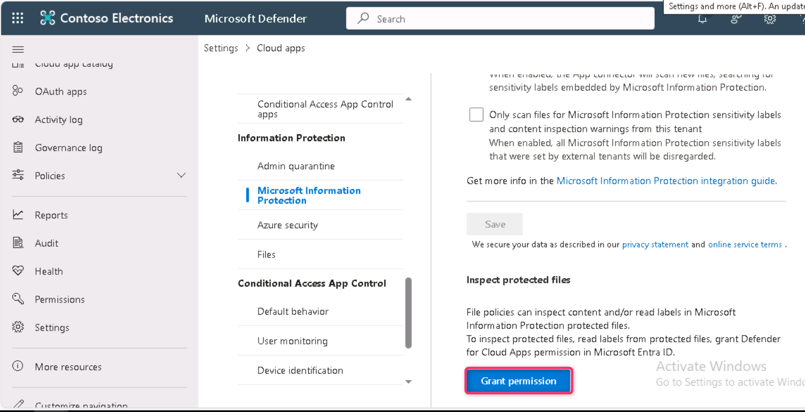

3.  **Pick an account**ダイアログボックスが表示されたら、MOD Administratorテナント資格情報を選択します。

\

4.  **「Permissions requested」ページ**で、 **「Accept」**ボタンをクリックします。

5.  権限が正常に付与されたことを示す**Activeステータス**が表示されます。

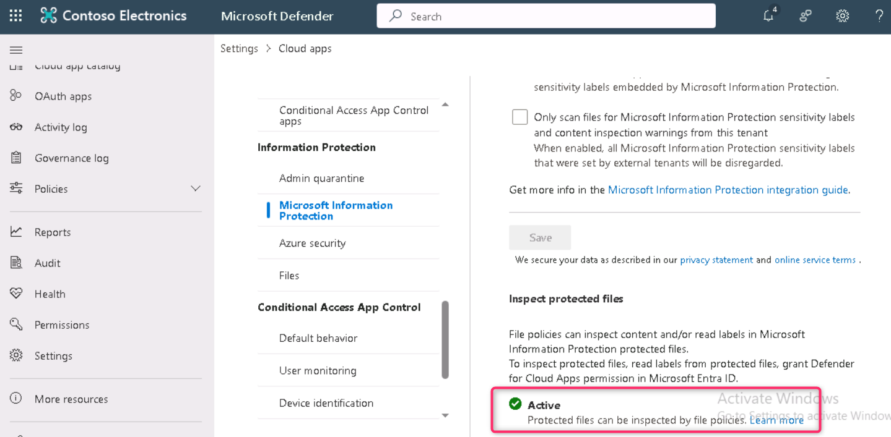

6.  サブナビゲーションの**「Connected apps」セクションで、 「App Connectors」**をクリックし、 **Microsoft 365 が**追加されていることを確認します。

7.  次に、 **Microsoft Defender**ポータルの左側のナビゲーション ウィンドウで、 \[Cloud Apps\] セクションの**\[Policies\]を展開し、 \[Policy management\]**を選択します。

8.  **\[Policies\]ページ**で、 **\[Create policy\]をクリックし**、 **\[File policy\]を選択します**。

9.  **\[Create file policy\]ページ**で、 **\[Policy name\]フィールド**に「ファイルのクレジット カード情報」と入力し、 **\[Description\]フィールド**に「Protect credit card numbers from being shared in files.」と入力します。

10. **Policy Severityを「Low」 （点灯アイコン1つ）**に設定し、 **「Category」が「DLP」**に設定されていることを確認してください。ファイルポリシーの場合、これがデフォルトです。

11.  **Files matching all of the following**領域で、ドロップダウン メニューの**\[Public (Internet)\]、\[External\]、\[Public\]を展開し**、 **\[Internal\]を追加します**。

12. **\[Apply to**\] セクションの**\[Inspection method\]**ドロップダウン メニューで、 **\[Data Classification Service\]を選択します**。

**注:**ドロップダウンに**Data Classification Serviceが**表示されていない場合は、今は**「None」を選択してください**。しばらくしてから**「Policies**\>**Policy management**\>**All Policies**\>**Search for name: Credit card** \>**Select Credit Card Information for files」を選択してください。**

13. **\[Choose inspection type…\]ドロップダウン メニュー**で、 **\[Sensitive information type...\]を選択します**。

14. **\[Select a Sensitive information type\]ダイアログ ボックス**で、検索バーに「クレジットカード番号」と入力し、 **\[Credir Card Number\]の横にあるチェックボックスをオンにして、 \[Done\]ボタン**をクリックします。

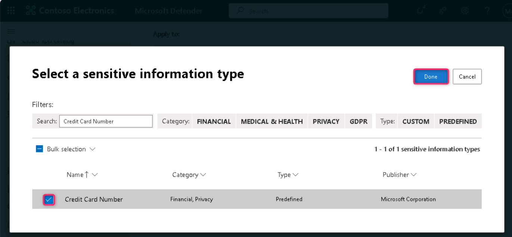

15. **「Alerts」セクション**で、 **「Create an alert for each matching file」**の横にあるチェックボックスをオンにします。次に、「**Save as default settings」**ボタンをクリックします。

16. **\[Governance actions\]セクション**で、 **\[Microsoft OneDrive for Business\]を展開し**、 **\[Put in user quarantine\]を選択します**。

17. **\[Governance actions\]セクション**で、 **\[Microsoft SharePoint Online\]を展開し**、 **\[Put in user quarantine\]を選択します**。

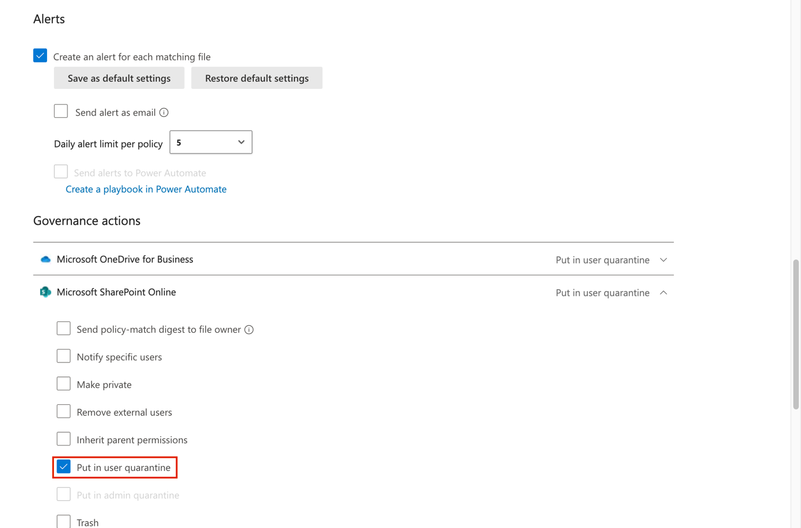

18. ページの下部にある**\[Create\]**を選択します。

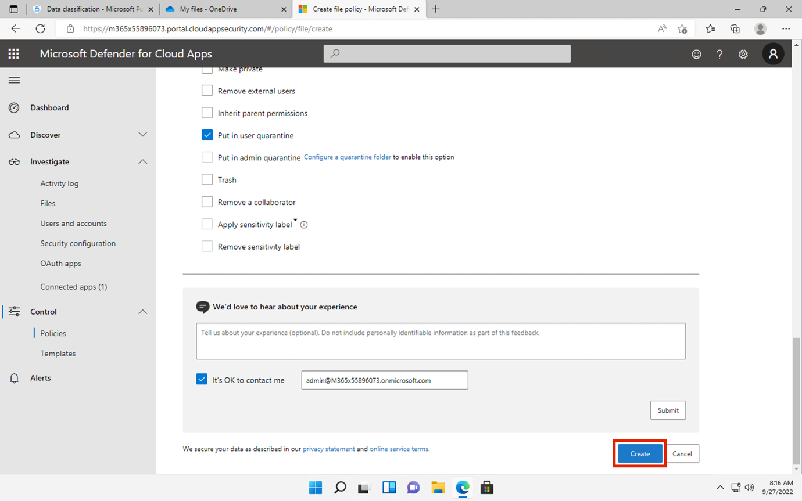

19. 右上にある MOD 管理者の**Profile picture**を選択し、歯車の横にある**\[Sign out\]を選択して**、ブラウザを閉じます。

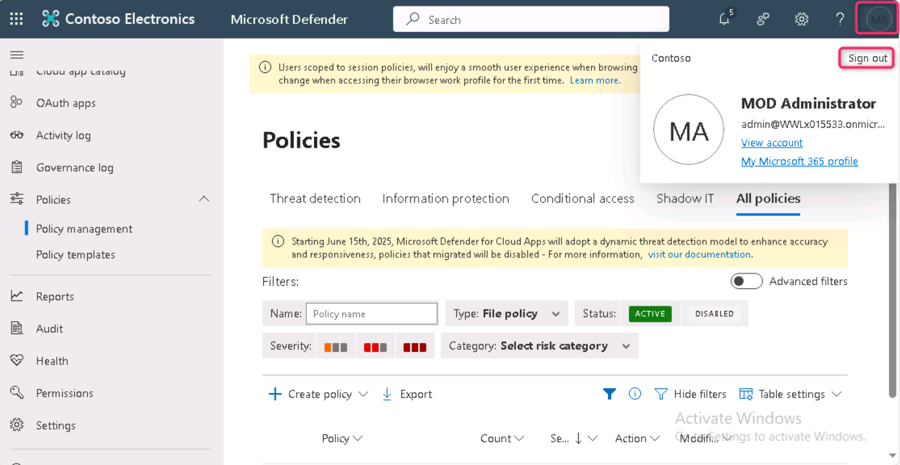

これで、OneDrive と SharePoint に保存されているファイルを継続的にスキャンしてクレジットカード情報を検索し、組織内で共有されている場合は隔離するファイル ポリシーが作成されました。

**タスク4 – Power PlatformのDLPポリシーの作成**

会社では、Power Automate フローを使用して SharePoint Online とSalesForce間でデータを共有しています。このタスクでは、既存のフローは引き続き動作させながら、 SharePoint Online と非ビジネスとして定義されたアプリ間でデータを共有するフローの作成を禁止する、 Power Platform の DLP ポリシーを作成します。

1.  **Microsoft Edge**で、 https://admin.powerplatform.microsoft.comに移動し、 **MOD Administrator**としてPower Platform 管理センターにログインします。

2.  **Power Platform admin centerの**ホームページで、 **\[Security\]に移動してクリックします**。

3.  次に、下の画像に示すように、 **「Data and privacy」アイコンをクリックします。**

4.  データ保護とプライバシーページで、**Data policyに移動してクリックします**。

5.  **\[Data policies\]ページ**で、 **\[+New Policy\]を選択します**。

6.  **\[Name your policy\]ページ**で、 「Tenant-wide SharePoint Policy」と入力し、 **\[Next\]を選択します**。

7.  **\[Non-business \| Default\]タブ**で**\[SharePoint**と**Salesforce\]**を選択し、ページの上部にある**\[Move to Business\]を選択します。**

8.  **\[Assign connectors\]ページ**で**\[Business\]タブ**を選択し、 SharePoint と Salesforce の両方が表示されていることを確認します。

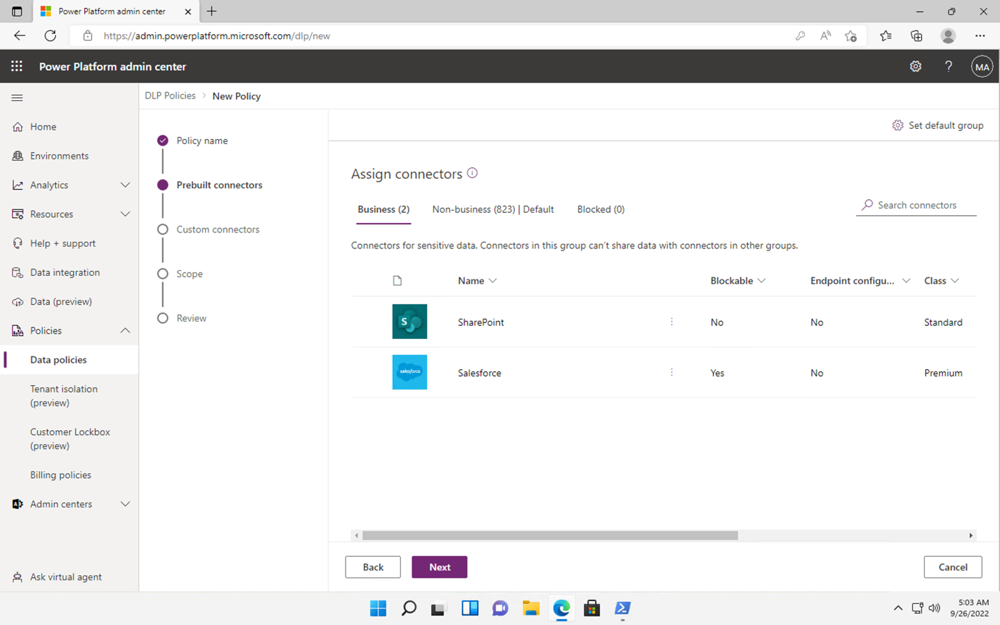

9.  **\[Next\]を2回**選択します。

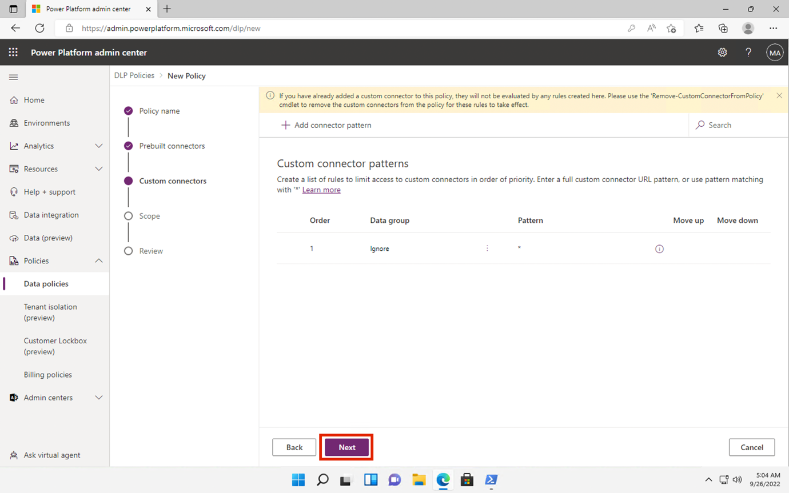

10. **\[Define scope\]ページ**で、 **\[Add all environments\]を選択し**、 **\[Next\]を選択します**。

11. **\[Review and create policy\]ページ**でポリシー設定を確認し、 **\[Create policy\] を選択します**。

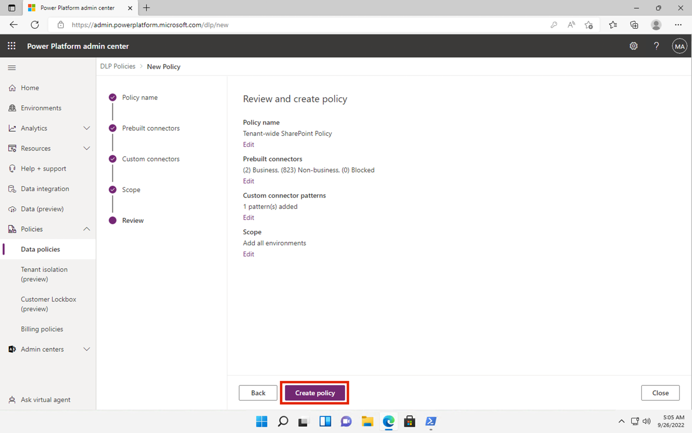

これで、SharePoint Online コネクタと Salesforce 以外のコネクタを含むフローをユーザーが作成できないようにする Power Platform DLP ポリシーが作成されました。

**まとめ：**

このラボでは、Microsoft Teams、Exchange、OneDrive、SharePoint、Power Platform 全体でクレジットカード番号や従業員IDなどの機密データを保護するためのData Loss Prevention (DLP) ポリシーを作成および管理しました。Microsoft Purview と PowerShell を使用してポリシーを構築し、ユーザー通知とオーバーライドを有効化し、ポリシーの優先順位付けを行い、Microsoft Defender でファイル監視を有効化し、ファイルの検疫アクションを構成しました。さらに、非ビジネスコネクタとのデータ共有を制限する Power Platform DLP ポリシーも作成しました。
