**ラボ7 – Insider Risk Managementの設定**

**導入**

このラボでは、Insider Risk Managementポリシーを使用してInsider Risk Managementを構成する方法を学習します。ラボ1で作成した機密情報の種類とラボ4で作成したDLPポリシーを使用して、リスクの高いブラウザの使用やデータの盗難・漏洩から組織を保護するポリシーを作成します。

これを実現するために、組織内のデバイスを表すインフラストラクチャをAzureに構築します。これらのデバイスをAzure ADとIntuneにオンボードし、MDMエージェントをインストールして、これらのデバイスからアラートを受信できるようにする方法を学習します。

**目的**

- VM クロックを同期して、ポリシー テストの正確な時間設定を確保します。

- Microsoft Purview の Insider Risk Management 役割グループにユーザーを割り当てます。

- テナントおよびユーザー レベルでインサイダー リスクを検出するための分析情報を有効にします。

- インサイダー リスクを監視するために、Windows 10 デバイスを Microsoft Defender for Endpoint にオンボードします。

- 次の Insider リスク管理ポリシーを作成して構成します。

  - 危険なブラウザの使用

  - 退会したユーザーによるデータ盗難

  - ユーザーによるデータ漏洩

- 各ポリシーにスコアを付けて、MOD administratorアカウントの内部リスク検出シナリオをシミュレートします。

**演習1 – エンビロンメントの設定**

**タスク0 – VMクロックを同期する**

1.  VM上で開いているMicrosoft Edgeブラウザのタブをすべて閉じます。**Windows**アイコンをクリックし**、**下の画像のように**「Settings」**をクリックします。

> 

2.  **Windows Settingsの**検索バーに「Date & time settings」と入力し、リストから**「Date & time settings」**を選択します。

> 

3.  **「Date & time」ページ**で、「**Sync now」**ボタンに移動してクリックします。

> 

**演習 2 – Insider Risk Managementポリシーを作成します。**

**前提条件**

**ステップ1 – Insider Risk Management役割グループにユーザーを追加する**

1.  Microsoft Purvieポータル ( https://purview.microsoft.com ) を開き、 **MOD Administrator**の資格情報でログインします。

2.  左側のナビゲーション メニューで、 **\[Settings\] をクリックします。**

> 

3.  **Settingsパネル**で、 **「Roles and scopes」**をクリックします。 **「Role groups」をクリックし、 「Insider Risk Management」**の横にあるチェックボックスをオンにして、鉛筆アイコンをクリックして編集します。

> 
>
> 

4.  **Edit Members of the role group** **ページ**で、**Choose usersをクリックします**。

> 

5.  **Alex Wilber の**横にあるチェックボックスをオンにします。次に、 **「Select」ボタン**をクリックします。Alex Wilber が既に選択されている場合は、この手順は無視してください。

> **注意**: メンバー編集名に Megan Bowen と MOD Administrator名が表示されない場合は、Alex 名に加えて、Megan Bowen と MOD Administrator名も選択してください。
>
> 

6.  MOD Administrator、Megan Bowen、Alex Wilber の名前が表示されていることを確認し、 **\[Next\]**ボタンをクリックします。

> 

7.  **\[Save\]**を選択して、ユーザーをロール グループに追加します。

> 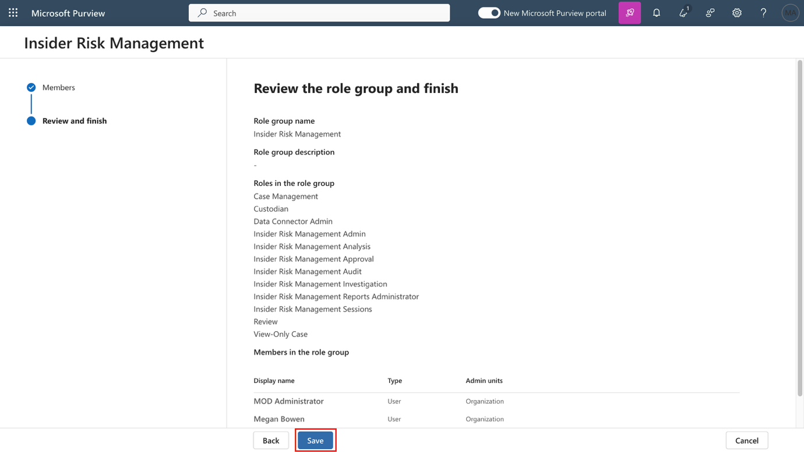

8.  手順を完了するには、 **「Done」**を選択します。

> 

**ステップ2 – インサイダーリスク分析のインサイトを有効にする**

1.  Microsoft Purviewポータルで、 **「Settings」**に移動し、**下にスクロールして「Insider Risk Management」**をクリックします。 **「Insider Risk Management settings- Analytics」ページで、 「Show insights at tenant level」**と**「Show insights at user level」**のトグルをオンにします。 **「Save」ボタン**をクリックします。

> 

**ステップ3 – デバイスのオンボーディング**

この展開シナリオでは、まだオンボードされていないデバイスをオンボードし、Windows 10 デバイスでの内部リスク アクティビティを検出することのみを目的としています。

インサイダー リスク ポリシーを作成するための前提条件として、デバイス/VM を Microsoft Entra ID に登録する必要があります。

1.  Windows アイコンをクリックし、下の画像に示すように**\[Settings\]を選択します。**

> 

2.  **「Accounts」**\>**「Access work or school」**に移動します。 **「Access work or school」ページ**で、 **「Connect」**をクリックします。

> 
>
> 

3.  **\[Set up a work or school account\] プロンプト**で、 **\[Join this device to Microsoft Entra ID\]**をクリックします。

> 

4.  サインイン プロンプトで、ラボエンビロンメントのリソース タブに指定された**MOD Administrator**の資格情報を使用してサインインします。

> 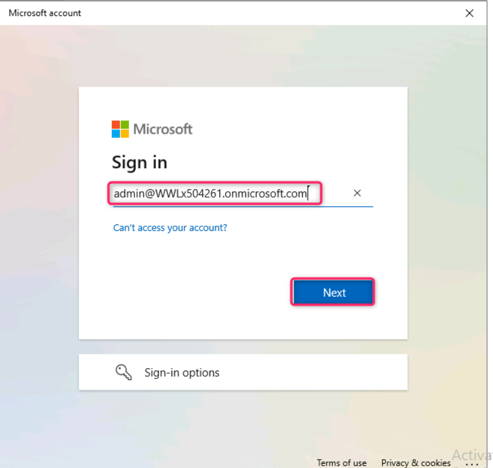
>
> 

5.  **「Make sure this is your organisation」**ダイアログボックスで、 **「Join」**ボタンをクリックします。

> 

6.  完了すると、「**You’re all set！」**という確認ウィンドウが表示されます。「**Done**」をクリックします。

7.  もう一度、 **\[Access work or school\]**ページで、 **\[Connect\]をクリックします**。

> 

8.  **Set up a work or school account** **プロンプト**で、MOD administratorの資格情報を使用してログインします。

> 
>
> 

9.  **\[Stay signed in?\]ダイアログ ボックス**で、 **\[Yes\]**ボタンをクリックします。

> 

10. **Setting up your device** **の**ダイアログ ボックスが表示されたら、 **\[Got it\]を選択します**。

> 

11. 次に、**windows settings** \> **Accounts** \> **Access work or school** \> **Connected to Contoso MDM** \> **Info** \> **Sync**に移動します。

> 
>
> 

12. VM上のWindowsシンボルをクリックします。ユーザー**「Admin」を選択し**、 **「Sign out」を選択します**。

> 

13. ユーザー画面で**「Other user」を選択します**。

> 

14. ラボエンビロンメントのホームページに記載されている O365 資格情報を入力し、 **MOD Administratorとして VM にログインします**。

> 

15. ラボ VM で**MOD Administratorアカウント**を使用してhttps://purview.microsoft.comにサインインします。

16. Microsoft Purviewポータルで、「**Settings** \> **Device** **onboarding \> Devices**」を選択します。「**Turn on Device onboarding**」をクリックします。

17. **\[Turn on device onboarding\]**ダイアログボックスで、 **\[OK\]**ボタンをクリックします。

> 

18. **Device monitoring is being turned on** ダイアログボックスで、 **\[OK\]**ボタンをクリックします。

> 

19. 数分待ってからページを更新してください。

> 
>
> 

20. **settings** \> **Device onboarding** \> **Onboarding**から、「Download package」をクリックします。

> 

21. ダウンロードしたら、ファイルをデスクトップにコピーします。ファイルを右クリックし、 **「Extract all…」を選択し**、 **「Extract」**ボタンをクリックします。

> 
>
> 
>
> 

22. 完了したら、フォルダーを開き、**Administrator**権限でファイルを実行します。

> 

23. **「Search for app in the Store?」のダイアログ ボックスが表示された**場合は、 **「Yes」ボタン**をクリックし、それ以外の場合は無視します。

24. 「**The publisher could not be verified. Are you sure you want to run this software?** 」というダイアログボックスが表示されたら、「**Run**」ボタンをクリックします。

> 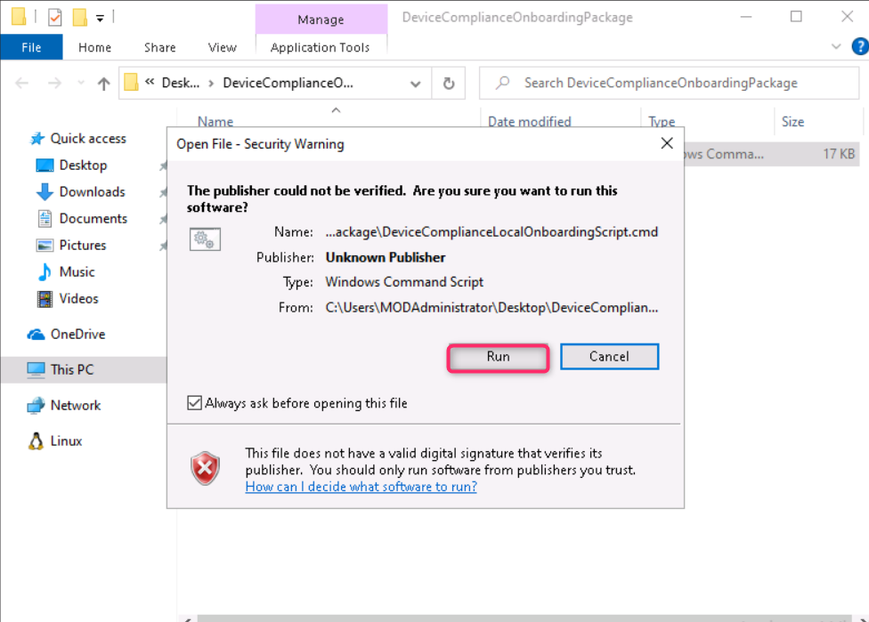

25. **「User Account Control」**ダイアログ **ボックスが表示され**たら、 **「Yes」**ボタンをクリックします。

> 

26. コマンドプロンプトで**Yを押し**、Enterキーを押して確定します。デバイスがオンボードされたことを示すメッセージが表示されます。コマンドプロンプトで「**Press any key to continue…」**というメッセージが表示されたら、任意のキーを押してください。

> 

27. コマンド プロンプトが閉じられたら、 Windows 検索バーに**「cmd」と入力してCommand Prompt**を管理者モードで開き、コマンド プロンプトを右クリックして**「Run as administrator」**を選択します。

> 

28. **\[User Account Control\]ダイアログ ボックス**で、\[Yes\] ボタンをクリックします。

> 

29. 次のコマンドを実行して検出テストを実行します。Command Promptウィンドウは自動的に閉じます。

> powershell.exe -NoExit -ExecutionPolicy Bypass -WindowStyle Hidden \$ErrorActionPreference= 'silentlycontinue';(New-ObjectSystem.Net.WebClient).DownloadFile('http://127.0.0.1/1.exe','C:\test-WDATP-test\invoice.exe');Start-Process 'C:\test-WDATP-test\invoice.exe'
>
> 

30. VM 接続を閉じます。

31. ナビゲーションの設定をクリックして**settingsを**開き、**Devices Onboarding** \> **Devices**を選択します。

> **注:**デバイスのオンボーディングが有効になるまでに通常約 60 秒かかりますが、最大 30 分ほどかかる場合があります。

32. **Devicesリスト**を確認できます。デバイスをオンボードするまでリストは空ですが、完了すると、VMがオンボードされたデバイスとして表示されます。

**タスク1 – 危険なブラウザの使用を検出してスコアリングするための組織全体のポリシーの作成**

**ステップ1 – 新しいポリシーを作成する**

1.  Microsoft Purviewポータルで、「Solutions」をクリックし、 **「Insider Risk Management」をクリックします。**

> 

2.  **「Policies」**をクリックします。「Policies」ページで、 **「+ Create policy \> Custom policy」をクリックします**。

> 

3.  \[Choose a policy template\] ページで、\[Risky browser usage (preview)\] の \[Risky browser usage (preview)\] を選択します。

> 

4.  すべての前提条件を確認してください。

> 

5.  **「Next」**を選択します。

> 

6.  **「Name and Description」ページ**で、次のフィールドに入力します。

    - Name: Risky usage of browser

    - Description: This is a test policy for the risky browser usage

7.  **「Next」**を選択します。

> 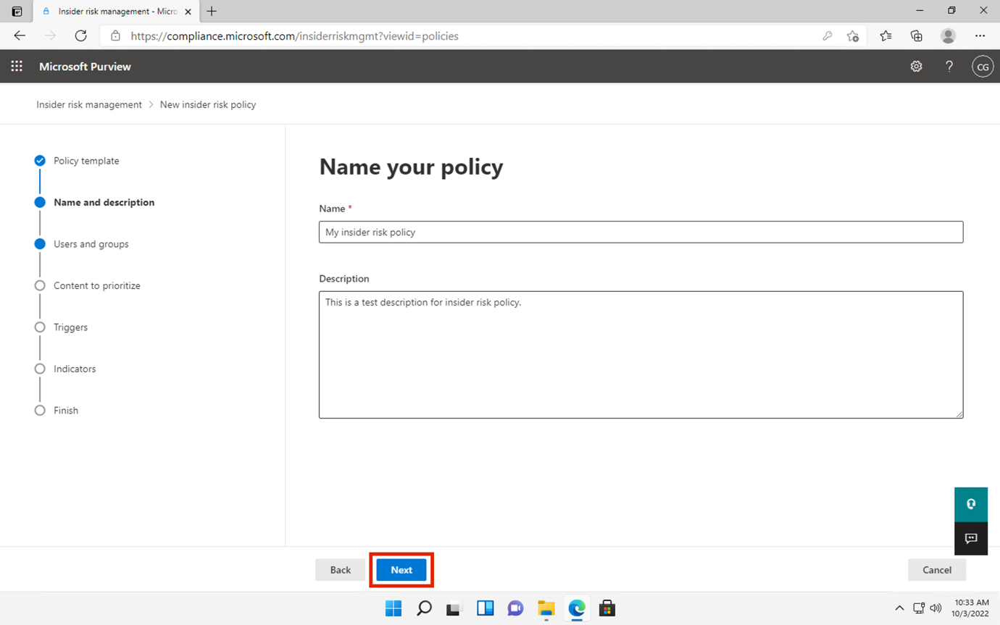

8.  **「Choose users, groups, & adaptive scopes」ページ**で、 **「All users, groups, & adaptive scopes」を選択します**。 **「Next」を選択して**続行します。

> 

9.  **\[Exclude users and groups\]ページ**で、 **\[Next\]を選択します**。

> 

10. 「Decide whether to prioritize」ページで、「**I don't want to priority content right now」を選択します**。 **「Next」**を選択して続行します。

> 

11. **\[Choose triggering event for this policy\]**ページで、 **\[Turn on indicators\]**ボタンを選択します。

> 

12. **Turn on indicators for your organization**ダイアログボックスで、下にスクロールして、**Choose indicators to turn on** ボタンをクリックします。

> 
>
> 

13. **\[Choose indicators to turn on\]ダイアログ ボックス**で、\[Risky browsing indicators (preview)\] のすべてのインジケーターが選択されていることを確認します。

> 
>
> 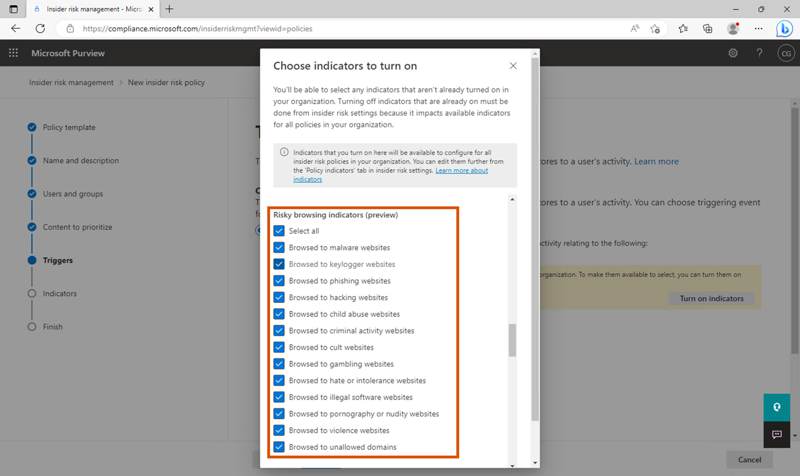

14. 下にスクロールして**「Save」を選択します**。

15. **「Choose triggering event for this policy」ページ**で、 **「User browsed to a potentially risky website」**の横にあるラジオボタンが選択されていることを確認します。 **「Select which activities will trigger this policy」**の下で、すべてのオプションを選択し、「Next」ボタンをクリックします。

> 

16. **\[Choose thresholds for triggering events\]**ページで、 **\[Choose your own thresholds\]**ラジオ ボタンを選択し、すべてのしきい値を 1 日あたり 1 に変更して、 **\[Next\]を選択します**。

> 
>
> 

17. **Indicators**ページで、 **\[Next\]を選択します**。

> 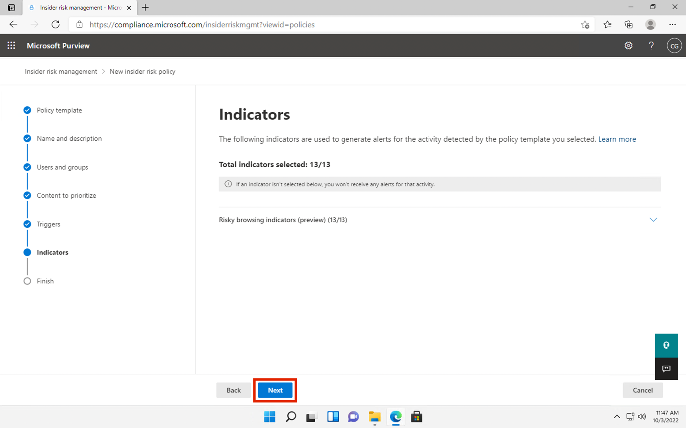

18. **\[Choose threshold type for indicators\]**ページで、 **\[Apply thresholds provided by Microsoft\]**が選択されていることを確認し、 **\[Next\]**ボタンをクリックします。

> 

19. **Review settings and finish** ページで、 **\[Submit\]を選択します**。

> 

20. **「Your policy was created」ページ**で、 **「Done」を選択します**。

> 

21. タブを開いたまま、次のタスクに進みます。

**ステップ2 – ポリシーを評価する**

1.  「Risky usage of browser」という新しいポリシーをクリックします。「**Start scoring activity for users」を選択します**。

> 

2.  「Reason for scoring activity」フィールドに「Testing the policy」と入力します。 **「Scoring activity for this many days (between 5 and 30)」**フィールドで**「10 days」を選択します**。

> 

3.  Score activity for these usersフィールドに「MOD」と入力し、MOD administratorを選択します。

> 

4.  次に、 **「Start scoring activity」**ボタンをクリックします。

> 

5.  **\[Close\]ボタン**をクリックします。

> 

**タスク2 – 退職ユーザーによるデータ盗難**

**ステップ1 – 新しいポリシーを作成する**

1.  **「Policies」ページ**で、 **「+ Create policy」**をクリックし、 **「Custom policy」を選択します**。

> 

2.  「Choose a policy template」ページで、「Data theft」の「Data theft by departing users」を選択します。「Next」を選択して続行します。

> 

3.  **「Name and description」ページ**で、次のフィールドに入力します。

    - Name: Data theft by a user

    - Description: This is a test policy for preventing data theft

4.  **「Next」**を選択します。

> 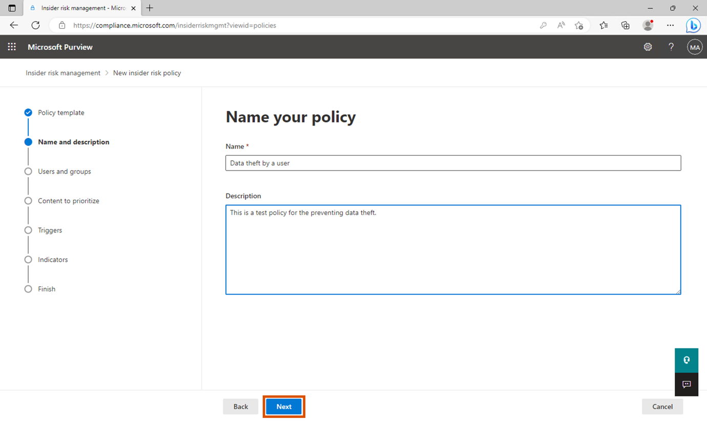

5.  **\[Choose users, groups, & adaptive scopes\]ページ**で、\[\*\*All users, groups, and adaptive scopes\*\*\] の横にあるラジオ ボタンを選択し、 **\[Next\]**ボタンをクリックします。

\

6.  **\[Exclude users and groups (optional)\]**ページで、 **\[Next\]**ボタンをクリックします。

\

6.  **「Decide whether to prioritize content」ページ**で、 **「I want to prioritize content」を選択します。 「Sensitivity labels」**と**「Sensitivity info types」**のチェックボックスのみをオンにします。 **「Next」を選択して**続行します。

> 

7.  **「Sensitivity labels to prioritize」ページ**で、 **「Add or edit sensitivity labels」を選択します**。「Sensitivity labelsの追加または編集」検索バーに「従業員」と入力してEnterキーを押し、 **「Internal/Employee data (HR)」を選択して「Add」**を選択します。「Next」をクリックします。

> 

8.  **「Sensitive info types to prioritize」ページ**で、 **「Add or edit sensitive info types」を選択します。ポップアップウィンドウで、 「Credit Card Number」** 、 **「Contoso Employee ID」** 、 **「Contoso Employee EDM」**を検索して選択します。 **「Add」を選択します**。「Next」**をクリックします**。

> 

9.  **「Decide whether to score only activity with priority content」**で、「**Get alerts for all activity」が選択されていることを確認します。「Next」ボタン**をクリックします。

> 

10. **\[Choose triggering event for this policy\]ページ**で、デフォルトの選択をそのままにして**\[Next\]を選択します**。

> 

11. **\[Indicators\]ページ**で、 **\[Office indicators (31/31 selected)\]**の横にあるドロップダウンをクリックします。

> 

12. すべての Office インジケーターが選択されていることを確認し、 **\[Next\]**ボタンをクリックします。

> 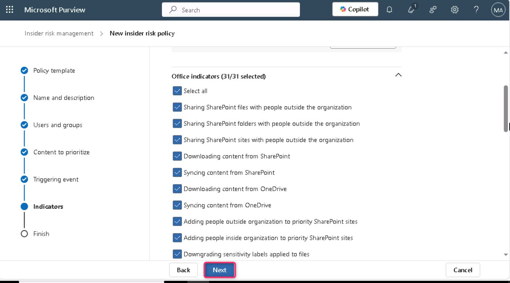

13. **Detection options** **ページ**のすべてのパラメータをデフォルト状態のままにして、 **「Next」**ボタンをクリックします。

> 

14. **\[Choose threshold type for indicators\]ページ**で、 **\[Choose your own thresholds\]**の横にあるラジオ ボタンを選択し、下にスクロールして \[Office Indicators\] ドロップダウンをクリックします。

> 
>
> 

15. **\[Sharing SharePoint files with people outside the organization**\] で、各ステージにそれぞれ 1、2、3 のイベントを使用し、 **\[Next\]を選択します**。

> 

16. **\[Review settings and finish**\]**ページ**で、 **\[Submit\]**ボタンをクリックします。

> 

17. Your policy was createdで、\[Done\] を選択します。

> 

**ステップ2 – ポリシーを評価する**

1.  **「Data theft by a user」**という新しいポリシーをクリックします。 **「Start scoring activity for users」を選択します**。

> 

2.  「Reason for scoring activity」フィールドに「ポリシーのテスト」と入力します。 **「Scoring activity for this many days (between 5 and 30)」**フィールドで**「10 days」を選択します**。

> 

3.  Score activity for these usersフィールドに「MOD」と入力し、MOD administratorを選択します。

> 

4.  次に、 **「Start scoring activity」**ボタンをクリックします。

> 

5.  **\[Close\]ボタン**をクリックします。

> 

**タスク3 – ユーザーによるデータ漏洩**

**ステップ1 – 新しいポリシーを作成する**

1.  **「Policies」ページ**で、 **「+Create policy」**をクリックし、 **「Custom policy」を選択します**。

> 

2.  **「Choose a policy template」ページ**で、 「Data leaks」の**「Data leaks」を選択します**。 **「Next」を選択して**続行します。

> 

3.  **「Name and Description」ページ**で、次のフィールドに入力します。

    - Name: Data leaks by a user

    - Description: This is a test policy for preventing data leaks

4.  **「Next」**を選択します。

> 

5.  **「Choose users, groups, & adaptive scopes」**ページで、 **「All users, groups, and adaptive scopes」**ラジオボタンが選択されていることを確認します。 **「Next」**ボタンをクリックして続行します。

> 
>
> **\[Exclude users and groups (optional)\]**ページで、 **\[Next\]**ボタンをクリックします。

6.  **「Decide whether to prioritize」ページ**で、 **「I want to priority content」を選択します。 「SharePoint sites」、「Sensitivity labels」、「Sensitivity info types」**のチェックボックスをオンにします。 **「Next」**ボタンをクリックします。

> 

7.  **「SharePoint sites to prioritize」ページ**で、 **「Add or edit SharePoint sites」を選択します**。ポップアップペインに「https://WWLxXXXXXX.sharepoint.com/sites/ContosoWeb1 」と入力し、 **「Contoso Web 1」**の横にあるチェックボックスをオンにして、 **「Add」**ボタンをクリックします。「Next」**をクリックします**。

> **注**: **XXXXXX**テナント プレフィックスは、 **\[Resources\]**タブで使用できます。
>
> 
>
> 
>
> 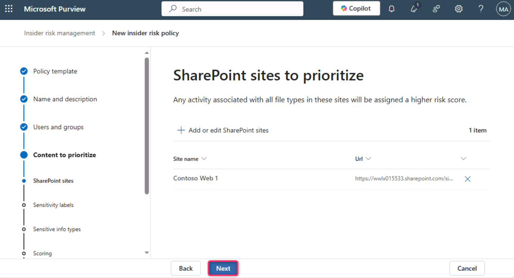

8.  **「Sensitivity labels to prioritize」ページ**で、 **「Add or edit sensitivity labels」を選択します**。ポップアップペインで「employee」と入力し、「Internal/Employee data (HR)」チェックボックスをオンにして、 **「Add」ボタンをクリックします。 「Next」ボタン**をクリックします。

> 
>
> 

9.  **「Sensitive info types to prioritize」ページ**で、 **「Add or edit sensitive info types」を選択します。ポップアップウィンドウで、** 「Credit Card Number, Contoso Employee ID と Contoso Employee EDM」を検索して選択します。 **「Add」を選択します**。「Next」**をクリックします**。

\

11. **「Decide whether to score only activity with priority content」**で、 **「Get alerts for all activity」を選択します**。 **「Next」を選択します**。

> 

12. **「Choose triggering event for this policy」ページ**で、 **「User performs an exfiltration activity」の**ラジオボタンが選択されていることを確認します。 **「Select which activities will trigger this policy」で**、 **「Download content from SharePoint, Sending email with attachments to recipients outside the organisation**, **Sharing SharePoint files with people outside the organization」を選択し**、 **「Next」を選択します**。

> 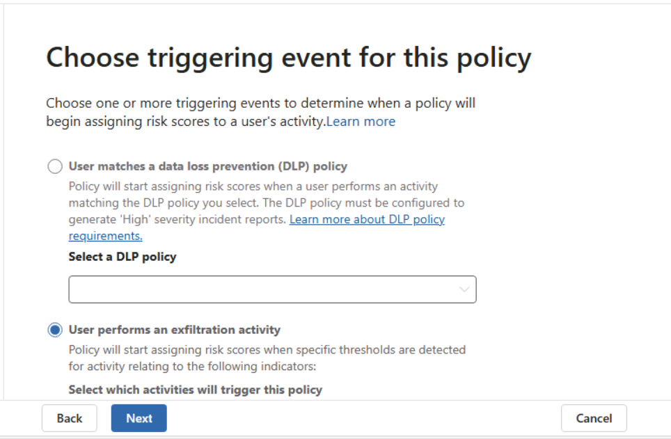
>
> 

13. **「Choose thresholds for trigerring events」ページ**で、 **「Choose your own thresholds」**の横にあるラジオボタンを選択します。すべてのしきい値を1に設定し、 **「Next」を選択します**。

> 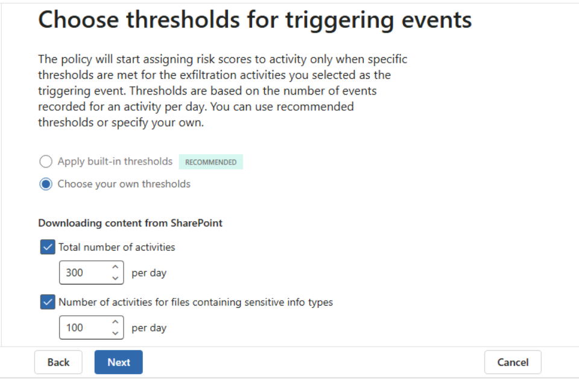
>
> 

14. **\[Indicators\]ページ**でデフォルト設定を維持し、 **\[Next\]を選択します**。

> 

15. **Detection optionsページ**でデフォルト設定を維持し、 **\[Next\]を選択します**。

> 

16. **「Choose threshold type for indicators」**ページで、 **「Choose your own thresholds」**ラジオボタンが選択されていることを確認します。次に、「Office Indicators」をクリックし、各ステージにそれぞれ1、2、3のイベントを指定して、 **「Next」を選択します**。

> 
>
> 
>
> 

17. **Review settings and finishで**、 **\[Submit\]を選択します**。

> 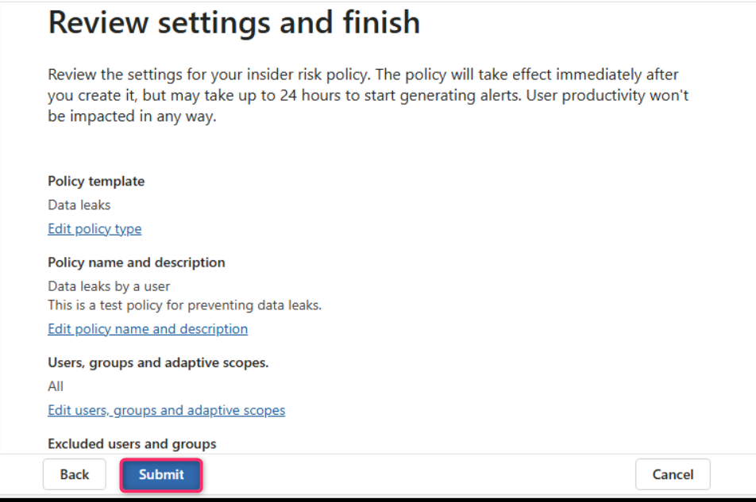

18. Your policy was createdで、\[Done\] を選択します。

> 

**ステップ2 – ポリシーを評価する**

1.  **「Policies」ページ**で、 **「**named **Data leaks by a user」**という新しいポリシーの横にあるチェックボックスをオンにします。次に、 **「Start scoring activity for users」を選択します**。

> 

2.  「Reason for scoring activity」フィールドに「Testing the policy」と入力します。 **「Scoring activity for this many days (between 5 and 30)**」フィールドで**「10 days」を選択します**。 「Score activity for these users」フィールドに「MOD」と入力し、「MOD administrator」を選択します。

> 
>
> 

3.  次に、 **「Start scoring activity」**ボタンをクリックします。

> 

4.  **\[Close\]ボタン**をクリックします。

> 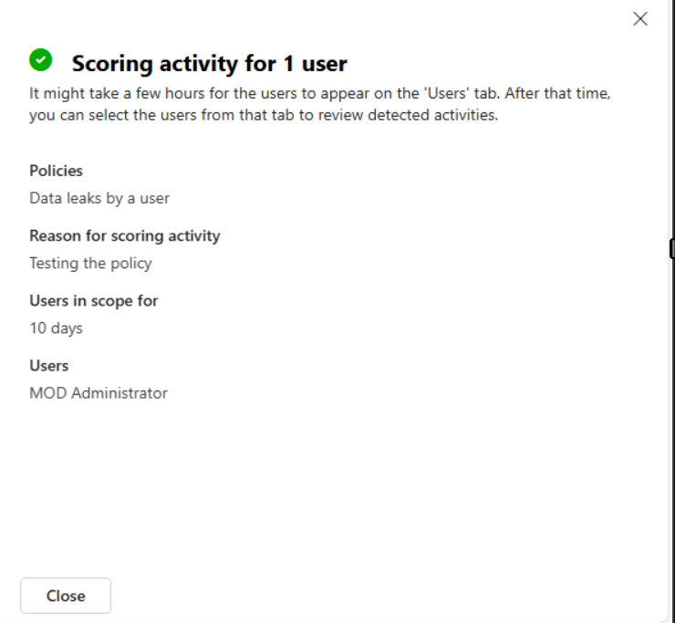

**まとめ：**

このラボでは、まずVMのクロックを同期し、Microsoft PurviewのInsider Risk Managementに必要なユーザーとデバイスをオンボードすることで環境を準備しました。分析情報を有効にし、すべての対象VMでDefenderマルウェア対策クライアントのバージョンを確認しました。デバイスのオンボード後、危険なブラウザの使用、退職ユーザーによる潜在的なデータ盗難、社内ユーザーによるデータ漏洩に関連するアクティビティを監視およびスコアリングするための3つの異なるInsider Risk Managementポリシーを作成しました。各ポリシーは、Sensitivity labels、SharePointサイト、Sensitivity info typesを優先コンテンツとしてカスタマイズし、アラートとスコアリングをトリガーするためのしきい値を構成しました。最後に、実際のインサイダーリスクシナリオをシミュレートし、構成したポリシーの有効性を評価するためのスコアリングアクティビティを開始しました。
