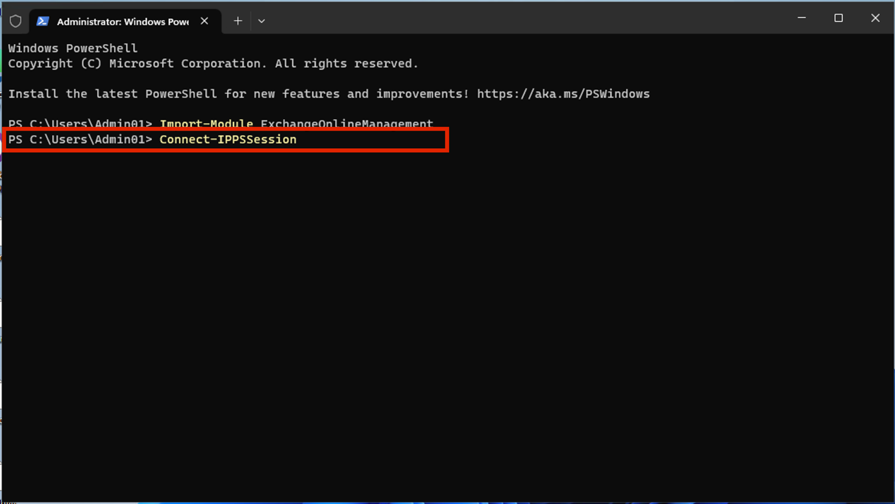
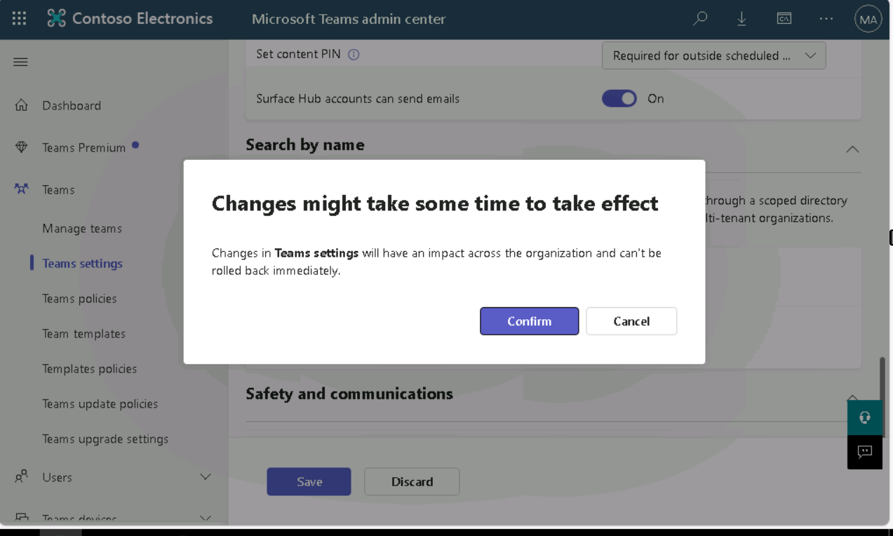
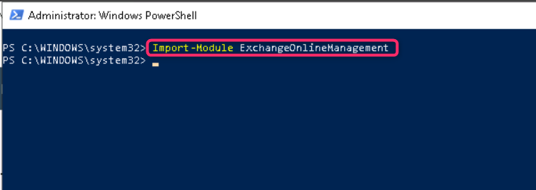
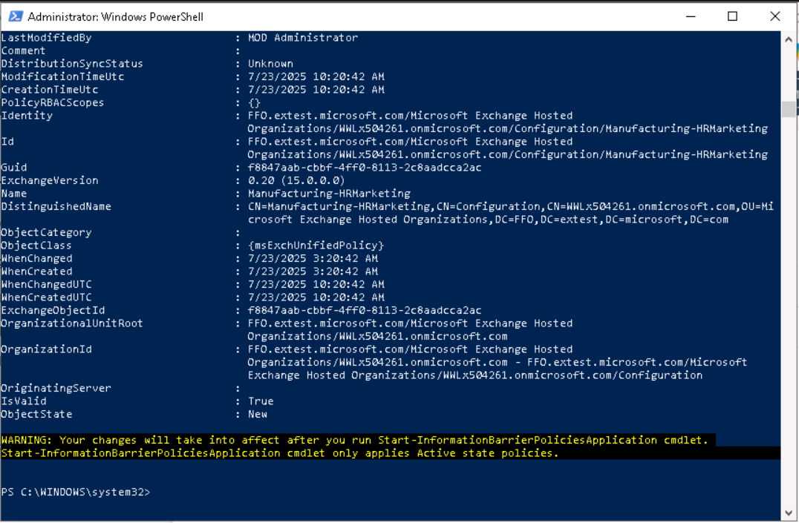

**ラボ8 – Information Barriersの設定**

**導入**

Contosoには、*人事*、*セールス*、*マーケティング*、*研究*、*製造の5つの部門があります*。業界の規制に準拠するため、次の表に示すように、一部の部門のユーザーは他の部門とのコミュニケーションを禁止されています。

| **セグメント** | **コミュニケーションできる** | **通信できません** |
|----|----|----|
| 人事 | みんな | （制限なし） |
| セールス | 人事、マーケティング、製造 | 研究 |
| マーケティング | みんな | （制限なし） |
| 研究 | 人事、マーケティング、製造 | 販売 |
| 製造業 | 人事、マーケティング | 人事またはマーケティング以外の人 |

この構造では、Contoso の計画には 3 つの IB ポリシーが含まれています。

1.  営業部門がリサーチ部門と連絡を取ることを防ぐためのIBポリシー

2.  リサーチ部門がセールス部門と通信できないようにする別の IB ポリシー。

3.  製造部門が HR およびマーケティング部門とのみ通信できるように設計された IB ポリシー。

**目的**

- Information Barriers (IB) 実装用に PowerShell を使用して組織セグメントを設定します。

- Microsoft Teams でスコープ ディレクトリ検索を有効にして、セグメント ベースのユーザー可視性を強化します。

- Microsoft Purview ポータルと PowerShell を使用してInformation Barriers (IB) ポリシーを作成し、セグメント間通信を制御します。

**演習1 – 前提条件**

**タスク 1 – 組織内のユーザーのセグメントを作成する**

1.  Windowsアイコンを右クリックし、 **Windows PowerShell（Admin）に移動してクリックします。** 

> 

2.  **「User Account Control」ダイアログ ボックス**で、 **「Yes」**ボタンをクリックします。

> 

3.  次を実行します:

> Install-Module ExchangeOnlineManagement

4.  「**Do you want PowerShellGet to install and import the NuGet provider now?**」および「’**Are you sure you want to install the modules from 'PSGallery'?**」というメッセージが表示されたら、 **y**と入力して Enter キーを押します。

> 

5.  次のコマンドを実行します。

> Import-Module ExchangeOnlineManagement
>
> 

6.  次のコマンドを実行して、Exchange Online に接続します。

> Connect-IPPSSession
>
> 

7.  ラボエンビロンメントのホームページに記載されている**MOD Administrator**の資格情報を使用してログインします。

> **注: 「Automatically sign in to all desktop apps and websites on this device?」という**ダイアログ ボックスが表示された場合は、 **「No, this app only」**ボタンをクリックします。
>
> 
>
> 

8.  組織構造を作成するには、 **PowerShell**で次のコマンドを 1 つずつ実行します。

> New-OrganizationSegment -Name "HR" -UserGroupFilter "Department -eq 'HR'"
>
> 
>
> New-OrganizationSegment -Name "Sales" -UserGroupFilter "Department -eq 'Sales'"
>
> New-OrganizationSegment -Name "Marketing" -UserGroupFilter "Department -eq 'Marketing'"
>
> New-OrganizationSegment -Name "Research" -UserGroupFilter "Department -eq 'Research'"
>
> New-OrganizationSegment -Name "Manufacturing" -UserGroupFilter "Department -eq 'Manufacturing'"

**タスク 2 – Microsoft Teams でスコープ ディレクトリ検索を有効にする**

名前による検索をオンにするには

1.  https://admin.teams.microsoft.comにアクセスし、 **\[Teams\]** \> **\[Teams settings\]を選択して、** Microsoft Teams admin centerに移動します。

> 

2.  **「Search by name」**の**「Scope directory search using an Exchange address book policy」**の横にあるトグルをOnにします**。** 「**Save」を選択します**。

> 

3.  **Changes might take some time to take effect**ダイアログボックスが表示された場合は、 **「Confirm」**ボタンをクリックします。

> 

**演習2 – IBポリシーの作成**

**タスク1 – セグメント間の通信をブロックする**

1.  Microsoft Purview ポータルで、 **\[Solutions\]** \> **\[Information Barriers\]をクリックします**。

> 

2.  「Information Barriers」ブレードで「Policies」をクリックし、「Policies」を選択します。「Policies」ページで「+Create policy」を選択し、新しいIBポリシーを作成して構成します。

> 

3.  **Provide a policy name** **ページ**で、「Name」フィールドにポリシー名（ Sales-Research ）を入力します。次に、 **「Next」を選択します**。

> 

4.  **「Add assigned segment」の詳細ページ**で、 **「Choose segment」を選択します**。 **「On Select assigned segment for this policy」**ペインで、 **「Sales」を選択します。 「Add」**を選択して、選択したセグメントをポリシーに追加します。選択できるセグメントは1つだけです。

> 

5.  **「Next」**を選択します。

> 

6.  **「Configure Communication and collaboration details」ページ**で、 **「Block」を選択します**。 **「Choose segment」を選択し**、 **「Research」を選択して**、 **「Add」を選択します。**

> 
>
> 

7.  次に、 **「Next」**ボタンをクリックします。

> 

8.  **「Configure Policy status」ページ**で、アクティブなポリシーのステータスを**「On」に切り替えます**。 **「Next」を選択して**続行します。

> 

9.  **「Review your settings」ページ**で、ポリシーに選択した設定と、選択内容に関する提案や警告を確認します。 **「Submit」を選択して**ポリシーを作成します。

> 

10. ポリシーが作成されたら、 **\[Done\]**を選択します。

> 

11. Sales-Research IBポリシーが正常に作成されました。

> 

**タスク2 – PowerShellを使用してIBポリシーを作成する**

1.  **Administrator: Windows PowerShell**に戻り、次のコマンドを実行します。

> Import-Module ExchangeOnlineManagement
>
> 

2.  次のコマンドを実行して、Exchange Online に接続します。

> Connect-IPPSSession
>
> 

3.  ラボエンビロンメントのホームページに記載されている**MOD administratorの**資格情報を使用してログインします。

> **注: 「Automatically sign in to all desktop apps and websites on this device?」という**ダイアログ ボックスが表示された場合は、 **「No, this app only」**ボタンをクリックします。
>
> 
>
> 

4.  次のコマンドを実行して、「**Research-Sales」というIBポリシーを作成します。このポリシーをアクティブにして適用すると、 Researchセグメント**のユーザーが**Salesセグメント**のユーザーと通信するのを防ぐことができます。

> New-InformationBarrierPolicy -Name "Research-Sales" - AssignedSegment "Research" -SegmentsBlocked "Sales" -State Inactive
>
> 
>
> 

5.  次のコマンドを実行して、「**Manufacturing - HRMarketing」というIBポリシーを作成します**。このポリシーがアクティブ化され適用されると、 **ManufacturingはHR**および**Marketing**とのみ通信できます。HRとMarketingは他のセグメントとの通信を制限されません。

> New-InformationBarrierPolicy -Name "Manufacturing-HRMarketing" - AssignedSegment "Manufacturing" -SegmentsAllowed "HR","Marketing","Manufacturing" -State Inactive
>
> 

6.  Microsoft Purview ポータルに戻り、「Information Barriers – Policies」ページを更新すると、PowerShell を使用して作成したポリシーが表示されます。

> 

**まとめ**

このラボでは、PowerShellを使用して組織セグメント（人事、セールス、マーケティング、研究、製造）を作成し、Microsoft Teamsでスコープ付きディレクトリ検索を有効にして、ユーザーの可視性をセグメント制限に合わせて調整しました。次に、Microsoft Purview内でIBポリシーを設定し、特定のセグメント間の通信をブロックまたは許可しました（例：営業と研究の通信をブロックする）。これらのポリシーは、ハンズオン演習のためにポータルとPowerShellの両方を使用して作成しました。
