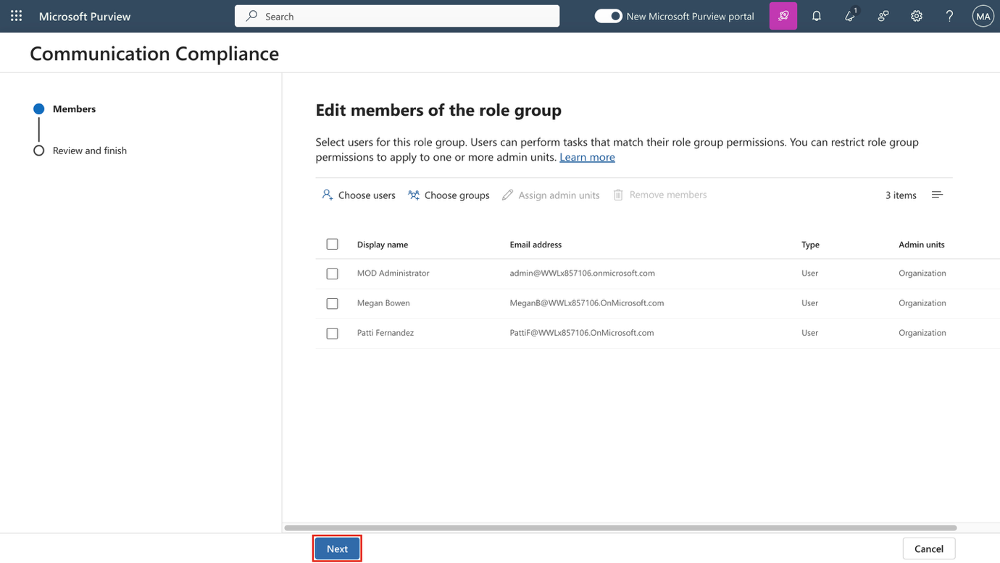
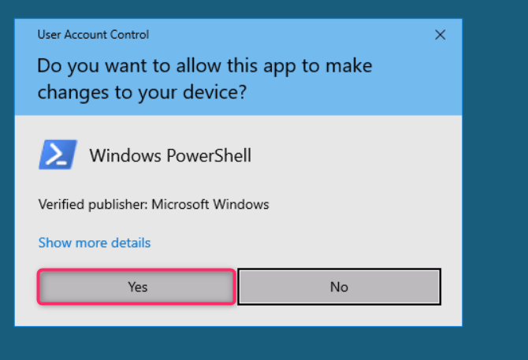
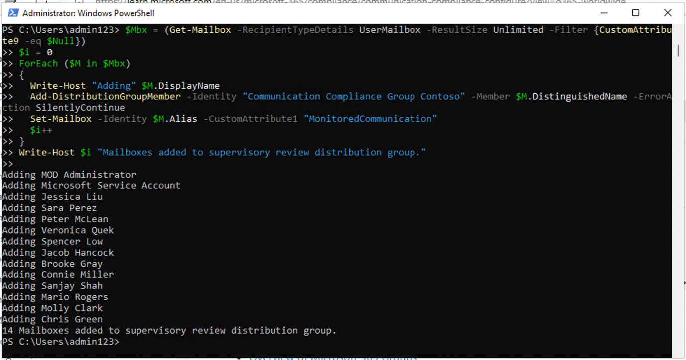
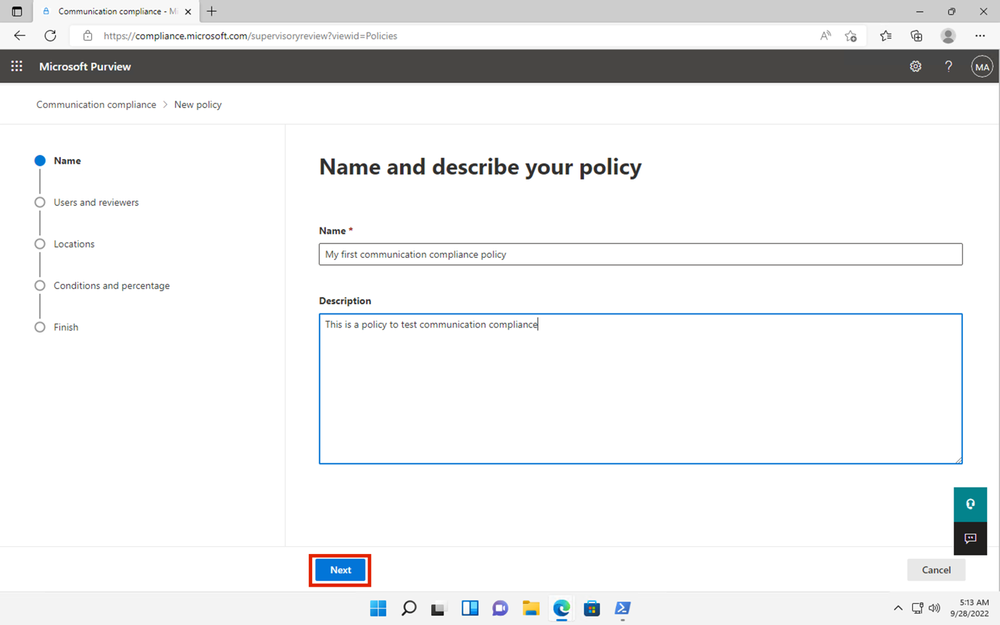
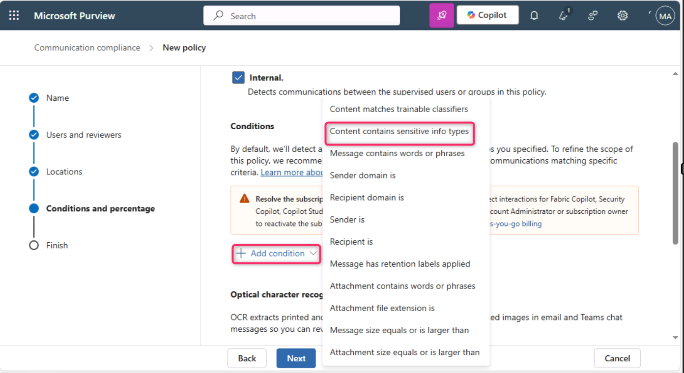
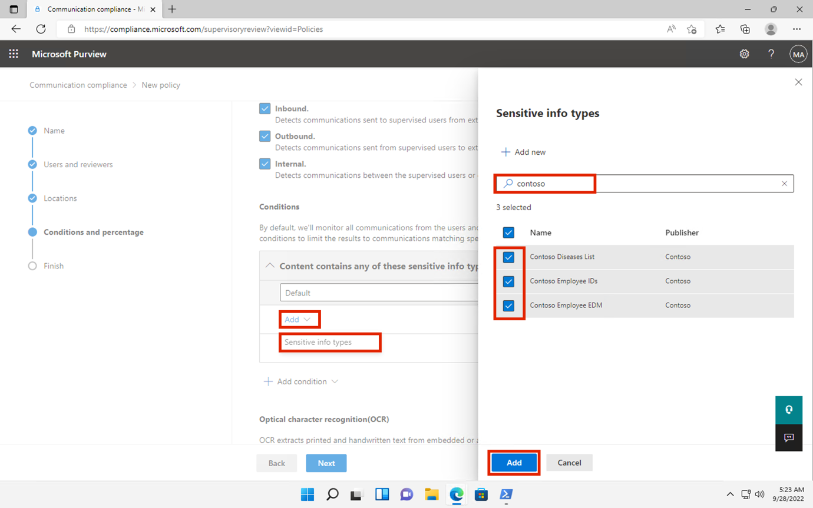
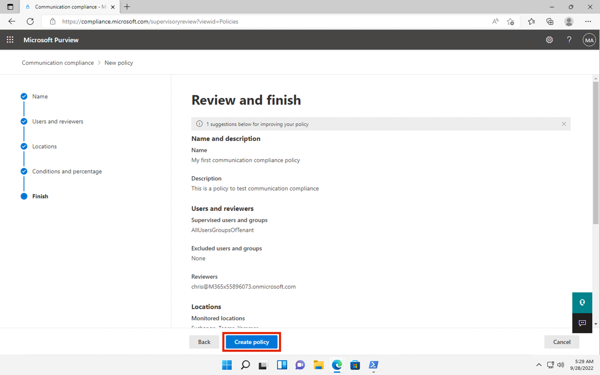

**ラボ9 – Communication Complianceの設定**

**導入**

このラボでは、組織内のユーザーが伝達する機密情報を検出するコンプライアンスポリシーを設定します。前のラボで作成したSensitive info typesを使用して、従業員の健康データや従業員IDがメールで伝達されるのを検出します。

**目的**

- Communication Compliance アクセスのロールを割り当てます。

- PowerShell を使用して配布グループを作成します。

- Communication Compliance ポリシーを構成および編集します。

- 匿名化とユーザー通知を有効にします。

- ポリシーのテストプロセスを理解します。

**演習1 – Communication Complianceのための権限の有効化**

このタスクでは、ユーザーを特定の役割グループに割り当てて、組織内のさまざまなユーザー間でCommunication Compliance アクセスと責任をセグメント化します。

1.  ナビゲーションメニューで**「Settings」を選択し**、 **「Roles and scopes」を選択します。 「Role groups」**に移動してクリックします**。**

> 

2.  **「Communication Compliance」**の横にあるチェックボックスをオンにします。次に、鉛筆アイコンをクリックして編集します。

> 

3.  **Edit members of the role group**、 **\[Choose users\] を**選択します。

> 

4.  **MOD Administrator** 、 **Megan Bowen** 、 **Patti Fernandez を**必ず選択してください。次に、 **「Select」を選択します**。

> 

5.  **「Next」**を選択します。

> 

6.  **「Save」**を選択して、ユーザーをロールグループに追加します。 **「Done」を選択して**手順を完了します。

> 
>
> 

**演習2 – Communication Complianceのためのグループの設定**

このポリシーでは、メールアドレスを使用して個人またはグループを識別します。設定を簡素化するために、コミュニケーションをレビューするユーザーと、コミュニケーションをレビューするユーザーをそれぞれグループ分けすることができます。

PowerShell を使用して、割り当てられたグループにグローバルなCommunication Complianceポリシーを適用する配布グループを構成できます。これにより、単一のポリシーで数千人のユーザーへのメッセージを検出し、組織に新しい従業員が加わってもCommunication Complianceポリシーを最新の状態に保つことができます。

1.  Windowsアイコンを右クリックし、「**Windows PowerShell（Admin）**」を選択します。

> 

2.  \[User Account Control\] ダイアログ ボックスで**\[Yes\]を選択します**。

> 

3.  **Exchange Online PowerShell**モジュールを使用してテナントに接続するには、次のコマンドレットを入力します。

> Connect-ExchangeOnline
>
> 

4.  **Sign inウィンドウが表示され**たら、 **MOD administrator**としてサインインします。**Automatically sign in to all desktop apps and websites on this device?というダイアログボックスが表示されたら、 「No, this app only」**ボタンを選択します。

> 
>
> 

5.  次のプロパティを持つグローバルCommunication Compliance ポリシー専用の配布グループを作成します。

    - **MemberDepartRestriction = Closed** 。ユーザーが配布グループから自分自身を削除できないようにします。

    - **MemberJoinRestriction = Closed** 。ユーザーが自分自身を配布グループに追加できないようにします。

    - **ModerationEnabled = True** 。このグループに送信されるすべてのメッセージが承認の対象となり、このグループがCommunication Compliance ポリシー構成外での通信に使用されないことを確認します。

> New-DistributionGroup -Name "Communication Compliance Group Contoso" -Alias "CCG_Contoso" -MemberDepartRestriction 'Closed' -MemberJoinRestriction 'Closed' -ModerationEnabled \$true

6.  

7.  **注:**組織内のCommunication Compliance ポリシーに追加されたユーザーを追跡するには、次のコマンドのように**Exchange Custom Attribute** を追加できます。

8.  Set-DistributionGroup -Identity "Communication Compliance Group Contoso" -CustomAttribute1 "MonitoredCommunication"

9.  

10. 定期的なスケジュールで次の PowerShell スクリプトを実行して、ユーザーをCommunication Compliance ポリシーに追加します。

11. \$Mbx = (Get-Mailbox -RecipientTypeDetails UserMailbox -ResultSize Unlimited -Filter {CustomAttribute9 -eq \$Null})

12. \$i = 0

13. ForEach (\$M in \$Mbx)

14. {

15. Write-Host "Adding" \$M.DisplayName

16. Add-DistributionGroupMember -Identity "Communication Compliance Group Contoso" -Member \$M.DistinguishedName -ErrorAction SilentlyContinue

17. Set-Mailbox -Identity \$M.Alias -CustomAttribute1 "MonitoredCommunication"

18. \$i++

19. }

20. Write-Host \$i "Mailboxes added to supervisory review distribution group."

21. 

22. スクリプトから出力が生成されたら、新しいタブを開き、次の URL を入力します: https://admin.cloud.microsoft/ と入力して、Microsoft 365 管理センターを開きます。

> **多要素認証**を設定するように求められたら、 **「Skip for now」を選択します**。

23. Microsoft 365 管理センターページで、 **\[Teams & groups** \> **Active teams & groups** \> **Distribution list** \> **Communication** Compliance Group Contoso.\]に移動してクリックします。\*\*

> 

24. 右側に表示される \[Communication Compliance\] ペインで \[**メンバー\]**タブをクリックし、下にスクロールして \[配布リスト\] グループ内のすべてのメンバーを確認します。

\

\

**演習3 – Communication Complianceポリシーの作成**

1.  Microsoft Purview ポータルで、 **\[Solutions\]** \> **\[Communication Compliance\]を選択します**。

> 

2.  **Communication Complianceブレード**で、 **「Policies」**に移動してクリックします。次に、 **「Policies」**ページで**「+Create policy」を選択し**、 **「Custom policy」をクリックします**。

> 

3.  **「Name」**フィールドに「My first communication Compliance policy」と入力します。「**Description」**フィールドに「This is a policy to test communication Compliance」と入力します。 **「Next」を選択します**。

> 

4.  **「Choose users and reviewers」ページ**で、 **「Reviewers」**セクションまでスクロールダウンし、 **「Patti Fernandez」と入力して選択します**。「Next」**ボタンをクリックします**。

> 

5.  **Choose locations to detect** **communicationsページで、 Microsoft 365 の場所**の下にあるすべてのチェック ボックスが選択されていることを確認し、 **\[Next\]**ボタンをクリックします。

> 

6.  **\[Choose conditions and review percentage\]**で、下にスクロールして**\[Add condition\]を選択し**、次に**\[Content contains sensitive info types\]に移動して選択します**。

> 

7.  **\[Content contains any of these sensitive info types」ボックス**で、 **「Add」を選択し、 「Sensitive info types」**をクリックして**「contoso」**を検索します。以前のラボで作成したすべてのSensitive info typesにチェックを入れます。 **「Add」をクリックします。**

> 

8.  **「Use OCR to extract text from images」**の横にあるチェックボックスをオンにし、 **「Review percentage」を 100% に設定して、 「Next」ボタン**をクリックします。

> 

9.  **\[Review and finish\]ページ**で、 **\[Create policy\]を選択します**。

> 

10. **Your policy was created** ページが表示され、ポリシーがいつ有効化され、どの通信がキャプチャされるかを示すガイドラインが表示されます。「**Done」**ボタンをクリックしてください。

> 

**演習4 – Communication Complianceポリシーの編集**

1.  **\[Communication Compliance - Policies\]ページ**で、 **\[My first communication compliance policy\] の**横にある省略記号をクリックし、 **\[Edit\]に移動してクリックします**。

> **注: 「My first communication** complice policy」が表示されない場合は、ページを更新してください。
>
> 

2.  **Name and describe your policy** **を**そのままにして、 **「Next」**ボタンをクリックします。

> 

3.  **\[Choose users and reviewers\]ページ**で、 **\[Select users\] の**横にあるラジオ ボタンに移動して選択します。

> 

4.  **\[Start typing to find users or groups\]**で、 **「Communication」を検索し**、 **\[Communication Compliance Groups Contoso\]を選択します**。

> 

5.  **Reviewersセクション**で「MOD administrator」と入力して選択します。 **「Review and finish」ページ**が表示されるまで**「Next」を選択します**。

> 

6.  次に、 **「Save」**ボタンをクリックします。

> 

**演習5 – 通知テンプレートの作成とユーザー匿名化の設定**

1.  Microsoft Purview ポータルで、右上隅から**\[Settings\] を選択し、 \[Communication Compliance\]に移動して選択します**。

> 

2.  **Communication Compliance settings – Privacy** **ページ**で匿名化を有効にするには、「**Show anonymized versions of usernames」ラジオボタンが選択されていることを確認してください。その後、「Save」ボタン**をクリックします。

> **注: \[Save\] ボタンが強調表示されていない**場合は、他の機能のラジオ ボタンを選択し、 **\[Show anonymized versions of usernames\]**ラジオ ボタンを再度選択します。
>
> 

3.  **Notice templates**を選択し、 **+**記号をクリックして通知テンプレートを作成します。

> 

4.  **\[Create a notice template\]ページ**で、次のフィールドに入力します。

    - Template name:Sample Notice

    - Send from: **「Patti」**と入力し、ドロップダウンから名前を選択して、 **Patti Fernandezを選択します。**

    - Cc: 「MOD」と入力し、ドロップダウンから名前を選択して、MOD administratorを選択します。

    - Subject:あなたのコミュニケーションは会社のCommunication Complianceポリシーに違反しています。

    - Message body:今後の参考のためにこれを書き留め、現在のコミュニケーションの妥当な理由を示してください。

5.  通知テンプレートを作成して保存するには、 **\[Create\]**を選択します。

> 

**演習6 – Communication Complianceポリシーのテスト**

トライアルアカウントではメールを送信する権限がありませんが、ご自身のライセンスをお持ちの場合、ポリシーをテストする方法については、以下の手順をご確認ください。手順を実行することは可能ですが、現在のテナントから受信者にメールが届くことはありません。

1.  新しいInPrivateウィンドウで、アドレスバーに次のURLを入力してOutlookを開きます： https://outlook.office365.com/mail/次に、ユーザー名adelev@WWLxXXXXXX.onmicrosoft.comと、 **「Resources」タブ**で指定されたユーザーパスワードでサインインします。

2.  次のメッセージ本文を含む電子メールを個人の電子メール アカウントに送信します。

> Subject Line: Patti Fernandez (EMP123456) on Medical Leave Due to Flu
>
> Message body: Employee Patti Fernandez EMP123456 is on absence because of the flu/influenza
>
> 
>
> **注：**メールメッセージはポリシーで完全に処理されるまでに約24時間かかる場合があります。Microsoft Teams、Yammer、サードパーティ製プラットフォームでのコミュニケーションは、ポリシーで完全に処理されるまでに約48時間かかる場合があります。

https://purview.microsoft.com/に**Patti Fernandez**としてサインインします。 **\[Communication Compliance\]** \> **\[Alerts\]に移動して**、24 時間後のポリシーのアラートを表示します。

**まとめ：**

このラボでは、Microsoft Purview でCommunication Complianceを構成および管理する方法を学習しました。必要なロールを割り当て、PowerShell を使用して配布グループを作成し、社内コミュニケーションを監視するためのコンプライアンスポリシーを設定しました。レビュー中にユーザーのIDを保護するために匿名化を有効にし、ユーザー通知テンプレートを作成し、完全な適用前にCommunication Complianceポリシーをシミュレーションおよびテストする方法を理解しました。
