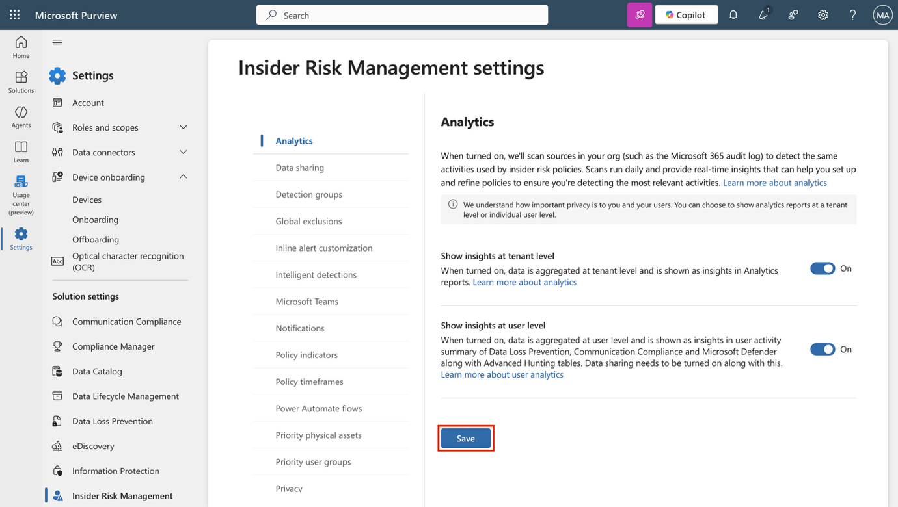
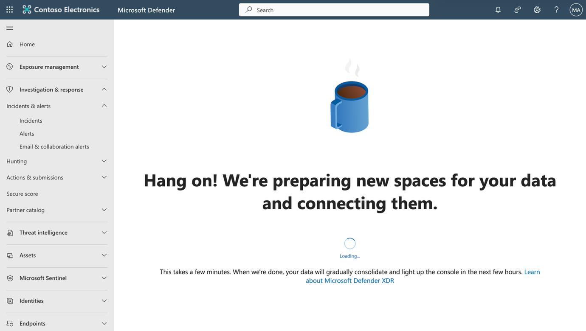
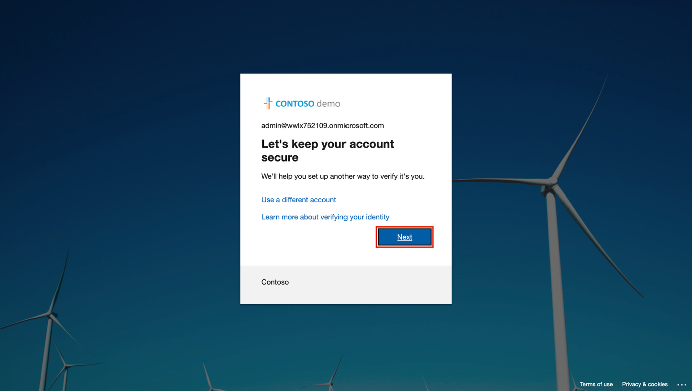

**ラボのセットアップ – 管理のためのエンビロンメントの準備**

このラボでは、管理タスクのためのエンビロンメントを構成および準備します。必要な機能を有効にし、権限を設定し、管理用のコアサービスを準備します。

**タスク:**

- Microsoft PurviewポータルでAuditを有効にする

- デバイスのオンボーディングを有効にする

- Insider Risk AnalyticsとData sharingを可能にする

- Microsoft Defender XDRを初期化する

- Microsoft Entraで多要素認証を構成する

- Adaptive Protectionの有効化

**演習 1 - Microsoft Purview ポータルでAuditを有効にする**

このタスクでは、Microsoft Purview ポータルで監査を有効にして、ポータルのアクティビティを監視します。

1.  ラボエンビロンメントの \[Resources\] タブに指定されている**Admin**アカウントの資格情報を使用して VM にログインします。

2.  **Microsoft Edge**で、 https://purview.microsoft.comに移動し、 **MOD Administrator**( admin@TenantName)としてサインインします(テナント名と管理者のパスワードは、ラボエンビロンメントの \[Resources\] タブで提供される必要があります)。

3.  新しいMicrosoft Purviewポータルに関するメッセージが画面に表示されます。「**Get started」**を選択して新しいポータルにアクセスしてください。

> 

4.  左側のサイドバーから**\[Solutions\]**を選択し、 **\[Audit\]**を選択します。

> 

5.  **「Search」ページ**で、 **「Start recording user and admin activity** **」**バーを選択して、Audit loggingを有効にします。

> 

6.  このオプションを選択すると、このページから青いバーが消えます。

> 

Microsoft 365 で監査(Auditing)が正常に有効化されました。

**演習2 – デバイスのオンボーディングを有効にする**

このタスクでは、組織のデバイスオンボーディングを有効にします。

1.  **Adminアカウント**として VM にログインし、Microsoft Purview で MOD ADMINISTRATORとしてログインする必要があります。

2.  左側のサイドバーから**\[Settings\]**を選択し、 **\[Device onboarding\]**を展開します。

3.  **\[Device onboarding\]ページ**で、 **\[Devices\]**を選択します。

> 

4.  **\[Devices\]ページ**で、 **\[Turn on device onboarding** **\]**を選択し、 **\[OK\]**を選択して確認します。

> 

5.  プロンプトが表示されたら、 **\[OK\]**を選択して、デバイスの監視がオンになっていることを確認します。

> 

デバイスのオンボーディングが有効になり、エンドポイントDLPポリシーで保護するデバイスのオンボーディングを開始できます。この機能の有効化には最大30分かかる場合があります。

**演習3 – Insider Risk AnalyticsとData sharingの有効化**

このタスクでは、Insider Risk Management の分析とData sharingを有効にします。

1.  Microsoft Purview で、 **\[Settings\]** \> **\[Insider Risk Management\]** \> **\[Analytics\]**に移動します。

> 

2.  以下の設定を**Onに切り替えます**:

    - **テナントレベルで分析情報を表示**

    - **ユーザーレベルで分析情報を表示する**

3.  ページの下部にある**\[Save\]**を選択します。

> 

4.  左側のナビゲーション ペインで**\[Data sharing\]**を選択します。

> 

5.  Data sharingセクションで、\[**Share user risk details with other security solutions\]**を**\[On\]**に切り替えます。

6.  ページの下部にある**\[Save\]**を選択します。

> 

Insider Risk Management の分析とData sharingが有効になりました。

**演習4 – Microsoft Defender XDRの初期化**

このタスクでは、Microsoft Defender に移動し、Microsoft Defender XDR が初期化されるまで待機します。

1.  **Microsoft Edge**で、 https://security.microsoft.com/に移動してMicrosoft Defender を開きます。

2.  Navigationペインから、 **\[Investigation & response\]** \> **\[Incidents & alerts\]** \> **\[Incidents\]**を選択します。

> 
>
> \[!Note\]**注: Microsoft Defender XDR の初期化**
>
> Microsoft Defender XDR 初期化画面は、ラボ テナントに応じて表示される場合があります。

3.  Microsoft Defender XDR の準備中であることを示すメッセージが表示されます。このプロセスは自動的に実行され、数分かかる場合があります。

> 

Microsoft Defender XDR を初期化しています。セットアップが完了するまで、他のタスクを続行できます。

**演習5 – Microsoft Entraで多要素認証を構成する**

このタスクでは、管理者アカウントの多要素認証 (MFA) を構成して、Microsoft Entra およびその他の接続されている Microsoft 365 サービスへのアクセスをセキュリティで保護します。

1.  **Microsoft Edge**でhttps://entra.microsoft.com/にアクセスし、Microsoft Entra を開いて管理者の資格情報でログインします。「Lets keep your account secure」というメッセージが表示されたら、 **「Next」**を選択します。

> 

2.  **「Start by getting the app」**画面で、デバイスのアプリストアから**Microsoft Authenticator**アプリをインストールするか、既にインストールされている場合は開きます**。 「Next」**を選択します。

> 

- 別のアプリを使用する場合は、 **「I want to use a different authenticator app** **」**を選択し、画面の指示に従います。

3.  **\[Set up your account\]**画面で、携帯電話の指示に従って通知を許可し、 **\[Next\]**を選択します。

> 

- Microsoft Authenticator アプリを既にインストールして設定している場合は、この画面が表示されないことがあります。その場合は、次の手順に進んでください。

4.  **\[Scan the QR code\]**画面で、デバイスの Microsoft Authenticator アプリを使用して画面に表示されている QR コードをスキャンし、 **\[Next\]**を選択します。

> 

5.  携帯電話で、ブラウザに表示されている番号を入力してサインイン要求を承認します。

6.  リクエストを承認すると、 **「Notification approved」**画面が表示されます。**「Next」**を選択してください。

7.  **\[Success!\]**画面で、**既定のサインイン方法**が**Microsoft Authenticator**になっていることを確認し、 **\[Done\]**を選択します。

8.  再度サインインを求められた場合は、携帯電話でサインイン要求を承認して本人確認を行ってください。

9.  承認が完了すると、 **Microsoft Entra admin center**にリダイレクトされます。

Microsoft Entra の管理者アカウントの多要素認証が正常に構成され、検証されました。

**演習6 – Adaptive Protectionの有効化**

1.  Microsoft Edge で、 https://purview.microsoft.comに移動し、 **MOD ADMINISTRATOR**としてパービューポータルにログインします。

2.  左側のナビゲーションペインから、 **「Solutions」** \> **「Insider Risk management」** \> **「User」** \> **「Adaptive Protection」**を選択します。次に、 **「Dashboard」**を選択します。 **「Quick setup」**を選択します。

> 

3.  設定中というメッセージが表示されます。有効化には72時間かかります。この設定は、Adaptive Protection機能について学ぶラボ8で使用します。

> 

4.  **「Adaptive Protection settings」**タブを選択し、 **「Adaptive Protection」**トグルボタンをオンにします。 **「Save」**を選択します。

> 

Microsoft Purview で Adaptive Protection が正常に有効化されました。
