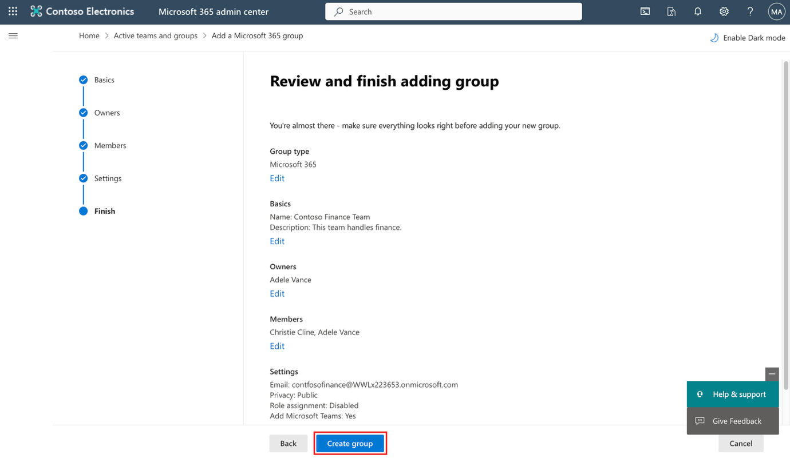
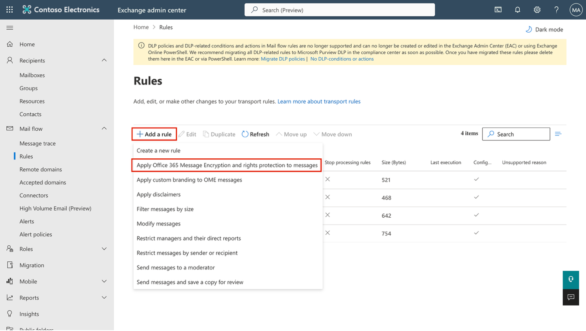
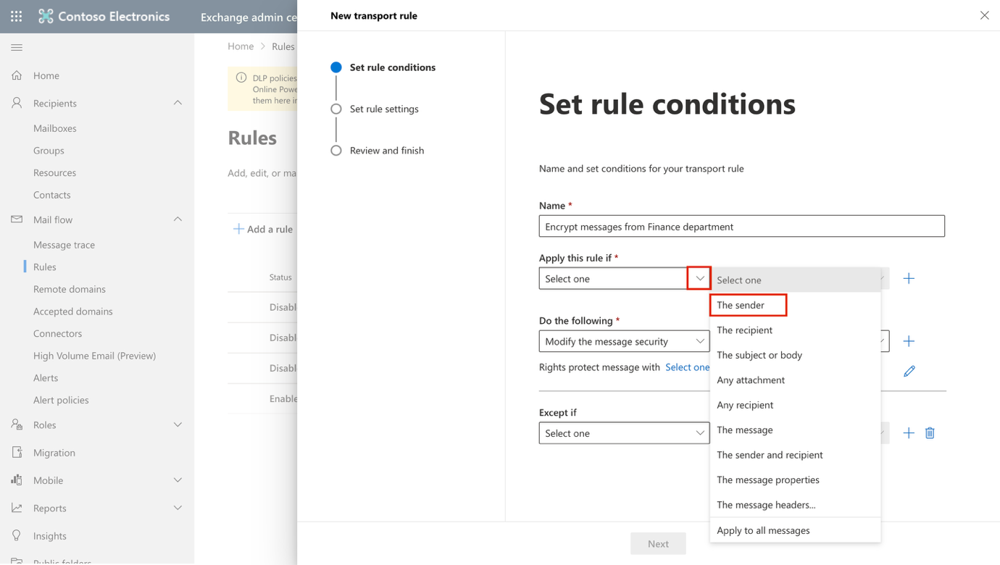
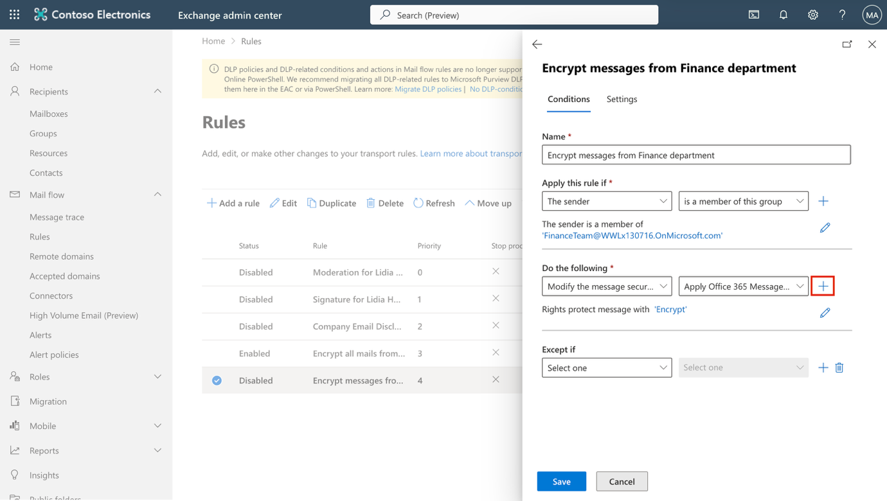
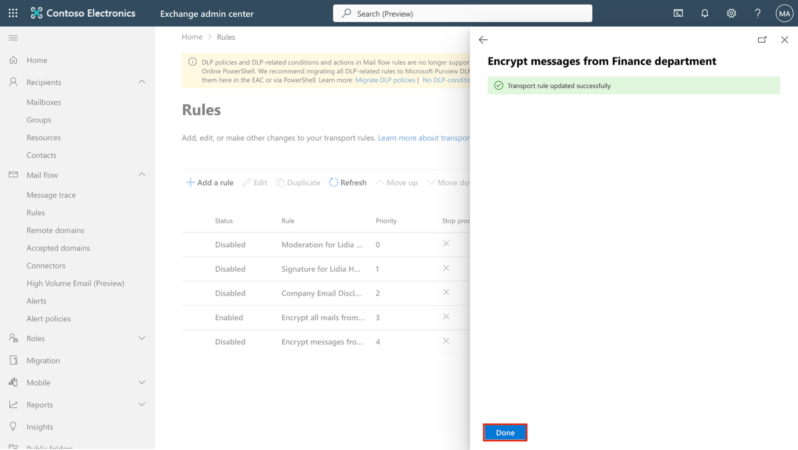
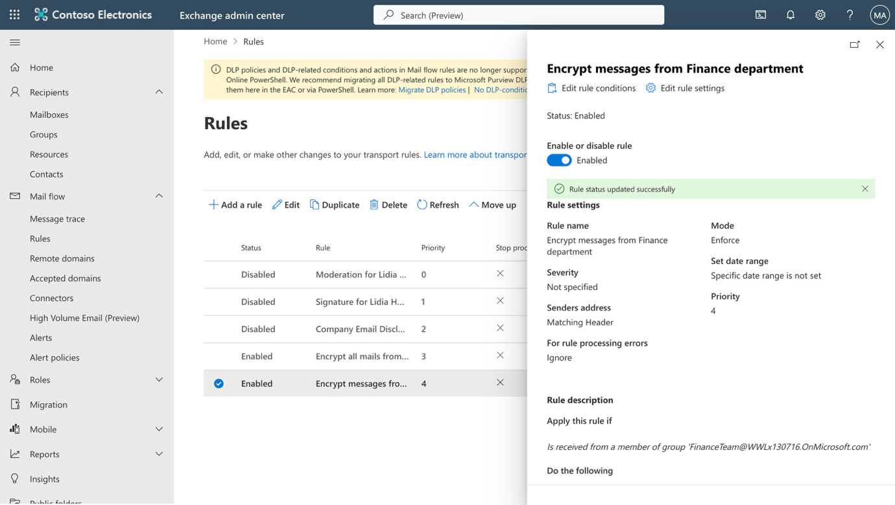

**실습 1 – 규정 준수 역할 할당 및 Office 365 메시지 암호화 관리**

**소개:**

Microsoft Purview 포털에서는 Purview 내에서 작업을 수행하는 사용자들의 권한을 직접 관리할 수 있습니다. 포털의 설정(Settings) 메뉴에 있는 역할 및 범위(Roles and scopes) 기능을 통해 데이터 보안, 데이터 거버넌스, 위험 및 규정 준수 솔루션 전반에 걸친 사용자 권한을 관리할 수 있습니다. 이를 통해 사용자에게 필요한 작업만 수행할 수 있도록 권한을 세분화하고, 명시적으로 허용한 작업에만 접근하도록 제한할 수 있습니다.

**목표:**

- Microsoft 365에서 사용자에게 관리자 및 규정 준수 역할을 할당

- 팀 협업을 위해 Microsoft 365 그룹 및 보안 그룹을 생성

- Microsoft Purview 규정 준수 평가 평가판을 활성화

- Office 365 메시지 암호화를 위해 Azure RMS 상태를 확인하고 구성

- 기본 OME 템플릿을 수정하여 소셜 ID 기반 접근을 비활성화

- 소셜 로그인을 사용하지 않고 암호화된 이메일 전송 테스트

- 재무 팀을 위한 사용자 지정 OME 브랜딩 템플릿을 생성하고 적용

- 재무 부서에서 발송되는 메시지를 자동으로 암호화하는 메일 흐름 규칙을 생성

- 암호화된 메시지에 면책 문구를 추가

- 메일 흐름 규칙을 활성화

- 메시지 암호화가 정상적으로 적용되는지 검증

**연습 1 - 규정 준수 역할 관리**

이 연습에서는 Microsoft Purview를 사용한 보안 구현을 위해 필요한 모든 평가판 라이선스를 활성화합니다.

**작업 1 – 기존 사용자에게 관리자(Manager) 역할 추가**

1.  실습에서 제공된 계정 정보를 사용해 가상 머신(VM)에 로그인하세요.

2.  **Microsoft Edge**를 열고Microsoft 365 관리 센터(https://admin.microsoft.com)로 이동한 후, 관리자 자격 증명을 사용하여 **MOD Administrator** 계정으로 로그인하세요.

> \[!Note\] **참고: Microsoft 365 관리 센터에서는 MFA 설정을 건너뛰세요.**
>
> 일부 테넌트에서는 로그인 시 포털 MFA 적용 안내가 표시될 수 있습니다. 이 경우 다음과 같이 진행하세요:

- **Skip for now** 를 선택해 MFA 설정을 일시적으로 연기하세요.

- **Let us know why you're skipping MFA** 대화 상자에서 아무 사유나 선택한 후 **Send and skip**을 클릭하세요.

> 이렇게 하면 Microsoft 365 관리 센터에서 MFA 적용이 일시적으로 연기되며, 실습을 계속 진행할 수 있습니다.

3.  왼쪽 메뉴에서 **Users** \> **Active users**를 선택한 후, 첫 번째 사용자인 **Adele Vance**를 클릭하세요.

> 

4.  **Manager** 섹션에서**Edit manager**을 클릭하세요.

> 

5.  현재 설정된 관리자를 제거한 후, 검색 상자에 Patti를 입력하세요. **Patti Fernandez**를 선택한 후, **Save Changes**을 클릭하세요.

> 

6.  다음 사용자들에 대해 관리자를 모두 **Patti Fernandez**로 변경하세요.

    - Adele Vance

    - Christie Cline

    - Megan Bowen

7.  **Patti Fernandez**사용자에 대해서는 관리자를 **MOD Administrator** 로 설정하세요.

**작업 2 – 관리자 역할 할당**

1.  사용자 **Patti Fernandez**를 선택한 후, **Account**섹션에서 아래로 스크롤해 **Roles** 을 선택하고 **Manage roles**를 클릭하세요.

> 

2.  **Roles** 창이 열리면 **Admin center 액세스** 옆의 라디오 버튼을 선택한 후, **Show all by category**를 확장하세요.

> 

3.  **Security & Compliance** 범주에서 **Compliance Administrator**, **Security Administrator**, **Application Administrator** 체크박스를 선택한 후,\
    플라이아웃 패널 하단의 **Save changes**을 클릭하세요.

> 

4.  역할 창을 닫고, 같은 페이지에 그대로 머무른 상태에서 다음 작업을 진행하세요.

**작업 3 – Microsoft 관리자 센터에서 Teams 및 그룹 생성**

1.  **Teams & groups**을 확장한 후 **Active teams & groups**을 선택하고,  **Teams & Microsoft 365 groups**아래에서 **Add a Microsoft 365 group**를 클릭하세요.

> 

2.  **Name** 필드에, Contoso Finance Team을 입력하고, **Description** 필드에 This team handles finance.를 입력한 다음**Next**를 클릭하세요.

> 

3.  **Assign Owners** 페이지에서 **Assign owners**을 클릭하고, **Adele Vance**옆의 체크박스를 선택한 후 **Add(1)** 를 클릭하세요. 그런 다음, **Next**를 클릭하세요.

> 

4.  **Add members** 페이지에서 **Adele Vance**와 **Christie Cline**을 멤버로 추가한 후 **Next**를 클릭하세요. 다음 **Add members** 페이지에서도 **Next**를 선택하세요.

5.  그룹 이메일 주소로 contosofinance를 입력한 후 **Next**를 클릭하세요.

> 

6.  **Create group**을 클릭하세요.

> 

7.  생성이 완료되면 **Close**를 클릭하세요.

> 

8.  **Active teams & groups 페이지**에서 **Security groups** 탭을 선택한 후 **Add a security group**를 클릭하세요.

> 

9.  다음 정보를 사용하여 동일한 절차로 또 다른 그룹을 생성하세요.

    - **Set up the basics**화면의 **Name** 필드에 EDM_DataUploaders를 입력하세요.

    - **Description** 필드에 People who will upload data for EDM. 을 입력하세요.

    - **Next**를 선택하세요.

    - **Settings** 페이지에서 **Next**를 선택하세요.

    - **Review and finish adding group** 페이지에서 설정을 검토한 후 **Create group**를 선택하세요.

    - **New group created** 페이지가 표시되면 닫기 버튼을 선택하세요.

    - 목록에서 새로 생성된 **EDM_DataUploaders** 그룹을 선택하세요.

    - **Members** 탭에서 **View all and manage owners**를 선택한 후 **Patti Fernandez**와 **Christie Cline**을 소유자로 추가하세요.

    - 동일하게 **Patti Fernandez**와**Christie Cline**을 멤버로도 추가하세요.

> 

**연습 2 – Office 365 메시지 암호화 관리**

**작업 1 – 재무 부서 발신 메일에 암호화를 적용하는 메일 흐름 규칙 생성**

이 작업에서는 Exchange 관리 센터를 사용해 Finance Team 그룹의 구성원이 발송하는 모든 메시지에 Microsoft Purview 메시지 암호화를 적용하는 메일 흐름 규칙을 생성합니다.

1.  **Microsoft Edge**에서 https://admin.exchange.microsoft.com로 이동한 후, PattiF@TenantName 계정으로 로그인하세요.

2.  왼쪽 탐색 창에서 **Mail flow**을 확장한 다음 **Rules**을 선택하세요.

> 

3.  **Rules** 페이지에서 **+ Add a rule** \> **Apply Office 365 Message Encryption and rights protection to messages**을 선택하세요.

> 

4.  **Set rule conditions** 페이지에서 다음과 같이 구성하세요:

    - **Name:** Encrypt messages from Finance department

    - **Apply this rule if** 섹션에서 다음을 설정하세요:

      - 드롭다운 1: **The sender**

> 

- 드롭다운 2: **is a member of this group**을 선택한 후, **Select members** 패널에서 **Finance Team**을 선택하고 **Save**을 클릭하세요.

> 
>
> 
>
> 

- **Do the following** 섹션에서:

  - 기본값인 **Modify the message security** 및**Apply Office 365 Message Encryption and rights protection**을 그대로 두세요.

> 

- **Do the following** 아래의 **Select one** 링크를 클릭하세요.

> 

- **Select RMS template** 패널에서 **Encrypt**를 선택한 후 **Save**을 클릭하세요.

> 

- 다시 **Set rule conditions** 페이지에서 **Next**를 선택하세요.

> 

5.  **Set rule settings** 페이지에서는 기본 설정을 그대로 두고 **Next**를 클릭하세요.

> 

6.  **Review and finish** 페이지에서 메일 흐름 규칙을 검토한 후 **Finish**을 선택하세요.

> 

7.  메일 흐름 규칙이 생성되면**Done**를 선택하세요.

> 

이제 Microsoft Purview 메시지 암호화를 사용해 재무 부서에서 발송되는 메시지가 자동으로 암호화되도록 설정되었습니다. 이를 통해 조직 외부로 전송되기 전, 민감한 재무 관련 커뮤니케이션을 안전하게 보호할 수 있습니다.

**작업 2 – 암호화된 메시지에 면책 문구 추가**

다음 단계에서는 기존 메시지 암호화 규칙을 수정하여 면책 문구를 추가합니다.\
이 문구는 메시지 브랜딩의 일환으로, 해당 이메일이 Contoso Ltd.에서 암호화되어 안전하게 전송되었음을 수신자에게 명확히 안내합니다.

1.  **Rules** 페이지에서 새로 생성한 **Encrypt messages from Finance department** 규칙을 선택하세요.

> 

2.  **Encrypt messages from Finance department** 플라이아웃 패널에서 **Edit rule conditions**을 선택하세요.

> 

3.  **Do the following** 섹션 오른쪽에 있는 **+** 버튼을 선택해 새 작업을 추가하세요.

> 

4.  새로 생성된 **And** 섹션에서 다음과 같이 설정하세요:

    - 드롭다운 1: **Apply a disclaimer to the message**

> 

- 드롭다운 2: **append a disclaimer**.

> 

- 드롭다운 아래에서 **Enter text**을 선택하세요.

> 

- **specify disclaimer text** 패널에서 다음 문구를 입력하세요: This email has been encrypted and sent securely by Contoso Ltd. 

- 패널 하단에서 **Save** 을 선택하세요.

> 

- 대체 작업을 추가하기 위해 'Select one' 링크를 선택하세요.

- **specify fallback action** 패널에서 **Wrap**을 선택한 후, 패널 하단의 **Save**을 클릭하세요.

> 

5.  **Encrypt messages from Finance department** 패널 하단에서 **Save**을 선택하세요.

> 

6.  규칙이 성공적으로 수정되면 **Transport rule updated successfully** 메시지가 표시됩니다.

> 

7.  **Done**를 선택해 플라이아웃 패널을 닫으세요.

> 

이제 각 보호된 메시지에 면책 문구가 자동으로 추가되어, 수신자는 해당 이메일이 Contoso Ltd.에서 암호화되어 안전하게 전송되었음을 명확히 확인할 수 있습니다.

**작업 3 – 메일 흐름 규칙 활성화**

기본적으로 새로 생성된 메일 흐름 규칙은 비활성화된 상태로 설정됩니다. 이 작업에서는 재무 부서에서 발송되는 메시지를 보호할 수 있도록 암호화 규칙을 활성화합니다.

1.  **Rules** 페이지에서 새로 생성한 **Encrypt messages from Finance department** 규칙의 상태가**Disabled**인지 확인하고 선택하세요.

> 

2.  **Encrypt messages from Finance department** 플라이아웃 패널에서 **Enable or disable rule** 아래의 토글을 **Enabled**으로 설정하세요.

> 

3.  메일 흐름 규칙이 자동으로 활성화됩니다. 이때 **Updating the rule status, please wait...** 메시지가 표시되며, 활성화가 완료되면 **Rule status updated successfully** 메시지가 나타납니다.

> 

4.  플라이아웃 패널 오른쪽 상단의 **X** 버튼을 선택해 창을 닫으세요.

> 

**참고**: 규칙 변경 사항이 전체 환경에 적용되기까지 몇 분 정도 소요될 수 있습니다. 검증 단계에서 테스트가 실패할 경우, 잠시 기다린 후 다시 테스트 메일을 전송하십시오.

이제 암호화 규칙이 활성화되어, 재무 부서에서 발송되는 모든 메시지에 Microsoft Purview 메시지 암호화가 자동으로 적용됩니다. 또한 이후 발송되는 모든 재무 부서 메일에는 Contoso Ltd. 면책 문구가 함께 포함됩니다.

**작업 4 – 메시지 암호화 검증**

이 작업에서는 재무 부서 구성원이 테스트 메일을 발송해 Microsoft Purview 메시지 암호화가 자동으로 적용되는지 확인하고, 수신자가 보안 메시지 안내를 정상적으로 확인할 수 있는지를 검증합니다.

1.  작업 표시줄에서 **Microsoft Edge**를 마우스 오른쪽 버튼으로 클릭한 후 **New InPrivate window**를 선택하세요.

2.  https://outlook.office.com으로 이동한 후, AdeleV@TenantName 계정으로 Outlook 웹에 로그인하세요.

3.  **Stay signed in?** 대화 상자가 표시되면 **Don't show this again**을 선택한 후, **No**를 클릭하세요.

4.  Outlook 웹에서 **New mail**을 선택하세요.

> 

5.  **To** 에 테넌트 도메인에 속하지 않은 개인 이메일 주소 또는 타사 이메일 주소를 입력하세요. 제목에는 Secret Message, 본문에는 My super-secret message를 입력하세요.

6.  **Send**를 선택해 메시지를 전송하세요. Outlook 창은 닫지 말고 그대로 두세요.

> 
>
> Sign into your personal email account in a new window and open the message from Adele Vance. If you sent the message to a Microsoft account (such as @outlook.com), it might open automatically. If you sent the email to another email service like (@gmail.com), you might have to perform the next steps to process the encryption and read the message.
>
> 새 창에서 개인 이메일 계정으로 로그인한 후, Adele Vance가 보낸 메시지를 여세요.\
> 메시지를 Microsoft 계정(예: @outlook.com)으로 전송한 경우 자동으로 열릴 수 있습니다. Gmail(@gmail.com)과 같은 다른 이메일 서비스로 전송한 경우에는, 암호화 처리 및 메시지 열람을 위해 다음 단계를 진행해야 할 수 있습니다.

7.  **Read the message**를 선택하세요.

> 

8.  **Sign in with a One-time passcode** 을 선택해 일정 시간 동안 유효한 일회용 암호를 받으세요.

9.  개인 이메일 포털로 이동해 제목이 **Your one-time passcode to view the message**인 메시지를 열어 암호를 확인하세요.

10. 확인한 일회용 암호를 포털에 붙여넣은 후 **Continue**을 선택하세요.

11. 암호화된 메시지를 확인하세요. 이메일 하단에 **This email has been encrypted and sent securely by Contoso Ltd.** 문구가 표시되는지 확인하세요.

이를 통해 재무 부서에서 발송되는 메시지가 자동으로 암호화되고 Contoso 면책 문구가 포함됨을 확인했으며, Microsoft Purview 메시지 암호화가 의도한 대로 정상 작동함을 검증했습니다.

**요약:**

이 실습에서는 관리자 센터에서 조직 환경을 구성하고 적절한 라이선스를 할당한 후, Microsoft 365에 기본으로 제공되는 Office 365 메시지 암호화(OME)의 사용 방법을 학습했습니다.
