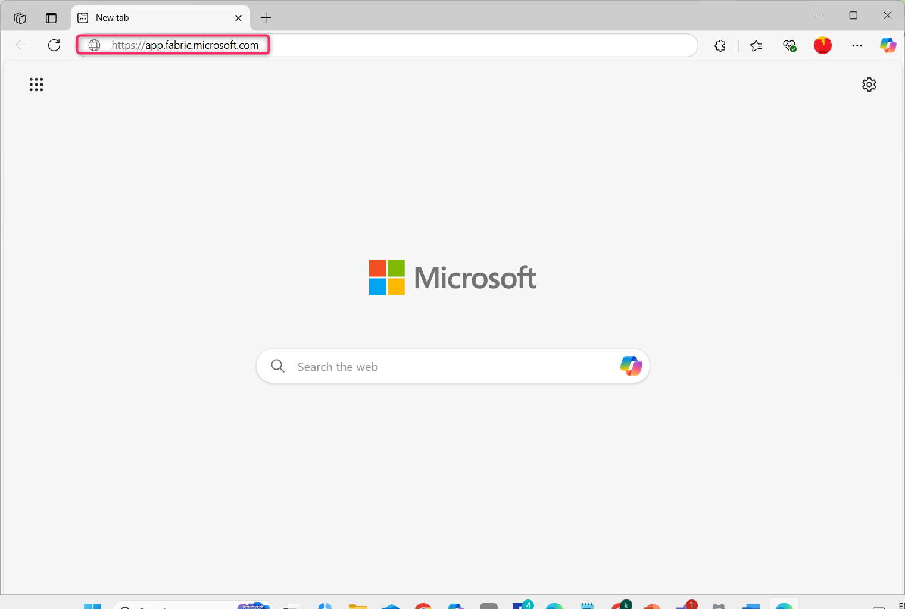
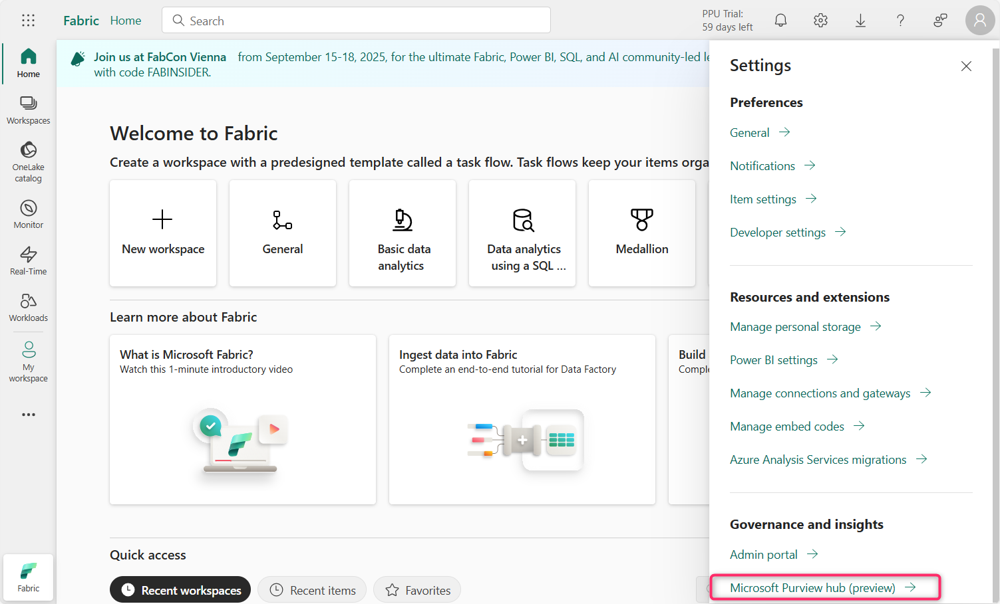
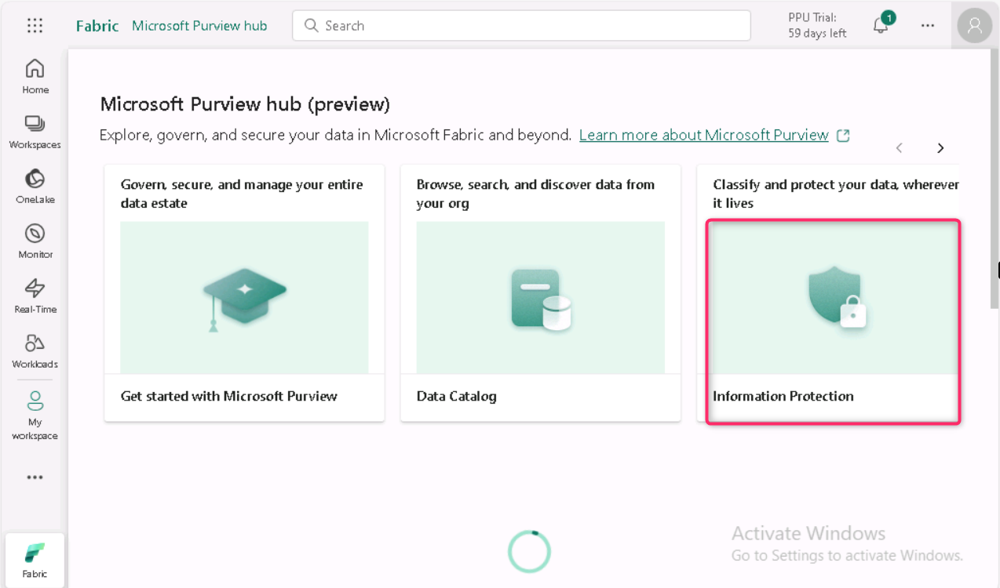
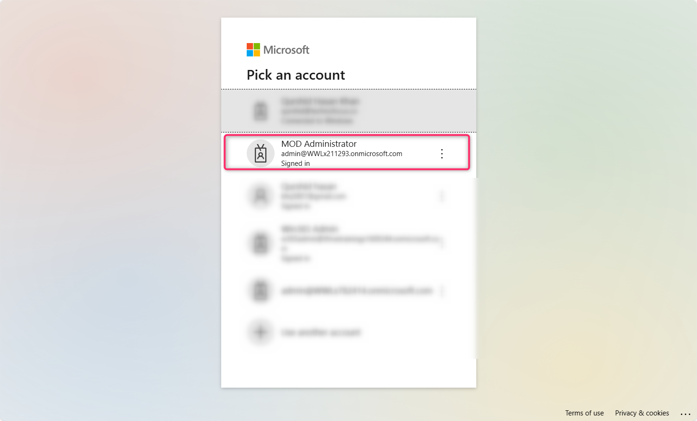
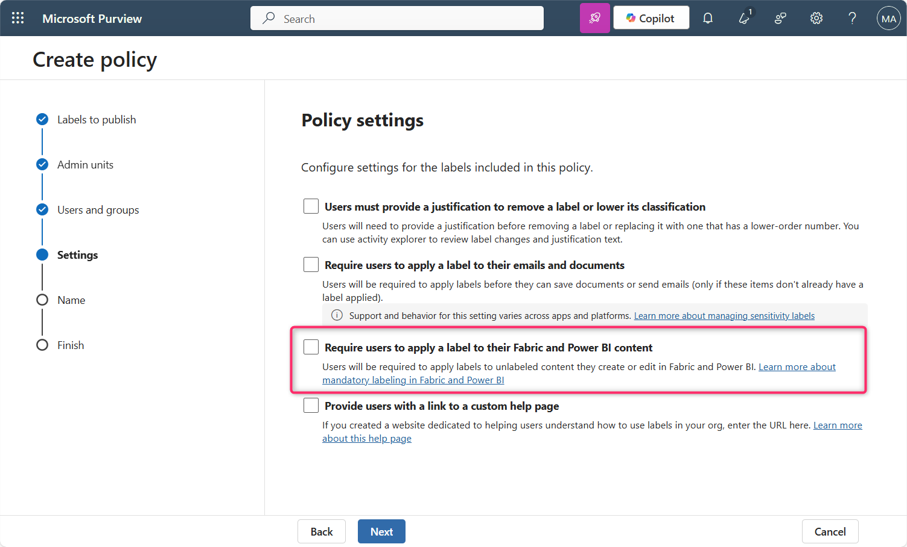
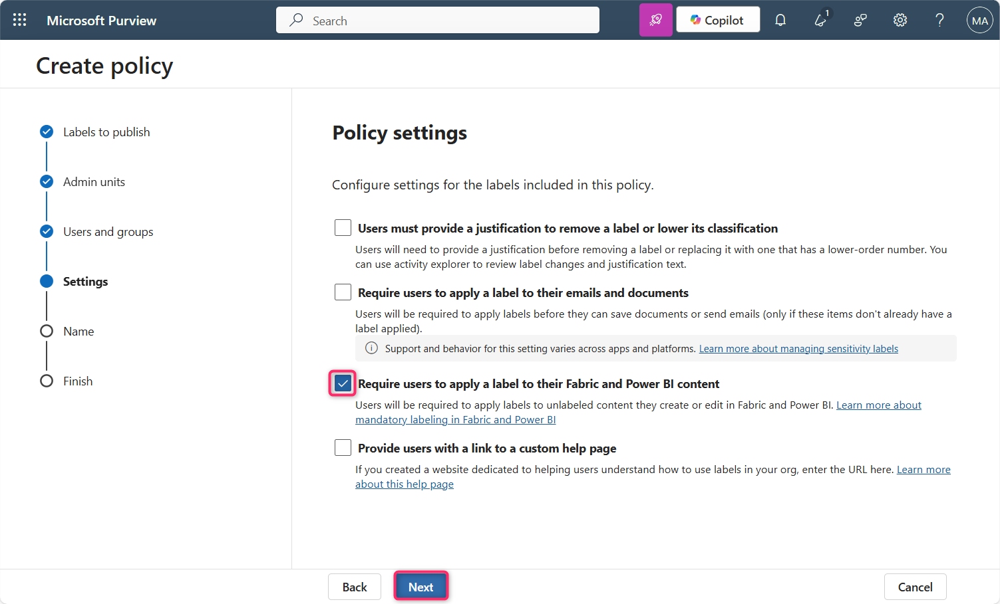
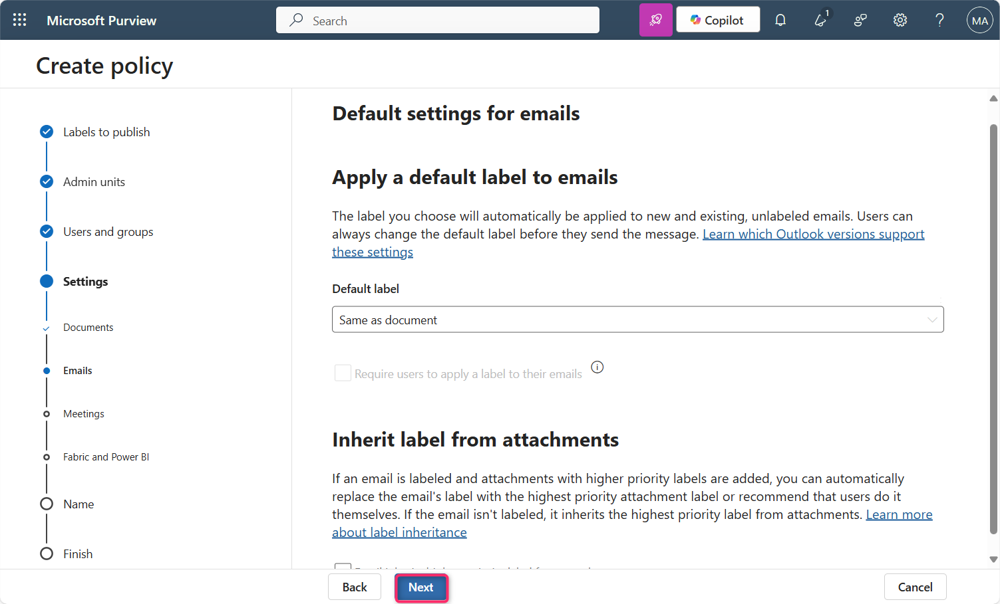
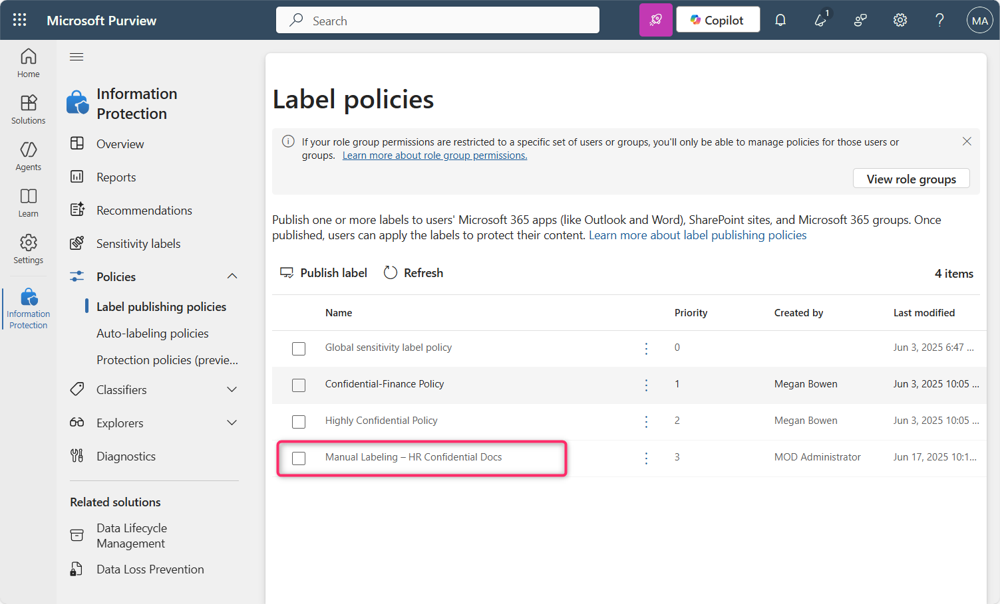

**실습 10 – Microsoft Purview를 사용해 Fabric 및 Power BI에서 민감도 라벨링 시행**

**소개**

Microsoft Purview Information Protection의 민감도 라벨은 Fabric과 Power BI (Power BI Desktop 포함)에서 사용하려면 테넌트에서 활성화해야 합니다. 민감도 라벨이 활성화하면:

- 조직 내 지정된 사용자와 보안 그룹은 Fabric 콘텐츠에 민감도 라벨을 적용할 수 있습니다. Fabric 서비스에서는 이는 모든 Fabric 항목을 의미하며, Power BI Desktop에서는 .pbix 파일을 의미합니다.

- 서비스에서는 조직 내 모든 구성원이 이러한 라벨을 확인할 수 있습니다. 반면, Power BI Desktop에서는 해당 라벨이 자신에게 게시된 사용자만 라벨을 확인할 수 있습니다.

**목표**

- Microsoft Purview를 사용해 Microsoft Fabric에서 수동 민감도 라벨 정책을 활성화하고 우선순위를 설정

**연습 1 – Microsoft Fabric 체험판 활성화 및 Purview 허브 접근**

1.  Edge 브라우저의 주소 표시줄에 다음 URL을 입력해 Fabric 포털을 여세요 - https://app.fabric.microsoft.com

**참고**: 만약 Fabric 포털로 직접 이동하는 경우, 2번과 3번 단계를 건너뛰세요.

2.  테넌트 자격 증명을 입력하세요.

3.  비밀번호 필드에 테넌트 비밀번호를 입력한 후, **Sign in** 버튼을 클릭하세요.

4.  **Welcome to the Fabric view** 대화 상자에서 **Cancel** 버튼을 클릭하세요.

5.  명령 표시줄에서 프로필 아이콘을 클릭하세요.

6.  탐색 후 **Free trial** 버튼을 클릭하세요.

7.  **Activate your 60-day free Fabric trial capacity**에서 **Trial capacity region** 섹션에서 **Default – West US 3** 지역이 선택되어 있는지 확인한 후, **Activate** 버튼을 클릭하세요.

8.  **Successfully upgraded to a free Microsoft Fabric trial** 대화 상자에서 **Got it** 버튼을 클릭하세요.

9.  명령 표시줄에서 **Settings** 기어 아이콘을 클릭하세요.

10. **Governance and insights** 섹션으로 이동한 후, **Microsoft Purview hub (preview)** 링크를 클릭하세요. 그 후, **Microsoft Purview hub (preview)** 페이지에서 **Information Protection** 타일을 클릭하세요.

11. 만약 **Pick an account** 대화 상자가 나타나면, 테넌트 ID를 선택하세요.

12. **Welcome to Information Protection in the new Microsoft Purview portal** 대화 상자에서 **Get started** 버튼을 클릭하세요.

**연습 2 – Fabric 및 Power BI용 민감도 라벨 정책 생성 및 구성**

1.  Information Protection 블레이드에서 **Policies** 옆의 드롭다운을 클릭하세요.

2.  그 다음, **Label publishing policies**를 클릭하세요. **Label publishing policies** 페이지에서 **Publish label**을 클릭하세요.

3.  **Create policy** 페이지에서 **Choose sensitivity label to publish** 링크를 클릭하세요.

4.  **Sensitivity label to publish** 창이 오른쪽에 나타나면, **Confidential** 옆의 체크박스를 선택한 후, **Add** 버튼을 클릭하세요.

5.  이제 **Next** 버튼을 클릭하세요.

6.  **Assign admin units** 페이지에서 **Next** 버튼을 클릭하세요.

7.  **Publish to users and groups** 페이지에서 **Users and groups** 옆의 체크박스가 선택되어 있는지 확인한 후, **Next** 버튼을 클릭하세요.

8.  **Policy settings** 페이지에서 **Require users to apply a label to their Fabric and Power BI content** 옆의 체크박스를 선택한 후, **Next** 버튼을 클릭하세요.

9.  **Default settings for documents – Apply a default label to documents** 페이지에서 **Next** 버튼을 클릭하세요.

10. **Default settings for documents – Apply a default label to emails** 페이지에서 **Next** 버튼을 클릭하세요.

11. **Default settings for meetings and calendar events** 페이지에서 **Next** 버튼을 클릭하세요.

12. **Default settings for Fabric and Power BI content** 페이지에서 **Next** 버튼을 클릭하세요.

13. **Name your policy** 페이지에서 **Name** 필드에 Manual Labeling – HR Confidential Docs를 입력한 후, **Next** 버튼을 클릭하세요.

<!-- -->

14. **Review and finish** 페이지에서 **Submit** 버튼을 클릭하세요.

15. 정책이 성공적으로 생성되었습니다. 이제 **Done** 버튼을 클릭하세요.

16. **Label policies** 페이지에서 **Manual Labeling – HR Confidential Docs** 정책이 성공적으로 생성된 것을 확인할 수 있습니다.

17. **Manual Labeling – HR Confidential Docs**를 선택한 후, 가로 점 3개를 클릭하고, **Move up**을 선택해 우선순위를 변경하세요.

18. 다시 **Manual Labeling – HR Confidential Docs**를 선택한 후, 옆에 있는 가로 점 3개를 클릭하고 **Move up**을 선택하세요.

19. **Manual Labeling – HR Confidential Docs**의 우선순위가 이제 1로 변경된 것을 확인할 수 있습니다.

**요약**

이 실습에서는 Microsoft Fabric 체험판을 활성화하고, Microsoft Purview 포털에 접근한 후, 사용자가 "Confidential" 라벨을 Fabric과 Power BI 콘텐츠에 적용하도록 요구하는 필수 민감도 라벨 정책을 생성했습니다. 이후 해당 정책은 시행을 위해 우선순위가 설정되었습니다.
