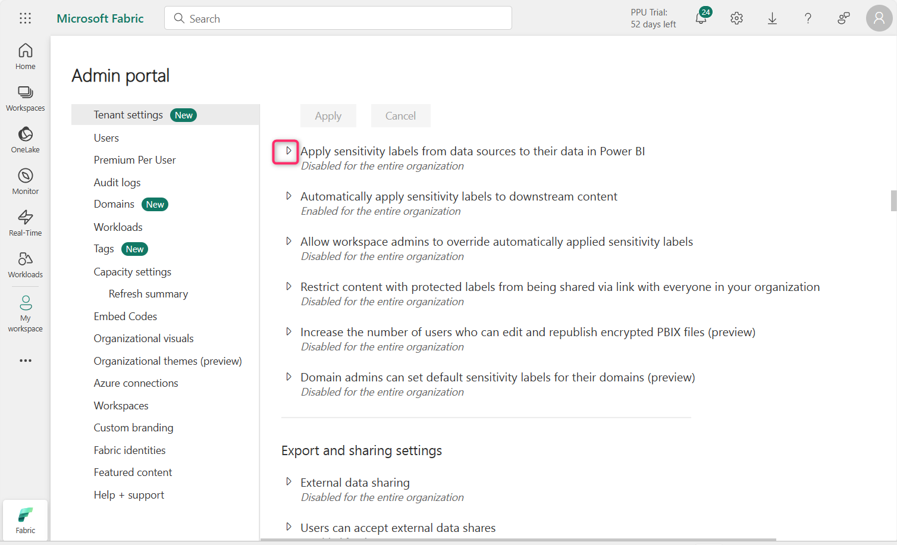
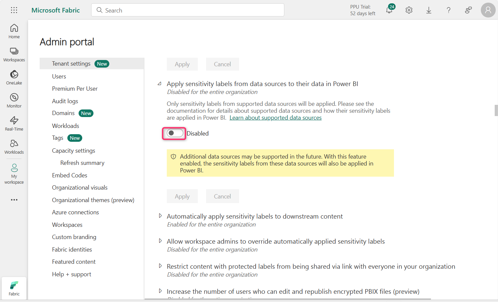
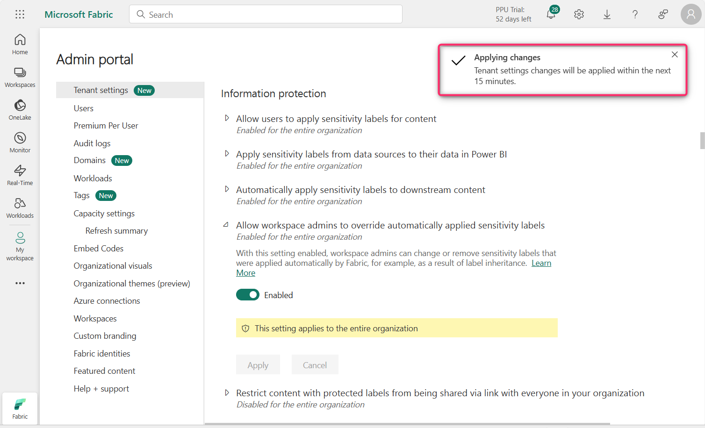
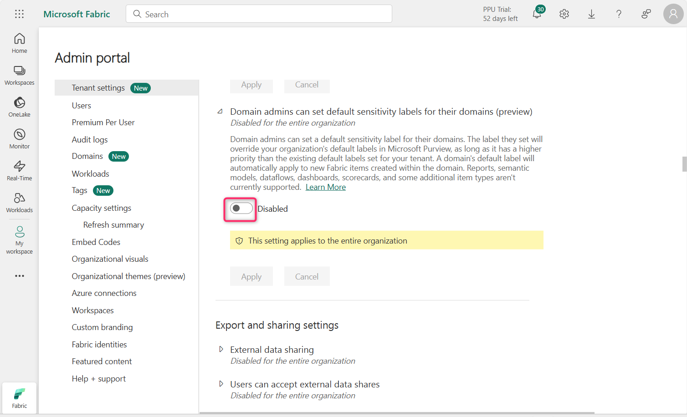

**실습 11 – Fabric에서 정보 보호 정책 구성**

**소개**

**정보 보호 테넌트 설정**은 Power BI 테넌트에서 민감한 정보를 보호하는 데 도움을 줍니다. 민감도 라벨을 콘텐츠에 허용하고 적용하면, 정보가 적절한 사용자만 보고 액세스할 수 있도록 보장할 수 있습니다. 이를 통해 조직 내에서 민감한 데이터를 보호하고, 정보의 유출을 방지할 수 있습니다.

**목표**

- Admin Portal을 통해 Microsoft Fabric에서 정보 보호 기능을 활성화하여 민감도 라벨 시행을 준비

**연습 1 – Fabric Admin Portal에서 정보 보호 설정 구성**

1.  Fabric 포털 홈 페이지에서 명령 표시줄에 있는 **Settings** 아이콘을 클릭한 후, **Governance and insights** 섹션으로 이동해 **Admin portal** 링크를 클릭하세요.

> 

2.  Admin portal – Tenant settings에서 **Information protection** 섹션까지 스크롤하세요.

> 

3.  **Allow users to apply sensitivity labels for content** 옆에 있는 재생 버튼을 클릭하세요.

> 

4.  토글 버튼을 클릭해 해당 설정을 활성화합니다. 이 설정이 활성화되면, 지정된 사용자가 Microsoft Purview Information Protection에서 민감도 라벨을 적용할 수 있습니다.

> 

5.  이제 **Apply** 버튼을 클릭하세요.

> 
>
> **참고**: 만약 **Apply** 버튼이 활성화되지 않으면, **Specific security groups** 라디오 버튼을 선택한 후, 다시 **The entire organization** 라디오 버튼을 선택하세요.

6.  **알림**이 표시되며, **Tenant settings will be applied within the next 15 minutes**라는 메시지가 나타납니다.

> 

7.  **Apply sensitivity labels from data sources to their data in Power BI** 옆에 있는 재생 아이콘을 클릭하세요.

> 

8.  토글 버튼을 클릭해 해당 설정을 활성화하세요.

> 

9.  이 설정이 활성화되면, Power BI에서 민감도 라벨이 적용된 데이터 소스에 연결되는 Power BI 세멘틱 모델이 해당 라벨을 상속받을 수 있습니다. 이를 통해 데이터가 Power BI로 가져와질 때도 계속해서 분류되고 안전하게 보호됩니다.

> **Apply** 버튼을 클릭하세요.
>
> 

10. 알림이 표시되며, “**Tenant settings will be applied within the next 15 minutes.**”라는 메시지가 나타납니다.

> 

11. **Automatically apply sensitivity labels to downstream content** 옆에 있는 재생 아이콘을 클릭하세요.

> 

12. 토글 버튼을 클릭해 해당 설정을 활성화하세요.

> 

13. 이 설정이 활성화되면, Fabric 콘텐츠에 민감도 라벨을 변경하거나 적용할 때, 해당 라벨이 적합한 하위 콘텐츠에도 자동으로 적용됩니다.

> **Apply** 버튼을 클릭하세요.
>
> 

14. 알림이 표시되며, "Tenant settings will be applied within the next 15 minutes."라는 메시지가 나타납니다.

> 

15. **Allow workspace admins to override automatically applied sensitivity labels** 옆에 있는 재생 아이콘을 클릭하세요.

> 

16. 토글 버튼을 클릭해 해당 설정을 활성화하세요.

> 

17. 이 설정은 워크스페이스 관리자가 민감도 라벨 변경 시행 규칙에 관계없이 자동으로 적용된 민감도 라벨을 재정의할 수 있도록 합니다.

> **Apply** 버튼을 클릭하세요.
>
> 

18. 알림이 표시되며, "Tenant settings will be applied within the next 15 minutes."라는 메시지가 나타납니다.

> 

19. **Restrict content with protected labels from being shared via link with everyone in your organization** 옆에 있는 재생 아이콘을 클릭하세요.

> 

20. 토글 버튼을 클릭해 해당 설정을 활성화하세요.

> 

21. 이 설정이 활성화되면, 사용자는 민감도 라벨의 보호 설정이 적용된 콘텐츠에 대해 조직 내 사람들을 위한 공유 링크를 생성할 수 없습니다.

> **Apply** 버튼을 클릭하세요.
>
> 

22. 알림이 표시되며, "Tenant settings will be applied within the next 15 minutes."라는 메시지가 나타납니다.

> 

23. **Domain admins can set default sensitivity labels for their domains (preview)** 옆에 있는 재생 아이콘을 클릭하세요.

> 

24. 토글 버튼을 클릭해 해당 설정을 활성화하세요.

> 

25. **Apply** 버튼을 클릭하세요.

> 

26. 알림이 표시되며, "Tenant settings will be applied within the next 15 minutes."라는 메시지가 나타납니다.

> 

**요약**

이 실습에서는 Microsoft Fabric Admin Portal에서 다양한 정보 보호 설정을 활성화해 민감도 라벨 적용, 상속, 자동 라벨링, 관리자 재정의 등을 지원했습니다.
