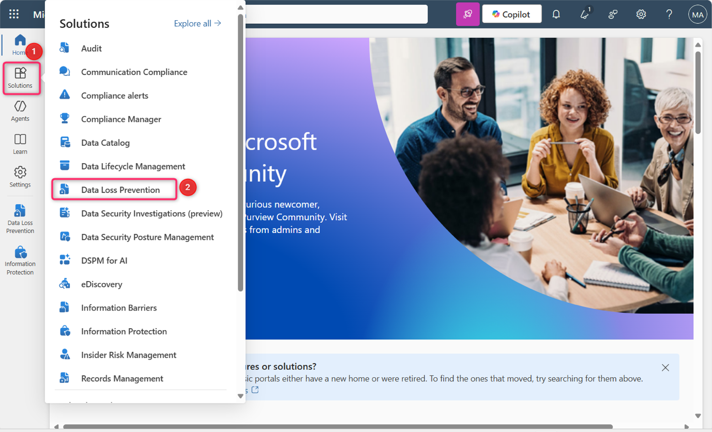
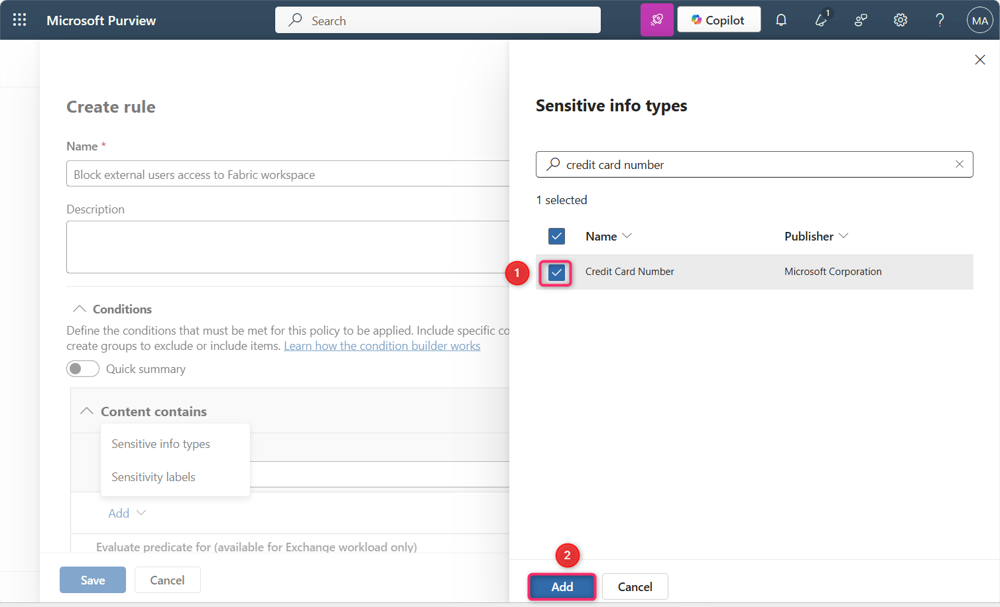
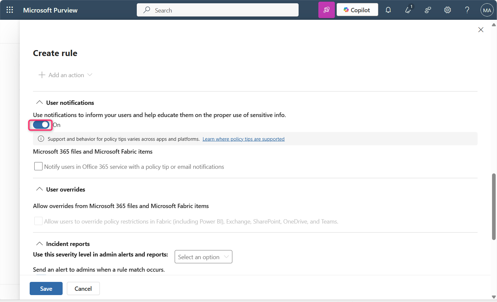
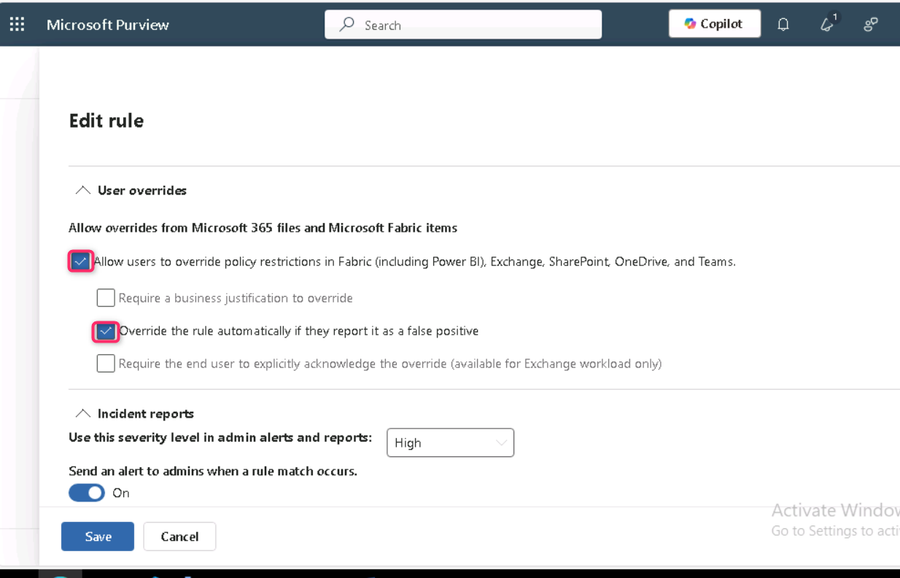
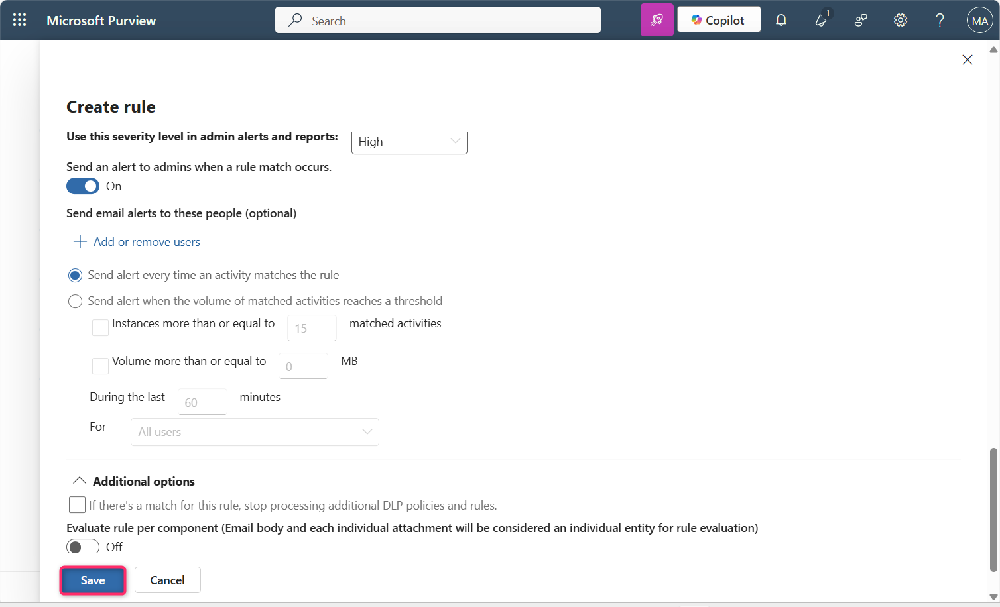
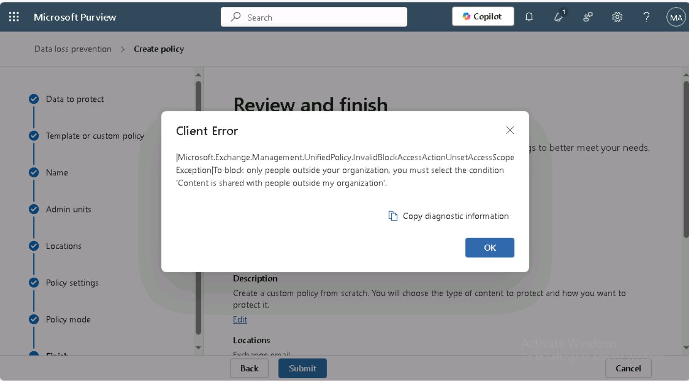

**실습 12 – 외부 사용자의 Fabric 워크스페이스 접근을 차단하는 DLP 정책 생성**

**소개**

우리는 신용 카드 번호가 포함된 보고서에서 외부 사용자의 접근을 차단해야 합니다. 단, 데이터가 'Highly Confidential - Internal' 민감도 라벨로 지정된 경우, 보호 정책을 통해 특정 보안 그룹에 대한 접근만 제한하도록 설정합니다. 또한, 컴플라이언스 관리자에게 언제 세멘틱 모델이 차단되었는지 알림을 보내고, 데이터 소유자에게도 제한이 적용되었음을 알려야 합니다. 마지막으로, 내부 사용자들이 해당 데이터가 매우 민감하다는 것을 인식하고 조직 외부로 공유하지 않도록 경고합니다.

<table>
<colgroup>
<col style="width: 43%" />
<col style="width: 56%" />
</colgroup>
<thead>
<tr>
<th style="text-align: center;"><strong>요구사항 설명</strong></th>
<th style="text-align: center;"><strong>구성 질문에 대한 답변 및 구성 매핑</strong></th>
</tr>
</thead>
<tbody>
<tr>
<td>"We need to block external users..."</td>
<td>
모니터링 위치: <strong>Fabric and Power BI</strong> 

관리 범위: <strong>Full directory</strong>.

작업: <strong>Restrict. access or encrypt the content in Microsoft 365 locations &gt; Block users from receiving email or accessing shared SharePoint, OneDrive, and Teams files, and Power BI items &gt; Block only people outside your organization</strong>
</td>
</tr>
<tr>
<td>"...from reports containing credit card numbers..."</td>
<td>
모니터링 대상: <strong>Custom template</strong>사용

일치 조건: Custom template을 편집해 Credit Card Number sensitive info type 추가
</td>
</tr>
<tr>
<td>"...except if the data is labeled with the Highly Confidential - Internal sensitivity label..."</td>
<td>
조건 그룹 구성: 첫 번째 조건에 AND로 연결된 nested boolean NOT condition group 생성

일치 조건: Highly Confidential - Internal sensitivity label 추가
</td>
</tr>
<tr>
<td>"We want to notify the compliance admin to know whenever a semantic model is blocked..."</td>
<td>
사고 보고: <strong>Send an alert to admins when a rule match occurs: On</strong>.

활동이 규칙과 일치할 때마다 알림 전송: <strong>selected</strong>
</td>
</tr>
<tr>
<td>"...the data owner to be aware the restriction took place. We also want internal users to be aware that the data is highly confidential and that they shouldn't share it outside the organization."</td>
<td>
사용자 알림: <strong>On</strong>.

Microsoft 365 파일 및 Microsoft Fabric 항목: Office 365 서비스에서 정책 팁 또는 이메일 알림으로 사용자에게 알림: <strong>selected</strong>.

정책 팁: 정책 팁 텍스트 사용자 지정: selected. 매우 기밀 데이터 공유 규칙을 설명하는 텍스트 추가
</td>
</tr>
</tbody>
</table>

**중요**

이 단계에서는 포함/제외 설정을 기본값으로 두고, 정책은 꺼진 상태로 유지합니다.\
정책을 실제로 배포할 때 이 설정들을 변경할 예정입니다.

**목표**

- Microsoft Purview에서 사용자 지정 Data Loss Prevention(DLP) 정책을 생성해 민감한 정보가 포함된 Fabric 및 Power BI 콘텐츠에 대해 외부 사용자의 액세스 차단

**실습 1: Fabric 작업 영역에 대한 외부 액세스를 차단하는 사용자 지정 DLP 정책 생성**

1.  Microsoft Purview 포털에서 **Solutions**를 클릭한 다음, **Data Loss Prevention**으로 이동해 클릭하세요.

> 

2.  이제 **Policies**를 클릭하세요.

> 

3.  **Policies 페이지**에서 **+ Create policy**를 클릭하세요.

> 

4.  **“What info do you want to protect?”** 창에서 **Enterprise applications and devices**를 선택하세요.

> 

5.  **“Choose what type of data to protect”** 페이지에서 **Data stored in connected sources** 라디오 버튼이 선택되어 있는지 확인한 후, **Next** 버튼을 클릭하세요.

> 

6.  **Start with a template or create a custom policy** 페이지에서 **Categories** 항목 아래의 **Custom**을 클릭하세요.

**Regulations** 목록에서 **Custom policy**를 선택한 후, **Next** 버튼을 클릭하세요.

\

5.  **Name your DLP policy** 페이지에서 **Name** 필드에 **Custom policy**가 입력되어 있는지 확인하세요.

> **참고**: 여기에서 정책 의도(policy intent) 문구를 사용할 수 있습니다. 정책 이름은 변경할 수 없습니다.
>
> **Next** 버튼을 클릭하세요.
>
> 

6.  **Assign** **Admin units** 페이지에서 **Next** 버튼을 클릭하세요.

> 

7.  **Choose where to apply the policy** 페이지에서 **Next** 버튼을 클릭하세요.

> 

8.  **Define policy settings** 페이지에서 **Create or customize advanced DLP rules** 라디오 버튼이 선택되어 있는지 확인한 후, **Next** 버튼을 클릭하세요.

> 

9.  **Customize advanced DLP rules** 페이지에서 **+ Create rule**을 선택하세요.

> 

10. **Create rule** 페이지에서 **Name** 필드에 **+++Block external users access to Fabric workspace+++**를 입력하세요.

> 

11. **Conditions** 섹션에서 **Add condition \> Content contains \> Add \> Sensitive info types**를 선택하세요.

> 
>
> 

12. 오른쪽에 표시되는 **Sensitive info types** 창에서 검색창을 클릭하고, **+++credit card number+++**를 입력한 후 Enter 키를 누르세요.

> 
>
> 

13. **Credit Card Number** 항목 옆의 체크 박스를 선택한 후, **Add** 버튼을 클릭하세요.

> 

14. **Actions** 섹션에서 **Add an action \> Restrict access or encrypt the content in Microsoft 365 locations**를 선택하세요.

> 

15. **Block users from receiving email or accessing shared SharePoint, OneDrive, and Teams files, and Power BI items**와 **Block only people outside your organization** 옵션이 선택되어 있는지 확인하세요.

> 

16. **User notifications** 섹션에서 토글을 **On**으로 설정하세요.

> 
>
> 

17. **Notify users in Office 365 service with a policy tip or email notifications** 체크박스와 **Customize the policy tip text**체크박스를 선택하세요.

> 

18. **User overrides** 섹션에서 **Allow users to override policy restrictions in Fabric (including Power BI), Exchange, SharePoint, OneDrive, and Teams** 체크박스를 선택한 후, **Override the rule automatically if they report it as a false positive** 체크박스를 선택하세요.

> 

19. **Incident reports** 섹션에서 **Use this severity level in admin alerts and reports**를 **High**로 설정하세요.

> 
>
> 

20. **Send an alert to admins when a rule match occurs** 토글이 **On**으로 설정되어 있는지 확인하세요.

21. **Send alert every time an activity matches the rule** 라디오 버튼이 선택되어 있는지 확인하세요.

> 

22. **Save** 버튼을 클릭하세요.

> 

23. 규칙을 검토한 후, **Next** 버튼을 클릭하세요.

> 

24. **Run the policy in simulation mode** 라디오 버튼과 **Show policy tips while in simulation mode** 체크박스가 선택되어 있는지 확인한 후, **Next** 버튼을 클릭하세요.

> 

25. **Review and finish** 페이지에서 **Submit** 버튼을 클릭하세요. 몇 초 후, 정책이 성공적으로 생성됩니다.

> 
>
> 

**중요**:

이 실습 환경에서는 라이선스 제한으로 인해 다음과 같은 오류가 발생할 수 있습니다.

이 실습은 **Power BI Pro 라이선스** 환경에서 실행되고 있으며, 이 라이선스는 **Microsoft Purview DLP와 Fabric 또는 Premium 작업 영역 간 통합**을 지원하지 않습니다. 그 결과, “외부 사용자 차단(Block external users)”과 같은 DLP 정책 작업이 제대로 적용되지 않으며, 마법사 실행 시 다음과 같은 오류가 발생할 수 있습니다:

조직 외부 사용자만 차단하려면 'Content is shared with people outside my organization' 조건을 선택해야 합니다.

실제 엔터프라이즈 환경에서는 다음 조건을 만족하는 경우 이 문제가 발생하지 않습니다:

- Power BI Premium Per User (PPU) 라이선스

- 또는 Microsoft Fabric 용량(F64 이상)

이러한 라이선스를 사용하면 Microsoft Fabric과 Power BI에서 DLP 정책이 완전히 통합되며, 차단 작업과 조건 범위 지정이 정상적으로 지원됩니다.

**요약**

이번 실습에서는 Microsoft Purview에서 사용자 지정 DLP 정책을 생성해 Fabric 및 Power BI 콘텐츠에서 민감한 데이터를 탐지하고 외부 사용자 액세스를 차단하는 제한을 적용했습니다. 또한, 이 정책은 사용자 알림과 관리자 경고 기능도 활성화합니다.
