**실습 13 – 보존 정책 구현 및 관리**

당신은 Contoso Ltd.의 컴플라이언스 관리자(Patti Fernandez)입니다.\
회사는 재무 데이터와 민감 커뮤니케이션 관련 위험 노출을 줄이기 위해 데이터 보안 전략을 강화하고 있습니다. 이에 따라, 감사 준비 지원, 불필요한 데이터 보존 제한, 민감 커뮤니케이션에 대한 적절한 감독을 보장하는 Microsoft Purview 보존 솔루션을 구성하도록 요청받았습니다.

**실습 과제**:

- 보존 레이블 생성

- 보존 레이블 게시

- 자동 적용 보존 레이블 정책 생성

- 정적 보존 정책 생성

- SharePoint 콘텐츠 복구

**연습 1 – 보존 레이블 생성**

이번 작업에서는 감사 및 조사 목적으로 보존이 필요한 민감한 재무 데이터를 위해 보존 레이블을 생성합니다.

1.  VM에 관리자 계정(admin)으로 로그인하세요.

2.  Microsoft Edge를 열고 https://purview.microsoft.com 이동한 후,  pattif@TenantName 계정으로 로그인하세요.

3.  **Solutions** \> **Data Lifecycle Management**로 이동하세요.

> 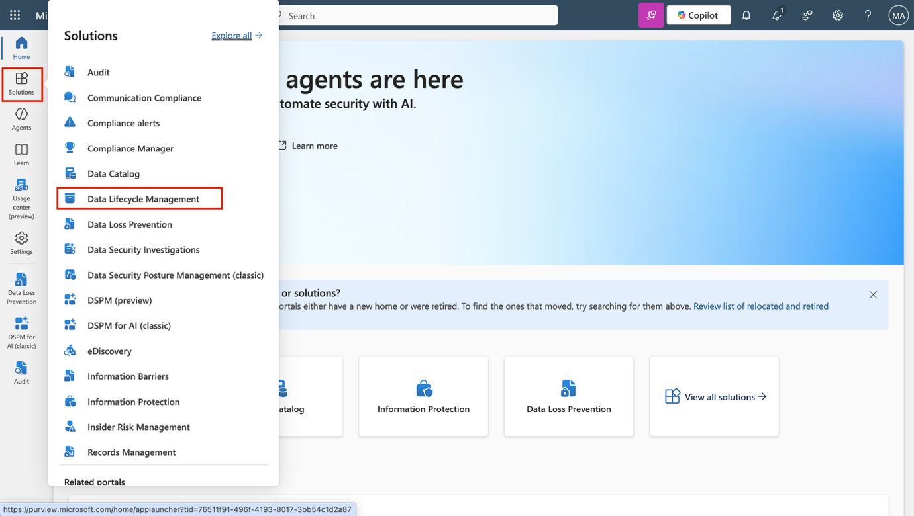

4.  **Retention labels**를 선택하세요.

> 

5.  **Labels 페이지**에서 **Create a label**을 선택하세요.

> 

6.  **Name your retention label** 페이지에서 다음을 입력하세요:

    - **Name**: Sensitive Financial Records

    - **Description for users**: Use for financial files with sensitive data that must be retained for audit or security purposes.

    - **Description for admins**: Retains high-impact financial data for 5 years to support audits and security investigations.

7.  **Next** 버튼을 선택하세요.

> 

8.  **Define label settings** 페이지에서 **Retain items forever** 또는 **for a specific period**를 선택한 후, **Next** 버튼을 클릭하세요.

> 

9.  **Define the period** 페이지에서, 보존 기간 설정 입력란에 다음 값이 지정되어 있는지 확인하세요:

    - **How long is the period?**: 5 Years

> 

- **When should the period begin?**: When items were modified

> 

10. **Next** 버튼을 선택하세요.

> 

11. **Choose what happens after the retention period** 페이지에서 **Delete items automatically**를 선택한 후, **Next** 버튼을 클릭하세요.

> 

12. **Review and finish** 페이지에서 **Create label**을 선택하세요.

> 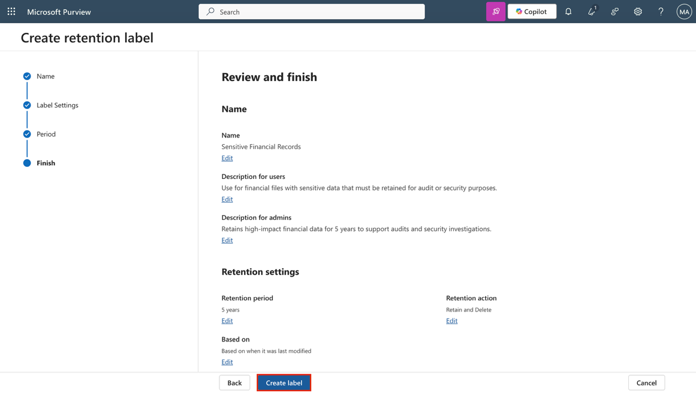

13. **Your retention label is created** 페이지에서 **Do nothing** 옵션을 선택한 후, **Done** 버튼을 클릭하세요.

> 

이제 재무 콘텐츠를 5년 동안 보존하고 이후에는 삭제하여 데이터 노출을 줄이는 보존 레이블을 생성했습니다.

**연습 2 – 보존 레이블 게시**

이번 작업에서는 사용자가 **Exchange, SharePoint, OneDrive**와 같은 Microsoft 365 서비스에서 보존 레이블을 적용할 수 있도록 **보존 레이블을 게시**합니다.

1.  Microsoft Purview에서 **Solutions \> Data Lifecycle Management \> Retention labels**로 이동하세요.

> 

2.  **Sensitive Financial Records** 레이블 옆의 체크박스를 선택한 후, **Publish labels** 아이콘을 클릭해 이 보존 레이블을 게시하세요.

> 

3.  **Choose labels to publish** 페이지에서 **Sensitive Financial Records** 레이블이 선택되어 있는지 확인한 후, **Next** 버튼을 클릭하세요.

> 

4.  **Policy Scope** 페이지에서 **Next** 버튼을 클릭하세요.

> 

5.  **Choose the type of retention policy to create** 페이지에서 **Static**을 선택한 후, **Next** 버튼을 클릭하세요.

> 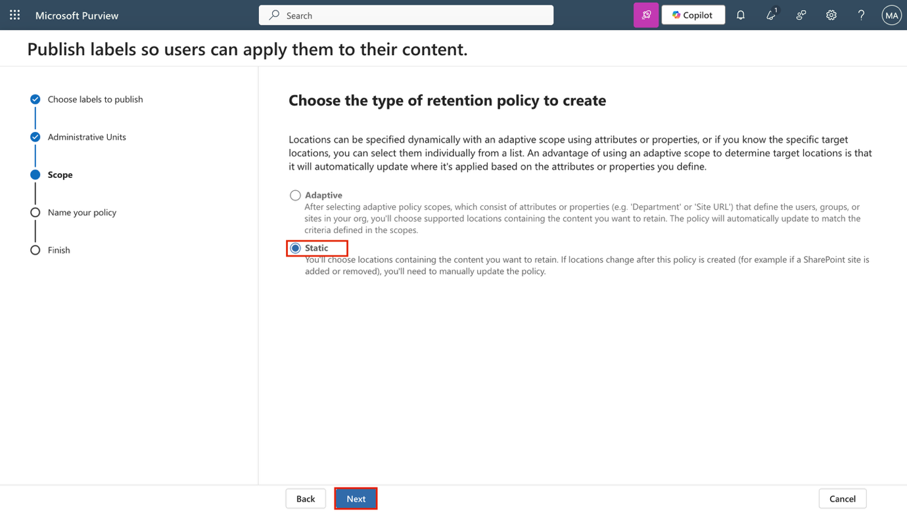

6.  **Choose where to publish labels** 페이지에서 **Let me choose specific locations**를 선택하고, 다음 위치를 선택하세요:

    - Exchange mailboxes

    - SharePoint classic and communication sites

    - OneDrive accounts

    - 다른 모든 위치는 선택 해제

7.  **Next** 버튼을 클릭하세요.

> 

8.  **Name your policy** 페이지에서 다음을 입력하세요:

    - **Name**: Sensitive Financial Data Retention

    - **Description**: Makes the 'Sensitive Financial Records' label available to users in Exchange, SharePoint, and OneDrive.

9.  **Next** 버튼을 클릭하세요.

> 

10. **Finish** 페이지에서 **Submit** 버튼을 클릭하세요.

> 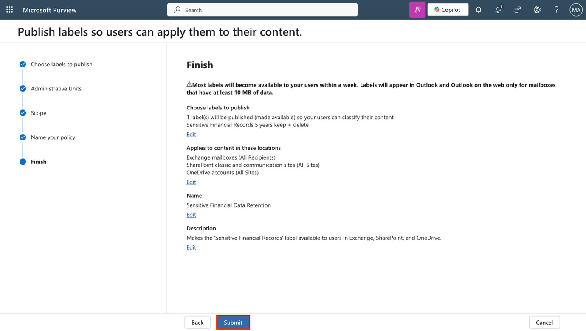

11. **Your retention label was published** 페이지에서 **Done** 버튼을 클릭하세요.

> 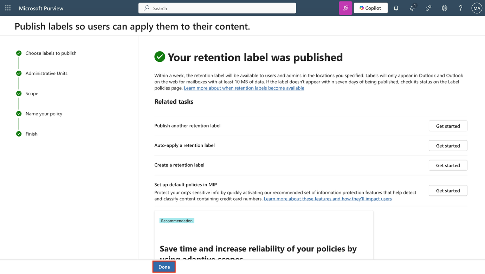

이제 보존 레이블을 게시해 사용자가 주요 Microsoft 365 서비스에서 레이블을 적용할 수 있도록 만들었습니다.

**연습 3 – 자동 적용 보존 레이블 정책 생성**

이번 작업에서는** **개인 재무 정보가 포함된 콘텐츠에 보존 레이블을 자동으로 적용하는 정책을 구성합니다.

1.  Microsoft Purview에서 **Solutions \> Data Lifecycle Management \> Policies \> Label policies**로 이동하세요.

> 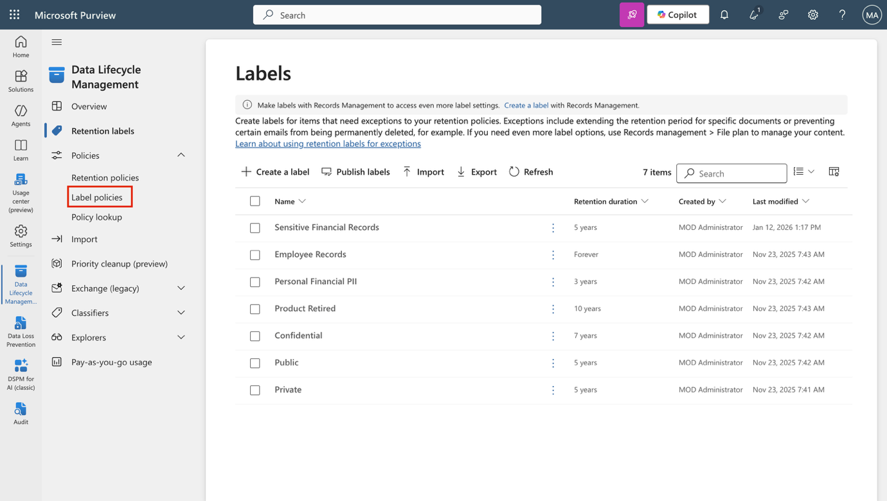

2.  **Label policies** 페이지에서 **Auto-apply a label**을 선택해 레이블 구성을 시작하세요.

> 

3.  **Let's get started** 페이지에서 다음을 입력하세요:

    - **Name**: Auto-apply Personal Financial PII

    - **Description**: Applies this label to personal financial data to help meet audit and investigation requirements. Retains content for 3 years.

4.  **Next** 버튼을 클릭하세요.

> 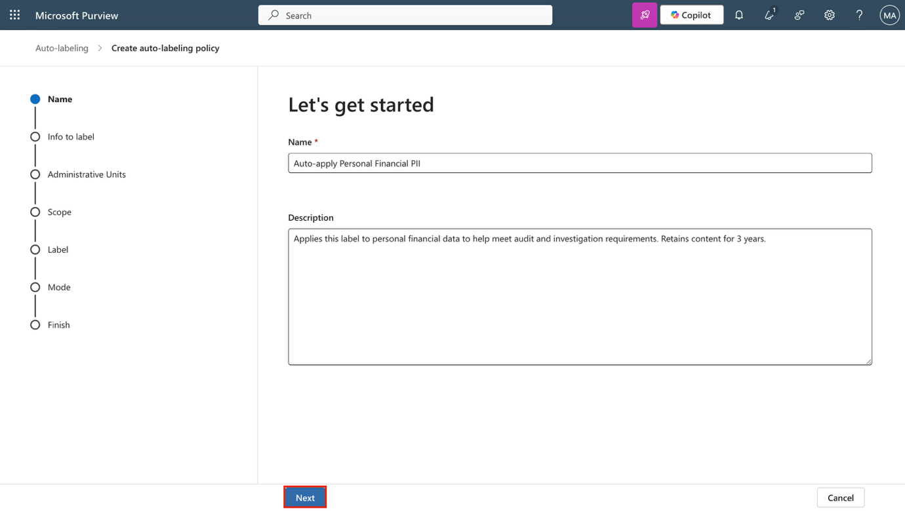

5.  **Choose the type of content you want to apply this label to** 페이지에서 **Apply label to content that contains sensitive info**를 선택한 후, **Next** 버튼을 클릭하세요.

> 

6.  **Content that contains sensitive info** 페이지에서 **Financial** 카테고리를 선택한 후, **U.S. Gramm-Leach-Bliley Act (GLBA)** 규정을 선택하고 **Next** 버튼을 클릭하세요.

> 

7.  **Define content that contains sensitive info** 페이지에서 **Next** 버튼을 클릭하세요.

> 

8.  **Policy Scope** 페이지에서 **Next** 버튼을 클릭하세요.

> 

9.  **Choose the type of retention policy to create** 페이지에서 **Static**을 선택한 후, **Next** 버튼을 클릭하세요.

> 

10. **Choose where to publish labels** 페이지에서 **Let me choose specific locations**를 선택하고, 다음 위치를 선택하세요:

    - Exchange mailboxes

    - SharePoint classic and communication sites

    - OneDrive accounts

    - 다른 모든 위치는 선택 해제

11. **Next** 버튼을 클릭하세요.

> 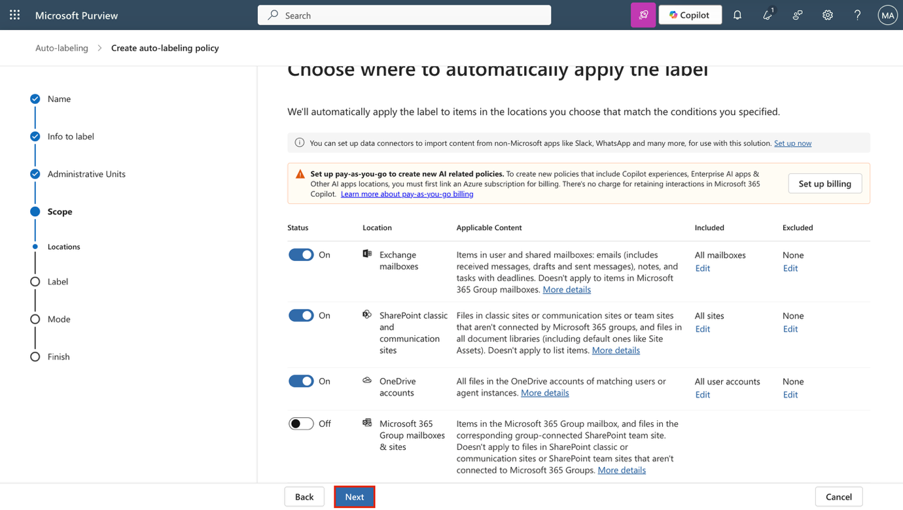

12. **Choose a label to auto-apply** 페이지에서 **Add label**를 선택하세요.

> 

13. **Choose a label** 플라이아웃에서 **Personal Financial PII**를 선택한 후, **Add**를 클릭하세요.

> 

14. **Choose a label to auto-apply** 페이지로 돌아와 **Next** 버튼을 클릭하세요.

> 

15. **Decide whether to test or run your policy** 페이지에서 **Test the policy before running it**를 선택한 후, **Next** 버튼을 클릭하세요.

> 

16. **Review and finish** 페이지에서 **Submit** 버튼을 클릭하세요.

> 

17. **Your auto-labeling policy has been created** 페이지에서 **Done** 버튼을 클릭하세요.

> 

이제 개인 재무 데이터를 식별하고 보존 레이블을 자동으로 적용하는 자동 적용 정책을 생성했습니다.

**연습 4 – 정적 보존 정책 생성 **

이번 작업에서는 Microsoft Teams 콘텐츠에 대한 정적 보존 정책을 생성해 장기적인 데이터 위험을 줄이는 데 도움을 줍니다.

1.  Microsoft Purview에서 **Solutions \> Data Lifecycle Management \> Policies \> Retention policies**로 이동하세요.

> 

2.  **Retention policies** 페이지에서 **New retention policy**를 선택하세요.

> 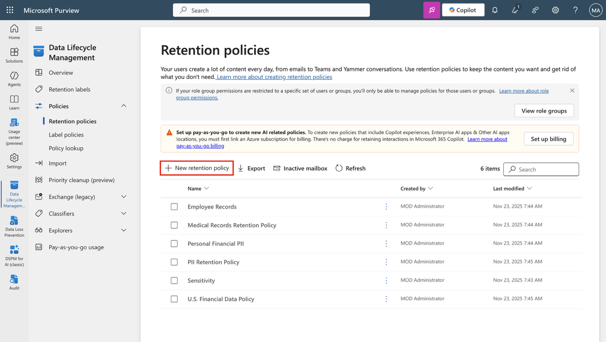

3.  **Name your retention policy** 페이지에서 다음을 입력하세요:

    - **Name**: Teams Retention

    - **Description**: Retains Teams chats and channel messages for 3 years, then deletes them to reduce long-term data risk.

4.  **Next** 버튼을 클릭하세요.

> 

5.  **Policy Scope** 페이지에서 **Next** 버튼을 클릭하세요.

> 

6.  **Choose the type of retention policy to create** 페이지에서 **Static**을 선택한 후, **Next** 버튼을 클릭하세요.

> 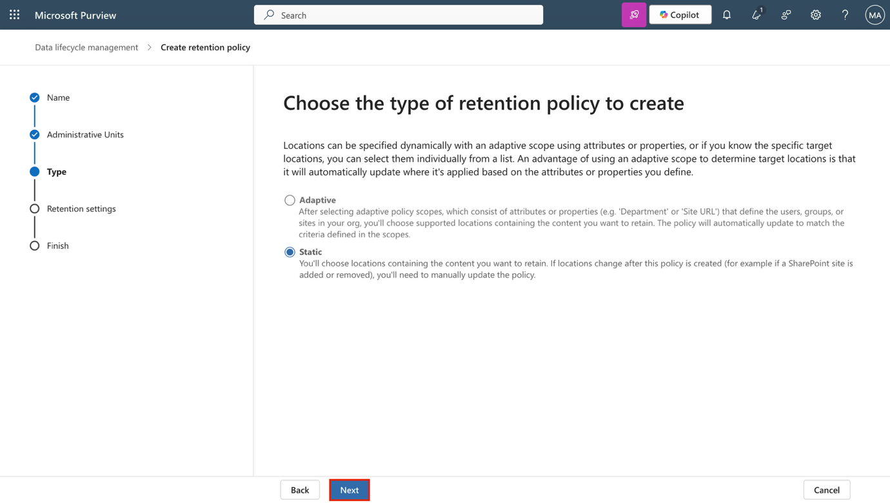

7.  **Choose locations to apply the policy** 페이지에서 다음 위치를 활성화하세요:

    - Teams 채널 메시지

    - Teams 채팅

    - 다른 모든 위치는 비활성화 상태로 두기

8.  **Next** 버튼을 클릭하세요.

> 

9.  **Decide if you want to retain content, delete it, or both** 페이지에서 보존 구성 값이 다음과 같이 설정되어 있는지 확인하세요:

    - **Retain items for a specific period** 선택

    - **Retain items for a specific period** 아래에서 드롭다운 목록에서 **Custom** 선택

> 

- **Years** 필드를 3으로 변경

- **Start the retention period based on**: When items were last modified

> 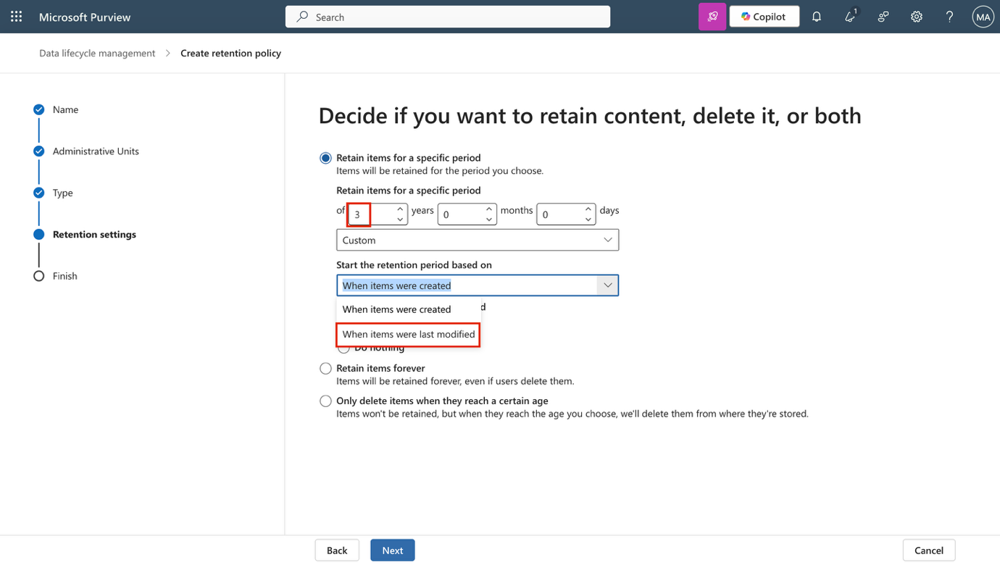

- **At the end of the retention period**: Delete items automatically

10. **Next** 버튼을 클릭하세요.

> 

11. **Review and finish** 페이지에서 **Submit** 버튼을 클릭하세요.

> 

12. **You successfully created a retention policy** 페이지에서 **Done** 버튼을 클릭하세요.

> 

이제 Teams 메시지를 3년 동안 보존한 후 자동으로 삭제하는 정적 보존 정책을 구성했습니다.

**연습 5 – 적응형 범위(Adaptive scope) 생성**

이번 과제에서는 리더십 및 운영 역할과 연결된 Microsoft 365 그룹을 대상으로 하는적응형 범위를 정의합니다.

1.  Microsoft Purview에서 **Settings \> Roles and scopes \> Adaptive scopes**로 이동하세요.

2.  **Adaptive scopes** 페이지에서 **+ Create scope**를 선택하세요.

> 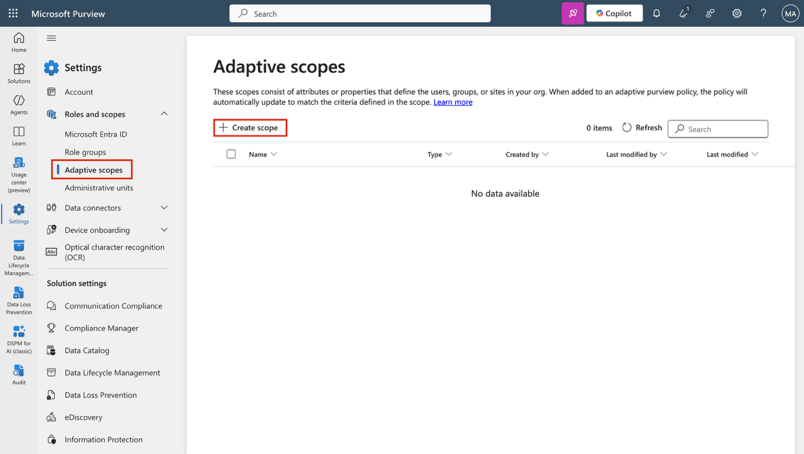

3.  **Name your adaptive policy scope** 페이지에서 다음을 입력하세요:

    - **Name**: Leadership and Ops Groups

    - **Description**: Targets Leadership and Operations M365 groups with privileged access to sensitive data.

4.  **Next** 버튼을 클릭하세요.

> 

5.  **Assign admin unit** 페이지에서 **Next** 버튼을 클릭하세요.

> 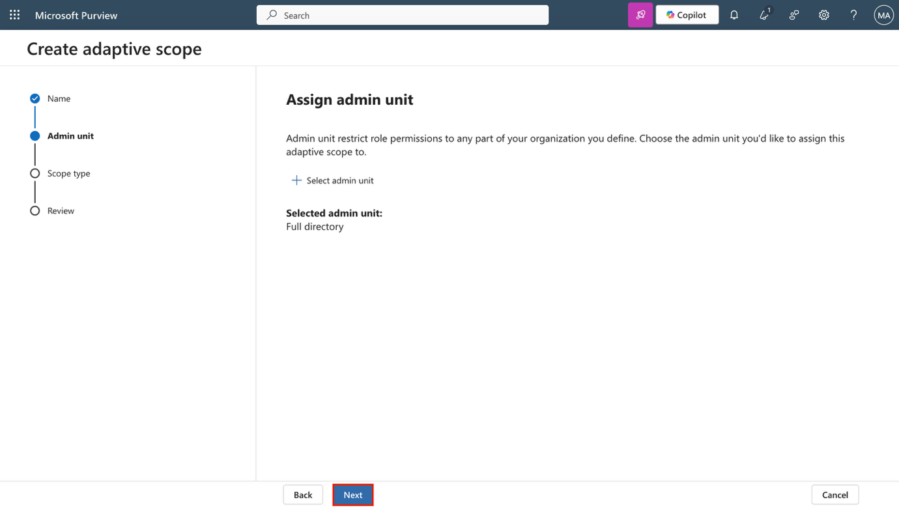

6.  **What type of scope do you want to create?** 페이지에서 **Microsoft 365 Groups**를 선택한 후, **Next** 버튼을 클릭하세요.

> 

7.  **Create the query to define users** 페이지에서 **User attributes** 섹션의 사용자 속성 구성이 다음과 같이 설정되어 있는지 확인하세요:

    - **Attribute** 드롭다운에서 **Name** 선택

> 

- 다음 필드에서 기본값인 **is equal to** 그대로 유지

- **Value**에 Leadership 입력

8.  **Create the query to define users** 페이지에서 **+ Add attribute**를 선택해 두 번째 속성을 추가하세요.

> 

9.  방금 구성한 필드 아래 새 필드에서 다음 값을 설정하세요:

    - 쿼리 연산자 드롭다운을 선택하고, And에서 **Or**로 업데이트

> 

- **Attribute** 드롭다운에서 **Name** 선택

> 

- 다음 필드에서 기본값인 **is equal to** 그대로 유지

- **Value**에 Operations 입력

10. **Next** 버튼을 클릭하세요.

> 

11. **Review and finish** 페이지에서 **Submit** 버튼을 클릭하세요.

> 

12. 적응형 범위가 생성되면, **Your scope was created** 페이지에서 **Done** 버튼을 클릭하세요.

> 

이제 조직 내 권한 있는 그룹을 대상으로 한 보존을 지원하는 적응형 범위(Adaptive scope)를 생성했습니다.

**연습 6 – 적응형 보존 정책 생성**

이번 작업에서는 이전에 생성한 적응형 범위를 사용하여, 민감한 책임을 가진 Microsoft 365 그룹에 대한 보존 정책을 구성합니다.

1.  Microsoft Purview에서 **Solutions \> Data Lifecycle Management \> Policies \> Retention policies**로 이동하세요.

> 

2.  **Retention policies** 페이지에서 **+ New retention policy**를 선택하세요.

> 

3.  **Name your retention policy** 페이지에서 다음을 입력하세요:

    - **Name**: Privileged Group Retention

    - **Description**: Retains content from Leadership and Operations groups for 5 years to support audit and investigation.

4.  **Next** 버튼을 클릭하세요.

> 

5.  **Policy Scope** 페이지에서 **Next** 버튼을 클릭하세요.

> 

6.  **Choose the type of retention policy to create** 페이지에서 **Adaptive**를 선택한 후, **Next** 버튼을 클릭하세요.

> 

7.  **Choose adaptive policy scopes and locations** 페이지에서 **+ Add scopes**를 선택하세요.

> 

8.  **hoose adaptive policy scopes** 플라이아웃 패널에서 **Leadership and Ops Groups** 체크박스를 선택한 후, 패널 하단의 **Add** 버튼을 클릭하세요.

> 

9.  **Choose locations to apply the policy** 페이지로 돌아와서 다음 위치를 활성화하세요:

    - Microsoft 365 그룹 메일박스 및 사이트

    - 다른 모든 위치는 비활성화 상태로 유지

10. **Next** 버튼을 클릭하세요.

> 

11. **Decide if you want to retain content, delete it, or both** 페이지에서 보존 구성 값이 다음과 같이 설정되어 있는지 확인하세요:

    - **Retain items for a specific period** 선택

    - **Retain items for a specific period** 아래에서 드롭다운 목록에서 **5 years** 선택

    - **Start the retention period based on**: When items were last modified

    - **At the end of the retention period**: Delete items automatically

12. **Next** 버튼을 클릭하세요.

> 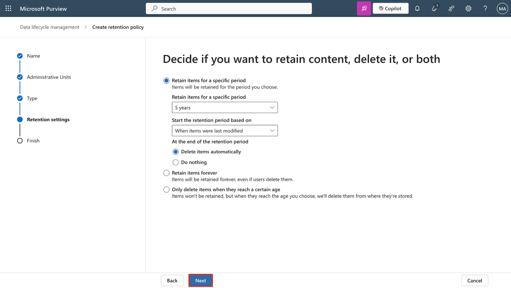

13. **Review and finish** 페이지에서 **Submit** 버튼을 클릭하세요.

> 

14. 정책이 생성되면 **Done** 버튼을 클릭하세요.

> 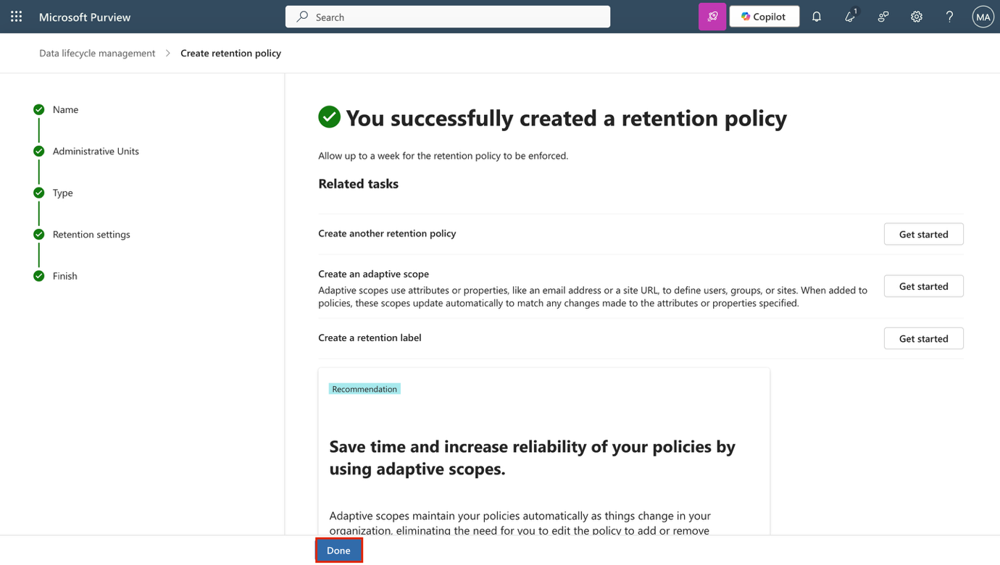

이제 권한 있는 그룹 소유 콘텐츠에 적용되는 보존 정책을 생성했으며, 해당 콘텐츠는 5년 동안 보존된 후 삭제됩니다.

**연습 7 – SharePoint 콘텐츠 복구**

이번 작업에서는 SharePoint 사이트에서 삭제된 문서를 복구하는 시뮬레이션을 수행하여 복구 옵션을 확인합니다.

1.  VM에 로그인되어 있고, Microsoft Purview에서 Patti Fernandez 계정으로 계속 로그인 상태여야 합니다.

2.  좌측 상단의 앱 실행기(App launcher, 그리드 아이콘)를 선택한 후, 하위 메뉴에서 **More apps**를 선택하세요.

> 

3.  **SharePoint**를 선택하세요.

> 

4.  SharePoint 랜딩 페이지에서 Benefits 를 검색한 후, 검색 결과에서 **Benefits @ Contoso**를 선택하세요.

> 

5.  왼쪽 사이드바에서 **Documents**를 선택하세요.

> 

6.  **Documents** 페이지에서 **Vacation Policies.pptx** 체크박스를 선택한 후, 액션 바에서 **Delete**를 클릭하세요.

> 

7.  **Delete?** 대화 상자에서 **Delete**를 선택하세요.

> 

8.  왼쪽 사이드바에서 **Recycle bin**을 선택하세요.

> 

9.  **Recycle bin** 페이지에서 **Vacation Policies.pptx**를 마우스 오른쪽 버튼으로 클릭한 후, **Restore**를 선택하세요.

> 

10. 왼쪽 사이드바에서 **Documents**를 선택해 파일이 복원되었는지 확인하세요.

> 

이로써 SharePoint 사이트에서 삭제된 문서를 성공적으로 복구했습니다.
