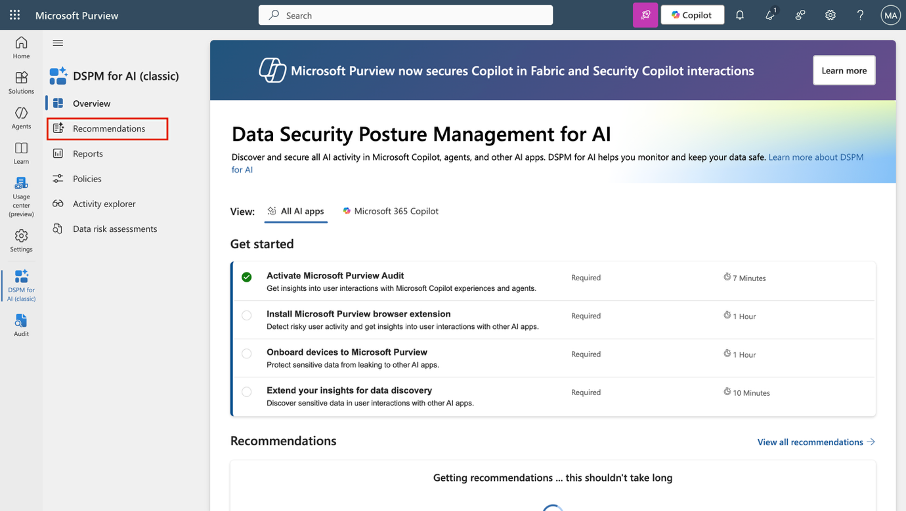
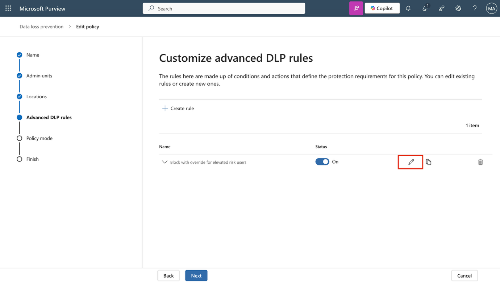
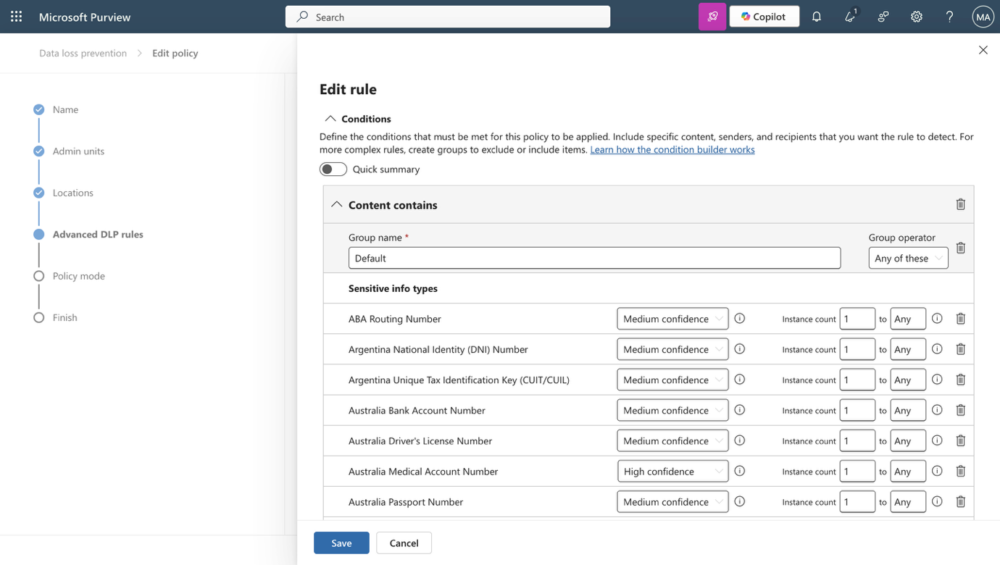
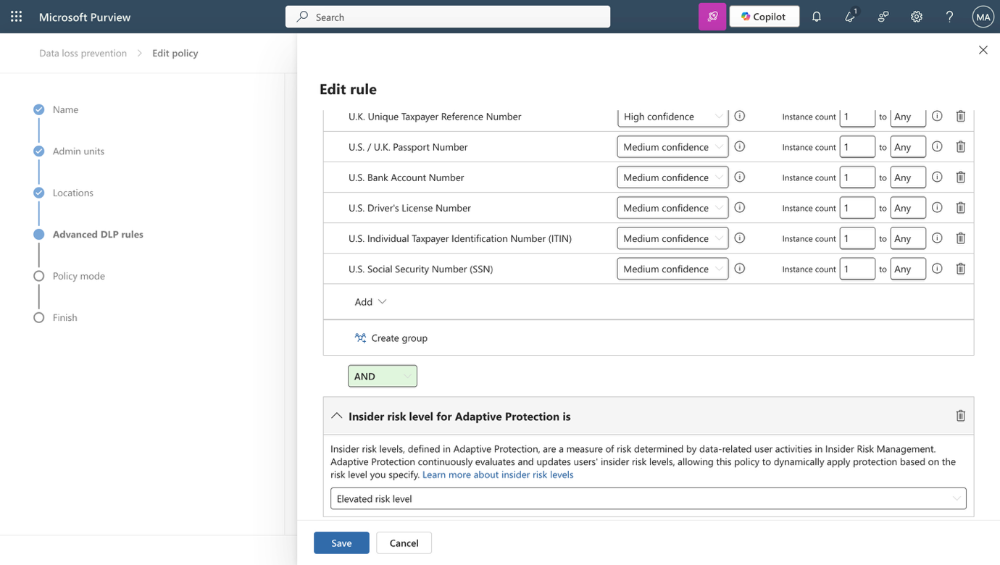
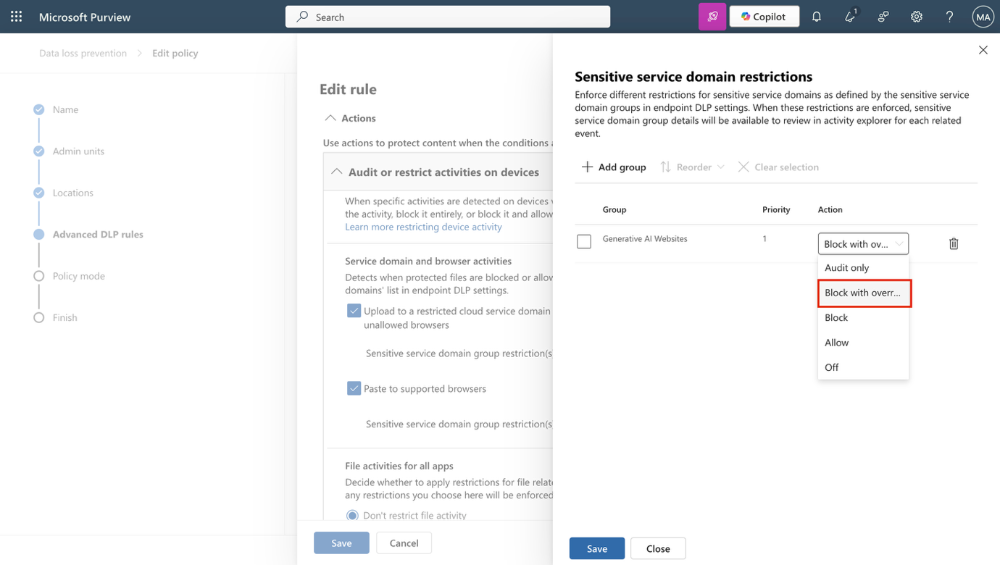
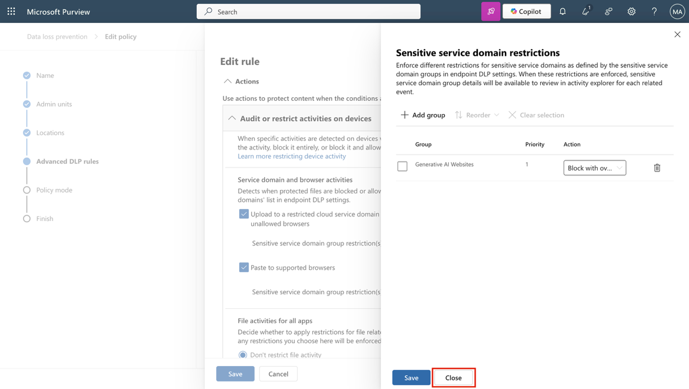
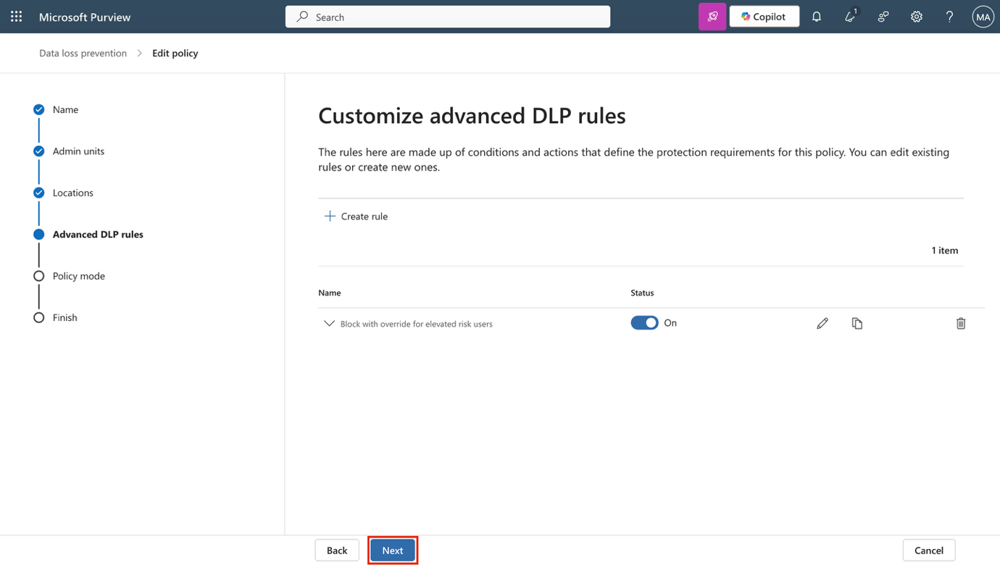

**실습 14 – DSPM for AI를 사용해 에이전트와 AI 앱 보호**

당신은 Contoso Ltd.의 정보 보안 관리자 Patti Fernandez입니다. Microsoft Copilot과 같은 AI 도구가 일상 업무에 점점 더 통합됨에 따라, 팀은 민감 데이터 보호 수준을 평가하고 강화하도록 요청받았습니다. 이번 실습에서는 Microsoft Purview DSPM for AI를 활용하여, 정책 시행, 위험 탐지, 데이터 노출 평가를 통해 AI 도구와의 데이터 상호작용을 안전하게 보호하는 방법을 학습합니다.

**실습 과제**:

- DSPM for AI를 사용하여 생성형 AI 사이트용 DLP 정책 생성

- 위험한 AI 상호작용을 탐지하는 내부자 위험 정책 생성

- AI 앱에서 비윤리적 행동 탐지

- 라벨이 없는 콘텐츠를 탐지하기 위한 데이터 평가 실행

**작업 1 – DSPM for AI를 사용해 생성형 AI 사이트용 DLP 정책 생성**

AI 어시스턴트를 통한 데이터 손실 위험을 줄이기 위해, Fortify your data security 권장 사항을 활용하여 DLP 정책을 생성합니다. 이 정책은 Adaptive Protection을 사용해 Edge, Chrome, Firefox에서 ChatGPT, Copilot 등의 AI 도구에 민감 데이터를 붙여넣거나 업로드하는 것을 제한합니다.

1.  VM에 관리자(admin) 계정으로 로그인하세요.

2.  **Microsoft Edge**를 열고 https://purview.microsoft.com 으로 이동한 후,  **Patti Fernandez** (Pattif@TenantName) 계정으로 로그인하세요.

3.  Microsoft Purview에서 **Solutions \> DSPM for AI \> Recommendations**를 선택해 DSPM for AI로 이동하세요.

> 

4.  **Fortify your data security** 권장 사항을 선택하세요.

> 

5.  **Data security for AI** 플라이아웃 페이지에서 요약 내용을 검토한 후, **Create policies**를 선택하세요. 이렇게 하면 생성형 AI 사이트를 대상으로 하는 사전 구성된 DLP 정책이 생성됩니다.

> 

6.  Block elevated risk users from pasting or uploading sensitive info on AI sites 정책이 생성된 것을 확인할 수 있습니다. 다른 두 정책은 pay-as-you-go 기능이 필요하므로 이 테넌트에서는 생성되지 않습니다. 정책이 생성되면 Policy details를 선택하세요.

> 

7.  **Policy details** 섹션에서 **Edit policy in solution**을 선택해 Microsoft Purview의 **Data Loss Prevention 솔루션**을 여세요.

> 

8.  **Next** 버튼을 계속 클릭해 **Choose where to apply the policy** 페이지까지 이동하세요.

> 

9.  정책이 **Devices** 대상으로 설정되어 있는지 확인한 후, **Next** 버튼을 클릭하세요.

1.  **Customize advanced DLP rules** 페이지에서 **Block with override for elevated risk users** 옆의 연필 아이콘을 선택해 규칙을 확인하세요.

1.  DSPM for AI가 생성한 규칙 구성을 검토하세요:

    - **Conditions**에서 포함된 민감 정보 유형과 규칙이 위험 수준이 높은 사용자 기반 **Adaptive Protection**을 사용하는 것을 확인하세요.

> 

- **Actions**에서 Upload 및 Paste 활동 모두에 대해 **Sensitive service domain group restriction(s)** 옆의 **Edit**를 선택하세요.

> 

- 서비스 도메인 그룹 구성에서 **Generative AI Websites**가 **Block with override**로 설정되어 있는지 확인하세요.

> 

- 패널을 닫으려면 **Close**를 선택하세요.

> 

2.  규칙 편집기에서 변경 없이 종료하려면 **Cancel**을 선택하세요.

1.  **Customize advanced DLP rules** 페이지로 돌아와 **Next** 버튼을 클릭하세요.

1.  **Policy mode** 페이지에서 **Turn the policy on if it's not edited within fifteen days of simulation**을 선택한 후, **Next** 버튼을 클릭하세요.

1.  **Review and finish** 페이지에서 **Submit**을 선택한 후, **Done** 버튼을 클릭하세요.

이제 위험 수준이 높은 사용자가 생성형 AI 사이트에서 민감 데이터를 공유하는 것을 차단하는 정책을 생성하고, DSPM for AI가 설정한 정책 구성을 확인했습니다.

나머지 정책들도 동일한 방법으로 **Solutions \> DSPM for AI \> Recommendations**를 선택해 검토할 수 있습니다. 자신의 테넌트 또는 사용자 계정에서 pay-as-you-go 기능이 있는 경우, 다음 실습을 계속 진행할 수 있습니다.

**작업 2 – 위험한 AI 상호작용 탐지를 위한 내부자 위험 정책 생성**

다음으로, Copilot에서 위험한 프롬프트 행동을 탐지할 수 있는 정책을 생성합니다.

1.  Microsoft Purview에서 **Solutions \> DSPM for AI \> Recommendations**를 선택하여 **DSPM for AI**로 이동하세요.

2.  **Detect risky interactions in AI apps (preview)** 권장 사항을 선택하세요.

3.  **Detect risky interactions in AI apps (preview)** 플라이아웃 페이지에서 요약 내용을 검토한 후, **Create policy**를 선택하세요.

4.  정책이 생성되면 **View policy**를 선택하세요.

5.  **Policy details** 섹션에서 **Edit policy in solution**을 선택해 Microsoft Purview의 **Insider Risk Management** 영역을 여세요.

6.  **Policies** 페이지에서 **DSPM for AI - Detect risky AI usage** 정책을 찾아 선택하세요.

7.  플라이아웃에서 **Edit policy**를 선택하여 전체 정책 구성을 검토하세요.

8.  **Choose a policy template** 페이지에서 정책이 **Risky AI usage (preview)** 템플릿을 사용하고 있는지 확인하세요.

9.  **Next** 버튼을 계속 클릭하여 **Choose triggering event for this policy** 페이지까지 이동하고, **User account deleted from Microsoft Entra ID**가 트리거 이벤트로 설정되어 있는지 확인하세요. 이 이벤트는 위험한 AI 활동과 관련하여 직원 오프보딩 전후의 잠재적 위험을 나타냅니다.

10. **Next** 버튼을 클릭하세요.

11. **Indicators** 페이지에서 지표 카테고리를 확장해 선택된 신호를 검토하세요:

    - 생성형 AI 웹사이트 접속

    - Copilot에서 민감한 응답 수신

    - Copilot에서 위험한 프롬프트 입력

12. **Next** 버튼을 계속 클릭하여 **Review and finish** 페이지까지 이동한 후, **Cancel**을 선택해 편집기를 변경 없이 종료하세요.

이제 프롬프트와 응답을 포함한 위험한 AI 상호작용을 탐지하여, 위험한 사용자 행동의 초기 신호를 식별하는 정책을 생성했습니다.

**작업 3 – AI 앱에서 비윤리적 행동 탐지**

이번 작업에서는 DSPM for AI에서 정책을 생성하여 Microsoft 365 Copilot 및 기타 AI 애플리케이션에서 비윤리적 또는 부적절한 행동을 탐지합니다.

1.  Microsoft Purview에서 **Solutions \> DSPM for AI \> Recommendations**를 선택하여 **DSPM for AI**로 이동하세요.

2.  **Detect unethical behavior in AI apps** 권장 사항을 선택하세요.

3.  플라이아웃에서 정책이 구성할 내용을 검토하세요:

    - 기본 정책 이름은 **DSPM for AI – Unethical behavior in AI apps**입니다.

    - 정책은 Microsoft 365 Copilot 및 기타 AI 에이전트의 프롬프트와 응답에서 민감하거나 부적절한 정보를 탐지합니다.

    - 조직 내 모든 사용자와 그룹에 적용됩니다.

4.  **Create policy**를 선택해 Communication Compliance 정책을 생성하세요.

5.  **Policy successfully created** 페이지에서 **X**를 클릭하여 플라이아웃을 닫으세요.

6.  **Recommendations** 페이지가 새로고침되며, **Detect unethical behavior in AI apps** 권장 사항이 **Completed**로 이동하세요.

7.  왼쪽 탐색 메뉴에서 **Policies**를 선택하세요.

8.  새로 생성된 **DSPM for AI – Unethical behavior in AI apps** 정책을 선택해 구성 및 상태를 검토하세요.

9.  **DSPM for AI – Unethical behavior in AI apps** 페이지에서 **X**를 클릭해 플라이아웃을 닫으세요.

이제 AI 애플리케이션에서 비윤리적 활동을 탐지하는 정책을 생성해 Contoso가 Copilot을 책임감 있게 사용할 수 있도록 지원합니다.

**작업 4 – 라벨이 없는 콘텐츠 탐지를 위한 데이터 위험 평가 생성**

레이블 적용 범위에서 잠재적 공백을 확인하기 위해, 데이터 위험 평가를 실행해 Copilot에서 접근할 수 있는 민감도 레이블이 없는 파일을 식별합니다.

1.  **DSPM for AI**에서 **Protect sensitive data referenced in Copilot and agent responses** 권장 사항을 선택하세요.

2.  **Protect sensitive data referenced in Copilot and agent responses** 창에서 요약 내용을 검토한 후, **Go to assessments**를 선택하세요.

3.  **Data risk assessments** 페이지에서 **Create custom assessment**를 선택하세요.

4.  **Basic details** 페이지에서 다음을 입력하세요:

    - **Name**: Unlabeled File Exposure Assessment

    - **Description**: Identifies files without sensitivity labels that may be exposed in Microsoft 365 Copilot responses and provides recommendations to reduce oversharing risks.

5.  **Next** 버튼을 클릭하세요.

6.  **Add users** 페이지에서 **All**을 선택한 후, **Next** 버튼을 클릭하세요.

7.  **Add data sources to assess** 페이지에서 기본 위치인 **SharePoint**를 그대로 두고 **Next** 버튼을 클릭하세요.

8.  **Review and run the data assessment scan** 페이지에서 **Save and run**을 선택하세요.

9.  **Data assessment successfully created** 페이지에서 **Done**을 선택하세요.

이제 Microsoft Purview DSPM for AI를 사용해 AI 관련 위험을 탐지하고, 정책을 시행하며, 민감 데이터 노출을 평가했습니다. 이를 통해 조직이 AI를 안전하게 활용할 수 있도록 지원합니다.
