**실습 2 – 민감 정보 유형 관리​**

**소개**

Contoso Ltd.는 과거 티켓 관리 시스템에서 지원 티켓을 처리하는 과정 중, 직원들이 고객의 개인정보를 실수로 외부로 유출하는 문제가 있었습니다.

이를 예방하고 사용자를 교육하기 위해, 이메일과 문서에서 직원 ID를 식별할 수 있는 맞춤형 중요 정보 유형을 생성합니다. 직원 ID는 대문자 3자리와 숫자 6자리로 구성되며, 오탐을 최소화하기 위해 “Employee”와 “IDs” 키워드를 함께 사용합니다.

**목표**

- 정규식과 키워드 목록을 활용해 **맞춤형 중요 정보 유형** 생성

- 구조화된 직원 데이터를 사용해 **EDM 기반 중요 정보 유형** 구성 및 정의

- 직원 데이터를 해시 처리(Hash)하고 **EDM Upload Agent**를 사용해 업로드 및 분류

- **키워드 사전을 기반으로 민감 건강 정보**를 식별하는 중요 정보 유형 구축

- 정책 적용 전에 맞춤형 중요 정보 유형의 정확성을 테스트하고 검증

**연습 1 – 맞춤형 중요 정보 유형 생성**

이 연습에서는 **Security & Compliance Center PowerShell** **모듈**을 사용해 "Employee" 및"ID" 키워드 근처에 있는 직원 ID 패턴을 인식하는 새로운 맞춤형 중요 정보 유형을 생성합니다.

1.  Edge 브라우저에서 InPrivate 창을 열고, 주소 표시줄에 다음 URL을 입력해 Microsoft Purview 포털을 여세요: <https://purview.microsoft.com>. 그런 다음 **Patti Fernandez** 계정으로 로그인하세요. 사용자 이름은 **PattiF@TenantName**이며, 비밀번호는 리소스 탭에서 제공된 값을 사용합니다.

> 
>
> 

2.  **Welcome to the new Microsoft Purview protal!** 대화 상자가 표시되면 **Get Started** 버튼을 클릭하세요.

> 

3.  왼쪽 탐색 메뉴에서 **Solutions** \> **Data Loss Prevention**을 선택하세요.

> 
>
> **참고**: 만약 Solutions 목록에서 **Data Loss Prevention**이 보이지 않는 경우, 몇 분 정도 기다린 후 페이지를 새로 고침하세요. 그래도 목록에 나타나지 않으면, Regular (Normal) 브라우징 창을 사용해 다시 로그인하세요.

4.  왼쪽 메뉴에서 **Classifiers**를 선택하세요. 하위 탐색 메뉴에서 **Sensitive info types**를 선택한 후, **+Create sensitive info type**을 선택해 새 중요 정보 유형 생성 마법사를 여세요.

> 

5.  **Name your sensitive info type** 페이지에서 다음 정보를 입력하세요:

    - **Name**: Contoso Employee IDs

    - **Description**: Pattern for Contoso employee IDs

6.  **Next**를 선택하세요.

> 

7.  **Define patterns for this sensitive info type** 페이지에서 **Create pattern**을 선택하세요.

8.  오른쪽에 표시되는 **New pattern** 창에서 **Add primary element**를 선택한 다음 **Regular expression**을 선택하세요.

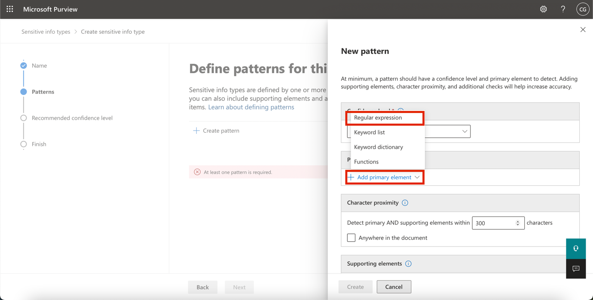

9.  오른쪽에 새로 표시되는 **Add a regular expression** 창에서 다음 정보를 입력하세요:

    - **ID**: Contoso IDs

    - **Regular expression**: \s\\A-Z\\{3}\\0-9\\{6}\s

    - **String match**를 선택하세요.

10. **Done**을 선택하세요.

11. New pattern 창에서 **Character proximity** 값을 ***100***자로 설정하세요.

> 
>
> 

12. **Supporting elements** 섹션으로 이동한 후 **+ Add supporting elements or group of elements** 드롭다운 메뉴를 클릭하고 **Keyword list**를 선택하세요.

> 

13. **Add a keyword list** 창에서 다음 정보를 입력하세요:

    - **ID**: Employee ID keywords

    - **Case insensitive**:Employee ID

> 

14. 아래로 스크롤하여 **Word match**옆의 라디오 버튼을 선택한 후, **Done** 버튼을 클릭하세요. 

> 

15. 이제 **Create** 버튼을 클릭하세요.

> 

16. **Define patterns for this sensitive info type**  페이지로 돌아가 **Next**를 선택하세요.

> 

17. **Choose the recommended confidence level to show in compliance policies** 페이지에서 기본값을 그대로 사용하고 **Next** 버튼을 선택하세요.

> 

18. **Review settings and finish** 페이지에서 설정을 검토한 후 **Create**를 선택하세요. 생성이 완료되면 **Done**을 선택하세요.

> 
>
> 

19. 브라우저 창을 닫지 말고 그대로 두세요.

세 개의 대문자와 여섯 자리 숫자로 구성된 직원 ID 패턴을 인식하고, 100자 이내 범위에서 ‘Employee’ 또는 ‘IDs’키워드가 함께 포함된 경우를 식별하는 새로운 중요 정보 유형을 성공적으로 생성했습니다.

**연습 2 – EDM 기반 분류 정보 유형 생성**

추가적인 검색 패턴으로, 직원 데이터 데이터베이스 스키마를 기반으로 한 EDM 기반 분류(EDM-based classification)를 생성합니다. 데이터베이스 원본 파일은 직원의 Name, Birthdate, StreetAddress, EmployeeID 필드를 포함하는 형식으로 구성됩니다.

1.  Solutions를 클릭한 후, **Data Loss Prevention**을 선택하세요.

> 

2.  **Classifiers**를 클릭한 다음 **EDM classifiers**를 선택하세요. EDM classifiers 페이지에서 **New EDM experience** 옆의 토글 버튼을 클릭해 **Off**로 전환하세요.

> 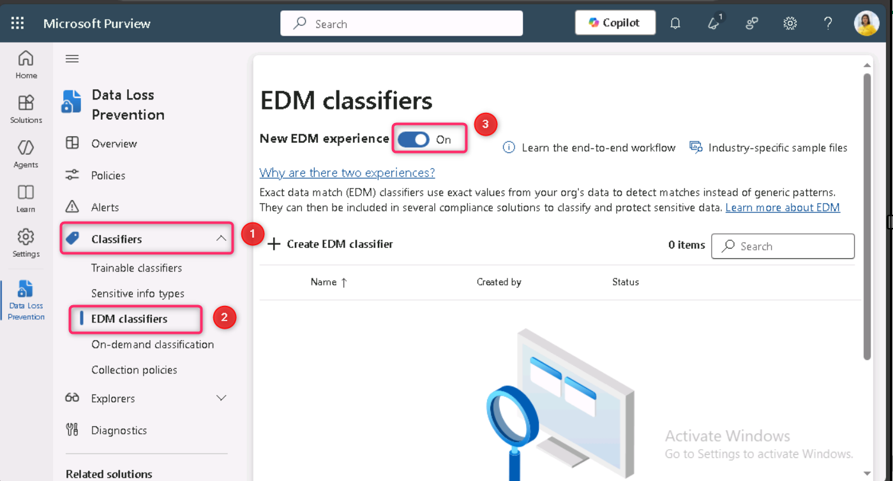

3.  그런 다음 **Create** **EDM schema**를 클릭하세요.

> 

4.  **Name** 필드에 employeedb를 입력하세요.

5.  **Description** 필드에 Employee Database schema..를 입력하고, **Ignore delimiters and punctuation for all schema fields**옵션의 선택을 해제하세요.

> 
>
> 

6.  첫 번째 Schema field name에 Name을 입력하고, **Field is searchable** 체크박스를 선택하세요.

> 

7.  **Choose delimiters and punctuation to ignore** 드롭다운을 클릭하고 **Hyphen**, **Period**, **Space**, **Open parenthesis**, **Close parenthesis**를 선택하세요.

> 

8.  하단에서 **+ Add schema data field**를 선택하세요.

> 

9.  **Schema field \#2** 아래의 **Schema field name**에 Birthdate를 입력하세요.

10. 하단에서 **+ Add schema data field**를 다시 선택하세요.

11. **Schema field \#3** 아래의 **Schema field name**에 StreetAddress를 입력하세요.

12. 하단에서 **+ Add schema data field**를 선택하세요.

13. **Schema field \#4** 아래의 **Schema field name**에 EmployeeID를 입력하세요.

14. **Field is searchable**를 선택하세요.

15. **Save**를 선택하세요.

> 

16. 왼쪽 메뉴에서 **EDM sensitive info types**를 선택한 후 **+ Create EDM sensitive info type**을 선택하여 **EDM rule package** 마법사를 여세요.

> 

17. **Define data store schema** 페이지에서 **Choose an existing EDM schema**를 선택하세요.

> 

18. **employeedb**를 선택한 후 **Add**를 클릭하세요.

> 

19. 데이터 저장소 스키마를 검토한 후 **Next**를 선택하세요.

> 

20. **Define patterns for this EDM sensitive info type** 페이지에서 **+ Create pattern**을 선택하세요.

> 

21. 오른쪽 **New pattern** 창에서 **Primary element** 필드에 ***EmployeeID***를 선택하세요.

22. **Primary element의 sensitive info type** 아래에서 **Choose sensitive info type**을 선택하세요.

> 

23. **Search** 표시줄에 Contoso를 입력하고 Enter 키를 누르세요.

24. **Contoso Employee IDs**를 선택한 후 **Done**을 클릭하세요.

25. **Done**을 클릭하세요.

> 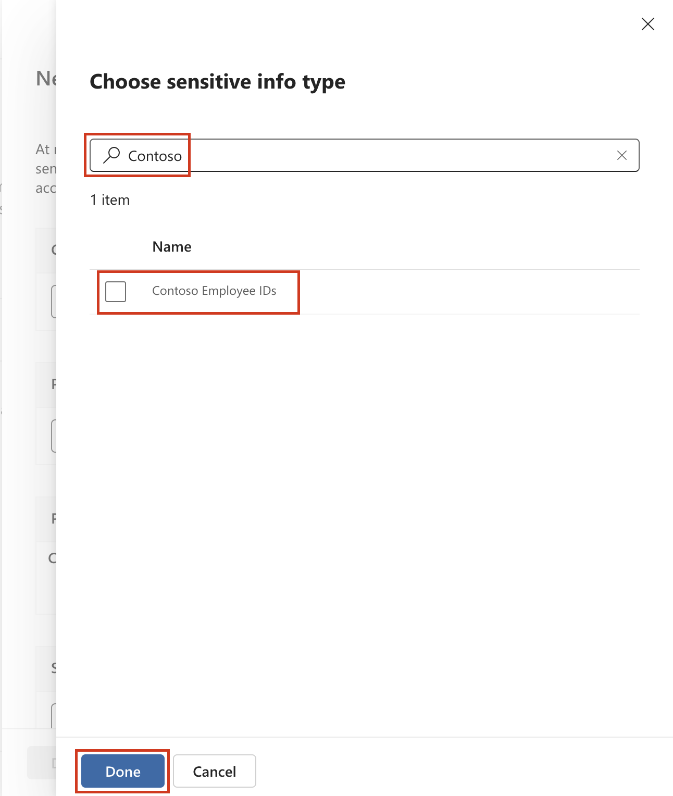

26. *Define patterns for this EDM sensitive info type* 화면에서**Next**를 선택하세요.

> 

27. **Choose the recommended confidence level and character proximity** 화면에서 기본값을 그대로 유지한 후 **Next**를 선택하세요.

> 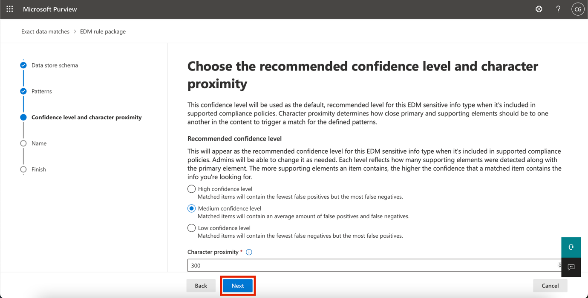

28. **Name and describe your EDM sensitive info type** 페이지에서, Name에 Contoso Employee EDM을 입력하세요.

29. **Description for admins** 필드에 EDM-based sensitive information type for employee personal information.를 입력한 후 **Next**를 선택하세요**.**

> 

30. 설정을 검토한 후 **Submit**를 선택하세요.

> 

31. **Your EDM sensitive info type was created** 페이지에서 **Done**을 선택하세요.

> 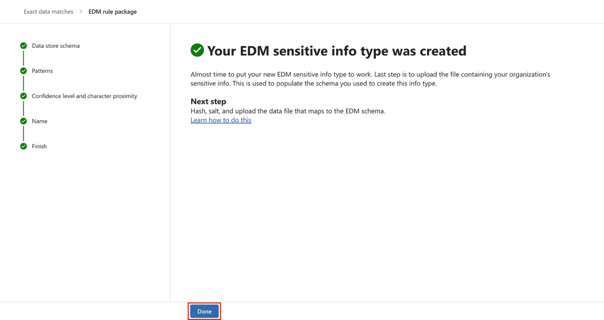

32. Microsoft Purview 포털이 열려 있는 브라우저 창을 그대로 두세요.

데이터베이스 파일 소스를 기반으로 직원 데이터를 식별할 수 있는 새로운 EDM 기반 분류 민감 정보 유형을 성공적으로 생성했습니다.

**연습 3 – EDM 기반 분류 데이터 원본 생성**

EDM 기반 분류를 민감 데이터를 포함한 데이터베이스와 연결하려면, EDM Upload Agent 도구를 사용해 실제 데이터를 해시 처리(Hash) 후 업로드하여 민감 정보 유형에 연결해야 합니다.

1.  **Microsoft Edge** Edge 브라우저에서 다음 URL로 **이동해 EDM Upload Agent**를 다운로드하세요: https://go.microsoft.com/fwlink/?linkid=2088639 

2.  **Open file** 링크를 클릭해 **EdmUploadAgent.msi** 파일에 접근하세요.

> 

3.  **Welcome to the Microsoft Exact Data Match Upload Agent Setup Wizard** 대화 상자에서 **Next** 버튼을 클릭하세요.

> 

4.  **Microsoft Exact Data Match Upload Agent Setup** 마법사에서 **Next**를 선택하세요.

    - **I accept the terms in the License Agreement**를 선택한 후 **Next**를 클릭하세요.

    - 기본 **Destination Folder** 경로를 변경하지 않고 **Next**를 선택하세요.

    - **Install**을 선택해 설치를 진행하세요.

    - **User Account Control** 창이 열리면 **Yes**를 선택하세요.

    - 로그인하라는 메시지가 표시되면, **Patti** 계정으로 로그인하세요.

    - 설치가 완료되면 **Finish**를 선택하세요.

5.  이제 Windows 아이콘을 마우스 오른쪽 버튼으로 클릭하고, **Run**을 선택하세요. **Run** 대화 상자에 notepad를 입력한 후 **OK** 버튼을 클릭하세요.

> 
>
> 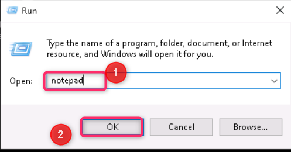

6.  메모장에 다음 텍스트를 입력하세요:

> Name,Birthdate,StreetAddress,EmployeeID
>
> Patti Fernandez,01.06.1980,1Main Street,CSO123456
>
> Christie Cline,31.01.1985,2Secondary Street,CSO654321
>
> 

7.  File을 선택하고 Save As:를 이용해 EmployeeData.csv로 저장하세요.

8.  **Save as type:** 드롭다운에서 **All Files (*.*)**를 선택하세요.

9.  **Encoding** 필드에서 **UTF-8**이 선택되어 있는지 확인한 후 **Save** 버튼을 클릭하세요.

> 

10. 메모장 창을 닫으세요.

11. 작업 표시줄의 **Windows** **아이콘**을 마우스 오른쪽 버튼으로 클릭하고 **Windows PowerShell (Admin)** 을 선택해 관리자 권한으로 실행하세요.

> 

12. **User Account Control** 대화 상자에서 **Yes** 버튼을 클릭하세요.

> 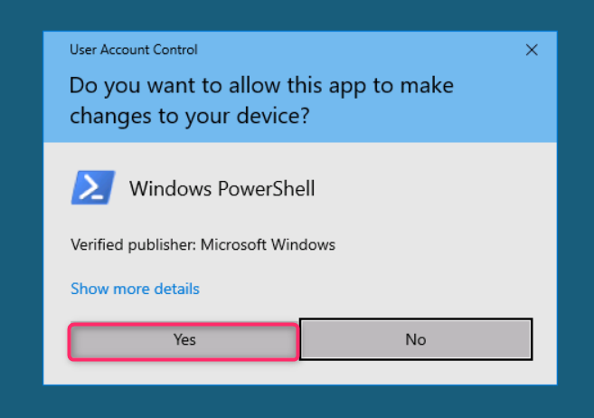

13. EDM Upload Agent 디렉터리로 이동하세요:

> cd "C:\Program Files\Microsoft\EdmUploadAgent"
>
> 

14. 다음 cmdlet을 실행해 데이터베이스를 테넌트에 업로드할 수 있도록 계정으로 인증하세요:

> .\EdmUploadAgent.exe /Authorize
>
> 

15. **Pick an account** 창이 표시되면, 사용자 이름 **PattiF@TenantName**과 리소스 탭에 제공된 사용자 비밀번호(또는 새로 재설정한 비밀번호)를 사용해 **Patti Fernandez** 계정으로 로그인하세요.

> 
>
> 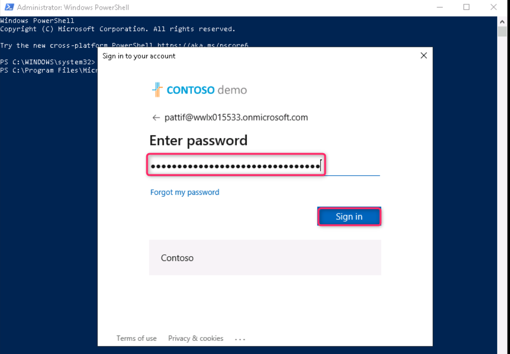

16. PowerShell에서 다음 스크립트를 실행하여 EDM 기반 분류 민감 정보 유형의 데이터베이스 스키마 정의를 다운로드하세요:

> .\EdmUploadAgent.exe /SaveSchema /DataStoreName employeedb /OutputDir "C:\Users\Admin\Documents\\
>
> **참고**: 마지막 명령이 실패할 경우, **EDM_DataUploaders** 그룹 멤버십이 적용되는 데 시간이 걸릴 수 있습니다. 스키마 파일을 다운로드할 수 있기까지 최대 1시간이 소요될 수 있습니다. 명령이 실패하면 다음 실습으로 진행한 후, 나중에 이 단계를 다시 수행하거나 VM의 Documents 폴더 경로를 확인하세요.
>
> 

17. PowerShell에서 다음 스크립트를 실행하여 데이터베이스 파일을 해시 처리(Hash)하고 EDM 기반 분류 민감 정보 유형에 업로드하세요:

.\EdmUploadAgent.exe /UploadData /DataStoreName employeedb /DataFile C:\Users\Admin\Documents\EmployeeData.csv /HashLocation "C:\Users\Admin\Documents\\ /Schema "C:\Users\Admin\Documents\employeedb.xml"

\

\*\*Note:\*\* If you get the following errors

Error Type: System.IO.FileNotFoundException

Error Message: Unable to find the specified file.

\*\*Check the path where you saved the file EmployeeData.csv\*\*

\

19. 업로드 진행 상태가 Completed로 변경될 때까지 확인한 후, 다음 PowerShell 명령을 실행하세요:

> .\EdmUploadAgent.exe /GetSession /DataStoreName employeedb
>
> 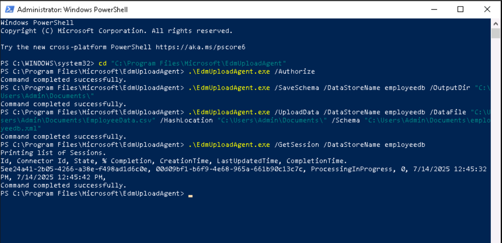

EDM 기반 분류 민감 정보 유형을 위해 데이터베이스 파일을 성공적으로 해시 처리하고 업로드했습니다.

**연습 4 – 키워드 사전 생성**

사용자가 동료의 병가 소식을 확인한 후 이메일을 발송할 때, 개인 정보가 유출되는 사례가 여러 번 발생했습니다. 그 과정에서 질병이나 병명 등의 민감 정보가 외부로 전송되기도 했습니다. 이러한 상황이 발생하지 않도록 사전에 방지할 필요가 있습니다.

1.  **Microsoft Edge**에서 **New InPrivate Window**를 열고, https://purview.microsoft.com으로 이동한 후, 사용자 이름 **PattiF@TenantName**과 리소스 탭에서 제공된 사용자 비밀번호를 사용해 **Patti Fernandez** 계정으로 로그인하세요.

2.  왼쪽 탐색 메뉴에서 **Solutions** \> **Data Loss Prevention**을 선택하세요.

> 

3.  왼쪽 메뉴에서 **Classifiers**를 선택하세요. 하위 탐색 메뉴에서 **Sensitive info types**를 선택한 후, **+Create sensitive info type**을 선택해 새 민감 정보 유형 생성 마법사를 여세요.

> 

4.  **Name your sensitive info type** 페이지에서 다음 정보를 입력하세요:

    - Name: Contoso Diseases List

    - Description: List of possible diseases of employees.

> 

5.  **Next**를 선택하세요.

6.  **Define patterns for this sensitive info type** 페이지에서 **+ Create pattern**을 선택하세요.

> 

7.  **Primary element** 아래 드롭다운 필드를 선택하고 **Keyword dictionary**를 선택하세요.

> 

8.  **Add a keyword dictionary** 페이지에서 이름을 Diseases Dictionary\*로 입력하세요.

9.  **Keywords** 영역에 다음 키워드를 각각 한 줄씩 입력하세요:

> flu
>
> influenza
>
> cold
>
> bronchitis
>
> otitis
>
> 

10. **Done**을 선택하세요.

11. **Supporting elements** 아래에서 **+ Add supporting elements or group of elements** 드롭다운을 선택하고, **keyword list**를 선택해 키워드 사전에 추가 지원 요소를 추가하세요.

> 

12. **Add a keyword list** 페이지에서 **ID** 필드에 Employee를 입력하세요. **Case insensitive** 상자에 다음 키워드를 각각 한 줄씩 입력한 후 **Done** 버튼을 클릭하세요:

> Employee ID
>
> leave
>
> reason
>
> 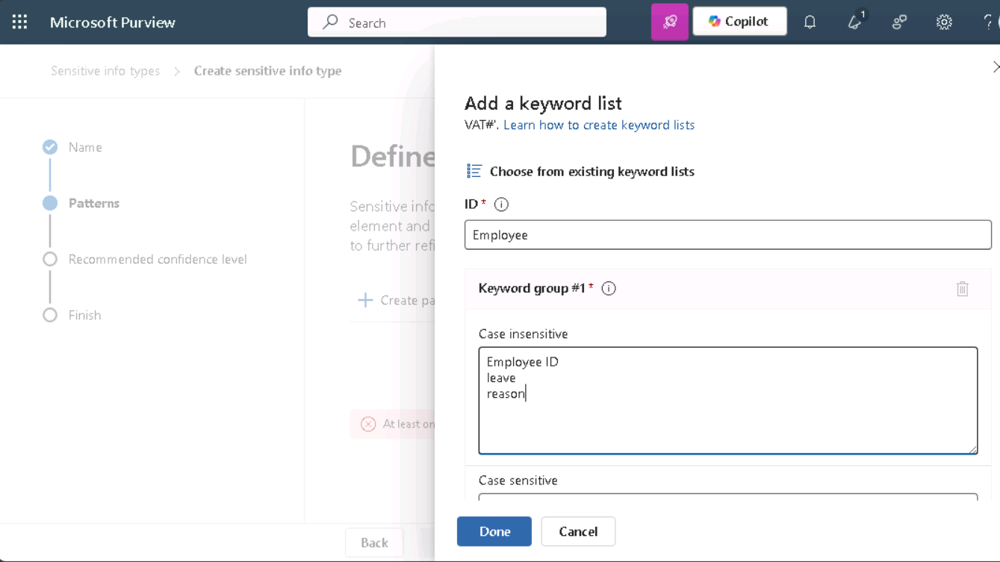

13. **New pattern** 페이지에서 구성을 검토한 후 **Create**를 선택하세요.

> 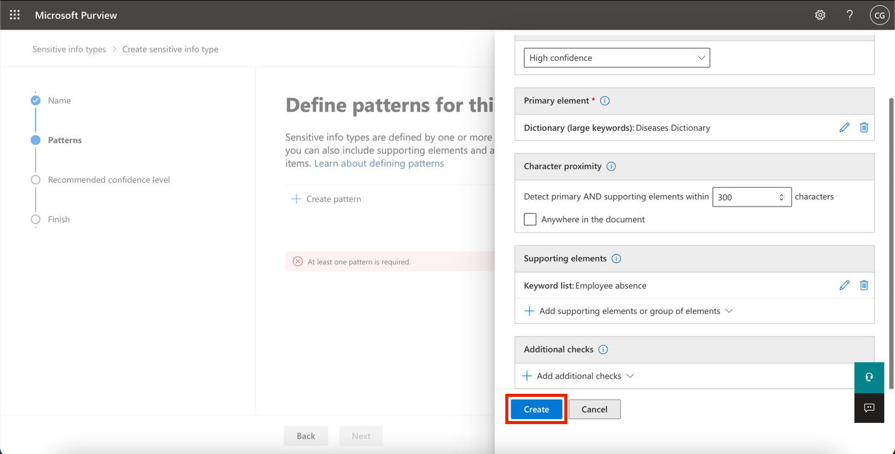

14. **Define patterns for this sensitive info type**에서 **Next**를 선택하세요.

> 

15. **Choose the recommended confidence level to show in compliance policies**에서 기본값을 그대로 유지하고 **Next**를 선택하세요.

> 

16. **Review settings and finish** 페이지에서 설정을 검토한 후 **Create**를 선택하세요. 프로세스가 완료되면 **Done**을 선택하세요.

> 

17. Microsoft Purview 포털이 열려 있는 브라우저 창을 그대로 두세요.

키워드 사전을 기반으로 새로운 민감 정보 유형을 성공적으로 생성하고, 오탐 비율을 줄이기 위해 추가 키워드를 추가했습니다. 다음 작업으로 진행하세요.

**연습 5 – 맞춤형 민감 정보 유형 활용**

맞춤형 민감 정보 유형은 정책에 적용하기 전에 항상 테스트해야 합니다. 테스트하지 않고 사용하면, 맞춤형 검색 패턴 오류로 인해 데이터 손실 또는 유출이 발생할 수 있습니다.

1.  Windows 아이콘을 마우스 오른쪽 버튼으로 클릭하고, **Run**을 선택하세요. **Run** 대화 상자에 +++notepad+++를 입력한 후 **OK** 버튼을 클릭하세요.

> 
>
> 

2.  메모장창에 다음 텍스트를 입력하세요:

> Employee Patti Fernandez with Employee ID ABC123456 is on leave because of the flu/influenza

3.  **File**을 선택하고Save As로 SickTestData을 저장한 후, **Save**를 클릭하세요.

4.  **메모장** 창을 닫으세요.

5.  I**Microsoft Edge**에서 Microsoft Purview 포털 탭이 열려 있어야 합니다. 열려 있다면 해당 탭을 선택하고 다음 단계로 진행하세요. 만약 닫았다면, 새 탭을 열고 https://purview.microsoft.com으로 이동한 후, 사용자 이름 **PattiF@TenantName**과 리소스 탭에 제공된 비밀번호를 사용해 **Patti Fernandez** 계정으로 로그인하세요.

6.  왼쪽 탐색 메뉴에서 **Solutions** \> **Data Loss Prevention**을 선택한 후, **Classifiers** 아래의 **Sensitive info types**를 선택하세요. 오른쪽 상단의 **Search** 상자에 Contoso 를 입력하고 Enter 키를 누른 다음, **Contoso Employee IDs**를 클릭해 오른쪽 창을 여세요.

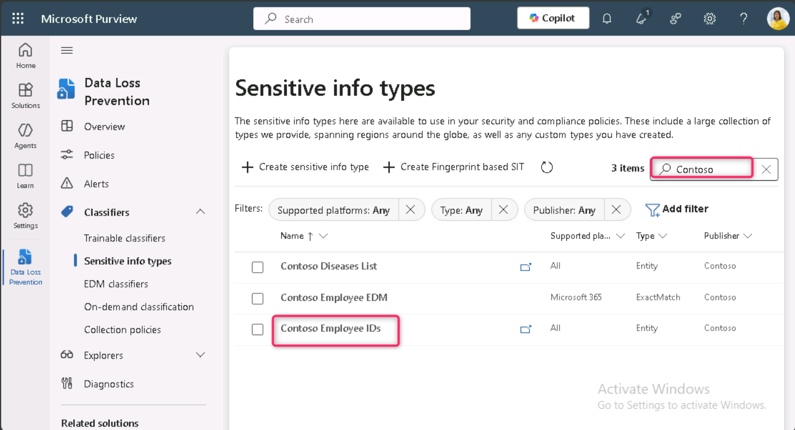

7.  오른쪽 창에서 **Test**를 선택하세요.

> 

8.  **Upload file to test** 페이지에서 **Upload file**을 선택하세요.

> 

9.  왼쪽 창에서 **Documents**를 선택하고, **SickTestData** 파일을 선택한 후 **Open**을 선택하세요.

> 

10. **Test**를 선택해 분석을 시작하세요.

> 

11. **Match results** 페이지에서 발견된 일치 항목을 검토하세요.

> 

12. **Finish**를 선택하고 **X** 버튼을 클릭해 테스트 페이지를 닫으세요.

> 

13. **Data classification** 페이지로 돌아가 **Contoso Diseases List**라는 이름의 Sensitive Information Type을 선택하세요.

14. 오른쪽 창에서 **Test**를 선택하세요.

> 

15. **Upload file to test** 페이지에서 **Upload file**을 선택하세요.

> 

16. 왼쪽 창에서 **Documents**를 선택하고, *SickTestData* 파일을 선택한 후 **Open**을 선택하세요.

17. **Test**를 선택해 분석을 시작하세요.

> 

18. **Match results** 페이지에서 발견된 일치 항목을 검토하세요. 검토가 완료되면 **Finish**를 선택하세요.

> 

**요약:**

이 실습에서는 정규식, 키워드 사전, Exact Data Match(EDM) 기법을 사용해 Microsoft Purview에서 맞춤형 민감 정보 유형(SIT)을 생성하고 테스트하는 방법을 학습했습니다. 이를 통해 민감 데이터를 보다 정확하게 식별하고 조직의 데이터 손실 방지(DLP) 기능을 강화할 수 있습니다.
