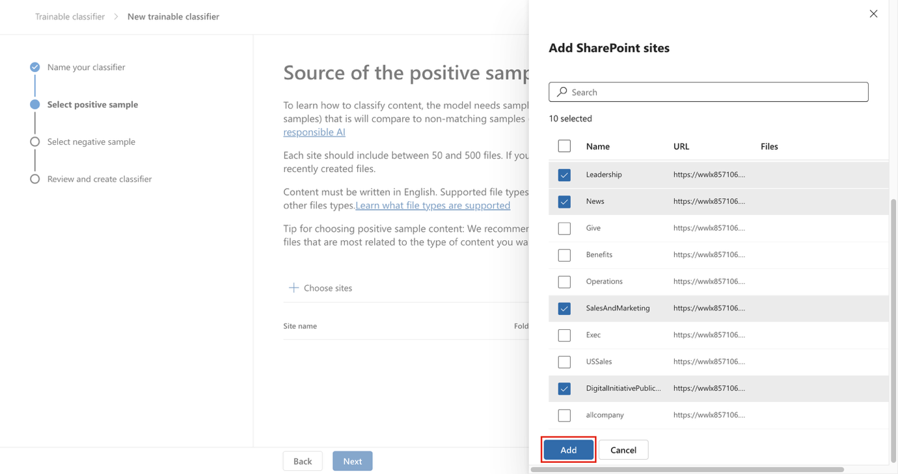
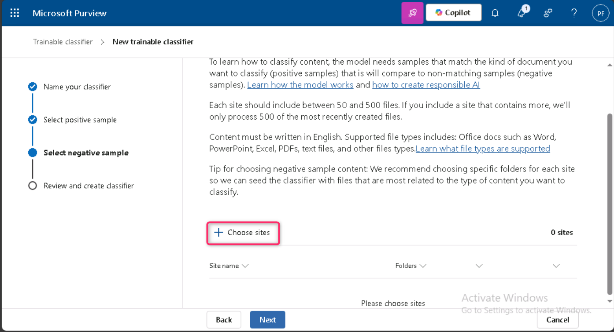

**실습 3 – 학습 가능한 분류기 관리**

**소개**

Contoso Ltd. 테넌트에는 “Sales and Marketing”라는 이름의 SharePoint 사이트 컬렉션이 있으며, 향후 재무 관련 문서와 보고서를 저장하는 용도로 사용될 예정입니다. 이러한 문서의 특성상, 파일을 자동으로 식별하고 적절히 분류·레이블링할 수 있는 학습 가능한 분류기가 필요합니다. 본 실습에서는 맞춤형 학습 가능한 분류기를 활성화하고, 새로운 분류기를 생성하여 문서를 효과적으로 인식하고 분류하는 방법을 학습합니다.

**목표**

- 선택한 SharePoint 사이트에 저장된 일반적인 데이터를 식별하고 분류하기 위한 학습 가능한 분류기 생성

**연습 1 – 학습 가능한 분류기 생성**

이 작업에서는 Patti가 새로운 학습 가능한 분류기를 생성하고, Contoso Ltd.에서 생성·저장되는 일반적인 데이터를 식별하기 위해 여러 SharePoint 사이트를 선택합니다.

1.  **Microsoft Edge**에서 **New InPrivate Window**를 열고, **+++[<u>https://purview.microsoft.com+++</u>](https://purview.microsoft.com+++)** 으로 이동한 후 사용자 이름 [**<u>PattiF@WWLxXXXXXX.onmicrosoft.com</u>**](mailto:PattiF@WWLxXXXXXX.onmicrosoft.com) 과 리소스 탭에 제공된 사용자 비밀번호를 사용해 **Patti Fernandez** 계정으로 로그인하세요.

2.  왼쪽 탐색 메뉴에서 **Solutions** \> **Data Loss Prevention**을 선택하세요.

> 

3.  왼쪽 창에서 **Classifiers**를 확장하세요. 하위 탐색 메뉴에서 **Trainable Classifiers**를 선택한 후, **+ Create trainable classifier**를 선택해 새 분류기를 생성하세요.

> 

4.  다음 정보를 입력하세요:

5.  Name: **+++Contoso Company Data+++**

6.  Description: **+++Trainable classifier for company data produced and stored by Contoso Ltd.+++**

7.  **Next**를 선택하세요.

> 

8.  **Choose sites**를 선택해 오른쪽 창을 여세요.

> 

9.  다음 SharePoint 사이트를 선택한 후 **Add**를 선택하세요.

    - Brand

    - Digital Initiative Public Relations

    - Work

    - Sales and Marketing

    - Mark 8 Project Team

> 

10. 선택한 사이트가 목록에 표시될 때까지 기다린 후 **Next**를 선택하세요.

> 

11. **Source of the negative sample content 페이지**에서**+ Choose sites**를 클릭하세요.

> 

12. **Add SharePoint sites** 창에서 **Learn** 옆의 체크박스를 선택한 후 **Add** 버튼을 클릭하세요.

> 

13. **Next** 버튼을 클릭하세요.

> 

14. 설정을 검토한 후 **Create trainable classifier**를 선택하세요.

> 

15. **Your trainable classifier is being trained** 페이지에서 **Done** 버튼을 클릭하세요.

> 

선택한 SharePoint 사이트에 있는 문서와 파일이 현재 분석 중이며, 이 과정은 최대 24시간이 소요될 수 있습니다.

**요약:**

이 실습에서는 Microsoft Purview에서 *Contoso Company Data*라는 이름의 학습 가능한 분류기를 생성하고, 관련 SharePoint 사이트를 긍정 및 부정 콘텐츠 소스로 선택했습니다. 이 분류기는 회사 고유의 데이터를 식별하기 위해 문서를 분석하며, 학습에는 최대 24시간이 소요될 수 있습니다.
