**실습 4 – 민감도 레이블 생성 및 관리**

**소개**

Contoso Ltd.의 정보 보안 관리자 Patti Fernandez는 조직 전반의 데이터 보호를 강화하기 위해 최신 민감도 레이블링 프레임워크를 배포하고 있습니다. Patti는 암호화, 자동 레이블링, 이중 키 암호화(DKE)를 포함하여 콘텐츠를 분류하고 보호하기 위한 민감도 레이블 그룹과 레이블을 생성하고 게시합니다. 또한 Microsoft Purview를 Microsoft Defender for Cloud Apps와 통합하여, 클라우드 위치에 저장된 파일까지 데이터 보호 제어를 확장할 예정입니다.

**목표:**

- 민감도 레이블 지원 활성화

- 레이블 그룹 생성

- 하위 레이블 생성

- 레이블 게시

- 자동 레이블링 구성

- 기밀 콘텐츠를 위한 DKE 레이블 생성 및 게시

- Defender for Cloud Apps에서 Microsoft Purview 통합 활성화

- 외부 공유 파일에 레이블을 적용하기 위한 파일 정책 생성

**연습 1 – 민감도 레이블 지원 활성화**

이 작업에서는 민감도 레이블에 대한 공동 작성 기능을 활성화하며, 이를 통해 SharePoint 및 OneDrive 파일에 민감도 레이블을 적용할 수 있습니다.

1.  **Admin** 계정을 사용해 VM에 로그인되어 있어야 합니다.

2.  **Microsoft Edge**를 열고 https://purview.microsoft.com으로 이동한 후, **Patti Fernandes** 계정으로 Microsoft Purview에 로그인하세요.

3.  왼쪽 탐색 메뉴에서 **Settings \> Information Protection**을 선택하세요.

> 

4.  **Information Protection** 설정 페이지에서 **Co-authoring for files with sensitivity labels** 탭이 선택되어 있는지 확인하세요.

5.  **Turn on co-authoring for files with sensitivity labels** 체크박스를 선택하세요.

> 

6.  화면 하단에서 **Apply**를 선택하세요.

> 

SharePoint 및 OneDrive 파일에 대한 민감도 레이블 지원을 성공적으로 활성화했습니다.

**연습 2 – 민감도 레이블 활용**

**작업 1 – 레이블 그룹 생성**

이 작업에서는 내부 민감도 레이블을 정리하기 위해 레이블 그룹을 생성합니다. 레이블 그룹은 부서나 비즈니스 단위 분류와 같이 관련 레이블을 컨테이너로 묶는 역할을 합니다.

1.  **Microsoft Edge**를 열고 https://purview.microsoft.com으로 이동하세요.

2.  Microsoft Purview 포털에서 왼쪽 사이드바에서 **Solutions**를 선택한 후, **Information Protection**을 선택하세요.

> 

3.  **Microsoft Information Protection** 페이지에서 왼쪽 사이드바에서 **Sensitivity labels**를 선택하세요.

> 

4.  **Sensitivity labels** 페이지에서 **+ Create \> Label group**을 선택하세요.

> 

5.  **New label group** 구성이 시작됩니다. **Provide basic details for this label group**에서 다음 정보를 입력하세요:

    - **Name**: Internal

    - **Display name**: Internal

    - **Description for users**: Internal sensitivity label.

    - **Description for admins**: Internal sensitivity label group for Contoso.

6.  **Next**를 선택하세요.

> 

7.  **Review your settings and finish** 페이지에서 **Create label group**을 선택하세요.

> 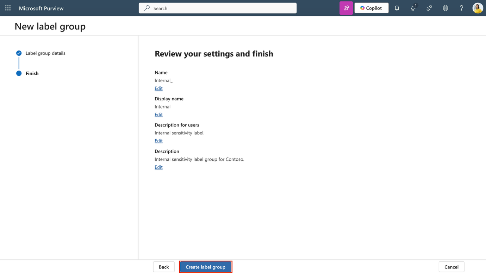

8.  **Your label group was created successfully** 페이지에서 **Don't create a label yet**를 선택한 후 **Done**을 선택하세요.

> 

내부 사용을 위한 레이블 그룹을 생성했습니다. 이 그룹은 특정 부서나 데이터 범주와 관련된 레이블을 관리하는 데 도움을 줍니다.

**작업 2 – 하위 레이블 생성**

레이블 그룹을 생성했으므로, 이제 HR 관련 콘텐츠를 위한 하위 레이블을 추가합니다.\
이 레이블은 암호화 및 콘텐츠 표시를 적용해 HR 데이터를 무단 접근으로부터 보호합니다.

1.  **Sensitivity labels** 페이지에서 **Internal** 민감도 레이블 그룹을 찾습니다. 해당 그룹 옆의 세로 점 3개(...)를 선택한 후, 드롭다운 메뉴에서 **+ Create label in group**을 선택하세요.

> 

2.  **New sensitivity label** 마법사가 시작됩니다. **Provide basic details for this label** 페이지에서 다음 정보를 입력하세요:

    - **Name**: Employee data (HR)

    - **Display name**: Employee data (HR)

    - **Description for users**: This HR label is the default label for all specified documents in the HR Department.

    - **Description for admins**: This label is created in consultation with Ms. Jones (Head of the HR department). Contact her if you need to change the label settings.

3.  **Next**를 선택하세요.

> 

4.  **Define the scope for this label** 페이지에서 **Files** 및 **Emails**를 선택하세요. **Meetings** 체크박스가 선택되어 있다면 선택 해제하세요.

5.  **Next**를 선택하세요.

> 

6.  **Choose protection settings for labeled items** 페이지에서 **Control access** 및 **Apply content marking** 옵션을 선택한 후 **Next**를 선택하세요.

> 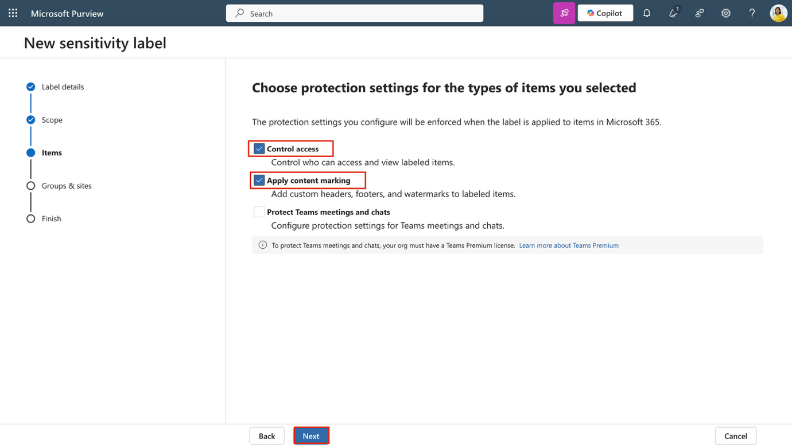

7.  **Access control** 페이지에서 **Configure access control settings**를 선택하세요.

8.  다음 옵션으로 암호화 설정을 구성하세요:

    - **Assign permissions now or let users decide?**: Assign permissions now

    - **User access to content expires**: Never

    - **Allow offline access**: Only for a number of days

    - **Users have offline access to the content for this many days**: 15

    - **Assign permissions** 링크를 선택하세요. **Assign permissions** 플라이아웃 패널에서 **+ Add any authenticated users**를 선택한 후 **Save**를 선택해 설정을 적용하세요.

9.  **Access control** 페이지에서 **Next**를 선택하세요.

> 

10. **Content marking** 페이지에서 토글을 선택해 **Content marking**을 활성화하세요.

> 

11. 다음 각 마킹 유형(marking types)에 대해 체크박스를 선택한 후, 편집 아이콘을 선택해 텍스트를 입력하세요:

| **Marking type** | **Text**             |
|------------------|----------------------|
| Add a watermark  | INTERNAL USE ONLY    |
| Add a header     | Internal Document    |
| Add a footer     | Contoso Confidential |

12. **Next**를 선택하세요.

> 

13. **Auto-labeling for files and emails** 페이지에서 **Next**를 선택하세요.

> 

14. **Define protection settings for groups and sites** 페이지에서 **Next**를 선택하세요.

> 

15. **Review your settings and finish** 페이지에서 **Create label**을 선택하세요.

> 

16. **Your sensitivity label was created** 페이지에서 **Don't create a policy yet**를 선택한 후 **Done**을 선택하세요.

> 

Internal 레이블 그룹 내에 하위 레이블(child label)을 생성했습니다. 이 레이블은 HR 문서에 암호화와 콘텐츠 표시를 적용해 민감 데이터를 쉽게 식별하고 정책에 따라 보호할 수 있도록 합니다.

**작업 3 – 레이블 게시**

다음으로, Internal 레이블 그룹의 HR 레이블을 게시해 HR 부서 사용자가 문서에 해당 레이블을 적용할 수 있도록 합니다.

1.  **Microsoft Edge**에서 Microsoft Purview 포털 탭이 열려 있어야 합니다.\
    열려 있지 않다면, https://purview.microsoft.com \> **Solutions** \> **Information Protection** \> **Sensitivity labels**로 이동하세요.

2.  **Sensitivity labels** 페이지에서 **Publish labels**를 선택하세요.

> 

3.  Publish sensitivity labels 구성이 시작됩니다.

4.  **Choose sensitivity labels to publish** 페이지에서 **Choose sensitivity labels to publish** 링크를 선택하세요.

> 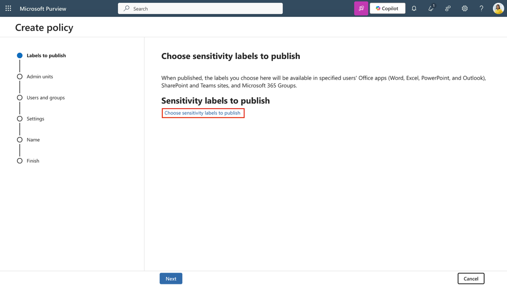

5.  **Sensitivity labels to publish** 플라이아웃 패널에서 **Internal/Employee data (HR)** 체크박스를 선택한 후, 플라이아웃 하단의 **Add**를 선택하세요.

> 

6.  **Choose sensitivity labels to publish** 페이지로 돌아가 **Next**를 선택하세요.

> 

7.  **Assign admin units** 페이지에서 **Next**를 선택하세요.

> 

8.  **Publish to users and groups** 페이지에서 **Next**를 선택하세요.

> 

9.  **Policy settings** 페이지에서 **Next**를 선택하세요.

> 

10. **Default settings for documents**에서 **Next**를 선택하세요.

> 

11. **Default settings for emails**에서 **Next**를 선택하세요.

> 

12. **Default settings for meetings and calendar events**에서 **Next**를 선택하세요.

> 

13. **Default settings for meetings and calendar events**에서 **Next**를 선택하세요.

> 

14. **Name your policy** 페이지에서 다음 정보를 입력하세요:

    - **Name**: Internal HR employee data

    - **Enter a description for your sensitivity label policy**: This HR label is to be applied to internal HR employee data.

15. **Next**를 선택하세요.

> 

16. **Review and finish** 페이지에서 **Submit**를 선택하세요.

> 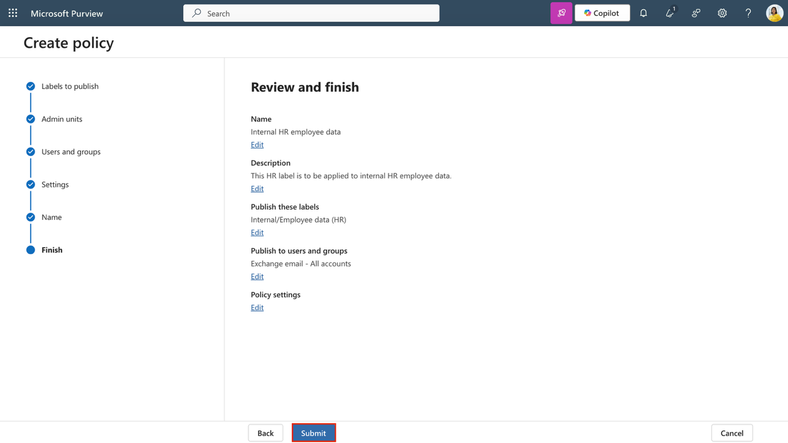

17. **New policy created** 페이지에서 **Done**을 선택해 레이블 정책 게시를 완료하세요.

> 

Internal 레이블 그룹과 그 하위 HR 레이블을 게시하여 사용자가 HR 문서에 적용할 수 있도록 했습니다. 정책이 서비스 전반에 적용되는 데 최대 24시간이 소요될 수 있습니다.

**작업 4 – 자동 레이블링 구성**

1.  Microsoft Purview 포털에서 **Solutions \> Information Protection \> Sensitivity labels**를 선택하세요.

2.  **Sensitivity labels** 페이지에서 **Internal** 민감도 레이블을 찾으세요. 해당 레이블 옆의 세로 점 3개(...)를 선택한 후, 드롭다운 메뉴에서 **+ Create label in group**을 선택하세요.

> 

3.  **Provide basic details for this label** 페이지에서 다음 정보를 입력하세요:

| **Details** | **Text** |
|----|----|
| **Name** | Financial Data |
| **Display name** | Financial Data |
| **Description for users** | This content contains financial data that must be labeled and protected. |
| **Description for admins** | This label is used for content that includes sensitive financial identifiers. |

4.  **Next**를 선택하세요.

> 

5.  **Define the scope for this label** 페이지에서 **Files** 및 **Emails**를 선택하세요. **Meetings** 체크박스가 선택되어 있다면 선택 해제하세요.

6.  **Next**를 선택하세요.

> 

7.  **Choose protection settings for labeled items** 페이지에서 **Next**를 선택하세요.

> 

8.  **Auto-labeling for files and emails** 페이지에서 **Auto-labeling for files and emails**를 켜짐으로 설정하세요.

> 

9.  In the **Detect content that matches these conditions** 섹션에서 **+ Add condition** \> **Content contains**를 선택하세요.

> 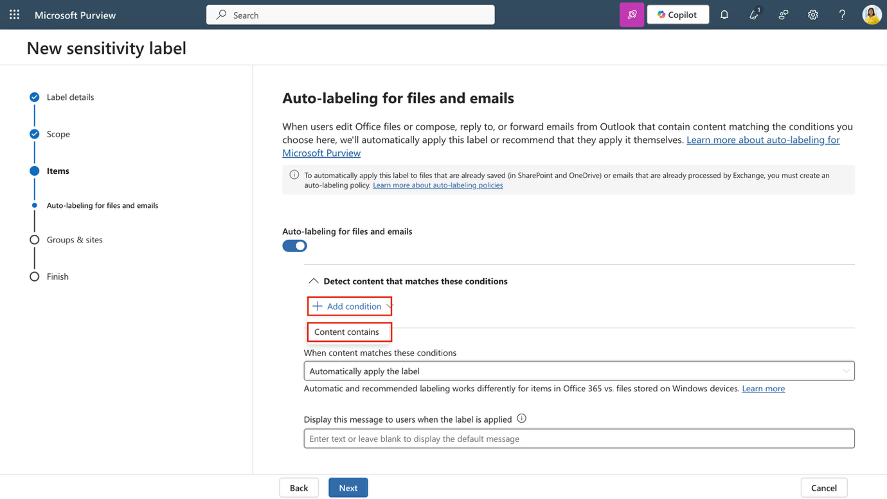

10. **Content contains** 섹션에서 **Add** \> **Sensitive info types**를 선택하세요.

> 

11. **Sensitive info types** 플라이아웃 페이지에서 다음 민감한 정보 유형을 검색해 선택하세요:

    - Credit Card Number

    - ABA Routing Number

    - SWIFT Code

12. **Add**를 선택하세요.

> 

13. **Auto-labeling for files and emails** 페이지로 돌아와 **Next**를 선택하세요.

> 

14. **Define protection settings for groups and sites** 페이지에서 **Next**를 선택하세요.

> 

15. **Review your settings and finish** 페이지에서 **Create label**을 선택하세요.

> 

16. **Your sensitivity label was created** 페이지에서 **Automatically apply label to sensitive content**를 선택한 후, **Done**을 선택하세요.

> 

17. **Create auto-labeling policy** 플라이아웃 페이지에서 **Review policy**를 선택하세요.

> 

18. **Name your auto-labeling policy** 페이지에서 기본값을 그대로 두고 **Next**를 선택하세요.

> 

19. **Choose a label to auto-apply** 페이지에서 *Internal/Financial Data* 라벨이 선택되어 있는지 확인한 후, **Next**를 선택하세요.

> 

20. **Assign admin units** 페이지에서 **Next**를 선택하세요.

> 

21. **Choose locations where you want to apply the label** 페이지에서 다음 옵션을 선택하세요:

    - Exchange email

    - SharePoint sites

    - OneDrive accounts

22. **Next**를 선택하세요.

> 

23. **Set up common or advanced rules** 페이지에서 기본값인 **Common rules**를 그대로 두고 **Next**를 선택하세요.

> 

24. **Define rules for content in all locations** 페이지에서 *Financial Data rule*을 확장하여 예상된 규칙들이 정의되어 있는지 확인한 후, **Next**를 선택하세요.

> 

25. **Additional settings for email** 페이지에서 **Next**를 선택하세요.

> 

26. **Decide if you want to test out the policy now or later** 페이지에서 **Run policy in simulation mode**를 선택하고, **Automatically turn on policy if not modified after 7 days in simulation** 체크박스를 선택하세요.

> 

27. **Next**를 선택하세요.

> 

- **Review and finish** 페이지에서 **Create policy**를 선택하세요.

> 

28. **Your auto-labeling policy was created** 페이지에서 **Done**을 선택하세요.

재무 데이터에 대한 하위 라벨을 생성하고, 재무 정보를 포함하는 콘텐츠를 감지해 자동으로 라벨링하는 정책을 구성했습니다.

**작업 5 – 기밀 콘텐츠용 DKE 라벨 생성 및 게시**

다음으로, Internal 그룹에 하위 라벨을 생성하여 이중 키 암호화(DKE)와 동적 워터마킹을 사용해 기밀 법률 콘텐츠를 보호할 것입니다.

1.  **Microsoft Edge**에서 https://purview.microsoft.com으로 이동하여 **Patti Fernandes** 계정으로 Microsoft Purview 포털에 로그인하세요.

2.  Microsoft Purview 포털에서 **Solutions \> Information Protection \> Sensitivity labels**를 선택하세요.

3.  **Sensitivity labels** 페이지에서 **Internal** 민감도 라벨 그룹을 찾으세요. 세로 점 3개 (**…**)를 선택한 후, 드롭다운 메뉴에서 **+ Create label in group**을 선택하세요.

> 

4.  **Provide basic details for this label** 페이지에서 다음 정보를 입력하세요:

| **Details** | **Text** |
|----|----|
| **Name** | Confidential Legal |
| **Display name** | Confidential Legal |
| **Description for users** | Use this label for highly sensitive legal content that must be encrypted using Double Key Encryption. |
| **Description for admins** | Label configured with DKE and dynamic watermarking for highly sensitive legal content. |

5.  **Next**를 선택하세요.

> 

6.  **Define the scope for this label** 페이지에서 **Files and Emails**를 선택합니다. **Meetings** 체크박스가 선택되어 있다면 선택을 해제한 후, **Next**를 선택하세요.

> 

7.  **Choose protection settings for the types of items you selected** 페이지에서 **Control access**를 선택한 후, **Next**를 선택하세요.

> 

8.  **Access control** 페이지에서 **Configure access control settings**를 선택하세요.

> 

9.  다음 옵션을 사용해 암호화 설정을 구성하세요:

    - **Assign permissions now or let users decide?**: Assign permissions now

    - **User access to content expires**: A number of days after label is applied

    - **Access expires this many days after the label is applied**: 5

    - **Allow offline access**: Never

    - **Assign permissions** 링크를 선택하세요. **Assign permissions** 플라이아웃 패널에서 **+ Add users or groups**를 선택하세요.

> 

- **Add users or groups** 플라이아웃 페이지에서 Legal Team과 Patti Fernandes를 검색하여 선택한 후 **Add**를 선택하세요.

> 

- **Assign permissions** 페이지에서 **Save**를 선택하세요.

> 

10. **Access control** 페이지로 돌아와 **Use dynamic watermarking** 체크박스를 선택한 다음, **Customize text (optional)**를 선택하세요.

> 

11. **Add custom text to watermark (optional)** 페이지에서 Confidential를 입력한 다음 **UPN**과 **Timestamp**를 선택하세요.

12. 플라이아웃 페이지 하단에서 **Save**를 선택하세요.

> 

13. **Access control** 페이지로 돌아와 **Use Double Key Encryption** 체크박스를 선택하고, 이중 키 암호화 서비스 URL로 https://testingdke1.azurewebsites.net/Test를 입력하세요.

14. **Next**를 선택하세요.

> 

15. **Auto-labeling for files and emails** 페이지에서 **Next**를 선택하세요.

> 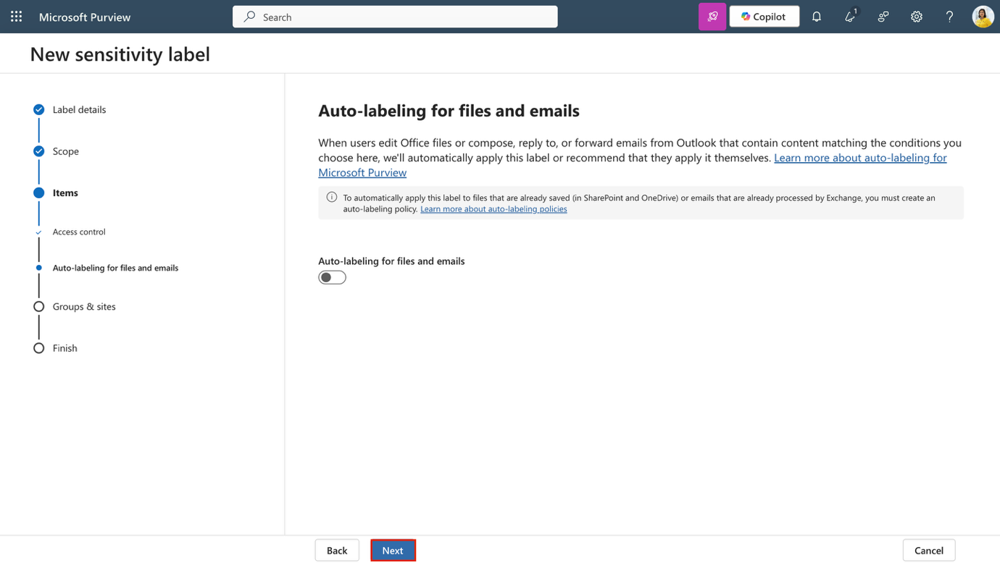

16. **Define protection settings for groups and sites** 페이지에서 **Next**를 선택하세요.

> 

17. **Review your settings and finish** 페이지에서 **Create label**을 선택하세요.

> 

18. **Your sensitivity label was created** 페이지에서 **Publish label to users' apps**를 선택한 다음, **Done**을 선택하세요.

> 

19. **Publish label** 플라이아웃 페이지에서 **Create new label policy**를 선택하세요.

> 

20. **Choose sensitivity labels to publish** 페이지에서 **Choose sensitivity labels to publish**를 선택하고, **Internal/Confidential Legal** 라벨을 추가한 다음 **Add**를 선택하세요.

> 

21. **Next**를 선택하세요.

> 

22. **Assign admin units** 페이지에서 **Next**를 선택하세요.

> 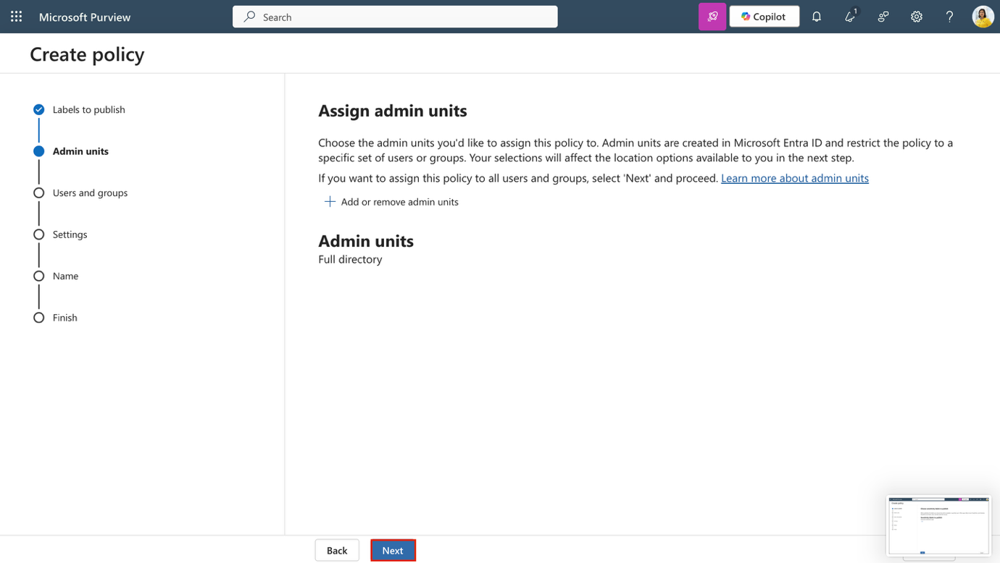

23. **Publish to users and groups** 페이지에서 기본값을 그대로 두고 **Next**를 선택하세요.

> 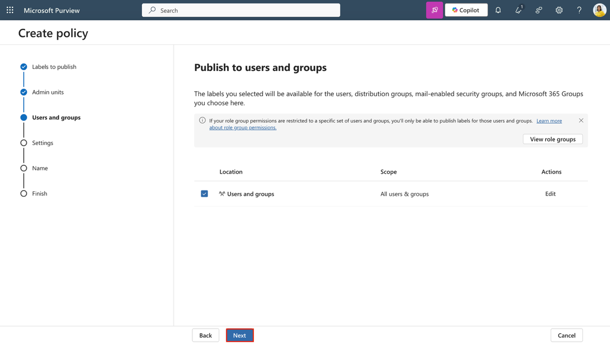

24. **Policy settings** 페이지에서 **Users must provide a justification to remove a label or lower its classification** 체크박스를 선택한 후, **Next**를 선택하세요.

> 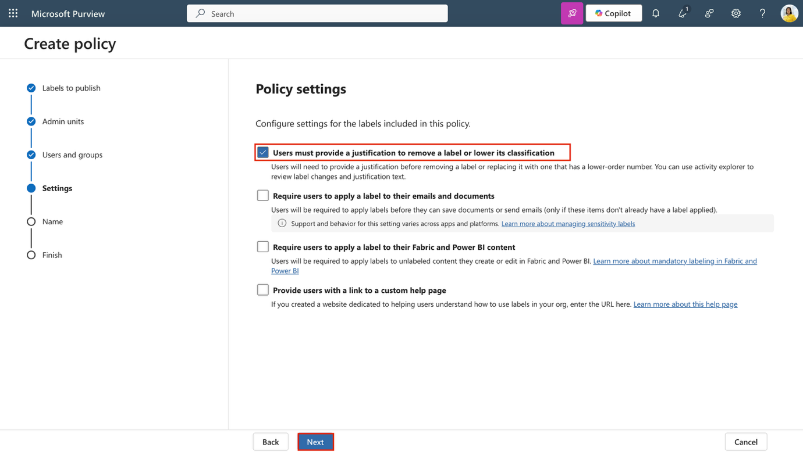

25. **Default settings for documents** 페이지에서 **Next**를 선택하세요.

> 

26. **Default settings for emails** 페이지에서 **Next**를 선택하세요.

> 

27. **Default settings for meetings and calendar events** 페이지에서 **Next**를 선택하세요.

> 

28. **Default settings for Fabric and Power BI content** 페이지에서 **Next**를 선택하세요.

> 

29. **Name your policy** 페이지에서 다음을 입력하세요:

    - **Name**: Confidential Legal

    - **Description**: Enables manual use of the DKE label for confidential content accessible by Legal.

30. **Next**를 선택하세요.

> 

31. **Review and finish** 페이지에서 **Submit**를 선택하세요.

> 

32. **New policy created** 페이지에서 **Done**을 선택하세요.

> 

이제 이중 키 암호화(DKE)와 동적 워터마킹을 사용해 하위 라벨을 생성하고 게시했습니다. 이 라벨은 권한이 있는 사용자만 접근할 수 있도록 제한하며, 분류 등급을 낮출 때에는 정당한 사유를 요구합니다.

**연습 3 – Microsoft Purview를 사용한 파일 정책 만들기**

**작업 1 – Defender for Cloud Apps에서 Microsoft Purview 통합 활성화**

민감도 라벨을 생성하고 게시한 후, 이제 Microsoft Purview를 Microsoft Defender for Cloud Apps와 통합합니다. 이 통합을 통해 Defender는 파일의 민감도 라벨을 검사하고 파일 모니터링을 적용할 수 있습니다.

1.  **Microsoft Edge**를 열고 <https://security.microsoft.com>으로 이동해 **Microsoft Defender**에 접속하세요. 

2.  왼쪽 탐색 메뉴에서 **Settings**를 선택한 다음, **Cloud Apps**를 선택하세요.

> 

3.  왼쪽 창의 **Information Protection** 섹션에서 **Microsoft Information Protection**을 선택하세요.

> 

4.  **Microsoft Information Protection** 페이지에서 페이지에 있는 두 개의 체크박스를 모두 선택하세요.

    - **Automatically scan new files for Microsoft Information Protection sensitivity labels and content inspection warnings**

> Defender for Cloud Apps가 새로 생성되거나 수정된 파일을 Microsoft Purview의 민감도 라벨 및 콘텐츠 검사 경고에 따라 자동으로 스캔하도록 합니다.

- **Only scan files for Microsoft Information Protection sensitivity labels and content inspection warnings from this tenant**

> 스캔을 조직 내에서 생성된 라벨과 경고로만 제한합니다. 외부 테넌트에서 적용된 라벨은 무시됩니다.

5.  **Save**를 선택해 설정을 적용하세요.

> 

6.  왼쪽 창의 **Information Protection** 섹션에서 **Files**를 선택하세요.

> 

7.  **Files** 페이지에서 **Enable file monitoring**을 선택하세요.

> 

8.  **Save**를 선택해 설정을 적용하세요.

> 

이제 Defender for Cloud Apps에서 Microsoft Purview 통합을 활성화했습니다.\
Defender는 이제 민감도 라벨을 감지하고 파일을 모니터링해 정책 평가 및 거버넌스 작업을 수행할 수 있습니다.

**작업 2 – 외부 공유 파일에 라벨 적용을 위한 파일 정책 만들기**

마지막으로, 외부로 공유되는 파일에 자동으로 민감도 라벨을 적용하는 파일 정책을 생성합니다. 이를 통해 조직 외부와 공유되더라도 민감한 콘텐츠가 안전하게 보호되도록 할 수 있습니다.

1.  **Microsoft Defender**에서 **Cloud apps \> Policies \> Policy management**로 이동하세요.

> 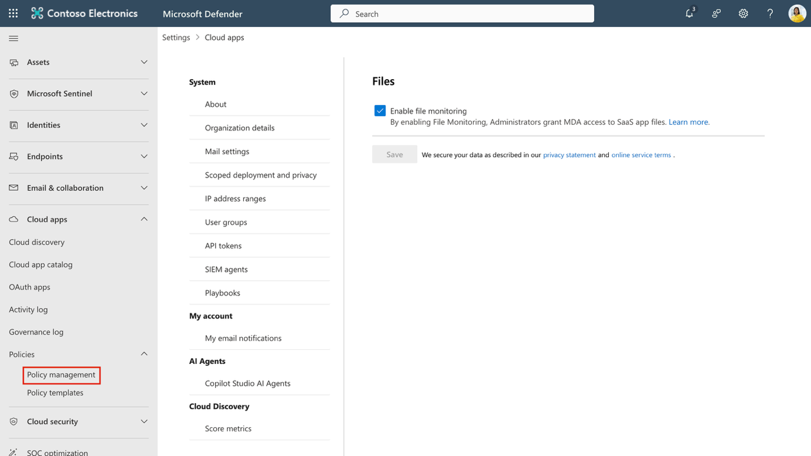

2.  **Information protection** 탭을 선택한 다음, **Create policy \> File policy**를 선택하세요.

> 

3.  **Create file policy** 페이지에서 다음과 같이 구성하세요:

    - **Policy name**: Auto-label externally shared files

    - **Policy severity**: **High**

    - **Category**: **DLP**

    - **Files matching all of the following section** 섹션:

      - 첫 번째 필터: 드롭다운을 **Access level equals external**로 설정

      - 두 번째 필터: 드롭다운을 **Last modified after (date)**로 설정하고, 오늘 날짜를 입력

> 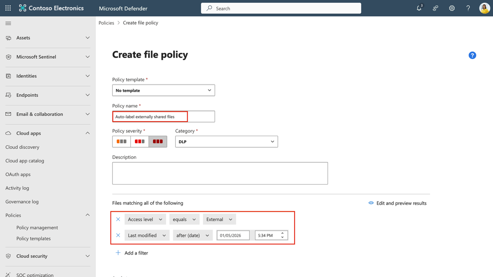

- **Governance actions**에서 **Microsoft OneDrive for Business**를 확장하세요:

  - **Apply sensitivity label** 체크박스를 선택하세요.

  - 드롭다운에서 **Highly Confidential-Specified People**을 선택하세요.

> 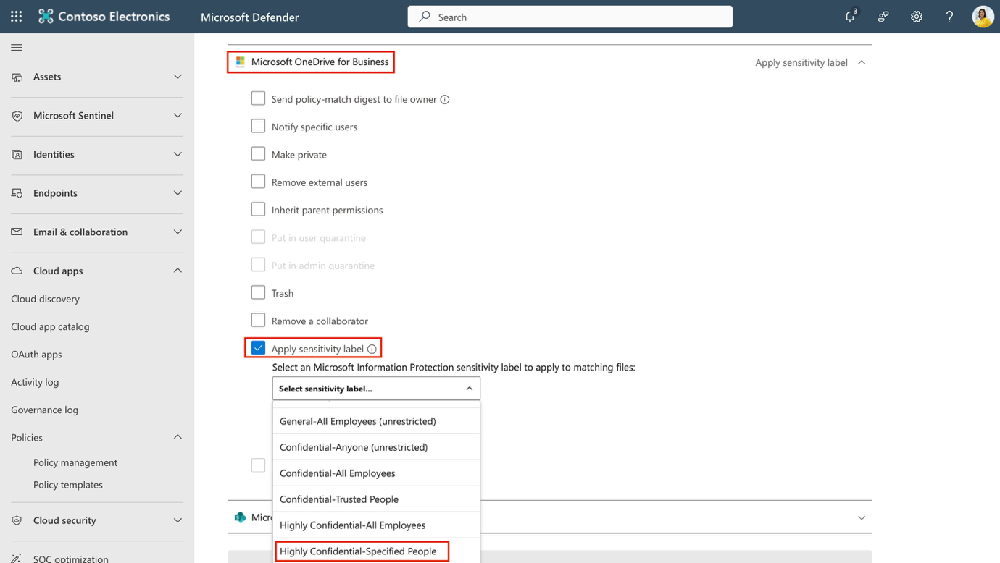

- **Microsoft SharePoint Online**에 대해서도 동일한 작업을 반복하세요.

  - **Apply sensitivity label** 체크박스를 선택하세요.

  - 드롭다운에서 **Highly Confidential-Specified People**을 선택하세요.

> 

4.  **Create**를 선택해 파일 정책 생성을 완료하세요.

> 

외부로 공유되는 파일에 민감도 라벨을 적용하는 파일 정책을 생성했습니다. 이 정책을 통해 클라우드에 저장된 콘텐츠까지 정보 보호 전략을 확장할 수 있습니다.

**요약**

이번 실습에서는 Contoso Ltd.의 시스템 관리자 Patti Fernandez 역할을 맡아 Microsoft Purview Sensitivity Labels를 사용하여 정보 보호를 구현했습니다. PowerShell을 사용해 SharePoint와 Teams에서 민감도 라벨 지원을 활성화하고, Internal 라벨과 HR 전용 하위 라벨을 생성 및 게시한 후, Word 문서와 Outlook 이메일에 해당 라벨을 적용했습니다. 또한 독일 GDPR 관련 콘텐츠를 대상으로 자동 라벨링 민감도 라벨을 생성하고 게시했습니다. 이러한 단계들을 통해 HR 및 규제 관련 문서가 조직 내에서 적절히 분류되고 보호되도록 보장할 수 있습니다.
