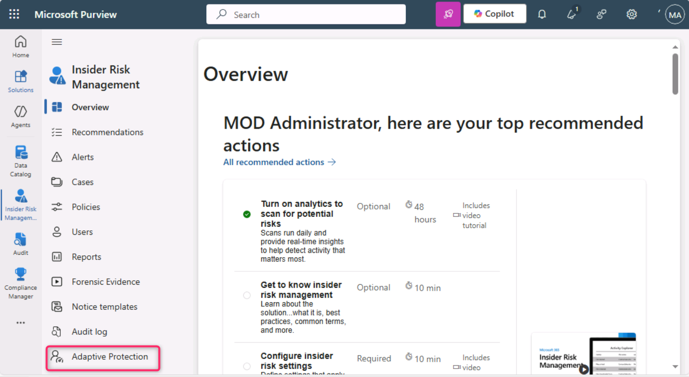
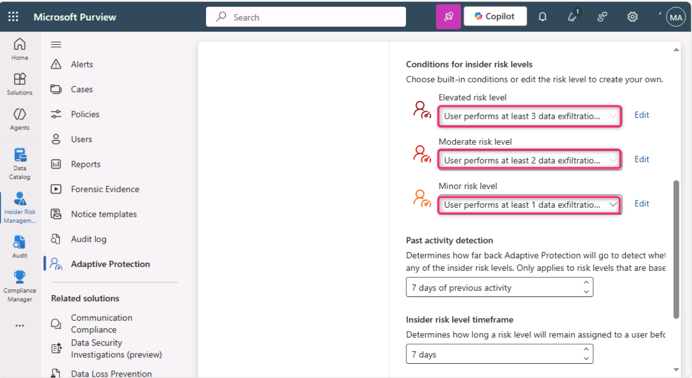
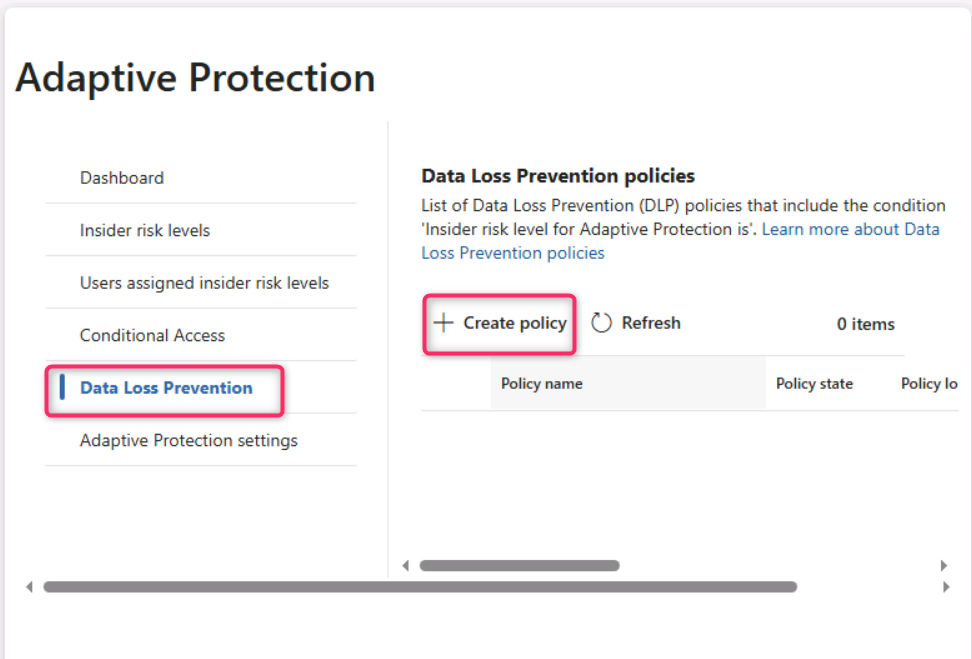
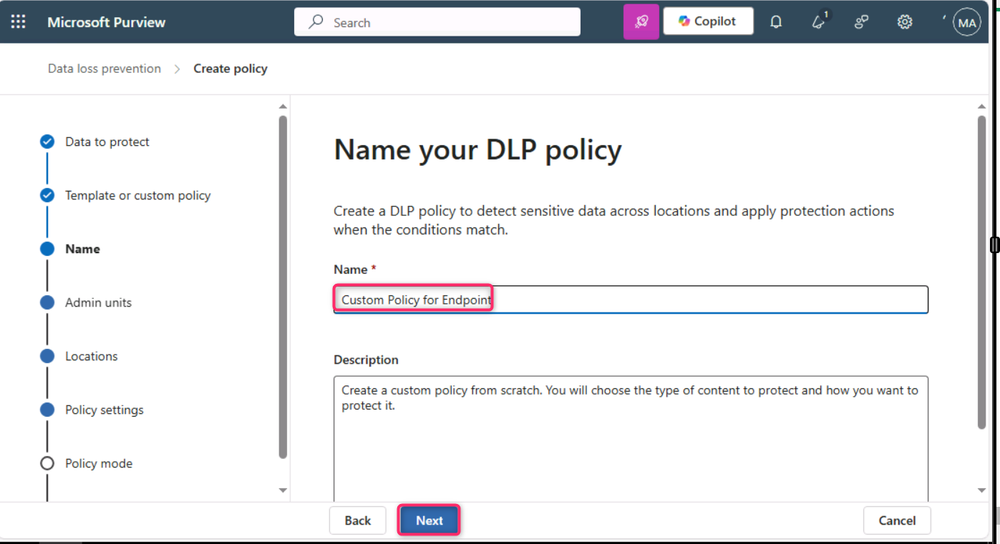
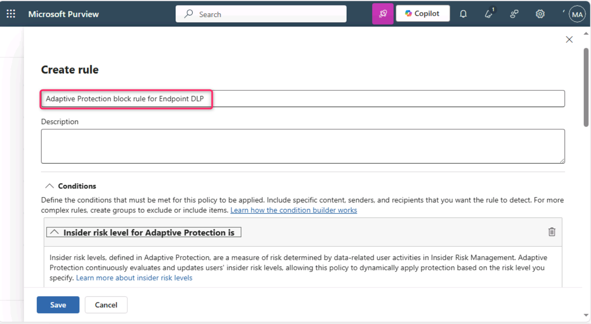
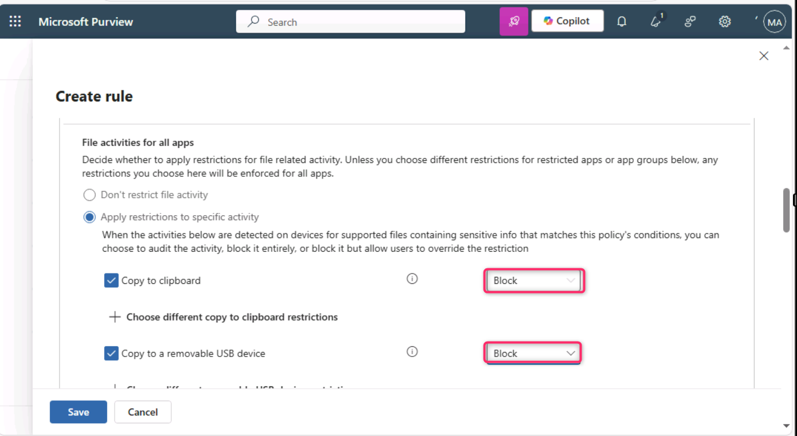
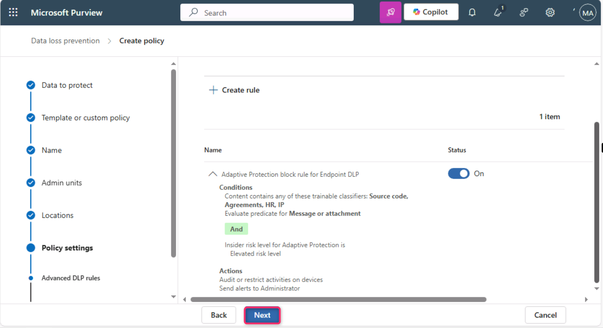

**실습 5 – Adaptive Protection 기능 탐색**

**소개**

Microsoft Purview의 Adaptive Protection(적응형 보호)은 Microsoft Purview Insider Risk Management와 Microsoft Purview Data Loss Prevention(DLP)을 통합합니다. 내부 위험 관리에서 위험한 행동을 보이는 사용자를 식별하면, 해당 사용자에게 동적으로 내부 위험 수준이 할당됩니다. 이후 Adaptive Protection은 이 내부 위험 수준과 관련된 위험 행동으로부터 조직을 보호할 수 있도록 자동으로 DLP 정책을 생성할 수 있습니다.

**목표**

- Insider Risk Management에서 Adaptive Protection을 위한 위험 임계값 설정

- 엔드포인트 보호를 위한 맞춤형 DLP 정책 생성 및 구성

- 학습 가능한 분류기와 내부 위험 수준을 사용하여 조건 정의

- 고위험 데이터 유출 활동을 차단하기 위한 조치 적용

- 정책을 즉시 적용 가능하도록 활성화

**연습 1 – Adaptive Protection 설정**

**작업 1 – Adaptive Protection용 위험 수준 설정**

1.  Microsoft Edge 브라우저의 일반 창에서 **MOD adiminstrator** 계정으로 Microsoft Purview 포털에 로그인한 후, **Solutions \> Insider risk management**로 이동하세요.

> 

2.  **Insider Risk Management** 왼쪽 창에서 **Adaptive Protection**로 이동해 클릭하세요.

> 

3.  **Adaptive Protection** 페이지에서 **Insider risk levels**을 클릭하세요. 그런 다음 **Insider risk policy** 섹션으로 이동해 **Select a policy** 옆 드롭다운을 클릭하세요. 드롭다운에서 **Data leaks by a user** 옆 체크박스를 선택하세요.

> 
>
> 

4.  **Conditions for insider risk levels**에서 위험 수준별 활동 기준을 설정하세요. **Elevated risk level**에는 User performs at least 3 data exfiltration activities, each…를, **Moderate risk level**에는 User performs at least 2 data exfiltration activities, each…를, **Minor risk level**에는 User performs at least 1 data exfiltration activities, each…를 각각 선택하세요. 설정 후 페이지를 아래로 스크롤해 **Save** 버튼을 선택하세요.

> 

5.  **Save** 버튼을 클릭하세요.

> 

**작업 2 – 엔드포인트용 맞춤 Adaptive Protection DLP 정책 생성**

1.  **Adaptive Protection** 페이지에서 **Data Loss Prevention**로 이동해 클릭한 후, **+ Create policy**를 클릭하세요.

> 

2.  **Choose what type of data to protect** 페이지에서 **Data stored in connected sources** 라디오 버튼이 선택되어 있는지 확인하세요.

> 

3.  **Template or custom policy** 페이지에서 **Categories** 섹션에서 **Custom**을 선택한 후, **Regulations** 아래에서 **Custom policy**를 클릭하세요.

> 

4.  **Namee your DLP policy** 페이지에서 **Name** 필드에 Custom Policy for Endpoint를 입력하세요.

> 

5.  **Assign admin units** 페이지에서 **Next** 버튼을 클릭하세요.

> 

6.  **Choose where to apply the policy** 페이지에서 **Next** 버튼을 클릭하세요.

> 

7.  **Define policy settings** 페이지에서 **Next** 버튼을 클릭하세요.

> 

8.  **Customize advanced DLP rules** 페이지에서 **+ Create rule**을 클릭하세요.

> 

9.  **Create rule** 필드에 Adaptive Protection block rule for Endpoint DLP를 입력하세요.

> 

10. **Select one or more risk levels** 옆 드롭다운을 클릭하고, **Elevated risk level** 옆 체크박스를 선택하세요.

> 

11. **+ Add condition** 옆 드롭다운을 클릭한 다음, **Content contains**를 선택하세요.

> 

12. **Content contains** 섹션에서 **Add** 옆 드롭다운을 클릭한 다음, **Trainable classifiers**를 선택하세요.

> 

13. 오른쪽 **Trainable classifiers** 패널에서 **Source code**, **Agreements**, **HR**, **IP** 옆 체크박스를 선택한 후, **Add** 버튼을 클릭하세요.

> 
>
> 

14. **Actions** 섹션에서 **Add an action** 옆 드롭다운을 클릭한 후, **Audit or restrict activities on devices**를 선택하세요.

> 

15. **Copy to clipboard**, **Copy to a removable USB device**, **Copy to a network share**, **Print** 항목에 대해 **Block**을 선택하세요.

> ..
>
> 

16. **Incident reports** 섹션에서 **Use this severity level in admin alerts and reports** 필드의 드롭다운에서 **Low**를 선택한 후,** Save **버튼을 클릭하세요.

> 

17. **Next** 버튼을 클릭하세요.

> 

18. **Policy mode** 페이지에서 **Turn the policy on immediately** 라디오 버튼을 선택한 후, **Next** 버튼을 클릭하세요.

> 

19. **Review and finish** 페이지에서 **Submit** 버튼을 클릭하세요.

> 

20. **New policy created** 페이지에서 **Done** 버튼을 클릭하세요.

> 

**요약**

이번 연습에서는 Microsoft Purview에서 Adaptive Protection(적응형 보호)을 구성했습니다. 먼저 데이터 유출 활동 임계값을 기준으로 내부자 위험 수준을 정의했습니다. 이어서 엔드포인트 장치를 대상으로 하는 맞춤형 데이터 손실 방지(DLP) 정책을 생성해 높은 위험이 감지되면 USB 복사, 인쇄 등 민감한 활동을 자동으로 차단하도록 설정했습니다. 이 정책은 학습 가능한 분류기를 활용해 민감 콘텐츠를 식별하고, 내부자 위험 수준에 따라 엄격한 조치를 적용함으로써 잠재적 데이터 유출을 효과적으로 방지합니다.
