**실습 6 – DLP 정책 생성 및 관리**

**소개**

여러분은 Contoso Ltd.의 신규 Compliance Administrator(컴플라이언스 관리자)인 Patti Fernandez 역할을 맡아, 회사의 Microsoft 365 테넌트에서 데이터 손실 방지(DLP)를 구성하게 됩니다. Contoso Ltd.는 미국 내에서 운전 교육을 제공하는 회사로, 민감한 고객 정보가 조직 외부로 유출되지 않도록 보호해야 합니다.

**목표**

- Microsoft Purview에서 DLP 정책 생성 및 테스트

- PowerShell을 사용해 DLP 설정 관리

- Defender for Cloud Apps에서 파일 모니터링 활성화 및 파일 정책 생성

- Power Platform에서 DLP 적용해 데이터 흐름 제어

**연습 1 – DLP 정책 생성**

**작업 1 – 테스트 모드에서 DLP 정책 생성**

이번 연습에서는 사용자가 민감 데이터를 공유하지 못하도록 보호하기 위해 Microsoft Purview 포털에서 데이터 손실 방지(DLP) 정책을 생성합니다. 생성할 DLP 정책은 사용자가 신용카드 정보가 포함된 콘텐츠를 공유하려 할 때 알림을 제공하고, 해당 정보를 전송하려는 이유를 입력할 수 있도록 허용합니다. 이 정책은 아직 차단 조치가 사용자에게 영향을 미치지 않도록 테스트 모드로 구현됩니다.

1.  **Microsoft Edge**에서 https://purview.microsoft.com으로 이동하여 **Patti Fernandez** 계정으로 **Microsoft Purview** 포털에 로그인되어 있는지 확인하세요.

2.  **Microsoft Purview** 포털의 왼쪽 탐색 창에서**Solutions** \> **Data loss prevention**을 선택하세요.

> 

3.  **Data loss prevention**에서 **Policies**를 선택한 다음, **+Create policy**를 선택하여 새로운 데이터 손실 방지(DLP) 정책 생성 마법사를 시작합니다.

> 

4.  **What info do you want to protect?** 창에서 **Enterprise applications and devices**를 선택하세요.

> 

5.  **Start with a template or create a custom policy** 페이지에서 아래로 스크롤해 **Categories**에서 **Custom**을 선택하세요**.** 그런 다음 **Regulations**에서 **Custom policy**를 선택하고, **Next** 버튼을 클릭하세요.

> 

6.  **Name your DLP policy** 페이지에서 **Name** 필드에 Credit Card DLP Policy를 입력하고, **Description** 필드에는 Protect credit card numbers from being shared.를 입력하세요. 그런 다음 **Next**를 선택하세요.

> 

7.  **Assign admin units** 페이지에서 **Next**를 선택하세요

> 

8.  **Choose where to apply the policy** 페이지에서 **Teams chat and channel messages** 옆 체크박스를 선택하고, 다른 리소스 옆 체크박스는 선택 해제한 후, **Next** 버튼을 클릭하세요.

> 

9.  **Define policy settings** 페이지에서 **Create or customize advanced DLP rules** 라디오 버튼이 선택되어 있는지 확인한 후, **Next** 버튼을 클릭하세요.

> 

10. **Customize advanced DLP rules** 페이지에서 **+ Create rule**을 선택하세요.

> 

11. **Create rule** 페이지에서 **Name** 필드에 규칙 이름을 입력하세요.

> 

12. **Create rule** 페이지의 **Conditions** 섹션에서 **+ Add condition**을 클릭하고, 드롭다운 메뉴에서 **Content is shared from Microsoft 365**를 선택하세요.

> 

13. 새로 생성된 **Content is shared from Microsoft 365** 섹션에서 **with people outside my organization** 옵션을 선택하세요.

> 

14. **+ Add Condition**을 선택한 후, 드롭다운 메뉴에서 **Content contains**를 선택하세요.

> 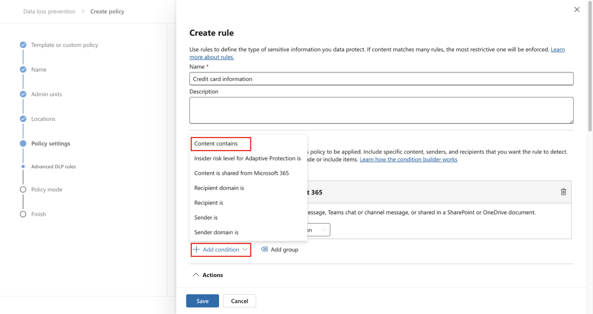

15. 새로 생성된 **Content contains** 영역에서 **Add**를 선택한 다음, 드롭다운 메뉴에서 **Sensitive info types**를 선택하세요.

> 

16. 오른쪽에 나타난 **Sensitive info types** 패널에서 검색창에 credit card number를 입력하고 Enter 키를 누르세요. 그런 다음 **Credit Card Number** 옆 체크박스를 선택하고, **Add** 버튼을 클릭하세요.

> 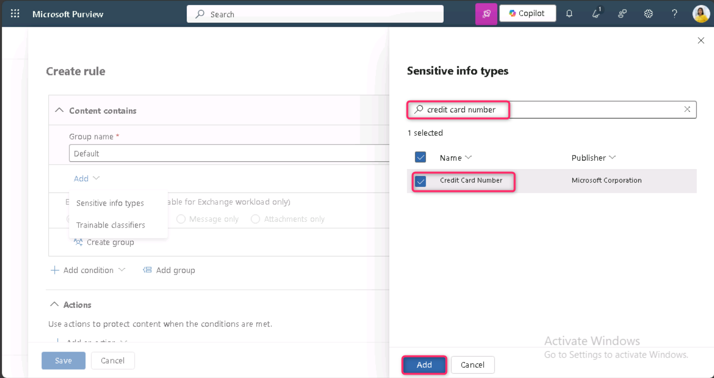

17. **Create rule** 페이지에서 **+ Add an action**을 선택한 후, **Restrict access or encrypt the content in Microsoft 365 locations**를 선택하세요.

> 

18. **Restrict access or encrypt the content in Microsoft 365 locations** 섹션에서 **Block users from receiving email or accessing shared SharePoint, OneDrive, and Teams files, and Power BI items** 라디오 버튼이 선택되어 있는지 확인하고, **Block only people outside your organization** 라디오 버튼이 선택되어 있는지도 확인하세요.

> 

19. **Create rule** 페이지의 **User notifications** 섹션에서 스위치를 **On** 위치로 설정하세요.

> 

20. **Create rule** 페이지의 **User overrides** 섹션에서 **Allow overrides from M365 services. Allows users in Exchange, SharePoint, OneDrive and Teams to override policy restrictions.** 체크박스를 선택하세요.

> 

**참고**: 만약 **Allow overrides from M365 services** 체크박스를 선택할 수 없는 경우, 이전 단계에서 **Create rule** 페이지의 **User notifications \> Microsoft 365 services** 섹션에 있는 **Notify users in Office 365 with a policy tip** 체크박스를 먼저 활성화하세요. 그런 다음 **Allow overrides from M365 services. Allows users in Exchange, SharePoint, OneDrive and Teams to override policy restrictions.** 체크박스를 선택하세요.

21. **Require a business justification to override** 체크박스를 선택하세요.

> 

22. **Incident reports** 섹션에서 **Use this severity level in admin alerts and reports** 드롭다운에서 **Low**를 선택하세요.

> 

23. **Save**를 선택한 다음 **Next**를 선택하세요.

> 
>
> 

24. **Policy mode** 페이지에서 **Run the policy in simulation mode** 라디오 버튼이 선택되어 있는지 확인하고, **Show policy tips while in test mode** 옆 체크박스도 선택되어 있는지 확인하세요. 그런 다음 **Next** 버튼을 클릭하세요.

> 

25. **Submit**를 선택해 정책을 생성하세요.

> 

26. 정책이 생성되면 **Done**을 선택하세요.

> 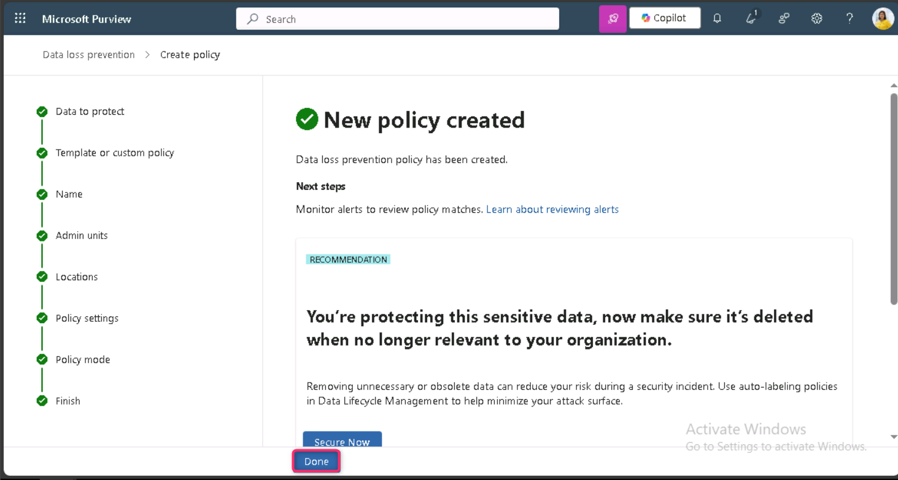
>
> 이제 Microsoft Teams 채팅 및 채널에서 신용카드 번호를 검사하고, 사용자가 정책을 우회할 경우 업무상 정당한 사유를 입력할 수 있도록 허용하는 DLP 정책을 성공적으로 생성했습니다.
>
> 

**작업 2 – DLP 정책 수정**

이 작업에서는 이전 단계에서 생성한 DLP 정책을 수정하여, 이메일에서도 신용카드 정보를 검사하도록 범위를 확장하고, 사용자가 해당 콘텐츠를 이메일로 공유하려 할 경우 정책 알림을 통해 사용자에게 안내하도록 구성합니다.

1.  **Credit Card DLP Policy** 옆 체크박스를 선택한 후, 아래 이미지에 표시된 것처럼 명령 모음에서 **Edit** 아이콘을 클릭하세요.

> 

2.  **Name your DLP policy** 및 **Assign admin units** 페이지에서 **Next**를 선택하세요.

> 
>
> 

3.  **Choose where to apply the policy** 페이지에서 **Exchange email** 옆 체크박스만 선택한 후, **Review and finish** 페이지에 도달할 때까지 **Next**를 계속 선택하세요.

> 

4.  정책에 변경 사항을 적용하기 위해 **Submit**을 선택하세요.

> 

5.  정책 업데이트가 완료되면 **Done** 버튼을 선택하세요.

> 

이제 기존 DLP 정책을 수정하여 콘텐츠를 검사하는 적용 위치를 변경했습니다.

**작업 3 – PowerShell을 사용한 DLP 정책 생성**

이번 작업에서는 PowerShell을 사용해 Contoso EmployeeID를 보호하고, 해당 정보가 Exchange 이메일을 통해 외부로 공유되지 않도록 하는 DLP 정책을 생성합니다. 사용자가 Contoso EmployeeID가 포함된 이메일을 보내려 할 경우, 시스템이 이를 민감 데이터 공유 시도로 알리고 이메일 전송을 차단하도록 설정합니다.

1.  작업 표시줄의 Windows 아이콘을 마우스 오른쪽 버튼으로 클릭하고, Windows PowerShell (Admin)을 선택해 관리자 권한으로 실행하세요.

> 

2.  **User Account Control** 대화 상자가 나타나면 **Yes** 버튼을 클릭하세요.

> 

3.  **PowerShell**에서 다음 명령어들을 실행하세요:

> Install-Module ExchangeOnlineManagement
>
> Import-Module ExchangeOnlineManagement
>
> 
>
> 

4.  **PowerShell** 창에서 Connect-IPPSSession을 입력한 후, **Patti Fernandez** 계정으로 로그인하세요.

> 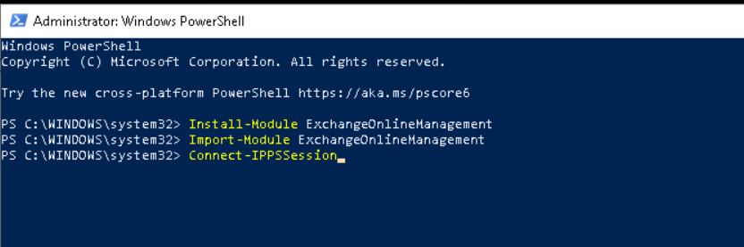
>
> 
>
> 만약 **Automatically sign in to all desktop apps and websites on this device?** 대화 상자가 나타나면, **No, this app only** 버튼을 클릭하세요.
>
> 
>
> 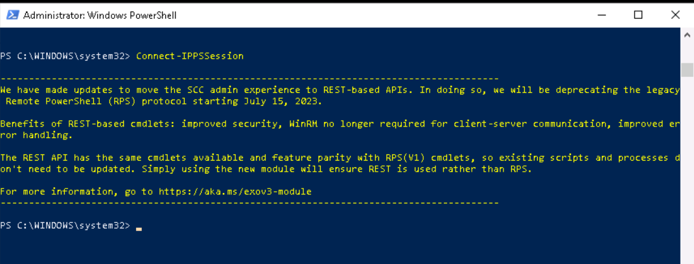

5.  모든 Exchange 메일박스를 검사하는 DLP 정책을 생성하기 위해, 다음 명령어를 PowerShell에 입력하세요:

> New-DlpCompliancePolicy -Name "EmployeeID DLP Policy" -Comment "This policy blocks sharing of Employee IDs" -ExchangeLocation All
>
> 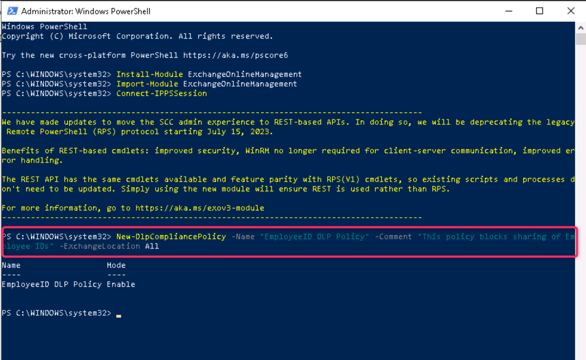

6.  이전 단계에서 생성한 DLP 정책에 규칙을 추가하려면, 다음 명령어를 PowerShell에 입력하세요:

> New-DlpComplianceRule -Name "EmployeeID DLP rule" -Policy "EmployeeID DLP Policy" -BlockAccess \$true -ContentContainsSensitiveInformation @{Name="Contoso Employee IDs"}
>
> 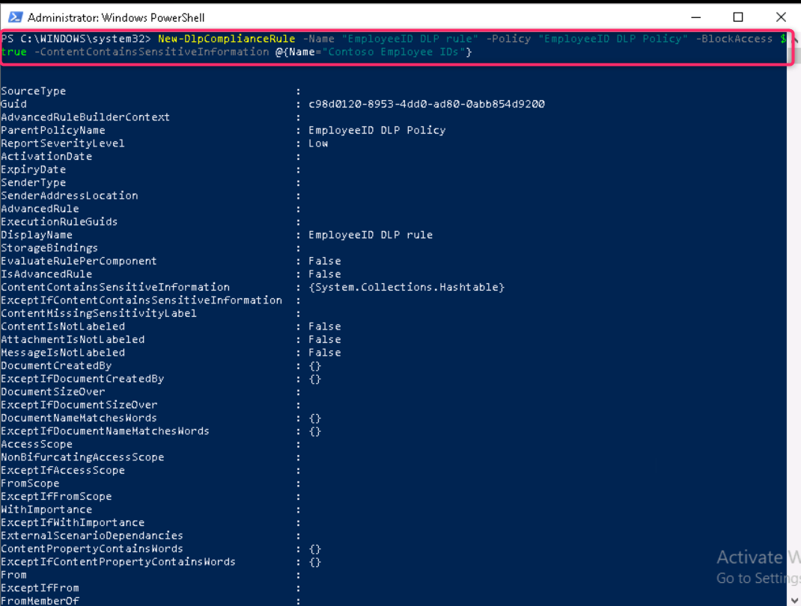
>
> 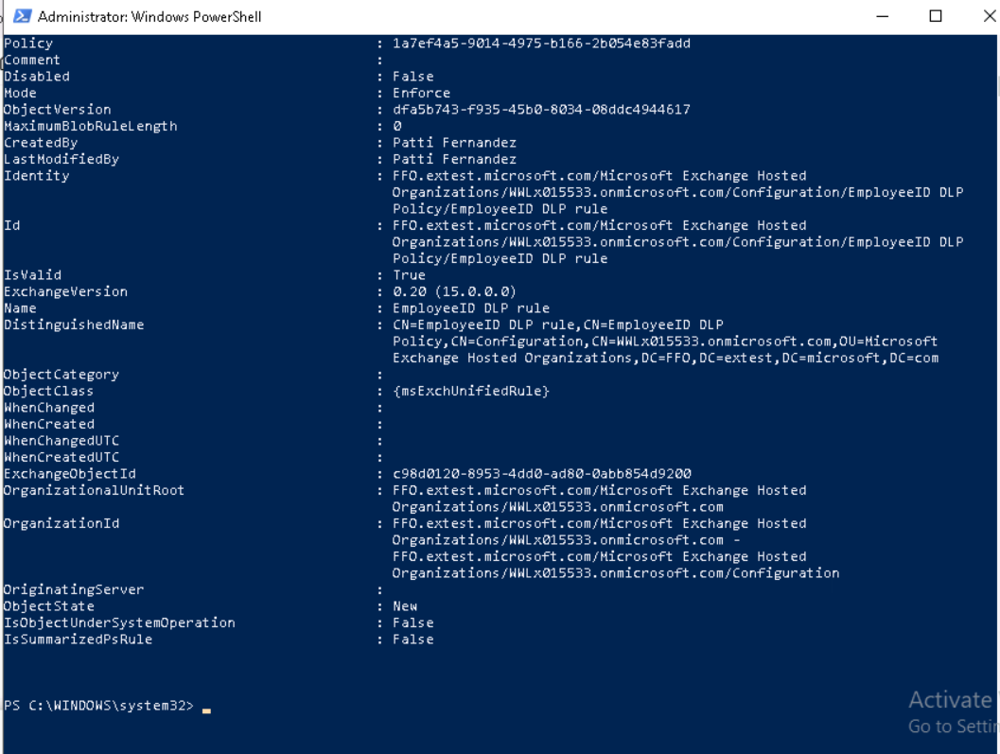

7.  **EmployeeID DLP 규칙**을 검토하려면, 다음 명령어를 사용하세요:

> Get-DLPComplianceRule -Identity "EmployeeID DLP rule"
>
> 

이제 PowerShell을 사용해 Exchange에서 Contoso EmployeeID를 검사하는 DLP 정책을 성공적으로 생성했습니다.

**작업 4 – 테스트 모드에서 정책 활성화**

이번 작업에서는 이전에 생성한 신용카드 정보 DLP 정책을 테스트 모드에서 활성화해 정책이 보호 조치를 실제로 적용하도록 구성합니다.

1.  **Microsoft Edge InPrivate Window**에서 https://purview.microsoft.com으로 이동해 **Patti Fernandez** 계정으로 **Microsoft Purview** 포털에 로그인되어 있는지 확인하세요.

2.  **Microsoft Purview** 포털의 왼쪽 탐색 창에서 **Solutions** \> **Data loss prevention**을 선택하세요.

> 

3.  **Data loss prevention**에서 **Policies**를 선택한 후, **Credit Card DLP Policy**를 선택하고 Edit policy(연필 아이콘)을 클릭하여 정책 마법사를 여세요.

> 

4.  **Next**를 계속 선택해 **Test or turn on the policy **페이지로 이동한 후,** Turn the policy on immediately **옵션을 선택하세요.

> 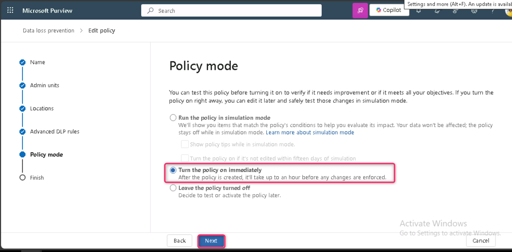

5.  **Next**를 선택한 후, **Submit**를 클릭해 정책을 활성화하세요.

> 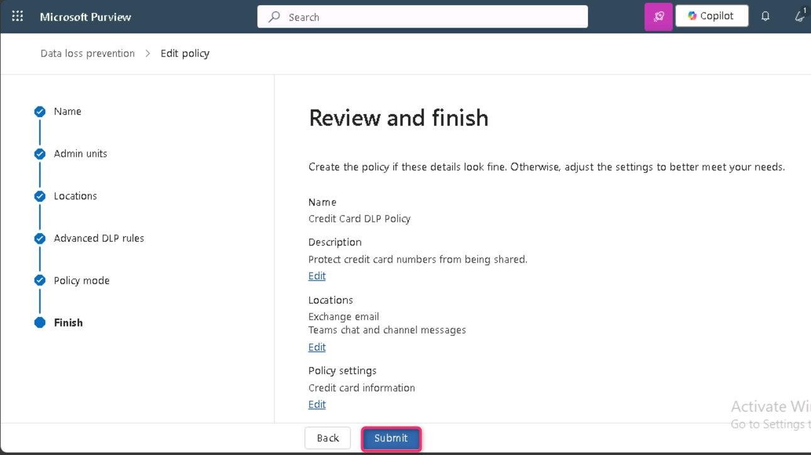

6.  정책 업데이트가 완료되면 **Done**을 선택하세요.

> 

이제 DLP 정책이 성공적으로 활성화되었습니다. 정책이 신용카드 정보 공유 시도를 감지하면, 해당 시도를 차단하고 사용자가 업무상 정당한 사유를 입력해 차단을 일시적으로 무시할 수 있도록 허용합니다.

**연습 2 – DLP 정책 관리**

**작업 1 – 정책 우선순위 수정**

두 개의 DLP 정책을 생성한 후, 보다 엄격한 정책이 덜 엄격한 정책보다 높은 우선순위로 처리되도록 설정하고자 합니다. 이를 위해 EmployeeID DLP Policy를 더 높은 우선순위로 이동합니다.

1.  **Microsoft Edge**에서 https://purview.microsoft.com 으로 이동해 **Patti Fernandez** 계정으로 **Microsoft Purview** 포털에 로그인되어 있는지 확인하세요.

2.  **Microsoft Purview** 포털의 왼쪽 탐색 창에서 **Solutions** \> **Data loss prevention**을 선택하세요.

> 

3.  **Data loss prevention**에서 **Policies**를 선택한 후, **Credit Card DLP Policy**를 선택하고 **Move to top (highest priority)** 를 선택하세요.

> 

4.  **Data loss prevention** 창에서 **Refresh**를 선택한 후, 정책 테이블의 **Order** 열에서 우선순위를 확인하세요.

> 

이제 DLP 정책의 우선순위를 성공적으로 수정했습니다. 두 정책이 동일한 콘텐츠와 일치하는 경우, 우선순위가 높은 정책의 조치가 적용됩니다.

**작업 2 – Microsoft Defender에서 파일 모니터링 활성화**

OneDrive 및 SharePoint Online의 파일을 보호하기 위해 **Microsoft Defender**에서 파일 정책을 사용하려고 합니다. 파일 정책을 생성하기 전에, 조직의 파일을 Microsoft Defender가 스캔할 수 있도록 파일 모니터링을 먼저 활성화해야 합니다.

1.  일반 Microsoft Edge 브라우저에서 새 탭을 열고 주소 표시줄에:  https://security.microsoft.com을 입력해 Microsoft Defender 포털을 여세요. 그런 다음 **MOD Administrator** 계정으로 로그인하세요.

2.  Microsoft Defender 포털의 왼쪽 탐색 메뉴에서 아래로 스크롤해 **System \> Settings**를 클릭합니다. **Settings** 페이지에서 **Cloud Apps**를 클릭하세요.

> 

3.  이제 **Information Protection** 섹션까지 스크롤한 후 **Files**를 클릭하세요. **Files** 페이지에서 **Enable file monitoring**옆 체크박스를 선택한 후, **Save** 버튼을 클릭하세요.

> 

**참고**: 파일 모니터링이 기본적으로 이미 활성화되어 있는 경우, 위 단계를 건너뛰고 다음 작업으로 진행하세요.

이제 Microsoft Defender for Cloud Apps에서 파일 모니터링을 성공적으로 활성화했으며, 파일 정책을 사용해 민감한 콘텐츠를 스캔할 수 있습니다.

**작업 3 – Microsoft Defender용 파일 정책 생성**

이번 작업에서는 Microsoft Defender에서 파일 정책을 생성해 OneDrive 및 SharePoint Online의 파일을 스캔하고, 신용카드 정보가 포함된 파일이 공유될 경우 자동으로 격리되도록 구성합니다.

1.  동일한 **Information Protection** 섹션에서 **Microsoft Information Protection**을 클릭한 후, **Automatically scan new files for Microsoft Information Protection sensitivity labels and content inspection warnings** 옆 체크박스를 선택하세요. 그런 다음 Save 버튼을 클릭하세요.

> 
>
> 

2.  **Inspect protected files**에서 **Grant Permission**을 클릭하세요.

> 

3.  **Pick an account** 대화 상자가 나타나면, MOD Administrator 테넌트 자격 증명을 선택하세요.

\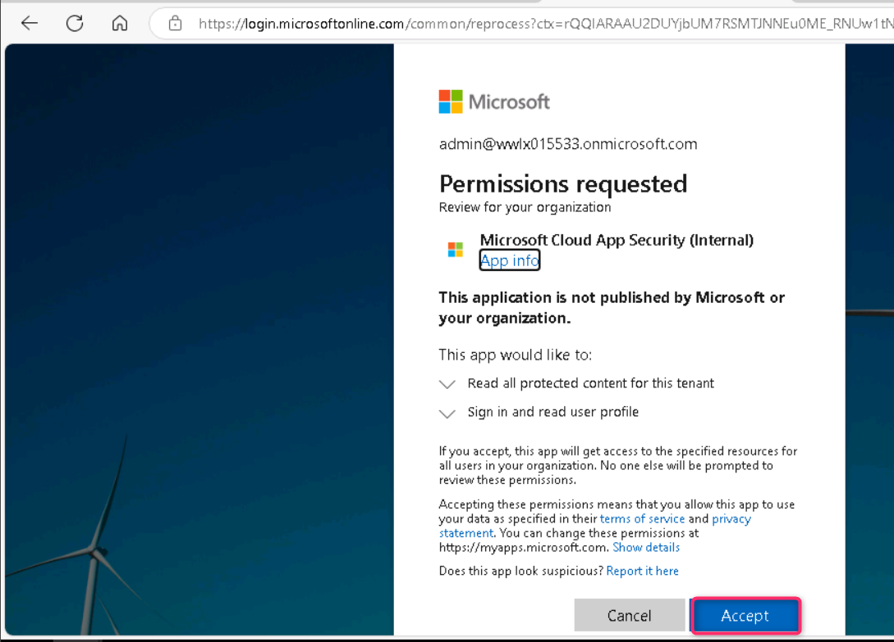

4.  **Permissions requested** 페이지에서 **Accept** 버튼을 클릭하세요.

> 

5.  권한이 성공적으로 부여되면 **Active** 상태가 표시되는 것을 확인할 수 있습니다.

> 

6.  하위 탐색 메뉴의 **Connected apps** 섹션에서 **App Connectors**를 클릭한 후, **Microsoft 365**가 추가되어 있는지 확인하세요.

> 

7.  이제 **Microsoft Defender** 포털의 왼쪽 탐색 창에서 Cloud Apps 섹션 아래 **Policies**를 확장한 후, **Policy management**를 선택하세요.

> 

8.  **Policies** 페이지에서 **Create policy**를 클릭한 후, **File policy**를 선택하세요.

> 

9.  **Create file policy** 페이지에서 **Policy name** 필드에 Credit Card Information for files를 입력하고, **Description** 필드에는 Protect credit card numbers from being shared in files를 입력하세요.

> 

10. **Policy Severity**는 **Low** (하나의 표시 아이콘)로 유지하고, **Category**가 **DLP**로 설정되어 있는지 확인하세요. 파일 정책의 경우 기본적으로 이 설정이 적용되어 있습니다.

> 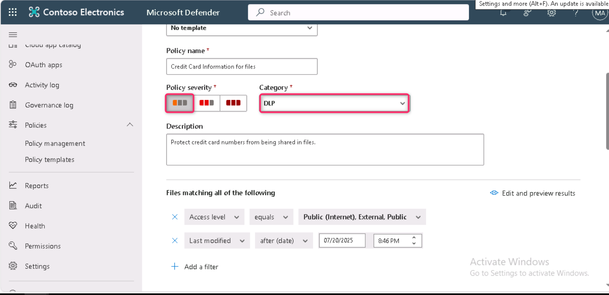

11. **Files matching all of the following** 영역에서 드롭다운 메뉴를 확장하고, **Public (Internet), External, Public** 항목 외에 **Internal**을 추가하세요.

> 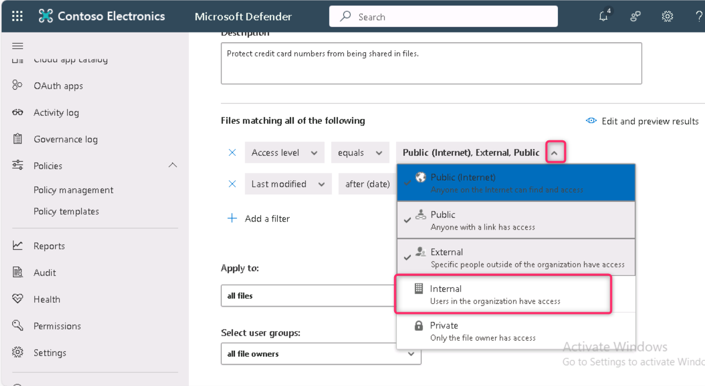

12. **Apply to** 섹션에서 **Inspection Method** 드롭다운 메뉴를 열고, **Data Classification Service**를 선택하세요.

> 
>
> **참고:** 드롭다운 메뉴에서 아직 **Data Classification Service**가 보이지 않는 경우, 우선 **None**을 선택하세요. 이후 잠시 후에 다시 **Policies**\>**Policy management**\>**All Policies**로 이동하여, **name** 검색란에 **Credit card**를 입력한 후**Credit Card Information for files**를 선택하세요.

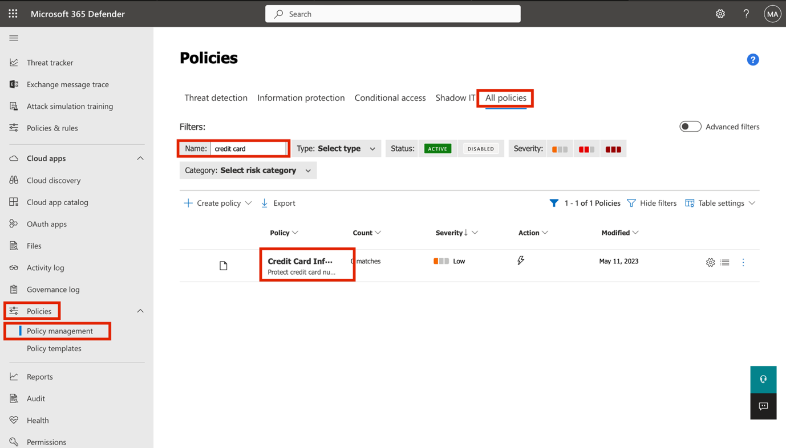

13. **Choose inspection type…** 드롭다운 메뉴에서 **Sensitive information type…**을 선택하세요.

14. **Select a sensitive information type** 대화 상자에서 검색창에 Credit Card Number를 입력하고, **Credit Card Number** 옆 체크박스를 선택한 후 **Done** 버튼을 클릭하세요.

> 

15. **Alerts** 섹션에서 **Create an alert for each matching file** 옆 체크박스를 선택한 후, **Save as default settings** 버튼을 클릭하세요.

> 

16. **Governance actions** 섹션에서 **Microsoft OneDrive for Business**를 확장한 후, **Put in user quarantine**를 선택하세요.

> 

17. **Governance actions** 섹션에서 **Microsoft SharePoint Online**을 확장한 후, **Put in user quarantine**를 선택하세요.

> 

18. 페이지 하단에서 **Create**를 선택하세요.

> 

19. 화면 오른쪽 상단에서 MOD Admin **프로필 사진**을 클릭하고, 톱니바퀴 아이콘 옆에 있는 **Sign out**을 선택한 후 브라우저를 닫으세요.

> 

이제 파일 정책이 성공적으로 생성되어, OneDrive와 SharePoint에 저장된 파일을 지속적으로 스캔하고, 신용카드 정보가 포함된 파일이 조직 내에서 공유될 경우 사용자 격리 처리하도록 설정되었습니다.

**작업 4 – Power Platform용 DLP 정책 생성**

귀사는 Power Automate 플로우를 사용해 SharePoint Online과 SalesForce 간 데이터를 공유하고 있습니다. 이번 작업에서는 Power Platform DLP 정책을 생성해 기존 플로우는 계속 정상적으로 작동하도록 유지하면서, SharePoint Online과 비업무용 앱 간의 데이터 공유는 차단하도록 설정합니다.

1.  **Microsoft Edge**에서 https://admin.powerplatform.microsoft.com으로 이동해 **MOD Administrator** 계정으로 Power Platform 관리 센터에 로그인하세요.

2.  **Power Platform admin center** 홈 페이지에서 **Security**를 찾아 클릭하세요.

> 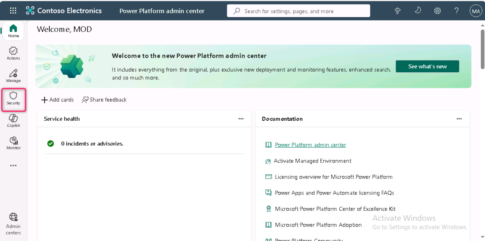

3.  이어서 아래 이미지에 표시된 것처럼 **Data and privacy** 아이콘을 클릭하세요.

> 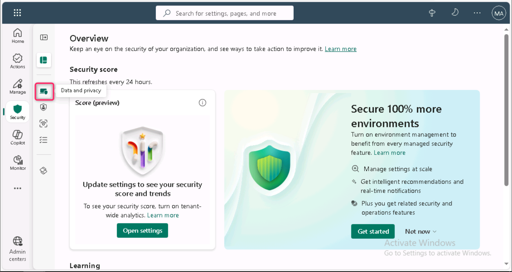

4.  Data protection and privacy 페이지에서 **Data policy**를 찾아 클릭하세요.

> 

5.  **Data policies** 페이지에서 **+ New Policy**를 선택하세요.

> 

6.  **Name your policy** 페이지에서 Tenant-wide SharePoint Policy를 입력한 후, **Next**를 선택하세요.

> 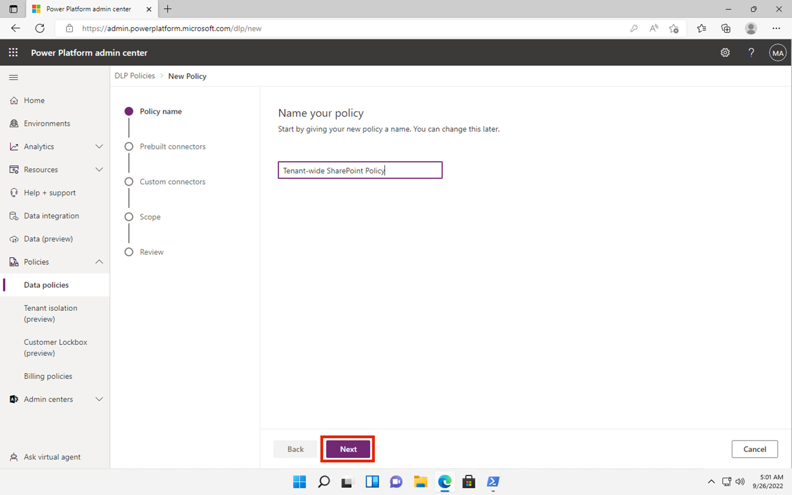

7.  **Non-business \| Default** 탭에서 **SharePoint**와 **Salesforce**를 선택한 후, 페이지 상단의 **Move to Business**를 클릭하세요.

> 

8.  **Assign connectors** 페이지에서 **Business** 탭을 선택해 **SharePoint**와 **Salesforce**가 모두 표시되는지 확인하세요.

> 

9.  **Next**를 두 번 선택하세요.

> 
>
> 

10. **Define scope** 페이지에서 **Add all environments**를 선택한 후, **Next**를 클릭하세요.

> 

11. **Review and create policy** 페이지에서 정책 설정을 검토한 후, **Create policy**를 선택하세요.

> 
>
> 이제 Power Platform DLP 정책이 성공적으로 생성되어, 사용자가 SharePoint Online 커넥터와 Salesforce가 아닌 커넥터를 포함하는 플로우를 생성하지 못하도록 차단됩니다.
>
> 

**요약:**

이번 실습에서는 Microsoft Teams, Exchange, OneDrive, SharePoint, Power Platform 전반에서 신용카드 번호, 직원 ID와 같은 민감한 데이터를 보호하기 위해 데이터 손실 방지(DLP) 정책을 생성하고 관리했습니다. 정책은 Microsoft Purview와 PowerShell을 사용해 구축했으며, 사용자 알림과 정책 우회(override) 기능을 활성화하고, 정책 우선순위를 조정했습니다. 또한 Microsoft Defender에서 파일 모니터링을 활성화하고, 파일 격리(quarantine) 동작을 구성했습니다. 추가로, Power Platform DLP 정책을 생성하여 비업무용(non-business) 커넥터와의 데이터 공유를 제한했습니다.
