**실습 7 – 내부자 위험 관리 구성**

**소개**

이번 실습에서는 내부자 위험 관리를 구성하는 방법을 학습합니다. 이를 위해 내부자 위험 관리 정책을 사용하며, 이전 실습 1에서 생성한 민감 정보 유형과 실습 4에서 생성한 DLP 정책을 활용해 조직 내 위험한 브라우저 사용이나 데이터 유출을 방지하는 정책을 생성합니다.

이를 수행하기 위해, 조직 내 장치를 나타내는 인프라를 Azure에 구축합니다. 이후 이러한 장치를 Azure AD와 Intune에 온보딩하고, 장치에 MDM 에이전트를 설치하여 해당 장치에서 발생하는 알림을 받을 수 있도록 구성합니다.

**목표**

- 정책 테스트를 위해 가상 머신(VM) 시계 동기화를 수행해 정확한 시간 설정을 보장

- Microsoft Purview에서 사용자를 내부자 위험 관리 역할 그룹에 할당

- 테넌트 및 사용자 수준에서 내부자 위험 탐지 분석 인사이트 활성화

- Windows 10 장치를 Microsoft Defender for Endpoint에 온보딩하여 내부자 위험 모니터링 수행

- 내부자 위험 관리 정책 생성 및 구성:

  - 위험한 브라우저 사용

  - 퇴사 예정 사용자의 데이터 절취

  - 사용자의 데이터 유출

- 각 정책을 평가해 MOD 관리자 계정에 대한 내부자 위험 탐지 시나리오 시뮬레이션

**연습 1 – 환경 설정**

**작업 0 – VM 시계 동기화**

1.  VM에서 열려 있는 Microsoft Edge 브라우저의 모든 탭을 닫으세요.\
    그런 다음 **Windows** 아이콘을 클릭하고, 아래 이미지에 표시된 것처럼 **Settings**을 클릭하세요.

> 

2.  **Windows Settings** 검색창에 Date & time settings를 입력한 후, 목록에서 **Date & time settings**를 선택하세요.

> 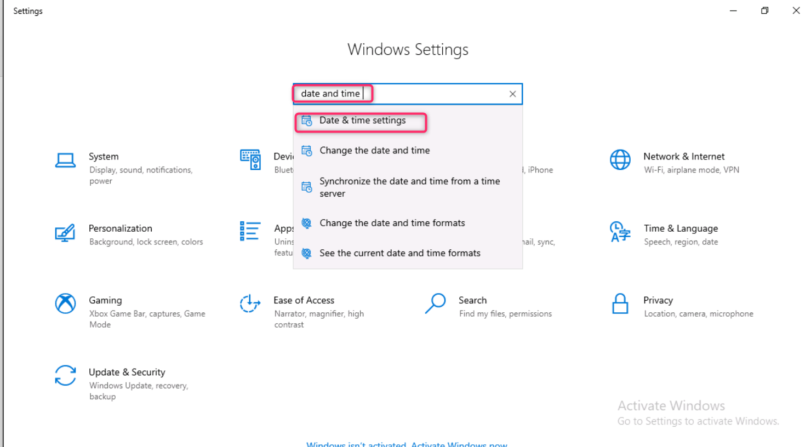

3.  **Date & time** 페이지에서 아래로 이동해 **Sync now** 버튼을 클릭하세요.

> 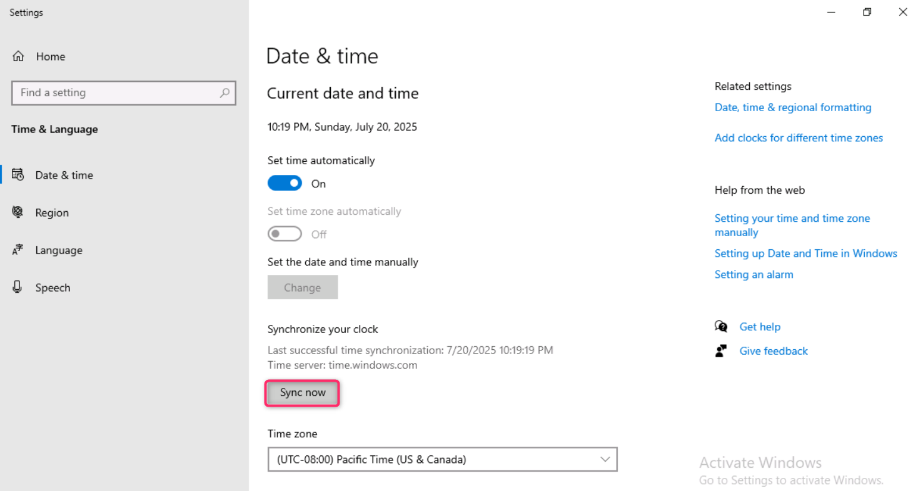

**연습 2 – 내부자 위험 관리 정책 생성**

**사전 요구 사항**

**단계 1: 사용자를 내부자 위험 관리 역할 그룹에 추가**

1.  Open the Microsoft Purview 포털(https://purview.microsoft.com )을 열고 **MOD Administrator** 계정으로 로그인하세요.

2.  왼쪽 탐색 메뉴에서 **Settings**을 클릭하세요.

> 

3.  **Settings** 창에서 **Roles and scopes**로 이동해 클릭하세요. 이어 **Role groups**를 선택하고, **Insider Risk Management** 옆의 체크박스를 클릭한 다음, 편집(연필 아이콘)을 클릭하세요.

> 
>
> 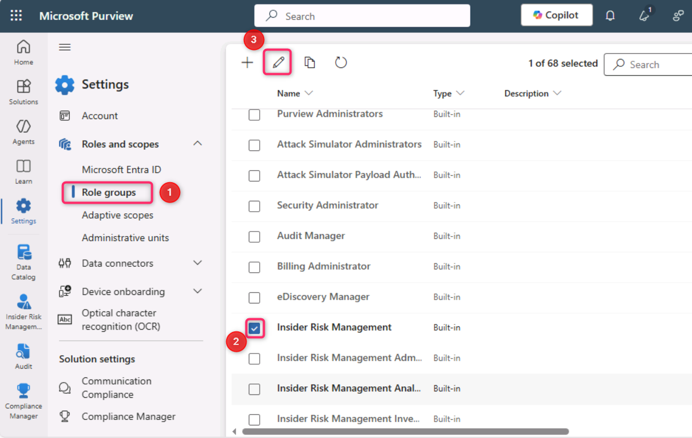

4.  **Edit Members of the role group** 페이지에서 **Choose users**를 클릭하세요.

> 

5.  **Alex Wilber** 옆 체크박스를 선택한 후 **Select** 버튼을 클릭하세요. 이미 Alex Wilber가 이미 선택되어 있다면 이 단계는 건너뛰어도 됩니다.

> **참고**: Edit members 목록에 Megan Bowen과 MOD Administrator 이름이 보이지 않는 경우, Alex 외에도 Megan Bowen과 MOD Administrator를 함께 선택하세요.
>
> 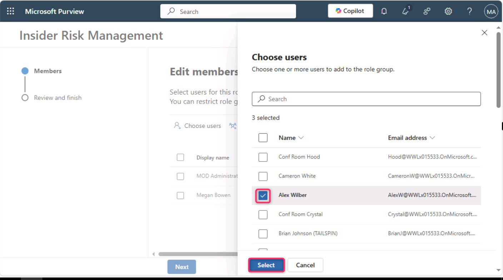

6.  MOD Administrator, Megan Bowen, Alex Wilber 이름이 모두 표시되는지 확인한 후 **Next** 버튼을 클릭하세요.

> 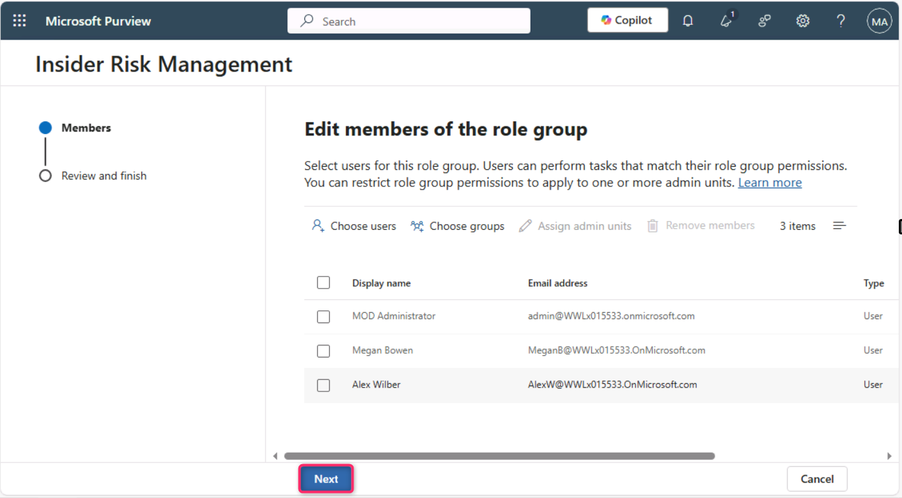

7.  사용자를 역할 그룹에 추가하기 위해 **Save**를 선택하세요.

> 

8.  단계를 완료하려면 **Done**을 선택하세요.

> 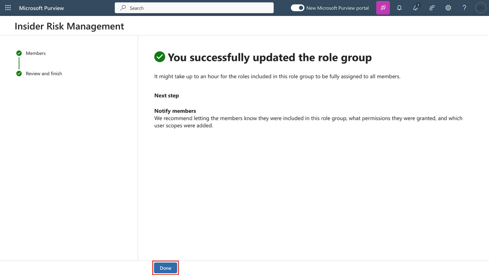

**단계 2 – 내부자 위험 분석 인사이트 활성화**

1.  Microsoft Purview 포털에서 **Settings**로 이동한 후 아래로 스크롤해 **Insider risk management**를 클릭하세요. **Insider Risk Management settings** – **Analytics** 페이지에서 **Show insights at tenant level**과 **Show insights at user level** 토글을 모두 켜짐(On)으로 설정한 다음, **Save** 버튼을 클릭하세요.

> 

**단계 3 – 장치 온보딩**

이 배포 시나리오에서는 아직 온보딩되지 않은 장치를 대상으로 하며, Windows 10 장치에서 발생하는 내부자 위험 활동을 탐지하는 것이 목적입니다.

내부자 위험 정책을 생성하기 위한 사전 요구 사항으로, 장치/VM을 Microsoft Entra ID에 등록해야 합니다.

1.  Windows 아이콘을 클릭한 후, 아래 이미지에 표시된 것처럼 **Settings**을 선택하세요.

> 

2.  **Accounts** \> **Access work or school**로 이동하세요. **Access work or school** 페이지에서 **Connect**를 클릭하세요.

> 
>
> 

3.  **Set up a work or school account** 창이 나타나면, **Join this device to Microsoft Entra ID**를 클릭하세요.

> 

4.  로그인 프롬프트가 나타나면, 실습 환경의 resources 탭에 제공된 **MOD Administrator** 자격 증명으로 로그인하세요.

> 
>
> 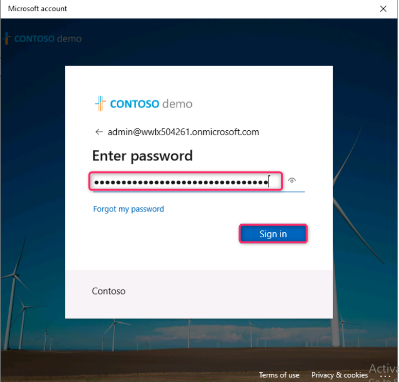

5.  **Make sure this is your organisation** 대화 상자가 나타나면 **Join** 버튼을 클릭하세요.

> 

6.  설정이 완료되면 **You're all set!** 확인 창이 표시됩니다. **Done**을 클릭하세요.

> 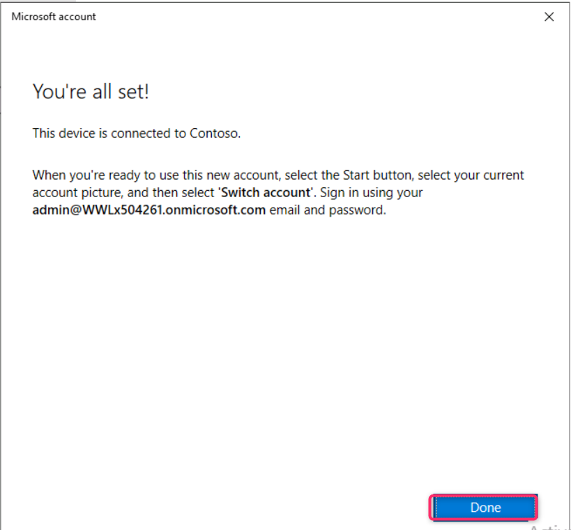

7.  다시 **Access work or school** 페이지에서 **Connect**를 클릭하세요.

> 

8.  **Set up a work or school account** 창이 나타나면, **MOD Administrator** 자격 증명으로 로그인하세요.

> 
>
> 

9.  **Stay signed in?** 대화 상자가 나타나면 **Yes** 버튼을 클릭하세요.

> 

10. **Setting up your device** 대화 상자가 나타나면 **Got it**을 선택하세요.

> 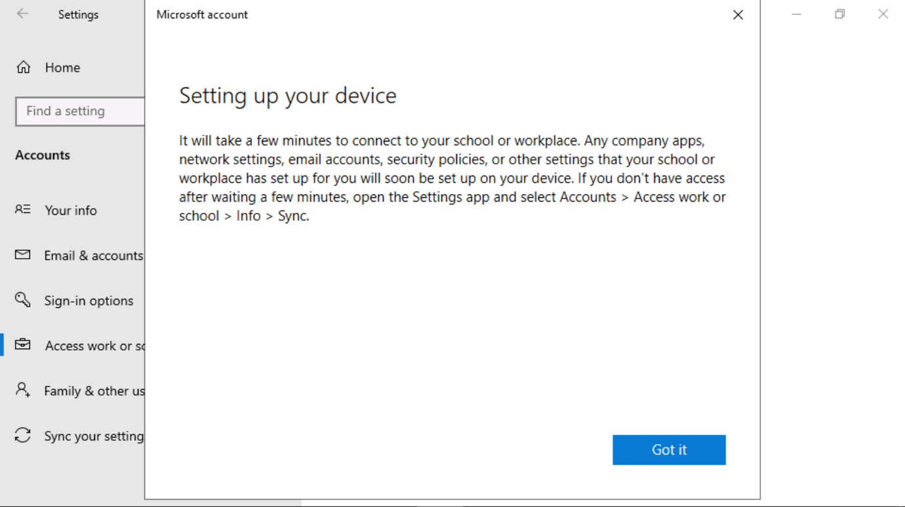

11. 이제 **windows settings** \> **Accounts** \> **Access work or school** \> **Connected to Contoso MDM** \> **Info** \> **Sync**로 이동하세요.

> 
>
> 

12. VM에서 **Windows 아이콘**을 클릭한 후, 사용자 **Admin**을 선택하고 **Sign out**을 클릭하세요.

> 

13. 사용자 화면에서 **Other user**를 선택하세요.

> 

14. 실습 환경 홈 페이지에 제공된 O365 자격 증명을 입력해** MOD Administrator** 계정으로 VM에 로그인하세요.

> 

15. 실습용 VM에서 **MOD Administrator** 계정으로 https://purview.microsoft.com 에 로그인하세요.

16. Microsoft Purview 포털에서 **Settings** \> **Device** **onboarding \> Devices**로 이동한 후, **Turn on Device onboarding**을 클릭하세요.

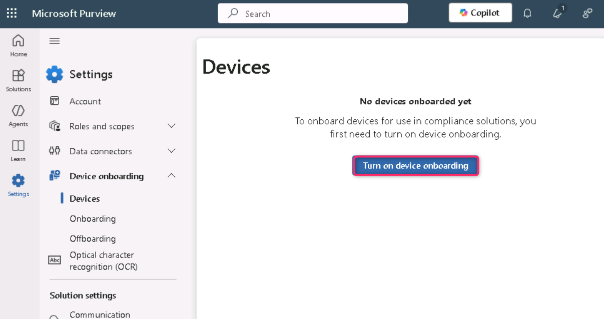

17. **Turn on device onboarding** 대화 상자가 나타나면 **OK** 버튼을 클릭하세요.

> 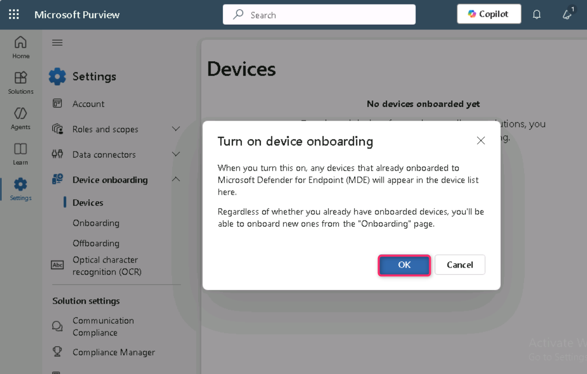

18. **Device monitoring is being turned on** 대화 상자가 나타나면 **OK** 버튼을 클릭하세요.

> 

19. 몇 분간 기다린 후, 페이지를 새로 고침하세요.

> 
>
> 

20. **Settings \> Device onboarding \> Onboarding**으로 이동한 후, **Download package**를 클릭하세요.

> 

21. 다운로드가 완료되면, 파일을 바탕화면으로 복사하세요. 파일을 마우스 오른쪽 클릭해 **Extract all…**를 선택한 후, **Extract** 버튼을 클릭하세요.

> 
>
> 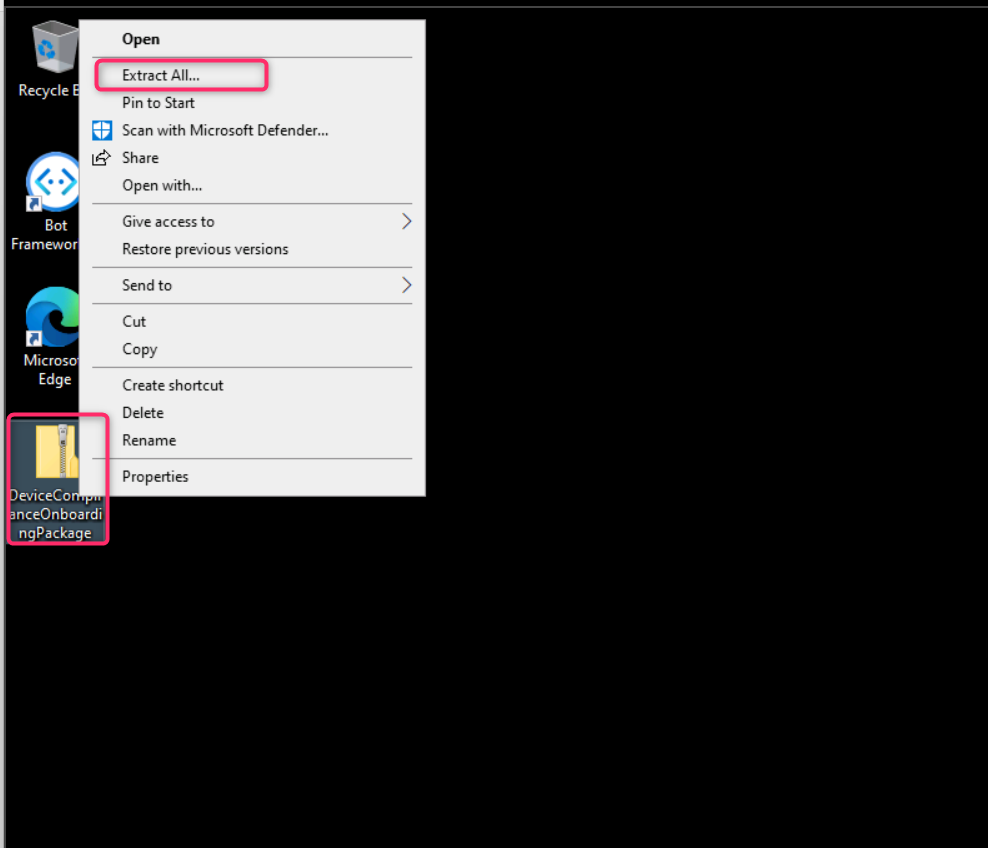
>
> 

22. 완료되면, 폴더를 열고 파일을 **Administrator** 권한으로 실행하세요.

> 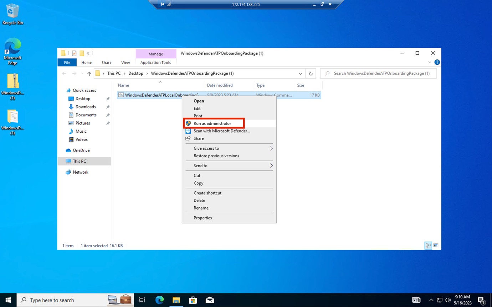

23. **Search for app in the Store?** 대화 상자가 나타나면 **Yes** 버튼을 클릭하고, 나타나지 않으면 이 단계는 건너뛰세요.

24. **The publisher could not be verified. Are you sure you want to run this software?** 대화 상자가 나타나면 **Run** 버튼을 클릭하세요.

> 

25. **User Account Control** 대화 상자가 나타나면 **Yes** 버튼을 클릭하세요.

> 

26. 명령 프롬프트에서 **Y**를 입력한 후 **Enter**를 눌러 확인하세요. 장치가 온보딩되었다는 메시지가 표시되면, **Press any key to continue . . .** 메시지가 나타날 때 아무 키나 눌러 진행하세요.

> 

27. 명령 프롬프트가 닫히면, Windows 검색창에 **cmd** 를 입력하고 **Command Prompt**를 마우스 오른쪽 클릭한 후 **Run as administrator**를 선택하세요.

> 

28. **User Account Control** 대화 상자가 나타나면 Yes 버튼을 클릭하세요.

> 

29. 다음 명령어를 실행해 탐지 테스트를 수행하세요. 명령어 실행 후 명령 프롬프트(Command Prompt) 창은 자동으로 닫힙니다.

> powershell.exe -NoExit -ExecutionPolicy Bypass -WindowStyle Hidden \$ErrorActionPreference= 'silentlycontinue';(New-ObjectSystem.Net.WebClient).DownloadFile('http://127.0.0.1/1.exe','C:\test-WDATP-test\invoice.exe');Start-Process 'C:\test-WDATP-test\invoice.exe'
>
> 

30. VM 연결을 종료하세요.

31. 내비게이션에서 **settings**을 클릭해 설정을 열고,  **Devices Onboarding** \> **Devices**를 선택하세요.

> **참고:** 일반적으로 디바이스 온보딩이 활성화되는 데 약 60초가 소요되지만, 최대 30분까지 걸릴 수 있습니다.

32. **Devices** 목록을 확인할 수 있습니다. 디바이스를 온보딩하기 전까지는 목록이 비어 있으며, 온보딩이 완료되면 온보딩된 디바이스로서 VM이 목록에 표시됩니다.

**작업 1 – 위험한 브라우저 사용을 탐지하고 점수를 매기기 위한 조직 전체 정책 생성**

**단계 1 – 새로운 정책 생성**

1.  Microsoft Purview 포털에서 Solutions를 클릭한 다음 **Insider Risk Management**를 클릭하세요.

> 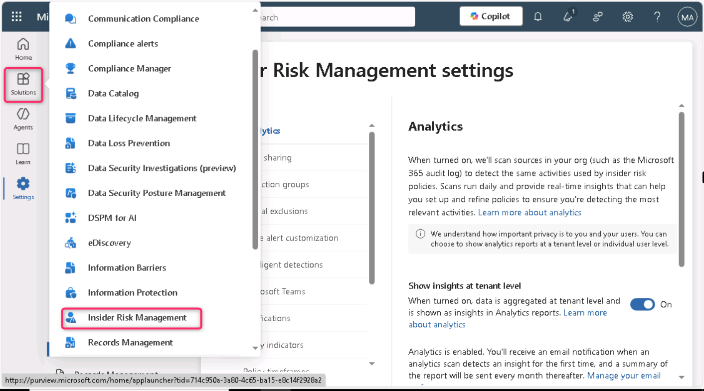

2.  **Policies**를 클릭하세요. **Policies** 페이지에서 **+Create policy \> Custom policy**를 클릭하세요.

> 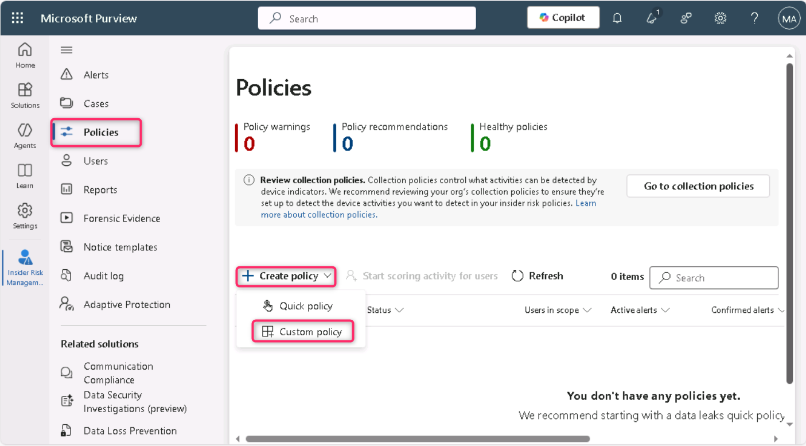

3.  Choose a policy template 페이지에서 Risky browser usage (preview) 아래에 있는 Risky browser usage (preview)를 선택하세요.

> 

4.  모든 사전 요구 사항을 검토하세요.

> 

5.  계속하려면 **Next**를 선택하세요.

> 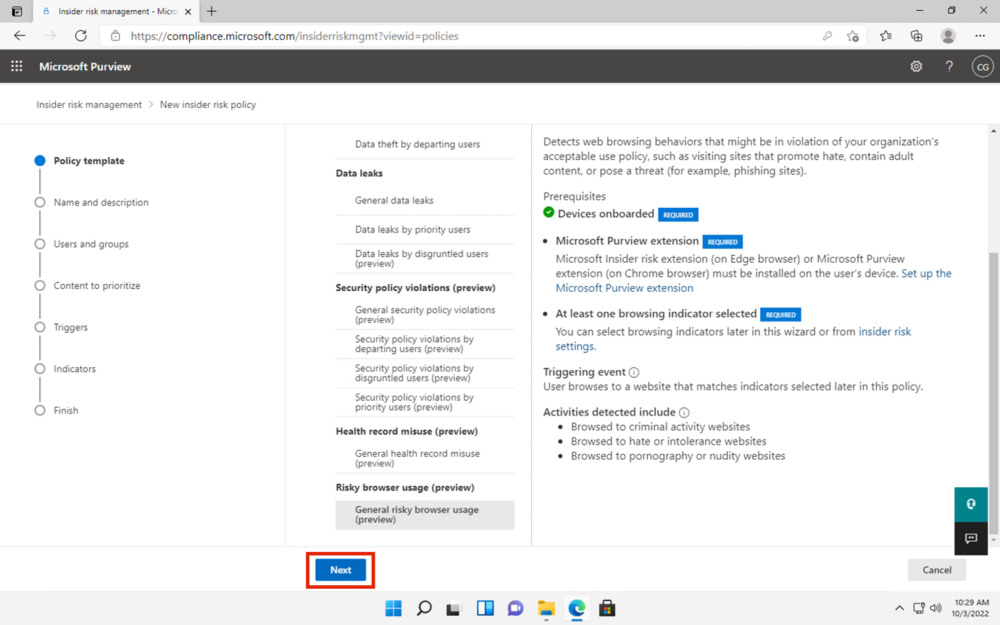

6.  **Name and description** 페이지에서 다음 필드를 입력하세요:

    - Name: Risky usage of browser

    - Description: This is a test policy for the risky browser usage

7.  계속하려면 Next를 선택하세요.

> 

8.  **Choose users, groups, & adaptive scopes** 페이지에서 **All users, groups, & adaptive scopes**를 선택하세요. 계속하려면 **Next**를 선택하세요.

> 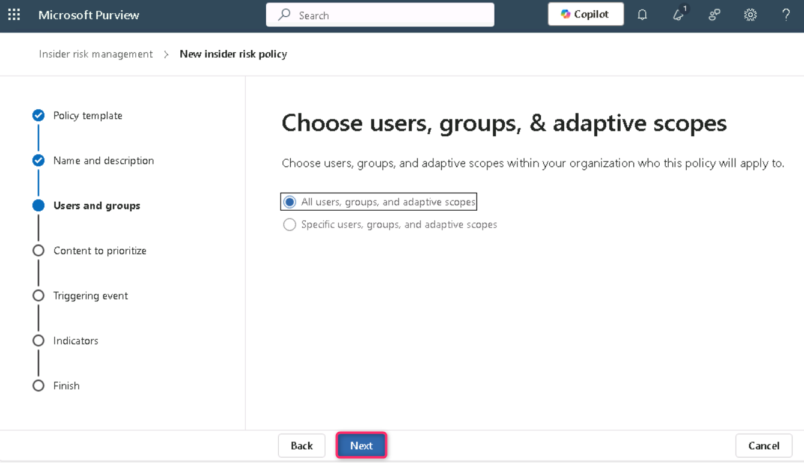

9.  **Exclude users and groups** 페이지에서 **Next**를 선택하세요.

> 

10. Decide whether to prioritize 페이지에서 **I don't want to priority content right now**를 선택하세요. 계속 진행하려면 **Next**를 선택하세요.

> 

11. **Choose triggering event for this policy** 페이지에서 **Turn on indicators** 버튼을 선택하세요.

> 

12. **Turn on indicators for your organization** 대화 상자에서 아래로 스크롤한 후 **Choose indicators to turn on** 버튼을 클릭하세요.

> 
>
> 

13. **Choose indicators to turn on** 대화 상자에서 **Risky browsing indicators (preview)** 아래의 모든 표시기가 선택되어 있는지 확인하세요.

> 
>
> 

14. 아래로 스크롤한 후 **Save**를 선택하세요.

15. **Choose triggering event for this policy** 페이지에서 **User browsed to a potentially risky website** 옆의 라디오 버튼이 선택되어 있는지 확인하세요. **Select which activities will trigger this policy** 아래에서 모든 옵션을 선택한 후 **Next**버튼을 클릭하세요.

> 

16. **Choose thresholds for triggering events** 페이지에서 **Choose your own thresholds** 라디오 버튼을 선택하고, 모든 임계값을 하루 1회(1 per day)로 변경한 다음 **Next**를 선택하세요.

> 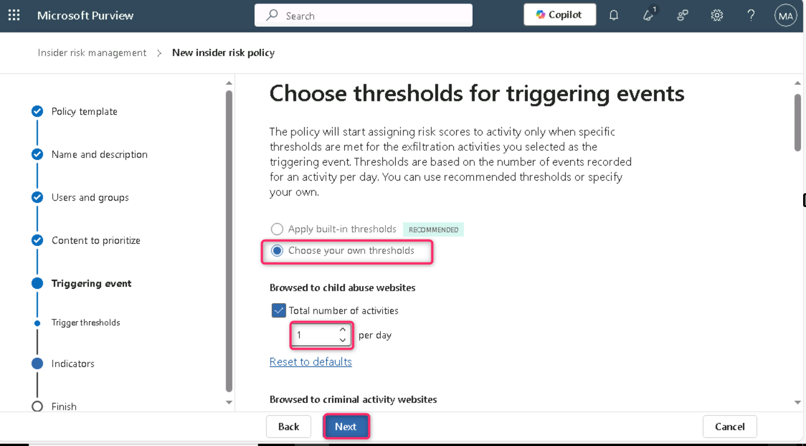
>
> 

17. **Indicators** 페이지에서 **Next**를 선택하세요.

> 

18. **Choose threshold type for indicators** 페이지에서 **Apply thresholds provided by Microsoft**가 선택되어 있는지 확인한 후 **Next** 버튼을 클릭하세요.

> 

19. **Review settings and finish** 페이지에서 **Submit**을 선택하세요.

> 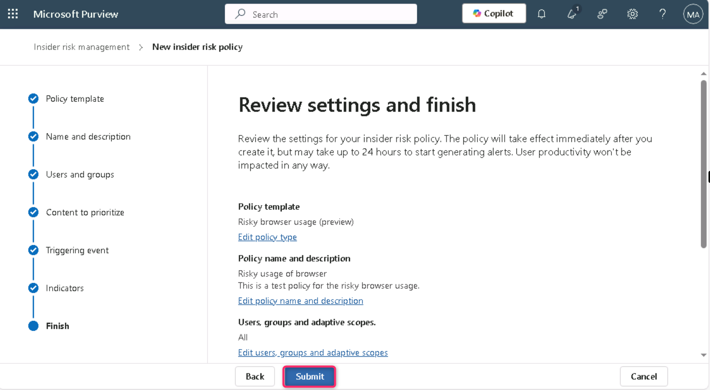

20. **Your policy was created** 페이지에서 **Done**을 선택하세요.

> 

21. 탭을 열린 상태로 유지하고 다음 작업으로 계속 진행하세요.

**단계 2 – 정책 점수 매기기**

1.  새로 생성된 정책 Risky usage of browser를 클릭하고, **Start scoring activity for users**를 선택하세요.

> 

2.  Reason for scoring activity 필드에 Testing the policy를 입력하세요. **Scoring activity for this many days (between 5 and 30)** 필드에서 **10 days**를 선택하세요.

> 

3.  Score activity for these users 필드에 MOD를 입력한 후 MOD administrator를 선택하세요.

> 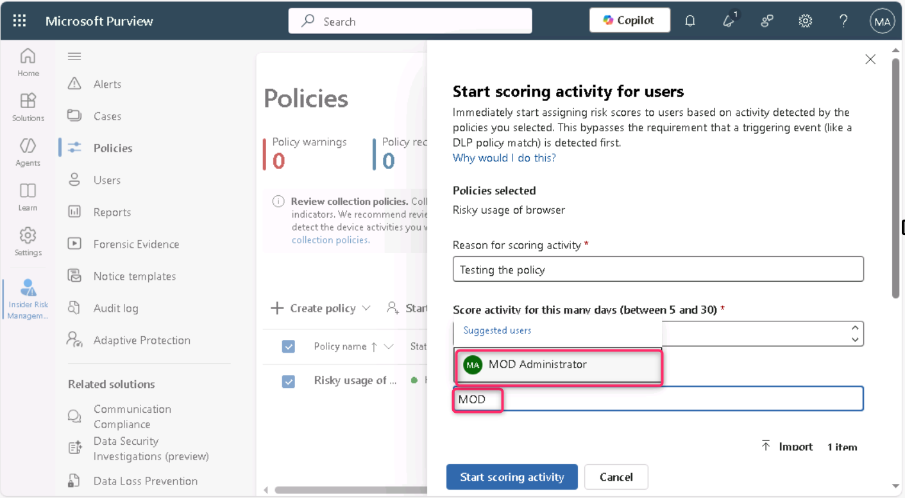

4.  그런 다음 **Start scoring activity** 버튼을 클릭하세요.

> 

5.  **Close** 버튼을 클릭하세요.

> 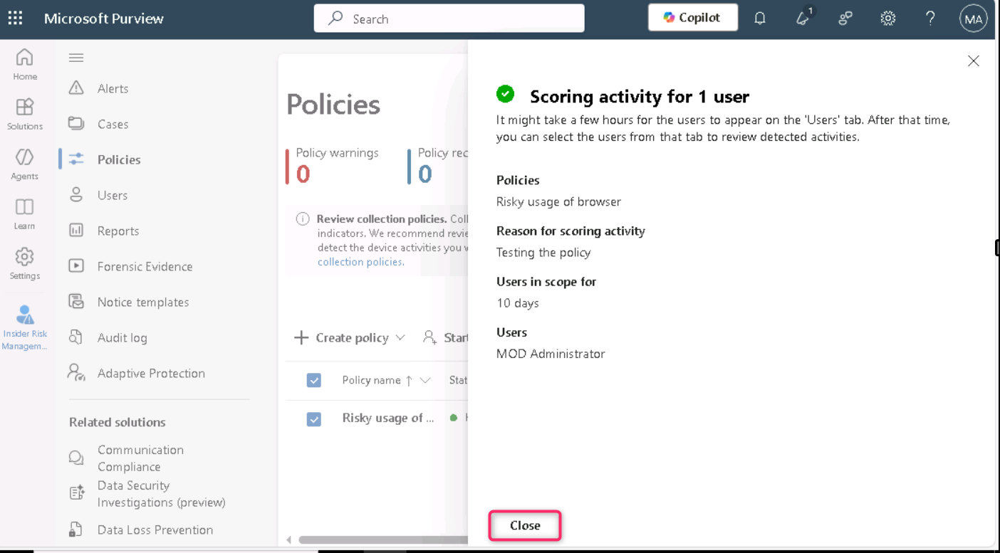

**작업 2 – 퇴사하는 사용자의 데이터 유출 탐지**

**단계 1 – 새로운 정책 생성**

1.  **Policies** 페이지에서 **+ Create policy**를 클릭한 후 **Custom policy**를 선택하세요.

> 

2.  Choose a policy template 페이지에서 Data theft by departing users를 Data theft 아래에서 선택하세요. 계속하려면 Next를 선택하세요.

> 

3.  **Name and description** 페이지에서 다음 필드를 입력하세요:

    - Name: Data theft by a user

    - Description: This is a test policy for preventing data theft

4.  계속하려면 **Next**를 선택하세요.

> 

5.  **Choose users, groups, & adaptive scopes** 페이지에서 \*\*All users, groups, and adaptive scopes\*\* 옆의 라디오 버튼을 선택한 후 **Next** 버튼을 클릭하세요.

\

6.  **Exclude users and groups (optional)** 페이지에서 **Next** 버튼을 클릭하세요.

\

6.  **Decide whether to prioritize content** 페이지에서 **I want to prioritize content**를 선택하세요. **Sensitivity labels**와 **Sensitive info types** 체크박스만 선택한 후 **Next**를 선택해 계속 진행하세요.

> 

7.  **Sensitivity labels to prioritize** 페이지에서 **Add or edit sensitivity labels**를 선택하세요. **Add or edit sensitivity labels** 검색창에 employee 를 입력하고 Enter 키를 누르세요. **Internal/Employee data (HR)**를 선택한 후 **Add**를 클릭하세요. 그런 다음 **Next**를 클릭해 계속 진행하세요.

8.  **Sensitive info types to prioritize** 페이지에서 **Add or edit sensitive info types**를 선택하세요. 플라이아웃 창에서 **Credit Card Number**, **Contoso Employee ID**, **Contoso Employee EDM**을 검색해 선택한 후 **Add**를 클릭하세요. 그런 다음 **Next**를 클릭해 계속 진행하세요.

> 

9.  **Decide whether to score only activity with priority content** 페이지에서 **Get alerts for all activity**가 선택되어 있는지 확인한 후 **Next** 버튼을 클릭하세요.

> 

10. **Choose triggering event for this policy** 페이지에서 기본 선택을 유지하고 **Next**를 클릭하세요.

> 

11. **Indicators** 페이지에서 **Office indicators (31/31 selected)** 옆의 드롭다운을 클릭하세요.

> 

12. 모든 Office indicators가 선택되어 있는지 확인한 후 **Next** 버튼을 클릭하세요.

> 

13. **Detection options** 페이지에서 모든 매개변수를 기본 상태로 유지한 후 **Next** 버튼을 클릭하세요.

> 

14. **Choose threshold type for indicators** 페이지에서 **Choose your own thresholds** 옆의 라디오 버튼을 선택한 후, 아래로 스크롤해 Office indicators 드롭다운을 클릭하세요.

> 
>
> 

15. **Sharing SharePoint files with people outside the organization** 항목에서 각 단계에 대해 순서대로 1, 2, 3 이벤트를 설정한 후 **Next**를 선택하세요.

> 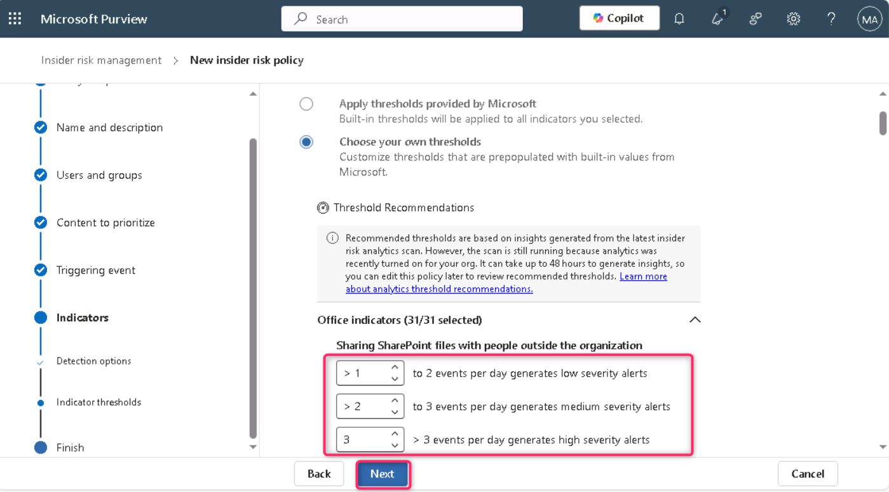

16. **Review settings and finish** 페이지에서 **Submit** 버튼을 클릭하세요.

> 

17. Your policy was created 페이지에서 Done을 선택하세요.

> 

**단계 2 – 정책 점수 매기기**

1.  새로 생성된 정책 **Data theft by a user**를 클릭하고, **Start scoring activity for users**를 선택하세요.

> 

2.  Reason for scoring activity 필드에 Testing the policy를 입력하세요. **Scoring activity for this many days (between 5 and 30)** 필드에서 **10 days**를 선택하세요.

> 

3.  Score activity for these users 필드에 MOD를 입력한 후 MOD administrator를 선택하세요.

> 

4.  그런 다음 **Start scoring activity** 버튼을 클릭하세요.

> 

5.  **Close** 버튼을 클릭하세요.

> 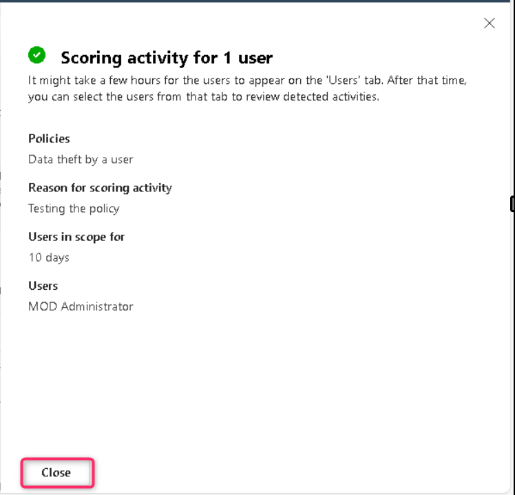

**작업 3 – 사용자의 데이터 유출 탐지**

**단계 1 – 새로운 정책 생성**

1.  **Policies** 페이지에서 **+ Create policy**를 클릭한 후 **Custom policy**를 선택하세요.

> 

2.  **Choose a policy template** 페이지에서 **Data leaks**를 **Data leaks** 항목 아래에서 선택하세요. 계속 진행하려면 **Next**를 클릭하세요.

> 

3.  **Name and description** 페이지에서 다음 필드를 입력하세요:

    - Name: Data leaks by a user

    - Description: This is a test policy for preventing data leaks

4.  계속 진행하려면 **Next**를 선택하세요.

> 

5.  **Choose users, groups, & adaptive scopes** 페이지에서 **All users, groups, and adaptive scopes** 라디오 버튼이 선택되어 있는지 확인한 후, 계속 진행하려면 **Next** 버튼을 클릭하세요.

> 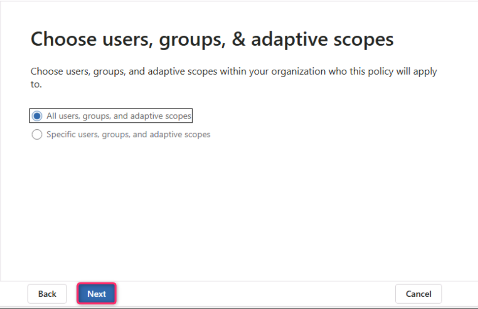
>
> **Exclude users and groups (optional)** 페이지에서 **Next** 버튼을 클릭하세요.

6.  **Decide whether to prioritize** 페이지에서 **I want to prioritize content**를 선택하세요. **SharePoint sites**, **Sensitivity labels**, **Sensitive info types** 체크박스를 선택한 후 **Next** 버튼을 클릭하세요.

> 

7.  **SharePoint sites to prioritize** 페이지에서 **Add or edit SharePoint sites**를 선택하세요. 플라이아웃 창에 https://WWLxXXXXXX.sharepoint.com/sites/ContosoWeb1를 입력한 후, **Contoso Web 1** 옆의 체크박스를 선택하고 **Add** 버튼을 클릭하세요. **그런** 다음** Next**를 클릭하세요.

> **참고**: **XXXXXX** Tenant Prefix는 **Resources** 탭에서 확인할 수 있습니다.
>
> 
>
> 
>
> 

8.  **Sensitivity labels to prioritize** 페이지에서 **Add or edit sensitivity labels**를 선택하세요. 플라이아웃 창에 employee를 입력한 후, Internal/Employee data (HR) 체크박스를 선택하고 **Add** 버튼을 클릭하세요. 그런 다음 **Next** 버튼을 클릭하세요.

> 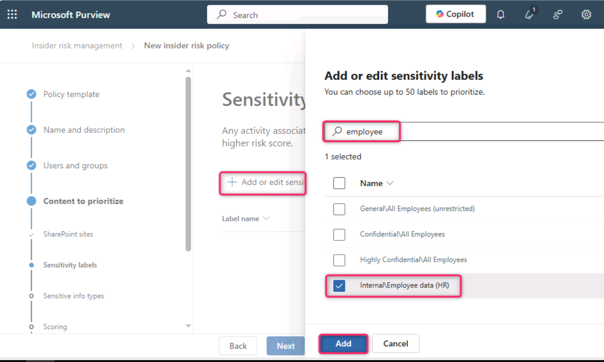
>
> 

9.  **Sensitive info types to prioritize** 페이지에서 **Add or edit sensitive info types**를 선택하세요. 플라이아웃 창에서 Credit Card Number, Contoso Employee ID, Contoso Employee EDM을 검색해 선택한 후 **Add**를 클릭하세요. 그런 다음 **Next**를 클릭하세요.

\

11. **Decide whether to score only activity with priority content** 페이지에서 **Get alerts for all activity**를 선택한 후 **Next**를 클릭하세요.

> 

12. **Choose triggering event for this policy** 페이지에서 **User performs an exfiltration activity** 옆의 라디오 버튼이 선택되어 있는지 확인하세요. **Select which activities will trigger this policy** 아래에서 **Download content from SharePoint**, **Sending email with attachments to recipients outside the organisation**, **Sharing SharePoint files with people outside the organization**를 선택한 후 **Next**를 클릭하세요.

> 
>
> 

13. **Choose thresholds for triggering events** 페이지에서 **Choose your own thresholds** 옆의 라디오 버튼을 선택하세요. 모든 임계값을 **1**로 설정한 후 **Next**를 클릭하세요.

> 
>
> 

14. **Indicators** 페이지에서 기본 설정을 그대로 유지한 후 **Next**를 선택하세요.

> 

15. **Detection options** 페이지에서 기본 설정을 그대로 유지한 후 **Next**를 선택하세요.

> 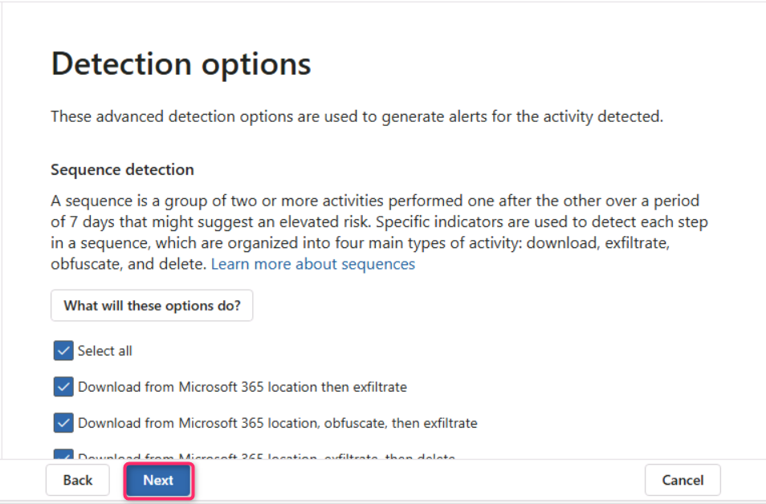

16. **Choose threshold type for indicators** 페이지에서 **Choose your own thresholds** 라디오 버튼이 선택되어 있는지 확인하세요. 그런 다음 Office indicators를 클릭하고, 각 단계에 대해 순서대로 1, 2, 3 이벤트를 설정한 후 **Next**를 선택하세요.

> 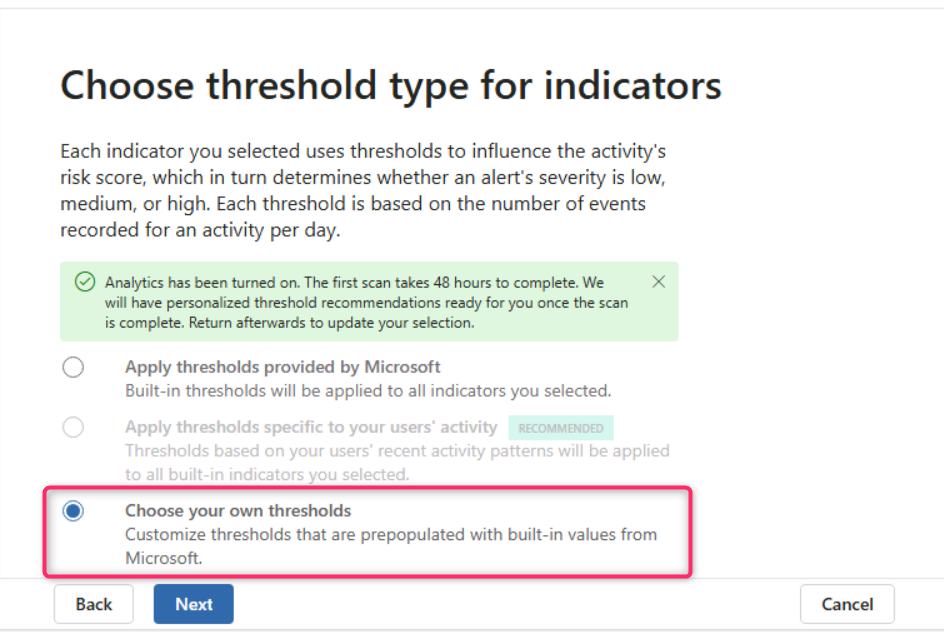
>
> 
>
> 

17. **Review settings and finish** 페이지에서 **Submit**을 선택하세요.

> 

18. Your policy was created 페이지에서 Done을 선택하세요.

> 

**단계 2 – 정책 점수 매기기**

1.  **Policies** 페이지에서 새로 생성된 정책 **Data leaks by a user** 옆의 체크박스를 선택한 후, **Start scoring activity for users**를 선택하세요.

> 

2.  **Reason for scoring activity** 필드에 Testing the policy를 입력하세요. **Scoring activity for this many days (between 5 and 30)** 필드에서 **10 days**를 선택하세요. Score activity for these users 필드에 MOD를 입력한 후 MOD administrator를 선택하세요.

> 
>
> 

3.  그런 다음 **Start scoring activity** 버튼을 클릭하세요.

> 

4.  **Close** 버튼을 클릭하세요.

> 

**요약:**

이 실습에서는 먼저 Microsoft Purview에서 Insider Risk Management를 위해 환경을 준비했습니다. VM의 시계를 동기화하고 필요한 사용자와 디바이스를 온보딩했으며, 분석 인사이트를 활성화하고 모든 대상 VM에서 Defender 안티멀웨어 클라이언트 버전을 확인했습니다. 디바이스 온보딩이 완료된 후, 세 가지 서로 다른 Insider Risk Management 정책을 생성하여 위험한 브라우저 사용, 퇴사 예정 사용자의 잠재적 데이터 도난, 내부 사용자의 데이터 유출과 관련된 활동을 모니터링하고 점수화했습니다. 각 정책은 우선 순위 콘텐츠로 민감도 레이블, SharePoint 사이트, 민감 정보 유형을 지정하고, 경고 및 점수를 트리거할 임계값을 구성했습니다. 마지막으로 점수화 활동을 시작하여 실제 내부자 위험 시나리오를 시뮬레이션하고, 구성된 정책의 효과를 평가했습니다.
