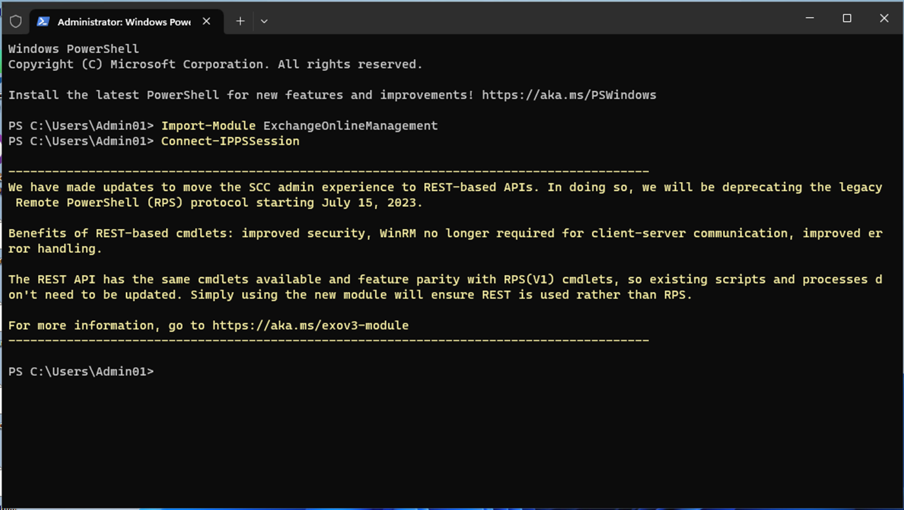
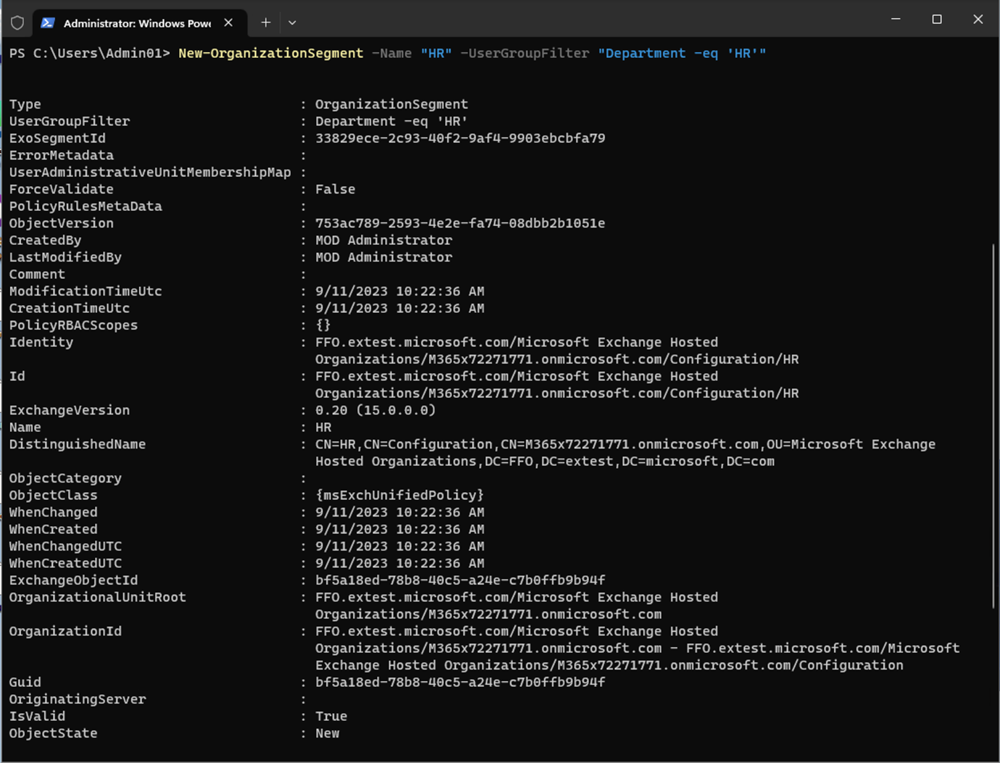
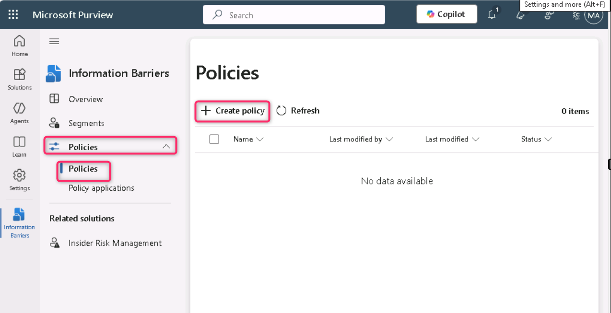
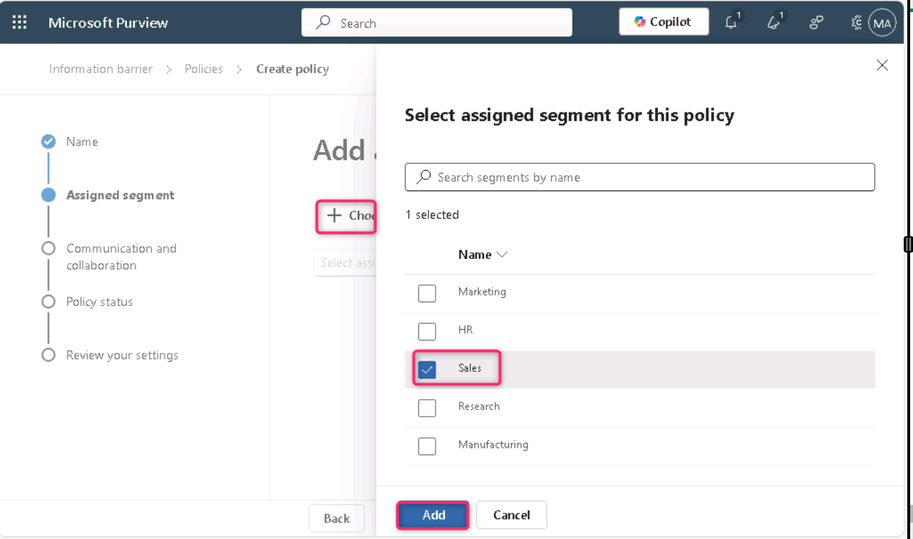
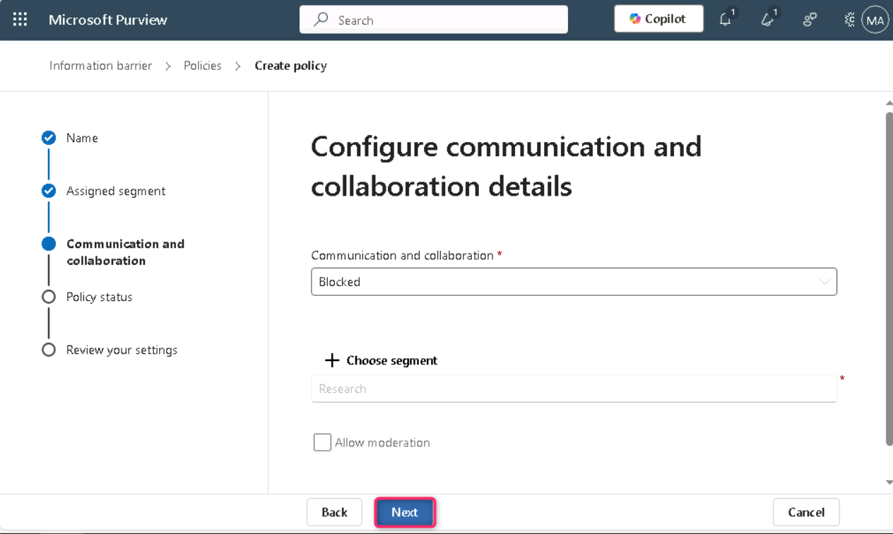
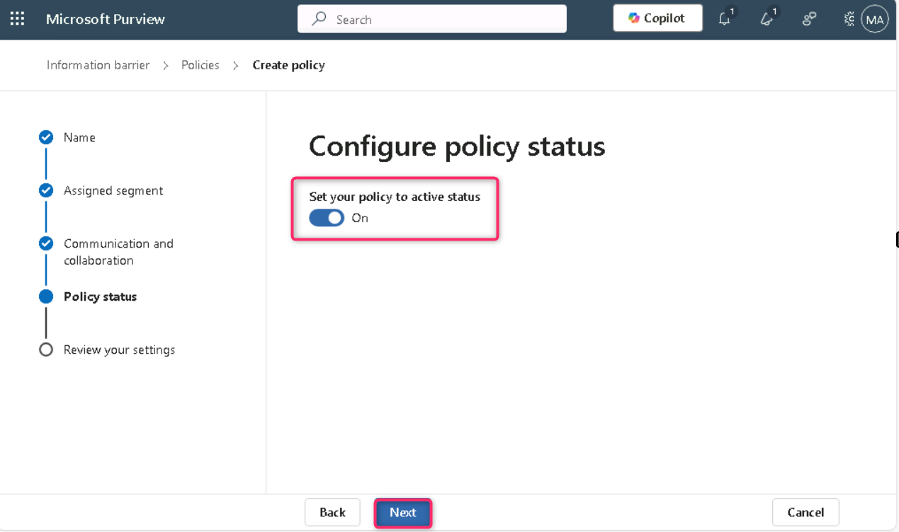
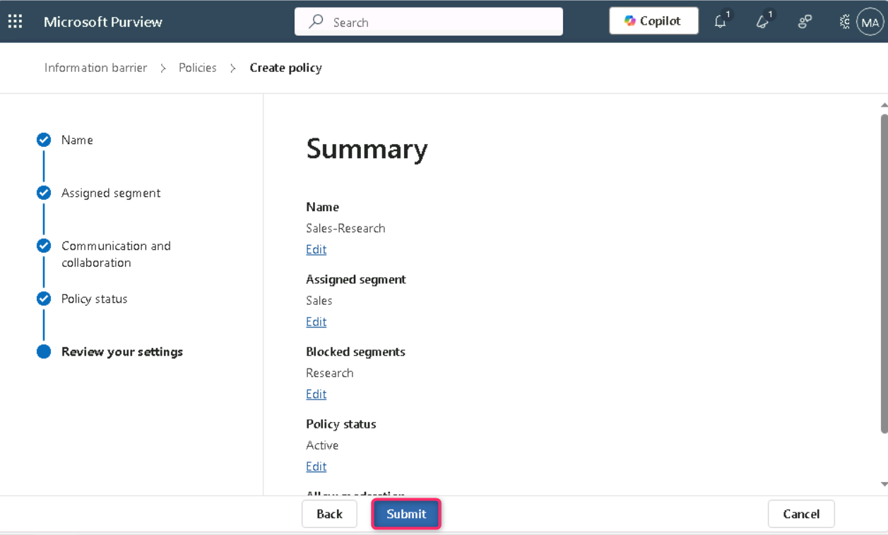
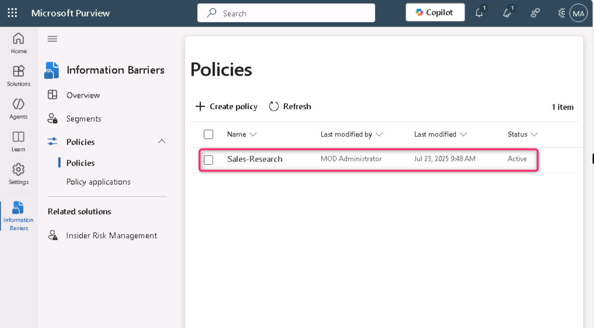

**실습 8 – 정보 차단(Information Barriers) 구성**

**소개**

Contoso에는 다섯 개 부서가 있습니다: *HR*, *Sales*, *Marketing*, *Research*, *Manufacturing*. 업계 규정을 준수하기 위해 일부 부서의 사용자는 다른 부서와 소통할 수 없으며, 아래 표와 같이 제한됩니다:

| **세그먼트** | **소통 가능한 부서** | **소통 불가 부서** |
|----|----|----|
| HR | 모두 | (제한 없음) |
| Sales | HR, Marketing Manufacturing | Research |
| Marketing | 모두 | (제한 없음) |
| Research | HR, Marketing, Manufacturing | Sales |
| Manufacturing | HR, Marketing | HR 또는 Marketing 이외의 모든 부서 |

이 구조에 대해 Contoso의 계획은 세 가지 IB 정책을 포함합니다:

1.  Sales와 Research 간의 소통을 차단하는 IB 정책

2.  Research와 Sales 간의 소통을 차단하는 IB 정책

3.  Manufacturing이 HR 및 Marketing과만 소통할 수 있도록 허용하는 IB 정책

**목표**

- PowerShell을 사용하여 Information Barriers (IB) 구현을 위한 조직 세그먼트 설정

- Microsoft Teams에서 범위 기반 디렉토리 검색을 활성화하여 세그먼트 기반 사용자 가시성 강제 적용

- Microsoft Purview 포털과 PowerShell을 사용해 Information Barrier (IB) 정책을 생성하고 세그먼트 간의 소통을 제어

**연습 1 – 전제 조건**

**작업 1 – 조직의 사용자 세그먼트 생성**

1.  Right click on Windows icon, then navigate and click on **Windows PowerShell (Admin)**. Windows 아이콘을 마우스 오른쪽 버튼으로 클릭한 후, **Windows PowerShell (Admin)**을 선택하세요.

> 

2.  **User Account Control** 대화 상자에서 **Yes** 버튼을 클릭하세요.

> 

3.  다음 명령어를 실행하세요:

> Install-Module ExchangeOnlineManagement

4.  만약 ‘**Do you want PowerShellGet to install and import the NuGet provider now?**’와 ‘**Are you sure you want to install the modules from 'PSGallery'?**’ ’라는 메시지가 표시되면 **y**를 입력하고 Enter를 누르세요.

> 

5.  다음 명령어를 실행하세요.

> Import-Module ExchangeOnlineManagement
>
> 

6.  이제 다음 명령어를 실행해 Exchange Online에 연결하세요.

> Connect-IPPSSession
>
> 

7.  실습 환경의 홈 페이지에 제공된 **MOD Administrator** 자격 증명을 사용해 로그인하세요.

> **참고**: 만약 **Automatically sign in to all desktop apps and websites on this device?** 대화 상자가 나타나면, **No, this app only** 버튼을 클릭하세요.
>
> 
>
> 

8.  **PowerShell**에서 다음 명령어들을 하나씩 실행해 조직 구조를 생성하세요.

> New-OrganizationSegment -Name "HR" -UserGroupFilter "Department -eq 'HR'"
>
> 
>
> New-OrganizationSegment -Name "Sales" -UserGroupFilter "Department -eq 'Sales'"
>
> New-OrganizationSegment -Name "Marketing" -UserGroupFilter "Department -eq 'Marketing'"
>
> New-OrganizationSegment -Name "Research" -UserGroupFilter "Department -eq 'Research'"
>
> New-OrganizationSegment -Name "Manufacturing" -UserGroupFilter "Department -eq 'Manufacturing'"

**작업 2 – Microsoft Teams에서 범위 기반 디렉토리 검색 활성화**

이름별 검색 활성화 방법

1.  https://admin.teams.microsoft.com으로 이동해 Microsoft Teams 관리 센터에 접속한 후, **Teams** \> **Teams settings**을 선택하세요.

> 

2.  **Search by name** 항목 아래에서 **Scope directory search using an Exchange address book policy** 옆의 토글을 **On**으로 설정한 후, **Save**을 선택하세요.

> 

3.  **Changes might take some time to take effect** 대화 상자가 나타나면,  **Confirm** 버튼을 클릭하세요.

> 

**연습 2 – IB 정책 생성**

**작업 1 – 세그먼트 간 소통 차단**

1.  Microsoft Purview 포털에서 **Solutions** \> **Information barriers**를 클릭하세요.

> 

2.  Information Barriers 블레이드에서 **Policies**를 클릭한 후, **Policies**를 선택하세요. **Policies** 페이지에서 **+ Create policy**를 클릭해 새로운 IB 정책을 생성하고 구성하세요.

> 

3.  **Provide a policy name** 페이지에서 Name 필드에 정책 이름을 Sales-Research로 입력한 후, **Next**를 선택하세요.

> 

4.  **Add assigned segment details** 페이지에서 **Choose segment**를 선택하세요.\
    **Select assigned segment for this policy** 창에서 **Sales**를 선택한 후, **Add**를 선택해 선택한 세그먼트를 정책에 추가하세요. (하나의 세그먼트만 선택할 수 있습니다.)

> 

5.  **Next**를 선택하세요.

> 

6.  **Configure Communication and collaboration details** 페이지에서 **Block**을 선택하세요. **Choose segment**를 선택한 후 **Research**를 선택하고, **Add**를 클릭하여 해당 세그먼트를 추가하세요.

> 
>
> 

7.  그런 다음 **Next** 버튼을 클릭하세요.

> 

8.  **Configure Policy status** 페이지에서 정책 상태를 **On**으로 설정한 후, **Next**를 선택해 계속 진행하세요.

> 

9.  **Review your settings** 페이지에서 정책에 대해 선택한 설정과 선택에 대한 제안 또는 경고를 확인한 후, **Submit**을 선택해 정책을 생성하세요.

> 

10. 정책이 생성되면 **Done**을 선택하세요.

> 

11. Sales-Research IB Policy가 성공적으로 생성되었습니다.

> 

**작업 2 – PowerShell을 통한 IB 정책 생성**

1.  **Administrator: Windows PowerShell**로 돌아가서 다음 명령어를 실행하세요:

> Import-Module ExchangeOnlineManagement
>
> 

2.  이제 다음 명령어를 실행해 Exchange Online에 연결하세요.

> Connect-IPPSSession
>
> 

3.  실습 환경의 홈 페이지에 제공된 **MOD Administrator** 자격 증명을 사용해 로그인하세요.

> **참고**: 만약 **Automatically sign in to all desktop apps and websites on this device?** 대화 상자가 나타나면, **No, this app only** 버튼을 클릭하세요.
>
> 
>
> 

4.  다음 명령어를 실행해 **Research-Sales**라는 IB 정책을 생성하세요. 이 정책이 활성화되고 적용되면, **Research** 세그먼트의 사용자들이 **Sales** 세그먼트의 사용자들과 소통하는 것을 차단하는 데 도움이 됩니다.

> New-InformationBarrierPolicy -Name "Research-Sales" -AssignedSegment "Research" -SegmentsBlocked "Sales" -State Inactive
>
> 
>
> 

5.  다음 명령어를 실행해 **Manufacturing-HRMarketing**이라는 IB 정책을 생성하세요. 이 정책이 활성화되고 적용되면, **Manufacturing**은 **HR**과 **Marketing**과만 소통할 수 있습니다. HR과 Marketing은 다른 세그먼트와 소통하는 데 제한이 없습니다.

> New-InformationBarrierPolicy -Name "Manufacturing-HRMarketing" -AssignedSegment "Manufacturing" -SegmentsAllowed "HR","Marketing","Manufacturing" -State Inactive
>
> 
>
> 

6.  Microsoft Purview 포털로 돌아가서 Information Barriers – Policies 페이지를 새로 고침하면, PowerShell을 사용해 생성한 정책들이 표시됩니다.

> 

**요약**

이 실습에서는 PowerShell을 사용해 HR, Sales, Marketing, Research, Manufacturing와 같은 조직 세그먼트를 생성하고, Microsoft Teams에서 범위 기반 디렉토리 검색을 활성화해 사용자 가시성을 세그먼트 제한에 맞게 설정했습니다. 이후 Microsoft Purview 내에서 특정 세그먼트 간의 소통을 차단하거나 허용하는 IB 정책을 구성했습니다 (예: Sales가 Research와 소통하지 못하도록 차단). 이 정책들은 포털과 PowerShell을 통해 실습하며 생성되었습니다.
