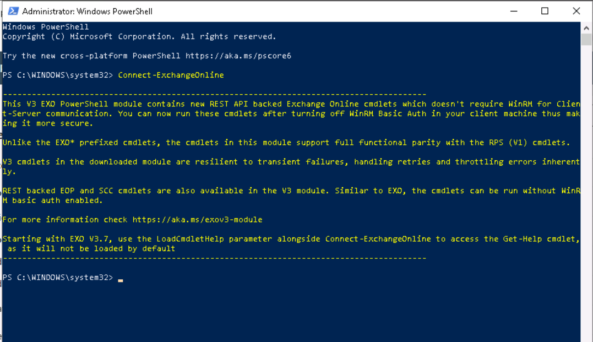
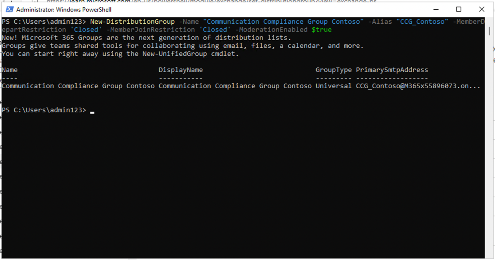
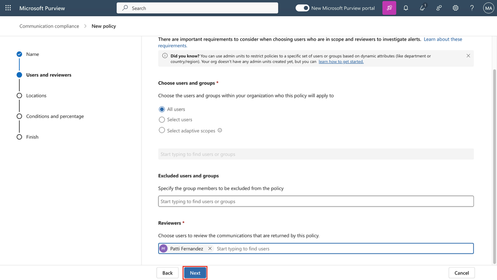
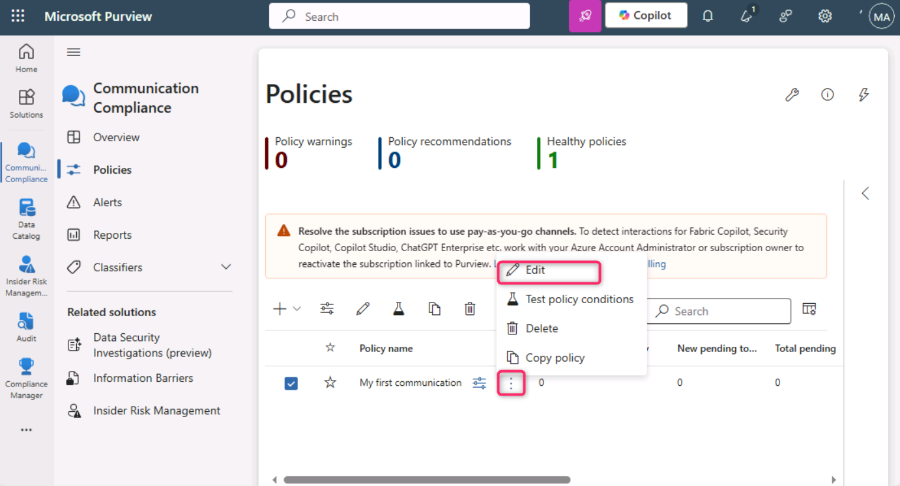
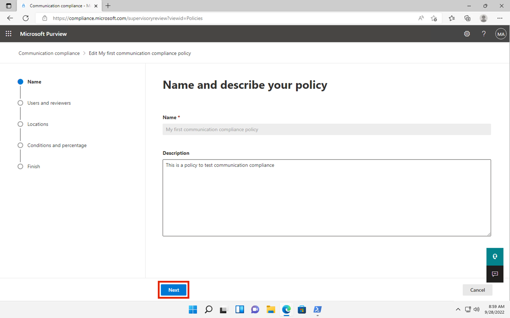
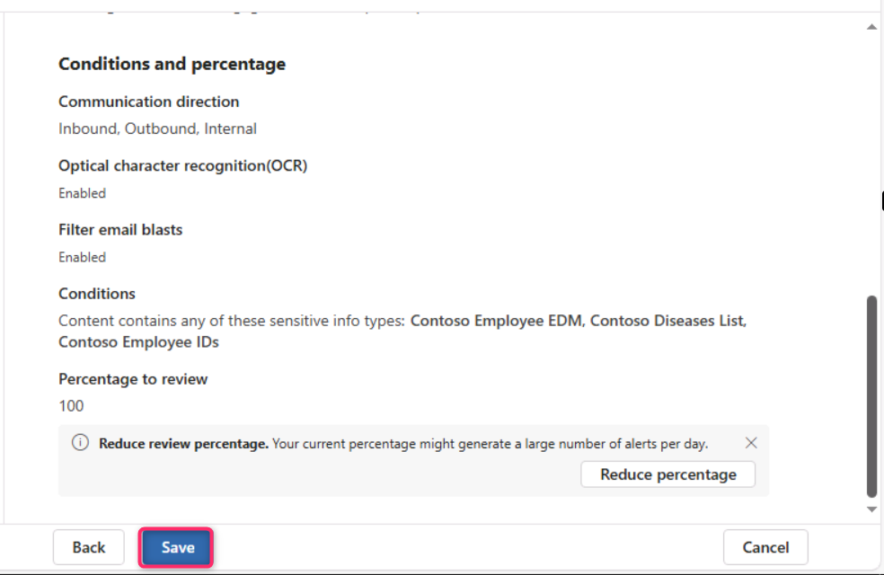
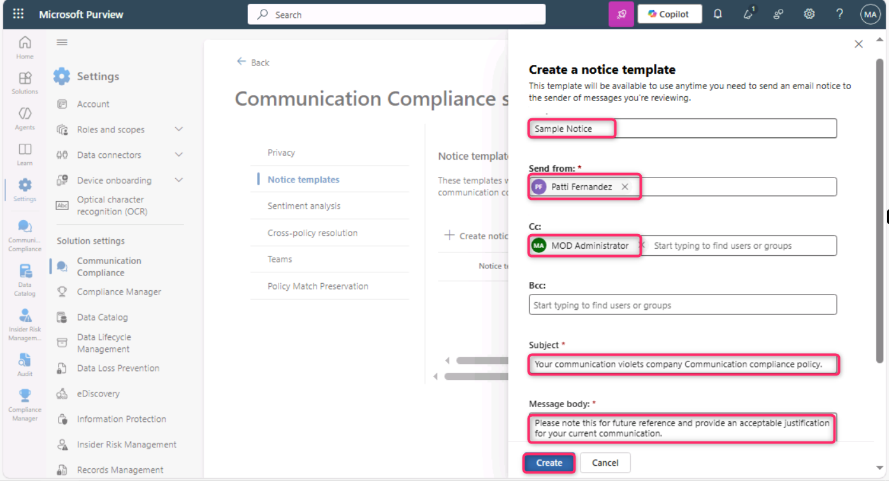

**실습 9 – 커뮤니케이션 컴플라이언스 구성**

**소개**

이 실습에서는 조직 내 사용자들이 민감한 정보를 커뮤니케이션하는 것을 감지하기 위한 컴플라이언스 정책을 구성합니다. 이전 실습에서 생성한 민감 정보 유형을 사용하여 직원 건강 데이터나 직원 ID가 이메일을 통해 전달되는지 감지합니다.

**목표**

- 커뮤니케이션 컴플라이언스 액세스를 위한 역할 할당

- PowerShell을 사용하여 배포 그룹 생성

- 커뮤니케이션 컴플라이언스 정책 구성 및 편집

- 익명화 및 사용자 알림 활성화

- 정책 테스트 프로세스 이해

**연습 1 – 커뮤니케이션 컴플라이언스 권한 활성화**

이 작업에서는 조직 내에서 커뮤니케이션 컴플라이언스 액세스 및 책임을 다양한 사용자에게 분배하기 위해 특정 역할 그룹에 사용자를 할당합니다.

1.  탐색 메뉴에서 **Settings**를 선택한 후, **Roles and scopes**를 선택하세요. 그 후 **Role groups**를 클릭하세요.

> 

2.  아래로 스크롤해 **Communication Compliance** 옆의 체크박스를 선택한 후, 연필 아이콘을 클릭해 편집하세요.

> 

3.  **Edit members of the role group** 페이지에서 **Choose Users**를 선택하세요.

> 

4.  **MOD Administrator**, **Megan Bowen**, **Patti Fernandez**를 선택한 후, **Select**를 클릭하세요.

> 

5.  **Next**를 선택하세요.

> 

6.  **Save**를 선택해 사용자를 역할 그룹에 추가한 후, **Done**을 선택해 단계를 완료하세요.

> 
>
> 

**연습 2 – 커뮤니케이션 컴플라이언스를 위한 그룹 설정**

정책에서는 이메일 주소를 사용하여 개인 또는 그룹을 식별합니다. 설정을 간소화하기 위해 커뮤니케이션을 검토할 사람들의 그룹과 그 커뮤니케이션을 검토하는 사람들의 그룹을 생성할 수 있습니다.

PowerShell을 사용해 할당된 그룹에 대한 글로벌 커뮤니케이션 컴플라이언스 정책을 위한 배포 그룹을 구성할 수 있습니다. 이를 통해 하나의 정책으로 수천 명의 사용자의 메시지를 감지하고, 새로운 직원이 조직에 합류할 때 커뮤니케이션 컴플라이언스 정책을 업데이트할 수 있습니다.

1.  Windows 아이콘을 마우스 오른쪽 버튼으로 클릭한 후, **Windows** **PowerShell** **(Admin)**을 선택하세요.

> 

2.  User Account Control 대화 상자에서 **Yes**를 선택하세요.

> 

3.  다음 cmdlet을 입력해 **Exchange Online PowerShell** 모듈을 사용하고 테넌트에 연결하세요:

> Connect-ExchangeOnline
>
> 

4.  **Sign in** 창이 표시되면 **MOD Administrator**로 로그인하세요. 만약 **Automatically sign in to all desktop apps and websites on this device?** 대화 상자가 나타나면, **No, this app only** 버튼을 선택하세요.

> 
>
> 

5.  다음 속성으로 글로벌 커뮤니케이션 컴플라이언스 정책을 위한 전용 배포 그룹을 생성하세요:

    - **MemberDepartRestriction = Closed**. 사용자가 자신을 배포 그룹에서 제거할 수 없도록 합니다.

    - **MemberJoinRestriction = Closed**. 사용자가 자신을 배포 그룹에 추가할 수 없도록 합니다.

    - **ModerationEnabled = True**. 이 그룹에 전송된 모든 메시지가 승인을 거쳐야 하며, 커뮤니케이션 컴플라이언스 정책 구성을 벗어나서 그룹이 사용되지 않도록 보장합니다.

> New-DistributionGroup -Name "Communication Compliance Group Contoso" -Alias "CCG_Contoso" -MemberDepartRestriction 'Closed' -MemberJoinRestriction 'Closed' -ModerationEnabled \$true

6.  

7.  **참고:** 조직 내 커뮤니케이션 컴플라이언스 정책에 추가된 사용자를 추적하려면, 다음 명령어처럼 **Exchange Custom Attribute**를 추가할 수 있습니다.

8.  Set-DistributionGroup -Identity "Communication Compliance Group Contoso" -CustomAttribute1 "MonitoredCommunication"

9.  

10. 위 스크립트를 주기적으로 실행하도록 설정하려면, PowerShell 스크립트를 예약 작업으로 설정할 수 있습니다:

11. \$Mbx = (Get-Mailbox -RecipientTypeDetails UserMailbox -ResultSize Unlimited -Filter {CustomAttribute9 -eq \$Null})

12. \$i = 0

13. ForEach (\$M in \$Mbx)

14. {

15. Write-Host "Adding" \$M.DisplayName

16. Add-DistributionGroupMember -Identity "Communication Compliance Group Contoso" -Member \$M.DistinguishedName -ErrorAction SilentlyContinue

17. Set-Mailbox -Identity \$M.Alias -CustomAttribute1 "MonitoredCommunication"

18. \$i++

19. }

20. Write-Host \$i "Mailboxes added to supervisory review distribution group."

> 

21. 스크립트에서 출력이 생성된 후, 새 탭을 열고 다음 URL을 입력해 Microsoft 365 관리 센터를 여세요: https://admin.cloud.microsoft/ 

> **다단계 인증(MFA)** 설정을 요청하는 메시지가 나타나면, **Skip for now**을 선택하세요.

22. Microsoft 365 관리 센터 페이지에서 다음 경로로 이동하세요: **Teams & groups** \> **Active teams & groups** \> **Distribution list** \> **Communication** Compliance Group Contoso를 클릭하세요.\*\*

> 

23. 오른쪽에 표시되는 Communication Compliance 창에서 **Members** 탭을 클릭하고, 아래로 스크롤하여 배포 목록 그룹에 속한 모든 구성원을 확인하세요.

\

\

**연습 3 – 커뮤니케이션 컴플라이언스 정책 생성**

1.  Microsoft Purview 포털에서 **Solutions** \> **Communication Compliance**를 선택하세요.

> 

2.  **Communication Compliance** 블레이드에서 **Policies**를 클릭한 후, **Policies** 페이지에서 **+ Create policy**를 선택하고, **Custom policy**를 클릭하세요.

> 

3.  **Name** 필드에 My first communication compliance policy를 입력하고, **Description** 필드에 This is a policy to test communication compliance를 입력한 후, **Next**를 선택하세요.

> 

4.  **Choose users and reviewers** 페이지에서 **Reviewers** 섹션까지 스크롤한 후, **Patti Fernandez**를 입력하고 선택하세요. 그런 다음, **Next** 버튼을 클릭하세요.

> 

5.  **Choose locations to detect communications** 페이지에서 **Microsoft 365 locations** 아래의 모든 체크박스가 선택되어 있는지 확인한 후, **Next** 버튼을 클릭하세요.

> 

6.  **Choose conditions and review percentage** 페이지에서 아래로 스크롤해 **Add condition**을 선택한 후, **Content contains sensitive info types**를 선택하세요.

> 

7.  **Content contains any of these sensitive info types** 상자에서 **Add**를 선택하고, **Sensitive info types**를 클릭한 후, **contoso**를 검색하세요. 이전 실습에서 생성한 모든 **민감 정보 유형**의 체크박스를 선택한 후, **Add**를 클릭하세요.

> 

8.  아래로 스크롤해 **Use OCR to extract text from images** 옆의 체크박스를 선택한 후, **Review percentage**를 **100%**로 설정하고, **Next** 버튼을 클릭하세요.

> 

9.  **Review and finish** 페이지에서 **Create policy**를 선택하세요.

> 

10. **Your policy was created** 페이지가 표시되며, 정책이 활성화되는 시점과 캡처될 커뮤니케이션에 대한 지침이 안내됩니다. 이후 **Done** 버튼을 클릭하세요.

> 

**연습 4 – 커뮤니케이션 컴플라이언스 정책 편집**

1.  **Communication Compliance – Policies** 페이지에서 **My first communication compliance policy** 옆의 점 3개를 클릭한 후, **Edit**을 선택하세요.

> **참고**: 만약 My first communication compliance policy가 보이지 않으면, 페이지를 새로 고침하세요.
>
> 

2.  이전에 설정한 대로 **Name**과 **Description**을 유지한 후, **Next** 버튼을 클릭하세요.

> 

3.  **Choose users and reviewers** 페이지에서 **Select users** 옆의 라디오 버튼을 선택하세요.

> 

4.  **Start typing to find users or groups** 필드에 **Communication**을 입력하고, **Communication Compliance Groups Contoso**를 선택하세요.

> 

5.  **Reviewers** 섹션에서 MOD Administrator를 입력하고 선택한 후, **Next** 버튼을 클릭해 **Review and finish** 페이지로 이동하세요.

> 

6.  그런 다음, **Save** 버튼을 클릭하세요.

> 

**연습 5 – 알림 템플릿 생성 및 사용자 익명화 구성**

1.  Microsoft Purview 포털에서 오른쪽 상단의 **Settings**를 선택한 후, **Communication Compliance**를 클릭하세요.

> 

2.  **Communication Compliance settings – Privacy** 페이지에서 **Show anonymized versions of usernames** 옆의 라디오 버튼이 선택되어 있는지 확인한 후, **Save** 버튼을 클릭하세요.

> **참고**: 만약 **Save** 버튼이 활성화되지 않으면, 다른 기능의 라디오 버튼을 선택한 후 다시 **Show anonymized versions of usernames** 라디오 버튼을 선택하세요.
>
> 

3.  **Notice templates**를 선택한 후, **+** 기호를 클릭해 알림 템플릿을 생성하세요.

> 

4.  **Create a notice template** 페이지에서 다음 필드를 입력하세요:

    - Template name: Sample Notice

    - Send from: **Patti**를 입력하고, 드롭다운에서 **Patti Fernandez**를 선택하세요.

    - Cc: **MOD**를 입력하고, 드롭다운에서 **MOD Administrator**를 선택하세요.

    - Subject: Your communication violates company Communication compliance policy.

    - Message body: Please note this for future reference and provide an acceptable justification for your current communication.

5.  **Create**를 선택해 알림 템플릿을 생성하고 저장하세요.

> 

**연습 6 – 커뮤니케이션 컴플라이언스 정책 테스트**

시험 계정에서는 이메일을 보낼 수 있는 권한이 없지만, 자신의 라이선스를 가지고 있을 때 정책을 테스트하는 방법을 이해할 수 있도록 다음 단계를 확인할 수 있습니다. 이 단계를 수행할 수는 있지만, 현재 테넌트에서는 이메일이 수신자에게 전달되지 않습니다.

1.  새 InPrivate 창에서 주소 표시줄에 다음 URL을 입력해 Outlook을 여세요: https://outlook.office365.com/mail/. 그 후, 제공된 사용자 이름 adelev@WWLxXXXXXX.onmicrosoft.com과 **Resources** 탭에 제공된 사용자 비밀번호로 로그인하세요.

2.  개인 이메일 계정으로 다음 메시지 본문을 포함한 이메일을 전송하세요.

> Subject Line: Patti Fernandez (EMP123456) on Medical Leave Due to Flu
>
> Message body: Employee Patti Fernandez EMP123456 is on absence because of the flu/influenza
>
> 
>
> **참고:** 이메일 메시지는 정책에서 완전히 처리되는 데 약 24시간이 걸릴 수 있습니다. Microsoft Teams, Yammer 및 타사 플랫폼의 커뮤니케이션은 정책에서 완전히 처리되는 데 약 48시간이 걸릴 수 있습니다.

https://purview.microsoft.com/에 **Patti Fernandez**로 로그인하세요. **Communication compliance** \> **Alerts**로 이동하여, 24시간 후 정책에 대한 알림을 확인하세요.

**요약:**

이 실습에서는 Microsoft Purview에서 Communication Compliance를 구성하고 관리하는 방법을 배웠습니다. 필요한 역할을 할당하고, PowerShell을 사용하여 배포 그룹을 생성한 후, 내부 커뮤니케이션을 모니터링하기 위한 컴플라이언스 정책을 설정했습니다. 사용자 리뷰 중에 익명화를 활성화하여 사용자 식별 정보를 보호하고, 사용자 알림 템플릿을 생성했으며, 정책이 완전히 시행되기 전에 커뮤니케이션 컴플라이언스 정책을 시뮬레이션하고 테스트하는 방법을 이해했습니다.
