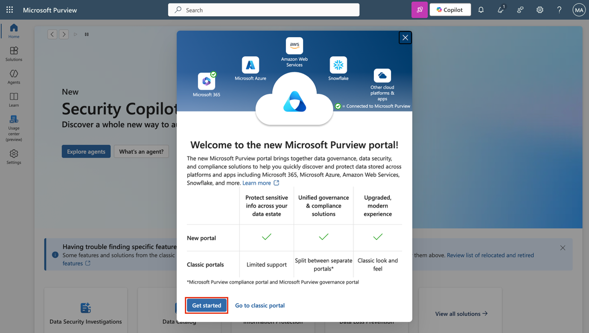
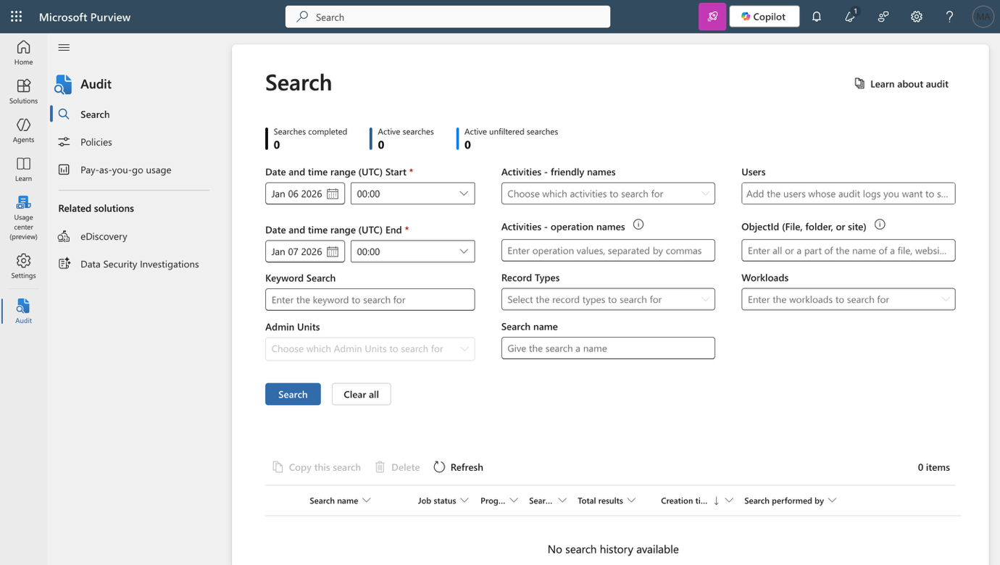
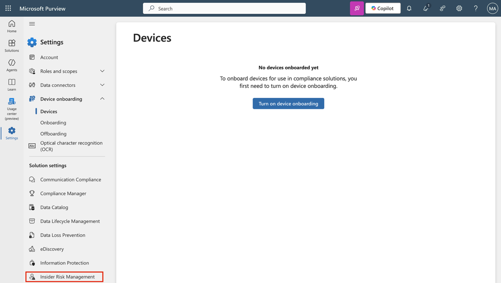
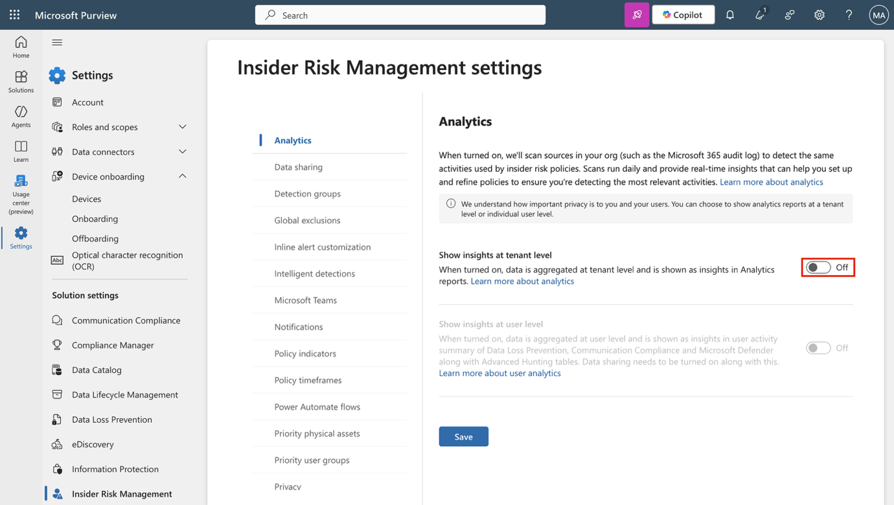
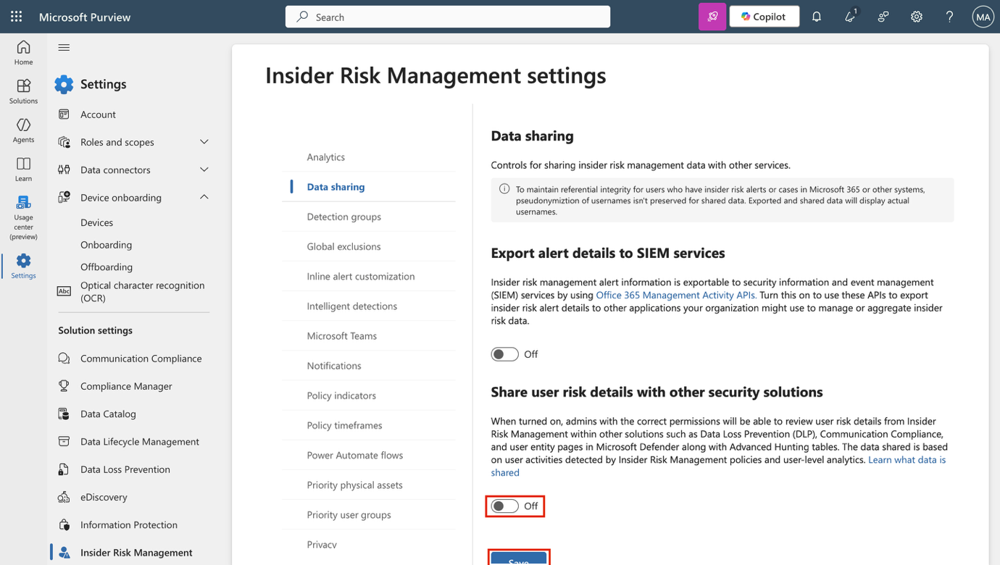
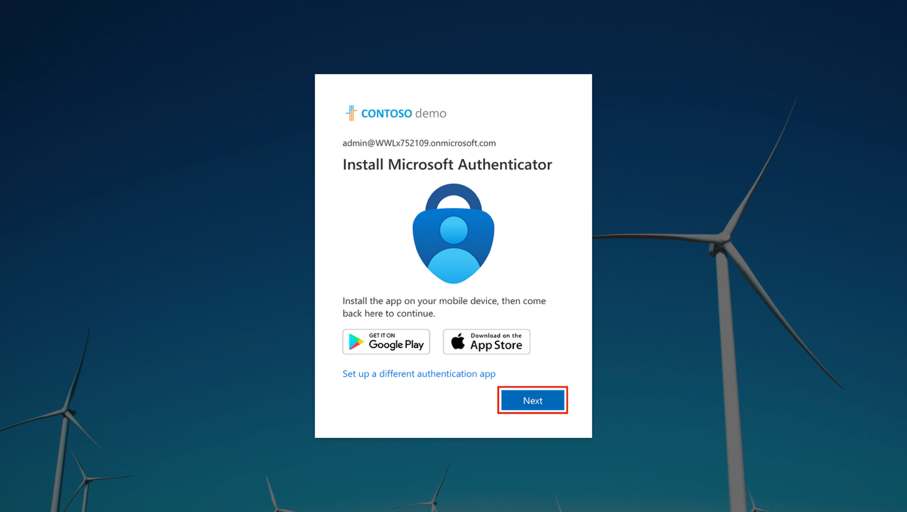
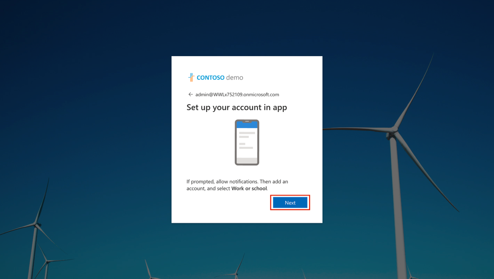
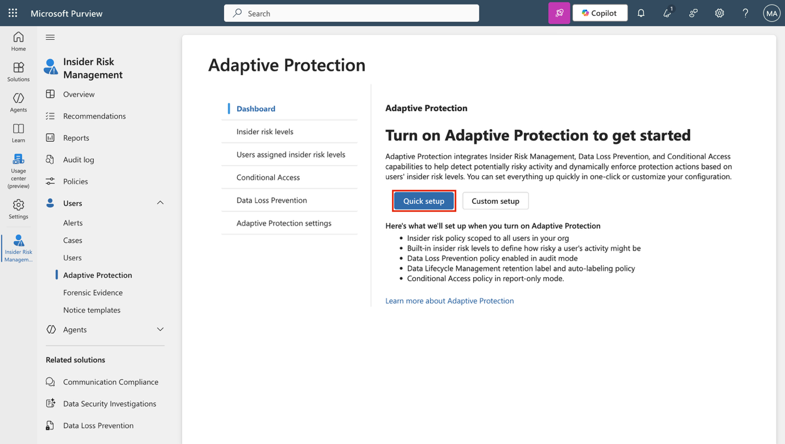

**실습 환경 설정 – 관리 작업을 위한 환경 준비**

이번 실습에서는 관리 작업을 위해 환경을 구성하고 준비합니다. 필요한 기능을 활성화하고, 권한을 구성하며, 관리용 핵심 서비스를 준비합니다.

**실습 과제:**

- Microsoft Purview 포털에서 감사(Audit) 활성화

- 디바이스 온보딩 활성화

- 내부자 위험 분석 및 데이터 공유 활성화

- Microsoft Defender XDR 초기화

- Microsoft Entra에서 다단계 인증(MFA) 구성

- Adaptive Protection 활성화

**연습 1 – Microsoft Purview 포털에서 감사(Audit) 활성화**

이번 작업에서는 Microsoft Purview 포털에서 감사 기능을 활성화해 포털 활동을 모니터링합니다.

1.  실습 환경의 Resources 탭에 제공된 **Admin 계정** 자격 증명을 사용하여 VM에 로그인하세요.

2.  **Microsoft Edge**를 열고 https://purview.microsoft.com으로 이동한 후, **MOD Administrator**, admin@TenantName 계정으로 로그인하세요. (Tenant 이름과 관리자 암호는 실습 환경의 Resources 탭에서 확인할 수 있습니다.)

3.  화면에 새 Microsoft Purview 포털에 대한 안내 메시지가 나타나면, **Get started**를 선택해 새 포털에 접근하세요.

> 

4.  왼쪽 사이드바에서 **Solutions**를 선택한 후, **Audit**를 선택하세요.

> 

5.  **Search** 페이지에서 **Start recording user and admin activity** 바를 선택해 감사 로깅을 활성화하세요..

> 

6.  이 옵션을 선택하면, 페이지에서 파란색 표시줄이 사라지는 것을 확인할 수 있습니다.

> 

이로써** Microsoft 365에서 감사 기능을 성공적으로 활성화했습니다.**

**연습 2 – 디바이스 온보딩 활성화**

이번 작업에서는 조직에서 디바이스 온보딩을 활성화합니다.

1.  VM에 **Admin** 계정으로 로그인되어 있으며, Microsoft Purview에서도 MOD Administrator 계정으로 로그인되어 있어야 합니다.

2.  왼쪽 탐색 메뉴에서 **Settings**를 선택한 후, **Device onboarding**을 확장하세요.

3.  **Device onboarding** 페이지에서 **Devices**를 선택하세요.

> 

4.  **Devices** 페이지에서 **Turn on device onboarding**을 선택한 후, 확인 창에서 **Ok**를 선택하세요.

> 

5.  메시지가 나타나면, **OK**를 선택해 디바이스 모니터링이 활성화됨을 확인하세요.

> 

이제 디바이스 온보딩이 활성화되어, Endpoint DLP 정책으로 보호할 디바이스를 온보딩할 수 있습니다. 기능 활성화 과정은 최대 30분 정도 소요될 수 있습니다.

**연습 3 – 내부자 위험 분석 및 데이터 공유 활성화**

이번 작업에서는 내부자 위험 관리를 위해 분석과 데이터 공유를 활성화합니다.

1.  Microsoft Purview에서 **Settings \> Insider Risk Management \> Analytics**로 이동하세요.

> 

2.  다음 설정을 **On**으로 전환하세요:

    - **Show insights at tenant level**

    - **Show insights at user level**

3.  페이지 하단에서 **Save**를 선택하세요.

> 

4.  왼쪽 탐색 메뉴에서 **Data sharing**을 선택하세요.

> 

5.  **Data sharing** 섹션에서 **Share user risk details with other security solutions**를 **On**으로 전환하세요.

6.  페이지 하단에서 **Save**를 선택하세요.

> 

이제 내부자 위험 관리를 위한 분석 및 데이터 공유가 활성화되었습니다.

**연습 4 – Microsoft Defender XDR 초기화**

이번 작업에서는 Microsoft Defender로 이동해 Microsoft Defender XDR가 초기화될 때까지 기다립니다.

1.  **Microsoft Edge**에서 <https://security.microsoft.com/>에 접속하여 Microsoft Defender를 여세요.

2.  탐색 메뉴에서 **Investigation & response \> Incidents & alerts \> Incidents**를 선택하세요.

> 
>
> \[!Note\] **참고: Microsoft Defender XDR 초기화**
>
> Microsoft Defender XDR 초기화 화면은 실습용 테넌트에 따라 표시되지 않을 수도 있습니다.

3.  Microsoft Defender XDR가 준비되고 있다는 메시지가 표시됩니다. 이 과정은 자동으로 진행되며 몇 분 정도 걸릴 수 있습니다.

> 

Microsoft Defender XDR가 초기화되는 동안 다른 작업을 계속 진행할 수 있습니다.

**연습 5 – Microsoft Entra에서 다단계 인증(MFA) 구성**

이번 작업에서는 관리자 계정에 대한 다단계 인증(MFA)을 구성하여 Microsoft Entra 및 연결된 다른 Microsoft 365 서비스 접근을 보호합니다.

1.  **Microsoft Edge**에서 https://entra.microsoft.com/에 접속하여 Microsoft Entra를 열고, **Admin** 계정 자격 증명으로 로그인하세요. 'Lets keep your account secure' 메시지가 표시되면, **Next**를 선택하세요.

> 

2.  **Start by getting the app** 화면에서, 기기의 앱 스토어에서 **Microsoft Authenticator** 앱을 설치하거나 이미 설치되어 있다면 앱을 여세요. 그 후 **Next**를 선택하세요.

> 

- 다른 앱을 사용하려면 **I want to use a different authenticator app**를 선택하고 화면에 표시되는 안내를 따릅니다.

3.  **Set up your account** 화면에서, 휴대폰의 안내에 따라 알림을 허용한 후 **Next**를 선택하세요.

> 

- 이미 Microsoft Authenticator 앱이 설치되어 있고 구성되어 있는 경우, 이 화면이 표시되지 않을 수 있습니다. 그럴 경우, 다음 단계로 진행하세요.

4.  **Scan the QR code** 화면에서, 기기의 Microsoft Authenticator 앱을 사용해 화면에 표시된 QR 코드를 스캔한 후, **Next**를 선택하세요.

> 

5.  휴대폰에서 브라우저에 표시된 번호를 입력하여 로그인 요청을 승인하세요.

6.  요청을 승인하면 **Notification approved** 화면이 나타납니다. **Next**를 선택하세요.

7.  **Success!** 화면에서 **Default sign-in method**가 **Microsoft Authenticator**로 표시되는지 확인한 후, **Done**을 선택하세요.

8.  다시 로그인하라는 메시지가 표시되면, 휴대폰에서 로그인 요청을 승인하여 본인 인증을 완료하세요.

9.  인증이 완료되면 **Microsoft Entra admin center**로 리디렉션됩니다.

이로써 Microsoft Entra에서 관리자 계정에 대한 다단계 인증(MFA) 구성을 성공적으로 완료하고 확인했습니다.

**연습 6 – Adaptive Protection 활성화**

1.  Microsoft Edge에서 https://purview.microsoft.com에 접속해 **MOD Administrator** 계정으로 Purview 포털에 로그인하세요.

2.  왼쪽 탐색 메뉴에서 **Solutions \> Insider risk management \> User \> Adaptive Protection**를 선택한 후, **Dashboard**를 선택하세요. 이어서 **Quick setup**을 선택하세요.

> 

3.  설정 진행 중이라는 메시지가 표시됩니다. 기능을 활성화하는 데 최대 72시간이 소요됩니다. 이 기능은 8번째 실습에서 Adaptive Protection 기능을 탐색할 때 사용합니다.

> 

4.  **Adaptive Protection settings** 탭을 선택하고, **Adaptive Protection** 토글 버튼을 켠 후 **Save**를 선택하세요.

> 

이로써 Microsoft Purview에서 Adaptive Protection을 성공적으로 활성화했습니다.
